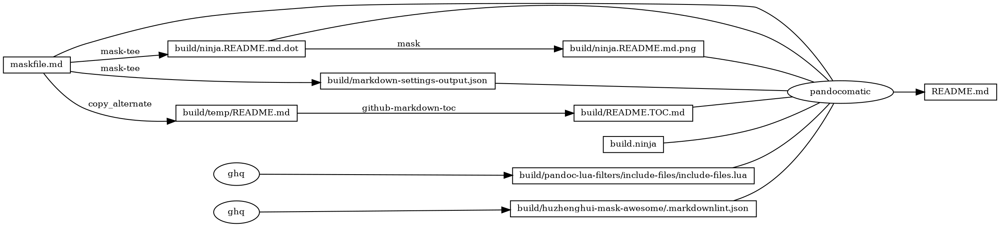
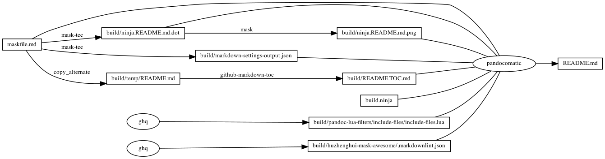

# markdownlint

<!-- markdownlint-disable MD007 MD030 -->

-   [markdownlint](#markdownlint)
-   [.markdownlint.json](#markdownlintjson)
-   [MD025 - Multiple top level headings in the same
    document](#md025---multiple-top-level-headings-in-the-same-document)
-   [MD041 - First line in file should be a top level
    heading](#md041---first-line-in-file-should-be-a-top-level-heading)
-   [MD046 - Code block style](#md046---code-block-style)
-   [Mask SubCommands](#mask-subcommands)
    -   [markdown-settings](#markdown-settings)
        -   [markdown-settings-output](#markdown-settings-output)
    -   [begin: mask task in template](#begin-mask-task-in-template)
    -   [readme](#readme)
        -   [build.ninja](#buildninja)
        -   [ninja custom-rule](#ninja-custom-rule)
        -   [ninja custom-build](#ninja-custom-build)
    -   [readme-graph-dot](#readme-graph-dot)
        -   [readme-graph-dot-output](#readme-graph-dot-output)
    -   [readme-graph-dot-xdot](#readme-graph-dot-xdot)
    -   [readme-graph-png](#readme-graph-png)
    -   [end: mask task in template](#end-mask-task-in-template)

<!-- markdownlint-enable MD007 MD030 -->

# .markdownlint.json

``` json
{
    "MD025": false,
    "MD041": false,
    "MD046": {
        "style": "fenced"
    }
}
```

# MD025 - Multiple top level headings in the same document

[MD025 - Multiple top level headings in the same
document](https://github.com/DavidAnson/markdownlint/blob/main/doc/Rules.md#md025)

When the document contains multiple top-level headings and second-level
headings, the tool Mask cannot recognize sub-commands. So only the last
top-level heading contains the second-level heading that is recognized
as sub-commands. All previous content use top-level headings. So
multiple top-level headings are allowed in the document.

# MD041 - First line in file should be a top level heading

[MD041 - First line in file should be a top level
heading](https://github.com/DavidAnson/markdownlint/blob/main/doc/Rules.md#md041)

Due to the use of Front Matter, the first line is not a top-level
heading. So this rule is disabled.

# MD046 - Code block style

[MD046 - Code block
style](https://github.com/DavidAnson/markdownlint/blob/main/doc/Rules.md#md046)

Use fenced code block style.

# Mask SubCommands

[Mask Awesome](https://github.com/huzhenghui/mask-awesome)

## markdown-settings

``` bash
json5 "${HOME}/Library/Application Support/Code/User/settings.json" |
    jq 'to_entries|map(select(.key=="[markdown]"))|from_entries'
```

### markdown-settings-output

``` json
{
  "[markdown]": {
    "editor.codeActionsOnSave": {
      "source.fixAll.markdownlint": true
    }
  }
}
```

## begin: mask task in template

## readme

``` bash
ninja --verbose README.md
```

### build.ninja

``` ninja
builddir=./build
mask_subcommand = --help

#######################################
# begin: rule in template

rule mask
  command = mask $mask_subcommand

rule mask-tee
  command = mask $mask_subcommand 2>&1 | tee $out 1> /dev/null

rule pandocomatic
  command = pandocomatic --input $in --output $out

rule ghq
  command = ghq get --update "$repository" && $
    find -d "$link_dirname" -exec rmdir {} \; && $
    ln -Fs "$$(ghq list --full-path $repository)" "$link_dirname"
  generator = 1

rule github-markdown-toc
  command = gh-md-toc --hide-header --hide-footer --no-escape $in > $out

rule copy_alternate
  command = if [[ -f "$alternate" ]]; $
    then $
      cp "$alternate" "$out"; $
    else $
      cp "$in" "$out"; $
    fi;

# end: rule in template
#######################################

#######################################
# start snippet custom-rule

# custom rule here

# end snippet custom-rule
#######################################

#######################################
# begin: build in template

build ./build/ninja.README.md.dot : mask-tee | ./maskfile.md
  mask_subcommand = readme-graph-dot

build ./build/ninja.README.md.png : mask | ./build/ninja.README.md.dot
  mask_subcommand = readme-graph-png

build ./build/pandoc-lua-filters/include-files/include-files.lua : ghq
  repository = https://github.com/pandoc/lua-filters
  link_dirname = ./build/pandoc-lua-filters

build ./build/temp/README.md : copy_alternate ./maskfile.md
  alternate = ./README.md

build ./build/README.TOC.md : github-markdown-toc ./build/temp/README.md

# end: build in template
#######################################

#######################################
# start snippet custom-build

build ./build/markdown-settings-output.json : mask-tee | ./maskfile.md
  mask_subcommand = markdown-settings

build ./build/huzhenghui-mask-awesome/.markdownlint.json : ghq
  repository = https://github.com/huzhenghui/mask-awesome
  link_dirname = ./build/huzhenghui-mask-awesome

# end snippet custom-build
#######################################

#######################################
# begin: build README.md
# $ followed by a newline
# escape the newline (continue the current line across a line break).
# the first 4 line in this build is template
build README.md : pandocomatic maskfile.md | $
  build.ninja $
  ./build/ninja.README.md.dot $
  ./build/ninja.README.md.png $
  ./build/pandoc-lua-filters/include-files/include-files.lua $
  ./build/README.TOC.md $
  ./build/markdown-settings-output.json $
  ./build/huzhenghui-mask-awesome/.markdownlint.json

default README.md
# end: build README.md
#######################################
```

### ninja custom-rule

``` ninja
# custom rule here

```

### ninja custom-build

``` ninja
build ./build/markdown-settings-output.json : mask-tee | ./maskfile.md
  mask_subcommand = markdown-settings

build ./build/huzhenghui-mask-awesome/.markdownlint.json : ghq
  repository = https://github.com/huzhenghui/mask-awesome
  link_dirname = ./build/huzhenghui-mask-awesome

```

## readme-graph-dot

``` bash
ninja -t graph README.md
```

### readme-graph-dot-output



## readme-graph-dot-xdot

``` bash
detach -- xdot "${MASKFILE_DIR}/build/ninja.README.md.dot"
```

## readme-graph-png

``` bash
dot -Tpng -o./build/ninja.README.md.png ./build/ninja.README.md.dot
```



## end: mask task in template
