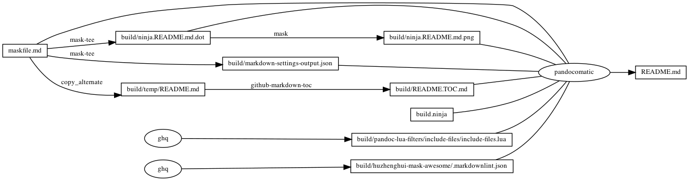

---
pandocomatic_:
    pandoc:
        from: markdown-smart
        to: gfm
        filter:
        - pandoc-include-code
        lua-filter:
        - ./build/pandoc-lua-filters/include-files/include-files.lua
        output: README.md
...

# markdownlint

<!-- markdownlint-disable MD007 MD030 -->
```{.include}
./build/README.TOC.md
```
<!-- markdownlint-enable MD007 MD030 -->

# .markdownlint.json

```{.json include=./build/huzhenghui-mask-awesome/.markdownlint.json}
```

# MD025 - Multiple top level headings in the same document

[MD025 - Multiple top level headings in the same document](https://github.com/DavidAnson/markdownlint/blob/main/doc/Rules.md#md025)

When the document contains multiple top-level headings and second-level headings,
    the tool Mask cannot recognize sub-commands.
So only the last top-level heading contains the second-level heading
    that is recognized as sub-commands.
All previous content use top-level headings.
So multiple top-level headings are allowed in the document.

# MD041 - First line in file should be a top level heading

[MD041 - First line in file should be a top level heading](https://github.com/DavidAnson/markdownlint/blob/main/doc/Rules.md#md041)

Due to the use of Front Matter, the first line is not a top-level heading.
So this rule is disabled.

# MD046 - Code block style

[MD046 - Code block style](https://github.com/DavidAnson/markdownlint/blob/main/doc/Rules.md#md046)

Use fenced code block style.

# Mask SubCommands

[Mask Awesome](https://github.com/huzhenghui/mask-awesome)

## markdown-settings

```bash
json5 "${HOME}/Library/Application Support/Code/User/settings.json" |
    jq 'to_entries|map(select(.key=="[markdown]"))|from_entries'
```

### markdown-settings-output

```{.json include=./build/markdown-settings-output.json}
```

## begin: mask task in template

## readme

```bash
ninja --verbose README.md
```

### build.ninja

```{.ninja include=./build.ninja}

```

### ninja custom-rule

```{.ninja include=build.ninja snippet=custom-rule}

```

### ninja custom-build

```{.ninja include=build.ninja snippet=custom-build}

```

## readme-graph-dot

```bash
ninja -t graph README.md
```

### readme-graph-dot-output

```{.dot include=./build/ninja.README.md.dot}

```

## readme-graph-dot-xdot

```bash
detach -- xdot "${MASKFILE_DIR}/build/ninja.README.md.dot"
```

## readme-graph-png

```bash
dot -Tpng -o./build/ninja.README.md.png ./build/ninja.README.md.dot
```



## end: mask task in template
