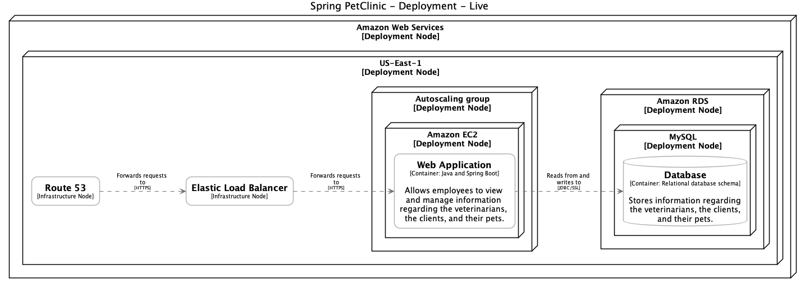
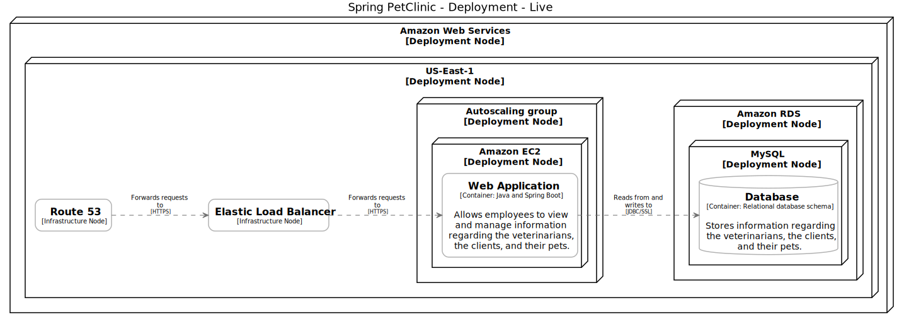

# Tasks

## download-example

```bash
wget https://raw.githubusercontent.com/structurizr/dsl/master/examples/amazon-web-services.dsl
```

## diff-fix

```bash
diff ./amazon-web-services.dsl ./amazon-web-services-fix.dsl
```

### diff

```diff
45c45
<                 background "#ffffff"
---
>                 background #ffffff
55d54
<         themes https://static.structurizr.com/themes/amazon-web-services-2020.04.30/theme.json
```

## structurizr-export

```bash
structurizr-cli export --format plantuml export --workspace ./amazon-web-services-fix.dsl --output .
```

## plantuml-gui

```bash
plantuml -gui ./structurizr-AmazonWebServicesDeployment.puml
```

## plantuml-png

```bash
plantuml -tpng ./structurizr-AmazonWebServicesDeployment.puml
```



## plantuml-svg

```bash
plantuml -tsvg ./structurizr-AmazonWebServicesDeployment.puml
```



## plantuml-eps

```bash
plantuml -teps ./structurizr-AmazonWebServicesDeployment.puml
```

## plantuml-txt

```bash
plantuml -ttxt ./structurizr-AmazonWebServicesDeployment.puml
```

## plantuml-utxt

```bash
plantuml -tutxt ./structurizr-AmazonWebServicesDeployment.puml
```
