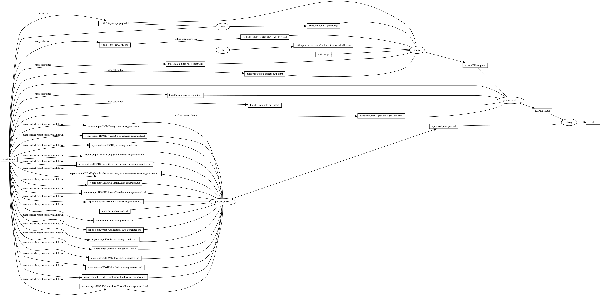

---
pandocomatic_:
    pandoc:
        from: markdown-smart
        to: gfm
        filter:
        - pandoc-include-code
        lua-filter:
        - ./build/pandoc-lua-filters/include-files/include-files.lua
        output: README.md
...

# agedu

<!-- markdownlint-disable MD007 MD030 -->
```{.include}
./build/README.TOC/README.TOC.md
```
<!-- markdownlint-enable MD007 MD030 -->

# Mask SubCommands

[Mask Awesome](https://github.com/huzhenghui/mask-awesome)

## agedu-version

```bash
agedu --version
```

### agedu-version-output

```{.plain include=./build/agedu-version-output.txt}
```

## snakemake

```bash
snakemake --cores all
```

### Snakefile

```{.Snakefile include=./Snakefile}
```

## snakemake-snakefile

```bash
snakemake --snakefile $(ghq list --full-path https://github.com/huzhenghui/mask-awesome)/agedu/Snakefile --cores all
```

## web

```bash
cd ./report-output/index/
file="$(
    find . -type f | \
        /usr/local/opt/choose-gui/bin/choose
)"
agedu --file "${file}" --files --web --auth none
```

## agedu-help

```bash
agedu --help
```

### agedu-help-output

<!-- markdownlint-disable MD013 -->
```{.plain include=./build/agedu-help-output.txt}
```
<!-- markdownlint-enable MD013 -->

## scan-home

```bash
sudo agedu --progress --file ./report-output/agedu-home.dat --scan "$(cd ~; pwd)"
```

## scan-root

```bash
sudo agedu --progress --file ./report-output/agedu-root.dat \
    --prune-path '/System/Volumes/Data' --scan /
sudo chown "${USER}" ./report-output/agedu-root.dat
```

## remove-root

```bash
agedu --file ./report-output/agedu-root.dat --remove
```

## dump-root

```bash
agedu --file ./report-output/agedu-root.dat --dump | $PAGER
```

## html-root

```bash
agedu --file ./report-output/agedu-root.dat --files --html '/' | browser
```

## report

```bash
ninja --verbose ./report-output/report.md
```

## text-root

```bash
agedu --file ./report-output/agedu-root.dat --files --depth 1 --text '/'
```

## text-root-Applications

```bash
agedu --file ./report-output/agedu-root.dat --files --depth 1 --text '/Applications'
```

## text-root-Users

```bash
agedu --file ./report-output/agedu-root.dat --files --depth 1 --text '/Users'
```

## text-HOME

```bash
agedu --file ./report-output/agedu-root.dat --files --depth 1 --text "${HOME}"
```

## text-HOME--local

```bash
agedu --file ./report-output/agedu-root.dat --files --depth 1 --text "${HOME}/.local"
```

## text-HOME--local-share

```bash
agedu --file ./report-output/agedu-root.dat --files --depth 1 --text "${HOME}/.local/share"
```

## text-HOME--local-share-Trash

```bash
agedu --file ./report-output/agedu-root.dat --files --depth 1 --text "${HOME}/.local/share/Trash"
```

## text-HOME--local-share-Trash-files

```bash
agedu --file ./report-output/agedu-root.dat --files --depth 1 --text "${HOME}/.local/share/Trash/files"
```

## text-HOME--vagrant-d

```bash
agedu --file ./report-output/agedu-root.dat --files --depth 1 --text "${HOME}/.vagrant.d"
```

## text-HOME--vagrant-d-boxes

```bash
agedu --file ./report-output/agedu-root.dat --files --depth 1 --text "${HOME}/.vagrant.d/boxes"
```

## text-HOME-ghq

```bash
agedu --file ./report-output/agedu-root.dat --files --depth 1 --text "${HOME}/ghq"
```

## text-HOME-ghq-github-com

```bash
agedu --file ./report-output/agedu-root.dat --files --depth 1 --text "${HOME}/ghq/github.com"
```

## text-HOME-ghq-github-com-huzhenghui

```bash
agedu --file ./report-output/agedu-root.dat --files --depth 1 --text "${HOME}/ghq/github.com/huzhenghui"
```

## text-HOME-ghq-github-com-huzhenghui-mask-awesome

```bash
agedu --file ./report-output/agedu-root.dat --files --depth 1 --text "${HOME}/ghq/github.com/huzhenghui/mask-awesome"
```

## text-HOME-Library

```bash
agedu --file ./report-output/agedu-root.dat --files --depth 1 --text "${HOME}/Library"
```

## text-HOME-Library-Containers

```bash
agedu --file ./report-output/agedu-root.dat --files --depth 1 --text "${HOME}/Library/Containers"
```

## text-HOME-OneDrive

```bash
agedu --file ./report-output/agedu-root.dat --files --depth 1 --text "${HOME}/OneDrive"
```

## man-agedu

```bash
man agedu
```

### man-agedu-output

<!-- markdownlint-disable MD012 MD013 -->
<!-- vale Spell.Spell = NO -->
```{.include}
./build/man/man-agedu.auto-generated.md
```
<!-- vale Spell.Spell = YES -->
<!-- markdownlint-enable MD012 MD013 -->

## begin: mask task in template : build content

## ninja-rules

```bash
ninja -t rules
```

### ninja custom-rule

```{.ninja include=build.ninja snippet=custom-rule}
```

### ninja-rules-output

```{.plain include=./build/ninja/ninja-rules-output.txt}
```

## ninja-targets

```bash
ninja -t targets all
```

### ninja build-all

```{.ninja include=build.ninja snippet=build-all}
```

### ninja custom-build

```{.ninja include=build.ninja snippet=custom-build}
```

### ninja report-build

```{.ninja include=build.ninja snippet=report-build}
```

### ninja-targets-output

```{.plain include=./build/ninja/ninja-targets-output.txt}
```

## readme-md

```bash
ninja --verbose README.md
```

### ninja readme-build

```{.ninja include=build.ninja snippet=custom-readme-build}

```

```{.ninja include=build.ninja snippet=readme-build}

```

## end: mask task in template : build content

## begin: mask task in template : ninja command

## ninja-browse

```bash
ninja -t browse
```

## ninja-graph-png

```bash
dot -Tpng -o./build/ninja/ninja.graph.png ./build/ninja/ninja.graph.dot
```



## ninja-graph-dot-xdot

```bash
detach -- xdot "${MASKFILE_DIR}/build/ninja/ninja.graph.dot"
```

## ninja-graph-dot

```bash
ninja -t graph
```

### ninja-graph-dot-output

```{.dot include=./build/ninja/ninja.graph.dot}

```

## ninja-all

```bash
ninja --verbose
```

### build.ninja

```{.ninja include=./build.ninja}

```

## end: mask task in template : ninja command
