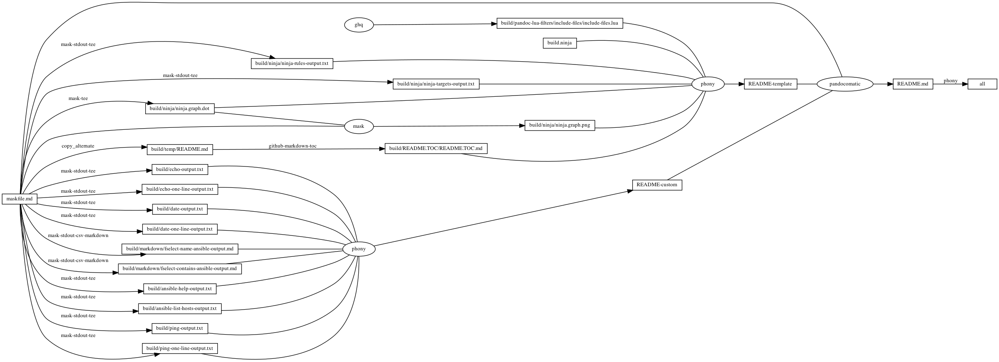

# ansible

<!-- markdownlint-disable MD007 MD030 -->

-   [ansible](#ansible)
-   [Mask SubCommands](#mask-subcommands)
    -   [inventory](#inventory)
    -   [ansible-list-hosts](#ansible-list-hosts)
        -   [ansible-list-hosts-output](#ansible-list-hosts-output)
    -   [ping](#ping)
        -   [ping-output](#ping-output)
    -   [ping-one-line](#ping-one-line)
        -   [ping-one-line-output](#ping-one-line-output)
    -   [echo](#echo)
        -   [echo-output](#echo-output)
    -   [echo-one-line](#echo-one-line)
        -   [echo-one-line-output](#echo-one-line-output)
    -   [date](#date)
        -   [date-output](#date-output)
    -   [date-one-line](#date-one-line)
        -   [date-one-line-output](#date-one-line-output)
    -   [fselect-name-ansible](#fselect-name-ansible)
        -   [fselect-name-ansible-output](#fselect-name-ansible-output)
    -   [fselect-contains-ansible](#fselect-contains-ansible)
        -   [fselect-contains-ansible-output](#fselect-contains-ansible-output)
    -   [ansible-help](#ansible-help)
        -   [ansible-help-output](#ansible-help-output)
    -   [begin: mask task in template : build
        content](#begin-mask-task-in-template--build-content)
    -   [ninja-rules](#ninja-rules)
        -   [ninja custom-rule](#ninja-custom-rule)
        -   [ninja-rules-output](#ninja-rules-output)
    -   [ninja-targets](#ninja-targets)
        -   [ninja build-all](#ninja-build-all)
        -   [ninja custom-build](#ninja-custom-build)
        -   [ninja report-build](#ninja-report-build)
        -   [ninja-targets-output](#ninja-targets-output)
    -   [readme-md](#readme-md)
        -   [ninja readme-build](#ninja-readme-build)
    -   [end: mask task in template : build
        content](#end-mask-task-in-template--build-content)
    -   [begin: mask task in template : ninja
        command](#begin-mask-task-in-template--ninja-command)
    -   [ninja-browse](#ninja-browse)
    -   [ninja-graph-png](#ninja-graph-png)
    -   [ninja-graph-dot-xdot](#ninja-graph-dot-xdot)
    -   [ninja-graph-dot](#ninja-graph-dot)
        -   [ninja-graph-dot-output](#ninja-graph-dot-output)
    -   [ninja-all](#ninja-all)
        -   [build.ninja](#buildninja)
    -   [end: mask task in template : ninja
        command](#end-mask-task-in-template--ninja-command)

<!-- markdownlint-enable MD007 MD030 -->

# Mask SubCommands

[Mask Awesome](https://github.com/huzhenghui/mask-awesome)

## inventory

``` bash
cat /etc/ansible/hosts
```

## ansible-list-hosts

``` bash
ansible all --list-hosts
```

### ansible-list-hosts-output

``` plain
  hosts (1):
    server1
```

## ping

``` bash
ansible all --module-name=ping
```

### ping-output

``` plain
server1 | SUCCESS => {
    "ansible_facts": {
        "discovered_interpreter_python": "/usr/bin/python"
    },
    "changed": false,
    "ping": "pong"
}
```

## ping-one-line

``` bash
ansible all --one-line --module-name=ping
```

### ping-one-line-output

<!-- markdownlint-disable MD013 -->

``` plain
server1 | SUCCESS => {"ansible_facts": {"discovered_interpreter_python": "/usr/bin/python"},"changed": false,"ping": "pong"}
```

<!-- markdownlint-enable MD013 -->

## echo

``` bash
ansible all --args="/bin/echo hello"
```

### echo-output

``` plain
server1 | CHANGED | rc=0 >>
hello
```

## echo-one-line

``` bash
ansible all --one-line --args="/bin/echo hello"
```

### echo-one-line-output

``` plain
server1 | CHANGED | rc=0 | (stdout) hello
```

## date

``` bash
ansible all --args="/bin/date"
```

### date-output

``` plain
server1 | CHANGED | rc=0 >>
Sun Mar 14 18:34:16 CST 2021
```

## date-one-line

``` bash
ansible all --one-line --args="/bin/date"
```

### date-one-line-output

``` plain
server1 | CHANGED | rc=0 | (stdout) Sun Mar 14 18:34:16 CST 2021
```

## fselect-name-ansible

``` bash
cd "$(git root)"
echo -e "path\tsize\tmime\tline_count"
fselect "concat('[../', path, '](../', path, ')'), size, mime, line_count \
    from . gitignore \
    where name like '%ansible%' \
    order by path"
```

### fselect-name-ansible-output

<!-- markdownlint-disable MD013 -->

| path                                                                                                                                             | size | mime            | line\_count |
|--------------------------------------------------------------------------------------------------------------------------------------------------|------|-----------------|-------------|
| [.././.vale/Vocab/ansible.txt](.././.vale/Vocab/ansible.txt)                                                                                     | 7    | text/plain      | 0           |
| [.././ansible](.././ansible)                                                                                                                     | 96   | inode/directory |             |
| [.././ansible/ansible](.././ansible/ansible)                                                                                                     | 288  | inode/directory |             |
| [.././ansible/ansible/build/ansible-help-output.txt](.././ansible/ansible/build/ansible-help-output.txt)                                         | 0    | text/plain      | 0           |
| [.././ansible/ansible/build/ansible-list-hosts-output.txt](.././ansible/ansible/build/ansible-list-hosts-output.txt)                             | 0    | text/plain      | 0           |
| [.././ansible/ansible/build/markdown/fselect-contains-ansible-output.md](.././ansible/ansible/build/markdown/fselect-contains-ansible-output.md) | 0    | text/plain      | 0           |
| [.././ansible/ansible/build/markdown/fselect-name-ansible-output.md](.././ansible/ansible/build/markdown/fselect-name-ansible-output.md)         | 0    | text/plain      | 0           |

<!-- markdownlint-enable MD013 -->

## fselect-contains-ansible

``` bash
cd "$(git root)"
echo -e "path\tsize\tmime\tline_count"
fselect "concat('[../', path, '](../', path, ')'), size, mime, line_count \
    from . gitignore \
    where contains(ansible) = true \
    order by path"
```

### fselect-contains-ansible-output

<!-- markdownlint-disable MD013 -->

| path                                                                                                                                     | size  | mime              | line\_count |
|------------------------------------------------------------------------------------------------------------------------------------------|-------|-------------------|-------------|
| [.././.vale/Spell/Spell.yml](.././.vale/Spell/Spell.yml)                                                                                 | 386   | text/plain        | 17          |
| [.././.vale/Vocab/ansible.txt](.././.vale/Vocab/ansible.txt)                                                                             | 7     | text/plain        | 0           |
| [.././.vscode/extension/.favorites.json](.././.vscode/extension/.favorites.json)                                                         | 13204 | text/plain        | 424         |
| [.././ansible/ansible/README.md](.././ansible/ansible/README.md)                                                                         | 29421 | text/plain        | 854         |
| [.././ansible/ansible/build.ninja](.././ansible/ansible/build.ninja)                                                                     | 7578  | text/plain        | 239         |
| [.././ansible/ansible/build/markdown/fselect-name-ansible-output.md](.././ansible/ansible/build/markdown/fselect-name-ansible-output.md) | 1632  | text/plain        | 9           |
| [.././ansible/ansible/build/ninja/ninja-targets-output.txt](.././ansible/ansible/build/ninja/ninja-targets-output.txt)                   | 917   | text/plain        | 21          |
| [.././ansible/ansible/build/ninja/ninja.graph.dot](.././ansible/ansible/build/ninja/ninja.graph.dot)                                     | 3985  | text/vnd.graphviz | 76          |
| [.././ansible/ansible/maskfile.md](.././ansible/ansible/maskfile.md)                                                                     | 4098  | text/plain        | 264         |

<!-- markdownlint-enable MD013 -->

## ansible-help

``` bash
ansible --help
```

### ansible-help-output

``` plain
usage: ansible [-h] [--version] [-v] [-b] [--become-method BECOME_METHOD]
               [--become-user BECOME_USER] [-K] [-i INVENTORY] [--list-hosts]
               [-l SUBSET] [-P POLL_INTERVAL] [-B SECONDS] [-o] [-t TREE] [-k]
               [--private-key PRIVATE_KEY_FILE] [-u REMOTE_USER]
               [-c CONNECTION] [-T TIMEOUT]
               [--ssh-common-args SSH_COMMON_ARGS]
               [--sftp-extra-args SFTP_EXTRA_ARGS]
               [--scp-extra-args SCP_EXTRA_ARGS]
               [--ssh-extra-args SSH_EXTRA_ARGS] [-C] [--syntax-check] [-D]
               [-e EXTRA_VARS] [--vault-id VAULT_IDS]
               [--ask-vault-password | --vault-password-file VAULT_PASSWORD_FILES]
               [-f FORKS] [-M MODULE_PATH] [--playbook-dir BASEDIR]
               [-a MODULE_ARGS] [-m MODULE_NAME]
               pattern

Define and run a single task 'playbook' against a set of hosts

positional arguments:
  pattern               host pattern

optional arguments:
  --ask-vault-password, --ask-vault-pass
                        ask for vault password
  --list-hosts          outputs a list of matching hosts; does not execute
                        anything else
  --playbook-dir BASEDIR
                        Since this tool does not use playbooks, use this as a
                        substitute playbook directory.This sets the relative
                        path for many features including roles/ group_vars/
                        etc.
  --syntax-check        perform a syntax check on the playbook, but do not
                        execute it
  --vault-id VAULT_IDS  the vault identity to use
  --vault-password-file VAULT_PASSWORD_FILES, --vault-pass-file VAULT_PASSWORD_FILES
                        vault password file
  --version             show program's version number, config file location,
                        configured module search path, module location,
                        executable location and exit
  -B SECONDS, --background SECONDS
                        run asynchronously, failing after X seconds
                        (default=N/A)
  -C, --check           don't make any changes; instead, try to predict some
                        of the changes that may occur
  -D, --diff            when changing (small) files and templates, show the
                        differences in those files; works great with --check
  -M MODULE_PATH, --module-path MODULE_PATH
                        prepend colon-separated path(s) to module library (def
                        ault=~/.ansible/plugins/modules:/usr/share/ansible/plu
                        gins/modules)
  -P POLL_INTERVAL, --poll POLL_INTERVAL
                        set the poll interval if using -B (default=15)
  -a MODULE_ARGS, --args MODULE_ARGS
                        module arguments
  -e EXTRA_VARS, --extra-vars EXTRA_VARS
                        set additional variables as key=value or YAML/JSON, if
                        filename prepend with @
  -f FORKS, --forks FORKS
                        specify number of parallel processes to use
                        (default=5)
  -h, --help            show this help message and exit
  -i INVENTORY, --inventory INVENTORY, --inventory-file INVENTORY
                        specify inventory host path or comma separated host
                        list. --inventory-file is deprecated
  -l SUBSET, --limit SUBSET
                        further limit selected hosts to an additional pattern
  -m MODULE_NAME, --module-name MODULE_NAME
                        module name to execute (default=command)
  -o, --one-line        condense output
  -t TREE, --tree TREE  log output to this directory
  -v, --verbose         verbose mode (-vvv for more, -vvvv to enable
                        connection debugging)

Privilege Escalation Options:
  control how and which user you become as on target hosts

  --become-method BECOME_METHOD
                        privilege escalation method to use (default=sudo), use
                        `ansible-doc -t become -l` to list valid choices.
  --become-user BECOME_USER
                        run operations as this user (default=root)
  -K, --ask-become-pass
                        ask for privilege escalation password
  -b, --become          run operations with become (does not imply password
                        prompting)

Connection Options:
  control as whom and how to connect to hosts

  --private-key PRIVATE_KEY_FILE, --key-file PRIVATE_KEY_FILE
                        use this file to authenticate the connection
  --scp-extra-args SCP_EXTRA_ARGS
                        specify extra arguments to pass to scp only (e.g. -l)
  --sftp-extra-args SFTP_EXTRA_ARGS
                        specify extra arguments to pass to sftp only (e.g. -f,
                        -l)
  --ssh-common-args SSH_COMMON_ARGS
                        specify common arguments to pass to sftp/scp/ssh (e.g.
                        ProxyCommand)
  --ssh-extra-args SSH_EXTRA_ARGS
                        specify extra arguments to pass to ssh only (e.g. -R)
  -T TIMEOUT, --timeout TIMEOUT
                        override the connection timeout in seconds
                        (default=10)
  -c CONNECTION, --connection CONNECTION
                        connection type to use (default=smart)
  -k, --ask-pass        ask for connection password
  -u REMOTE_USER, --user REMOTE_USER
                        connect as this user (default=None)

Some modules do not make sense in Ad-Hoc (include, meta, etc)
```

## begin: mask task in template : build content

## ninja-rules

``` bash
ninja -t rules
```

### ninja custom-rule

``` ninja
# custom rule here

```

### ninja-rules-output

``` plain
cmdshelf-repository
copy_alternate
dot
ghq
github-markdown-toc
jupyter-nbconvert-markdown
mask
mask-man-markdown
mask-screenshot
mask-stderr-tee
mask-stdout-csv-markdown
mask-stdout-json
mask-stdout-tee
mask-tee
pandocomatic
phony
```

## ninja-targets

``` bash
ninja -t targets all
```

### ninja build-all

``` ninja
build all: phony README.md

default all

```

### ninja custom-build

``` ninja
# custom build here

```

### ninja report-build

``` ninja
# report build here

```

### ninja-targets-output

``` plain
all: phony
build/pandoc-lua-filters/include-files/include-files.lua: ghq
build/ninja/ninja-rules-output.txt: mask-stdout-tee
build/ninja/ninja-targets-output.txt: mask-stdout-tee
build/ninja/ninja.graph.dot: mask-tee
build/ninja/ninja.graph.png: mask
build/temp/README.md: copy_alternate
build/README.TOC/README.TOC.md: github-markdown-toc
README-template: phony
build/ansible-list-hosts-output.txt: mask-stdout-tee
build/ping-output.txt: mask-stdout-tee
build/ping-one-line-output.txt: mask-stdout-tee
build/echo-output.txt: mask-stdout-tee
build/echo-one-line-output.txt: mask-stdout-tee
build/date-output.txt: mask-stdout-tee
build/date-one-line-output.txt: mask-stdout-tee
build/markdown/fselect-name-ansible-output.md: mask-stdout-csv-markdown
build/markdown/fselect-contains-ansible-output.md: mask-stdout-csv-markdown
build/ansible-help-output.txt: mask-stdout-tee
README-custom: phony
README.md: pandocomatic
```

## readme-md

``` bash
ninja --verbose README.md
```

### ninja readme-build

``` ninja
build ./build/ansible-list-hosts-output.txt : mask-stdout-tee ./maskfile.md
  mask_subcommand = ansible-list-hosts

build ./build/ping-output.txt : mask-stdout-tee ./maskfile.md
  mask_subcommand = ping

build ./build/ping-one-line-output.txt : mask-stdout-tee ./maskfile.md
  mask_subcommand = ping-one-line

build ./build/echo-output.txt : mask-stdout-tee ./maskfile.md
  mask_subcommand = echo

build ./build/echo-one-line-output.txt : mask-stdout-tee ./maskfile.md
  mask_subcommand = echo-one-line

build ./build/date-output.txt : mask-stdout-tee ./maskfile.md
  mask_subcommand = date

build ./build/date-one-line-output.txt : mask-stdout-tee ./maskfile.md
  mask_subcommand = date-one-line

build ./build/markdown/fselect-name-ansible-output.md : $
  mask-stdout-csv-markdown ./maskfile.md
  mask_subcommand = fselect-name-ansible
  mask_stdout_csv_markdowndelimiter = "\t"

build ./build/markdown/fselect-contains-ansible-output.md : $
  mask-stdout-csv-markdown ./maskfile.md
  mask_subcommand = fselect-contains-ansible
  mask_stdout_csv_markdowndelimiter = "\t"

build ./build/ansible-help-output.txt : mask-stdout-tee ./maskfile.md
  mask_subcommand = ansible-help

build README-custom : phony $
  ./build/ansible-list-hosts-output.txt $
  ./build/ping-output.txt $
  ./build/ping-one-line-output.txt $
  ./build/echo-output.txt $
  ./build/echo-one-line-output.txt $
  ./build/date-output.txt $
  ./build/date-one-line-output.txt $
  ./build/markdown/fselect-name-ansible-output.md $
  ./build/markdown/fselect-contains-ansible-output.md $
  ./build/ansible-help-output.txt

```

``` ninja
build README.md : pandocomatic maskfile.md | README-template README-custom

```

## end: mask task in template : build content

## begin: mask task in template : ninja command

## ninja-browse

``` bash
ninja -t browse
```

## ninja-graph-png

``` bash
dot -Tpng -o./build/ninja/ninja.graph.png ./build/ninja/ninja.graph.dot
```



## ninja-graph-dot-xdot

``` bash
detach -- xdot "${MASKFILE_DIR}/build/ninja/ninja.graph.dot"
```

## ninja-graph-dot

``` bash
ninja -t graph
```

### ninja-graph-dot-output

``` dot
digraph ninja {
rankdir="LR"
node [fontsize=10, shape=box, height=0.25]
edge [fontsize=10]
"0x7fc27d506d10" [label="all"]
"0x7fc27d506e90" -> "0x7fc27d506d10" [label=" phony"]
"0x7fc27d506e90" [label="README.md"]
"0x7fc27d509710" [label="pandocomatic", shape=ellipse]
"0x7fc27d509710" -> "0x7fc27d506e90"
"0x7fc27d507400" -> "0x7fc27d509710" [arrowhead=none]
"0x7fc27d508160" -> "0x7fc27d509710" [arrowhead=none]
"0x7fc27d509460" -> "0x7fc27d509710" [arrowhead=none]
"0x7fc27d507400" [label="maskfile.md"]
"0x7fc27d508160" [label="README-template"]
"0x7fc27d507eb0" [label="phony", shape=ellipse]
"0x7fc27d507eb0" -> "0x7fc27d508160"
"0x7fc27d507170" -> "0x7fc27d507eb0" [arrowhead=none]
"0x7fc27d5081c0" -> "0x7fc27d507eb0" [arrowhead=none]
"0x7fc27d507340" -> "0x7fc27d507eb0" [arrowhead=none]
"0x7fc27d5075b0" -> "0x7fc27d507eb0" [arrowhead=none]
"0x7fc27d507810" -> "0x7fc27d507eb0" [arrowhead=none]
"0x7fc27d507a50" -> "0x7fc27d507eb0" [arrowhead=none]
"0x7fc27d507d50" -> "0x7fc27d507eb0" [arrowhead=none]
"0x7fc27d507170" [label="build/pandoc-lua-filters/include-files/include-files.lua"]
"0x7fc27d507100" [label="ghq", shape=ellipse]
"0x7fc27d507100" -> "0x7fc27d507170"
"0x7fc27d5081c0" [label="build.ninja"]
"0x7fc27d507340" [label="build/ninja/ninja-rules-output.txt"]
"0x7fc27d507400" -> "0x7fc27d507340" [label=" mask-stdout-tee"]
"0x7fc27d5075b0" [label="build/ninja/ninja-targets-output.txt"]
"0x7fc27d507400" -> "0x7fc27d5075b0" [label=" mask-stdout-tee"]
"0x7fc27d507810" [label="build/ninja/ninja.graph.dot"]
"0x7fc27d507400" -> "0x7fc27d507810" [label=" mask-tee"]
"0x7fc27d507a50" [label="build/ninja/ninja.graph.png"]
"0x7fc27d5079e0" [label="mask", shape=ellipse]
"0x7fc27d5079e0" -> "0x7fc27d507a50"
"0x7fc27d507400" -> "0x7fc27d5079e0" [arrowhead=none]
"0x7fc27d507810" -> "0x7fc27d5079e0" [arrowhead=none]
"0x7fc27d507d50" [label="build/README.TOC/README.TOC.md"]
"0x7fc27d507be0" -> "0x7fc27d507d50" [label=" github-markdown-toc"]
"0x7fc27d507be0" [label="build/temp/README.md"]
"0x7fc27d507400" -> "0x7fc27d507be0" [label=" copy_alternate"]
"0x7fc27d509460" [label="README-custom"]
"0x7fc27d509520" [label="phony", shape=ellipse]
"0x7fc27d509520" -> "0x7fc27d509460"
"0x7fc27d507fa0" -> "0x7fc27d509520" [arrowhead=none]
"0x7fc27d5083a0" -> "0x7fc27d509520" [arrowhead=none]
"0x7fc27d508560" -> "0x7fc27d509520" [arrowhead=none]
"0x7fc27d5086f0" -> "0x7fc27d509520" [arrowhead=none]
"0x7fc27d5088f0" -> "0x7fc27d509520" [arrowhead=none]
"0x7fc27d508ad0" -> "0x7fc27d509520" [arrowhead=none]
"0x7fc27d508cb0" -> "0x7fc27d509520" [arrowhead=none]
"0x7fc27d508ff0" -> "0x7fc27d509520" [arrowhead=none]
"0x7fc27d509260" -> "0x7fc27d509520" [arrowhead=none]
"0x7fc27d5093b0" -> "0x7fc27d509520" [arrowhead=none]
"0x7fc27d507fa0" [label="build/ansible-list-hosts-output.txt"]
"0x7fc27d507400" -> "0x7fc27d507fa0" [label=" mask-stdout-tee"]
"0x7fc27d5083a0" [label="build/ping-output.txt"]
"0x7fc27d507400" -> "0x7fc27d5083a0" [label=" mask-stdout-tee"]
"0x7fc27d508560" [label="build/ping-one-line-output.txt"]
"0x7fc27d507400" -> "0x7fc27d508560" [label=" mask-stdout-tee"]
"0x7fc27d5086f0" [label="build/echo-output.txt"]
"0x7fc27d507400" -> "0x7fc27d5086f0" [label=" mask-stdout-tee"]
"0x7fc27d5088f0" [label="build/echo-one-line-output.txt"]
"0x7fc27d507400" -> "0x7fc27d5088f0" [label=" mask-stdout-tee"]
"0x7fc27d508ad0" [label="build/date-output.txt"]
"0x7fc27d507400" -> "0x7fc27d508ad0" [label=" mask-stdout-tee"]
"0x7fc27d508cb0" [label="build/date-one-line-output.txt"]
"0x7fc27d507400" -> "0x7fc27d508cb0" [label=" mask-stdout-tee"]
"0x7fc27d508ff0" [label="build/markdown/fselect-name-ansible-output.md"]
"0x7fc27d507400" -> "0x7fc27d508ff0" [label=" mask-stdout-csv-markdown"]
"0x7fc27d509260" [label="build/markdown/fselect-contains-ansible-output.md"]
"0x7fc27d507400" -> "0x7fc27d509260" [label=" mask-stdout-csv-markdown"]
"0x7fc27d5093b0" [label="build/ansible-help-output.txt"]
"0x7fc27d507400" -> "0x7fc27d5093b0" [label=" mask-stdout-tee"]
}
```



## ninja-all

``` bash
ninja --verbose
```

### build.ninja

``` ninja
builddir=./build
mask_subcommand = --help
mask_stdout_csv_markdowndelimiter = ","
jupyter_nbconvert_markdown_output_files_dir=./build/jupyter-nbconvert-markdown-output-files

#######################################
# begin: rule in template

rule mask
  command = mask --maskfile $in $mask_subcommand

rule mask-tee
  command = mask --maskfile $in $mask_subcommand 2>&1 | tee $out 1> /dev/null

rule mask-stdout-tee
  command = mask --maskfile $in $mask_subcommand 2>/dev/null | tee $out 1> /dev/null

rule mask-stderr-tee
  command = bash -c 'mask $mask_subcommand 1>/dev/null 2> >(tee $out)' || echo $$?

# <!-- markdownlint-disable MD013 -->
rule mask-man-markdown
  command = set -e && set -o pipefail && $
    mask --maskfile $in $mask_subcommand | $
    ul | $
    ansifilter --bbcode | $
    inv --search-root="$$(ghq list --full-path https://github.com/huzhenghui/pyinvoke-awesome)/bbcode" bbcode-parser-format | $
    pandoc --from=html --to=markdown | $
    tee $out 1> /dev/null
# <!-- markdownlint-enable MD013 -->

rule mask-stdout-csv-markdown
  command = mask --maskfile $in $mask_subcommand 2>/dev/null | $
    csvtomd --delimiter "$$(echo $mask_stdout_csv_markdowndelimiter)" | $
    tee $out 1> /dev/null

rule mask-stdout-json
  command = mask --maskfile $in $mask_subcommand 2>/dev/null | $
    jq | $
    tee $out 1> /dev/null

rule mask-screenshot
  command = $
    regular_logfile="./build/temp/$$(basename $out).mask-screenshot.logfile" && $
    rm -f -v "$${regular_logfile}" && $
    until [[ -s "$${regular_logfile}" ]]; do $
      screen_logfile="$$(mktemp -d)/logfile"; $
      echo "$${screen_logfile}"; $
      mkfifo "$${screen_logfile}"; $
      screen -L -Logfile "$${screen_logfile}" $
        -dmS mask-screenshot-"$$(basename $out)" $
        sh -c "stdbuf -o0 mask --maskfile $in $mask_subcommand; $
          date +'%F %T %Z %z - %+ https://github.com/huzhenghui' | lolcat;"; $
      dd bs=1 if="$${screen_logfile}" of="$${regular_logfile}"; $
    done && $
    ansifilter --html --encoding=utf8 --input="$${regular_logfile}" | $
      tee ./build/temp/"$$(basename $out)".mask-screenshot.html | $
      wkhtmltoimage --format png - "$out"

rule pandocomatic
  command = pandocomatic --input $in --output $out

rule github-markdown-toc
  command = gh-md-toc --hide-header --hide-footer --no-escape $in > $out

rule copy_alternate
  command = if [[ -f "$alternate" ]]; $
    then $
      cp "$alternate" "$out"; $
    else $
      cp "$in" "$out"; $
    fi;

rule dot
  command = dot -Tpng -o$out $in

rule ghq
  command = ghq get --update "$repository" && $
    find -d "$link_dirname" -exec rmdir {} \; && $
    ln -Fs "$$(ghq list --full-path $repository)" "$link_dirname"
  generator = 1

rule cmdshelf-repository
  command = $$( $
    cmdshelf remote list | ack "^$cmdshelf_name" 1>&2 || $
    cmdshelf remote add "$cmdshelf_name" "$cmdshelf_url" 1>&2 $
    ) && $
    repository_path="$$(realpath $${HOME}/.cmdshelf/remote/$cmdshelf_name)" && $
    echo "$${repository_path}" && $
    stub_path="$$(realpath ./build/$cmdshelf_name)" && $
    echo "$${stub_path}" && $
    find -d "$${stub_path}" -exec rmdir {} \; && $
    ln -Fs "$${repository_path}" "$${stub_path}"
  generator = 1

# <!-- markdownlint-disable MD013 -->
rule jupyter-nbconvert-markdown
  command = jupyter nbconvert $
    --to=markdown $
    --NbConvertApp.output_files_dir="$jupyter_nbconvert_markdown_output_files_dir" $
    --output="$out" $
    "$in"
# <!-- markdownlint-enble MD013 -->

# end: rule in template
#######################################

#######################################
# start snippet custom-rule

# custom rule here

# end snippet custom-rule
#######################################

#######################################
# start snippet build-all

build all: phony README.md

default all

# end snippet build-all
#######################################

#######################################
# start snippet custom-build

# custom build here

# end snippet custom-build
#######################################

#######################################
# start snippet report-build

# report build here

# end snippet report-build
#######################################

#######################################
# begin: readme-build in template

# ninja will create ./build/pandoc-lua-filters/include-files/ automatically
build ./build/pandoc-lua-filters/include-files/include-files.lua : ghq
  repository = https://github.com/pandoc/lua-filters
  link_dirname = ./build/pandoc-lua-filters

build ./build/ninja/ninja-rules-output.txt : mask-stdout-tee ./maskfile.md
  mask_subcommand = ninja-rules

build ./build/ninja/ninja-targets-output.txt : mask-stdout-tee ./maskfile.md
  mask_subcommand = ninja-targets

build ./build/ninja/ninja.graph.dot : mask-tee ./maskfile.md
  mask_subcommand = ninja-graph-dot

build ./build/ninja/ninja.graph.png : mask ./maskfile.md | ./build/ninja/ninja.graph.dot
  mask_subcommand = ninja-graph-png

build ./build/temp/README.md : copy_alternate ./maskfile.md
  alternate = ./README.md

build ./build/README.TOC/README.TOC.md : github-markdown-toc ./build/temp/README.md

build README-template : phony $
  ./build/pandoc-lua-filters/include-files/include-files.lua $
  ./build.ninja $
  ./build/ninja/ninja-rules-output.txt $
  ./build/ninja/ninja-targets-output.txt $
  ./build/ninja/ninja.graph.dot $
  ./build/ninja/ninja.graph.png $
  ./build/README.TOC/README.TOC.md $

# end: readme-build in template
#######################################

#######################################
# start snippet custom-readme-build

build ./build/ansible-list-hosts-output.txt : mask-stdout-tee ./maskfile.md
  mask_subcommand = ansible-list-hosts

build ./build/ping-output.txt : mask-stdout-tee ./maskfile.md
  mask_subcommand = ping

build ./build/ping-one-line-output.txt : mask-stdout-tee ./maskfile.md
  mask_subcommand = ping-one-line

build ./build/echo-output.txt : mask-stdout-tee ./maskfile.md
  mask_subcommand = echo

build ./build/echo-one-line-output.txt : mask-stdout-tee ./maskfile.md
  mask_subcommand = echo-one-line

build ./build/date-output.txt : mask-stdout-tee ./maskfile.md
  mask_subcommand = date

build ./build/date-one-line-output.txt : mask-stdout-tee ./maskfile.md
  mask_subcommand = date-one-line

build ./build/markdown/fselect-name-ansible-output.md : $
  mask-stdout-csv-markdown ./maskfile.md
  mask_subcommand = fselect-name-ansible
  mask_stdout_csv_markdowndelimiter = "\t"

build ./build/markdown/fselect-contains-ansible-output.md : $
  mask-stdout-csv-markdown ./maskfile.md
  mask_subcommand = fselect-contains-ansible
  mask_stdout_csv_markdowndelimiter = "\t"

build ./build/ansible-help-output.txt : mask-stdout-tee ./maskfile.md
  mask_subcommand = ansible-help

build README-custom : phony $
  ./build/ansible-list-hosts-output.txt $
  ./build/ping-output.txt $
  ./build/ping-one-line-output.txt $
  ./build/echo-output.txt $
  ./build/echo-one-line-output.txt $
  ./build/date-output.txt $
  ./build/date-one-line-output.txt $
  ./build/markdown/fselect-name-ansible-output.md $
  ./build/markdown/fselect-contains-ansible-output.md $
  ./build/ansible-help-output.txt

# end snippet custom-readme-build
#######################################

#######################################
# $ followed by a newline
# escape the newline (continue the current line across a line break).
# start snippet readme-build

build README.md : pandocomatic maskfile.md | README-template README-custom

# end snippet readme-build
#######################################
```

## end: mask task in template : ninja command
