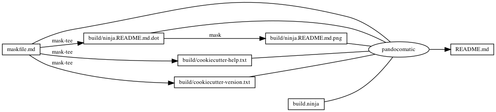

------------------------------------------------------------------------

    pandocomatic_:
        pandoc:
            from: markdown
            to: markdown-fenced_code_attributes
            filter:
            - pandoc-include-code
            output: README.md

...

# cookiecutter

# https://github.com/huzhenghui/mask-awesome

## cookiecutter-help

``` bash
cookiecutter --help
```

### cookiecutter-help-output

``` plain
Usage: cookiecutter [OPTIONS] TEMPLATE [EXTRA_CONTEXT]...

  Create a project from a Cookiecutter project template (TEMPLATE).

  Cookiecutter is free and open source software, developed and managed by
  volunteers. If you would like to help out or fund the project, please get
  in touch at https://github.com/audreyr/cookiecutter.

Options:
  -V, --version              Show the version and exit.
  --no-input                 Do not prompt for parameters and only use
                             cookiecutter.json file content

  -c, --checkout TEXT        branch, tag or commit to checkout after git clone
  --directory TEXT           Directory within repo that holds
                             cookiecutter.json file for advanced repositories
                             with multi templates in it

  -v, --verbose              Print debug information
  --replay                   Do not prompt for parameters and only use
                             information entered previously

  -f, --overwrite-if-exists  Overwrite the contents of the output directory if
                             it already exists

  -s, --skip-if-file-exists  Skip the files in the corresponding directories
                             if they already exist

  -o, --output-dir PATH      Where to output the generated project dir into
  --config-file PATH         User configuration file
  --default-config           Do not load a config file. Use the defaults
                             instead

  --debug-file PATH          File to be used as a stream for DEBUG logging
  -h, --help                 Show this message and exit.
```

## cookiecutter-version

``` bash
cookiecutter --version
```

### cookiecutter-version-output

``` plain
Cookiecutter 1.7.2 from /usr/local/Cellar/cookiecutter/1.7.2_1/libexec/lib/python3.9/site-packages (Python 3.9)
```

## cookiecutter-create-ghq

``` bash
cookiecutter \
    --verbose \
    --no-input \
    --debug-file "${MASKFILE_DIR}"/build/cookiecutter.create.debug.txt \
    --output-dir "${MASKFILE_DIR}"/mask-cookiecutter-output \
    "$(ghq list --full-path https://github.com/huzhenghui/mask-cookiecutter-template)" \
    project_name="My Mask Cookiecutter"
```

## cookiecutter-create-git

``` bash
cookiecutter \
    --verbose \
    --no-input \
    --debug-file "${MASKFILE_DIR}"/build/cookiecutter.create.debug.txt \
    --output-dir "${MASKFILE_DIR}"/mask-cookiecutter-output \
    https://github.com/huzhenghui/mask-cookiecutter-template \
    project_name="My Mask Cookiecutter"
```

## ninja-mask-cookiecutter-output

``` bash
cd "${MASKFILE_DIR}"/mask-cookiecutter-output/my_mask_cookiecutter
ninja --verbose
```

## clear-mask-cookiecutter-output

``` bash
trash "${MASKFILE_DIR}"/mask-cookiecutter-output/my_mask_cookiecutter
```

## begin: mask task in template

## readme

``` bash
ninja --verbose README.md
```

### build.ninja

``` ninja
builddir=./build
mask_subcommand = --help

#######################################
# begin: rule in template

rule mask
  command = mask $mask_subcommand

rule mask-tee
  command = mask $mask_subcommand 2>&1 | tee $out 1> /dev/null

rule pandocomatic
  command = pandocomatic --input $in --output $out

# end: rule in template
#######################################

#######################################a
# begin: custom rule

# custom rule here

# end: custom rule
#######################################

#######################################
# begin: build in template

build ./build/ninja.README.md.dot: mask-tee | ./maskfile.md
  mask_subcommand = readme-grapth-dot

build ./build/ninja.README.md.png : mask | ./build/ninja.README.md.dot
  mask_subcommand = readme-grapth-png

# end: build in template
#######################################

#######################################a
# begin: custom build

build ./build/cookiecutter-help.txt: mask-tee | ./maskfile.md
  mask_subcommand = cookiecutter-help

build ./build/cookiecutter-version.txt: mask-tee | ./maskfile.md
  mask_subcommand = cookiecutter-version

# end: custom build
#######################################

#######################################
# begin: build README.md
# $ followed by a newline
# escape the newline (continue the current line across a line break).
# the first 4 line in this build is template
build README.md: pandocomatic maskfile.md | $
  build.ninja $
  ./build/ninja.README.md.dot $
  ./build/ninja.README.md.png $
  ./build/cookiecutter-help.txt $
  ./build/cookiecutter-version.txt

default README.md
# end: build README.md
#######################################
```

## readme-grapth-dot

``` bash
ninja -t graph README.md
```

### readme-grapth-dot-output


## readme-grapth-png

``` bash
dot -Tpng -o./build/ninja.README.md.png ./build/ninja.README.md.dot
```



## end: mask task in template
