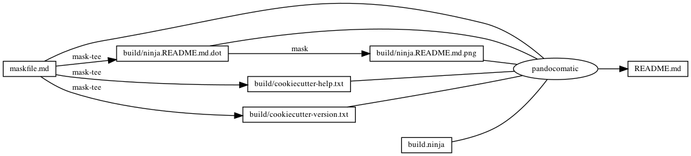

---

    pandocomatic_:
        pandoc:
            from: markdown
            to: markdown-fenced_code_attributes
            filter:
            - pandoc-include-code
            output: README.md

...

# cookiecutter

# https://github.com/huzhenghui/mask-awesome

## cookiecutter-help

```bash
cookiecutter --help
```

### cookiecutter-help-output

```{.plain include=./build/cookiecutter-help.txt}

```

## cookiecutter-version

```bash
cookiecutter --version
```

### cookiecutter-version-output

```{.plain include=./build/cookiecutter-version.txt}

```

## cookiecutter-create-ghq

```bash
cookiecutter \
    --verbose \
    --no-input \
    --debug-file "${MASKFILE_DIR}"/build/cookiecutter.create.debug.txt \
    --output-dir "${MASKFILE_DIR}"/mask-cookiecutter-output \
    "$(ghq list --full-path https://github.com/huzhenghui/mask-cookiecutter-template)" \
    project_name="My Mask Cookiecutter"
```

## cookiecutter-create-git

```bash
cookiecutter \
    --verbose \
    --no-input \
    --debug-file "${MASKFILE_DIR}"/build/cookiecutter.create.debug.txt \
    --output-dir "${MASKFILE_DIR}"/mask-cookiecutter-output \
    https://github.com/huzhenghui/mask-cookiecutter-template \
    project_name="My Mask Cookiecutter"
```

## ninja-mask-cookiecutter-output

```bash
cd "${MASKFILE_DIR}"/mask-cookiecutter-output/my_mask_cookiecutter
ninja --verbose
```

## mask-cookiecutter-output-readme-graph-dot-xdot

```bash
cd "${MASKFILE_DIR}"/mask-cookiecutter-output/my_mask_cookiecutter
mask readme-graph-dot-xdot
```

## clear-mask-cookiecutter-output

```bash
trash "${MASKFILE_DIR}"/mask-cookiecutter-output/my_mask_cookiecutter
```

## begin: mask task in template

## readme

```bash
ninja --verbose README.md
```

### build.ninja

```{.ninja include=./build.ninja}

```

## readme-graph-dot

```bash
ninja -t graph README.md
```

### readme-graph-dot-output

```{.dot include=./build/ninja.README.md.dot}

```

## readme-graph-png

```bash
dot -Tpng -o./build/ninja.README.md.png ./build/ninja.README.md.dot
```



## end: mask task in template
