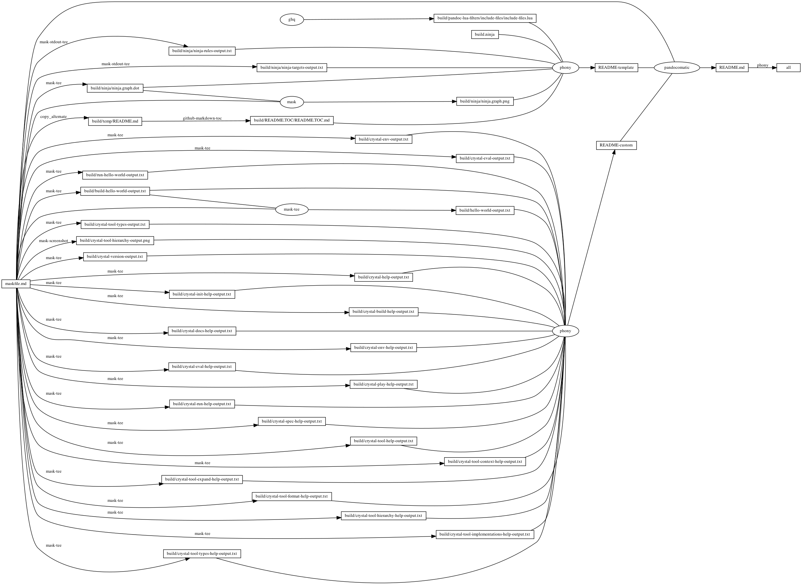

# crystal

<!-- markdownlint-disable MD007 MD030 -->

-   [crystal](#crystal)
-   [Mask SubCommands](#mask-subcommands)
    -   [crystal-env](#crystal-env)
        -   [crystal-env-output](#crystal-env-output)
    -   [crystal-play](#crystal-play)
    -   [crystal-eval](#crystal-eval)
        -   [crystal-eval-output](#crystal-eval-output)
    -   [crystal-tool-format](#crystal-tool-format)
    -   [run-hello-world](#run-hello-world)
        -   [hello\_world.cr](#hello_worldcr)
        -   [run-hello-world-output](#run-hello-world-output)
    -   [build-hello-world](#build-hello-world)
        -   [build-hello-world-output](#build-hello-world-output)
    -   [hello-world](#hello-world)
        -   [hello-world-output](#hello-world-output)
    -   [crystal-tool-types](#crystal-tool-types)
        -   [crystal-tool-types-output](#crystal-tool-types-output)
    -   [crystal-tool-hierarchy](#crystal-tool-hierarchy)
    -   [crystal-version](#crystal-version)
        -   [crystal-version-output](#crystal-version-output)
    -   [crystal-help](#crystal-help)
        -   [crystal-help-output](#crystal-help-output)
    -   [crystal-init-help](#crystal-init-help)
        -   [crystal-init-help-output](#crystal-init-help-output)
    -   [crystal-build-help](#crystal-build-help)
        -   [crystal-build-help-output](#crystal-build-help-output)
    -   [crystal-docs-help](#crystal-docs-help)
        -   [crystal-docs-help-output](#crystal-docs-help-output)
    -   [crystal-env-help](#crystal-env-help)
        -   [crystal-env-help-output](#crystal-env-help-output)
    -   [crystal-eval-help](#crystal-eval-help)
        -   [crystal-eval-help-output](#crystal-eval-help-output)
    -   [crystal-play-help](#crystal-play-help)
        -   [crystal-play-help-output](#crystal-play-help-output)
    -   [crystal-run-help](#crystal-run-help)
        -   [crystal-run-help-output](#crystal-run-help-output)
    -   [crystal-spec-help](#crystal-spec-help)
        -   [crystal-spec-help-output](#crystal-spec-help-output)
    -   [crystal-tool-help](#crystal-tool-help)
        -   [crystal-tool-help-output](#crystal-tool-help-output)
    -   [crystal-tool-context-help](#crystal-tool-context-help)
        -   [crystal-tool-context-help-output](#crystal-tool-context-help-output)
    -   [crystal-tool-expand-help](#crystal-tool-expand-help)
        -   [crystal-tool-expand-help-output](#crystal-tool-expand-help-output)
    -   [crystal-tool-format-help](#crystal-tool-format-help)
        -   [crystal-tool-format-help-output](#crystal-tool-format-help-output)
    -   [crystal-tool-hierarchy-help](#crystal-tool-hierarchy-help)
        -   [crystal-tool-hierarchy-help-output](#crystal-tool-hierarchy-help-output)
    -   [crystal-tool-implementations-help](#crystal-tool-implementations-help)
        -   [crystal-tool-implementations-help-output](#crystal-tool-implementations-help-output)
    -   [crystal-tool-types-help](#crystal-tool-types-help)
        -   [crystal-tool-types-help-output](#crystal-tool-types-help-output)
    -   [begin: mask task in template : build
        content](#begin-mask-task-in-template--build-content)
    -   [ninja-rules](#ninja-rules)
        -   [ninja custom-rule](#ninja-custom-rule)
        -   [ninja-rules-output](#ninja-rules-output)
    -   [ninja-targets](#ninja-targets)
        -   [ninja build-all](#ninja-build-all)
        -   [ninja custom-build](#ninja-custom-build)
        -   [ninja report-build](#ninja-report-build)
        -   [ninja-targets-output](#ninja-targets-output)
    -   [readme-md](#readme-md)
        -   [ninja readme-build](#ninja-readme-build)
    -   [end: mask task in template : build
        content](#end-mask-task-in-template--build-content)
    -   [begin: mask task in template : ninja
        command](#begin-mask-task-in-template--ninja-command)
    -   [ninja-browse](#ninja-browse)
    -   [ninja-graph-png](#ninja-graph-png)
    -   [ninja-graph-dot-xdot](#ninja-graph-dot-xdot)
    -   [ninja-graph-dot](#ninja-graph-dot)
        -   [ninja-graph-dot-output](#ninja-graph-dot-output)
    -   [ninja-all](#ninja-all)
        -   [build.ninja](#buildninja)
    -   [end: mask task in template : ninja
        command](#end-mask-task-in-template--ninja-command)

<!-- markdownlint-enable MD007 MD030 -->

# Mask SubCommands

[Mask Awesome](https://github.com/huzhenghui/mask-awesome)

## crystal-env

``` bash
crystal env CRYSTAL_PATH CRYSTAL_VERSION CRYSTAL_LIBRARY_PATH CRYSTAL_OPTS
```

### crystal-env-output

``` plain
lib:/usr/local/Cellar/crystal/1.0.0_1/src
1.0.0
/usr/local/lib

```

## crystal-play

``` bash
crystal play
```

## crystal-eval

``` bash
crystal eval --stats --time 'puts "Hello World!"'
```

### crystal-eval-output

``` plain
Parse:                            
Parse:                             00:00:00.001748176 (   0.75MB)
Semantic (top level):             
Semantic (top level):              00:00:01.589784747 (  43.35MB)
Semantic (new):                   
Semantic (new):                    00:00:00.003305425 (  43.35MB)
Semantic (type declarations):     
Semantic (type declarations):      00:00:00.051152403 (  43.35MB)
Semantic (abstract def check):    
Semantic (abstract def check):     00:00:00.011687109 (  43.35MB)
Semantic (ivars initializers):    
Semantic (ivars initializers):     00:00:00.065906659 (  57.80MB)
Semantic (cvars initializers):    
Semantic (cvars initializers):     00:00:00.207713513 (  73.80MB)
Semantic (main):                  
Semantic (main):                   00:00:00.344353261 (  73.86MB)
Semantic (cleanup):               
Semantic (cleanup):                00:00:00.009383225 (  73.86MB)
Semantic (recursive struct check):
Semantic (recursive struct check): 00:00:00.001205909 (  73.86MB)
Codegen (crystal):                
Codegen (crystal):                 00:00:00.777089076 (  89.86MB)
Codegen (bc+obj):                 
Codegen (bc+obj):                  00:00:00.626707546 (  89.86MB)
Codegen (linking):                
Codegen (linking):                 00:00:08.117860305 (  89.86MB)
dsymutil:                         
dsymutil:                          00:00:02.728812506 (  89.86MB)

Codegen (bc+obj):
 - all previous .o files were reused
Hello World!
Execute: 00:00:00.760233678
```

## crystal-tool-format

``` bash
crystal tool format hello_world.cr
```

## run-hello-world

``` bash
crystal run --stats --time hello_world.cr
```

### hello\_world.cr

``` crystal
puts "Hello World!"
```

### run-hello-world-output

``` plain
Parse:                            
Parse:                             00:00:00.001660807 (   0.75MB)
Semantic (top level):             
Semantic (top level):              00:00:00.656810093 (  45.20MB)
Semantic (new):                   
Semantic (new):                    00:00:00.002008965 (  45.20MB)
Semantic (type declarations):     
Semantic (type declarations):      00:00:00.023541593 (  45.20MB)
Semantic (abstract def check):    
Semantic (abstract def check):     00:00:00.004672076 (  45.20MB)
Semantic (ivars initializers):    
Semantic (ivars initializers):     00:00:00.029508742 (  60.26MB)
Semantic (cvars initializers):    
Semantic (cvars initializers):     00:00:00.056529308 (  76.26MB)
Semantic (main):                  
Semantic (main):                   00:00:00.085310158 (  76.32MB)
Semantic (cleanup):               
Semantic (cleanup):                00:00:00.004179260 (  76.32MB)
Semantic (recursive struct check):
Semantic (recursive struct check): 00:00:00.000898678 (  76.32MB)
Codegen (crystal):                
Codegen (crystal):                 00:00:00.335075686 (  92.32MB)
Codegen (bc+obj):                 
Codegen (bc+obj):                  00:00:00.179686252 (  92.32MB)
Codegen (linking):                
Codegen (linking):                 00:00:00.670476942 (  92.32MB)
dsymutil:                         
dsymutil:                          00:00:00.259372727 (  92.32MB)

Codegen (bc+obj):
 - all previous .o files were reused
Hello World!
Execute:                          
Execute:                           00:00:00.546927721 (  92.32MB)
```

## build-hello-world

``` bash
crystal build --stats ./hello_world.cr
```

### build-hello-world-output

``` plain
Parse:                            
Parse:                             00:00:00.001745329 (   0.75MB)
Semantic (top level):             
Semantic (top level):              00:00:01.589832739 (  44.91MB)
Semantic (new):                   
Semantic (new):                    00:00:00.004340275 (  44.91MB)
Semantic (type declarations):     
Semantic (type declarations):      00:00:00.054928709 (  44.91MB)
Semantic (abstract def check):    
Semantic (abstract def check):     00:00:00.009922508 (  44.91MB)
Semantic (ivars initializers):    
Semantic (ivars initializers):     00:00:00.062930647 (  59.88MB)
Semantic (cvars initializers):    
Semantic (cvars initializers):     00:00:00.206804655 (  75.88MB)
Semantic (main):                  
Semantic (main):                   00:00:00.348050396 (  75.94MB)
Semantic (cleanup):               
Semantic (cleanup):                00:00:00.009025853 (  75.94MB)
Semantic (recursive struct check):
Semantic (recursive struct check): 00:00:00.001074554 (  75.94MB)
Codegen (crystal):                
Codegen (crystal):                 00:00:00.773531531 (  91.94MB)
Codegen (bc+obj):                 
Codegen (bc+obj):                  00:00:01.771913655 (  91.94MB)
Codegen (linking):                
Codegen (linking):                 00:00:06.977218478 (  91.94MB)
dsymutil:                         
dsymutil:                          00:00:02.698291392 (  91.94MB)

Codegen (bc+obj):
 - no previous .o files were reused
```

## hello-world

``` bash
./hello_world
```

### hello-world-output

``` plain
Hello World!
```

## crystal-tool-types

``` bash
crystal tool types ./hello_world.cr
```

### crystal-tool-types-output

``` plain
dli_fname : 
dli_fbase : 
dli_sname : 
dli_saddr : 
__sig : 
__opaque : 
exception_class : 
exception_cleanup : 
private1 : 
private2 : 
exception_object : 
exception_type_id : 
tm_sec : 
tm_min : 
tm_hour : 
tm_mday : 
tm_mon : 
tm_year : 
tm_wday : 
tm_yday : 
tm_isdst : 
tm_gmtoff : 
tm_zone : 
tv_sec : 
tv_nsec : 
quot : 
rem : 
c_iflag : 
c_oflag : 
c_cflag : 
c_lflag : 
c_cc : 
c_ispeed : 
c_ospeed : 
st_dev : 
st_mode : 
st_nlink : 
st_ino : 
st_uid : 
st_gid : 
st_rdev : 
st_atimespec : 
st_mtimespec : 
st_ctimespec : 
st_birthtimespec : 
st_size : 
st_blocks : 
st_blksize : 
st_flags : 
st_gen : 
st_lspare : 
st_qspare : 
l_start : 
l_len : 
l_pid : 
l_type : 
l_whence : 
sa_len : 
sa_family : 
sa_data : 
ss_len : 
ss_family : 
__ss_pad1 : 
__ss_align : 
__ss_pad2 : 
l_onoff : 
l_linger : 
s_addr : 
__u6_addr8 : 
__u6_addr16 : 
__u6_addr32 : 
__u6_addr : 
sin_len : 
sin_family : 
sin_port : 
sin_addr : 
sin_zero : 
sin6_len : 
sin6_family : 
sin6_port : 
sin6_flowinfo : 
sin6_addr : 
sin6_scope_id : 
imr_multiaddr : 
imr_interface : 
ipv6mr_multiaddr : 
ipv6mr_interface : 
ai_flags : 
ai_family : 
ai_socktype : 
ai_protocol : 
ai_addrlen : 
ai_canonname : 
ai_addr : 
ai_next : 
d_ino : 
d_seekoff : 
d_reclen : 
d_namlen : 
d_type : 
d_name : 
mem_base : 
heap_size : 
free_bytes : 
unmapped_bytes : 
bytes_since_gc : 
bytes_before_gc : 
non_gc_bytes : 
gc_no : 
markers_m1 : 
bytes_reclaimed_since_gc : 
reclaimed_bytes_before_gc : 
fiber : Fiber
rlim_cur : 
rlim_max : 
ru_utime : 
ru_stime : 
ru_maxrss : 
ru_ix_rss : 
ru_idrss : 
ru_isrss : 
ru_minflt : 
ru_majflt : 
ru_nswap : 
ru_inblock : 
ru_oublock : 
ru_msgsnd : 
ru_msgrcv : 
ru_nsignals : 
ru_nvcsw : 
ru_nivcsw : 
tv_usec : 
tz_minuteswest : 
tz_dsttime : 
numer : 
denom : 
gp_offset : 
fp_offset : 
overflow_arg_area : 
reg_save_area : 
```

## crystal-tool-hierarchy

``` bash
crystal tool hierarchy ./hello_world.cr
```


## crystal-version

``` bash
crystal --version
```

### crystal-version-output

``` plain
Crystal 1.0.0 (2021-03-22)

LLVM: 9.0.1
Default target: x86_64-apple-macosx
```

## crystal-help

``` bash
crystal --help
```

### crystal-help-output

``` plain
Usage: crystal [command] [switches] [program file] [--] [arguments]

Command:
    init                     generate a new project
    build                    build an executable
    docs                     generate documentation
    env                      print Crystal environment information
    eval                     eval code from args or standard input
    play                     starts Crystal playground server
    run (default)            build and run program
    spec                     build and run specs (in spec directory)
    tool                     run a tool
    help, --help, -h         show this help
    version, --version, -v   show version

Run a command followed by --help to see command specific information, ex:
    crystal <command> --help
```

## crystal-init-help

``` bash
crystal init --help
```

### crystal-init-help-output

``` plain
Usage: crystal init TYPE (DIR | NAME DIR)

Initializes a project folder as a git repository and default folder
structure for Crystal projects.

TYPE is one of:
    lib                      Creates a library skeleton
    app                      Creates an application skeleton

DIR  - directory where project will be generated
NAME - name of project to be generated, default: basename of DIR

    -h, --help                       show this help
    -f, --force                      force overwrite existing files
    -s, --skip-existing              skip existing files
```

## crystal-build-help

``` bash
crystal build --help
```

### crystal-build-help-output

<!-- markdownlint-disable MD013 -->

``` plain
Usage: crystal build [options] [programfile] [--] [arguments]

Options:
    --cross-compile                  cross-compile
    -d, --debug                      Add full symbolic debug info
    --no-debug                       Skip any symbolic debug info
    --lto=FLAG                       Use ThinLTO --lto=thin
    -D FLAG, --define FLAG           Define a compile-time flag
    --emit [asm|obj|llvm-bc|llvm-ir] Comma separated list of types of output for the compiler to emit
    -f text|json, --format text|json Output format text (default) or json
    --error-trace                    Show full error trace
    -h, --help                       Show this message
    --ll                             Dump ll to Crystal's cache directory
    --link-flags FLAGS               Additional flags to pass to the linker
    --mcpu CPU                       Target specific cpu type
    --mattr CPU                      Target specific features
    --mcmodel MODEL                  Target specific code model
    --warnings all|none              Which warnings detect. (default: all)
    --error-on-warnings              Treat warnings as errors.
    --exclude-warnings <path>        Exclude warnings from path (default: lib)
    --no-color                       Disable colored output
    --no-codegen                     Don't do code generation
    -o                               Output filename
    --prelude                        Use given file as prelude
    --release                        Compile in release mode
    -s, --stats                      Enable statistics output
    -p, --progress                   Enable progress output
    -t, --time                       Enable execution time output
    --single-module                  Generate a single LLVM module
    --threads NUM                    Maximum number of threads to use
    --target TRIPLE                  Target triple
    --verbose                        Display executed commands
    --static                         Link statically
    --stdin-filename                 Source file name to be read from STDIN
```

<!-- markdownlint-enable MD013 -->

## crystal-docs-help

``` bash
crystal docs --help
```

### crystal-docs-help-output

<!-- markdownlint-disable MD013 -->

``` plain
Usage: crystal docs [options]

Generates API documentation from inline docstrings in all Crystal files inside ./src directory.

Options:
    --project-name=NAME              Set project name
    --project-version=VERSION        Set project version
    --source-refname=REFNAME         Set source refname (e.g. git tag, commit hash)
    --source-url-pattern=REFNAME     Set URL pattern for source code links
    --output=DIR, -o DIR             Set the output directory (default: ./docs)
    --format=FORMAT, -f FORMAT       Set the output format [html, json] (default: html)
    --json-config-url=URL            Set the URL pointing to a config file (used for discovering versions)
    --canonical-base-url=URL         Indicate the preferred URL with rel="canonical" link element
    --sitemap-base-url=URL, -b URL   Set the sitemap base URL and generates sitemap
    --sitemap-priority=PRIO          Set the sitemap priority (default: 1.0)
    --sitemap-changefreq=FREQ        Set the sitemap changefreq (default: never)
    -D FLAG, --define FLAG           Define a compile-time flag
    --error-trace                    Show full error trace
    --no-color                       Disable colored output
    --prelude                        Use given file as prelude
    -s, --stats                      Enable statistics output
    -p, --progress                   Enable progress output
    -t, --time                       Enable execution time output
    -h, --help                       Show this message
    --warnings all|none              Which warnings detect. (default: all)
    --error-on-warnings              Treat warnings as errors.
    --exclude-warnings <path>        Exclude warnings from path (default: lib)
```

<!-- markdownlint-enable MD013 -->

## crystal-env-help

``` bash
crystal env --help
```

### crystal-env-help-output

``` plain
Usage: crystal env [var ...]

Prints Crystal environment information.

By default it prints information as a shell script.
If one or more variable names is given as arguments,
it prints the value of each named variable on its own line.
```

## crystal-eval-help

``` bash
crystal eval --help
```

### crystal-eval-help-output

``` plain
Usage: crystal eval [options] [source]

Options:
    -d, --debug                      Add full symbolic debug info
    --no-debug                       Skip any symbolic debug info
    -D FLAG, --define FLAG           Define a compile-time flag
    --error-trace                    Show full error trace
    --release                        Compile in release mode
    -s, --stats                      Enable statistics output
    -p, --progress                   Enable progress output
    -t, --time                       Enable execution time output
    -h, --help                       Show this message
    --no-color                       Disable colored output
    --warnings all|none              Which warnings detect. (default: all)
    --error-on-warnings              Treat warnings as errors.
    --exclude-warnings <path>        Exclude warnings from path (default: lib)
```

## crystal-play-help

``` bash
crystal play --help
```

### crystal-play-help-output

``` plain
Usage: crystal play [options] [file]

Options:
    -p PORT, --port PORT             Runs the playground on the specified port
    -b HOST, --binding HOST          Binds the playground to the specified IP
    -v, --verbose                    Display detailed information of executed code
    -h, --help                       Show this message
```

## crystal-run-help

``` bash
crystal run --help
```

### crystal-run-help-output

<!-- markdownlint-disable MD013 -->

``` plain
Usage: crystal run [options] [programfile] [--] [arguments]

Options:
    -d, --debug                      Add full symbolic debug info
    --no-debug                       Skip any symbolic debug info
    --lto=FLAG                       Use ThinLTO --lto=thin
    -D FLAG, --define FLAG           Define a compile-time flag
    --emit [asm|obj|llvm-bc|llvm-ir] Comma separated list of types of output for the compiler to emit
    -f text|json, --format text|json Output format text (default) or json
    --error-trace                    Show full error trace
    -h, --help                       Show this message
    --ll                             Dump ll to Crystal's cache directory
    --link-flags FLAGS               Additional flags to pass to the linker
    --mcpu CPU                       Target specific cpu type
    --mattr CPU                      Target specific features
    --mcmodel MODEL                  Target specific code model
    --warnings all|none              Which warnings detect. (default: all)
    --error-on-warnings              Treat warnings as errors.
    --exclude-warnings <path>        Exclude warnings from path (default: lib)
    --no-color                       Disable colored output
    --no-codegen                     Don't do code generation
    -o                               Output filename
    --prelude                        Use given file as prelude
    --release                        Compile in release mode
    -s, --stats                      Enable statistics output
    -p, --progress                   Enable progress output
    -t, --time                       Enable execution time output
    --single-module                  Generate a single LLVM module
    --threads NUM                    Maximum number of threads to use
    --verbose                        Display executed commands
    --static                         Link statically
    --stdin-filename                 Source file name to be read from STDIN
```

<!-- markdownlint-enable MD013 -->

## crystal-spec-help

``` bash
crystal spec --help
```

### crystal-spec-help-output

``` plain
Usage: crystal spec [options] [files]

Options:
    -d, --debug                      Add full symbolic debug info
    --no-debug                       Skip any symbolic debug info
    -D FLAG, --define FLAG           Define a compile-time flag
    --error-trace                    Show full error trace
    --release                        Compile in release mode
    -s, --stats                      Enable statistics output
    -p, --progress                   Enable progress output
    -t, --time                       Enable execution time output
    -h, --help                       Show this message
    --no-color                       Disable colored output
    --warnings all|none              Which warnings detect. (default: all)
    --error-on-warnings              Treat warnings as errors.
    --exclude-warnings <path>        Exclude warnings from path (default: lib)
    --link-flags FLAGS               Additional flags to pass to the linker
```

## crystal-tool-help

``` bash
crystal tool --help
```

### crystal-tool-help-output

``` plain
Usage: crystal tool [tool] [switches] [program file] [--] [arguments]

Tool:
    context                  show context for given location
    expand                   show macro expansion for given location
    format                   format project, directories and/or files
    hierarchy                show type hierarchy
    implementations          show implementations for given call in location
    types                    show type of main variables
    --help, -h               show this help
```

## crystal-tool-context-help

``` bash
crystal tool context --help
```

### crystal-tool-context-help-output

``` plain
Usage: crystal tool context [options] [programfile] [--] [arguments]

Options:
    -D FLAG, --define FLAG           Define a compile-time flag
    -c LOC, --cursor LOC             Cursor location with LOC as path/to/file.cr:line:column
    -f text|json, --format text|json Output format text (default) or json
    --error-trace                    Show full error trace
    -h, --help                       Show this message
    --no-color                       Disable colored output
    --prelude                        Use given file as prelude
    -s, --stats                      Enable statistics output
    -p, --progress                   Enable progress output
    -t, --time                       Enable execution time output
    --stdin-filename                 Source file name to be read from STDIN
```

## crystal-tool-expand-help

``` bash
crystal tool expand --help
```

### crystal-tool-expand-help-output

``` plain
Usage: crystal tool expand [options] [programfile] [--] [arguments]

Options:
    -D FLAG, --define FLAG           Define a compile-time flag
    -c LOC, --cursor LOC             Cursor location with LOC as path/to/file.cr:line:column
    -f text|json, --format text|json Output format text (default) or json
    --error-trace                    Show full error trace
    -h, --help                       Show this message
    --no-color                       Disable colored output
    --prelude                        Use given file as prelude
    -s, --stats                      Enable statistics output
    -p, --progress                   Enable progress output
    -t, --time                       Enable execution time output
    --stdin-filename                 Source file name to be read from STDIN
```

## crystal-tool-format-help

``` bash
crystal tool format --help
```

### crystal-tool-format-help-output

``` plain
Usage: crystal tool format [options] [file or directory]

Options:
    --check                          Checks that formatting code produces no changes
    -i <path>, --include <path>      Include path
    -e <path>, --exclude <path>      Exclude path (default: lib)
    -h, --help                       Show this message
    --no-color                       Disable colored output
    --show-backtrace                 Show backtrace on a bug (used only for debugging)
```

## crystal-tool-hierarchy-help

``` bash
crystal tool hierarchy --help
```

### crystal-tool-hierarchy-help-output

``` plain
Usage: crystal tool hierarchy [options] [programfile] [--] [arguments]

Options:
    -D FLAG, --define FLAG           Define a compile-time flag
    -e NAME                          Filter types by NAME regex
    -f text|json, --format text|json Output format text (default) or json
    --error-trace                    Show full error trace
    -h, --help                       Show this message
    --no-color                       Disable colored output
    --prelude                        Use given file as prelude
    -s, --stats                      Enable statistics output
    -p, --progress                   Enable progress output
    -t, --time                       Enable execution time output
    --stdin-filename                 Source file name to be read from STDIN
```

## crystal-tool-implementations-help

``` bash
crystal tool implementations --help
```

### crystal-tool-implementations-help-output

``` plain
Usage: crystal tool implementations [options] [programfile] [--] [arguments]

Options:
    -D FLAG, --define FLAG           Define a compile-time flag
    -c LOC, --cursor LOC             Cursor location with LOC as path/to/file.cr:line:column
    -f text|json, --format text|json Output format text (default) or json
    --error-trace                    Show full error trace
    -h, --help                       Show this message
    --no-color                       Disable colored output
    --prelude                        Use given file as prelude
    -s, --stats                      Enable statistics output
    -p, --progress                   Enable progress output
    -t, --time                       Enable execution time output
    --stdin-filename                 Source file name to be read from STDIN
```

## crystal-tool-types-help

``` bash
crystal tool types --help
```

### crystal-tool-types-help-output

``` plain
Usage: crystal tool types [options] [programfile] [--] [arguments]

Options:
    -D FLAG, --define FLAG           Define a compile-time flag
    -f text|json, --format text|json Output format text (default) or json
    --error-trace                    Show full error trace
    -h, --help                       Show this message
    --no-color                       Disable colored output
    --prelude                        Use given file as prelude
    -s, --stats                      Enable statistics output
    -p, --progress                   Enable progress output
    -t, --time                       Enable execution time output
    --stdin-filename                 Source file name to be read from STDIN
```

## begin: mask task in template : build content

## ninja-rules

``` bash
ninja -t rules
```

### ninja custom-rule

``` ninja
# custom rule here

```

### ninja-rules-output

``` plain
cmdshelf-repository
copy_alternate
dot
ghq
github-markdown-toc
jupyter-nbconvert-markdown
mask
mask-ansifilter
mask-man-markdown
mask-screenshot
mask-stderr-tee
mask-stdout-csv-markdown
mask-stdout-json
mask-stdout-tee
mask-tee
pandocomatic
phony
```

## ninja-targets

``` bash
ninja -t targets all
```

### ninja build-all

``` ninja
build all: phony README.md

default all

```

### ninja custom-build

``` ninja
# custom build here

```

### ninja report-build

``` ninja
# report build here

```

### ninja-targets-output

``` plain
all: phony
build/pandoc-lua-filters/include-files/include-files.lua: ghq
build/ninja/ninja-rules-output.txt: mask-stdout-tee
build/ninja/ninja-targets-output.txt: mask-stdout-tee
build/ninja/ninja.graph.dot: mask-tee
build/ninja/ninja.graph.png: mask
build/temp/README.md: copy_alternate
build/README.TOC/README.TOC.md: github-markdown-toc
README-template: phony
build/crystal-env-output.txt: mask-tee
build/crystal-eval-output.txt: mask-tee
build/run-hello-world-output.txt: mask-tee
build/build-hello-world-output.txt: mask-tee
build/hello-world-output.txt: mask-tee
build/crystal-tool-types-output.txt: mask-tee
build/crystal-tool-hierarchy-output.png: mask-screenshot
build/crystal-version-output.txt: mask-tee
build/crystal-help-output.txt: mask-tee
build/crystal-init-help-output.txt: mask-tee
build/crystal-build-help-output.txt: mask-tee
build/crystal-docs-help-output.txt: mask-tee
build/crystal-env-help-output.txt: mask-tee
build/crystal-eval-help-output.txt: mask-tee
build/crystal-play-help-output.txt: mask-tee
build/crystal-run-help-output.txt: mask-tee
build/crystal-spec-help-output.txt: mask-tee
build/crystal-tool-help-output.txt: mask-tee
build/crystal-tool-context-help-output.txt: mask-tee
build/crystal-tool-expand-help-output.txt: mask-tee
build/crystal-tool-format-help-output.txt: mask-tee
build/crystal-tool-hierarchy-help-output.txt: mask-tee
build/crystal-tool-implementations-help-output.txt: mask-tee
build/crystal-tool-types-help-output.txt: mask-tee
README-custom: phony
README.md: pandocomatic
```

## readme-md

``` bash
ninja --verbose README.md
```

### ninja readme-build

``` ninja
build ./build/crystal-env-output.txt : mask-tee ./maskfile.md
  mask_subcommand = crystal-env

build ./build/crystal-eval-output.txt : mask-tee ./maskfile.md
  mask_subcommand = crystal-eval

build ./build/run-hello-world-output.txt : mask-tee ./maskfile.md
  mask_subcommand = run-hello-world

build ./build/build-hello-world-output.txt : mask-tee ./maskfile.md
  mask_subcommand = build-hello-world

build ./build/hello-world-output.txt : mask-tee ./maskfile.md | ./build/build-hello-world-output.txt
  mask_subcommand = hello-world

build ./build/crystal-tool-types-output.txt : mask-tee ./maskfile.md
  mask_subcommand = crystal-tool-types

build ./build/crystal-tool-hierarchy-output.png : mask-screenshot ./maskfile.md
  mask_subcommand = crystal-tool-hierarchy

build ./build/crystal-version-output.txt : mask-tee ./maskfile.md
  mask_subcommand = crystal-version

build ./build/crystal-help-output.txt : mask-tee ./maskfile.md
  mask_subcommand = crystal-help

build ./build/crystal-init-help-output.txt : mask-tee ./maskfile.md
  mask_subcommand = crystal-init-help

build ./build/crystal-build-help-output.txt : mask-tee ./maskfile.md
  mask_subcommand = crystal-build-help

build ./build/crystal-docs-help-output.txt : mask-tee ./maskfile.md
  mask_subcommand = crystal-docs-help

build ./build/crystal-env-help-output.txt : mask-tee ./maskfile.md
  mask_subcommand = crystal-env-help

build ./build/crystal-eval-help-output.txt : mask-tee ./maskfile.md
  mask_subcommand = crystal-eval-help

build ./build/crystal-play-help-output.txt : mask-tee ./maskfile.md
  mask_subcommand = crystal-play-help

build ./build/crystal-run-help-output.txt : mask-tee ./maskfile.md
  mask_subcommand = crystal-run-help

build ./build/crystal-spec-help-output.txt : mask-tee ./maskfile.md
  mask_subcommand = crystal-spec-help

build ./build/crystal-tool-help-output.txt : mask-tee ./maskfile.md
  mask_subcommand = crystal-tool-help

build ./build/crystal-tool-context-help-output.txt : mask-tee ./maskfile.md
  mask_subcommand = crystal-tool-context-help

build ./build/crystal-tool-expand-help-output.txt : mask-tee ./maskfile.md
  mask_subcommand = crystal-tool-expand-help

build ./build/crystal-tool-format-help-output.txt : mask-tee ./maskfile.md
  mask_subcommand = crystal-tool-format-help

build ./build/crystal-tool-hierarchy-help-output.txt : mask-tee ./maskfile.md
  mask_subcommand = crystal-tool-hierarchy-help

build ./build/crystal-tool-implementations-help-output.txt : mask-tee ./maskfile.md
  mask_subcommand = crystal-tool-implementations-help

build ./build/crystal-tool-types-help-output.txt : mask-tee ./maskfile.md
  mask_subcommand = crystal-tool-types-help

build README-custom : phony $
  ./build/crystal-env-output.txt $
  ./build/crystal-eval-output.txt $
  ./build/run-hello-world-output.txt $
  ./build/build-hello-world-output.txt $
  ./build/hello-world-output.txt $
  ./build/crystal-tool-types-output.txt $
  ./build/crystal-tool-hierarchy-output.png $
  ./build/crystal-version-output.txt $
  ./build/crystal-help-output.txt $
  ./build/crystal-init-help-output.txt $
  ./build/crystal-build-help-output.txt $
  ./build/crystal-docs-help-output.txt $
  ./build/crystal-env-help-output.txt $
  ./build/crystal-eval-help-output.txt $
  ./build/crystal-play-help-output.txt $
  ./build/crystal-run-help-output.txt $
  ./build/crystal-spec-help-output.txt $
  ./build/crystal-tool-help-output.txt $
  ./build/crystal-tool-context-help-output.txt $
  ./build/crystal-tool-expand-help-output.txt $
  ./build/crystal-tool-format-help-output.txt $
  ./build/crystal-tool-hierarchy-help-output.txt $
  ./build/crystal-tool-implementations-help-output.txt $
  ./build/crystal-tool-types-help-output.txt

```

``` ninja
build README.md : pandocomatic maskfile.md | README-template README-custom

```

## end: mask task in template : build content

## begin: mask task in template : ninja command

## ninja-browse

``` bash
ninja -t browse
```

## ninja-graph-png

``` bash
dot -Tpng -o./build/ninja/ninja.graph.png ./build/ninja/ninja.graph.dot
```



## ninja-graph-dot-xdot

``` bash
detach -- xdot "${MASKFILE_DIR}/build/ninja/ninja.graph.dot"
```

## ninja-graph-dot

``` bash
ninja -t graph
```

### ninja-graph-dot-output

``` dot
digraph ninja {
rankdir="LR"
node [fontsize=10, shape=box, height=0.25]
edge [fontsize=10]
"0x7fabb9006f60" [label="all"]
"0x7fabb90070e0" -> "0x7fabb9006f60" [label=" phony"]
"0x7fabb90070e0" [label="README.md"]
"0x7fabb9106220" [label="pandocomatic", shape=ellipse]
"0x7fabb9106220" -> "0x7fabb90070e0"
"0x7fabb9007650" -> "0x7fabb9106220" [arrowhead=none]
"0x7fabb90083c0" -> "0x7fabb9106220" [arrowhead=none]
"0x7fabb91062c0" -> "0x7fabb9106220" [arrowhead=none]
"0x7fabb9007650" [label="maskfile.md"]
"0x7fabb90083c0" [label="README-template"]
"0x7fabb9008110" [label="phony", shape=ellipse]
"0x7fabb9008110" -> "0x7fabb90083c0"
"0x7fabb90073c0" -> "0x7fabb9008110" [arrowhead=none]
"0x7fabb9008420" -> "0x7fabb9008110" [arrowhead=none]
"0x7fabb9007590" -> "0x7fabb9008110" [arrowhead=none]
"0x7fabb9007810" -> "0x7fabb9008110" [arrowhead=none]
"0x7fabb9007a70" -> "0x7fabb9008110" [arrowhead=none]
"0x7fabb9007cb0" -> "0x7fabb9008110" [arrowhead=none]
"0x7fabb9007fb0" -> "0x7fabb9008110" [arrowhead=none]
"0x7fabb90073c0" [label="build/pandoc-lua-filters/include-files/include-files.lua"]
"0x7fabb9007350" [label="ghq", shape=ellipse]
"0x7fabb9007350" -> "0x7fabb90073c0"
"0x7fabb9008420" [label="build.ninja"]
"0x7fabb9007590" [label="build/ninja/ninja-rules-output.txt"]
"0x7fabb9007650" -> "0x7fabb9007590" [label=" mask-stdout-tee"]
"0x7fabb9007810" [label="build/ninja/ninja-targets-output.txt"]
"0x7fabb9007650" -> "0x7fabb9007810" [label=" mask-stdout-tee"]
"0x7fabb9007a70" [label="build/ninja/ninja.graph.dot"]
"0x7fabb9007650" -> "0x7fabb9007a70" [label=" mask-tee"]
"0x7fabb9007cb0" [label="build/ninja/ninja.graph.png"]
"0x7fabb9007c40" [label="mask", shape=ellipse]
"0x7fabb9007c40" -> "0x7fabb9007cb0"
"0x7fabb9007650" -> "0x7fabb9007c40" [arrowhead=none]
"0x7fabb9007a70" -> "0x7fabb9007c40" [arrowhead=none]
"0x7fabb9007fb0" [label="build/README.TOC/README.TOC.md"]
"0x7fabb9007e40" -> "0x7fabb9007fb0" [label=" github-markdown-toc"]
"0x7fabb9007e40" [label="build/temp/README.md"]
"0x7fabb9007650" -> "0x7fabb9007e40" [label=" copy_alternate"]
"0x7fabb91062c0" [label="README-custom"]
"0x7fabb9106110" [label="phony", shape=ellipse]
"0x7fabb9106110" -> "0x7fabb91062c0"
"0x7fabb9008200" -> "0x7fabb9106110" [arrowhead=none]
"0x7fabb90085e0" -> "0x7fabb9106110" [arrowhead=none]
"0x7fabb90087c0" -> "0x7fabb9106110" [arrowhead=none]
"0x7fabb90089b0" -> "0x7fabb9106110" [arrowhead=none]
"0x7fabb9008c30" -> "0x7fabb9106110" [arrowhead=none]
"0x7fabb9008dc0" -> "0x7fabb9106110" [arrowhead=none]
"0x7fabb9008f70" -> "0x7fabb9106110" [arrowhead=none]
"0x7fabb9009260" -> "0x7fabb9106110" [arrowhead=none]
"0x7fabb90093b0" -> "0x7fabb9106110" [arrowhead=none]
"0x7fabb9009590" -> "0x7fabb9106110" [arrowhead=none]
"0x7fabb9009780" -> "0x7fabb9106110" [arrowhead=none]
"0x7fabb9104200" -> "0x7fabb9106110" [arrowhead=none]
"0x7fabb91046f0" -> "0x7fabb9106110" [arrowhead=none]
"0x7fabb91048e0" -> "0x7fabb9106110" [arrowhead=none]
"0x7fabb9104ad0" -> "0x7fabb9106110" [arrowhead=none]
"0x7fabb9104c90" -> "0x7fabb9106110" [arrowhead=none]
"0x7fabb9104e80" -> "0x7fabb9106110" [arrowhead=none]
"0x7fabb9105070" -> "0x7fabb9106110" [arrowhead=none]
"0x7fabb91052b0" -> "0x7fabb9106110" [arrowhead=none]
"0x7fabb91054d0" -> "0x7fabb9106110" [arrowhead=none]
"0x7fabb91056f0" -> "0x7fabb9106110" [arrowhead=none]
"0x7fabb9105910" -> "0x7fabb9106110" [arrowhead=none]
"0x7fabb9105b20" -> "0x7fabb9106110" [arrowhead=none]
"0x7fabb9105f20" -> "0x7fabb9106110" [arrowhead=none]
"0x7fabb9008200" [label="build/crystal-env-output.txt"]
"0x7fabb9007650" -> "0x7fabb9008200" [label=" mask-tee"]
"0x7fabb90085e0" [label="build/crystal-eval-output.txt"]
"0x7fabb9007650" -> "0x7fabb90085e0" [label=" mask-tee"]
"0x7fabb90087c0" [label="build/run-hello-world-output.txt"]
"0x7fabb9007650" -> "0x7fabb90087c0" [label=" mask-tee"]
"0x7fabb90089b0" [label="build/build-hello-world-output.txt"]
"0x7fabb9007650" -> "0x7fabb90089b0" [label=" mask-tee"]
"0x7fabb9008c30" [label="build/hello-world-output.txt"]
"0x7fabb9008bc0" [label="mask-tee", shape=ellipse]
"0x7fabb9008bc0" -> "0x7fabb9008c30"
"0x7fabb9007650" -> "0x7fabb9008bc0" [arrowhead=none]
"0x7fabb90089b0" -> "0x7fabb9008bc0" [arrowhead=none]
"0x7fabb9008dc0" [label="build/crystal-tool-types-output.txt"]
"0x7fabb9007650" -> "0x7fabb9008dc0" [label=" mask-tee"]
"0x7fabb9008f70" [label="build/crystal-tool-hierarchy-output.png"]
"0x7fabb9007650" -> "0x7fabb9008f70" [label=" mask-screenshot"]
"0x7fabb9009260" [label="build/crystal-version-output.txt"]
"0x7fabb9007650" -> "0x7fabb9009260" [label=" mask-tee"]
"0x7fabb90093b0" [label="build/crystal-help-output.txt"]
"0x7fabb9007650" -> "0x7fabb90093b0" [label=" mask-tee"]
"0x7fabb9009590" [label="build/crystal-init-help-output.txt"]
"0x7fabb9007650" -> "0x7fabb9009590" [label=" mask-tee"]
"0x7fabb9009780" [label="build/crystal-build-help-output.txt"]
"0x7fabb9007650" -> "0x7fabb9009780" [label=" mask-tee"]
"0x7fabb9104200" [label="build/crystal-docs-help-output.txt"]
"0x7fabb9007650" -> "0x7fabb9104200" [label=" mask-tee"]
"0x7fabb91046f0" [label="build/crystal-env-help-output.txt"]
"0x7fabb9007650" -> "0x7fabb91046f0" [label=" mask-tee"]
"0x7fabb91048e0" [label="build/crystal-eval-help-output.txt"]
"0x7fabb9007650" -> "0x7fabb91048e0" [label=" mask-tee"]
"0x7fabb9104ad0" [label="build/crystal-play-help-output.txt"]
"0x7fabb9007650" -> "0x7fabb9104ad0" [label=" mask-tee"]
"0x7fabb9104c90" [label="build/crystal-run-help-output.txt"]
"0x7fabb9007650" -> "0x7fabb9104c90" [label=" mask-tee"]
"0x7fabb9104e80" [label="build/crystal-spec-help-output.txt"]
"0x7fabb9007650" -> "0x7fabb9104e80" [label=" mask-tee"]
"0x7fabb9105070" [label="build/crystal-tool-help-output.txt"]
"0x7fabb9007650" -> "0x7fabb9105070" [label=" mask-tee"]
"0x7fabb91052b0" [label="build/crystal-tool-context-help-output.txt"]
"0x7fabb9007650" -> "0x7fabb91052b0" [label=" mask-tee"]
"0x7fabb91054d0" [label="build/crystal-tool-expand-help-output.txt"]
"0x7fabb9007650" -> "0x7fabb91054d0" [label=" mask-tee"]
"0x7fabb91056f0" [label="build/crystal-tool-format-help-output.txt"]
"0x7fabb9007650" -> "0x7fabb91056f0" [label=" mask-tee"]
"0x7fabb9105910" [label="build/crystal-tool-hierarchy-help-output.txt"]
"0x7fabb9007650" -> "0x7fabb9105910" [label=" mask-tee"]
"0x7fabb9105b20" [label="build/crystal-tool-implementations-help-output.txt"]
"0x7fabb9007650" -> "0x7fabb9105b20" [label=" mask-tee"]
"0x7fabb9105f20" [label="build/crystal-tool-types-help-output.txt"]
"0x7fabb9007650" -> "0x7fabb9105f20" [label=" mask-tee"]
}
```



## ninja-all

``` bash
ninja --verbose
```

### build.ninja

``` ninja
builddir=./build
mask_subcommand = --help
mask_stdout_csv_markdowndelimiter = ","
jupyter_nbconvert_markdown_output_files_dir=./build/jupyter-nbconvert-markdown-output-files

#######################################
# begin: rule in template

rule mask
  command = mask --maskfile $in $mask_subcommand

rule mask-tee
  command = mask --maskfile $in $mask_subcommand 2>&1 | tee $out 1> /dev/null

rule mask-ansifilter
  command = mask --maskfile $in $mask_subcommand 2>&1 | $
    ansifilter | tee $out 1> /dev/null

rule mask-stdout-tee
  command = mask --maskfile $in $mask_subcommand 2>/dev/null | tee $out 1> /dev/null

rule mask-stderr-tee
  command = bash -c 'mask $mask_subcommand 1>/dev/null 2> >(tee $out)' || echo $$?

# <!-- markdownlint-disable MD013 -->
rule mask-man-markdown
  command = set -e && set -o pipefail && $
    mask --maskfile $in $mask_subcommand | $
    ul | $
    ansifilter --bbcode | $
    inv --search-root="$$(ghq list --full-path https://github.com/huzhenghui/pyinvoke-awesome)/bbcode" bbcode-parser-format | $
    pandoc --from=html --to=markdown | $
    tee $out 1> /dev/null
# <!-- markdownlint-enable MD013 -->

rule mask-stdout-csv-markdown
  command = mask --maskfile $in $mask_subcommand 2>/dev/null | $
    csvtomd --delimiter "$$(echo $mask_stdout_csv_markdowndelimiter)" | $
    tee $out 1> /dev/null

rule mask-stdout-json
  command = mask --maskfile $in $mask_subcommand 2>/dev/null | $
    jq | $
    tee $out 1> /dev/null

rule mask-screenshot
  command = $
    regular_logfile="./build/temp/$$(basename $out).mask-screenshot.logfile" && $
    rm -f -v "$${regular_logfile}" && $
    until [[ -s "$${regular_logfile}" ]]; do $
      screen_logfile="$$(mktemp -d)/logfile"; $
      echo "$${screen_logfile}"; $
      mkfifo "$${screen_logfile}"; $
      screen -L -Logfile "$${screen_logfile}" $
        -dmS mask-screenshot-"$$(basename $out)" $
        sh -c "stdbuf -o0 mask --maskfile $in $mask_subcommand; $
          date +'%F %T %Z %z - %+ https://github.com/huzhenghui' | lolcat;"; $
      dd bs=1 if="$${screen_logfile}" of="$${regular_logfile}"; $
    done && $
    ansifilter --html --encoding=utf8 --input="$${regular_logfile}" | $
      tee ./build/temp/"$$(basename $out)".mask-screenshot.html | $
      wkhtmltoimage --format png - "$out"

rule pandocomatic
  command = pandocomatic --input $in --output $out

rule github-markdown-toc
  command = gh-md-toc --hide-header --hide-footer --no-escape $in > $out

rule copy_alternate
  command = if [[ -f "$alternate" ]]; $
    then $
      cp "$alternate" "$out"; $
    else $
      cp "$in" "$out"; $
    fi;

rule dot
  command = dot -Tpng -o$out $in

rule ghq
  command = ghq get --update "$repository" && $
    find -d "$link_dirname" -exec rmdir {} \; && $
    ln -Fs "$$(ghq list --full-path $repository)" "$link_dirname"
  generator = 1

rule cmdshelf-repository
  command = $$( $
    cmdshelf remote list | ack "^$cmdshelf_name" 1>&2 || $
    cmdshelf remote add "$cmdshelf_name" "$cmdshelf_url" 1>&2 $
    ) && $
    repository_path="$$(realpath $${HOME}/.cmdshelf/remote/$cmdshelf_name)" && $
    echo "$${repository_path}" && $
    stub_path="$$(realpath ./build/$cmdshelf_name)" && $
    echo "$${stub_path}" && $
    find -d "$${stub_path}" -exec rmdir {} \; && $
    ln -Fs "$${repository_path}" "$${stub_path}"
  generator = 1

# <!-- markdownlint-disable MD013 -->
rule jupyter-nbconvert-markdown
  command = jupyter nbconvert $
    --to=markdown $
    --NbConvertApp.output_files_dir="$jupyter_nbconvert_markdown_output_files_dir" $
    --output="$out" $
    "$in"
# <!-- markdownlint-enble MD013 -->

# end: rule in template
#######################################

#######################################
# start snippet custom-rule

# custom rule here

# end snippet custom-rule
#######################################

#######################################
# start snippet build-all

build all: phony README.md

default all

# end snippet build-all
#######################################

#######################################
# start snippet custom-build

# custom build here

# end snippet custom-build
#######################################

#######################################
# start snippet report-build

# report build here

# end snippet report-build
#######################################

#######################################
# begin: readme-build in template

# ninja will create ./build/pandoc-lua-filters/include-files/ automatically
build ./build/pandoc-lua-filters/include-files/include-files.lua : ghq
  repository = https://github.com/pandoc/lua-filters
  link_dirname = ./build/pandoc-lua-filters

build ./build/ninja/ninja-rules-output.txt : mask-stdout-tee ./maskfile.md
  mask_subcommand = ninja-rules

build ./build/ninja/ninja-targets-output.txt : mask-stdout-tee ./maskfile.md
  mask_subcommand = ninja-targets

build ./build/ninja/ninja.graph.dot : mask-tee ./maskfile.md
  mask_subcommand = ninja-graph-dot

build ./build/ninja/ninja.graph.png : mask ./maskfile.md | ./build/ninja/ninja.graph.dot
  mask_subcommand = ninja-graph-png

build ./build/temp/README.md : copy_alternate ./maskfile.md
  alternate = ./README.md

build ./build/README.TOC/README.TOC.md : github-markdown-toc ./build/temp/README.md

build README-template : phony $
  ./build/pandoc-lua-filters/include-files/include-files.lua $
  ./build.ninja $
  ./build/ninja/ninja-rules-output.txt $
  ./build/ninja/ninja-targets-output.txt $
  ./build/ninja/ninja.graph.dot $
  ./build/ninja/ninja.graph.png $
  ./build/README.TOC/README.TOC.md $

# end: readme-build in template
#######################################

#######################################
# start snippet custom-readme-build

build ./build/crystal-env-output.txt : mask-tee ./maskfile.md
  mask_subcommand = crystal-env

build ./build/crystal-eval-output.txt : mask-tee ./maskfile.md
  mask_subcommand = crystal-eval

build ./build/run-hello-world-output.txt : mask-tee ./maskfile.md
  mask_subcommand = run-hello-world

build ./build/build-hello-world-output.txt : mask-tee ./maskfile.md
  mask_subcommand = build-hello-world

build ./build/hello-world-output.txt : mask-tee ./maskfile.md | ./build/build-hello-world-output.txt
  mask_subcommand = hello-world

build ./build/crystal-tool-types-output.txt : mask-tee ./maskfile.md
  mask_subcommand = crystal-tool-types

build ./build/crystal-tool-hierarchy-output.png : mask-screenshot ./maskfile.md
  mask_subcommand = crystal-tool-hierarchy

build ./build/crystal-version-output.txt : mask-tee ./maskfile.md
  mask_subcommand = crystal-version

build ./build/crystal-help-output.txt : mask-tee ./maskfile.md
  mask_subcommand = crystal-help

build ./build/crystal-init-help-output.txt : mask-tee ./maskfile.md
  mask_subcommand = crystal-init-help

build ./build/crystal-build-help-output.txt : mask-tee ./maskfile.md
  mask_subcommand = crystal-build-help

build ./build/crystal-docs-help-output.txt : mask-tee ./maskfile.md
  mask_subcommand = crystal-docs-help

build ./build/crystal-env-help-output.txt : mask-tee ./maskfile.md
  mask_subcommand = crystal-env-help

build ./build/crystal-eval-help-output.txt : mask-tee ./maskfile.md
  mask_subcommand = crystal-eval-help

build ./build/crystal-play-help-output.txt : mask-tee ./maskfile.md
  mask_subcommand = crystal-play-help

build ./build/crystal-run-help-output.txt : mask-tee ./maskfile.md
  mask_subcommand = crystal-run-help

build ./build/crystal-spec-help-output.txt : mask-tee ./maskfile.md
  mask_subcommand = crystal-spec-help

build ./build/crystal-tool-help-output.txt : mask-tee ./maskfile.md
  mask_subcommand = crystal-tool-help

build ./build/crystal-tool-context-help-output.txt : mask-tee ./maskfile.md
  mask_subcommand = crystal-tool-context-help

build ./build/crystal-tool-expand-help-output.txt : mask-tee ./maskfile.md
  mask_subcommand = crystal-tool-expand-help

build ./build/crystal-tool-format-help-output.txt : mask-tee ./maskfile.md
  mask_subcommand = crystal-tool-format-help

build ./build/crystal-tool-hierarchy-help-output.txt : mask-tee ./maskfile.md
  mask_subcommand = crystal-tool-hierarchy-help

build ./build/crystal-tool-implementations-help-output.txt : mask-tee ./maskfile.md
  mask_subcommand = crystal-tool-implementations-help

build ./build/crystal-tool-types-help-output.txt : mask-tee ./maskfile.md
  mask_subcommand = crystal-tool-types-help

build README-custom : phony $
  ./build/crystal-env-output.txt $
  ./build/crystal-eval-output.txt $
  ./build/run-hello-world-output.txt $
  ./build/build-hello-world-output.txt $
  ./build/hello-world-output.txt $
  ./build/crystal-tool-types-output.txt $
  ./build/crystal-tool-hierarchy-output.png $
  ./build/crystal-version-output.txt $
  ./build/crystal-help-output.txt $
  ./build/crystal-init-help-output.txt $
  ./build/crystal-build-help-output.txt $
  ./build/crystal-docs-help-output.txt $
  ./build/crystal-env-help-output.txt $
  ./build/crystal-eval-help-output.txt $
  ./build/crystal-play-help-output.txt $
  ./build/crystal-run-help-output.txt $
  ./build/crystal-spec-help-output.txt $
  ./build/crystal-tool-help-output.txt $
  ./build/crystal-tool-context-help-output.txt $
  ./build/crystal-tool-expand-help-output.txt $
  ./build/crystal-tool-format-help-output.txt $
  ./build/crystal-tool-hierarchy-help-output.txt $
  ./build/crystal-tool-implementations-help-output.txt $
  ./build/crystal-tool-types-help-output.txt

# end snippet custom-readme-build
#######################################

#######################################
# $ followed by a newline
# escape the newline (continue the current line across a line break).
# start snippet readme-build

build README.md : pandocomatic maskfile.md | README-template README-custom

# end snippet readme-build
#######################################
```

## end: mask task in template : ninja command
