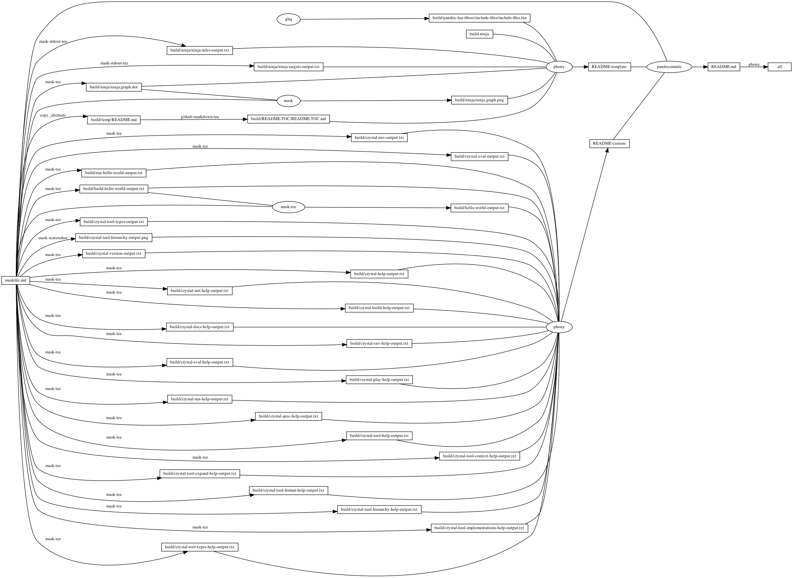

---
pandocomatic_:
    pandoc:
        from: markdown-smart+tex_math_dollars
        to: gfm+tex_math_dollars
        filter:
        - pandoc-include-code
        lua-filter:
        - ./build/pandoc-lua-filters/include-files/include-files.lua
        output: README.md
...

# crystal

<!-- markdownlint-disable MD007 MD030 -->
```{.include}
./build/README.TOC/README.TOC.md
```
<!-- markdownlint-enable MD007 MD030 -->

# Mask SubCommands

[Mask Awesome](https://github.com/huzhenghui/mask-awesome)

## crystal-env

```bash
crystal env CRYSTAL_PATH CRYSTAL_VERSION CRYSTAL_LIBRARY_PATH CRYSTAL_OPTS
```

### crystal-env-output

```{.plain include=./build/crystal-env-output.txt}
```

## crystal-play

```bash
crystal play
```

## crystal-eval

```bash
crystal eval --stats --time 'puts "Hello World!"'
```

### crystal-eval-output

```{.plain include=./build/crystal-eval-output.txt}
```

## crystal-tool-format

```bash
crystal tool format hello_world.cr
```

## run-hello-world

```bash
crystal run --stats --time hello_world.cr
```

### hello_world.cr

```{.crystal include=./hello_world.cr}
```

### run-hello-world-output

```{.plain include=./build/run-hello-world-output.txt}
```

## build-hello-world

```bash
crystal build --stats ./hello_world.cr
```

### build-hello-world-output

```{.plain include=./build/build-hello-world-output.txt}
```

## hello-world

```bash
./hello_world
```

### hello-world-output

```{.plain include=./build/hello-world-output.txt}
```

## crystal-tool-types

```bash
crystal tool types ./hello_world.cr
```

### crystal-tool-types-output

```{.plain include=./build/crystal-tool-types-output.txt}
```

## crystal-tool-hierarchy

```bash
crystal tool hierarchy ./hello_world.cr
```


## crystal-version

```bash
crystal --version
```

### crystal-version-output

```{.plain include=./build/crystal-version-output.txt}
```

## crystal-help

```bash
crystal --help
```

### crystal-help-output

```{.plain include=./build/crystal-help-output.txt}
```

## crystal-init-help

```bash
crystal init --help
```

### crystal-init-help-output

```{.plain include=./build/crystal-init-help-output.txt}
```

## crystal-build-help

```bash
crystal build --help
```

### crystal-build-help-output

<!-- markdownlint-disable MD013 -->
```{.plain include=./build/crystal-build-help-output.txt}
```
<!-- markdownlint-enable MD013 -->

## crystal-docs-help

```bash
crystal docs --help
```

### crystal-docs-help-output

<!-- markdownlint-disable MD013 -->
```{.plain include=./build/crystal-docs-help-output.txt}
```
<!-- markdownlint-enable MD013 -->

## crystal-env-help

```bash
crystal env --help
```

### crystal-env-help-output

```{.plain include=./build/crystal-env-help-output.txt}
```

## crystal-eval-help

```bash
crystal eval --help
```

### crystal-eval-help-output

```{.plain include=./build/crystal-eval-help-output.txt}
```

## crystal-play-help

```bash
crystal play --help
```

### crystal-play-help-output

```{.plain include=./build/crystal-play-help-output.txt}
```

## crystal-run-help

```bash
crystal run --help
```

### crystal-run-help-output

<!-- markdownlint-disable MD013 -->
```{.plain include=./build/crystal-run-help-output.txt}
```
<!-- markdownlint-enable MD013 -->

## crystal-spec-help

```bash
crystal spec --help
```

### crystal-spec-help-output

```{.plain include=./build/crystal-spec-help-output.txt}
```

## crystal-tool-help

```bash
crystal tool --help
```

### crystal-tool-help-output

```{.plain include=./build/crystal-tool-help-output.txt}
```

## crystal-tool-context-help

```bash
crystal tool context --help
```

### crystal-tool-context-help-output

```{.plain include=./build/crystal-tool-context-help-output.txt}
```

## crystal-tool-expand-help

```bash
crystal tool expand --help
```

### crystal-tool-expand-help-output

```{.plain include=./build/crystal-tool-expand-help-output.txt}
```

## crystal-tool-format-help

```bash
crystal tool format --help
```

### crystal-tool-format-help-output

```{.plain include=./build/crystal-tool-format-help-output.txt}
```

## crystal-tool-hierarchy-help

```bash
crystal tool hierarchy --help
```

### crystal-tool-hierarchy-help-output

```{.plain include=./build/crystal-tool-hierarchy-help-output.txt}
```

## crystal-tool-implementations-help

```bash
crystal tool implementations --help
```

### crystal-tool-implementations-help-output

```{.plain include=./build/crystal-tool-implementations-help-output.txt}
```

## crystal-tool-types-help

```bash
crystal tool types --help
```

### crystal-tool-types-help-output

```{.plain include=./build/crystal-tool-types-help-output.txt}
```

## begin: mask task in template : build content

## ninja-rules

```bash
ninja -t rules
```

### ninja custom-rule

```{.ninja include=build.ninja snippet=custom-rule}
```

### ninja-rules-output

```{.plain include=./build/ninja/ninja-rules-output.txt}
```

## ninja-targets

```bash
ninja -t targets all
```

### ninja build-all

```{.ninja include=build.ninja snippet=build-all}
```

### ninja custom-build

```{.ninja include=build.ninja snippet=custom-build}

```

### ninja report-build

```{.ninja include=build.ninja snippet=report-build}

```

### ninja-targets-output

```{.plain include=./build/ninja/ninja-targets-output.txt}
```

## readme-md

```bash
ninja --verbose README.md
```

### ninja readme-build

```{.ninja include=build.ninja snippet=custom-readme-build}
```

```{.ninja include=build.ninja snippet=readme-build}
```

## end: mask task in template : build content

## begin: mask task in template : ninja command

## ninja-browse

```bash
ninja -t browse
```

## ninja-graph-png

```bash
dot -Tpng -o./build/ninja/ninja.graph.png ./build/ninja/ninja.graph.dot
```



## ninja-graph-dot-xdot

```bash
detach -- xdot "${MASKFILE_DIR}/build/ninja/ninja.graph.dot"
```

## ninja-graph-dot

```bash
ninja -t graph
```

### ninja-graph-dot-output

```{.dot include=./build/ninja/ninja.graph.dot}
```

## ninja-all

```bash
ninja --verbose
```

### build.ninja

```{.ninja include=./build.ninja}
```

## end: mask task in template : ninja command
