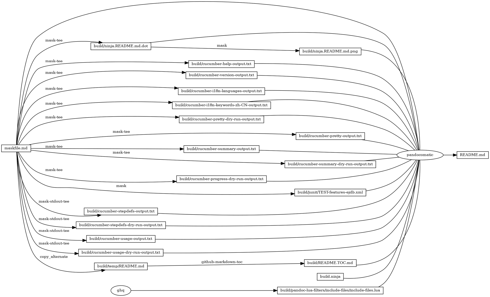
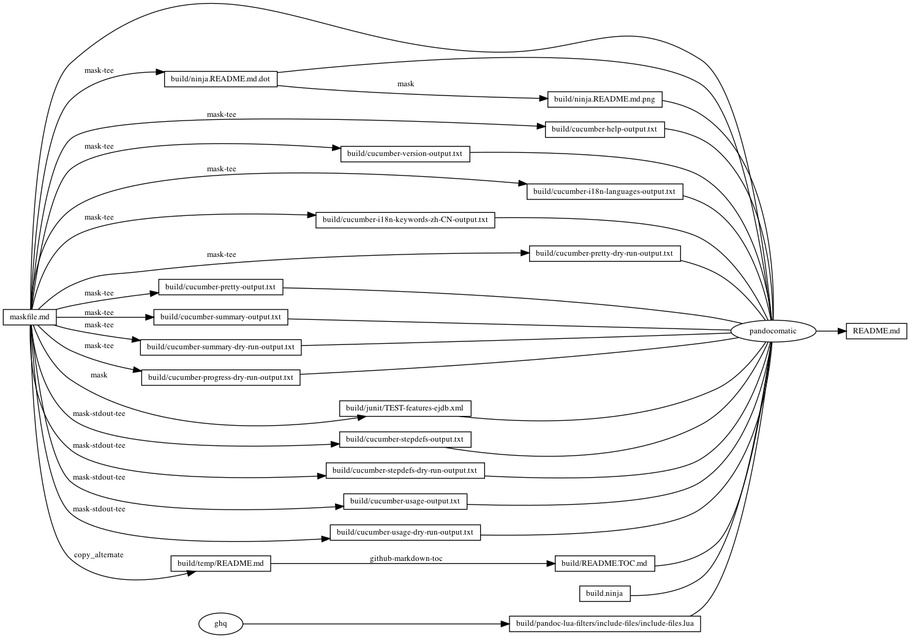

# cucumber

<!-- markdownlint-disable MD007 MD030 -->

-   [cucumber](#cucumber)
-   [features/ejdb.feature](#featuresejdbfeature)
-   [features/step\_definitions/ejdb\_steps.rb](#featuresstep_definitionsejdb_stepsrb)
-   [lib/letter.rb](#libletterrb)
-   [Mask SubCommands](#mask-subcommands)
    -   [cucumber-help](#cucumber-help)
        -   [cucumber-help-output](#cucumber-help-output)
    -   [cucumber-version](#cucumber-version)
        -   [cucumber-version-output](#cucumber-version-output)
    -   [cucumber-i18n-languages](#cucumber-i18n-languages)
        -   [cucumber-i18n-languages-output](#cucumber-i18n-languages-output)
    -   [cucumber-i18n-keywords-zh-CN](#cucumber-i18n-keywords-zh-cn)
        -   [cucumber-i18n-keywords-zh-CN-output](#cucumber-i18n-keywords-zh-cn-output)
    -   [cucumber-init](#cucumber-init)
    -   [cucumber-pretty-dry-run](#cucumber-pretty-dry-run)
        -   [cucumber-pretty-dry-run-output](#cucumber-pretty-dry-run-output)
    -   [cucumber-pretty](#cucumber-pretty)
        -   [cucumber-pretty-output](#cucumber-pretty-output)
    -   [cucumber-summary](#cucumber-summary)
        -   [cucumber-summary-output](#cucumber-summary-output)
    -   [cucumber-summary-dry-run](#cucumber-summary-dry-run)
        -   [cucumber-summary-dry-run-output](#cucumber-summary-dry-run-output)
    -   [cucumber-progress-dry-run](#cucumber-progress-dry-run)
        -   [cucumber-progress-dry-run-output](#cucumber-progress-dry-run-output)
    -   [cucumber-junit](#cucumber-junit)
        -   [cucumber-junit-output](#cucumber-junit-output)
    -   [cucumber-stepdefs](#cucumber-stepdefs)
        -   [cucumber-stepdefs-output](#cucumber-stepdefs-output)
    -   [cucumber-stepdefs-dry-run](#cucumber-stepdefs-dry-run)
        -   [cucumber-stepdefs–dry-run-output](#cucumber-stepdefs--dry-run-output)
    -   [cucumber-usage](#cucumber-usage)
        -   [cucumber-usage-output](#cucumber-usage-output)
    -   [cucumber-usage-dry-run](#cucumber-usage-dry-run)
        -   [cucumber-usage-dry-run-output](#cucumber-usage-dry-run-output)
    -   [begin: mask task in template](#begin-mask-task-in-template)
    -   [readme](#readme)
        -   [build.ninja](#buildninja)
        -   [ninja custom-rule](#ninja-custom-rule)
        -   [ninja custom-build](#ninja-custom-build)
    -   [readme-graph-dot](#readme-graph-dot)
        -   [readme-graph-dot-output](#readme-graph-dot-output)
    -   [readme-graph-dot-xdot](#readme-graph-dot-xdot)
    -   [readme-graph-png](#readme-graph-png)
    -   [end: mask task in template](#end-mask-task-in-template)

<!-- markdownlint-enable MD007 MD030 -->

# features/ejdb.feature

``` feature
Feature: PingPong
    Send Data and Receive

    Scenario: PingPong1
        Given Start ejdb
        When Send "Something"
        Then Receive "Something"
        Given Stop ejdb
    Scenario: PingPong2
        Given Start ejdb
        When Send "Another"
        Then Receive "Another"
        Given Stop ejdb
```

# features/step\_definitions/ejdb\_steps.rb

``` ruby
# frozen_string_literal: true

require 'net/http'
require 'uri'

require 'rspec'

require File.expand_path('../../lib/letter', __dir__)

Given('Start ejdb') do
  @paper = Letter::Paper.new(rand(10_000))
  fork do
    system('jbs --trylock')
  end
  sleep 2
end

When('Send {string}') do |contact_name|
  @paper.send(contact_name)
end

Then('Receive {string}') do |receive_content|
  # @Type [String]
  receive_data = @paper.receive
  Cucumber.logger.info "#{receive_data}\n"
  expect(receive_data).to eq(receive_content)
end

Given('Stop ejdb') do
  system('killall -15 jbs')
  sleep 1
end
```

# lib/letter.rb

``` ruby
# frozen_string_literal: true

require 'json'

module Letter
  # Paper
  class Paper
    def initialize(tag)
      # @type: [int]
      @paper_tag = tag
    end

    def send(contact_name) # rubocop:disable Metrics/AbcSize,Metrics/MethodLength
      # @type [String]
      contact = contact_name
      # @type [String]
      request_body = { 'name' => contact, 'tag' => @paper_tag }.to_json
      Cucumber.logger.info "#{request_body}\n"
      # @type [URI::HTTP]
      url = URI.parse 'http://localhost:9191/persons'
      # @type [Net::HTTPRequest]
      request = Net::HTTP::Post.new(url.path)
      request['Content-Type'] = 'application/json'
      case request
      when Net::HTTPRequest
        request.body = request_body
      end
      # @type [Net::HTTPResponse]
      response = Net::HTTP.start(url.host, url.port) do |http|
        http.request request
      end
      case response
      when Net::HTTPResponse
        # @type [String]
        response_body = response.body
        Cucumber.logger.info "#{response_body}\n"
      end
    end

    def receive # rubocop:disable Metrics/AbcSize,Metrics/MethodLength
      # @type [String]
      request_body = "@persons/[tag=#{@paper_tag}]"
      Cucumber.logger.info "#{request_body}\n"
      # @type [URI::HTTP]
      url = URI.parse('http://localhost:9191/')
      # @type [Net::HTTPRequest]
      request = Net::HTTP::Post.new(
        url.path,
        {
          'Content-Type' => 'application/json'
        }
      )
      case request
      when Net::HTTPRequest
        request.body = request_body
      end
      # @type [Net::HTTPResponse]
      response = Net::HTTP.start(url.host, url.port) do |http|
        http.request(request)
      end
      case response
      when Net::HTTPResponse
        # @type [String]
        response_body = response.body
        Cucumber.logger.info "#{response_body}\n"
        # @type [Array]
        document = response_body.split("\t")
        # @type [Hash]
        document_json = JSON.parse(document[1])
        # @type [String]
        name = document_json['name']
        Cucumber.logger.info "#{name}\n"
        name
      end
    end
  end
end
```

# Mask SubCommands

[Mask Awesome](https://github.com/huzhenghui/mask-awesome)

## cucumber-help

``` bash
cucumber --help
```

### cucumber-help-output

<!-- markdownlint-disable MD013 -->

``` plain
Usage: cucumber [options] [ [FILE|DIR|URL][:LINE[:LINE]*] ]+

Examples:
cucumber examples/i18n/en/features
cucumber @rerun.txt (See --format rerun)
cucumber examples/i18n/it/features/somma.feature:6:98:113
cucumber -s -i http://rubyurl.com/eeCl

        --publish                    Publish a report to https://reports.cucumber.io
        --publish-quiet              Don't print information banner about publishing reports
    -r, --require LIBRARY|DIR        Require files before executing the features. If this
                                     option is not specified, all *.rb files that are
                                     siblings of or below the features will be loaded auto-
                                     matically. Automatic loading is disabled when this
                                     option is specified; all loading becomes explicit.
                                     Files in directories named "support" are still always
                                     loaded first when their parent directories are
                                     required or if the "support" directories themselves are
                                     explicitly required.
                                     This option can be specified multiple times.
        --retry ATTEMPTS             Specify the number of times to retry failing tests (default: 0)
        --i18n-languages             List all available languages
        --i18n-keywords LANG         List keywords for in a particular language
                                     Run with "--i18n help" to see all languages
        --fail-fast                  Exit immediately following the first failing scenario
    -f, --format FORMAT              How to format features (Default: pretty). Available formats:
                                       html     : Outputs HTML report
                                       json     : [DEPRECATED] Prints the feature as JSON
                                       junit    : Generates a report similar to Ant+JUnit.
                                       message  : Outputs protobuf messages
                                       pretty   : Prints the feature as is - in colours.
                                       progress : Prints one character per scenario.
                                       rerun    : Prints failing files with line numbers.
                                       stepdefs : Prints All step definitions with their locations. Same as
                                                     the usage formatter, except that steps are not printed.
                                       summary  : Summary output of feature and scenarios
                                       usage    : Prints where step definitions are used.
                                                     The slowest step definitions (with duration) are
                                                     listed first. If --dry-run is used the duration
                                                     is not shown, and step definitions are sorted by
                                                     filename instead.
                                     Use --format rerun --out rerun.txt to write out failing
                                     features. You can rerun them with cucumber @rerun.txt.
                                     FORMAT can also be the fully qualified class name of
                                     your own custom formatter. If the class isn't loaded,
                                     Cucumber will attempt to require a file with a relative
                                     file name that is the underscore name of the class name.
                                     Example: --format Foo::BarZap -> Cucumber will look for
                                     foo/bar_zap.rb. You can place the file with this relative
                                     path underneath your features/support directory or anywhere
                                     on Ruby's LOAD_PATH, for example in a Ruby gem.
        --init                       Initializes folder structure and generates conventional files for
                                     a Cucumber project.
    -o, --out [FILE|DIR|URL]         Write output to a file/directory/URL instead of STDOUT. This option
                                     applies to the previously specified --format, or the
                                     default format if no format is specified. Check the specific
                                     formatter's docs to see whether to pass a file, dir or URL.
                                     
                                     When using a URL, the output of the formatter will be sent as the HTTP request body.
                                     HTTP headers and request method can be set with cURL like options.
                                     Example: --out "http://example.com -X POST -H Content-Type:text/json"
    -t, --tags TAG_EXPRESSION        Only execute the features or scenarios with tags matching TAG_EXPRESSION.
                                     Scenarios inherit tags declared on the Feature level. The simplest
                                     TAG_EXPRESSION is simply a tag. Example: --tags @dev. To represent
                                     boolean NOT preceed the tag with 'not '. Example: --tags 'not @dev'.
                                     A tag expression can have several tags separated by an or which represents
                                     logical OR. Example: --tags '@dev or @wip'. The --tags option can be specified
                                     A tag expression can have several tags separated by an and which represents
                                     logical AND. Example: --tags '@dev and @wip'. The --tags option can be specified
                                     several times, and this also represents logical AND.
                                     Example: --tags '@foo or not @bar' --tags @zap. This represents the boolean
                                     expression (@foo || !@bar) && @zap.
                                     
                                     Beware that if you want to use several negative tags to exclude several tags
                                     you have to use logical AND: --tags 'not @fixme and not @buggy'.
                                     
                                     Tags can be given a threshold to limit the number of occurrences.
                                     Example: --tags @qa:3 will fail if there are more than 3 occurrences of the @qa tag.
                                     This can be practical if you are practicing Kanban or CONWIP.
    -n, --name NAME                  Only execute the feature elements which match part of the given name.
                                     If this option is given more than once, it will match against all the
                                     given names.
    -e, --exclude PATTERN            Don't run feature files or require ruby files matching PATTERN
    -p, --profile PROFILE            Pull commandline arguments from cucumber.yml which can be defined as
                                     strings or arrays.  When a 'default' profile is defined and no profile
                                     is specified it is always used. (Unless disabled, see -P below.)
                                     When feature files are defined in a profile and on the command line
                                     then only the ones from the command line are used.
    -P, --no-profile                 Disables all profile loading to avoid using the 'default' profile.
    -c, --[no-]color                 Whether or not to use ANSI color in the output. Cucumber decides
                                     based on your platform and the output destination if not specified.
    -d, --dry-run                    Invokes formatters without executing the steps.
    -m, --no-multiline               Don't print multiline strings and tables under steps.
    -s, --no-source                  Don't print the file and line of the step definition with the steps.
    -i, --no-snippets                Don't print snippets for pending steps.
    -I, --snippet-type TYPE          Use different snippet type (Default: cucumber_expression). Available types:
                                     classic: Snippets without parentheses. Note that these cause a warning from modern versions of Ruby. e.g. Given /^I have (\d+) cukes$/
                                     cucumber_expression: Cucumber Expressions         e.g. Given("I have {int} cukes")
                                     percent: Snippets with percent regexp e.g. Given %r{^I have (\d+) cukes$}
                                     regexp : Snippets with parentheses    e.g. Given(/^I have (\d+) cukes$/)
    -q, --quiet                      Alias for --no-snippets --no-source --no-duration --publish-quiet.
        --no-duration                Don't print the duration at the end of the summary
    -b, --backtrace                  Show full backtrace for all errors.
    -S, --[no-]strict                Fail if there are any strict affected results 
                                     (that is undefined, pending or flaky results).
        --[no-]strict-undefined      Fail if there are any undefined results.
        --[no-]strict-pending        Fail if there are any pending results.
        --[no-]strict-flaky          Fail if there are any flaky results.
    -w, --wip                        Fail if there are any passing scenarios.
    -v, --verbose                    Show the files and features loaded.
    -g, --guess                      Guess best match for Ambiguous steps.
    -l, --lines LINES                Run given line numbers. Equivalent to FILE:LINE syntax
    -x, --expand                     Expand Scenario Outline Tables in output.
        --order TYPE[:SEED]          Run examples in the specified order. Available types:
                                       [defined]     Run scenarios in the order they were defined (default).
                                       [random]      Shuffle scenarios before running.
                                     Specify SEED to reproduce the shuffling from a previous run.
                                       e.g. --order random:5738
        --version                    Show version.
    -h, --help                       You're looking at it.
```

<!-- markdownlint-enable MD013 -->

## cucumber-version

``` bash
cucumber --version
```

### cucumber-version-output

``` plain
5.2.0
```

## cucumber-i18n-languages

``` bash
cucumber --i18n-languages
```

### cucumber-i18n-languages-output

|           |                     |                       |
|-----------|---------------------|-----------------------|
| af        | Afrikaans           | Afrikaans             |
| am        | Armenian            | հայերեն               |
| an        | Aragonese           | Aragonés              |
| ar        | Arabic              | العربية               |
| ast       | Asturian            | asturianu             |
| az        | Azerbaijani         | Azərbaycanca          |
| bg        | Bulgarian           | български             |
| bm        | Malay               | Bahasa Melayu         |
| bs        | Bosnian             | Bosanski              |
| ca        | Catalan             | català                |
| cs        | Czech               | Česky                 |
| cy-GB     | Welsh               | Cymraeg               |
| da        | Danish              | dansk                 |
| de        | German              | Deutsch               |
| el        | Greek               | Ελληνικά              |
| em        | Emoji               | 😀                     |
| en        | English             | English               |
| en-Scouse | Scouse              | Scouse                |
| en-au     | Australian          | Australian            |
| en-lol    | LOLCAT              | LOLCAT                |
| en-old    | Old English         | Englisc               |
| en-pirate | Pirate              | Pirate                |
| eo        | Esperanto           | Esperanto             |
| es        | Spanish             | español               |
| et        | Estonian            | eesti keel            |
| fa        | Persian             | فارسی                 |
| fi        | Finnish             | suomi                 |
| fr        | French              | français              |
| ga        | Irish               | Gaeilge               |
| gj        | Gujarati            | ગુજરાતી               |
| gl        | Galician            | galego                |
| he        | Hebrew              | עברית                 |
| hi        | Hindi               | हिंदी                 |
| hr        | Croatian            | hrvatski              |
| ht        | Creole              | kreyòl                |
| hu        | Hungarian           | magyar                |
| id        | Indonesian          | Bahasa Indonesia      |
| is        | Icelandic           | Íslenska              |
| it        | Italian             | italiano              |
| ja        | Japanese            | 日本語                |
| jv        | Javanese            | Basa Jawa             |
| ka        | Georgian            | ქართველი              |
| kn        | Kannada             | ಕನ್ನಡ                 |
| ko        | Korean              | 한국어                |
| lt        | Lithuanian          | lietuvių kalba        |
| lu        | Luxemburgish        | Lëtzebuergesch        |
| lv        | Latvian             | latviešu              |
| mk-Cyrl   | Macedonian          | Македонски            |
| mk-Latn   | Macedonian (Latin)  | Makedonski (Latinica) |
| mn        | Mongolian           | монгол                |
| ne        | Nepali              | नेपाली                |
| nl        | Dutch               | Nederlands            |
| no        | Norwegian           | norsk                 |
| pa        | Panjabi             | ਪੰਜਾਬੀ                |
| pl        | Polish              | polski                |
| pt        | Portuguese          | português             |
| ro        | Romanian            | română                |
| ru        | Russian             | русский               |
| sk        | Slovak              | Slovensky             |
| sl        | Slovenian           | Slovenski             |
| sr-Cyrl   | Serbian             | Српски                |
| sr-Latn   | Serbian (Latin)     | Srpski (Latinica)     |
| sv        | Swedish             | Svenska               |
| ta        | Tamil               | தமிழ்                 |
| th        | Thai                | ไทย                   |
| tl        | Telugu              | తెలుగు                |
| tlh       | Klingon             | tlhIngan              |
| tr        | Turkish             | Türkçe                |
| tt        | Tatar               | Татарча               |
| uk        | Ukrainian           | Українська            |
| ur        | Urdu                | اردو                  |
| uz        | Uzbek               | Узбекча               |
| vi        | Vietnamese          | Tiếng Việt            |
| zh-CN     | Chinese simplified  | 简体中文              |
| zh-TW     | Chinese traditional | 繁體中文              |
| mr        | Marathi             | मराठी                 |

## cucumber-i18n-keywords-zh-CN

``` bash
cucumber --i18n-keywords zh-CN
```

### cucumber-i18n-keywords-zh-CN-output

|                            |                               |
|----------------------------|-------------------------------|
| feature                    | "功能"                        |
| background                 | "背景"                        |
| scenario                   | "场景", "剧本"                |
| scenario<sub>outline</sub> | "场景大纲", "剧本大纲"        |
| examples                   | "例子"                        |
| given                      | "\* ", "假如", "假设", "假定" |
| when                       | "\* ", "当"                   |
| then                       | "\* ", "那么"                 |
| and                        | "\* ", "而且", "并且", "同时" |
| but                        | "\* ", "但是"                 |
| given (code)               | "假如", "假设", "假定"        |
| when (code)                | "当"                          |
| then (code)                | "那么"                        |
| and (code)                 | "而且", "并且", "同时"        |
| but (code)                 | "但是"                        |

## cucumber-init

``` bash
mkdir  -p ./ejdb
cd ./ejdb
cucumber --init --verbose
```

## cucumber-pretty-dry-run

``` bash
cd ./ejdb
cucumber --format pretty --dry-run
```

### cucumber-pretty-dry-run-output

``` plain
Feature: PingPong
    Send Data and Receive

  Scenario: PingPong1        # features/ejdb.feature:4
    Given Start ejdb         # features/step_definitions/ejdb_steps.rb:10
    When Send "Something"    # features/step_definitions/ejdb_steps.rb:18
    Then Receive "Something" # features/step_definitions/ejdb_steps.rb:22
    Given Stop ejdb          # features/step_definitions/ejdb_steps.rb:29

  Scenario: PingPong2      # features/ejdb.feature:9
    Given Start ejdb       # features/step_definitions/ejdb_steps.rb:10
    When Send "Another"    # features/step_definitions/ejdb_steps.rb:18
    Then Receive "Another" # features/step_definitions/ejdb_steps.rb:22
    Given Stop ejdb        # features/step_definitions/ejdb_steps.rb:29

2 scenarios (2 skipped)
8 steps (8 skipped)
┌──────────────────────────────────────────────────────────────────────────┐
│ Share your Cucumber Report with your team at https://reports.cucumber.io │
│                                                                          │
│ Command line option:    --publish                                        │
│ Environment variable:   CUCUMBER_PUBLISH_ENABLED=true                    │
│ cucumber.yml:           default: --publish                               │
│                                                                          │
│ More information at https://reports.cucumber.io/docs/cucumber-ruby       │
│                                                                          │
│ To disable this message, specify CUCUMBER_PUBLISH_QUIET=true or use the  │
│ --publish-quiet option. You can also add this to your cucumber.yml:      │
│ default: --publish-quiet                                                 │
└──────────────────────────────────────────────────────────────────────────┘
```

## cucumber-pretty

``` bash
cd ./ejdb
cucumber --format pretty
```

### cucumber-pretty-output

``` plain
Feature: PingPong
    Send Data and Receive

  Scenario: PingPong1        # features/ejdb.feature:4
01 Jan 00:25:09.896 INFO: HTTP/WS endpoint at localhost:9191
INFO: Listening on port 9191
INFO: Server is running 1 worker X 6 threads with facil.io 0.7.4 (kqueue)
* Detected capacity: 131056 open file limit
* Root pid: 91690
* Press ^C to stop

    Given Start ejdb         # features/step_definitions/ejdb_steps.rb:10
{"name":"Something","tag":4052}
214
    When Send "Something"    # features/step_definitions/ejdb_steps.rb:18
@persons/[tag=4052]

214	{"name":"Something","tag":4052}

Something
Something
    Then Receive "Something" # features/step_definitions/ejdb_steps.rb:22
INFO: (91690) detected exit signal.
INFO:    ---  Shutdown Complete  ---


    Given Stop ejdb          # features/step_definitions/ejdb_steps.rb:29

  Scenario: PingPong2      # features/ejdb.feature:9
01 Jan 00:25:12.987 INFO: HTTP/WS endpoint at localhost:9191
INFO: Listening on port 9191
INFO: Server is running 1 worker X 6 threads with facil.io 0.7.4 (kqueue)
* Detected capacity: 131056 open file limit
* Root pid: 91697
* Press ^C to stop

    Given Start ejdb       # features/step_definitions/ejdb_steps.rb:10
{"name":"Another","tag":699}
215
    When Send "Another"    # features/step_definitions/ejdb_steps.rb:18
@persons/[tag=699]

215	{"name":"Another","tag":699}

Another
Another
    Then Receive "Another" # features/step_definitions/ejdb_steps.rb:22
INFO: (91697) detected exit signal.
INFO:    ---  Shutdown Complete  ---


    Given Stop ejdb        # features/step_definitions/ejdb_steps.rb:29

2 scenarios (2 passed)
8 steps (8 passed)
0m6.208s
┌──────────────────────────────────────────────────────────────────────────┐
│ Share your Cucumber Report with your team at https://reports.cucumber.io │
│                                                                          │
│ Command line option:    --publish                                        │
│ Environment variable:   CUCUMBER_PUBLISH_ENABLED=true                    │
│ cucumber.yml:           default: --publish                               │
│                                                                          │
│ More information at https://reports.cucumber.io/docs/cucumber-ruby       │
│                                                                          │
│ To disable this message, specify CUCUMBER_PUBLISH_QUIET=true or use the  │
│ --publish-quiet option. You can also add this to your cucumber.yml:      │
│ default: --publish-quiet                                                 │
└──────────────────────────────────────────────────────────────────────────┘
```

## cucumber-summary

``` bash
cd ./ejdb
cucumber --format summary
```

### cucumber-summary-output

``` plain
PingPong
  PingPong1 01 Jan 00:25:19.900 INFO: HTTP/WS endpoint at localhost:9191
INFO: Listening on port 9191
INFO: Server is running 1 worker X 6 threads with facil.io 0.7.4 (kqueue)
* Detected capacity: 131056 open file limit
* Root pid: 91717
* Press ^C to stop

{"name":"Something","tag":6778}
216
@persons/[tag=6778]

216	{"name":"Something","tag":6778}

Something
Something
INFO: (91717) detected exit signal.
INFO:    ---  Shutdown Complete  ---


✓
  PingPong2 01 Jan 00:25:22.937 INFO: HTTP/WS endpoint at localhost:9191
INFO: Listening on port 9191
INFO: Server is running 1 worker X 6 threads with facil.io 0.7.4 (kqueue)
* Detected capacity: 131056 open file limit
* Root pid: 91724
* Press ^C to stop

{"name":"Another","tag":6769}
217
@persons/[tag=6769]

217	{"name":"Another","tag":6769}

Another
Another
INFO: (91724) detected exit signal.
INFO:    ---  Shutdown Complete  ---


✓

2 scenarios (2 passed)
8 steps (8 passed)
0m6.291s
┌──────────────────────────────────────────────────────────────────────────┐
│ Share your Cucumber Report with your team at https://reports.cucumber.io │
│                                                                          │
│ Command line option:    --publish                                        │
│ Environment variable:   CUCUMBER_PUBLISH_ENABLED=true                    │
│ cucumber.yml:           default: --publish                               │
│                                                                          │
│ More information at https://reports.cucumber.io/docs/cucumber-ruby       │
│                                                                          │
│ To disable this message, specify CUCUMBER_PUBLISH_QUIET=true or use the  │
│ --publish-quiet option. You can also add this to your cucumber.yml:      │
│ default: --publish-quiet                                                 │
└──────────────────────────────────────────────────────────────────────────┘
```

## cucumber-summary-dry-run

``` bash
cd ./ejdb
cucumber --format summary --dry-run
```

### cucumber-summary-dry-run-output

``` plain
PingPong
  PingPong1 -
  PingPong2 -

2 scenarios (2 skipped)
8 steps (8 skipped)
┌──────────────────────────────────────────────────────────────────────────┐
│ Share your Cucumber Report with your team at https://reports.cucumber.io │
│                                                                          │
│ Command line option:    --publish                                        │
│ Environment variable:   CUCUMBER_PUBLISH_ENABLED=true                    │
│ cucumber.yml:           default: --publish                               │
│                                                                          │
│ More information at https://reports.cucumber.io/docs/cucumber-ruby       │
│                                                                          │
│ To disable this message, specify CUCUMBER_PUBLISH_QUIET=true or use the  │
│ --publish-quiet option. You can also add this to your cucumber.yml:      │
│ default: --publish-quiet                                                 │
└──────────────────────────────────────────────────────────────────────────┘
```

## cucumber-progress-dry-run

``` bash
cd ./ejdb
cucumber --format progress --dry-run
```

### cucumber-progress-dry-run-output

``` plain
--------

2 scenarios (2 skipped)
8 steps (8 skipped)
┌──────────────────────────────────────────────────────────────────────────┐
│ Share your Cucumber Report with your team at https://reports.cucumber.io │
│                                                                          │
│ Command line option:    --publish                                        │
│ Environment variable:   CUCUMBER_PUBLISH_ENABLED=true                    │
│ cucumber.yml:           default: --publish                               │
│                                                                          │
│ More information at https://reports.cucumber.io/docs/cucumber-ruby       │
│                                                                          │
│ To disable this message, specify CUCUMBER_PUBLISH_QUIET=true or use the  │
│ --publish-quiet option. You can also add this to your cucumber.yml:      │
│ default: --publish-quiet                                                 │
└──────────────────────────────────────────────────────────────────────────┘
```

## cucumber-junit

``` bash
cd ./ejdb
cucumber --format junit --out ../build/junit/
```

### cucumber-junit-output

``` xml
<?xml version="1.0" encoding="UTF-8"?>
<testsuite failures="0" errors="0" skipped="0" tests="2" time="6.162615" name="PingPong">
<testcase classname="PingPong" name="PingPong1" time="3.120776">
  <system-out>
    <![CDATA[]]>
  </system-out>
  <system-err>
    <![CDATA[]]>
  </system-err>
</testcase>
<testcase classname="PingPong" name="PingPong2" time="3.041839">
  <system-out>
    <![CDATA[]]>
  </system-out>
  <system-err>
    <![CDATA[]]>
  </system-err>
</testcase>
</testsuite>
```

## cucumber-stepdefs

``` bash
cd ./ejdb
cucumber --format stepdefs
```

### cucumber-stepdefs-output

``` plain
.{"name":"Something","tag":8264}
220
.@persons/[tag=8264]

220	{"name":"Something","tag":8264}

Something
Something
...{"name":"Another","tag":2244}
221
.@persons/[tag=2244]

221	{"name":"Another","tag":2244}

Another
Another
..

2.0126370 "Start ejdb"         # features/step_definitions/ejdb_steps.rb:10
1.0265005 "Stop ejdb"          # features/step_definitions/ejdb_steps.rb:29
0.0080245 "Send {string}"      # features/step_definitions/ejdb_steps.rb:18
0.0064935 "Receive {string}"   # features/step_definitions/ejdb_steps.rb:22

2 scenarios (2 passed)
8 steps (8 passed)
0m6.176s
```

## cucumber-stepdefs-dry-run

``` bash
cd ./ejdb
cucumber --format stepdefs --dry-run
```

### cucumber-stepdefs--dry-run-output

``` plain
--------

"Receive {string}"   # features/step_definitions/ejdb_steps.rb:22
"Send {string}"      # features/step_definitions/ejdb_steps.rb:18
"Start ejdb"         # features/step_definitions/ejdb_steps.rb:10
"Stop ejdb"          # features/step_definitions/ejdb_steps.rb:29

2 scenarios (2 skipped)
8 steps (8 skipped)
```

## cucumber-usage

``` bash
cd ./ejdb
cucumber --format usage
```

### cucumber-usage-output

``` plain
.{"name":"Something","tag":3691}
222
.@persons/[tag=3691]

222	{"name":"Something","tag":3691}

Something
Something
...{"name":"Another","tag":4069}
223
.@persons/[tag=4069]

223	{"name":"Another","tag":4069}

Another
Another
..

2.0036135 "Start ejdb"               # features/step_definitions/ejdb_steps.rb:10
  2.0042220 Given Start ejdb         # features/ejdb.feature:5
  2.0030050 Given Start ejdb         # features/ejdb.feature:10
1.0321255 "Stop ejdb"                # features/step_definitions/ejdb_steps.rb:29
  1.0436100 Given Stop ejdb          # features/ejdb.feature:8
  1.0206410 Given Stop ejdb          # features/ejdb.feature:13
0.0090565 "Receive {string}"         # features/step_definitions/ejdb_steps.rb:22
  0.0149710 Then Receive "Something" # features/ejdb.feature:7
  0.0031420 Then Receive "Another"   # features/ejdb.feature:12
0.0072500 "Send {string}"            # features/step_definitions/ejdb_steps.rb:18
  0.0088170 When Send "Something"    # features/ejdb.feature:6
  0.0056830 When Send "Another"      # features/ejdb.feature:11

2 scenarios (2 passed)
8 steps (8 passed)
0m6.157s
```

## cucumber-usage-dry-run

``` bash
cd ./ejdb
cucumber --format usage --dry-run
```

### cucumber-usage-dry-run-output

``` plain
--------

"Receive {string}"         # features/step_definitions/ejdb_steps.rb:22
  Then Receive "Something" # features/ejdb.feature:7
  Then Receive "Another"   # features/ejdb.feature:12
"Send {string}"            # features/step_definitions/ejdb_steps.rb:18
  When Send "Something"    # features/ejdb.feature:6
  When Send "Another"      # features/ejdb.feature:11
"Start ejdb"               # features/step_definitions/ejdb_steps.rb:10
  Given Start ejdb         # features/ejdb.feature:5
  Given Start ejdb         # features/ejdb.feature:10
"Stop ejdb"                # features/step_definitions/ejdb_steps.rb:29
  Given Stop ejdb          # features/ejdb.feature:8
  Given Stop ejdb          # features/ejdb.feature:13

2 scenarios (2 skipped)
8 steps (8 skipped)
```

## begin: mask task in template

## readme

``` bash
ninja -j 1 --verbose README.md
```

### build.ninja

``` ninja
builddir=./build
mask_subcommand = --help

#######################################
# begin: rule in template

rule mask
  command = mask $mask_subcommand

rule mask-tee
  command = mask --maskfile $in $mask_subcommand 2>&1 | tee $out 1> /dev/null

rule mask-screenshot
  command = $
    regular_logfile="./build/temp/$$(basename $out).mask-screenshot.logfile" && $
    rm -f -v "$${regular_logfile}" && $
    until [[ -s "$${regular_logfile}" ]]; do $
      screen_logfile="$$(mktemp -d)/logfile"; $
      echo "$${screen_logfile}"; $
      mkfifo "$${screen_logfile}"; $
      screen -L -Logfile "$${screen_logfile}" $
        -dmS mask-screenshot-"$$(basename $out)" $
        sh -c "stdbuf -o0 mask --maskfile $in $mask_subcommand; $
          date +'%F %T %Z %z - %+ https://github.com/huzhenghui' | lolcat;"; $
      dd bs=1 if="$${screen_logfile}" of="$${regular_logfile}"; $
    done && $
    ansifilter --html --encoding=utf8 --input="$${regular_logfile}" | $
      tee ./build/temp/"$$(basename $out)".mask-screenshot.html | $
      wkhtmltoimage --format png - "$out"

rule pandocomatic
  command = pandocomatic --input $in --output $out

rule ghq
  command = ghq get --update "$repository" && $
    find -d "$link_dirname" -exec rmdir {} \; && $
    ln -Fs "$$(ghq list --full-path $repository)" "$link_dirname"
  generator = 1

rule github-markdown-toc
  command = gh-md-toc --hide-header --hide-footer --no-escape $in > $out

rule copy_alternate
  command = if [[ -f "$alternate" ]]; $
    then $
      cp "$alternate" "$out"; $
    else $
      cp "$in" "$out"; $
    fi;

# end: rule in template
#######################################

#######################################
# start snippet custom-rule

rule mask-stdout-tee
  command = mask --maskfile $in $mask_subcommand 2>/dev/null | tee $out 1> /dev/null

# end snippet custom-rule
#######################################

#######################################
# begin: build in template

build ./build/ninja.README.md.dot : mask-tee ./maskfile.md
  mask_subcommand = readme-graph-dot

build ./build/ninja.README.md.png : mask | ./build/ninja.README.md.dot
  mask_subcommand = readme-graph-png

build ./build/pandoc-lua-filters/include-files/include-files.lua : ghq
  repository = https://github.com/pandoc/lua-filters
  link_dirname = ./build/pandoc-lua-filters

build ./build/temp/README.md : copy_alternate ./maskfile.md
  alternate = ./README.md

build ./build/README.TOC.md : github-markdown-toc ./build/temp/README.md

# end: build in template
#######################################

#######################################
# start snippet custom-build

build ./build/cucumber-help-output.txt : mask-tee ./maskfile.md
  mask_subcommand = cucumber-help

build ./build/cucumber-version-output.txt : mask-tee ./maskfile.md
  mask_subcommand = cucumber-version

build ./build/cucumber-i18n-languages-output.txt : mask-tee ./maskfile.md
  mask_subcommand = cucumber-i18n-languages

build ./build/cucumber-i18n-keywords-zh-CN-output.txt : mask-tee ./maskfile.md
  mask_subcommand = cucumber-i18n-keywords-zh-CN

build ./build/cucumber-pretty-dry-run-output.txt : mask-tee ./maskfile.md
  mask_subcommand = cucumber-pretty-dry-run

build ./build/cucumber-pretty-output.txt : mask-tee ./maskfile.md
  mask_subcommand = cucumber-pretty

build ./build/cucumber-summary-output.txt : mask-tee ./maskfile.md
  mask_subcommand = cucumber-summary

build ./build/cucumber-summary-dry-run-output.txt : mask-tee ./maskfile.md
  mask_subcommand = cucumber-summary-dry-run

build ./build/cucumber-progress-dry-run-output.txt : mask-tee ./maskfile.md
  mask_subcommand = cucumber-progress-dry-run

build ./build/junit/TEST-features-ejdb.xml : mask ./maskfile.md
  mask_subcommand = cucumber-junit

build ./build/cucumber-stepdefs-output.txt : mask-stdout-tee ./maskfile.md
  mask_subcommand = cucumber-stepdefs

build ./build/cucumber-stepdefs-dry-run-output.txt : mask-stdout-tee ./maskfile.md
  mask_subcommand = cucumber-stepdefs-dry-run

build ./build/cucumber-usage-output.txt : mask-stdout-tee ./maskfile.md
  mask_subcommand = cucumber-usage

build ./build/cucumber-usage-dry-run-output.txt : mask-stdout-tee ./maskfile.md
  mask_subcommand = cucumber-usage-dry-run
# end snippet custom-build
#######################################

#######################################
# begin: build README.md
# $ followed by a newline
# escape the newline (continue the current line across a line break).
# the first 4 line in this build is template
build README.md : pandocomatic maskfile.md | $
  build.ninja $
  ./build/ninja.README.md.dot $
  ./build/ninja.README.md.png $
  ./build/pandoc-lua-filters/include-files/include-files.lua $
  ./build/README.TOC.md $
  ./build/cucumber-help-output.txt $
  ./build/cucumber-version-output.txt $
  ./build/cucumber-i18n-languages-output.txt $
  ./build/cucumber-i18n-keywords-zh-CN-output.txt $
  ./build/cucumber-pretty-dry-run-output.txt $
  ./build/cucumber-pretty-output.txt $
  ./build/cucumber-summary-output.txt $
  ./build/cucumber-summary-dry-run-output.txt $
  ./build/cucumber-progress-dry-run-output.txt $
  ./build/junit/TEST-features-ejdb.xml $
  ./build/cucumber-stepdefs-output.txt $
  ./build/cucumber-stepdefs-dry-run-output.txt $
  ./build/cucumber-usage-output.txt $
  ./build/cucumber-usage-dry-run-output.txt

default README.md
# end: build README.md
#######################################
```

### ninja custom-rule

``` ninja
rule mask-stdout-tee
  command = mask --maskfile $in $mask_subcommand 2>/dev/null | tee $out 1> /dev/null

```

### ninja custom-build

``` ninja
build ./build/cucumber-help-output.txt : mask-tee ./maskfile.md
  mask_subcommand = cucumber-help

build ./build/cucumber-version-output.txt : mask-tee ./maskfile.md
  mask_subcommand = cucumber-version

build ./build/cucumber-i18n-languages-output.txt : mask-tee ./maskfile.md
  mask_subcommand = cucumber-i18n-languages

build ./build/cucumber-i18n-keywords-zh-CN-output.txt : mask-tee ./maskfile.md
  mask_subcommand = cucumber-i18n-keywords-zh-CN

build ./build/cucumber-pretty-dry-run-output.txt : mask-tee ./maskfile.md
  mask_subcommand = cucumber-pretty-dry-run

build ./build/cucumber-pretty-output.txt : mask-tee ./maskfile.md
  mask_subcommand = cucumber-pretty

build ./build/cucumber-summary-output.txt : mask-tee ./maskfile.md
  mask_subcommand = cucumber-summary

build ./build/cucumber-summary-dry-run-output.txt : mask-tee ./maskfile.md
  mask_subcommand = cucumber-summary-dry-run

build ./build/cucumber-progress-dry-run-output.txt : mask-tee ./maskfile.md
  mask_subcommand = cucumber-progress-dry-run

build ./build/junit/TEST-features-ejdb.xml : mask ./maskfile.md
  mask_subcommand = cucumber-junit

build ./build/cucumber-stepdefs-output.txt : mask-stdout-tee ./maskfile.md
  mask_subcommand = cucumber-stepdefs

build ./build/cucumber-stepdefs-dry-run-output.txt : mask-stdout-tee ./maskfile.md
  mask_subcommand = cucumber-stepdefs-dry-run

build ./build/cucumber-usage-output.txt : mask-stdout-tee ./maskfile.md
  mask_subcommand = cucumber-usage

build ./build/cucumber-usage-dry-run-output.txt : mask-stdout-tee ./maskfile.md
  mask_subcommand = cucumber-usage-dry-run
```

## readme-graph-dot

``` bash
ninja -t graph README.md
```

### readme-graph-dot-output



## readme-graph-dot-xdot

``` bash
detach -- xdot "${MASKFILE_DIR}/build/ninja.README.md.dot"
```

## readme-graph-png

``` bash
dot -Tpng -o./build/ninja.README.md.png ./build/ninja.README.md.dot
```



## end: mask task in template
