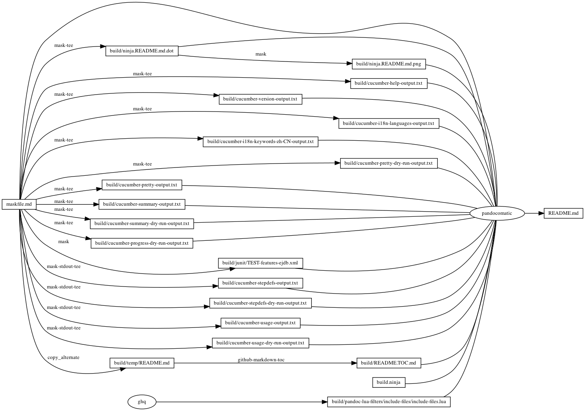

---
pandocomatic_:
    pandoc:
        from: markdown-smart
        to: gfm
        filter:
        - pandoc-include-code
        lua-filter:
        - ./build/pandoc-lua-filters/include-files/include-files.lua
        output: README.md
...

# cucumber

<!-- markdownlint-disable MD007 MD030 -->
```{.include}
./build/README.TOC.md
```
<!-- markdownlint-enable MD007 MD030 -->

# features/ejdb.feature

```{.feature include=./ejdb/features/ejdb.feature}
```

# features/step_definitions/ejdb_steps.rb

```{.ruby include=./ejdb/features/step_definitions/ejdb_steps.rb}
```

# lib/letter.rb

```{.ruby include=./ejdb/lib/letter.rb}
```

# Mask SubCommands

[Mask Awesome](https://github.com/huzhenghui/mask-awesome)

## cucumber-help

```bash
cucumber --help
```

### cucumber-help-output
<!-- markdownlint-disable MD013 -->

```{.plain include=./build/cucumber-help-output.txt}
```
<!-- markdownlint-enable MD013 -->

## cucumber-version

```bash
cucumber --version
```

### cucumber-version-output

```{.plain include=./build/cucumber-version-output.txt}
```

## cucumber-i18n-languages

```bash
cucumber --i18n-languages
```

### cucumber-i18n-languages-output

```{.include format=org}
./build/cucumber-i18n-languages-output.txt
```

## cucumber-i18n-keywords-zh-CN

```bash
cucumber --i18n-keywords zh-CN
```

### cucumber-i18n-keywords-zh-CN-output

```{.include format=org}
./build/cucumber-i18n-keywords-zh-CN-output.txt
```

## cucumber-init

```bash
mkdir  -p ./ejdb
cd ./ejdb
cucumber --init --verbose
```

## cucumber-pretty-dry-run

```bash
cd ./ejdb
cucumber --format pretty --dry-run
```

### cucumber-pretty-dry-run-output

```{.plain include=./build/cucumber-pretty-dry-run-output.txt}
```

## cucumber-pretty

```bash
cd ./ejdb
cucumber --format pretty
```

### cucumber-pretty-output

```{.plain include=./build/cucumber-pretty-output.txt}
```

## cucumber-summary

```bash
cd ./ejdb
cucumber --format summary
```

### cucumber-summary-output

```{.plain include=./build/cucumber-summary-output.txt}
```

## cucumber-summary-dry-run

```bash
cd ./ejdb
cucumber --format summary --dry-run
```

### cucumber-summary-dry-run-output

```{.plain include=./build/cucumber-summary-dry-run-output.txt}
```

## cucumber-progress-dry-run

```bash
cd ./ejdb
cucumber --format progress --dry-run
```

### cucumber-progress-dry-run-output

```{.plain include=./build/cucumber-progress-dry-run-output.txt}
```

## cucumber-junit

```bash
cd ./ejdb
cucumber --format junit --out ../build/junit/
```

### cucumber-junit-output

```{.xml include=./build/junit/TEST-features-ejdb.xml}
```

## cucumber-stepdefs

```bash
cd ./ejdb
cucumber --format stepdefs
```

### cucumber-stepdefs-output

```{.plain include=./build/cucumber-stepdefs-output.txt}
```

## cucumber-stepdefs-dry-run

```bash
cd ./ejdb
cucumber --format stepdefs --dry-run
```

### cucumber-stepdefs--dry-run-output

```{.plain include=./build/cucumber-stepdefs-dry-run-output.txt}
```

## cucumber-usage

```bash
cd ./ejdb
cucumber --format usage
```

### cucumber-usage-output

```{.plain include=./build/cucumber-usage-output.txt}
```

## cucumber-usage-dry-run

```bash
cd ./ejdb
cucumber --format usage --dry-run
```

### cucumber-usage-dry-run-output

```{.plain include=./build/cucumber-usage-dry-run-output.txt}
```

## begin: mask task in template

## readme

```bash
ninja -j 1 --verbose README.md
```

### build.ninja

```{.ninja include=./build.ninja}

```

### ninja custom-rule

```{.ninja include=build.ninja snippet=custom-rule}

```

### ninja custom-build

```{.ninja include=build.ninja snippet=custom-build}

```

## readme-graph-dot

```bash
ninja -t graph README.md
```

### readme-graph-dot-output

```{.dot include=./build/ninja.README.md.dot}

```

## readme-graph-dot-xdot

```bash
detach -- xdot "${MASKFILE_DIR}/build/ninja.README.md.dot"
```

## readme-graph-png

```bash
dot -Tpng -o./build/ninja.README.md.png ./build/ninja.README.md.dot
```



## end: mask task in template
