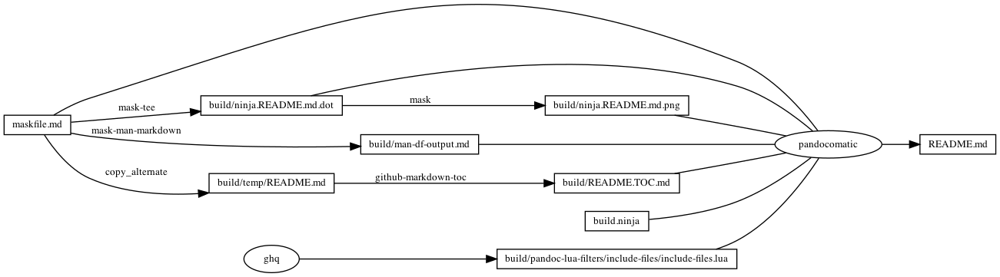

# `df`

<!-- markdownlint-disable MD007 MD030 -->

-   [df](#df)
-   [Mask SubCommands](#mask-subcommands)
    -   [man-df](#man-df)
    -   [man-df-output](#man-df-output)
    -   [df-H](#df-h)
    -   [report](#report)
    -   [begin: mask task in template](#begin-mask-task-in-template)
    -   [readme](#readme)
        -   [build.ninja](#buildninja)
        -   [ninja custom-rule](#ninja-custom-rule)
        -   [ninja custom-build](#ninja-custom-build)
        -   [ninja report-build](#ninja-report-build)
    -   [readme-graph-dot](#readme-graph-dot)
        -   [readme-graph-dot-output](#readme-graph-dot-output)
    -   [readme-graph-dot-xdot](#readme-graph-dot-xdot)
    -   [readme-graph-png](#readme-graph-png)
    -   [end: mask task in template](#end-mask-task-in-template)

<!-- markdownlint-enable MD007 MD030 -->

# Mask SubCommands

[Mask Awesome](https://github.com/huzhenghui/mask-awesome)

## man-df

``` bash
man df
```

## man-df-output

<!-- markdownlint-disable MD012 MD013 -->

  
DF(1)                     BSD General Commands Manual                    DF(1)  
  
**NAME**  
     **df** – display free disk space  
  
**SYNOPSIS**  
     **df** \[**-b** \| **-h** \| **-H** \| **-k** \| **-m** \| **-g** \| **-P**\] \[**-ailn**\] \[**-t**\] \[**-T** **type**\]  
        \[**file** \| **filesystem** **…**\]  
  
**LEGACY** **SYNOPSIS**  
     **df** \[**-b** \| **-h** \| **-H** \| **-k** \| **-m** \| **-P**\] \[**-ailn**\] \[**-t** **type**\] \[**-T** **type**\] \[**file** \|  
     **filesystem** **…**\]  
  
**DESCRIPTION**  
     The **df** utility displays statistics about the amount of free disk space on  
     the specified **filesystem** or on the filesystem of which **file** is a part.  
     Values are displayed in 512-byte per block counts.  If neither a file or  
     a filesystem operand is specified, statistics for all mounted filesystems  
     are displayed (subject to the **-t** option below).  
  
     The following options are available:  
  
     **-a**      Show all mount points, including those that were mounted with the  
             MNT\_IGNORE flag.  
  
     **-b**      Use (the default) 512-byte blocks.  This is only useful as a way  
             to override an BLOCKSIZE specification from the environment.  
  
     **-g**      Use 1073741824-byte (1-Gbyte) blocks rather than the default.  
             Note that this overrides the BLOCKSIZE specification from the  
             environment.  
  
     **-H**      "Human-readable" output.  Use unit suffixes: Byte, Kilobyte,  
             Megabyte, Gigabyte, Terabyte and Petabyte in order to reduce the  
             number of digits to three or less using base 10 for sizes.  
  
     **-h**      "Human-readable" output.  Use unit suffixes: Byte, Kilobyte,  
             Megabyte, Gigabyte, Terabyte and Petabyte in order to reduce the  
             number of digits to three or less using base 2 for sizes.  
  
     **-i**      Include statistics on the number of free inodes. This option is  
             now the default to conform to Version 3 of the Single UNIX  
             Specification (\`\`SUSv3'') Use **-P** to suppress this output.  
  
     **-k**      Use 1024-byte (1-Kbyte) blocks, rather than the default.  Note  
             that this overrides the BLOCKSIZE specification from the environ-  
             ment.  
  
     **-l**      Only display information about locally-mounted filesystems.  
  
     **-m**      Use 1048576-byte (1-Mbyte) blocks rather than the default.  Note  
             that this overrides the BLOCKSIZE specification from the environ-  
             ment.  
  
     **-n**      Print out the previously obtained statistics from the filesys-  
             tems.  This option should be used if it is possible that one or  
             more filesystems are in a state such that they will not be able  
             to provide statistics without a long delay.  When this option is  
             specified, **df** will not request new statistics from the filesys-  
             tems, but will respond with the possibly stale statistics that  
             were previously obtained.  
  
     **-P**      Use (the default) 512-byte blocks.  This is only useful as a way  
             to override an BLOCKSIZE specification from the environment.  
  
     **-T**      Only print out statistics for filesystems of the specified types.  
             More than one type may be specified in a comma separated list.  
             The list of filesystem types can be prefixed with \`\`no'' to spec-  
             ify the filesystem types for which action should **not** be taken.  
             For example, the **df** command:  
  
                   df -T nonfs,mfs  
  
             lists all filesystems except those of type NFS and MFS.  The  
             lsvfs(1) command can be used to find out the types of filesystems  
             that are available on the system.  
  
     **-t**      If used with no arguments, this option is a no-op (Mac OS X  
             already prints the total allocated-space figures).  If used with  
             an argument, it acts like **-T**, but this usage is deprecated and  
             should not be relied upon.  
  
**ENVIRONMENT**  
     BLOCKSIZE  If the environment variable BLOCKSIZE is set, the block counts  
                will be displayed in units of that size block.  
  
**BUGS**  
     The **-n** and **-t** flags are ignored if a file or filesystem is specified.  
  
**LEGACY** **DESCRIPTION**  
     The "capacity" percentage is normally rounded up to the next higher inte-  
     ger.  In legacy mode, it is rounded down to the next lower integer.  
  
     When the **-P** option and the **-k** option are used together, sizes are  
     reported in 1024-blocks.  In legacy mode, when the **-P** option and **-k**  
     option are used together, the last option specified dictates the reported  
     block size.  
  
     The **-t** option is normally a no-op (Mac OS X already prints the total  
     allocated-space figures).  In legacy mode, it is equivalent to **-T**.  
  
     For more information about legacy mode, see compat(5).  
  
**SEE** **ALSO**  
     lsvfs(1), quota(1), fstatfs(2), getfsstat(2), statfs(2), getmntinfo(3),  
     compat(5), fstab(5), mount(8), quot(8)  
  
**HISTORY**  
     A **df** command appeared in Version 1 AT&T UNIX.  
  
BSD                               May 8, 1995                              BSD  

<!-- markdownlint-enable MD012 MD013 -->

## df-H

``` zsh
df -H -a
```

## report

``` bash
shims="$(mktemp -d)"
echo '#!/bin/zsh' > "${shims}/zsh"
echo 'exec /bin/zsh -i "$@"' >> "${shims}/zsh"
chmod u+x "${shims}/zsh"
export PATH="${shims}:${PATH}"
ninja --verbose ./report-output/report.md
```

## begin: mask task in template

## readme

``` bash
ninja --verbose README.md
```

### build.ninja

``` ninja
builddir=./build
mask_subcommand = --help

#######################################
# begin: rule in template

rule mask
  command = mask $mask_subcommand

rule mask-tee
  command = mask --maskfile $in $mask_subcommand 2>&1 | tee $out 1> /dev/null

rule mask-stdout-tee
  command = mask --maskfile $in $mask_subcommand 2>/dev/null | tee $out 1> /dev/null

rule mask-stderr-tee
  command = bash -c 'mask $mask_subcommand 1>/dev/null 2> >(tee $out)'

rule mask-screenshot
  command = $
    regular_logfile="./build/temp/$$(basename $out).mask-screenshot.logfile" && $
    rm -f -v "$${regular_logfile}" && $
    until [[ -s "$${regular_logfile}" ]]; do $
      screen_logfile="$$(mktemp -d)/logfile"; $
      echo "$${screen_logfile}"; $
      mkfifo "$${screen_logfile}"; $
      screen -L -Logfile "$${screen_logfile}" $
        -dmS mask-screenshot-"$$(basename $out)" $
        sh -c "stdbuf -o0 mask --maskfile $in $mask_subcommand; $
          date +'%F %T %Z %z - %+ https://github.com/huzhenghui' | lolcat;"; $
      dd bs=1 if="$${screen_logfile}" of="$${regular_logfile}"; $
    done && $
    ansifilter --html --encoding=utf8 --input="$${regular_logfile}" | $
      tee ./build/temp/"$$(basename $out)".mask-screenshot.html | $
      wkhtmltoimage --format png - "$out"

rule pandocomatic
  command = pandocomatic --input $in --output $out

rule ghq
  command = ghq get --update "$repository" && $
    find -d "$link_dirname" -exec rmdir {} \; && $
    ln -Fs "$$(ghq list --full-path $repository)" "$link_dirname"
  generator = 1

rule github-markdown-toc
  command = gh-md-toc --hide-header --hide-footer --no-escape $in > $out

rule copy_alternate
  command = if [[ -f "$alternate" ]]; $
    then $
      cp "$alternate" "$out"; $
    else $
      cp "$in" "$out"; $
    fi;

# end: rule in template
#######################################

#######################################
# start snippet custom-rule

# <!-- markdownlint-disable MD013 -->
rule mask-man-markdown
  command = mask --maskfile $in $mask_subcommand | $
    ul | $
    ansifilter --bbcode | $
    inv --search-root="$$(ghq list --full-path https://github.com/huzhenghui/pyinvoke-awesome)/bbcode" bbcode-parser-format | $
    pandoc --from=html --to=markdown | $
    tee $out 1> /dev/null
# <!-- markdownlint-enable MD013 -->

# end snippet custom-rule
#######################################

#######################################
# begin: build in template

build ./build/ninja.README.md.dot : mask-tee ./maskfile.md
  mask_subcommand = readme-graph-dot

build ./build/ninja.README.md.png : mask | ./build/ninja.README.md.dot
  mask_subcommand = readme-graph-png

build ./build/pandoc-lua-filters/include-files/include-files.lua : ghq
  repository = https://github.com/pandoc/lua-filters
  link_dirname = ./build/pandoc-lua-filters

build ./build/temp/README.md : copy_alternate ./maskfile.md
  alternate = ./README.md

build ./build/README.TOC.md : github-markdown-toc ./build/temp/README.md

# end: build in template
#######################################

#######################################
# start snippet custom-build

build ./build/man-df-output.md : mask-man-markdown ./maskfile.md
  mask_subcommand = man-df

# end snippet custom-build
#######################################

#######################################
# begin: build README.md
# $ followed by a newline
# escape the newline (continue the current line across a line break).
# the first 4 line in this build is template
build README.md : pandocomatic maskfile.md | $
  ./build.ninja $
  ./build/ninja.README.md.dot $
  ./build/ninja.README.md.png $
  ./build/pandoc-lua-filters/include-files/include-files.lua $
  ./build/README.TOC.md $
  ./build/man-df-output.md

default README.md
# end: build README.md
#######################################

#######################################
# start snippet report-build

build ./report-output/df-H-output.txt : mask-stdout-tee ./maskfile.md
  mask_subcommand = df-H

build ./report-output/df-H-screenshot.png : mask-screenshot ./maskfile.md
  mask_subcommand = df-H

build ./report-output/report.md : pandocomatic ./report-template/report.md | $
  ./build.ninja $
  ./report-output/df-H-output.txt $
  ./report-output/df-H-screenshot.png

# end snippet report-build
#######################################
```

### ninja custom-rule

``` ninja
# <!-- markdownlint-disable MD013 -->
rule mask-man-markdown
  command = mask --maskfile $in $mask_subcommand | $
    ul | $
    ansifilter --bbcode | $
    inv --search-root="$$(ghq list --full-path https://github.com/huzhenghui/pyinvoke-awesome)/bbcode" bbcode-parser-format | $
    pandoc --from=html --to=markdown | $
    tee $out 1> /dev/null
# <!-- markdownlint-enable MD013 -->

```

### ninja custom-build

``` ninja
build ./build/man-df-output.md : mask-man-markdown ./maskfile.md
  mask_subcommand = man-df

```

### ninja report-build

``` ninja
build ./report-output/df-H-output.txt : mask-stdout-tee ./maskfile.md
  mask_subcommand = df-H

build ./report-output/df-H-screenshot.png : mask-screenshot ./maskfile.md
  mask_subcommand = df-H

build ./report-output/report.md : pandocomatic ./report-template/report.md | $
  ./build.ninja $
  ./report-output/df-H-output.txt $
  ./report-output/df-H-screenshot.png

```

## readme-graph-dot

``` bash
ninja -t graph README.md
```

### readme-graph-dot-output


## readme-graph-dot-xdot

``` bash
detach -- xdot "${MASKFILE_DIR}/build/ninja.README.md.dot"
```

## readme-graph-png

``` bash
dot -Tpng -o./build/ninja.README.md.png ./build/ninja.README.md.dot
```



## end: mask task in template
