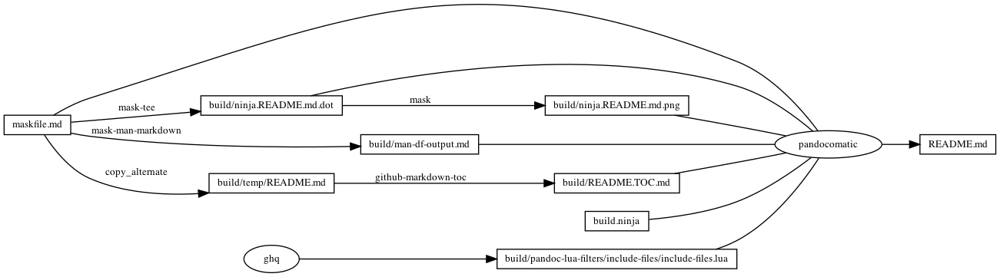

---
pandocomatic_:
    pandoc:
        from: markdown-smart
        to: gfm
        filter:
        - pandoc-include-code
        lua-filter:
        - ./build/pandoc-lua-filters/include-files/include-files.lua
        output: README.md
...

# `df`

<!-- markdownlint-disable MD007 MD030 -->
```{.include}
./build/README.TOC.md
```
<!-- markdownlint-enable MD007 MD030 -->

# Mask SubCommands

[Mask Awesome](https://github.com/huzhenghui/mask-awesome)

## man-df

```bash
man df
```

## man-df-output

<!-- markdownlint-disable MD012 MD013 -->
```{.include}
./build/man-df-output.md
```
<!-- markdownlint-enable MD012 MD013 -->

## df-H

```zsh
df -H -a
```

## report

```bash
shims="$(mktemp -d)"
echo '#!/bin/zsh' > "${shims}/zsh"
echo 'exec /bin/zsh -i "$@"' >> "${shims}/zsh"
chmod u+x "${shims}/zsh"
export PATH="${shims}:${PATH}"
ninja --verbose ./report-output/report.md
```

## begin: mask task in template

## readme

```bash
ninja --verbose README.md
```

### build.ninja

```{.ninja include=./build.ninja}

```

### ninja custom-rule

```{.ninja include=build.ninja snippet=custom-rule}

```

### ninja custom-build

```{.ninja include=build.ninja snippet=custom-build}

```

### ninja report-build

```{.ninja include=build.ninja snippet=report-build}

```

## readme-graph-dot

```bash
ninja -t graph README.md
```

### readme-graph-dot-output

```{.dot include=./build/ninja.README.md.dot}

```

## readme-graph-dot-xdot

```bash
detach -- xdot "${MASKFILE_DIR}/build/ninja.README.md.dot"
```

## readme-graph-png

```bash
dot -Tpng -o./build/ninja.README.md.png ./build/ninja.README.md.dot
```



## end: mask task in template
