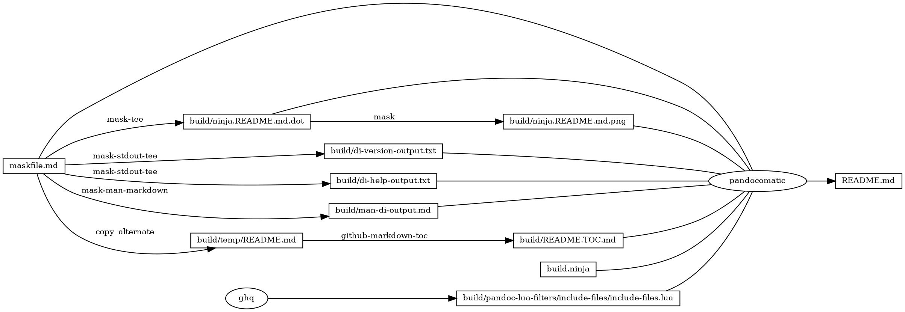

# di

<!-- markdownlint-disable MD007 MD030 -->

-   [di](#di)
-   [Mask SubCommands](#mask-subcommands)
    -   [di-version](#di-version)
        -   [di-version-output](#di-version-output)
    -   [di-help](#di-help)
        -   [di-help-output](#di-help-output)
    -   [di-format](#di-format)
    -   [di-tsv](#di-tsv)
    -   [mi-format](#mi-format)
    -   [mi-tsv](#mi-tsv)
    -   [man-di](#man-di)
        -   [man-di-output](#man-di-output)
    -   [report](#report)
    -   [begin: mask task in template](#begin-mask-task-in-template)
    -   [ninja custom](#ninja-custom)
        -   [ninja custom-rule](#ninja-custom-rule)
        -   [ninja custom-build](#ninja-custom-build)
        -   [ninja report-build](#ninja-report-build)
    -   [readme-md](#readme-md)
        -   [ninja readme-build](#ninja-readme-build)
    -   [readme-graph-dot](#readme-graph-dot)
        -   [readme-graph-dot-output](#readme-graph-dot-output)
    -   [readme-graph-dot-xdot](#readme-graph-dot-xdot)
    -   [readme-graph-png](#readme-graph-png)
    -   [build.ninja](#buildninja)
    -   [end: mask task in template](#end-mask-task-in-template)

<!-- markdownlint-enable MD007 MD030 -->

# Mask SubCommands

[Mask Awesome](https://github.com/huzhenghui/mask-awesome)

## di-version

``` bash
di --version
```

### di-version-output

``` plain
di version 4.48    Default Format: smbuvpT
```

## di-help

``` bash
di --help
```

### di-help-output

``` plain
di version 4.48    Default Format: smbuvpT
Usage: di [-ant] [-d display-size] [-f format] [-x exclude-fstyp-list]
       [-I include-fstyp-list] [file [...]]
   -a   : print all mounted devices
   -d x : size to print blocks in (512 - POSIX, k - kbytes,
          m - megabytes, g - gigabytes, t - terabytes, h - human readable).
   -f x : use format string <x>
   -I x : include only file system types in <x>
   -x x : exclude file system types in <x>
   -l   : display local filesystems only
   -n   : don't print header
   -t   : print totals
 Format string values:
    m - mount point                     M - mount point, full length
    b - total kbytes                    B - kbytes available for use
    u - used kbytes                     c - calculated kbytes in use
    f - kbytes free                     v - kbytes available
    p - percentage not avail. for use   1 - percentage used
    2 - percentage of user-available space in use.
    i - total file slots (i-nodes)      U - used file slots
    F - free file slots                 P - percentage file slots used
    s - filesystem name                 S - filesystem name, full length
    t - disk partition type             T - partition type, full length
See manual page for more options.
```

## di-format

``` bash
di -X 9 --all --total --display-size h -W 11 -f sMbuvpaTiUFPO
```

## di-tsv

``` bash
di --csv-tabs --all --total --display-size h -f sMbuvpaTOiUFP
```

## mi-format

``` bash
mi -X 9 --all --total --display-size h -W 11 -f MSTbufpaiUFPO
```

## mi-tsv

``` bash
mi  --csv-tabs --all --total --display-size h -f MSTObufpaiUFP
```

## man-di

``` bash
man di
```

### man-di-output

<!-- markdownlint-disable MD012 MD013 MD036 -->
<!-- vale off -->

di(1)                                                                    di(1)  
  
  
  
**Name**  
       di - disk information  
  
**Synopsis**  
       **di**  \[**-AacghHklLmnPqRtZ**\]  \[**-B**  *block-size*\] \[**-d** *display-size*\] \[**-f** *format*\]  
       \[**-I**   *include-fstyp-list*\]   \[**-s**   *sort-type*\]   \[**-w**   *block-width*\]   \[**-W**  
       *inode-width*\]  \[**-x**  *exclude-fstyp-list*\]  \[**-X** *debug-level*\] \[**-z** *zone-name*\]  
       \[*file* \[…\]\]  
  
       **mi**  
  
**Description**  
       *di* Displays usage information on mounted filesystems.  Block values are  
       reported  in  a human readable format.  If the user or group has a disk  
       quota, the values reported are adjusted according the quotas that apply  
       to the user.  
  
       If  *file* is specified, the usage information for the partition on which  
       *file* is located is printed.  
  
       Unless the -a flag is specified, the following mounted filesystems will  
       not  normally be displayed: filesystems with total space &lt;= 0; loopback  
       filesystems that are duplicates of other normally  mounted  filesystems  
       (filesystem type of 'lofs' , 'none', or 'nullfs'); loopback filesystems  
       that are part of a zone (Solaris).  
  
       Filesystems that the user does not have permissions to access will  not  
       be displayed at all.  
  
       *mi* Displays the mounted filesystem information.  
  
       Several options may be specified to control the output of *di* and *mi*:  
  
       **-A**     Print all fields (used for debugging).  Mount points and special  
              device names are printed at full width.  
  
       **-a**     (compatibility: **–all**)  
              Prints all mounted devices (normally, those with 0  total  space  
              are not printed - e.g. **/dev/proc**, **/dev/fd**).  
  
       **-B**     *block-size* (compatibility: **–block-size**, **-b**)  
              Change the base block size from 1024 (default) to the size spec-  
              ified.  *block-size* may be  one  of:  k - 1024  bytes,  si - 1000  
              bytes, or a specific size.  
  
       **-c**     (alias: **–csv-output**)  
              Comma separated values are output.  The titles are output as the  
              format string specifiers.  Totals are turned off. See  also  the  
              -n flag.  
  
       **-C**     (alias: **–csv-tabs**)  
              Values  are output with tab separators.  See also the -c option.  
  
       **-d**     *display-size* (alias: **–display-size**)  
              Display the usage in units specified by *display-size*.  Note that  
              if  the  base  block size is SI units of 1000 bytes, the display  
              size is calculated using those units.  *display-size* may  be  one  
              of:  512 - POSIX,  k - kilobytes,  m - megabytes, g - gigabytes,  
              t - terabytes,  p - petabytes,   e - exabytes,   z - zettabytes,  
              y - yottabytes, h - Scaled alternative 1, H - Scaled alternative  
              2, or a specific value to use as the block size.  
  
              Block display sizes greater than 1024 bytes are displayed with a  
              precision of one decimal place after the radix.  
  
              The  Scaled alternatives scale the sizes displayed and appends a  
              suffix (e.g. 48.0k, 3.4M).  
  
              With scaled alternative 1, sizes within a line may scale to dif-  
              ferent units.  
  
              Scaled  alternative  2  scales  all the sizes in each individual  
              line to the same unit size (the largest needed).  
  
       **-f**     *format* Use the specified format string *format*.  See  the  **Format**  
              **Strings** section.  
  
       **-g**     (alias for: **-dg**)  
              Display sizes in gigabytes.  
  
       **-h**     (alias for: **-dh**)  
              Display partition sizes in scaled alternative 1 format.  
  
       **–help**  
              Display some basic usage information.  
  
       **-H**     (alias for: **-dH**; compatibility: **–human-readable**)  
              Display partition sizes in scaled alternative 2 format.  
  
       **-I**     *include-fstype-list* (compatibility: **-F**, **–type**)  
              Include *only* the file system types listed in *include-fstyp-list*.  
              The list is a comma separated list of file system types.  Multi-  
              ple  -I options may be specified.  If the 'fuse' filesystem type  
              is specified, all fuse\* filesystems will be included.  
              e.g. -I nfs,tmpfs or -I nfs -I tmpfs.  
  
       **–inodes**  
              Ignored.  Use the -f option.  
  
       **-k**     (alias for: **-dk**)  
              Display sizes in Kbytes.  
  
       **-l**     (compatibility: **–local**)  
              Display only local file systems.  
  
       **-L**     Turn off check for duplicate filesystems  (loopback  (lofs/none)  
              mounts).  
  
       **-m**     (alias for: **-dm**)  
              Display sizes in megabytes.  
  
       **-n**     Do not print a header line above the list of file systems.  Use-  
              ful when parsing the output of *di*.  
  
       **–no-sync**  
              Ignored.  
  
       **-P**     (compatibility: **–portability**)  
              Output format is POSIX standard.  512 byte  block  size  is  the  
              default.  The -k option may be used.  
  
       **–print-type**  
              Ignored.  Use the -f option.  
  
       **-q**     Disable quota checks.  
  
       **-R**     (also: –dont-resolve-symlinks)  
              Do  not  resolve symlinks (for mount points that have a trailing  
              UUID).  
  
       **-s**     *sort-type*  
              Use *sort-type* to sort the output.  The output of *di* is  normally  
              sorted  by mount point.  The following sort flags may be used to  
              change the sort order: **m** - by mount point (default); **n**  -  leave  
              unsorted  (as  it  appears  in  the mount table); **s** - by special  
              device name; **T** - by total space; **f** -  by  free  space;  **a**  -  by  
              available  space;  **t**  - by filesystem type; **r** - reverse the sort  
              order; This will apply to all sort  flags  following  this  sort  
              flag.  
  
              These sort options may be combined in any order.  e.g.:  
              di -stsrm \# by type, special, reversed mount;  
              di -strsrm \# by type, reversed special, mount.  
  
       **–si**   An alias for **-dH** **-Bsi**.  
  
       **–sync** Ignored.  
  
       **-t**     (compatibility: **–total**)  
              Print  a  totals  line  below  the list of file systems.  Pooled  
              filesystems (zfs, advfs) have only the main pool  added  to  the  
              total.   It  is  up to the user to exclude (using the -x option)  
              read-only filesystems (cdfs, iso9660), swap-based  (memfs,  mfs,  
              tmpfs)  filesystems and user (fuse\*) filesystems.  Excluding the  
              'fuse' filesystem will exclude all fuse\* filesystems.  
  
       **-w**     *block-width*  
              Set the print width for block values.  The default is eight.  
  
       **-v**     Ignored.  
  
       **–version**  
              Display di's version and default format string.  
  
       **-W**     *inode-width*  
              Set the print width for inode values.  Default is seven.  
  
       **-x**     *exclude-fstype-list* (compatibility: **–exclude-type**)  
              Exclude the file system types listed in *exclude-fstyp-list*.  The  
              list  is  a comma separated list of file system types.  Multiple  
              -x options may be specified.  If the 'fuse' filesystem  type  is  
              excluded,  all  fuse\*  filesystems  will  be  excluded.  e.g. -x  
              nfs,tmpfs or -x nfs -x tmpfs.  
  
       **-X**     *level*  
              Set the program's debugging level to *debug-level*.  
  
       **-z**     *zone-name*  
              Display the filesystems for the specified zone.  The  zone  must  
              be visible to the user.  
  
       **-Z**     (alias for: **-z** **all**)  
              Display the filesystems for all visible zones.  
  
**Format** **Strings**  
       The output of *di* may be specified via a format string.  This string may  
       be given either via the **-f** command  line  option  or  as  part  of  the  
       **DI***\_***ARGS**  environment  variable.  The format string may specify the fol-  
       lowing columns:  
  
       **m**      Print the name of the mount point.  
  
       **M**      Print the name of the mount point, at full  length.   The  mount  
              point  is formatted to the maximum width necessary for the long-  
              est mount point name.  
  
       **s**      Print the file system  name  (special  device  or  remote  mount  
              point).  
  
       **S**      Print  the  file  system  name  (special  device or remote mount  
              point), at full length.  The file system name  is  formatted  to  
              the maximum width necessary for the longest file system name.  
  
       **t**      Print the file system type.  
  
       **T**      Print the file system type at full length.  The file system type  
              is formatted to the maximum width necessary for the longest file  
              system type.  
  
       **Total** **Available**  
  
       **b**      Print the total number of megabytes on the file system.  
  
       **B**      Print the total number of megabytes on the file system available  
              for use by normal users.  
  
       **In** **Use**  
  
       **u**      Print the number of megabytes in use on the file system  (actual  
              number of megabytes used = total - free).  
  
       **c**      Print  the  number  of megabytes not available for use by normal  
              users (total - available).  
  
       **Free**  
  
       **f**      Print the number of free (unused) megabytes on the file  system.  
  
       **v**      Print the number of megabytes available for use by normal users.  
  
       **Percentage** **Used**  
  
       **p**      Print the percentage of megabytes not available for use by  nor-  
              mal  users  (number  of  megabytes not available for use / total  
              disk space).  
  
       **1**      Print the percentage of total megabytes in use (actual number of  
              megabytes used / total disk space).  
  
       **2**      Print the percentage of megabytes in use, BSD-style.  Represents  
              the percentage of user-available space in use.  Note that values  
              over  100%  are possible (actual number of megabytes used / disk  
              space available to non-root users).  
  
       **Percentage** **Free**  
  
       **a**      Print the percentage of megabytes available for  use  by  normal  
              users  (number  of  megabytes  available  for  use  / total disk  
              space).  
  
       **3**      Print the percentage of total megabytes free (actual  number  of  
              megabytes free / total disk space).  
  
       **Inodes**  
  
       **i**      Print  the  total number of file slots (inodes) that can be cre-  
              ated on the file system.  
  
       **U**      Print the number of file slots in use.  
  
       **F**      Print the number of file slots available.  
  
       **P**      Print the percentage of file slots in use.  
  
       **Mount** **Information**  
  
       **I**      Print the time the filesystem was mounted.  This column  is  not  
              supported on all systems.  
  
       **O**      Print the filesystem mount options.  
  
       The default format string for *di* is **smbuvpT**.  
  
       The default format string for *mi* is **MSTIO**.  
  
       The  format  string  may  also  contain  any other character not listed  
       above.  The character will be printed as is.  e.g. di  -f  'mbuvp\|iUFP'  
       will  print  the character '\|' between the disk usage and the file slot  
       usage.  The command sequence:  
              di -f 'mbuvp  
              miUFP'  
       will print two lines of data for each filesystem.  
  
**Examples**  
       Various *df* equivalent format strings for System V release 4 are:  
              */usr/bin/df* *-v*     di -P -f msbuf1  
              */usr/bin/df* *-k*     di -dk -f sbcvpm  
              */usr/ucb/df*        di -dk -f sbuv2m  
       GNU df:  
              *df*                 di -dk -f SbuvpM -w 10  
              *df* *-T*              di -dk -f STbuvpM -w 10  
       AIX df:  
              *df*                 di -d 512 -f Sbf1UPM -w 10  
              *df* *-I*              di -d 512 -f Sbuf1M  
              *df* *-I* *-M*           di -d 512 -f SMbuf1 -w 10  
       HP-UX bdf:  
              *bdf*                di -d k -f Sbuv2M  
              *bdf* *-i*             di -d k -f Sbuv2UFPM  
  
       If you like your numbers to add up/calculate the percentage  correctly,  
       try one of the following format strings:  
  
              di -f SMbuf1T  
              di -f SMbcvpT  
              di -f SMBuv2T  
  
**Environment** **Variables**  
       The  DI\_ARGS  environment  variable may be used to specify command line  
       arguments.  e.g. If you always want gigabytes  displayed,  set  DI\_ARGS  
       equal to "-dg".  Any command line arguments specified will override the  
       DI\_ARGS environment variable.  
  
       The DI\_LOCALE\_DIR environment variable may be used to specify the loca-  
       tion of the di program's locale message files.  
  
       The  GNU  df  POSIXLY\_CORRECT,  and DF\_BLOCK\_SIZE and the BSD BLOCKSIZE  
       environment variables are honored.  
  
**Note**  
       For filesystems that do not  report  available  space  (e.g.  System  V  
       release 3), the number of available space is set to the free space.  
  
**WARNING**  
       Do not replace your system's *df* command with this program.  You will in  
       all likelihood break your installation procedures.  
  
**See** **Also**  
       df(1),  fstab(5),  getmnt(2),   getmntinfo(2),   mnttab(4),   mount(1M)  
       statfs(2), statvfs(2)  
  
**Bugs**  
       Send bug reports to: brad.lanam.di\_at\_gmail.com  
  
       Known Issues:  
  
       di  will probably not process a zettabyte or yottabyte sized filesystem  
       properly due to overflow of a long long.  
  
**Website**  
       {{ bbcode-link-0 }}  
  
**Author**  
       This program is Copyright 1994-2011 by Brad Lanam.  
  
       Brad Lanam, Walnut Creek, CA (brad.lanam.di\_at\_gmail.com)  
  
  
  
                                  17 Jan 2013                            di(1)  

<!-- vale on -->
<!-- markdownlint-enable MD012 MD013 MD036 -->

## report

``` bash
ninja --verbose report-output/report.md
```

## begin: mask task in template

## ninja custom

### ninja custom-rule

``` ninja
rule mask-stdout-csv-markdown
  command = mask --maskfile $in $mask_subcommand 2>/dev/null | $
    csvtomd --delimiter "$$(echo $mask_stdout_csv_markdowndelimiter)" | $
    tee $out 1> /dev/null

```

### ninja custom-build

``` ninja
# custom build here

```

### ninja report-build

``` ninja
build ./report-output/di-format-output.txt : mask-stdout-tee ./maskfile.md
  mask_subcommand = di-format

build ./report-output/di-tsv-output.md : mask-stdout-csv-markdown ./maskfile.md
  mask_subcommand = di-tsv
  mask_stdout_csv_markdowndelimiter = "\t"

build ./report-output/mi-format-output.txt : mask-stdout-tee ./maskfile.md
  mask_subcommand = mi-format

build ./report-output/mi-tsv-output.md : mask-stdout-csv-markdown ./maskfile.md
  mask_subcommand = mi-tsv
  mask_stdout_csv_markdowndelimiter = "\t"

build ./report-output/report.md : pandocomatic ./report-template/report.md | $
  ./maskfile.md $
  ./build.ninja $
  ./build/pandoc-lua-filters/include-files/include-files.lua $
  ./report-output/di-format-output.txt $
  ./report-output/di-tsv-output.md $
  ./report-output/mi-format-output.txt $
  ./report-output/mi-tsv-output.md

```

## readme-md

``` bash
ninja --verbose README.md
```

### ninja readme-build

``` ninja
build ./build/di-version-output.txt : mask-stdout-tee ./maskfile.md
  mask_subcommand = di-version

build ./build/di-help-output.txt : mask-stdout-tee ./maskfile.md
  mask_subcommand = di-help

build ./build/man-di-output.md : mask-man-markdown ./maskfile.md
  mask_subcommand = man-di

```

## readme-graph-dot

``` bash
ninja -t graph README.md
```

### readme-graph-dot-output



## readme-graph-dot-xdot

``` bash
detach -- xdot "${MASKFILE_DIR}/build/ninja.README.md.dot"
```

## readme-graph-png

``` bash
dot -Tpng -o./build/ninja.README.md.png ./build/ninja.README.md.dot
```


## build.ninja

``` ninja
builddir=./build
mask_subcommand = --help
mask_stdout_csv_markdowndelimiter = ","

#######################################
# begin: rule in template

rule mask
  command = mask $mask_subcommand

rule mask-tee
  command = mask --maskfile $in $mask_subcommand 2>&1 | tee $out 1> /dev/null

rule mask-stdout-tee
  command = mask --maskfile $in $mask_subcommand 2>/dev/null | tee $out 1> /dev/null

rule mask-stderr-tee
  command = bash -c 'mask $mask_subcommand 1>/dev/null 2> >(tee $out)'

# <!-- markdownlint-disable MD013 -->
rule mask-man-markdown
  command = mask --maskfile $in $mask_subcommand | $
    ul | $
    ansifilter --bbcode | $
    inv --search-root="$$(ghq list --full-path https://github.com/huzhenghui/pyinvoke-awesome)/bbcode" bbcode-parser-format | $
    pandoc --from=html --to=markdown | $
    tee $out 1> /dev/null
# <!-- markdownlint-enable MD013 -->

rule mask-screenshot
  command = $
    regular_logfile="./build/temp/$$(basename $out).mask-screenshot.logfile" && $
    rm -f -v "$${regular_logfile}" && $
    until [[ -s "$${regular_logfile}" ]]; do $
      screen_logfile="$$(mktemp -d)/logfile"; $
      echo "$${screen_logfile}"; $
      mkfifo "$${screen_logfile}"; $
      screen -L -Logfile "$${screen_logfile}" $
        -dmS mask-screenshot-"$$(basename $out)" $
        sh -c "stdbuf -o0 mask --maskfile $in $mask_subcommand; $
          date +'%F %T %Z %z - %+ https://github.com/huzhenghui' | lolcat;"; $
      dd bs=1 if="$${screen_logfile}" of="$${regular_logfile}"; $
    done && $
    ansifilter --html --encoding=utf8 --input="$${regular_logfile}" | $
      tee ./build/temp/"$$(basename $out)".mask-screenshot.html | $
      wkhtmltoimage --format png - "$out"

rule pandocomatic
  command = pandocomatic --input $in --output $out

rule ghq
  command = ghq get --update "$repository" && $
    find -d "$link_dirname" -exec rmdir {} \; && $
    ln -Fs "$$(ghq list --full-path $repository)" "$link_dirname"
  generator = 1

rule github-markdown-toc
  command = gh-md-toc --hide-header --hide-footer --no-escape $in > $out

rule copy_alternate
  command = if [[ -f "$alternate" ]]; $
    then $
      cp "$alternate" "$out"; $
    else $
      cp "$in" "$out"; $
    fi;

# end: rule in template
#######################################

#######################################
# start snippet custom-rule

rule mask-stdout-csv-markdown
  command = mask --maskfile $in $mask_subcommand 2>/dev/null | $
    csvtomd --delimiter "$$(echo $mask_stdout_csv_markdowndelimiter)" | $
    tee $out 1> /dev/null

# end snippet custom-rule
#######################################

#######################################
# start snippet custom-build

# custom build here

# end snippet custom-build
#######################################

#######################################
# start snippet report-build

build ./report-output/di-format-output.txt : mask-stdout-tee ./maskfile.md
  mask_subcommand = di-format

build ./report-output/di-tsv-output.md : mask-stdout-csv-markdown ./maskfile.md
  mask_subcommand = di-tsv
  mask_stdout_csv_markdowndelimiter = "\t"

build ./report-output/mi-format-output.txt : mask-stdout-tee ./maskfile.md
  mask_subcommand = mi-format

build ./report-output/mi-tsv-output.md : mask-stdout-csv-markdown ./maskfile.md
  mask_subcommand = mi-tsv
  mask_stdout_csv_markdowndelimiter = "\t"

build ./report-output/report.md : pandocomatic ./report-template/report.md | $
  ./maskfile.md $
  ./build.ninja $
  ./build/pandoc-lua-filters/include-files/include-files.lua $
  ./report-output/di-format-output.txt $
  ./report-output/di-tsv-output.md $
  ./report-output/mi-format-output.txt $
  ./report-output/mi-tsv-output.md

# end snippet report-build
#######################################

#######################################
# begin: readme-build in template

build ./build/ninja.README.md.dot : mask-tee ./maskfile.md
  mask_subcommand = readme-graph-dot

build ./build/ninja.README.md.png : mask | ./build/ninja.README.md.dot
  mask_subcommand = readme-graph-png

build ./build/pandoc-lua-filters/include-files/include-files.lua : ghq
  repository = https://github.com/pandoc/lua-filters
  link_dirname = ./build/pandoc-lua-filters

build ./build/temp/README.md : copy_alternate ./maskfile.md
  alternate = ./README.md

build ./build/README.TOC.md : github-markdown-toc ./build/temp/README.md

# end: readme-build in template
#######################################

#######################################
# start snippet readme-build

build ./build/di-version-output.txt : mask-stdout-tee ./maskfile.md
  mask_subcommand = di-version

build ./build/di-help-output.txt : mask-stdout-tee ./maskfile.md
  mask_subcommand = di-help

build ./build/man-di-output.md : mask-man-markdown ./maskfile.md
  mask_subcommand = man-di

# end snippet readme-build
#######################################

#######################################
# begin: build README.md
# $ followed by a newline
# escape the newline (continue the current line across a line break).
# the first 4 line in this build is template
build README.md : pandocomatic maskfile.md | $
  ./build.ninja $
  ./build/ninja.README.md.dot $
  ./build/ninja.README.md.png $
  ./build/pandoc-lua-filters/include-files/include-files.lua $
  ./build/README.TOC.md $
  ./build/di-version-output.txt $
  ./build/di-help-output.txt $
  ./build/man-di-output.md

default README.md
# end: build README.md
#######################################

```

## end: mask task in template
