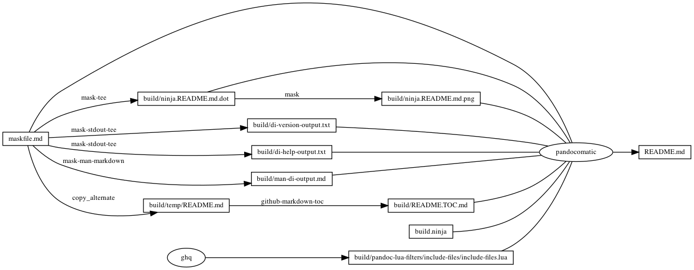

---
pandocomatic_:
    pandoc:
        from: markdown-smart
        to: gfm
        filter:
        - pandoc-include-code
        lua-filter:
        - ./build/pandoc-lua-filters/include-files/include-files.lua
        output: README.md
...

# di

<!-- markdownlint-disable MD007 MD030 -->
```{.include}
./build/README.TOC.md
```
<!-- markdownlint-enable MD007 MD030 -->

# Mask SubCommands

[Mask Awesome](https://github.com/huzhenghui/mask-awesome)

## di-version

```bash
di --version
```

### di-version-output

```{.plain include=./build/di-version-output.txt}
```

## di-help

```bash
di --help
```

### di-help-output

```{.plain include=./build/di-help-output.txt}
```

## di-format

```bash
di -X 9 --all --total --display-size h -W 11 -f sMbuvpaTiUFPO
```

## di-tsv

```bash
di --csv-tabs --all --total --display-size h -f sMbuvpaTOiUFP
```

## mi-format

```bash
mi -X 9 --all --total --display-size h -W 11 -f MSTbufpaiUFPO
```

## mi-tsv

```bash
mi  --csv-tabs --all --total --display-size h -f MSTObufpaiUFP
```

## man-di

```bash
man di
```

### man-di-output

<!-- markdownlint-disable MD012 MD013 MD036 -->
<!-- vale off -->
```{.include}
./build/man-di-output.md
```
<!-- vale on -->
<!-- markdownlint-enable MD012 MD013 MD036 -->

## report

```bash
ninja --verbose report-output/report.md
```

## begin: mask task in template

## ninja custom

### ninja custom-rule

```{.ninja include=build.ninja snippet=custom-rule}

```

### ninja custom-build

```{.ninja include=build.ninja snippet=custom-build}

```

### ninja report-build

```{.ninja include=build.ninja snippet=report-build}

```

## readme-md

```bash
ninja --verbose README.md
```

### ninja readme-build

```{.ninja include=build.ninja snippet=readme-build}

```

## readme-graph-dot

```bash
ninja -t graph README.md
```

### readme-graph-dot-output

```{.dot include=./build/ninja.README.md.dot}

```

## readme-graph-dot-xdot

```bash
detach -- xdot "${MASKFILE_DIR}/build/ninja.README.md.dot"
```

## readme-graph-png

```bash
dot -Tpng -o./build/ninja.README.md.png ./build/ninja.README.md.dot
```



## build.ninja

```{.ninja include=./build.ninja}

```

## end: mask task in template
