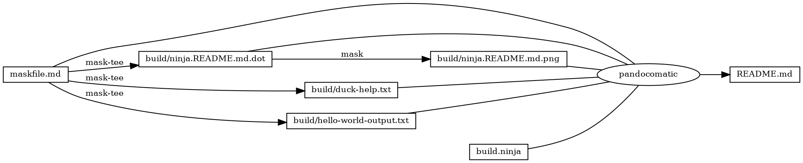
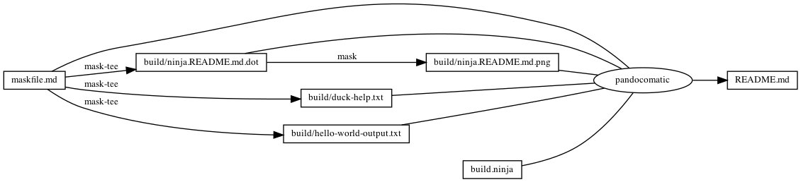

------------------------------------------------------------------------

    pandocomatic_:
        pandoc:
            from: markdown
            to: markdown-fenced_code_attributes
            filter:
            - pandoc-include-code
            output: README.md

...

# duckscript

# https://github.com/huzhenghui/mask-awesome

## duck-help

``` bash
/usr/local/opt/duckscript/bin/duck --help
```

## duck-help-output

``` plain
duckscript 0.7.1
Sagie Gur-Ari <sagiegurari@gmail.com>
The duckscript command line executable.

USAGE:
    duck [FLAGS] [FILE]

FLAGS:
    -h, --help      Prints help information
    -e, --eval      Evaluate script
    -l, --lint      Lints the provided file

ARGS:
    <FILE>          The script file to execute/lint

```

## hello-world

``` bash
/usr/local/opt/duckscript/bin/duck ./hello_world.ds
```

### hello_world.ds

``` duckscript
echo Hello World
```

### hello-world-output

``` plain
Hello World 
```

## begin: mask task in template

## readme

``` bash
ninja --verbose README.md
```

### build.ninja

``` ninja
builddir=./build
mask_subcommand = --help

#######################################
# begin: rule in template

rule mask
  command = mask $mask_subcommand

rule mask-tee
  command = mask $mask_subcommand 2>&1 | tee $out 1> /dev/null

rule pandocomatic
  command = pandocomatic --input $in --output $out

# end: rule in template
#######################################

#######################################a
# begin: custom rule

# custom rule here

# end: custom rule
#######################################

#######################################
# begin: build in template

build ./build/ninja.README.md.dot: mask-tee | ./maskfile.md
  mask_subcommand = readme-grapth-dot

build ./build/ninja.README.md.png : mask | ./build/ninja.README.md.dot
  mask_subcommand = readme-grapth-png

# end: build in template
#######################################

#######################################a
# begin: custom build

build ./build/duck-help.txt: mask-tee | ./maskfile.md
  mask_subcommand = duck-help

build ./build/hello-world-output.txt: mask-tee | ./maskfile.md
  mask_subcommand = hello-world

# end: custom build
#######################################

#######################################
# begin: build README.md
# $ followed by a newline
# escape the newline (continue the current line across a line break).
# the first 4 line in this build is template
build README.md: pandocomatic maskfile.md | $
  build.ninja $
  ./build/ninja.README.md.dot $
  ./build/ninja.README.md.png $
  ./build/duck-help.txt $
  ./build/hello-world-output.txt

default README.md
# end: build README.md
#######################################
```

## readme-grapth-dot

``` bash
ninja -t graph README.md
```

### readme-grapth-dot-output



## readme-grapth-png

``` bash
dot -Tpng -o./build/ninja.README.md.png ./build/ninja.README.md.dot
```



## end: mask task in template
