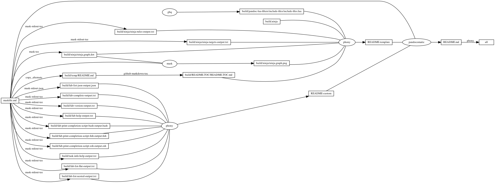

# fabric

<!-- markdownlint-disable MD007 MD030 -->

-   [fabric](#fabric)
-   [./fabfile.py](#fabfilepy)
-   [Mask SubCommands](#mask-subcommands)
    -   [task-info](#task-info)
    -   [fab-list-flat](#fab-list-flat)
        -   [fab-list-flat-output](#fab-list-flat-output)
    -   [fab-list-nested](#fab-list-nested)
        -   [fab-list-nested-output](#fab-list-nested-output)
    -   [fab-list-json](#fab-list-json)
        -   [fab-list-json-output](#fab-list-json-output)
    -   [fab-complete](#fab-complete)
        -   [fab-complete-output](#fab-complete-output)
    -   [fab-version](#fab-version)
        -   [fab-version-output](#fab-version-output)
    -   [fab-help](#fab-help)
        -   [fab-help-output](#fab-help-output)
    -   [fab-print-completion-script-bash](#fab-print-completion-script-bash)
        -   [fab-print-completion-script-bash-output](#fab-print-completion-script-bash-output)
    -   [fab-print-completion-script-fish](#fab-print-completion-script-fish)
        -   [fab-print-completion-script-fish-output](#fab-print-completion-script-fish-output)
    -   [fab-print-completion-script-zsh](#fab-print-completion-script-zsh)
        -   [fab-print-completion-script-zsh-output](#fab-print-completion-script-zsh-output)
    -   [begin: mask task in template : build
        content](#begin-mask-task-in-template--build-content)
    -   [ninja-rules](#ninja-rules)
        -   [ninja custom-rule](#ninja-custom-rule)
        -   [ninja-rules-output](#ninja-rules-output)
    -   [ninja-targets](#ninja-targets)
        -   [ninja build-all](#ninja-build-all)
        -   [ninja custom-build](#ninja-custom-build)
        -   [ninja report-build](#ninja-report-build)
        -   [ninja-targets-output](#ninja-targets-output)
    -   [readme-md](#readme-md)
        -   [ninja readme-build](#ninja-readme-build)
    -   [end: mask task in template : build
        content](#end-mask-task-in-template--build-content)
    -   [begin: mask task in template : ninja
        command](#begin-mask-task-in-template--ninja-command)
    -   [ninja-browse](#ninja-browse)
    -   [ninja-graph-png](#ninja-graph-png)
    -   [ninja-graph-dot-xdot](#ninja-graph-dot-xdot)
    -   [ninja-graph-dot](#ninja-graph-dot)
        -   [ninja-graph-dot-output](#ninja-graph-dot-output)
    -   [ninja-all](#ninja-all)
        -   [build.ninja](#buildninja)
    -   [end: mask task in template : ninja
        command](#end-mask-task-in-template--ninja-command)

<!-- markdownlint-enable MD007 MD030 -->

# ./fabfile.py

<!-- markdownlint-disable MD013 -->

``` python
import os

from invoke.context import Context
from invoke.runners import Result

from fabric import Connection, task


@task
def info(c):
    assert os.environ["Keychain_service"]
    assert os.environ["Keychain_account"]
    assert os.environ["host"]
    context: Context = c
    r: Result = context.run(
        'mask --maskfile "$(ghq list --full-path https://github.com/huzhenghui/Keychain-Generic-Password)/maskfile.md" get --service "${Keychain_service}" --account "${Keychain_account}"',
        shell="/bin/zsh",
        hide=True,
        env={
            "Keychain_service": os.environ["Keychain_service"],
            "Keychain_account": os.environ["Keychain_account"]
        }
    )
    conn = Connection(
        os.environ["host"],
        connect_kwargs={"password": r.stdout.splitlines()[0]}
    )
    conn.run("cat /proc/version", echo=True)
    conn.run("uname -a", echo=True)
    conn.run("df -h", echo=True)
    conn.run("w", echo=True)
    conn.run("whoami", echo=True)
    conn.run("ifconfig", echo=True)
    conn.run("route -n", echo=True)
    conn.run("last", echo=True)
```

<!-- markdownlint-enable MD013 -->

# Mask SubCommands

[Mask Awesome](https://github.com/huzhenghui/mask-awesome)

## task-info

-   `--hide=both`
    -   [run(command,
        \*\*kwargs)](http://docs.pyinvoke.org/en/latest/api/runners.html#invoke.runners.Runner.run)

        > Allows the caller to disable run’s default behavior of copying
        > the subprocess’ stdout and stderr to the controlling terminal.
        > Specify hide='out' (or 'stdout') to hide only the stdout
        > stream, hide='err' (or 'stderr') to hide only stderr, or
        > hide='both' (or True) to hide both streams.

``` bash
fab --hide=both info
```

## task-info-help

``` bash
fab info --help
```

### task-info-help-output

``` plain
Usage: fab [--core-opts] info [other tasks here ...]

Docstring:
  none

Options:
  none

```

## fab-list-flat

``` bash
fab --list --list-format flat
```

### fab-list-flat-output

``` plain
Available tasks:

  info

```

## fab-list-nested

``` bash
fab --list --list-format nested
```

### fab-list-nested-output

``` plain
Available tasks ('*' denotes collection defaults):

  info

```

## fab-list-json

``` bash
fab --list --list-format json
```

### fab-list-json-output

``` json
{
  "name": "fabfile",
  "help": null,
  "default": null,
  "tasks": [
    {
      "name": "info",
      "help": null,
      "aliases": []
    }
  ],
  "collections": []
}
```

## fab-complete

``` bash
fab --complete
```

### fab-complete-output

``` plain
info
```

## fab-version

``` bash
fab --version
```

### fab-version-output

``` plain
Fabric 2.6.0
Paramiko 2.7.2
Invoke 1.5.0
```

## fab-help

``` bash
fab --help
```

### fab-help-output

``` plain
Usage: fab [--core-opts] task1 [--task1-opts] ... taskN [--taskN-opts]

Core options:

  --complete                         Print tab-completion candidates for given
                                     parse remainder.
  --hide=STRING                      Set default value of run()'s 'hide' kwarg.
  --no-dedupe                        Disable task deduplication.
  --print-completion-script=STRING   Print the tab-completion script for your
                                     preferred shell (bash|zsh|fish).
  --prompt-for-login-password        Request an upfront SSH-auth password
                                     prompt.
  --prompt-for-passphrase            Request an upfront SSH key passphrase
                                     prompt.
  --prompt-for-sudo-password         Prompt user at start of session for the
                                     sudo.password config value.
  --write-pyc                        Enable creation of .pyc files.
  -c STRING, --collection=STRING     Specify collection name to load.
  -d, --debug                        Enable debug output.
  -D INT, --list-depth=INT           When listing tasks, only show the first
                                     INT levels.
  -e, --echo                         Echo executed commands before running.
  -f STRING, --config=STRING         Runtime configuration file to use.
  -F STRING, --list-format=STRING    Change the display format used when
                                     listing tasks. Should be one of: flat
                                     (default), nested, json.
  -h [STRING], --help[=STRING]       Show core or per-task help and exit.
  -H STRING, --hosts=STRING          Comma-separated host name(s) to execute
                                     tasks against.
  -i, --identity                     Path to runtime SSH identity (key) file.
                                     May be given multiple times.
  -l [STRING], --list[=STRING]       List available tasks, optionally limited
                                     to a namespace.
  -p, --pty                          Use a pty when executing shell commands.
  -r STRING, --search-root=STRING    Change root directory used for finding
                                     task modules.
  -R, --dry                          Echo commands instead of running.
  -S STRING, --ssh-config=STRING     Path to runtime SSH config file.
  -t INT, --connect-timeout=INT      Specifies default connection timeout, in
                                     seconds.
  -T INT, --command-timeout=INT      Specify a global command execution
                                     timeout, in seconds.
  -V, --version                      Show version and exit.
  -w, --warn-only                    Warn, instead of failing, when shell
                                     commands fail.

```

## fab-print-completion-script-bash

``` bash
fab --print-completion-script bash
```

### fab-print-completion-script-bash-output

``` bash
# Invoke tab-completion script to be sourced with Bash shell.
# Known to work on Bash 3.x, untested on 4.x.

_complete_fab() {
    local candidates

    # COMP_WORDS contains the entire command string up til now (including
    # program name).
    # We hand it to Invoke so it can figure out the current context: spit back
    # core options, task names, the current task's options, or some combo.
    candidates=`fab --complete -- ${COMP_WORDS[*]}`

    # `compgen -W` takes list of valid options & a partial word & spits back
    # possible matches. Necessary for any partial word completions (vs
    # completions performed when no partial words are present).
    #
    # $2 is the current word or token being tabbed on, either empty string or a
    # partial word, and thus wants to be compgen'd to arrive at some subset of
    # our candidate list which actually matches.
    #
    # COMPREPLY is the list of valid completions handed back to `complete`.
    COMPREPLY=( $(compgen -W "${candidates}" -- $2) )
}


# Tell shell builtin to use the above for completing our invocations.
# * -F: use given function name to generate completions.
# * -o default: when function generates no results, use filenames.
# * positional args: program names to complete for.
complete -F _complete_fab -o default fab

# vim: set ft=sh :

```

## fab-print-completion-script-fish

``` fish
fab --print-completion-script fish
```

### fab-print-completion-script-fish-output

``` fish
# Invoke tab-completion script for the fish shell
# Copy it to the ~/.config/fish/completions directory

function __complete_fab
    fab --complete -- (commandline --tokenize)
end

# --no-files: Don't complete files unless invoke gives an empty result
# TODO: find a way to honor all binary_names
complete --command fab --no-files --arguments '(__complete_fab)'

```

## fab-print-completion-script-zsh

``` zsh
fab --print-completion-script zsh
```

### fab-print-completion-script-zsh-output

``` zsh
# Invoke tab-completion script to be sourced with the Z shell.
# Known to work on zsh 5.0.x, probably works on later 4.x releases as well (as
# it uses the older compctl completion system).

_complete_fab() {
    # `words` contains the entire command string up til now (including
    # program name).
    #
    # We hand it to Invoke so it can figure out the current context: spit back
    # core options, task names, the current task's options, or some combo.
    #
    # Before doing so, we attempt to tease out any collection flag+arg so we
    # can ensure it is applied correctly.
    collection_arg=''
    if [[ "${words}" =~ "(-c|--collection) [^ ]+" ]]; then
        collection_arg=$MATCH
    fi
    # `reply` is the array of valid completions handed back to `compctl`.
    # Use ${=...} to force whitespace splitting in expansion of
    # $collection_arg
    reply=( $(fab ${=collection_arg} --complete -- ${words}) )
}


# Tell shell builtin to use the above for completing our given binary name(s).
# * -K: use given function name to generate completions.
# * +: specifies 'alternative' completion, where options after the '+' are only
#   used if the completion from the options before the '+' result in no matches.
# * -f: when function generates no results, use filenames.
# * positional args: program names to complete for.
compctl -K _complete_fab + -f fab

# vim: set ft=sh :

```

## begin: mask task in template : build content

## ninja-rules

``` bash
ninja -t rules
```

### ninja custom-rule

``` ninja
# custom rule here

```

### ninja-rules-output

``` plain
cmdshelf-repository
copy_alternate
ghq
github-markdown-toc
mask
mask-man-markdown
mask-screenshot
mask-stderr-tee
mask-stdout-csv-markdown
mask-stdout-json
mask-stdout-tee
mask-tee
pandocomatic
phony
```

## ninja-targets

``` bash
ninja -t targets all
```

### ninja build-all

``` ninja
build all: phony README.md

default all

```

### ninja custom-build

``` ninja
# custom build here

```

### ninja report-build

``` ninja
# report build here

```

### ninja-targets-output

``` plain
all: phony
build/pandoc-lua-filters/include-files/include-files.lua: ghq
build/ninja/ninja-rules-output.txt: mask-stdout-tee
build/ninja/ninja-targets-output.txt: mask-stdout-tee
build/ninja/ninja.graph.dot: mask-tee
build/ninja/ninja.graph.png: mask
build/temp/README.md: copy_alternate
build/README.TOC/README.TOC.md: github-markdown-toc
README-template: phony
build/task-info-help-output.txt: mask-stdout-tee
build/fab-list-flat-output.txt: mask-stdout-tee
build/fab-list-nested-output.txt: mask-stdout-tee
build/fab-list-json-output.json: mask-stdout-json
build/fab-complete-output.txt: mask-stdout-tee
build/fab-version-output.txt: mask-stdout-tee
build/fab-help-output.txt: mask-stdout-tee
build/fab-print-completion-script-bash-output.bash: mask-stdout-tee
build/fab-print-completion-script-fish-output.fish: mask-stdout-tee
build/fab-print-completion-script-zsh-output.zsh: mask-stdout-tee
README-custom: phony
README.md: pandocomatic
```

## readme-md

``` bash
ninja --verbose README.md
```

### ninja readme-build

``` ninja
build ./build/task-info-help-output.txt : mask-stdout-tee ./maskfile.md
  mask_subcommand = task-info-help

build ./build/fab-list-flat-output.txt : mask-stdout-tee ./maskfile.md
  mask_subcommand = fab-list-flat

build ./build/fab-list-nested-output.txt : mask-stdout-tee ./maskfile.md
  mask_subcommand = fab-list-nested

build ./build/fab-list-json-output.json : mask-stdout-json ./maskfile.md
  mask_subcommand = fab-list-json

build ./build/fab-complete-output.txt : mask-stdout-tee ./maskfile.md
  mask_subcommand = fab-complete

build ./build/fab-version-output.txt : mask-stdout-tee ./maskfile.md
  mask_subcommand = fab-version

build ./build/fab-help-output.txt : mask-stdout-tee ./maskfile.md
  mask_subcommand = fab-help

build ./build/fab-print-completion-script-bash-output.bash : mask-stdout-tee ./maskfile.md
  mask_subcommand = fab-print-completion-script-bash

build ./build/fab-print-completion-script-fish-output.fish : mask-stdout-tee ./maskfile.md
  mask_subcommand = fab-print-completion-script-fish

build ./build/fab-print-completion-script-zsh-output.zsh : mask-stdout-tee ./maskfile.md
  mask_subcommand = fab-print-completion-script-zsh

build README-custom : phony $
  ./build/task-info-help-output.txt $
  ./build/fab-list-flat-output.txt $
  ./build/fab-list-nested-output.txt $
  ./build/fab-list-json-output.json $
  ./build/fab-complete-output.txt $
  ./build/fab-version-output.txt $
  ./build/fab-help-output.txt $
  ./build/fab-print-completion-script-bash-output.bash $
  ./build/fab-print-completion-script-fish-output.fish $
  ./build/fab-print-completion-script-zsh-output.zsh

```

``` ninja
build README.md : pandocomatic maskfile.md | README-template README-custom

```

## end: mask task in template : build content

## begin: mask task in template : ninja command

## ninja-browse

``` bash
ninja -t browse
```

## ninja-graph-png

``` bash
dot -Tpng -o./build/ninja/ninja.graph.png ./build/ninja/ninja.graph.dot
```



## ninja-graph-dot-xdot

``` bash
detach -- xdot "${MASKFILE_DIR}/build/ninja/ninja.graph.dot"
```

## ninja-graph-dot

``` bash
ninja -t graph
```

### ninja-graph-dot-output

``` dot
digraph ninja {
rankdir="LR"
node [fontsize=10, shape=box, height=0.25]
edge [fontsize=10]
"0x7f9068d06600" [label="all"]
"0x7f9068d06690" -> "0x7f9068d06600" [label=" phony"]
"0x7f9068d06690" [label="README.md"]
"0x7f9068d09150" [label="pandocomatic", shape=ellipse]
"0x7f9068d09150" -> "0x7f9068d06690"
"0x7f9068d06e80" -> "0x7f9068d09150" [arrowhead=none]
"0x7f9068d07840" -> "0x7f9068d09150" [arrowhead=none]
"0x7f9068d090a0" -> "0x7f9068d09150" [arrowhead=none]
"0x7f9068d06e80" [label="maskfile.md"]
"0x7f9068d07840" [label="README-template"]
"0x7f9068d078e0" [label="phony", shape=ellipse]
"0x7f9068d078e0" -> "0x7f9068d07840"
"0x7f9068d06bc0" -> "0x7f9068d078e0" [arrowhead=none]
"0x7f9068d07c20" -> "0x7f9068d078e0" [arrowhead=none]
"0x7f9068d06dc0" -> "0x7f9068d078e0" [arrowhead=none]
"0x7f9068d07030" -> "0x7f9068d078e0" [arrowhead=none]
"0x7f9068d07290" -> "0x7f9068d078e0" [arrowhead=none]
"0x7f9068d074d0" -> "0x7f9068d078e0" [arrowhead=none]
"0x7f9068d07790" -> "0x7f9068d078e0" [arrowhead=none]
"0x7f9068d06bc0" [label="build/pandoc-lua-filters/include-files/include-files.lua"]
"0x7f9068d06b50" [label="ghq", shape=ellipse]
"0x7f9068d06b50" -> "0x7f9068d06bc0"
"0x7f9068d07c20" [label="build.ninja"]
"0x7f9068d06dc0" [label="build/ninja/ninja-rules-output.txt"]
"0x7f9068d06e80" -> "0x7f9068d06dc0" [label=" mask-stdout-tee"]
"0x7f9068d07030" [label="build/ninja/ninja-targets-output.txt"]
"0x7f9068d06e80" -> "0x7f9068d07030" [label=" mask-stdout-tee"]
"0x7f9068d07290" [label="build/ninja/ninja.graph.dot"]
"0x7f9068d06e80" -> "0x7f9068d07290" [label=" mask-tee"]
"0x7f9068d074d0" [label="build/ninja/ninja.graph.png"]
"0x7f9068d07460" [label="mask", shape=ellipse]
"0x7f9068d07460" -> "0x7f9068d074d0"
"0x7f9068d06e80" -> "0x7f9068d07460" [arrowhead=none]
"0x7f9068d07290" -> "0x7f9068d07460" [arrowhead=none]
"0x7f9068d07790" [label="build/README.TOC/README.TOC.md"]
"0x7f9068d075f0" -> "0x7f9068d07790" [label=" github-markdown-toc"]
"0x7f9068d075f0" [label="build/temp/README.md"]
"0x7f9068d06e80" -> "0x7f9068d075f0" [label=" copy_alternate"]
"0x7f9068d090a0" [label="README-custom"]
"0x7f9068d08f60" [label="phony", shape=ellipse]
"0x7f9068d08f60" -> "0x7f9068d090a0"
"0x7f9068d07a10" -> "0x7f9068d08f60" [arrowhead=none]
"0x7f9068d07de0" -> "0x7f9068d08f60" [arrowhead=none]
"0x7f9068d07fc0" -> "0x7f9068d08f60" [arrowhead=none]
"0x7f9068d081b0" -> "0x7f9068d08f60" [arrowhead=none]
"0x7f9068d083b0" -> "0x7f9068d08f60" [arrowhead=none]
"0x7f9068d08560" -> "0x7f9068d08f60" [arrowhead=none]
"0x7f9068d08740" -> "0x7f9068d08f60" [arrowhead=none]
"0x7f9068d08aa0" -> "0x7f9068d08f60" [arrowhead=none]
"0x7f9068d08c40" -> "0x7f9068d08f60" [arrowhead=none]
"0x7f9068d08e60" -> "0x7f9068d08f60" [arrowhead=none]
"0x7f9068d07a10" [label="build/task-info-help-output.txt"]
"0x7f9068d06e80" -> "0x7f9068d07a10" [label=" mask-stdout-tee"]
"0x7f9068d07de0" [label="build/fab-list-flat-output.txt"]
"0x7f9068d06e80" -> "0x7f9068d07de0" [label=" mask-stdout-tee"]
"0x7f9068d07fc0" [label="build/fab-list-nested-output.txt"]
"0x7f9068d06e80" -> "0x7f9068d07fc0" [label=" mask-stdout-tee"]
"0x7f9068d081b0" [label="build/fab-list-json-output.json"]
"0x7f9068d06e80" -> "0x7f9068d081b0" [label=" mask-stdout-json"]
"0x7f9068d083b0" [label="build/fab-complete-output.txt"]
"0x7f9068d06e80" -> "0x7f9068d083b0" [label=" mask-stdout-tee"]
"0x7f9068d08560" [label="build/fab-version-output.txt"]
"0x7f9068d06e80" -> "0x7f9068d08560" [label=" mask-stdout-tee"]
"0x7f9068d08740" [label="build/fab-help-output.txt"]
"0x7f9068d06e80" -> "0x7f9068d08740" [label=" mask-stdout-tee"]
"0x7f9068d08aa0" [label="build/fab-print-completion-script-bash-output.bash"]
"0x7f9068d06e80" -> "0x7f9068d08aa0" [label=" mask-stdout-tee"]
"0x7f9068d08c40" [label="build/fab-print-completion-script-fish-output.fish"]
"0x7f9068d06e80" -> "0x7f9068d08c40" [label=" mask-stdout-tee"]
"0x7f9068d08e60" [label="build/fab-print-completion-script-zsh-output.zsh"]
"0x7f9068d06e80" -> "0x7f9068d08e60" [label=" mask-stdout-tee"]
}
```



## ninja-all

``` bash
ninja --verbose
```

### build.ninja

``` ninja
builddir=./build
mask_subcommand = --help
mask_stdout_csv_markdowndelimiter = ","

#######################################
# begin: rule in template

rule mask
  command = mask --maskfile $in $mask_subcommand

rule mask-tee
  command = mask --maskfile $in $mask_subcommand 2>&1 | tee $out 1> /dev/null

rule mask-stdout-tee
  command = mask --maskfile $in $mask_subcommand 2>/dev/null | tee $out 1> /dev/null

rule mask-stderr-tee
  command = bash -c 'mask $mask_subcommand 1>/dev/null 2> >(tee $out)'

# <!-- markdownlint-disable MD013 -->
rule mask-man-markdown
  command = set -e && set -o pipefail && $
    mask --maskfile $in $mask_subcommand | $
    ul | $
    ansifilter --bbcode | $
    inv --search-root="$$(ghq list --full-path https://github.com/huzhenghui/pyinvoke-awesome)/bbcode" bbcode-parser-format | $
    pandoc --from=html --to=markdown | $
    tee $out 1> /dev/null
# <!-- markdownlint-enable MD013 -->

rule mask-stdout-csv-markdown
  command = mask --maskfile $in $mask_subcommand 2>/dev/null | $
    csvtomd --delimiter "$$(echo $mask_stdout_csv_markdowndelimiter)" | $
    tee $out 1> /dev/null

rule mask-stdout-json
  command = mask --maskfile $in $mask_subcommand 2>/dev/null | $
    jq | $
    tee $out 1> /dev/null

rule mask-screenshot
  command = $
    regular_logfile="./build/temp/$$(basename $out).mask-screenshot.logfile" && $
    rm -f -v "$${regular_logfile}" && $
    until [[ -s "$${regular_logfile}" ]]; do $
      screen_logfile="$$(mktemp -d)/logfile"; $
      echo "$${screen_logfile}"; $
      mkfifo "$${screen_logfile}"; $
      screen -L -Logfile "$${screen_logfile}" $
        -dmS mask-screenshot-"$$(basename $out)" $
        sh -c "stdbuf -o0 mask --maskfile $in $mask_subcommand; $
          date +'%F %T %Z %z - %+ https://github.com/huzhenghui' | lolcat;"; $
      dd bs=1 if="$${screen_logfile}" of="$${regular_logfile}"; $
    done && $
    ansifilter --html --encoding=utf8 --input="$${regular_logfile}" | $
      tee ./build/temp/"$$(basename $out)".mask-screenshot.html | $
      wkhtmltoimage --format png - "$out"

rule pandocomatic
  command = pandocomatic --input $in --output $out

rule github-markdown-toc
  command = gh-md-toc --hide-header --hide-footer --no-escape $in > $out

rule copy_alternate
  command = if [[ -f "$alternate" ]]; $
    then $
      cp "$alternate" "$out"; $
    else $
      cp "$in" "$out"; $
    fi;

rule ghq
  command = ghq get --update "$repository" && $
    find -d "$link_dirname" -exec rmdir {} \; && $
    ln -Fs "$$(ghq list --full-path $repository)" "$link_dirname"
  generator = 1

rule cmdshelf-repository
  command = $$( $
    cmdshelf remote list | ack "^$cmdshelf_name" 1>&2 || $
    cmdshelf remote add "$cmdshelf_name" "$cmdshelf_url" 1>&2 $
    ) && $
    repository_path="$$(realpath $${HOME}/.cmdshelf/remote/$cmdshelf_name)" && $
    echo "$${repository_path}" && $
    stub_path="$$(realpath ./build/$cmdshelf_name)" && $
    echo "$${stub_path}" && $
    find -d "$${stub_path}" -exec rmdir {} \; && $
    ln -Fs "$${repository_path}" "$${stub_path}"
  generator = 1

# end: rule in template
#######################################

#######################################
# start snippet custom-rule

# custom rule here

# end snippet custom-rule
#######################################

#######################################
# start snippet build-all

build all: phony README.md

default all

# end snippet build-all
#######################################

#######################################
# start snippet custom-build

# custom build here

# end snippet custom-build
#######################################

#######################################
# start snippet report-build

# report build here

# end snippet report-build
#######################################

#######################################
# begin: readme-build in template

# ninja will create ./build/pandoc-lua-filters/include-files/ automatically
build ./build/pandoc-lua-filters/include-files/include-files.lua : ghq
  repository = https://github.com/pandoc/lua-filters
  link_dirname = ./build/pandoc-lua-filters

build ./build/ninja/ninja-rules-output.txt : mask-stdout-tee ./maskfile.md
  mask_subcommand = ninja-rules

build ./build/ninja/ninja-targets-output.txt : mask-stdout-tee ./maskfile.md
  mask_subcommand = ninja-targets

build ./build/ninja/ninja.graph.dot : mask-tee ./maskfile.md
  mask_subcommand = ninja-graph-dot

build ./build/ninja/ninja.graph.png : mask ./maskfile.md | ./build/ninja/ninja.graph.dot
  mask_subcommand = ninja-graph-png

build ./build/temp/README.md : copy_alternate ./maskfile.md
  alternate = ./README.md

build ./build/README.TOC/README.TOC.md : github-markdown-toc ./build/temp/README.md

build README-template : phony $
  ./build/pandoc-lua-filters/include-files/include-files.lua $
  ./build.ninja $
  ./build/ninja/ninja-rules-output.txt $
  ./build/ninja/ninja-targets-output.txt $
  ./build/ninja/ninja.graph.dot $
  ./build/ninja/ninja.graph.png $
  ./build/README.TOC/README.TOC.md $

# end: readme-build in template
#######################################

#######################################
# start snippet custom-readme-build

build ./build/task-info-help-output.txt : mask-stdout-tee ./maskfile.md
  mask_subcommand = task-info-help

build ./build/fab-list-flat-output.txt : mask-stdout-tee ./maskfile.md
  mask_subcommand = fab-list-flat

build ./build/fab-list-nested-output.txt : mask-stdout-tee ./maskfile.md
  mask_subcommand = fab-list-nested

build ./build/fab-list-json-output.json : mask-stdout-json ./maskfile.md
  mask_subcommand = fab-list-json

build ./build/fab-complete-output.txt : mask-stdout-tee ./maskfile.md
  mask_subcommand = fab-complete

build ./build/fab-version-output.txt : mask-stdout-tee ./maskfile.md
  mask_subcommand = fab-version

build ./build/fab-help-output.txt : mask-stdout-tee ./maskfile.md
  mask_subcommand = fab-help

build ./build/fab-print-completion-script-bash-output.bash : mask-stdout-tee ./maskfile.md
  mask_subcommand = fab-print-completion-script-bash

build ./build/fab-print-completion-script-fish-output.fish : mask-stdout-tee ./maskfile.md
  mask_subcommand = fab-print-completion-script-fish

build ./build/fab-print-completion-script-zsh-output.zsh : mask-stdout-tee ./maskfile.md
  mask_subcommand = fab-print-completion-script-zsh

build README-custom : phony $
  ./build/task-info-help-output.txt $
  ./build/fab-list-flat-output.txt $
  ./build/fab-list-nested-output.txt $
  ./build/fab-list-json-output.json $
  ./build/fab-complete-output.txt $
  ./build/fab-version-output.txt $
  ./build/fab-help-output.txt $
  ./build/fab-print-completion-script-bash-output.bash $
  ./build/fab-print-completion-script-fish-output.fish $
  ./build/fab-print-completion-script-zsh-output.zsh

# end snippet custom-readme-build
#######################################

#######################################
# $ followed by a newline
# escape the newline (continue the current line across a line break).
# start snippet readme-build

build README.md : pandocomatic maskfile.md | README-template README-custom

# end snippet readme-build
#######################################
```

## end: mask task in template : ninja command
