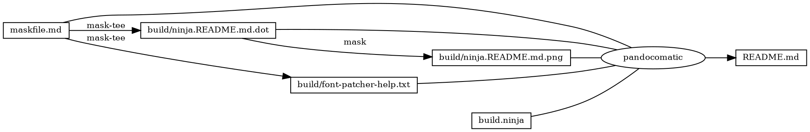
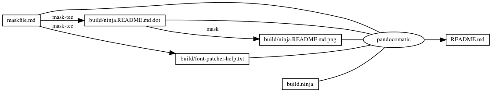

------------------------------------------------------------------------

    pandocomatic_:
        pandoc:
            from: markdown
            to: markdown-fenced_code_attributes
            filter:
            - pandoc-include-code
            output: README.md

...

# fontforge

# https://github.com/huzhenghui/mask-awesome

## git-clone-depth-1-ryanoasis-nerd-fonts

``` bash
mkdir -p "$(ghq root)/github.com/ryanoasis"
cd "$(ghq root)/github.com/ryanoasis"
git clone --depth 1 https://github.com/ryanoasis/nerd-fonts
```

## font-patcher-help

``` bash
cd "$(ghq list --full-path https://github.com/ryanoasis/nerd-fonts)"
fontforge -script ./font-patcher -h
```

### font-patcher-help-output

``` plain
Copyright (c) 2000-2020. See AUTHORS for Contributors.
 License GPLv3+: GNU GPL version 3 or later <http://gnu.org/licenses/gpl.html>
 with many parts BSD <http://fontforge.org/license.html>. Please read LICENSE.
 Version: 20201107
 Based on sources from 2020-11-16 17:26 UTC-D.
usage: font-patcher [-h] [-v] [-s] [-l] [-q] [-w] [-c] [--careful]
                    [--removeligs] [--postprocess [POSTPROCESS]]
                    [--configfile [CONFIGFILE]] [--custom [CUSTOM]]
                    [-ext [EXTENSION]] [-out [OUTPUTDIR]]
                    [--progressbars | --no-progressbars] [--fontawesome]
                    [--fontawesomeextension] [--fontlinux] [--octicons]
                    [--powersymbols] [--pomicons] [--powerline]
                    [--powerlineextra] [--material] [--weather]
                    font

Nerd Fonts Font Patcher: patches a given font with programming and development related glyphs

* Website: https://www.nerdfonts.com
* Version: 2.1.0
* Development Website: https://github.com/ryanoasis/nerd-fonts
* Changelog: https://github.com/ryanoasis/nerd-fonts/blob/master/changelog.md

positional arguments:
  font                  The path to the font to patch (e.g., Inconsolata.otf)

optional arguments:
  -h, --help            show this help message and exit
  -v, --version         show program's version number and exit
  -s, --mono, --use-single-width-glyphs
                        Whether to generate the glyphs as single-width not double-width (default is double-width)
  -l, --adjust-line-height
                        Whether to adjust line heights (attempt to center powerline separators more evenly)
  -q, --quiet, --shutup
                        Do not generate verbose output
  -w, --windows         Limit the internal font name to 31 characters (for Windows compatibility)
  -c, --complete        Add all available Glyphs
  --careful             Do not overwrite existing glyphs if detected
  --removeligs, --removeligatures
                        Removes ligatures specificed in JSON configuration file
  --postprocess [POSTPROCESS]
                        Specify a Script for Post Processing
  --configfile [CONFIGFILE]
                        Specify a file path for JSON configuration file (see sample: src/config.sample.json)
  --custom [CUSTOM]     Specify a custom symbol font. All new glyphs will be copied, with no scaling applied.
  -ext [EXTENSION], --extension [EXTENSION]
                        Change font file type to create (e.g., ttf, otf)
  -out [OUTPUTDIR], --outputdir [OUTPUTDIR]
                        The directory to output the patched font file to
  --progressbars        Show percentage completion progress bars per Glyph Set
  --no-progressbars     Don't show percentage completion progress bars per Glyph Set

Symbol Fonts:
  --fontawesome         Add Font Awesome Glyphs (http://fontawesome.io/)
  --fontawesomeextension
                        Add Font Awesome Extension Glyphs (https://andrelzgava.github.io/font-awesome-extension/)
  --fontlinux, --fontlogos
                        Add Font Linux and other open source Glyphs (https://github.com/Lukas-W/font-logos)
  --octicons            Add Octicons Glyphs (https://octicons.github.com)
  --powersymbols        Add IEC Power Symbols (https://unicodepowersymbol.com/)
  --pomicons            Add Pomicon Glyphs (https://github.com/gabrielelana/pomicons)
  --powerline           Add Powerline Glyphs
  --powerlineextra      Add Powerline Glyphs (https://github.com/ryanoasis/powerline-extra-symbols)
  --material, --materialdesignicons, --mdi
                        Add Material Design Icons (https://github.com/templarian/MaterialDesign)
  --weather, --weathericons
                        Add Weather Icons (https://github.com/erikflowers/weather-icons)
```

## font-patcher-FiraCode-Regular

``` bash
cd "$(ghq list --full-path https://github.com/ryanoasis/nerd-fonts)"
fontforge -script ./font-patcher --outputdir "${MASKFILE_DIR}/output" ~/Library/Fonts/FiraCode-Regular.otf
```

## begin: mask task in template

## readme

``` bash
ninja --verbose README.md
```

### build.ninja

``` ninja
builddir=./build
mask_subcommand = --help

#######################################
# begin: rule in template

rule mask
  command = mask $mask_subcommand

rule mask-tee
  command = mask $mask_subcommand 2>&1 | tee $out 1> /dev/null

rule pandocomatic
  command = pandocomatic --input $in --output $out

# end: rule in template
#######################################

#######################################a
# begin: custom rule

# custom rule here

# end: custom rule
#######################################

#######################################
# begin: build in template

build ./build/ninja.README.md.dot: mask-tee | ./maskfile.md
  mask_subcommand = readme-graph-dot

build ./build/ninja.README.md.png : mask | ./build/ninja.README.md.dot
  mask_subcommand = readme-graph-png

# end: build in template
#######################################

#######################################a
# begin: custom build

build ./build/font-patcher-help.txt : mask-tee | ./maskfile.md
  mask_subcommand = font-patcher-help

# end: custom build
#######################################

#######################################
# begin: build README.md
# $ followed by a newline
# escape the newline (continue the current line across a line break).
# the first 4 line in this build is template
build README.md: pandocomatic maskfile.md | $
  build.ninja $
  ./build/ninja.README.md.dot $
  ./build/ninja.README.md.png $
  ./build/font-patcher-help.txt

default README.md
# end: build README.md
#######################################
```

## readme-graph-dot

``` bash
ninja -t graph README.md
```

### readme-graph-dot-output



## readme-graph-dot-xdot

``` bash
detach -- xdot "${MASKFILE_DIR}/build/ninja.README.md.dot"
```

## readme-graph-png

``` bash
dot -Tpng -o./build/ninja.README.md.png ./build/ninja.README.md.dot
```



## end: mask task in template
