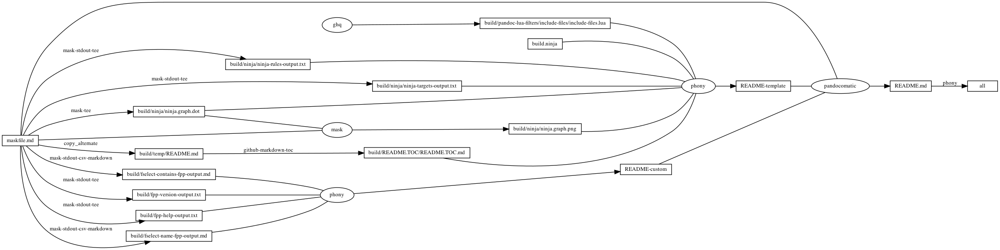

# fpp

<!-- markdownlint-disable MD007 MD030 -->

-   [fpp](#fpp)
-   [Mask SubCommands](#mask-subcommands)
    -   [git-status-fpp](#git-status-fpp)
    -   [git-show-fpp](#git-show-fpp)
    -   [git-diff-fpp](#git-diff-fpp)
    -   [git-diff-numstat-fpp](#git-diff-numstat-fpp)
    -   [grep-fpp](#grep-fpp)
    -   [fselect-name-fpp](#fselect-name-fpp)
        -   [fselect-name-fpp-output](#fselect-name-fpp-output)
    -   [fselect-name-fpp-fpp](#fselect-name-fpp-fpp)
    -   [fselect-contains-fpp](#fselect-contains-fpp)
        -   [fselect-contains-fpp-output](#fselect-contains-fpp-output)
    -   [fselect-contains-fpp-fpp](#fselect-contains-fpp-fpp)
    -   [fpp-version](#fpp-version)
        -   [fpp-version-output](#fpp-version-output)
    -   [fpp-help](#fpp-help)
        -   [fpp-help-output](#fpp-help-output)
    -   [begin: mask task in template : build
        content](#begin-mask-task-in-template--build-content)
    -   [ninja-rules](#ninja-rules)
        -   [ninja custom-rule](#ninja-custom-rule)
        -   [ninja-rules-output](#ninja-rules-output)
    -   [ninja-targets](#ninja-targets)
        -   [ninja build-all](#ninja-build-all)
        -   [ninja custom-build](#ninja-custom-build)
        -   [ninja report-build](#ninja-report-build)
        -   [ninja-targets-output](#ninja-targets-output)
    -   [readme-md](#readme-md)
        -   [ninja readme-build](#ninja-readme-build)
    -   [end: mask task in template : build
        content](#end-mask-task-in-template--build-content)
    -   [begin: mask task in template : ninja
        command](#begin-mask-task-in-template--ninja-command)
    -   [ninja-browse](#ninja-browse)
    -   [ninja-graph-png](#ninja-graph-png)
    -   [ninja-graph-dot-xdot](#ninja-graph-dot-xdot)
    -   [ninja-graph-dot](#ninja-graph-dot)
        -   [ninja-graph-dot-output](#ninja-graph-dot-output)
    -   [ninja-all](#ninja-all)
        -   [build.ninja](#buildninja)
    -   [end: mask task in template : ninja
        command](#end-mask-task-in-template--ninja-command)

<!-- markdownlint-enable MD007 MD030 -->

# Mask SubCommands

[Mask Awesome](https://github.com/huzhenghui/mask-awesome)

## git-status-fpp

``` bash
git status --untracked-files=no | \
    fpp --non-interactive --command 'git --no-pager log --'
```

## git-show-fpp

``` bash
git show --color | fpp --non-interactive --command 'stat -x'
```

## git-diff-fpp

``` bash
git diff --color HEAD~1 master | \
    fpp --non-interactive --command 'git --no-pager log --'
```

## git-diff-numstat-fpp

``` bash
git diff --color HEAD~1 master --numstat | \
    fpp --non-interactive --command 'git --no-pager log --'
```

## grep-fpp

``` bash
grep --color=always --recursive "fpp" "$(git root)" | \
    fpp --non-interactive --command 'stat -x'
```

## fselect-name-fpp

``` bash
cd "$(git root)"
echo -e "path\tsize\tmime\tline_count"
fselect "concat('[../', path, '](../', path, ')'), size, mime, line_count \
    from . gitignore \
    where name like '%fpp%' \
    order by path"
```

### fselect-name-fpp-output

<!-- markdownlint-disable MD013 -->

| path                                                                                           | size | mime            | line\_count |
|------------------------------------------------------------------------------------------------|------|-----------------|-------------|
| [.././.vale/Vocab/fpp.txt](.././.vale/Vocab/fpp.txt)                                           | 3    | text/plain      | 0           |
| [.././fpp](.././fpp)                                                                           | 288  | inode/directory |             |
| [.././fpp/build/fpp-help-output.txt](.././fpp/build/fpp-help-output.txt)                       | 0    | text/plain      | 0           |
| [.././fpp/build/fpp-version-output.txt](.././fpp/build/fpp-version-output.txt)                 | 18   | text/plain      | 1           |
| [.././fpp/build/fselect-contains-fpp-output.md](.././fpp/build/fselect-contains-fpp-output.md) | 0    | text/plain      | 0           |
| [.././fpp/build/fselect-name-fpp-output.md](.././fpp/build/fselect-name-fpp-output.md)         | 0    | text/plain      | 0           |

<!-- markdownlint-enable MD013 -->

## fselect-name-fpp-fpp

``` bash
$MASK fselect-name-fpp | \
    fpp --non-interactive --command 'git --no-pager log --'
```

## fselect-contains-fpp

``` bash
cd "$(git root)"
echo -e "path\tsize\tmime\tline_count"
fselect "concat('[../', path, '](../', path, ')'), size, mime, line_count \
    from . gitignore \
    where contains(fpp) = true \
    order by path"
```

### fselect-contains-fpp-output

<!-- markdownlint-disable MD013 -->

| path                                                                                           | size  | mime              | line\_count |
|------------------------------------------------------------------------------------------------|-------|-------------------|-------------|
| [.././.vale/Spell/Spell.yml](.././.vale/Spell/Spell.yml)                                       | 362   | text/plain        | 16          |
| [.././.vale/Vocab/fpp.txt](.././.vale/Vocab/fpp.txt)                                           | 3     | text/plain        | 0           |
| [.././.vscode/extension/.favorites.json](.././.vscode/extension/.favorites.json)               | 13493 | text/plain        | 432         |
| [.././fpp/README.md](.././fpp/README.md)                                                       | 26610 | text/plain        | 796         |
| [.././fpp/build.ninja](.././fpp/build.ninja)                                                   | 6696  | text/plain        | 213         |
| [.././fpp/build/fpp-help-output.txt](.././fpp/build/fpp-help-output.txt)                       | 7171  | text/plain        | 175         |
| [.././fpp/build/fpp-version-output.txt](.././fpp/build/fpp-version-output.txt)                 | 18    | text/plain        | 1           |
| [.././fpp/build/ninja/ninja-targets-output.txt](.././fpp/build/ninja/ninja-targets-output.txt) | 619   | text/plain        | 15          |
| [.././fpp/build/ninja/ninja.graph.dot](.././fpp/build/ninja/ninja.graph.dot)                   | 2919  | text/vnd.graphviz | 58          |
| [.././fpp/maskfile.md](.././fpp/maskfile.md)                                                   | 3909  | text/plain        | 239         |
| [.././fselect/README.md](.././fselect/README.md)                                               | 37604 | text/plain        | 924         |
| [.././fselect/maskfile.md](.././fselect/maskfile.md)                                           | 5294  | text/plain        | 297         |

<!-- markdownlint-enable MD013 -->

## fselect-contains-fpp-fpp

``` bash
$MASK fselect-contains-fpp | \
    fpp --non-interactive --command 'git --no-pager log --'
```

## fpp-version

``` bash
fpp --version
```

### fpp-version-output

``` plain
fpp version 0.9.2
```

## fpp-help

``` bash
fpp --help
```

### fpp-help-output

``` plain
********************************************************************************

Welcome to fpp, the Facebook PathPicker! We hope your stay
with us is enjoyable.

To get started with fpp, pipe some kind of terminal output into the program.
Examples include:

    * git status | fpp
    * git show | fpp
    * git diff HEAD master | fpp
    * git diff HEAD~10 --numstat | fpp
    * grep -r "Banana" . | fpp
    * find . -iname "*.js" | fpp

Once fpp parses your input (and something that looks like a file matches), it
will put you inside a pager that will allow you to select files with the
following commands:

== Navigation ==


    * [f] toggle the selection of a file
    * [F] toggle and move downward by 1
    * [A] toggle selection of all (unique) files
    * [down arrow|j] move downward by 1
    * [up arrow|k] move upward by 1
    * [<space>] page down
    * [b] page up
    * [x] quick select mode
    * [d] describe file


Once you have your files selected, you can
either open them in your favorite
text editor or execute commands with
them via command mode:

    * [<Enter>] open all selected files
        (or file under cursor if none selected)
        in $EDITOR
    * [c] enter command mode

== Command Mode ==


Command mode is helpful when you want to
execute bash commands with the filenames
you have selected. By default the filenames
are appended automatically to command you
enter before it is executed, so all you have
to do is type the prefix. Some examples:

    * git add
    * git checkout HEAD~1 --
    * rm -rf

These commands get formatted into:
    * git add file1 file2 # etc
    * git checkout HEAD~1 -- file1 file2
    * rm -rf file1 file2 # etc

If your command needs filenames in the middle,
the token "$F" will be replaced with your
selected filenames if it is found in the command
string. Examples include:

    * scp $F dev:~/backup
    * mv $F ../over/here

Which format to:
    * scp file1 file2 dev:~/backup
    * mv file1 file2 ../over/here

== Configuration ==


PathPicker offers a bit of configuration currently with more to come
in the future.

~ Editor ~

The $FPP_EDITOR environment variable can be set to tell PathPicker
which editor to open the selected files with. If that variable
is not set, $VISUAL and then $EDITOR are used as fallbacks,
with "vim" as a last resort.

The $FPP_DISABLE_SPLIT environment variable will disable splitting
files into panes for vim clients (aka sequential editing).

~ Directory ~

PathPicker saves state files for use when starting up, including the
previous input used and selection pickle. By default, these files are saved
in $XDG_CACHE_HOME/fpp, but the $FPP_DIR environment variable can be used to tell
PathPicker to use another directory.

~ Colors ~

FPP will understand colors if the piped input uses them. In general, most
tools do not unless requested to do so.

For git, try `git config --global color.ui always` or use the command
line option --color.

For built in commands like `ls`, try `-G` (on Mac, additionally export
CLICOLOR_FORCE in your environment to anything.)


== Command line arguments ==


PathPicker supports some command line arguments, as well.

usage: fpp [-h] [-r] [--version] [--clean] [-ko] [-c COMMAND [COMMAND ...]]
           [-e EXECUTE_KEYS [EXECUTE_KEYS ...]] [-nfc] [-ai] [-ni] [-a]

optional arguments:
  -h, --help            show this help message and exit
  -r, --record          Record input and output. This is largely used for
                        testing, but you may find it useful for scripting.
  --version             Print the version of fpp and exit.
  --clean               Remove the state files that fpp uses when starting up,
                        including the previous input used and selection
                        pickle. Useful when using fpp in a script context
                        where the previous state should be discarded.
  -ko, --keep-open      keep PathPicker open once a file selection or command
                        is performed. This will loop the program until Ctrl-C
                        is used to terminate the process.
  -c COMMAND [COMMAND ...], --command COMMAND [COMMAND ...]
                        You may specify a command while invoking fpp that will
                        be run once files have been selected. Normally, fpp
                        opens your editor (see discussion of $EDITOR, $VISUAL,
                        and $FPP_EDITOR) when you press enter. If you specify
                        a command here, it will be invoked instead.
  -e EXECUTE_KEYS [EXECUTE_KEYS ...], --execute-keys EXECUTE_KEYS [EXECUTE_KEYS ...]
                        Automatically execute the given keys when the file
                        list shows up. This is useful on certain cases, e.g.
                        using "END" in order to automatically go to the last
                        entry when there is a long list.
  -nfc, --no-file-checks
                        You may want to turn off file system validation for a
                        particular instance of PathPicker; this flag disables
                        our internal logic for checking if a regex match is an
                        actual file on the system. This is particularly useful
                        when using PathPicker for an input of, say, deleted
                        files in git status that you would like to restore to
                        a given revision. It enables you to select the deleted
                        files even though they do not exist on the system
                        anymore.
  -ai, --all-input      You may force PathPicker to recognize all lines as
                        acceptable input. Typically, PathPicker will scan the
                        input for references to file paths. Passing this
                        option will disable those scans and the program will
                        assume that every input line is a match. In practice,
                        this option allows for input selection for a variety
                        of sources that would otherwise be unsupported -- git
                        branches, mercurial bookmarks, etc.
  -ni, --non-interactive
                        Normally, the command that runs after you've chosen
                        files to operate on is spawned in an interactive
                        subshell. This allows you to use aliases and have
                        access to environment variables defined in your
                        startup files, but can have strange side-effects when
                        starting and stopping jobs and redirecting inputs.
                        Using this flag runs your commands in a non-
                        interactive subshell, like a normal shell script.
  -a, --all             Automatically select all available lines once the
                        interactive editor has been entered.

That's a fairly in-depth overview of Facebook PathPicker.
We also provide help along the way as you
use the app, so don't worry and jump on in!

********************************************************************************
```

## begin: mask task in template : build content

## ninja-rules

``` bash
ninja -t rules
```

### ninja custom-rule

``` ninja
# custom rule here

```

### ninja-rules-output

``` plain
cmdshelf-repository
copy_alternate
dot
ghq
github-markdown-toc
jupyter-nbconvert-markdown
mask
mask-man-markdown
mask-screenshot
mask-stderr-tee
mask-stdout-csv-markdown
mask-stdout-json
mask-stdout-tee
mask-tee
pandocomatic
phony
```

## ninja-targets

``` bash
ninja -t targets all
```

### ninja build-all

``` ninja
build all: phony README.md

default all

```

### ninja custom-build

``` ninja
# custom build here

```

### ninja report-build

``` ninja
# report build here

```

### ninja-targets-output

``` plain
all: phony
build/pandoc-lua-filters/include-files/include-files.lua: ghq
build/ninja/ninja-rules-output.txt: mask-stdout-tee
build/ninja/ninja-targets-output.txt: mask-stdout-tee
build/ninja/ninja.graph.dot: mask-tee
build/ninja/ninja.graph.png: mask
build/temp/README.md: copy_alternate
build/README.TOC/README.TOC.md: github-markdown-toc
README-template: phony
build/fselect-name-fpp-output.md: mask-stdout-csv-markdown
build/fselect-contains-fpp-output.md: mask-stdout-csv-markdown
build/fpp-version-output.txt: mask-stdout-tee
build/fpp-help-output.txt: mask-stdout-tee
README-custom: phony
README.md: pandocomatic
```

## readme-md

``` bash
ninja --verbose README.md
```

### ninja readme-build

``` ninja
build ./build/fselect-name-fpp-output.md : mask-stdout-csv-markdown ./maskfile.md
 mask_subcommand = fselect-name-fpp
 mask_stdout_csv_markdowndelimiter = "\t"

build ./build/fselect-contains-fpp-output.md : mask-stdout-csv-markdown ./maskfile.md
 mask_subcommand = fselect-contains-fpp
 mask_stdout_csv_markdowndelimiter = "\t"

build ./build/fpp-version-output.txt : mask-stdout-tee ./maskfile.md
  mask_subcommand = fpp-version

build ./build/fpp-help-output.txt : mask-stdout-tee ./maskfile.md
  mask_subcommand = fpp-help

build README-custom : phony $
  ./build/fselect-name-fpp-output.md $
  ./build/fselect-contains-fpp-output.md $
  ./build/fpp-version-output.txt $
  ./build/fpp-help-output.txt

```

``` ninja
build README.md : pandocomatic maskfile.md | README-template README-custom

```

## end: mask task in template : build content

## begin: mask task in template : ninja command

## ninja-browse

``` bash
ninja -t browse
```

## ninja-graph-png

``` bash
dot -Tpng -o./build/ninja/ninja.graph.png ./build/ninja/ninja.graph.dot
```



## ninja-graph-dot-xdot

``` bash
detach -- xdot "${MASKFILE_DIR}/build/ninja/ninja.graph.dot"
```

## ninja-graph-dot

``` bash
ninja -t graph
```

### ninja-graph-dot-output

``` dot
digraph ninja {
rankdir="LR"
node [fontsize=10, shape=box, height=0.25]
edge [fontsize=10]
"0x7fb295d06d10" [label="all"]
"0x7fb295d06e90" -> "0x7fb295d06d10" [label=" phony"]
"0x7fb295d06e90" [label="README.md"]
"0x7fb295e05d90" [label="pandocomatic", shape=ellipse]
"0x7fb295e05d90" -> "0x7fb295d06e90"
"0x7fb295e04600" -> "0x7fb295e05d90" [arrowhead=none]
"0x7fb295e04fd0" -> "0x7fb295e05d90" [arrowhead=none]
"0x7fb295e05cf0" -> "0x7fb295e05d90" [arrowhead=none]
"0x7fb295e04600" [label="maskfile.md"]
"0x7fb295e04fd0" [label="README-template"]
"0x7fb295e05070" [label="phony", shape=ellipse]
"0x7fb295e05070" -> "0x7fb295e04fd0"
"0x7fb295e042a0" -> "0x7fb295e05070" [arrowhead=none]
"0x7fb295e053b0" -> "0x7fb295e05070" [arrowhead=none]
"0x7fb295e04540" -> "0x7fb295e05070" [arrowhead=none]
"0x7fb295e047c0" -> "0x7fb295e05070" [arrowhead=none]
"0x7fb295e04a20" -> "0x7fb295e05070" [arrowhead=none]
"0x7fb295e04c70" -> "0x7fb295e05070" [arrowhead=none]
"0x7fb295e04f20" -> "0x7fb295e05070" [arrowhead=none]
"0x7fb295e042a0" [label="build/pandoc-lua-filters/include-files/include-files.lua"]
"0x7fb295e04230" [label="ghq", shape=ellipse]
"0x7fb295e04230" -> "0x7fb295e042a0"
"0x7fb295e053b0" [label="build.ninja"]
"0x7fb295e04540" [label="build/ninja/ninja-rules-output.txt"]
"0x7fb295e04600" -> "0x7fb295e04540" [label=" mask-stdout-tee"]
"0x7fb295e047c0" [label="build/ninja/ninja-targets-output.txt"]
"0x7fb295e04600" -> "0x7fb295e047c0" [label=" mask-stdout-tee"]
"0x7fb295e04a20" [label="build/ninja/ninja.graph.dot"]
"0x7fb295e04600" -> "0x7fb295e04a20" [label=" mask-tee"]
"0x7fb295e04c70" [label="build/ninja/ninja.graph.png"]
"0x7fb295e04bd0" [label="mask", shape=ellipse]
"0x7fb295e04bd0" -> "0x7fb295e04c70"
"0x7fb295e04600" -> "0x7fb295e04bd0" [arrowhead=none]
"0x7fb295e04a20" -> "0x7fb295e04bd0" [arrowhead=none]
"0x7fb295e04f20" [label="build/README.TOC/README.TOC.md"]
"0x7fb295e04dc0" -> "0x7fb295e04f20" [label=" github-markdown-toc"]
"0x7fb295e04dc0" [label="build/temp/README.md"]
"0x7fb295e04600" -> "0x7fb295e04dc0" [label=" copy_alternate"]
"0x7fb295e05cf0" [label="README-custom"]
"0x7fb295e05b50" [label="phony", shape=ellipse]
"0x7fb295e05b50" -> "0x7fb295e05cf0"
"0x7fb295e05250" -> "0x7fb295e05b50" [arrowhead=none]
"0x7fb295e056b0" -> "0x7fb295e05b50" [arrowhead=none]
"0x7fb295e05870" -> "0x7fb295e05b50" [arrowhead=none]
"0x7fb295e05a20" -> "0x7fb295e05b50" [arrowhead=none]
"0x7fb295e05250" [label="build/fselect-name-fpp-output.md"]
"0x7fb295e04600" -> "0x7fb295e05250" [label=" mask-stdout-csv-markdown"]
"0x7fb295e056b0" [label="build/fselect-contains-fpp-output.md"]
"0x7fb295e04600" -> "0x7fb295e056b0" [label=" mask-stdout-csv-markdown"]
"0x7fb295e05870" [label="build/fpp-version-output.txt"]
"0x7fb295e04600" -> "0x7fb295e05870" [label=" mask-stdout-tee"]
"0x7fb295e05a20" [label="build/fpp-help-output.txt"]
"0x7fb295e04600" -> "0x7fb295e05a20" [label=" mask-stdout-tee"]
}
```



## ninja-all

``` bash
ninja --verbose
```

### build.ninja

``` ninja
builddir=./build
mask_subcommand = --help
mask_stdout_csv_markdowndelimiter = ","
jupyter_nbconvert_markdown_output_files_dir=./build/jupyter-nbconvert-markdown-output-files

#######################################
# begin: rule in template

rule mask
  command = mask --maskfile $in $mask_subcommand

rule mask-tee
  command = mask --maskfile $in $mask_subcommand 2>&1 | tee $out 1> /dev/null

rule mask-stdout-tee
  command = mask --maskfile $in $mask_subcommand 2>/dev/null | tee $out 1> /dev/null

rule mask-stderr-tee
  command = bash -c 'mask $mask_subcommand 1>/dev/null 2> >(tee $out)' || echo $$?

# <!-- markdownlint-disable MD013 -->
rule mask-man-markdown
  command = set -e && set -o pipefail && $
    mask --maskfile $in $mask_subcommand | $
    ul | $
    ansifilter --bbcode | $
    inv --search-root="$$(ghq list --full-path https://github.com/huzhenghui/pyinvoke-awesome)/bbcode" bbcode-parser-format | $
    pandoc --from=html --to=markdown | $
    tee $out 1> /dev/null
# <!-- markdownlint-enable MD013 -->

rule mask-stdout-csv-markdown
  command = mask --maskfile $in $mask_subcommand 2>/dev/null | $
    csvtomd --delimiter "$$(echo $mask_stdout_csv_markdowndelimiter)" | $
    tee $out 1> /dev/null

rule mask-stdout-json
  command = mask --maskfile $in $mask_subcommand 2>/dev/null | $
    jq | $
    tee $out 1> /dev/null

rule mask-screenshot
  command = $
    regular_logfile="./build/temp/$$(basename $out).mask-screenshot.logfile" && $
    rm -f -v "$${regular_logfile}" && $
    until [[ -s "$${regular_logfile}" ]]; do $
      screen_logfile="$$(mktemp -d)/logfile"; $
      echo "$${screen_logfile}"; $
      mkfifo "$${screen_logfile}"; $
      screen -L -Logfile "$${screen_logfile}" $
        -dmS mask-screenshot-"$$(basename $out)" $
        sh -c "stdbuf -o0 mask --maskfile $in $mask_subcommand; $
          date +'%F %T %Z %z - %+ https://github.com/huzhenghui' | lolcat;"; $
      dd bs=1 if="$${screen_logfile}" of="$${regular_logfile}"; $
    done && $
    ansifilter --html --encoding=utf8 --input="$${regular_logfile}" | $
      tee ./build/temp/"$$(basename $out)".mask-screenshot.html | $
      wkhtmltoimage --format png - "$out"

rule pandocomatic
  command = pandocomatic --input $in --output $out

rule github-markdown-toc
  command = gh-md-toc --hide-header --hide-footer --no-escape $in > $out

rule copy_alternate
  command = if [[ -f "$alternate" ]]; $
    then $
      cp "$alternate" "$out"; $
    else $
      cp "$in" "$out"; $
    fi;

rule dot
  command = dot -Tpng -o$out $in

rule ghq
  command = ghq get --update "$repository" && $
    find -d "$link_dirname" -exec rmdir {} \; && $
    ln -Fs "$$(ghq list --full-path $repository)" "$link_dirname"
  generator = 1

rule cmdshelf-repository
  command = $$( $
    cmdshelf remote list | ack "^$cmdshelf_name" 1>&2 || $
    cmdshelf remote add "$cmdshelf_name" "$cmdshelf_url" 1>&2 $
    ) && $
    repository_path="$$(realpath $${HOME}/.cmdshelf/remote/$cmdshelf_name)" && $
    echo "$${repository_path}" && $
    stub_path="$$(realpath ./build/$cmdshelf_name)" && $
    echo "$${stub_path}" && $
    find -d "$${stub_path}" -exec rmdir {} \; && $
    ln -Fs "$${repository_path}" "$${stub_path}"
  generator = 1

# <!-- markdownlint-disable MD013 -->
rule jupyter-nbconvert-markdown
  command = jupyter nbconvert $
    --to=markdown $
    --NbConvertApp.output_files_dir="$jupyter_nbconvert_markdown_output_files_dir" $
    --output="$out" $
    "$in"
# <!-- markdownlint-enble MD013 -->

# end: rule in template
#######################################

#######################################
# start snippet custom-rule

# custom rule here

# end snippet custom-rule
#######################################

#######################################
# start snippet build-all

build all: phony README.md

default all

# end snippet build-all
#######################################

#######################################
# start snippet custom-build

# custom build here

# end snippet custom-build
#######################################

#######################################
# start snippet report-build

# report build here

# end snippet report-build
#######################################

#######################################
# begin: readme-build in template

# ninja will create ./build/pandoc-lua-filters/include-files/ automatically
build ./build/pandoc-lua-filters/include-files/include-files.lua : ghq
  repository = https://github.com/pandoc/lua-filters
  link_dirname = ./build/pandoc-lua-filters

build ./build/ninja/ninja-rules-output.txt : mask-stdout-tee ./maskfile.md
  mask_subcommand = ninja-rules

build ./build/ninja/ninja-targets-output.txt : mask-stdout-tee ./maskfile.md
  mask_subcommand = ninja-targets

build ./build/ninja/ninja.graph.dot : mask-tee ./maskfile.md
  mask_subcommand = ninja-graph-dot

build ./build/ninja/ninja.graph.png : mask ./maskfile.md | ./build/ninja/ninja.graph.dot
  mask_subcommand = ninja-graph-png

build ./build/temp/README.md : copy_alternate ./maskfile.md
  alternate = ./README.md

build ./build/README.TOC/README.TOC.md : github-markdown-toc ./build/temp/README.md

build README-template : phony $
  ./build/pandoc-lua-filters/include-files/include-files.lua $
  ./build.ninja $
  ./build/ninja/ninja-rules-output.txt $
  ./build/ninja/ninja-targets-output.txt $
  ./build/ninja/ninja.graph.dot $
  ./build/ninja/ninja.graph.png $
  ./build/README.TOC/README.TOC.md $

# end: readme-build in template
#######################################

#######################################
# start snippet custom-readme-build

build ./build/fselect-name-fpp-output.md : mask-stdout-csv-markdown ./maskfile.md
 mask_subcommand = fselect-name-fpp
 mask_stdout_csv_markdowndelimiter = "\t"

build ./build/fselect-contains-fpp-output.md : mask-stdout-csv-markdown ./maskfile.md
 mask_subcommand = fselect-contains-fpp
 mask_stdout_csv_markdowndelimiter = "\t"

build ./build/fpp-version-output.txt : mask-stdout-tee ./maskfile.md
  mask_subcommand = fpp-version

build ./build/fpp-help-output.txt : mask-stdout-tee ./maskfile.md
  mask_subcommand = fpp-help

build README-custom : phony $
  ./build/fselect-name-fpp-output.md $
  ./build/fselect-contains-fpp-output.md $
  ./build/fpp-version-output.txt $
  ./build/fpp-help-output.txt

# end snippet custom-readme-build
#######################################

#######################################
# $ followed by a newline
# escape the newline (continue the current line across a line break).
# start snippet readme-build

build README.md : pandocomatic maskfile.md | README-template README-custom

# end snippet readme-build
#######################################
```

## end: mask task in template : ninja command
