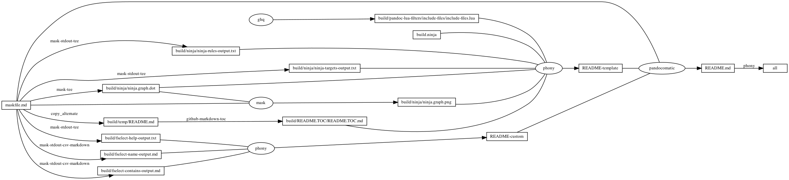

# fselect

<!-- markdownlint-disable MD007 MD030 -->

-   [fselect](#fselect)
-   [Mask SubCommands](#mask-subcommands)
    -   [fselect-name](#fselect-name)
        -   [fselect-name-output](#fselect-name-output)
    -   [fselect-contains](#fselect-contains)
        -   [fselect-contains-output](#fselect-contains-output)
    -   [fselect-Downloads-archive](#fselect-downloads-archive)
    -   [fselect-Downloads-book](#fselect-downloads-book)
    -   [fselect-Downloads-doc](#fselect-downloads-doc)
    -   [fselect-help](#fselect-help)
        -   [fselect-help-output](#fselect-help-output)
    -   [begin: mask task in template : build
        content](#begin-mask-task-in-template--build-content)
    -   [ninja-rules](#ninja-rules)
        -   [ninja custom-rule](#ninja-custom-rule)
        -   [ninja-rules-output](#ninja-rules-output)
    -   [ninja-targets](#ninja-targets)
        -   [ninja build-all](#ninja-build-all)
        -   [ninja custom-build](#ninja-custom-build)
        -   [ninja report-build](#ninja-report-build)
        -   [ninja-targets-output](#ninja-targets-output)
    -   [readme-md](#readme-md)
        -   [ninja readme-build](#ninja-readme-build)
    -   [end: mask task in template : build
        content](#end-mask-task-in-template--build-content)
    -   [begin: mask task in template : ninja
        command](#begin-mask-task-in-template--ninja-command)
    -   [ninja-browse](#ninja-browse)
    -   [ninja-graph-png](#ninja-graph-png)
    -   [ninja-graph-dot-xdot](#ninja-graph-dot-xdot)
    -   [ninja-graph-dot](#ninja-graph-dot)
        -   [ninja-graph-dot-output](#ninja-graph-dot-output)
    -   [ninja-all](#ninja-all)
        -   [build.ninja](#buildninja)
    -   [end: mask task in template : ninja
        command](#end-mask-task-in-template--ninja-command)

<!-- markdownlint-enable MD007 MD030 -->

# Mask SubCommands

[Mask Awesome](https://github.com/huzhenghui/mask-awesome)

## fselect-name

``` bash
cd "$(git root)"
echo -e "path\tsize\tmime\tline_count"
fselect "concat('[', path, '](../', path, ')'), size, mime, line_count \
    from . gitignore \
    where name like '%fselect%' \
    order by path"
```

### fselect-name-output

<!-- markdownlint-disable MD013 -->

| path                                                                                        | size  | mime            | line\_count |
|---------------------------------------------------------------------------------------------|-------|-----------------|-------------|
| [./.vale/Vocab/fselect.txt](.././.vale/Vocab/fselect.txt)                                   | 26    | text/plain      | 3           |
| [./fselect](.././fselect)                                                                   | 288   | inode/directory |             |
| [./fselect/build/fselect-contains-output.md](.././fselect/build/fselect-contains-output.md) | 0     | text/plain      | 0           |
| [./fselect/build/fselect-help-output.txt](.././fselect/build/fselect-help-output.txt)       | 14518 | text/plain      | 189         |
| [./fselect/build/fselect-name-output.md](.././fselect/build/fselect-name-output.md)         | 0     | text/plain      | 0           |

<!-- markdownlint-enable MD013 -->

## fselect-contains

``` bash
cd "$(git root)"
echo -e "path\tsize\tmime\tline_count"
fselect "concat('[', path, '](../', path, ')'), size, mime, line_count \
    from . gitignore \
    where contains(fselect) = true \
    order by path"
```

### fselect-contains-output

<!-- markdownlint-disable MD013 -->

| path                                                                                                | size  | mime              | line\_count |
|-----------------------------------------------------------------------------------------------------|-------|-------------------|-------------|
| [./.vale/Spell/Spell.yml](.././.vale/Spell/Spell.yml)                                               | 342   | text/plain        | 15          |
| [./.vale/Vocab/fselect.txt](.././.vale/Vocab/fselect.txt)                                           | 26    | text/plain        | 3           |
| [./.vscode/extension/.favorites.json](.././.vscode/extension/.favorites.json)                       | 13501 | text/plain        | 432         |
| [./fselect/README.md](.././fselect/README.md)                                                       | 34054 | text/plain        | 796         |
| [./fselect/build.ninja](.././fselect/build.ninja)                                                   | 7274  | text/plain        | 227         |
| [./fselect/build/fselect-help-output.txt](.././fselect/build/fselect-help-output.txt)               | 14518 | text/plain        | 189         |
| [./fselect/build/ninja/ninja-targets-output.txt](.././fselect/build/ninja/ninja-targets-output.txt) | 804   | text/plain        | 18          |
| [./fselect/build/ninja/ninja.graph.dot](.././fselect/build/ninja/ninja.graph.dot)                   | 2741  | text/vnd.graphviz | 55          |
| [./fselect/maskfile.md](.././fselect/maskfile.md)                                                   | 3494  | text/plain        | 206         |

<!-- markdownlint-enable MD013 -->

## fselect-Downloads-archive

``` bash
cd ~/Downloads
echo -e "path\tsize\tmime\tmodified"
fselect path, size, mime, modified where is_archive = true order by path
```

## fselect-Downloads-book

``` bash
cd ~/Downloads
echo -e "path\tsize\tmime\tmodified"
fselect path, size, mime, modified where is_book = true order by path
```

## fselect-Downloads-doc

``` bash
cd ~/Downloads
echo -e "path\tsize\tmime\tmodified"
fselect path, size, mime, modified where is_doc = true order by path
```

## fselect-help

``` bash
NO_COLOR=1 fselect --help
```

### fselect-help-output

<!-- markdownlint-disable MD010 MD013 -->

``` plain
fselect 0.7.3
Find files with SQL-like queries.
https://github.com/jhspetersson/fselect

Usage: fselect [ARGS] COLUMN[, COLUMN...] [from PATH[, PATH...]] [where EXPR] [order by COLUMN (asc|desc), ...] [limit N] [into FORMAT]


Files Detected as Archives: .7z, .bz2, .bzip2, .gz, .gzip, .lz, .rar, .tar, .xz, .zip
Files Detected as Audio: .aac, .aiff, .amr, .flac, .gsm, .m4a, .m4b, .m4p, .mp3, .ogg, .wav, .wma
Files Detected as Book: .azw3, .chm, .djvu, .epub, .fb2, .mobi, .pdf
Files Detected as Document: .accdb, .doc, .docm, .docx, .dot, .dotm, .dotx, .mdb, .ods, .odt, .pdf, .potm, .potx, .ppt, .pptm, .pptx, .rtf, .xlm, .xls, .xlsm, .xlsx, .xlt, .xltm, .xltx, .xps
Files Detected as Image: .bmp, .gif, .heic, .jpeg, .jpg, .png, .psb, .psd, .tiff, .webp
Files Detected as Source Code: .asm, .bas, .c, .cc, .ceylon, .clj, .coffee, .cpp, .cs, .d, .dart, .elm, .erl, .go, .groovy, .h, .hh, .hpp, .java, .js, .jsp, .kt, .kts, .lua, .nim, .pas, .php, .pl, .pm, .py, .rb, .rs, .scala, .swift, .tcl, .vala, .vb
Files Detected as Video: .3gp, .avi, .flv, .m4p, .m4v, .mkv, .mov, .mp4, .mpeg, .mpg, .webm, .wmv

Path Options:
    mindepth N 	                    Minimum search depth. Default is unlimited. Depth 1 means skip one directory level and search further.
    maxdepth N | depth N 	        Maximum search depth. Default is unlimited. Depth 1 means search the mentioned directory only. Depth 2 means search mentioned directory and its subdirectories.
    symlinks | sym                  If specified, search process will follow symlinks. Default is not to follow.
    archives | arc                  Search within archives. Only zip archives are supported. Default is not to include archived content into the search results.
    gitignore | git                 Search respects .gitignore files found.
    hgignore | hg                   Search respects .hgignore files found.
    dockerignore | docker           Search respects .dockerignore files found.
    dfs 	                        Depth-first search mode.
    bfs 	                        Breadth-first search mode. This is the default.
    regexp | rx                     Use regular expressions to search within multiple roots.

Column Options:
    name                            Returns the name of the file
    path                            Returns the path of the file
    abspath                         Returns the absolute path of the file
    size                            Returns the size of the file in bytes
    fsize | hsize                   Returns the size of the file accompanied with the unit
    uid                             Returns the UID of the owner
    gid                             Returns the GID of the owner's group

    accessed                        Returns the time the file was last accessed (YYYY-MM-DD HH:MM:SS)
    created                         Returns the file creation date (YYYY-MM-DD HH:MM:SS)
    modified                        Returns the time the file was last modified (YYYY-MM-DD HH:MM:SS)

    is_dir                          Returns a boolean signifying whether the file path is a directory
    is_file                         Returns a boolean signifying whether the file path is a file
    is_symlink                      Returns a boolean signifying whether the file path is a symlink
    is_pipe | is_fifo               Returns a boolean signifying whether the file path is a FIFO or pipe file
    is_char | is_character          Returns a boolean signifying whether the file path is a character device or character special file
    is_block                        Returns a boolean signifying whether the file path is a block or block special file
    is_socket                       Returns a boolean signifying whether the file path is a socket file
    is_hidden                       Returns a boolean signifying whether the file is a hidden file (e.g., files that start with a dot on *nix)
    has_xattrs                      Returns a boolean signifying whether the file has extended attributes

    device (Linux only)             Returns the code of device the file is stored on
    inode (Linux only)              Returns the number of inode
    blocks (Linux only)             Returns the number of blocks (256 bytes) the file occupies
    hardlinks (Linux only)          Returns the number of hardlinks of the file

    mode                            Returns the permissions of the owner, group, and everybody (similar to the first field in `ls -la`)

    user                            Returns the name of the owner for this file
    user_read                       Returns a boolean signifying whether the file can be read by the owner
    user_write                      Returns a boolean signifying whether the file can be written by the owner
    user_exec                       Returns a boolean signifying whether the file can be executed by the owner
    user_all                        Returns a boolean signifying whether the file can be fully accecced by the owner

    group                           Returns the name of the owner's group for this file
    group_read                      Returns a boolean signifying whether the file can be read by the owner's group
    group_write                     Returns a boolean signifying whether the file can be written by the owner's group
    group_exec                      Returns a boolean signifying whether the file can be executed by the owner's group
    group_all                       Returns a boolean signifying whether the file can be fully accecced by the group

    other_read                      Returns a boolean signifying whether the file can be read by others
    other_write                     Returns a boolean signifying whether the file can be written by others
    other_exec                      Returns a boolean signifying whether the file can be executed by others
    other_all                       Returns a boolean signifying whether the file can be fully accecced by the others

    suid                            Returns a boolean signifying whether the file permissions have a SUID bit set
    sgid                            Returns a boolean signifying whether the file permissions have a SGID bit set

    width                           Returns the number of pixels along the width of the photo or MP4 file
    height                          Returns the number of pixels along the height of the photo or MP4 file

    mime                            Returns MIME type of the file
    is_binary                       Returns a boolean signifying whether the file has binary contents
    is_text                         Returns a boolean signifying whether the file has text contents
    line_count                      Returns a number of lines in a text file

    exif_datetime                   Returns date and time of taken photo
    exif_altitude | exif_alt        Returns GPS altitude of taken photo
    exif_latitude | exif_lat        Returns GPS latitude of taken photo
    exif_longitude | exif_lng       Returns GPS longitude of taken photo
    exif_make                       Returns name of the camera manufacturer
    exif_model                      Returns camera model
    exif_software                   Returns software name with which the photo was taken
    exif_version                    Returns the version of EXIF metadata

    mp3_title | title               Returns the title of the audio file taken from the file's metadata
    mp3_album | album               Returns the album name of the audio file taken from the file's metadata
    mp3_artist | artist             Returns the artist of the audio file taken from the file's metadata
    mp3_genre | genre               Returns the genre of the audio file taken from the file's metadata
    mp3_year                        Returns the year of the audio file taken from the file's metadata
    mp3_freq | freq                 Returns the sampling rate of audio or video file
    mp3_bitrate | bitrate           Returns the bitrate of the audio file in kbps
    duration                        Returns the duration of audio file in seconds

    is_shebang                      Returns a boolean signifying whether the file starts with a shebang (#!)
    is_archive                      Returns a boolean signifying whether the file is an archival file
    is_audio                        Returns a boolean signifying whether the file is an audio file
    is_book                         Returns a boolean signifying whether the file is a book
    is_doc                          Returns a boolean signifying whether the file is a document
    is_image                        Returns a boolean signifying whether the file is an image
    is_source                       Returns a boolean signifying whether the file is source code
    is_video                        Returns a boolean signifying whether the file is a video file

    sha1                            Returns SHA-1 digest of a file
    sha2_256 | sha256               Returns SHA2-256 digest of a file
    sha2_512 | sha512               Returns SHA2-512 digest of a file
    sha3_512 | sha3                 Returns SHA-3 digest of a file

Functions:
    Aggregate:
        AVG                         Returns average of all values
        COUNT                       Returns number of all values
        MAX                         Returns maximum value
        MIN                         Returns minimum value
        SUM                         Returns sum of all values
        STDDEV_POP | STDDEV | STD   Population standard deviation, the square root of variance
        STDDEV_SAMP                 Sample standard deviation, the square root of sample variance
        VAR_POP | VARIANCE          Population variance
        VAR_SAMP                    Sample variance
    Date:
        CURRENT_DATE | CURDATE      Returns current date
        DAY                         Returns day of the month
        MONTH                       Returns month of the year
        YEAR                        Returns year of the date
        DOW | DAYOFWEEK             Returns day of the week (1 - Sunday, 2 - Monday, etc.)
    Xattr:
        HAS_XATTR                   Used to check if xattr exists
        XATTR                       Returns value of xattr
    String:
        LENGTH | LEN                Returns length of string value
        LOWER | LCASE               Returns lowercase value
        UPPER | UCASE               Returns uppercase value
        BASE64                      Returns Base64 digest of a value
        SUBSTRING | SUBSTR          Returns part of the string value
        REPLACE                     Returns string with substring replaced with another one
        TRIM                        Returns string with whitespaces at the beginning and the end stripped
        LTRIM                       Returns string with whitespaces at the beginning stripped
        RTRIM                       Returns string with whitespaces at the end stripped
    Japanese string:
        CONTAINS_JAPANESE           Used to check if string value contains Japanese symbols
        CONTAINS_KANA               Used to check if string value contains kana symbols
        CONTAINS_HIRAGANA           Used to check if string value contains hiragana symbols
        CONTAINS_KATAKANA           Used to check if string value contains katakana symbols
        CONTAINS_KANJI              Used to check if string value contains kanji symbols
    Other:
        HEX                         Returns hexadecimal representation of an integer value
        OCT                         Returns octal representation of an integer value
        CONTAINS                    Returns true, if file contains string, false if not
        COALESCE                    Returns first nonempty expression value
        CONCAT                      Returns concatenated string of expression values
        CONCAT_WS                   Returns concatenated string of expression values with specified delimiter
        FORMAT_SIZE                 Returns file size formatted in specified units
        RANDOM | RAND               Returns random integer (from zero to max int, from zero to arg, or from arg1 to arg2)

Expressions:
    Operators:
        = | == | eq                 Used to check for equality between the column field and value
        ===                         Used to check for strict equality between column field and value irregardless of any special regex characters
        != | <> | ne                Used to check for inequality between column field and value
        !==                         Used to check for inequality between column field and value irregardless of any special regex characters
        < | lt                      Used to check whether the column value is less than the value
        <= | lte | le               Used to check whether the column value is less than or equal to the value
        > | gt                      Used to check whether the column value is greater than the value
        >= | gte | ge               Used to check whether the column value is greater than or equal to the value
        ~= | =~ | regexp | rx       Used to check if the column value matches the regex pattern
        !=~ | !~= | notrx           Used to check if the column value doesn't match the regex pattern
        like                        Used to check if the column value matches the pattern which follows SQL conventions
        notlike                     Used to check if the column value doesn't match the pattern which follows SQL conventions
    Logical Operators:
        and                         Used as an AND operator for two conditions made with the above operators
        or                          Used as an OR operator for two conditions made with the above operators

Format:
    tabs (default)                  Outputs each file with its column value(s) on a line with each column value delimited by a tab
    lines                           Outputs each column value on a new line
    list                            Outputs entire output onto a single line for xargs
    csv                             Outputs each file with its column value(s) on a line with each column value delimited by a comma
    json                            Outputs a JSON array with JSON objects holding the column value(s) of each file
    html                            Outputs HTML document with table
    
```

<!-- markdownlint-enable MD010 MD013 -->

## begin: mask task in template : build content

## ninja-rules

``` bash
ninja -t rules
```

### ninja custom-rule

``` ninja
# custom rule here

```

### ninja-rules-output

``` plain
cmdshelf-repository
copy_alternate
dot
ghq
github-markdown-toc
jupyter-nbconvert-markdown
mask
mask-man-markdown
mask-screenshot
mask-stderr-tee
mask-stdout-csv-markdown
mask-stdout-json
mask-stdout-tee
mask-tee
pandocomatic
phony
```

## ninja-targets

``` bash
ninja -t targets all
```

### ninja build-all

``` ninja
build all: phony README.md

default all

```

### ninja custom-build

``` ninja
# custom build here

```

### ninja report-build

``` ninja
build ./report-output/fselect-Downloads-archive-output.md : $
  mask-stdout-csv-markdown ./maskfile.md
  mask_subcommand = fselect-Downloads-archive
  mask_stdout_csv_markdowndelimiter = "\t"

build ./report-output/fselect-Downloads-book-output.md : $
  mask-stdout-csv-markdown ./maskfile.md
  mask_subcommand = fselect-Downloads-book
  mask_stdout_csv_markdowndelimiter = "\t"

build ./report-output/fselect-Downloads-doc-output.md : $
  mask-stdout-csv-markdown ./maskfile.md
  mask_subcommand = fselect-Downloads-doc
  mask_stdout_csv_markdowndelimiter = "\t"

build report : phony $
  ./report-output/fselect-Downloads-archive-output.md $
  ./report-output/fselect-Downloads-book-output.md $
  ./report-output/fselect-Downloads-doc-output.md

```

### ninja-targets-output

``` plain
all: phony
report-output/fselect-Downloads-archive-output.md: mask-stdout-csv-markdown
report-output/fselect-Downloads-book-output.md: mask-stdout-csv-markdown
report-output/fselect-Downloads-doc-output.md: mask-stdout-csv-markdown
report: phony
build/pandoc-lua-filters/include-files/include-files.lua: ghq
build/ninja/ninja-rules-output.txt: mask-stdout-tee
build/ninja/ninja-targets-output.txt: mask-stdout-tee
build/ninja/ninja.graph.dot: mask-tee
build/ninja/ninja.graph.png: mask
build/temp/README.md: copy_alternate
build/README.TOC/README.TOC.md: github-markdown-toc
README-template: phony
build/fselect-name-output.md: mask-stdout-csv-markdown
build/fselect-contains-output.md: mask-stdout-csv-markdown
build/fselect-help-output.txt: mask-stdout-tee
README-custom: phony
README.md: pandocomatic
```

## readme-md

``` bash
ninja --verbose README.md
```

### ninja readme-build

``` ninja
build ./build/fselect-name-output.md : mask-stdout-csv-markdown ./maskfile.md
 mask_subcommand = fselect-name
 mask_stdout_csv_markdowndelimiter = "\t"

build ./build/fselect-contains-output.md : mask-stdout-csv-markdown ./maskfile.md
 mask_subcommand = fselect-contains
 mask_stdout_csv_markdowndelimiter = "\t"

build ./build/fselect-help-output.txt : mask-stdout-tee ./maskfile.md
  mask_subcommand = fselect-help

build README-custom : phony $
  ./build/fselect-name-output.md $
  ./build/fselect-contains-output.md $
  ./build/fselect-help-output.txt

```

``` ninja
build README.md : pandocomatic maskfile.md | README-template README-custom

```

## end: mask task in template : build content

## begin: mask task in template : ninja command

## ninja-browse

``` bash
ninja -t browse
```

## ninja-graph-png

``` bash
dot -Tpng -o./build/ninja/ninja.graph.png ./build/ninja/ninja.graph.dot
```



## ninja-graph-dot-xdot

``` bash
detach -- xdot "${MASKFILE_DIR}/build/ninja/ninja.graph.dot"
```

## ninja-graph-dot

``` bash
ninja -t graph
```

### ninja-graph-dot-output

``` dot
digraph ninja {
rankdir="LR"
node [fontsize=10, shape=box, height=0.25]
edge [fontsize=10]
"0x7fe0c8c08a60" [label="all"]
"0x7fe0c8c08be0" -> "0x7fe0c8c08a60" [label=" phony"]
"0x7fe0c8c08be0" [label="README.md"]
"0x7fe0c8c0ae80" [label="pandocomatic", shape=ellipse]
"0x7fe0c8c0ae80" -> "0x7fe0c8c08be0"
"0x7fe0c8c09030" -> "0x7fe0c8c0ae80" [arrowhead=none]
"0x7fe0c8c0a450" -> "0x7fe0c8c0ae80" [arrowhead=none]
"0x7fe0c8c0adc0" -> "0x7fe0c8c0ae80" [arrowhead=none]
"0x7fe0c8c09030" [label="maskfile.md"]
"0x7fe0c8c0a450" [label="README-template"]
"0x7fe0c8c0a530" [label="phony", shape=ellipse]
"0x7fe0c8c0a530" -> "0x7fe0c8c0a450"
"0x7fe0c8c098e0" -> "0x7fe0c8c0a530" [arrowhead=none]
"0x7fe0c8c0a820" -> "0x7fe0c8c0a530" [arrowhead=none]
"0x7fe0c8c09a80" -> "0x7fe0c8c0a530" [arrowhead=none]
"0x7fe0c8c09c40" -> "0x7fe0c8c0a530" [arrowhead=none]
"0x7fe0c8c09ec0" -> "0x7fe0c8c0a530" [arrowhead=none]
"0x7fe0c8c0a0d0" -> "0x7fe0c8c0a530" [arrowhead=none]
"0x7fe0c8c0a3c0" -> "0x7fe0c8c0a530" [arrowhead=none]
"0x7fe0c8c098e0" [label="build/pandoc-lua-filters/include-files/include-files.lua"]
"0x7fe0c8c09830" [label="ghq", shape=ellipse]
"0x7fe0c8c09830" -> "0x7fe0c8c098e0"
"0x7fe0c8c0a820" [label="build.ninja"]
"0x7fe0c8c09a80" [label="build/ninja/ninja-rules-output.txt"]
"0x7fe0c8c09030" -> "0x7fe0c8c09a80" [label=" mask-stdout-tee"]
"0x7fe0c8c09c40" [label="build/ninja/ninja-targets-output.txt"]
"0x7fe0c8c09030" -> "0x7fe0c8c09c40" [label=" mask-stdout-tee"]
"0x7fe0c8c09ec0" [label="build/ninja/ninja.graph.dot"]
"0x7fe0c8c09030" -> "0x7fe0c8c09ec0" [label=" mask-tee"]
"0x7fe0c8c0a0d0" [label="build/ninja/ninja.graph.png"]
"0x7fe0c8c0a030" [label="mask", shape=ellipse]
"0x7fe0c8c0a030" -> "0x7fe0c8c0a0d0"
"0x7fe0c8c09030" -> "0x7fe0c8c0a030" [arrowhead=none]
"0x7fe0c8c09ec0" -> "0x7fe0c8c0a030" [arrowhead=none]
"0x7fe0c8c0a3c0" [label="build/README.TOC/README.TOC.md"]
"0x7fe0c8c0a290" -> "0x7fe0c8c0a3c0" [label=" github-markdown-toc"]
"0x7fe0c8c0a290" [label="build/temp/README.md"]
"0x7fe0c8c09030" -> "0x7fe0c8c0a290" [label=" copy_alternate"]
"0x7fe0c8c0adc0" [label="README-custom"]
"0x7fe0c8c0ad50" [label="phony", shape=ellipse]
"0x7fe0c8c0ad50" -> "0x7fe0c8c0adc0"
"0x7fe0c8c0a720" -> "0x7fe0c8c0ad50" [arrowhead=none]
"0x7fe0c8c0ab00" -> "0x7fe0c8c0ad50" [arrowhead=none]
"0x7fe0c8c0acc0" -> "0x7fe0c8c0ad50" [arrowhead=none]
"0x7fe0c8c0a720" [label="build/fselect-name-output.md"]
"0x7fe0c8c09030" -> "0x7fe0c8c0a720" [label=" mask-stdout-csv-markdown"]
"0x7fe0c8c0ab00" [label="build/fselect-contains-output.md"]
"0x7fe0c8c09030" -> "0x7fe0c8c0ab00" [label=" mask-stdout-csv-markdown"]
"0x7fe0c8c0acc0" [label="build/fselect-help-output.txt"]
"0x7fe0c8c09030" -> "0x7fe0c8c0acc0" [label=" mask-stdout-tee"]
}
```



## ninja-all

``` bash
ninja --verbose
```

### build.ninja

``` ninja
builddir=./build
mask_subcommand = --help
mask_stdout_csv_markdowndelimiter = ","
jupyter_nbconvert_markdown_output_files_dir=./build/jupyter-nbconvert-markdown-output-files

#######################################
# begin: rule in template

rule mask
  command = mask --maskfile $in $mask_subcommand

rule mask-tee
  command = mask --maskfile $in $mask_subcommand 2>&1 | tee $out 1> /dev/null

rule mask-stdout-tee
  command = mask --maskfile $in $mask_subcommand 2>/dev/null | tee $out 1> /dev/null

rule mask-stderr-tee
  command = bash -c 'mask $mask_subcommand 1>/dev/null 2> >(tee $out)' || echo $$?

# <!-- markdownlint-disable MD013 -->
rule mask-man-markdown
  command = set -e && set -o pipefail && $
    mask --maskfile $in $mask_subcommand | $
    ul | $
    ansifilter --bbcode | $
    inv --search-root="$$(ghq list --full-path https://github.com/huzhenghui/pyinvoke-awesome)/bbcode" bbcode-parser-format | $
    pandoc --from=html --to=markdown | $
    tee $out 1> /dev/null
# <!-- markdownlint-enable MD013 -->

rule mask-stdout-csv-markdown
  command = mask --maskfile $in $mask_subcommand 2>/dev/null | $
    csvtomd --delimiter "$$(echo $mask_stdout_csv_markdowndelimiter)" | $
    tee $out 1> /dev/null

rule mask-stdout-json
  command = mask --maskfile $in $mask_subcommand 2>/dev/null | $
    jq | $
    tee $out 1> /dev/null

rule mask-screenshot
  command = $
    regular_logfile="./build/temp/$$(basename $out).mask-screenshot.logfile" && $
    rm -f -v "$${regular_logfile}" && $
    until [[ -s "$${regular_logfile}" ]]; do $
      screen_logfile="$$(mktemp -d)/logfile"; $
      echo "$${screen_logfile}"; $
      mkfifo "$${screen_logfile}"; $
      screen -L -Logfile "$${screen_logfile}" $
        -dmS mask-screenshot-"$$(basename $out)" $
        sh -c "stdbuf -o0 mask --maskfile $in $mask_subcommand; $
          date +'%F %T %Z %z - %+ https://github.com/huzhenghui' | lolcat;"; $
      dd bs=1 if="$${screen_logfile}" of="$${regular_logfile}"; $
    done && $
    ansifilter --html --encoding=utf8 --input="$${regular_logfile}" | $
      tee ./build/temp/"$$(basename $out)".mask-screenshot.html | $
      wkhtmltoimage --format png - "$out"

rule pandocomatic
  command = pandocomatic --input $in --output $out

rule github-markdown-toc
  command = gh-md-toc --hide-header --hide-footer --no-escape $in > $out

rule copy_alternate
  command = if [[ -f "$alternate" ]]; $
    then $
      cp "$alternate" "$out"; $
    else $
      cp "$in" "$out"; $
    fi;

rule dot
  command = dot -Tpng -o$out $in

rule ghq
  command = ghq get --update "$repository" && $
    find -d "$link_dirname" -exec rmdir {} \; && $
    ln -Fs "$$(ghq list --full-path $repository)" "$link_dirname"
  generator = 1

rule cmdshelf-repository
  command = $$( $
    cmdshelf remote list | ack "^$cmdshelf_name" 1>&2 || $
    cmdshelf remote add "$cmdshelf_name" "$cmdshelf_url" 1>&2 $
    ) && $
    repository_path="$$(realpath $${HOME}/.cmdshelf/remote/$cmdshelf_name)" && $
    echo "$${repository_path}" && $
    stub_path="$$(realpath ./build/$cmdshelf_name)" && $
    echo "$${stub_path}" && $
    find -d "$${stub_path}" -exec rmdir {} \; && $
    ln -Fs "$${repository_path}" "$${stub_path}"
  generator = 1

# <!-- markdownlint-disable MD013 -->
rule jupyter-nbconvert-markdown
  command = jupyter nbconvert $
    --to=markdown $
    --NbConvertApp.output_files_dir="$jupyter_nbconvert_markdown_output_files_dir" $
    --output="$out" $
    "$in"
# <!-- markdownlint-enble MD013 -->

# end: rule in template
#######################################

#######################################
# start snippet custom-rule

# custom rule here

# end snippet custom-rule
#######################################

#######################################
# start snippet build-all

build all: phony README.md

default all

# end snippet build-all
#######################################

#######################################
# start snippet custom-build

# custom build here

# end snippet custom-build
#######################################

#######################################
# start snippet report-build

build ./report-output/fselect-Downloads-archive-output.md : $
  mask-stdout-csv-markdown ./maskfile.md
  mask_subcommand = fselect-Downloads-archive
  mask_stdout_csv_markdowndelimiter = "\t"

build ./report-output/fselect-Downloads-book-output.md : $
  mask-stdout-csv-markdown ./maskfile.md
  mask_subcommand = fselect-Downloads-book
  mask_stdout_csv_markdowndelimiter = "\t"

build ./report-output/fselect-Downloads-doc-output.md : $
  mask-stdout-csv-markdown ./maskfile.md
  mask_subcommand = fselect-Downloads-doc
  mask_stdout_csv_markdowndelimiter = "\t"

build report : phony $
  ./report-output/fselect-Downloads-archive-output.md $
  ./report-output/fselect-Downloads-book-output.md $
  ./report-output/fselect-Downloads-doc-output.md

# end snippet report-build
#######################################

#######################################
# begin: readme-build in template

# ninja will create ./build/pandoc-lua-filters/include-files/ automatically
build ./build/pandoc-lua-filters/include-files/include-files.lua : ghq
  repository = https://github.com/pandoc/lua-filters
  link_dirname = ./build/pandoc-lua-filters

build ./build/ninja/ninja-rules-output.txt : mask-stdout-tee ./maskfile.md
  mask_subcommand = ninja-rules

build ./build/ninja/ninja-targets-output.txt : mask-stdout-tee ./maskfile.md
  mask_subcommand = ninja-targets

build ./build/ninja/ninja.graph.dot : mask-tee ./maskfile.md
  mask_subcommand = ninja-graph-dot

build ./build/ninja/ninja.graph.png : mask ./maskfile.md | ./build/ninja/ninja.graph.dot
  mask_subcommand = ninja-graph-png

build ./build/temp/README.md : copy_alternate ./maskfile.md
  alternate = ./README.md

build ./build/README.TOC/README.TOC.md : github-markdown-toc ./build/temp/README.md

build README-template : phony $
  ./build/pandoc-lua-filters/include-files/include-files.lua $
  ./build.ninja $
  ./build/ninja/ninja-rules-output.txt $
  ./build/ninja/ninja-targets-output.txt $
  ./build/ninja/ninja.graph.dot $
  ./build/ninja/ninja.graph.png $
  ./build/README.TOC/README.TOC.md $

# end: readme-build in template
#######################################

#######################################
# start snippet custom-readme-build

build ./build/fselect-name-output.md : mask-stdout-csv-markdown ./maskfile.md
 mask_subcommand = fselect-name
 mask_stdout_csv_markdowndelimiter = "\t"

build ./build/fselect-contains-output.md : mask-stdout-csv-markdown ./maskfile.md
 mask_subcommand = fselect-contains
 mask_stdout_csv_markdowndelimiter = "\t"

build ./build/fselect-help-output.txt : mask-stdout-tee ./maskfile.md
  mask_subcommand = fselect-help

build README-custom : phony $
  ./build/fselect-name-output.md $
  ./build/fselect-contains-output.md $
  ./build/fselect-help-output.txt

# end snippet custom-readme-build
#######################################

#######################################
# $ followed by a newline
# escape the newline (continue the current line across a line break).
# start snippet readme-build

build README.md : pandocomatic maskfile.md | README-template README-custom

# end snippet readme-build
#######################################
```

## end: mask task in template : ninja command
