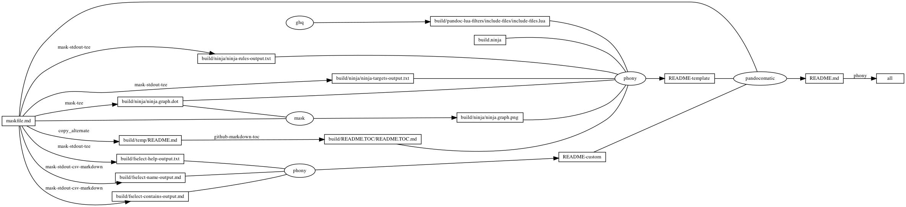

---
pandocomatic_:
    pandoc:
        from: markdown-smart+tex_math_dollars
        to: gfm+tex_math_dollars
        filter:
        - pandoc-include-code
        lua-filter:
        - ./build/pandoc-lua-filters/include-files/include-files.lua
        output: README.md
...

# fselect

<!-- markdownlint-disable MD007 MD030 -->
```{.include}
./build/README.TOC/README.TOC.md
```
<!-- markdownlint-enable MD007 MD030 -->

# Mask SubCommands

[Mask Awesome](https://github.com/huzhenghui/mask-awesome)

## fselect-name

```bash
cd "$(git root)"
echo -e "path\tsize\tmime\tline_count"
fselect "concat('[', path, '](../', path, ')'), size, mime, line_count \
    from . gitignore \
    where name like '%fselect%' \
    order by path"
```

### fselect-name-output

<!-- markdownlint-disable MD013 -->
```{.include}
./build/fselect-name-output.md
```
<!-- markdownlint-enable MD013 -->

## fselect-contains

```bash
cd "$(git root)"
echo -e "path\tsize\tmime\tline_count"
fselect "concat('[', path, '](../', path, ')'), size, mime, line_count \
    from . gitignore \
    where contains(fselect) = true \
    order by path"
```

### fselect-contains-output

<!-- markdownlint-disable MD013 -->
```{.include}
./build/fselect-contains-output.md
```
<!-- markdownlint-enable MD013 -->

## fselect-Home-Today

> **Very slow!**

```bash
cd ~
echo -e "path\tsize"
RUST_BACKTRACE=1 fselect path, size where modified = today order by path
```

## fselect-Downloads-archive

```bash
cd ~/Downloads
echo -e "path\tsize\tmime\tmodified"
fselect path, size, mime, modified where is_archive = true order by path
```

## fselect-Downloads-book

```bash
cd ~/Downloads
echo -e "path\tsize\tmime\tmodified"
fselect path, size, mime, modified where is_book = true order by path
```

## fselect-Downloads-doc

```bash
cd ~/Downloads
echo -e "path\tsize\tmime\tmodified"
fselect path, size, mime, modified where is_doc = true order by path
```

## fselect-help

```bash
NO_COLOR=1 fselect --help
```

### fselect-help-output

<!-- markdownlint-disable MD010 MD013 -->
```{.plain include=./build/fselect-help-output.txt}
```
<!-- markdownlint-enable MD010 MD013 -->

## begin: mask task in template : build content

## ninja-rules

```bash
ninja -t rules
```

### ninja custom-rule

```{.ninja include=build.ninja snippet=custom-rule}
```

### ninja-rules-output

```{.plain include=./build/ninja/ninja-rules-output.txt}
```

## ninja-targets

```bash
ninja -t targets all
```

### ninja build-all

```{.ninja include=build.ninja snippet=build-all}
```

### ninja custom-build

```{.ninja include=build.ninja snippet=custom-build}

```

### ninja report-build

```{.ninja include=build.ninja snippet=report-build}

```

### ninja-targets-output

```{.plain include=./build/ninja/ninja-targets-output.txt}
```

## readme-md

```bash
ninja --verbose README.md
```

### ninja readme-build

```{.ninja include=build.ninja snippet=custom-readme-build}
```

```{.ninja include=build.ninja snippet=readme-build}
```

## end: mask task in template : build content

## begin: mask task in template : ninja command

## ninja-browse

```bash
ninja -t browse
```

## ninja-graph-png

```bash
dot -Tpng -o./build/ninja/ninja.graph.png ./build/ninja/ninja.graph.dot
```



## ninja-graph-dot-xdot

```bash
detach -- xdot "${MASKFILE_DIR}/build/ninja/ninja.graph.dot"
```

## ninja-graph-dot

```bash
ninja -t graph
```

### ninja-graph-dot-output

```{.dot include=./build/ninja/ninja.graph.dot}
```

## ninja-all

```bash
ninja --verbose
```

### build.ninja

```{.ninja include=./build.ninja}
```

## end: mask task in template : ninja command
