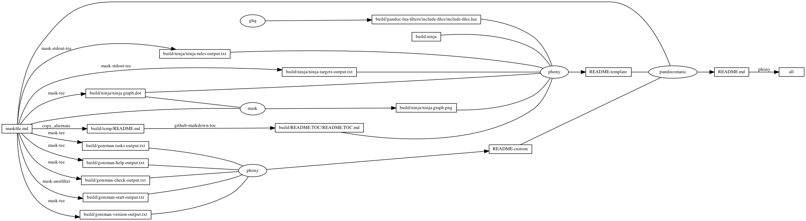

# goreman

<!-- markdownlint-disable MD007 MD030 -->

-   [goreman](#goreman)
-   [Mask SubCommands](#mask-subcommands)
    -   [goreman-check](#goreman-check)
        -   [goreman-check-output](#goreman-check-output)
    -   [goreman-start](#goreman-start)
        -   [Procfile](#procfile)
        -   [goreman-start-output](#goreman-start-output)
    -   [goreman-version](#goreman-version)
        -   [goreman-version-output](#goreman-version-output)
    -   [goreman-tasks](#goreman-tasks)
        -   [goreman-tasks-output](#goreman-tasks-output)
    -   [goreman-help](#goreman-help)
        -   [goreman-help-output](#goreman-help-output)
    -   [begin: mask task in template : build
        content](#begin-mask-task-in-template--build-content)
    -   [ninja-rules](#ninja-rules)
        -   [ninja custom-rule](#ninja-custom-rule)
        -   [ninja-rules-output](#ninja-rules-output)
    -   [ninja-targets](#ninja-targets)
        -   [ninja build-all](#ninja-build-all)
        -   [ninja custom-build](#ninja-custom-build)
        -   [ninja report-build](#ninja-report-build)
        -   [ninja-targets-output](#ninja-targets-output)
    -   [readme-md](#readme-md)
        -   [ninja readme-build](#ninja-readme-build)
    -   [end: mask task in template : build
        content](#end-mask-task-in-template--build-content)
    -   [begin: mask task in template : ninja
        command](#begin-mask-task-in-template--ninja-command)
    -   [ninja-browse](#ninja-browse)
    -   [ninja-graph-png](#ninja-graph-png)
    -   [ninja-graph-dot-xdot](#ninja-graph-dot-xdot)
    -   [ninja-graph-dot](#ninja-graph-dot)
        -   [ninja-graph-dot-output](#ninja-graph-dot-output)
    -   [ninja-all](#ninja-all)
        -   [build.ninja](#buildninja)
    -   [end: mask task in template : ninja
        command](#end-mask-task-in-template--ninja-command)

<!-- markdownlint-enable MD007 MD030 -->

# Mask SubCommands

[Mask Awesome](https://github.com/huzhenghui/mask-awesome)

## goreman-check

``` bash
goreman check
```

### goreman-check-output

<!-- markdownlint-disable MD013 -->

``` plain
valid procfile detected (goreman-help, help, ninja-all, ninja-graph-png, ninja-rules, ninja-targets, readme-md)
```

<!-- markdownlint-enable MD013 -->

## goreman-start

``` bash
goreman -logtime=true -set-ports=false start
```

### Procfile

``` procfile
goreman-check: mask goreman-check
goreman-help: mask goreman-help
goreman-tasks: mask goreman-tasks
goreman-version: mask goreman-version
help: mask help
ninja-all: mask ninja-all
ninja-graph-png: mask ninja-graph-png
ninja-rules: mask ninja-rules
ninja-targets: mask ninja-targets
readme-md: mask readme-md
```

### goreman-start-output

<!-- markdownlint-disable MD010 MD013 -->

``` plain
16:07:01            help | mask 0.11.0
16:07:01            help | USAGE:
16:07:01            help |     mask [FLAGS] [OPTIONS] <SUBCOMMAND>
16:07:01            help | FLAGS:
16:07:01            help |     -h, --help          Prints help information
16:07:01            help |         --introspect    Print out the maskfile command structure in json
16:07:01            help |     -V, --version       Prints version information
16:07:01            help | OPTIONS:
16:07:01            help |         --maskfile <maskfile>    Path to a different maskfile you want to use
16:07:01            help | SUBCOMMANDS:
16:07:01            help |     goreman-check           
16:07:01            help |     goreman-help            
16:07:01            help |     goreman-start           
16:07:01            help |     goreman-tasks           
16:07:01            help |     goreman-version         
16:07:01            help |     help                    Prints this message or the help of the given subcommand(s)
16:07:01            help |     ninja-all               
16:07:01            help |     ninja-browse            
16:07:01            help |     ninja-graph-dot         
16:07:01            help |     ninja-graph-dot-xdot    
16:07:01            help |     ninja-graph-png         
16:07:01            help |     ninja-rules             
16:07:01            help |     ninja-targets           
16:07:01            help |     readme-md               
16:07:01            help | Terminating help
16:07:01   ninja-targets | all: phony
16:07:01   ninja-targets | build/pandoc-lua-filters/include-files/include-files.lua: ghq
16:07:01   ninja-targets | build/ninja/ninja-rules-output.txt: mask-stdout-tee
16:07:01   ninja-targets | build/ninja/ninja-targets-output.txt: mask-stdout-tee
16:07:01   ninja-targets | build/ninja/ninja.graph.dot: mask-tee
16:07:01   ninja-targets | build/ninja/ninja.graph.png: mask
16:07:01   ninja-targets | build/temp/README.md: copy_alternate
16:07:01   ninja-targets | build/README.TOC/README.TOC.md: github-markdown-toc
16:07:01   ninja-targets | README-template: phony
16:07:01   ninja-targets | build/goreman-check-output.txt: mask-tee
16:07:01   ninja-targets | build/goreman-start-output.txt: mask-ansifilter
16:07:01   ninja-targets | build/goreman-version-output.txt: mask-tee
16:07:01   ninja-targets | build/goreman-tasks-output.txt: mask-tee
16:07:01   ninja-targets | build/goreman-help-output.txt: mask-tee
16:07:01   ninja-targets | README-custom: phony
16:07:01   ninja-targets | README.md: pandocomatic
16:07:01     ninja-rules | cmdshelf-repository
16:07:01     ninja-rules | copy_alternate
16:07:01     ninja-rules | dot
16:07:01     ninja-rules | ghq
16:07:01     ninja-rules | github-markdown-toc
16:07:01     ninja-rules | jupyter-nbconvert-markdown
16:07:01     ninja-rules | mask
16:07:01     ninja-rules | mask-ansifilter
16:07:01     ninja-rules | mask-man-markdown
16:07:01     ninja-rules | mask-screenshot
16:07:01     ninja-rules | mask-stderr-tee
16:07:01     ninja-rules | mask-stdout-csv-markdown
16:07:01     ninja-rules | mask-stdout-json
16:07:01     ninja-rules | mask-stdout-tee
16:07:01     ninja-rules | mask-tee
16:07:01     ninja-rules | pandocomatic
16:07:01     ninja-rules | phony
16:07:01       ninja-all | ninja: no work to do.
16:07:01   ninja-targets | Terminating ninja-targets
16:07:01     ninja-rules | Terminating ninja-rules
16:07:01       ninja-all | Terminating ninja-all
16:07:01       readme-md | ninja: no work to do.
16:07:01       readme-md | Terminating readme-md
16:07:01   goreman-tasks | Tasks:
16:07:01   goreman-tasks |   goreman check                      # Show entries in Procfile
16:07:01   goreman-tasks |   goreman help [TASK]                # Show this help
16:07:01   goreman-tasks |   goreman export [FORMAT] [LOCATION] # Export the apps to another process
16:07:01   goreman-tasks |                                        (upstart)
16:07:01   goreman-tasks |   goreman run COMMAND [PROCESS...]   # Run a command
16:07:01   goreman-tasks |                                        start
16:07:01   goreman-tasks |                                        stop
16:07:01   goreman-tasks |                                        stop-all
16:07:01   goreman-tasks |                                        restart
16:07:01   goreman-tasks |                                        restart-all
16:07:01   goreman-tasks |                                        list
16:07:01   goreman-tasks |                                        status
16:07:01   goreman-tasks |   goreman start [PROCESS]            # Start the application
16:07:01   goreman-tasks |   goreman version                    # Display Goreman version
16:07:01   goreman-tasks | Options:
16:07:01   goreman-tasks |   -b uint
16:07:01   goreman-tasks |     	base number of port (default 5000)
16:07:01   goreman-tasks |   -basedir string
16:07:01   goreman-tasks |     	base directory
16:07:01   goreman-tasks |   -exit-on-error
16:07:01   goreman-tasks |     	Exit goreman if a subprocess quits with a nonzero return code
16:07:01   goreman-tasks |   -f string
16:07:01   goreman-tasks |     	proc file (default "Procfile")
16:07:01   goreman-tasks |   -logtime
16:07:01   goreman-tasks |     	show timestamp in log (default true)
16:07:01   goreman-tasks |   -p uint
16:07:01   goreman-tasks |     	port (default 8555)
16:07:01   goreman-tasks |   -set-ports
16:07:01   goreman-tasks |     	False to avoid setting PORT env var for each subprocess (default true)
16:07:01 goreman-version | 0.3.7
16:07:01    goreman-help | Usage of goreman:
16:07:01    goreman-help |   -b uint
16:07:01    goreman-help |     	base number of port (default 5000)
16:07:01    goreman-help |   -basedir string
16:07:01    goreman-help |     	base directory
16:07:01    goreman-help |   -exit-on-error
16:07:01    goreman-help |     	Exit goreman if a subprocess quits with a nonzero return code
16:07:01    goreman-help |   -f string
16:07:01    goreman-help |     	proc file (default "Procfile")
16:07:01    goreman-help |   -logtime
16:07:01    goreman-help |     	show timestamp in log (default true)
16:07:01    goreman-help |   -p uint
16:07:01    goreman-help |     	port (default 8555)
16:07:01    goreman-help |   -set-ports
16:07:01    goreman-help |     	False to avoid setting PORT env var for each subprocess (default true)
16:07:01   goreman-check | valid procfile detected (goreman-check, goreman-help, goreman-tasks, goreman-version, help, ninja-all, ninja-graph-png, ninja-rules, ninja-targets, readme-md)
16:07:01   goreman-tasks | Terminating goreman-tasks
16:07:01 goreman-version | Terminating goreman-version
16:07:01    goreman-help | Terminating goreman-help
16:07:01   goreman-check | Terminating goreman-check
16:07:01 ninja-graph-png | Terminating ninja-graph-png
```

<!-- markdownlint-enable MD010 MD013 -->

## goreman-version

``` bash
goreman version
```

### goreman-version-output

``` plain
0.3.7
```

## goreman-tasks

``` bash
goreman
```

### goreman-tasks-output

<!-- markdownlint-disable MD010 -->

``` plain
Tasks:
  goreman check                      # Show entries in Procfile
  goreman help [TASK]                # Show this help
  goreman export [FORMAT] [LOCATION] # Export the apps to another process
                                       (upstart)
  goreman run COMMAND [PROCESS...]   # Run a command
                                       start
                                       stop
                                       stop-all
                                       restart
                                       restart-all
                                       list
                                       status
  goreman start [PROCESS]            # Start the application
  goreman version                    # Display Goreman version

Options:
  -b uint
    	base number of port (default 5000)
  -basedir string
    	base directory
  -exit-on-error
    	Exit goreman if a subprocess quits with a nonzero return code
  -f string
    	proc file (default "Procfile")
  -logtime
    	show timestamp in log (default true)
  -p uint
    	port (default 8555)
  -set-ports
    	False to avoid setting PORT env var for each subprocess (default true)
```

<!-- markdownlint-enable MD010 -->

## goreman-help

``` bash
goreman --help
```

### goreman-help-output

<!-- markdownlint-disable MD010 -->

``` plain
Usage of goreman:
  -b uint
    	base number of port (default 5000)
  -basedir string
    	base directory
  -exit-on-error
    	Exit goreman if a subprocess quits with a nonzero return code
  -f string
    	proc file (default "Procfile")
  -logtime
    	show timestamp in log (default true)
  -p uint
    	port (default 8555)
  -set-ports
    	False to avoid setting PORT env var for each subprocess (default true)
```

<!-- markdownlint-enable MD010 -->

## begin: mask task in template : build content

## ninja-rules

``` bash
ninja -t rules
```

### ninja custom-rule

``` ninja
rule mask-ansifilter
  command = mask --maskfile $in $mask_subcommand 2>&1 | $
    ansifilter | tee $out 1> /dev/null

```

### ninja-rules-output

``` plain
cmdshelf-repository
copy_alternate
dot
ghq
github-markdown-toc
jupyter-nbconvert-markdown
mask
mask-ansifilter
mask-man-markdown
mask-screenshot
mask-stderr-tee
mask-stdout-csv-markdown
mask-stdout-json
mask-stdout-tee
mask-tee
pandocomatic
phony
```

## ninja-targets

``` bash
ninja -t targets all
```

### ninja build-all

``` ninja
build all: phony README.md

default all

```

### ninja custom-build

``` ninja
# custom build here

```

### ninja report-build

``` ninja
# report build here

```

### ninja-targets-output

``` plain
all: phony
build/pandoc-lua-filters/include-files/include-files.lua: ghq
build/ninja/ninja-rules-output.txt: mask-stdout-tee
build/ninja/ninja-targets-output.txt: mask-stdout-tee
build/ninja/ninja.graph.dot: mask-tee
build/ninja/ninja.graph.png: mask
build/temp/README.md: copy_alternate
build/README.TOC/README.TOC.md: github-markdown-toc
README-template: phony
build/goreman-check-output.txt: mask-tee
build/goreman-start-output.txt: mask-ansifilter
build/goreman-version-output.txt: mask-tee
build/goreman-tasks-output.txt: mask-tee
build/goreman-help-output.txt: mask-tee
README-custom: phony
README.md: pandocomatic
```

## readme-md

``` bash
ninja --verbose README.md
```

### ninja readme-build

``` ninja
build ./build/goreman-check-output.txt : mask-tee ./maskfile.md
  mask_subcommand = goreman-check

build ./build/goreman-start-output.txt : mask-ansifilter ./maskfile.md | Procfile
  mask_subcommand = goreman-start

build ./build/goreman-version-output.txt : mask-tee ./maskfile.md
  mask_subcommand = goreman-version

build ./build/goreman-tasks-output.txt : mask-tee ./maskfile.md
  mask_subcommand = goreman-tasks

build ./build/goreman-help-output.txt : mask-tee ./maskfile.md
  mask_subcommand = goreman-help

build README-custom : phony $
  ./build/goreman-check-output.txt $
  ./build/goreman-start-output.txt $
  ./build/goreman-version-output.txt $
  ./build/goreman-tasks-output.txt $
  ./build/goreman-help-output.txt

```

``` ninja
build README.md : pandocomatic maskfile.md | README-template README-custom

```

## end: mask task in template : build content

## begin: mask task in template : ninja command

## ninja-browse

``` bash
ninja -t browse
```

## ninja-graph-png

``` bash
dot -Tpng -o./build/ninja/ninja.graph.png ./build/ninja/ninja.graph.dot
```



## ninja-graph-dot-xdot

``` bash
detach -- xdot "${MASKFILE_DIR}/build/ninja/ninja.graph.dot"
```

## ninja-graph-dot

``` bash
ninja -t graph
```

### ninja-graph-dot-output


## ninja-all

``` bash
ninja --verbose
```

### build.ninja

``` ninja
builddir=./build
mask_subcommand = --help
mask_stdout_csv_markdowndelimiter = ","
jupyter_nbconvert_markdown_output_files_dir=./build/jupyter-nbconvert-markdown-output-files

#######################################
# begin: rule in template

rule mask
  command = mask --maskfile $in $mask_subcommand

rule mask-tee
  command = mask --maskfile $in $mask_subcommand 2>&1 | tee $out 1> /dev/null

rule mask-stdout-tee
  command = mask --maskfile $in $mask_subcommand 2>/dev/null | tee $out 1> /dev/null

rule mask-stderr-tee
  command = bash -c 'mask $mask_subcommand 1>/dev/null 2> >(tee $out)' || echo $$?

# <!-- markdownlint-disable MD013 -->
rule mask-man-markdown
  command = set -e && set -o pipefail && $
    mask --maskfile $in $mask_subcommand | $
    ul | $
    ansifilter --bbcode | $
    inv --search-root="$$(ghq list --full-path https://github.com/huzhenghui/pyinvoke-awesome)/bbcode" bbcode-parser-format | $
    pandoc --from=html --to=markdown | $
    tee $out 1> /dev/null
# <!-- markdownlint-enable MD013 -->

rule mask-stdout-csv-markdown
  command = mask --maskfile $in $mask_subcommand 2>/dev/null | $
    csvtomd --delimiter "$$(echo $mask_stdout_csv_markdowndelimiter)" | $
    tee $out 1> /dev/null

rule mask-stdout-json
  command = mask --maskfile $in $mask_subcommand 2>/dev/null | $
    jq | $
    tee $out 1> /dev/null

rule mask-screenshot
  command = $
    regular_logfile="./build/temp/$$(basename $out).mask-screenshot.logfile" && $
    rm -f -v "$${regular_logfile}" && $
    until [[ -s "$${regular_logfile}" ]]; do $
      screen_logfile="$$(mktemp -d)/logfile"; $
      echo "$${screen_logfile}"; $
      mkfifo "$${screen_logfile}"; $
      screen -L -Logfile "$${screen_logfile}" $
        -dmS mask-screenshot-"$$(basename $out)" $
        sh -c "stdbuf -o0 mask --maskfile $in $mask_subcommand; $
          date +'%F %T %Z %z - %+ https://github.com/huzhenghui' | lolcat;"; $
      dd bs=1 if="$${screen_logfile}" of="$${regular_logfile}"; $
    done && $
    ansifilter --html --encoding=utf8 --input="$${regular_logfile}" | $
      tee ./build/temp/"$$(basename $out)".mask-screenshot.html | $
      wkhtmltoimage --format png - "$out"

rule pandocomatic
  command = pandocomatic --input $in --output $out

rule github-markdown-toc
  command = gh-md-toc --hide-header --hide-footer --no-escape $in > $out

rule copy_alternate
  command = if [[ -f "$alternate" ]]; $
    then $
      cp "$alternate" "$out"; $
    else $
      cp "$in" "$out"; $
    fi;

rule dot
  command = dot -Tpng -o$out $in

rule ghq
  command = ghq get --update "$repository" && $
    find -d "$link_dirname" -exec rmdir {} \; && $
    ln -Fs "$$(ghq list --full-path $repository)" "$link_dirname"
  generator = 1

rule cmdshelf-repository
  command = $$( $
    cmdshelf remote list | ack "^$cmdshelf_name" 1>&2 || $
    cmdshelf remote add "$cmdshelf_name" "$cmdshelf_url" 1>&2 $
    ) && $
    repository_path="$$(realpath $${HOME}/.cmdshelf/remote/$cmdshelf_name)" && $
    echo "$${repository_path}" && $
    stub_path="$$(realpath ./build/$cmdshelf_name)" && $
    echo "$${stub_path}" && $
    find -d "$${stub_path}" -exec rmdir {} \; && $
    ln -Fs "$${repository_path}" "$${stub_path}"
  generator = 1

# <!-- markdownlint-disable MD013 -->
rule jupyter-nbconvert-markdown
  command = jupyter nbconvert $
    --to=markdown $
    --NbConvertApp.output_files_dir="$jupyter_nbconvert_markdown_output_files_dir" $
    --output="$out" $
    "$in"
# <!-- markdownlint-enble MD013 -->

# end: rule in template
#######################################

#######################################
# start snippet custom-rule

rule mask-ansifilter
  command = mask --maskfile $in $mask_subcommand 2>&1 | $
    ansifilter | tee $out 1> /dev/null

# end snippet custom-rule
#######################################

#######################################
# start snippet build-all

build all: phony README.md

default all

# end snippet build-all
#######################################

#######################################
# start snippet custom-build

# custom build here

# end snippet custom-build
#######################################

#######################################
# start snippet report-build

# report build here

# end snippet report-build
#######################################

#######################################
# begin: readme-build in template

# ninja will create ./build/pandoc-lua-filters/include-files/ automatically
build ./build/pandoc-lua-filters/include-files/include-files.lua : ghq
  repository = https://github.com/pandoc/lua-filters
  link_dirname = ./build/pandoc-lua-filters

build ./build/ninja/ninja-rules-output.txt : mask-stdout-tee ./maskfile.md
  mask_subcommand = ninja-rules

build ./build/ninja/ninja-targets-output.txt : mask-stdout-tee ./maskfile.md
  mask_subcommand = ninja-targets

build ./build/ninja/ninja.graph.dot : mask-tee ./maskfile.md
  mask_subcommand = ninja-graph-dot

build ./build/ninja/ninja.graph.png : mask ./maskfile.md | ./build/ninja/ninja.graph.dot
  mask_subcommand = ninja-graph-png

build ./build/temp/README.md : copy_alternate ./maskfile.md
  alternate = ./README.md

build ./build/README.TOC/README.TOC.md : github-markdown-toc ./build/temp/README.md

build README-template : phony $
  ./build/pandoc-lua-filters/include-files/include-files.lua $
  ./build.ninja $
  ./build/ninja/ninja-rules-output.txt $
  ./build/ninja/ninja-targets-output.txt $
  ./build/ninja/ninja.graph.dot $
  ./build/ninja/ninja.graph.png $
  ./build/README.TOC/README.TOC.md $

# end: readme-build in template
#######################################

#######################################
# start snippet custom-readme-build

build ./build/goreman-check-output.txt : mask-tee ./maskfile.md
  mask_subcommand = goreman-check

build ./build/goreman-start-output.txt : mask-ansifilter ./maskfile.md | Procfile
  mask_subcommand = goreman-start

build ./build/goreman-version-output.txt : mask-tee ./maskfile.md
  mask_subcommand = goreman-version

build ./build/goreman-tasks-output.txt : mask-tee ./maskfile.md
  mask_subcommand = goreman-tasks

build ./build/goreman-help-output.txt : mask-tee ./maskfile.md
  mask_subcommand = goreman-help

build README-custom : phony $
  ./build/goreman-check-output.txt $
  ./build/goreman-start-output.txt $
  ./build/goreman-version-output.txt $
  ./build/goreman-tasks-output.txt $
  ./build/goreman-help-output.txt

# end snippet custom-readme-build
#######################################

#######################################
# $ followed by a newline
# escape the newline (continue the current line across a line break).
# start snippet readme-build

build README.md : pandocomatic maskfile.md | README-template README-custom

# end snippet readme-build
#######################################
```

## end: mask task in template : ninja command
