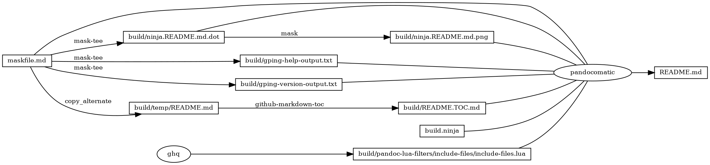
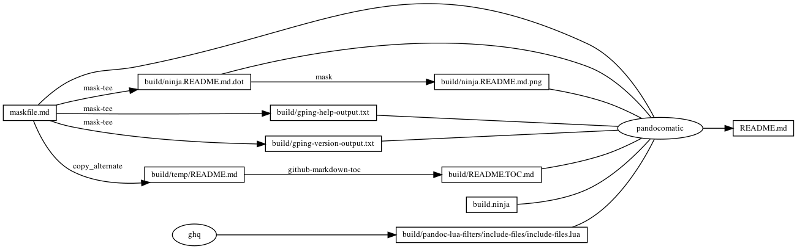

# gping

<!-- markdownlint-disable MD007 MD030 -->

-   [gping](#gping)
-   [Mask SubCommands](#mask-subcommands)
    -   [gping-help](#gping-help)
        -   [gping-help-output](#gping-help-output)
    -   [gping-version](#gping-version)
        -   [gping-version-output](#gping-version-output)
    -   [gping-4-github-com](#gping-4-github-com)
    -   [gping-cmd-curl-github-com](#gping-cmd-curl-github-com)
    -   [begin: mask task in template](#begin-mask-task-in-template)
    -   [readme](#readme)
        -   [build.ninja](#buildninja)
        -   [ninja custom-rule](#ninja-custom-rule)
        -   [ninja custom-build](#ninja-custom-build)
    -   [readme-graph-dot](#readme-graph-dot)
        -   [readme-graph-dot-output](#readme-graph-dot-output)
    -   [readme-graph-dot-xdot](#readme-graph-dot-xdot)
    -   [readme-graph-png](#readme-graph-png)
    -   [end: mask task in template](#end-mask-task-in-template)

<!-- markdownlint-enable MD007 MD030 -->

# Mask SubCommands

[Mask Awesome](https://github.com/huzhenghui/mask-awesome)

## gping-help

``` bash
gping --help
```

### gping-help-output

<!-- markdownlint-disable MD013 -->

``` plain
gping 1.2.0
Ping, but with a graph.

USAGE:
    gping [FLAGS] [OPTIONS] [hosts-or-commands]...

FLAGS:
        --cmd        Graph the execution time for a list of commands rather than pinging hosts
    -h, --help       Prints help information
    -4               Resolve ping targets to IPv4 address
    -6               Resolve ping targets to IPv6 address
    -V, --version    Prints version information

OPTIONS:
    -b, --buffer <buffer>                    Determines the number of seconds to display in the graph. [default: 30]
    -n, --watch-interval <watch-interval>    Watch interval seconds (provide partial seconds like '0.5') [default: 0.5]

ARGS:
    <hosts-or-commands>...    Hosts or IPs to ping, or commands to run if --cmd is provided.
```

<!-- markdownlint-enable MD013 -->

## gping-version

``` bash
gping --version
```

### gping-version-output

``` plain
gping 1.2.0
```

## gping-4-github-com

``` bash
gping -4 github.com
```

## gping-cmd-curl-github-com

``` bash
gping --cmd 'curl https://github.com/'
```

## begin: mask task in template

## readme

``` bash
ninja --verbose README.md
```

### build.ninja

``` ninja
builddir=./build
mask_subcommand = --help

#######################################
# begin: rule in template

rule mask
  command = mask $mask_subcommand

rule mask-tee
  command = mask $mask_subcommand 2>&1 | tee $out 1> /dev/null

rule pandocomatic
  command = pandocomatic --input $in --output $out

rule ghq
  command = ghq get --update "$repository" && $
    find -d "$link_dirname" -exec rmdir {} \; && $
    ln -Fs "$$(ghq list --full-path $repository)" "$link_dirname"
  generator = 1

rule github-markdown-toc
  command = gh-md-toc --hide-header --hide-footer --no-escape $in > $out

rule copy_alternate
  command = if [[ -f "$alternate" ]]; $
    then $
      cp "$alternate" "$out"; $
    else $
      cp "$in" "$out"; $
    fi;

# end: rule in template
#######################################

#######################################
# start snippet custom-rule

# custom rule here

# end snippet custom-rule
#######################################

#######################################
# begin: build in template

build ./build/ninja.README.md.dot : mask-tee | ./maskfile.md
  mask_subcommand = readme-graph-dot

build ./build/ninja.README.md.png : mask | ./build/ninja.README.md.dot
  mask_subcommand = readme-graph-png

build ./build/pandoc-lua-filters/include-files/include-files.lua : ghq
  repository = https://github.com/pandoc/lua-filters
  link_dirname = ./build/pandoc-lua-filters

build ./build/temp/README.md : copy_alternate ./maskfile.md
  alternate = ./README.md

build ./build/README.TOC.md : github-markdown-toc ./build/temp/README.md

# end: build in template
#######################################

#######################################
# start snippet custom-build

build ./build/gping-help-output.txt : mask-tee | ./maskfile.md
  mask_subcommand = gping-help

build ./build/gping-version-output.txt : mask-tee | ./maskfile.md
  mask_subcommand = gping-version

# end snippet custom-build
#######################################

#######################################
# begin: build README.md
# $ followed by a newline
# escape the newline (continue the current line across a line break).
# the first 4 line in this build is template
build README.md : pandocomatic maskfile.md | $
  build.ninja $
  ./build/ninja.README.md.dot $
  ./build/ninja.README.md.png $
  ./build/pandoc-lua-filters/include-files/include-files.lua $
  ./build/README.TOC.md $
  ./build/gping-help-output.txt $
  ./build/gping-version-output.txt

default README.md
# end: build README.md
#######################################
```

### ninja custom-rule

``` ninja
# custom rule here

```

### ninja custom-build

``` ninja
build ./build/gping-help-output.txt : mask-tee | ./maskfile.md
  mask_subcommand = gping-help

build ./build/gping-version-output.txt : mask-tee | ./maskfile.md
  mask_subcommand = gping-version

```

## readme-graph-dot

``` bash
ninja -t graph README.md
```

### readme-graph-dot-output



## readme-graph-dot-xdot

``` bash
detach -- xdot "${MASKFILE_DIR}/build/ninja.README.md.dot"
```

## readme-graph-png

``` bash
dot -Tpng -o./build/ninja.README.md.png ./build/ninja.README.md.dot
```



## end: mask task in template
