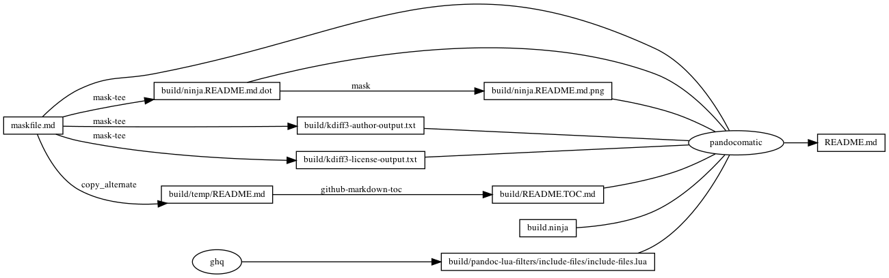

---
pandocomatic_:
    pandoc:
        from: markdown-smart
        to: gfm
        filter:
        - pandoc-include-code
        lua-filter:
        - ./build/pandoc-lua-filters/include-files/include-files.lua
        output: README.md
...

# kdiff3

<!-- markdownlint-disable MD007 MD030 -->
```{.include}
./build/README.TOC.md
```
<!-- markdownlint-enable MD007 MD030 -->

# Mask SubCommands

[Mask Awesome](https://github.com/huzhenghui/mask-awesome)

## kdiff3-author

```bash
kdiff3 --author
```

### kdiff3-author-output

```{.plain include=./build/kdiff3-author-output.txt}
```

## compare-mask-cookiecutter-template

```bash
kdiff3 ./ "$(ghq list --full-path https://github.com/huzhenghui/mask-cookiecutter-template)/{{cookiecutter.project_slug}}"
```

## kdiff3-license

```bash
kdiff3 --license
```

### kdiff3-license-output

```{.plain include=./build/kdiff3-license-output.txt}
```

## begin: mask task in template

## readme

```bash
ninja --verbose README.md
```

### build.ninja

```{.ninja include=./build.ninja}

```

### ninja custom-rule

```{.ninja include=build.ninja snippet=custom-rule}

```

### ninja custom-build

```{.ninja include=build.ninja snippet=custom-build}

```

## readme-graph-dot

```bash
ninja -t graph README.md
```

### readme-graph-dot-output

```{.dot include=./build/ninja.README.md.dot}

```

## readme-graph-dot-xdot

```bash
detach -- xdot "${MASKFILE_DIR}/build/ninja.README.md.dot"
```

## readme-graph-png

```bash
dot -Tpng -o./build/ninja.README.md.png ./build/ninja.README.md.dot
```



## end: mask task in template
