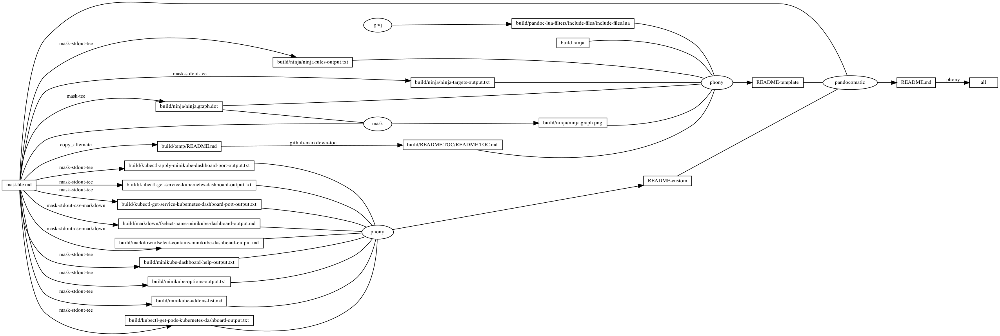

# minikube-dashboard

<!-- markdownlint-disable MD007 MD030 -->

-   [minikube-dashboard](#minikube-dashboard)
-   [Mask SubCommands](#mask-subcommands)
    -   [docker-open](#docker-open)
    -   [minikube-addons-list](#minikube-addons-list)
        -   [minikube-addons-list-output](#minikube-addons-list-output)
    -   [minikube-start](#minikube-start)
    -   [kubectl-get-pods](#kubectl-get-pods)
    -   [kubectl-get-pods-kubernetes-dashboard](#kubectl-get-pods-kubernetes-dashboard)
        -   [kubectl-get-pods-kubernetes-dashboard-output](#kubectl-get-pods-kubernetes-dashboard-output)
    -   [minikube-dashboard-url](#minikube-dashboard-url)
    -   [kubectl-apply-minikube-dashboard-port](#kubectl-apply-minikube-dashboard-port)
        -   [minikube-dashboard-port.yaml](#minikube-dashboard-portyaml)
        -   [kubectl-apply-minikube-dashboard-port-output](#kubectl-apply-minikube-dashboard-port-output)
    -   [kubectl-get-service-kubernetes-dashboard](#kubectl-get-service-kubernetes-dashboard)
        -   [kubectl-get-service-kubernetes-dashboard-output](#kubectl-get-service-kubernetes-dashboard-output)
    -   [kubectl-get-service-kubernetes-dashboard-port](#kubectl-get-service-kubernetes-dashboard-port)
        -   [kubectl-get-service-kubernetes-dashboard-port-output](#kubectl-get-service-kubernetes-dashboard-port-output)
    -   [minikube-service-kubernetes-dashboard-port](#minikube-service-kubernetes-dashboard-port)
    -   [kubectl-port-forward-kubernetes-dashboard-port](#kubectl-port-forward-kubernetes-dashboard-port)
    -   [kubectl-delete-kubernetes-dashboard-port](#kubectl-delete-kubernetes-dashboard-port)
    -   [fselect-name-minikube-dashboard](#fselect-name-minikube-dashboard)
        -   [fselect-name-minikube-dashboard-output](#fselect-name-minikube-dashboard-output)
    -   [fselect-contains-minikube-dashboard](#fselect-contains-minikube-dashboard)
        -   [fselect-contains-minikube-dashboard-output](#fselect-contains-minikube-dashboard-output)
    -   [minikube-dashboard-help](#minikube-dashboard-help)
        -   [minikube-dashboard-help-output](#minikube-dashboard-help-output)
    -   [minikube-options](#minikube-options)
        -   [minikube-options-output](#minikube-options-output)
    -   [begin: mask task in template : build
        content](#begin-mask-task-in-template--build-content)
    -   [ninja-rules](#ninja-rules)
        -   [ninja custom-rule](#ninja-custom-rule)
        -   [ninja-rules-output](#ninja-rules-output)
    -   [ninja-targets](#ninja-targets)
        -   [ninja build-all](#ninja-build-all)
        -   [ninja custom-build](#ninja-custom-build)
        -   [ninja report-build](#ninja-report-build)
        -   [ninja-targets-output](#ninja-targets-output)
    -   [readme-md](#readme-md)
        -   [ninja readme-build](#ninja-readme-build)
    -   [end: mask task in template : build
        content](#end-mask-task-in-template--build-content)
    -   [begin: mask task in template : ninja
        command](#begin-mask-task-in-template--ninja-command)
    -   [ninja-browse](#ninja-browse)
    -   [ninja-graph-png](#ninja-graph-png)
    -   [ninja-graph-dot-xdot](#ninja-graph-dot-xdot)
    -   [ninja-graph-dot](#ninja-graph-dot)
        -   [ninja-graph-dot-output](#ninja-graph-dot-output)
    -   [ninja-all](#ninja-all)
        -   [build.ninja](#buildninja)
    -   [end: mask task in template : ninja
        command](#end-mask-task-in-template--ninja-command)

<!-- markdownlint-enable MD007 MD030 -->

# Mask SubCommands

[Mask Awesome](https://github.com/huzhenghui/mask-awesome)

## docker-open

``` bash
open -a Docker
```

## minikube-addons-list

``` bash
minikube addons list | sed '1d;$d'
```

### minikube-addons-list-output

| ADDON NAME                  | PROFILE  | STATUS    |
|-----------------------------|----------|-----------|
| ambassador                  | minikube | disabled  |
| auto-pause                  | minikube | disabled  |
| csi-hostpath-driver         | minikube | disabled  |
| dashboard                   | minikube | enabled ✅ |
| default-storageclass        | minikube | enabled ✅ |
| efk                         | minikube | disabled  |
| freshpod                    | minikube | disabled  |
| gcp-auth                    | minikube | disabled  |
| gvisor                      | minikube | disabled  |
| helm-tiller                 | minikube | disabled  |
| ingress                     | minikube | disabled  |
| ingress-dns                 | minikube | disabled  |
| istio                       | minikube | disabled  |
| istio-provisioner           | minikube | disabled  |
| kubevirt                    | minikube | disabled  |
| logviewer                   | minikube | disabled  |
| metallb                     | minikube | disabled  |
| metrics-server              | minikube | disabled  |
| nvidia-driver-installer     | minikube | disabled  |
| nvidia-gpu-device-plugin    | minikube | disabled  |
| olm                         | minikube | disabled  |
| pod-security-policy         | minikube | disabled  |
| registry                    | minikube | disabled  |
| registry-aliases            | minikube | disabled  |
| registry-creds              | minikube | disabled  |
| storage-provisioner         | minikube | enabled ✅ |
| storage-provisioner-gluster | minikube | disabled  |
| volumesnapshots             | minikube | disabled  |

## minikube-start

``` bash
minikube start
```

## kubectl-get-pods

``` bash
kubectl get pods --all-namespaces
```

## kubectl-get-pods-kubernetes-dashboard

``` bash
kubectl get pods --namespace=kubernetes-dashboard
```

### kubectl-get-pods-kubernetes-dashboard-output

``` plain
NAME                                        READY   STATUS    RESTARTS   AGE
dashboard-metrics-scraper-f6647bd8c-czkbs   1/1     Running   2          10d
kubernetes-dashboard-968bcb79-jhfhh         1/1     Running   2          10d
```

## minikube-dashboard-url

``` bash
minikube dashboard --url=true
```

## kubectl-apply-minikube-dashboard-port

``` bash
kubectl apply -f minikube-dashboard-port.kubernetes.yaml
```

### minikube-dashboard-port.yaml

``` yaml
apiVersion: v1
kind: Service
metadata:
  name: kubernetes-dashboard-port
  namespace: kubernetes-dashboard
  labels:
    addonmanager.kubernetes.io/mode: Reconcile
    k8s-app: kubernetes-dashboard
    kubernetes.io/minikube-addons: dashboard
spec:
  selector:
    k8s-app: kubernetes-dashboard
  type: NodePort
  ports:
    - protocol: TCP
      port: 9090
      targetPort: 9090
```

### kubectl-apply-minikube-dashboard-port-output

``` plain
service/kubernetes-dashboard-port unchanged
```

## kubectl-get-service-kubernetes-dashboard

``` bash
kubectl get service --namespace=kubernetes-dashboard
```

### kubectl-get-service-kubernetes-dashboard-output

<!-- markdownlint-disable MD013 -->

``` plain
NAME                        TYPE        CLUSTER-IP      EXTERNAL-IP   PORT(S)          AGE
dashboard-metrics-scraper   ClusterIP   10.110.0.111    <none>        8000/TCP         10d
kubernetes-dashboard        ClusterIP   10.103.30.202   <none>        80/TCP           10d
kubernetes-dashboard-port   NodePort    10.104.94.156   <none>        9090:31172/TCP   65m
```

<!-- markdownlint-enable MD013 -->

## kubectl-get-service-kubernetes-dashboard-port

``` bash
kubectl get service kubernetes-dashboard-port --namespace=kubernetes-dashboard
```

### kubectl-get-service-kubernetes-dashboard-port-output

<!-- markdownlint-disable MD013 -->

``` plain
NAME                        TYPE       CLUSTER-IP      EXTERNAL-IP   PORT(S)          AGE
kubernetes-dashboard-port   NodePort   10.104.94.156   <none>        9090:31172/TCP   65m
```

<!-- markdownlint-enable MD013 -->

## minikube-service-kubernetes-dashboard-port

``` bash
minikube service kubernetes-dashboard-port --namespace=kubernetes-dashboard
```

## kubectl-port-forward-kubernetes-dashboard-port

``` bash
kubectl port-forward service/kubernetes-dashboard-port 9090: --namespace=kubernetes-dashboard
```

<http://localhost:9090/>

## kubectl-delete-kubernetes-dashboard-port

``` bash
kubectl delete services kubernetes-dashboard-port --namespace=kubernetes-dashboard
```

## fselect-name-minikube-dashboard

``` bash
relpath="$(urelpath "$(git root)")"
cd "$(git root)"
echo -e "path\tsize\tmime\tline_count"
fselect "concat('[', path, '](${relpath}/', path, ')'), size, mime, line_count \
    from . gitignore \
    where name like '%minikube%' and name like '%dashboard%' \
    order by path"
```

### fselect-name-minikube-dashboard-output

<!-- markdownlint-disable MD013 -->

| path                                                                                                                                                                                                  | size | mime       | line\_count |
|-------------------------------------------------------------------------------------------------------------------------------------------------------------------------------------------------------|------|------------|-------------|
| [./kubernetes/minikube/dashboard/build/kubectl-apply-minikube-dashboard-port-output.txt](../../.././kubernetes/minikube/dashboard/build/kubectl-apply-minikube-dashboard-port-output.txt)             | 0    | text/plain | 0           |
| [./kubernetes/minikube/dashboard/build/markdown/fselect-contains-minikube-dashboard-output.md](../../.././kubernetes/minikube/dashboard/build/markdown/fselect-contains-minikube-dashboard-output.md) | 0    | text/plain | 0           |
| [./kubernetes/minikube/dashboard/build/markdown/fselect-name-minikube-dashboard-output.md](../../.././kubernetes/minikube/dashboard/build/markdown/fselect-name-minikube-dashboard-output.md)         | 0    | text/plain | 0           |
| [./kubernetes/minikube/dashboard/build/minikube-dashboard-help-output.txt](../../.././kubernetes/minikube/dashboard/build/minikube-dashboard-help-output.txt)                                         | 285  | text/plain | 9           |
| [./kubernetes/minikube/dashboard/minikube-dashboard-port.kubernetes.yaml](../../.././kubernetes/minikube/dashboard/minikube-dashboard-port.kubernetes.yaml)                                           | 381  | text/plain | 17          |

<!-- markdownlint-enable MD013 -->

## fselect-contains-minikube-dashboard

``` bash
relpath="$(urelpath "$(git root)")"
cd "$(git root)"
echo -e "path\tsize\tmime\tline_count"
fselect "concat('[', path, '](${relpath}/', path, ')'), size, mime, line_count \
    from . gitignore \
    where contains(minikube) = true and contains(dashboard) = true\
    order by path"
```

### fselect-contains-minikube-dashboard-output

<!-- markdownlint-disable MD013 -->

| path                                                                                                                                                                                          | size  | mime              | line\_count |
|-----------------------------------------------------------------------------------------------------------------------------------------------------------------------------------------------|-------|-------------------|-------------|
| [./.vscode/extension/.favorites.json](../../.././.vscode/extension/.favorites.json)                                                                                                           | 13760 | text/plain        | 441         |
| [./kubernetes/minikube/dashboard/README.md](../../.././kubernetes/minikube/dashboard/README.md)                                                                                               | 33479 | text/plain        | 864         |
| [./kubernetes/minikube/dashboard/build.ninja](../../.././kubernetes/minikube/dashboard/build.ninja)                                                                                           | 7951  | text/plain        | 239         |
| [./kubernetes/minikube/dashboard/build/markdown/fselect-name-minikube-dashboard-output.md](../../.././kubernetes/minikube/dashboard/build/markdown/fselect-name-minikube-dashboard-output.md) | 1615  | text/plain        | 7           |
| [./kubernetes/minikube/dashboard/build/minikube-dashboard-help-output.txt](../../.././kubernetes/minikube/dashboard/build/minikube-dashboard-help-output.txt)                                 | 285   | text/plain        | 9           |
| [./kubernetes/minikube/dashboard/build/ninja/ninja-targets-output.txt](../../.././kubernetes/minikube/dashboard/build/ninja/ninja-targets-output.txt)                                         | 1033  | text/plain        | 20          |
| [./kubernetes/minikube/dashboard/build/ninja/ninja.graph.dot](../../.././kubernetes/minikube/dashboard/build/ninja/ninja.graph.dot)                                                           | 3973  | text/vnd.graphviz | 73          |
| [./kubernetes/minikube/dashboard/maskfile.md](../../.././kubernetes/minikube/dashboard/maskfile.md)                                                                                           | 5642  | text/plain        | 306         |
| [./kubernetes/minikube/dashboard/minikube-dashboard-port.kubernetes.yaml](../../.././kubernetes/minikube/dashboard/minikube-dashboard-port.kubernetes.yaml)                                   | 381   | text/plain        | 17          |
| [./kubernetes/minikube/start/README.md](../../.././kubernetes/minikube/start/README.md)                                                                                                       | 23223 | text/plain        | 732         |
| [./kubernetes/minikube/start/build.ninja](../../.././kubernetes/minikube/start/build.ninja)                                                                                                   | 6827  | text/plain        | 211         |
| [./kubernetes/minikube/start/build/README.TOC/README.TOC.md](../../.././kubernetes/minikube/start/build/README.TOC/README.TOC.md)                                                             | 2724  | text/plain        | 46          |
| [./kubernetes/minikube/start/build/minikube-addons-list.md](../../.././kubernetes/minikube/start/build/minikube-addons-list.md)                                                               | 1743  | text/plain        | 30          |
| [./kubernetes/minikube/start/build/minikube-help-output.txt](../../.././kubernetes/minikube/start/build/minikube-help-output.txt)                                                             | 1971  | text/plain        | 45          |
| [./kubernetes/minikube/start/build/ninja/ninja-targets-output.txt](../../.././kubernetes/minikube/start/build/ninja/ninja-targets-output.txt)                                                 | 772   | text/plain        | 17          |
| [./kubernetes/minikube/start/build/ninja/ninja.graph.dot](../../.././kubernetes/minikube/start/build/ninja/ninja.graph.dot)                                                                   | 3328  | text/vnd.graphviz | 64          |
| [./kubernetes/minikube/start/maskfile.md](../../.././kubernetes/minikube/start/maskfile.md)                                                                                                   | 4092  | text/plain        | 262         |

<!-- markdownlint-enable MD013 -->

## minikube-dashboard-help

``` bash
minikube dashboard --help
```

### minikube-dashboard-help-output

<!-- markdownlint-disable MD013 -->

``` plain
Access the Kubernetes dashboard running within the minikube cluster

Options:
      --url=false: 显示 dashboard URL，而不是打开浏览器

Usage:
  minikube dashboard [flags] [options]

Use "minikube options" for a list of global command-line options (applies to all commands).
```

<!-- markdownlint-enable MD013 -->

## minikube-options

``` bash
minikube options
```

### minikube-options-output

<!-- markdownlint-disable MD013 -->

``` plain
The following options can be passed to any command:

      --add_dir_header=false: If true, adds the file directory to the header of the log messages
      --alsologtostderr=false: log to standard error as well as files
  -b, --bootstrapper='kubeadm': The name of the cluster bootstrapper that will set up the Kubernetes cluster.
  -h, --help=false: 
      --log_backtrace_at=:0: when logging hits line file:N, emit a stack trace
      --log_dir='': If non-empty, write log files in this directory
      --log_file='': If non-empty, use this log file
      --log_file_max_size=1800: Defines the maximum size a log file can grow to. Unit is megabytes. If the value is 0, the maximum file size is unlimited.
      --logtostderr=true: log to standard error instead of files
      --one_output=false: If true, only write logs to their native severity level (vs also writing to each lower severity level
  -p, --profile='minikube': The name of the minikube VM being used. This can be set to allow having multiple instances of minikube independently.
      --skip_headers=false: If true, avoid header prefixes in the log messages
      --skip_log_headers=false: If true, avoid headers when opening log files
      --stderrthreshold=2: logs at or above this threshold go to stderr
      --user='': Specifies the user executing the operation. Useful for auditing operations executed by 3rd party tools. Defaults to the operating system username.
  -v, --v=0: number for the log level verbosity
      --vmodule=: comma-separated list of pattern=N settings for file-filtered logging
```

<!-- markdownlint-enable MD013 -->

## begin: mask task in template : build content

## ninja-rules

``` bash
ninja -t rules
```

### ninja custom-rule

``` ninja
# custom rule here

```

### ninja-rules-output

``` plain
cmdshelf-repository
copy_alternate
dot
ghq
github-markdown-toc
jupyter-nbconvert-markdown
mask
mask-man-markdown
mask-screenshot
mask-stderr-tee
mask-stdout-csv-markdown
mask-stdout-json
mask-stdout-tee
mask-tee
pandocomatic
phony
```

## ninja-targets

``` bash
ninja -t targets all
```

### ninja build-all

``` ninja
build all: phony README.md

default all

```

### ninja custom-build

``` ninja
# custom build here

```

### ninja report-build

``` ninja
# report build here

```

### ninja-targets-output

``` plain
all: phony
build/pandoc-lua-filters/include-files/include-files.lua: ghq
build/ninja/ninja-rules-output.txt: mask-stdout-tee
build/ninja/ninja-targets-output.txt: mask-stdout-tee
build/ninja/ninja.graph.dot: mask-tee
build/ninja/ninja.graph.png: mask
build/temp/README.md: copy_alternate
build/README.TOC/README.TOC.md: github-markdown-toc
README-template: phony
build/minikube-addons-list.md: mask-stdout-tee
build/kubectl-get-pods-kubernetes-dashboard-output.txt: mask-stdout-tee
build/kubectl-apply-minikube-dashboard-port-output.txt: mask-stdout-tee
build/kubectl-get-service-kubernetes-dashboard-output.txt: mask-stdout-tee
build/kubectl-get-service-kubernetes-dashboard-port-output.txt: mask-stdout-tee
build/markdown/fselect-name-minikube-dashboard-output.md: mask-stdout-csv-markdown
build/markdown/fselect-contains-minikube-dashboard-output.md: mask-stdout-csv-markdown
build/minikube-dashboard-help-output.txt: mask-stdout-tee
build/minikube-options-output.txt: mask-stdout-tee
README-custom: phony
README.md: pandocomatic
```

## readme-md

``` bash
ninja --verbose README.md
```

### ninja readme-build

``` ninja
build ./build/minikube-addons-list.md : mask-stdout-tee ./maskfile.md
  mask_subcommand = minikube-addons-list

build ./build/kubectl-get-pods-kubernetes-dashboard-output.txt : $
  mask-stdout-tee ./maskfile.md
  mask_subcommand = kubectl-get-pods-kubernetes-dashboard

build ./build/kubectl-apply-minikube-dashboard-port-output.txt : $
  mask-stdout-tee ./maskfile.md
  mask_subcommand = kubectl-apply-minikube-dashboard-port

build ./build/kubectl-get-service-kubernetes-dashboard-output.txt : $
  mask-stdout-tee ./maskfile.md
  mask_subcommand = kubectl-get-service-kubernetes-dashboard

build ./build/kubectl-get-service-kubernetes-dashboard-port-output.txt : $
  mask-stdout-tee ./maskfile.md
  mask_subcommand = kubectl-get-service-kubernetes-dashboard-port

build ./build/markdown/fselect-name-minikube-dashboard-output.md : $
  mask-stdout-csv-markdown ./maskfile.md
  mask_subcommand = fselect-name-minikube-dashboard
  mask_stdout_csv_markdowndelimiter = "\t"

build ./build/markdown/fselect-contains-minikube-dashboard-output.md : $
  mask-stdout-csv-markdown ./maskfile.md
  mask_subcommand = fselect-contains-minikube-dashboard
  mask_stdout_csv_markdowndelimiter = "\t"

build ./build/minikube-dashboard-help-output.txt : mask-stdout-tee ./maskfile.md
  mask_subcommand = minikube-dashboard-help

build ./build/minikube-options-output.txt : mask-stdout-tee ./maskfile.md
  mask_subcommand = minikube-options

build README-custom : phony $
  ./build/minikube-addons-list.md $
  ./build/kubectl-get-pods-kubernetes-dashboard-output.txt $
  ./build/kubectl-apply-minikube-dashboard-port-output.txt $
  ./build/kubectl-get-service-kubernetes-dashboard-output.txt $
  ./build/kubectl-get-service-kubernetes-dashboard-port-output.txt $
  ./build/markdown/fselect-name-minikube-dashboard-output.md $
  ./build/markdown/fselect-contains-minikube-dashboard-output.md $
  ./build/minikube-dashboard-help-output.txt $
  ./build/minikube-options-output.txt

```

``` ninja
build README.md : pandocomatic maskfile.md | README-template README-custom

```

## end: mask task in template : build content

## begin: mask task in template : ninja command

## ninja-browse

``` bash
ninja -t browse
```

## ninja-graph-png

``` bash
dot -Tpng -o./build/ninja/ninja.graph.png ./build/ninja/ninja.graph.dot
```



## ninja-graph-dot-xdot

``` bash
detach -- xdot "${MASKFILE_DIR}/build/ninja/ninja.graph.dot"
```

## ninja-graph-dot

``` bash
ninja -t graph
```

### ninja-graph-dot-output

``` dot
digraph ninja {
rankdir="LR"
node [fontsize=10, shape=box, height=0.25]
edge [fontsize=10]
"0x7fb0b9c08a60" [label="all"]
"0x7fb0b9c08be0" -> "0x7fb0b9c08a60" [label=" phony"]
"0x7fb0b9c08be0" [label="README.md"]
"0x7fb0b9c0b380" [label="pandocomatic", shape=ellipse]
"0x7fb0b9c0b380" -> "0x7fb0b9c08be0"
"0x7fb0b9c09150" -> "0x7fb0b9c0b380" [arrowhead=none]
"0x7fb0b9c09eb0" -> "0x7fb0b9c0b380" [arrowhead=none]
"0x7fb0b9c0b3f0" -> "0x7fb0b9c0b380" [arrowhead=none]
"0x7fb0b9c09150" [label="maskfile.md"]
"0x7fb0b9c09eb0" [label="README-template"]
"0x7fb0b9c09c00" [label="phony", shape=ellipse]
"0x7fb0b9c09c00" -> "0x7fb0b9c09eb0"
"0x7fb0b9c08ec0" -> "0x7fb0b9c09c00" [arrowhead=none]
"0x7fb0b9c09f10" -> "0x7fb0b9c09c00" [arrowhead=none]
"0x7fb0b9c09090" -> "0x7fb0b9c09c00" [arrowhead=none]
"0x7fb0b9c09300" -> "0x7fb0b9c09c00" [arrowhead=none]
"0x7fb0b9c09560" -> "0x7fb0b9c09c00" [arrowhead=none]
"0x7fb0b9c097a0" -> "0x7fb0b9c09c00" [arrowhead=none]
"0x7fb0b9c09aa0" -> "0x7fb0b9c09c00" [arrowhead=none]
"0x7fb0b9c08ec0" [label="build/pandoc-lua-filters/include-files/include-files.lua"]
"0x7fb0b9c08e50" [label="ghq", shape=ellipse]
"0x7fb0b9c08e50" -> "0x7fb0b9c08ec0"
"0x7fb0b9c09f10" [label="build.ninja"]
"0x7fb0b9c09090" [label="build/ninja/ninja-rules-output.txt"]
"0x7fb0b9c09150" -> "0x7fb0b9c09090" [label=" mask-stdout-tee"]
"0x7fb0b9c09300" [label="build/ninja/ninja-targets-output.txt"]
"0x7fb0b9c09150" -> "0x7fb0b9c09300" [label=" mask-stdout-tee"]
"0x7fb0b9c09560" [label="build/ninja/ninja.graph.dot"]
"0x7fb0b9c09150" -> "0x7fb0b9c09560" [label=" mask-tee"]
"0x7fb0b9c097a0" [label="build/ninja/ninja.graph.png"]
"0x7fb0b9c09730" [label="mask", shape=ellipse]
"0x7fb0b9c09730" -> "0x7fb0b9c097a0"
"0x7fb0b9c09150" -> "0x7fb0b9c09730" [arrowhead=none]
"0x7fb0b9c09560" -> "0x7fb0b9c09730" [arrowhead=none]
"0x7fb0b9c09aa0" [label="build/README.TOC/README.TOC.md"]
"0x7fb0b9c09930" -> "0x7fb0b9c09aa0" [label=" github-markdown-toc"]
"0x7fb0b9c09930" [label="build/temp/README.md"]
"0x7fb0b9c09150" -> "0x7fb0b9c09930" [label=" copy_alternate"]
"0x7fb0b9c0b3f0" [label="README-custom"]
"0x7fb0b9c0b220" [label="phony", shape=ellipse]
"0x7fb0b9c0b220" -> "0x7fb0b9c0b3f0"
"0x7fb0b9c09cf0" -> "0x7fb0b9c0b220" [arrowhead=none]
"0x7fb0b9c0a180" -> "0x7fb0b9c0b220" [arrowhead=none]
"0x7fb0b9c0a390" -> "0x7fb0b9c0b220" [arrowhead=none]
"0x7fb0b9c0a590" -> "0x7fb0b9c0b220" [arrowhead=none]
"0x7fb0b9c0a850" -> "0x7fb0b9c0b220" [arrowhead=none]
"0x7fb0b9c0aae0" -> "0x7fb0b9c0b220" [arrowhead=none]
"0x7fb0b9c0ad70" -> "0x7fb0b9c0b220" [arrowhead=none]
"0x7fb0b9c0b070" -> "0x7fb0b9c0b220" [arrowhead=none]
"0x7fb0b9c0b190" -> "0x7fb0b9c0b220" [arrowhead=none]
"0x7fb0b9c09cf0" [label="build/minikube-addons-list.md"]
"0x7fb0b9c09150" -> "0x7fb0b9c09cf0" [label=" mask-stdout-tee"]
"0x7fb0b9c0a180" [label="build/kubectl-get-pods-kubernetes-dashboard-output.txt"]
"0x7fb0b9c09150" -> "0x7fb0b9c0a180" [label=" mask-stdout-tee"]
"0x7fb0b9c0a390" [label="build/kubectl-apply-minikube-dashboard-port-output.txt"]
"0x7fb0b9c09150" -> "0x7fb0b9c0a390" [label=" mask-stdout-tee"]
"0x7fb0b9c0a590" [label="build/kubectl-get-service-kubernetes-dashboard-output.txt"]
"0x7fb0b9c09150" -> "0x7fb0b9c0a590" [label=" mask-stdout-tee"]
"0x7fb0b9c0a850" [label="build/kubectl-get-service-kubernetes-dashboard-port-output.txt"]
"0x7fb0b9c09150" -> "0x7fb0b9c0a850" [label=" mask-stdout-tee"]
"0x7fb0b9c0aae0" [label="build/markdown/fselect-name-minikube-dashboard-output.md"]
"0x7fb0b9c09150" -> "0x7fb0b9c0aae0" [label=" mask-stdout-csv-markdown"]
"0x7fb0b9c0ad70" [label="build/markdown/fselect-contains-minikube-dashboard-output.md"]
"0x7fb0b9c09150" -> "0x7fb0b9c0ad70" [label=" mask-stdout-csv-markdown"]
"0x7fb0b9c0b070" [label="build/minikube-dashboard-help-output.txt"]
"0x7fb0b9c09150" -> "0x7fb0b9c0b070" [label=" mask-stdout-tee"]
"0x7fb0b9c0b190" [label="build/minikube-options-output.txt"]
"0x7fb0b9c09150" -> "0x7fb0b9c0b190" [label=" mask-stdout-tee"]
}
```



## ninja-all

``` bash
ninja --verbose
```

### build.ninja

``` ninja
builddir=./build
mask_subcommand = --help
mask_stdout_csv_markdowndelimiter = ","
jupyter_nbconvert_markdown_output_files_dir=./build/jupyter-nbconvert-markdown-output-files

#######################################
# begin: rule in template

rule mask
  command = mask --maskfile $in $mask_subcommand

rule mask-tee
  command = mask --maskfile $in $mask_subcommand 2>&1 | tee $out 1> /dev/null

rule mask-stdout-tee
  command = mask --maskfile $in $mask_subcommand 2>/dev/null | tee $out 1> /dev/null

rule mask-stderr-tee
  command = bash -c 'mask $mask_subcommand 1>/dev/null 2> >(tee $out)' || echo $$?

# <!-- markdownlint-disable MD013 -->
rule mask-man-markdown
  command = set -e && set -o pipefail && $
    mask --maskfile $in $mask_subcommand | $
    ul | $
    ansifilter --bbcode | $
    inv --search-root="$$(ghq list --full-path https://github.com/huzhenghui/pyinvoke-awesome)/bbcode" bbcode-parser-format | $
    pandoc --from=html --to=markdown | $
    tee $out 1> /dev/null
# <!-- markdownlint-enable MD013 -->

rule mask-stdout-csv-markdown
  command = mask --maskfile $in $mask_subcommand 2>/dev/null | $
    csvtomd --delimiter "$$(echo $mask_stdout_csv_markdowndelimiter)" | $
    tee $out 1> /dev/null

rule mask-stdout-json
  command = mask --maskfile $in $mask_subcommand 2>/dev/null | $
    jq | $
    tee $out 1> /dev/null

rule mask-screenshot
  command = $
    regular_logfile="./build/temp/$$(basename $out).mask-screenshot.logfile" && $
    rm -f -v "$${regular_logfile}" && $
    until [[ -s "$${regular_logfile}" ]]; do $
      screen_logfile="$$(mktemp -d)/logfile"; $
      echo "$${screen_logfile}"; $
      mkfifo "$${screen_logfile}"; $
      screen -L -Logfile "$${screen_logfile}" $
        -dmS mask-screenshot-"$$(basename $out)" $
        sh -c "stdbuf -o0 mask --maskfile $in $mask_subcommand; $
          date +'%F %T %Z %z - %+ https://github.com/huzhenghui' | lolcat;"; $
      dd bs=1 if="$${screen_logfile}" of="$${regular_logfile}"; $
    done && $
    ansifilter --html --encoding=utf8 --input="$${regular_logfile}" | $
      tee ./build/temp/"$$(basename $out)".mask-screenshot.html | $
      wkhtmltoimage --format png - "$out"

rule pandocomatic
  command = pandocomatic --input $in --output $out

rule github-markdown-toc
  command = gh-md-toc --hide-header --hide-footer --no-escape $in > $out

rule copy_alternate
  command = if [[ -f "$alternate" ]]; $
    then $
      cp "$alternate" "$out"; $
    else $
      cp "$in" "$out"; $
    fi;

rule dot
  command = dot -Tpng -o$out $in

rule ghq
  command = ghq get --update "$repository" && $
    find -d "$link_dirname" -exec rmdir {} \; && $
    ln -Fs "$$(ghq list --full-path $repository)" "$link_dirname"
  generator = 1

rule cmdshelf-repository
  command = $$( $
    cmdshelf remote list | ack "^$cmdshelf_name" 1>&2 || $
    cmdshelf remote add "$cmdshelf_name" "$cmdshelf_url" 1>&2 $
    ) && $
    repository_path="$$(realpath $${HOME}/.cmdshelf/remote/$cmdshelf_name)" && $
    echo "$${repository_path}" && $
    stub_path="$$(realpath ./build/$cmdshelf_name)" && $
    echo "$${stub_path}" && $
    find -d "$${stub_path}" -exec rmdir {} \; && $
    ln -Fs "$${repository_path}" "$${stub_path}"
  generator = 1

# <!-- markdownlint-disable MD013 -->
rule jupyter-nbconvert-markdown
  command = jupyter nbconvert $
    --to=markdown $
    --NbConvertApp.output_files_dir="$jupyter_nbconvert_markdown_output_files_dir" $
    --output="$out" $
    "$in"
# <!-- markdownlint-enble MD013 -->

# end: rule in template
#######################################

#######################################
# start snippet custom-rule

# custom rule here

# end snippet custom-rule
#######################################

#######################################
# start snippet build-all

build all: phony README.md

default all

# end snippet build-all
#######################################

#######################################
# start snippet custom-build

# custom build here

# end snippet custom-build
#######################################

#######################################
# start snippet report-build

# report build here

# end snippet report-build
#######################################

#######################################
# begin: readme-build in template

# ninja will create ./build/pandoc-lua-filters/include-files/ automatically
build ./build/pandoc-lua-filters/include-files/include-files.lua : ghq
  repository = https://github.com/pandoc/lua-filters
  link_dirname = ./build/pandoc-lua-filters

build ./build/ninja/ninja-rules-output.txt : mask-stdout-tee ./maskfile.md
  mask_subcommand = ninja-rules

build ./build/ninja/ninja-targets-output.txt : mask-stdout-tee ./maskfile.md
  mask_subcommand = ninja-targets

build ./build/ninja/ninja.graph.dot : mask-tee ./maskfile.md
  mask_subcommand = ninja-graph-dot

build ./build/ninja/ninja.graph.png : mask ./maskfile.md | ./build/ninja/ninja.graph.dot
  mask_subcommand = ninja-graph-png

build ./build/temp/README.md : copy_alternate ./maskfile.md
  alternate = ./README.md

build ./build/README.TOC/README.TOC.md : github-markdown-toc ./build/temp/README.md

build README-template : phony $
  ./build/pandoc-lua-filters/include-files/include-files.lua $
  ./build.ninja $
  ./build/ninja/ninja-rules-output.txt $
  ./build/ninja/ninja-targets-output.txt $
  ./build/ninja/ninja.graph.dot $
  ./build/ninja/ninja.graph.png $
  ./build/README.TOC/README.TOC.md $

# end: readme-build in template
#######################################

#######################################
# start snippet custom-readme-build

build ./build/minikube-addons-list.md : mask-stdout-tee ./maskfile.md
  mask_subcommand = minikube-addons-list

build ./build/kubectl-get-pods-kubernetes-dashboard-output.txt : $
  mask-stdout-tee ./maskfile.md
  mask_subcommand = kubectl-get-pods-kubernetes-dashboard

build ./build/kubectl-apply-minikube-dashboard-port-output.txt : $
  mask-stdout-tee ./maskfile.md
  mask_subcommand = kubectl-apply-minikube-dashboard-port

build ./build/kubectl-get-service-kubernetes-dashboard-output.txt : $
  mask-stdout-tee ./maskfile.md
  mask_subcommand = kubectl-get-service-kubernetes-dashboard

build ./build/kubectl-get-service-kubernetes-dashboard-port-output.txt : $
  mask-stdout-tee ./maskfile.md
  mask_subcommand = kubectl-get-service-kubernetes-dashboard-port

build ./build/markdown/fselect-name-minikube-dashboard-output.md : $
  mask-stdout-csv-markdown ./maskfile.md
  mask_subcommand = fselect-name-minikube-dashboard
  mask_stdout_csv_markdowndelimiter = "\t"

build ./build/markdown/fselect-contains-minikube-dashboard-output.md : $
  mask-stdout-csv-markdown ./maskfile.md
  mask_subcommand = fselect-contains-minikube-dashboard
  mask_stdout_csv_markdowndelimiter = "\t"

build ./build/minikube-dashboard-help-output.txt : mask-stdout-tee ./maskfile.md
  mask_subcommand = minikube-dashboard-help

build ./build/minikube-options-output.txt : mask-stdout-tee ./maskfile.md
  mask_subcommand = minikube-options

build README-custom : phony $
  ./build/minikube-addons-list.md $
  ./build/kubectl-get-pods-kubernetes-dashboard-output.txt $
  ./build/kubectl-apply-minikube-dashboard-port-output.txt $
  ./build/kubectl-get-service-kubernetes-dashboard-output.txt $
  ./build/kubectl-get-service-kubernetes-dashboard-port-output.txt $
  ./build/markdown/fselect-name-minikube-dashboard-output.md $
  ./build/markdown/fselect-contains-minikube-dashboard-output.md $
  ./build/minikube-dashboard-help-output.txt $
  ./build/minikube-options-output.txt

# end snippet custom-readme-build
#######################################

#######################################
# $ followed by a newline
# escape the newline (continue the current line across a line break).
# start snippet readme-build

build README.md : pandocomatic maskfile.md | README-template README-custom

# end snippet readme-build
#######################################
```

## end: mask task in template : ninja command
