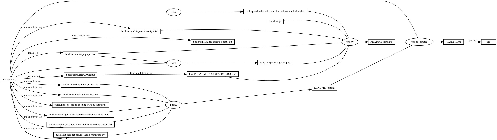

# minikube

<!-- markdownlint-disable MD007 MD030 -->

-   [minikube](#minikube)
-   [Mask SubCommands](#mask-subcommands)
    -   [docker-open](#docker-open)
    -   [minikube-addons-list](#minikube-addons-list)
        -   [minikube-addons-list-output](#minikube-addons-list-output)
    -   [minikube-start](#minikube-start)
    -   [kubectl-get-pods](#kubectl-get-pods)
    -   [kubectl-get-pods-kube-system](#kubectl-get-pods-kube-system)
        -   [kubectl-get-pods-kube-system-output](#kubectl-get-pods-kube-system-output)
    -   [kubectl-get-pods-kubernetes-dashboard](#kubectl-get-pods-kubernetes-dashboard)
        -   [kubectl-get-pods-kubernetes-dashboard-output](#kubectl-get-pods-kubernetes-dashboard-output)
    -   [minikube-dashboard](#minikube-dashboard)
    -   [kubectl-create-deployment-hello-minikube](#kubectl-create-deployment-hello-minikube)
    -   [kubectl-get-deployment-hello-minikube](#kubectl-get-deployment-hello-minikube)
        -   [kubectl-get-deployment-hello-minikube-output](#kubectl-get-deployment-hello-minikube-output)
    -   [kubectl-expose-deployment-hello-minikube](#kubectl-expose-deployment-hello-minikube)
    -   [kubectl-get-service-hello-minikube](#kubectl-get-service-hello-minikube)
        -   [kubectl-get-service-hello-minikube-output](#kubectl-get-service-hello-minikube-output)
    -   [minikube-service-hello-minikube](#minikube-service-hello-minikube)
    -   [kubectl-port-forward-service-hello-minikube](#kubectl-port-forward-service-hello-minikube)
    -   [kubectl-delete-services-hello-minikube](#kubectl-delete-services-hello-minikube)
    -   [kubectl-delete-deployment-hello-minikube](#kubectl-delete-deployment-hello-minikube)
    -   [minikube-help](#minikube-help)
        -   [minikube-help-output](#minikube-help-output)
    -   [begin: mask task in template : build
        content](#begin-mask-task-in-template--build-content)
    -   [ninja-rules](#ninja-rules)
        -   [ninja custom-rule](#ninja-custom-rule)
        -   [ninja-rules-output](#ninja-rules-output)
    -   [ninja-targets](#ninja-targets)
        -   [ninja build-all](#ninja-build-all)
        -   [ninja custom-build](#ninja-custom-build)
        -   [ninja report-build](#ninja-report-build)
        -   [ninja-targets-output](#ninja-targets-output)
    -   [readme-md](#readme-md)
        -   [ninja readme-build](#ninja-readme-build)
    -   [end: mask task in template : build
        content](#end-mask-task-in-template--build-content)
    -   [begin: mask task in template : ninja
        command](#begin-mask-task-in-template--ninja-command)
    -   [ninja-browse](#ninja-browse)
    -   [ninja-graph-png](#ninja-graph-png)
    -   [ninja-graph-dot-xdot](#ninja-graph-dot-xdot)
    -   [ninja-graph-dot](#ninja-graph-dot)
        -   [ninja-graph-dot-output](#ninja-graph-dot-output)
    -   [ninja-all](#ninja-all)
        -   [build.ninja](#buildninja)
    -   [end: mask task in template : ninja
        command](#end-mask-task-in-template--ninja-command)

<!-- markdownlint-enable MD007 MD030 -->

# Mask SubCommands

[Mask Awesome](https://github.com/huzhenghui/mask-awesome)

## docker-open

``` bash
open -a Docker
```

## minikube-addons-list

``` bash
minikube addons list | sed '1d;$d'
```

### minikube-addons-list-output

| ADDON NAME                  | PROFILE  | STATUS    |
|-----------------------------|----------|-----------|
| ambassador                  | minikube | disabled  |
| auto-pause                  | minikube | disabled  |
| csi-hostpath-driver         | minikube | disabled  |
| dashboard                   | minikube | enabled ✅ |
| default-storageclass        | minikube | enabled ✅ |
| efk                         | minikube | disabled  |
| freshpod                    | minikube | disabled  |
| gcp-auth                    | minikube | disabled  |
| gvisor                      | minikube | disabled  |
| helm-tiller                 | minikube | disabled  |
| ingress                     | minikube | disabled  |
| ingress-dns                 | minikube | disabled  |
| istio                       | minikube | disabled  |
| istio-provisioner           | minikube | disabled  |
| kubevirt                    | minikube | disabled  |
| logviewer                   | minikube | disabled  |
| metallb                     | minikube | disabled  |
| metrics-server              | minikube | disabled  |
| nvidia-driver-installer     | minikube | disabled  |
| nvidia-gpu-device-plugin    | minikube | disabled  |
| olm                         | minikube | disabled  |
| pod-security-policy         | minikube | disabled  |
| registry                    | minikube | disabled  |
| registry-aliases            | minikube | disabled  |
| registry-creds              | minikube | disabled  |
| storage-provisioner         | minikube | enabled ✅ |
| storage-provisioner-gluster | minikube | disabled  |
| volumesnapshots             | minikube | disabled  |

## minikube-start

``` bash
minikube start
```

## kubectl-get-pods

``` bash
kubectl get pods --all-namespaces
```

## kubectl-get-pods-kube-system

``` bash
kubectl get pods --namespace=kube-system
```

### kubectl-get-pods-kube-system-output

``` plain
NAME                               READY   STATUS    RESTARTS   AGE
coredns-f9fd979d6-4thkx            1/1     Running   2          5d16h
etcd-minikube                      1/1     Running   2          5d16h
kube-apiserver-minikube            1/1     Running   2          5d16h
kube-controller-manager-minikube   1/1     Running   2          5d16h
kube-proxy-vz6bh                   1/1     Running   2          5d16h
kube-scheduler-minikube            1/1     Running   2          5d16h
storage-provisioner                1/1     Running   11         5d16h
```

## kubectl-get-pods-kubernetes-dashboard

``` bash
kubectl get pods --namespace=kubernetes-dashboard
```

### kubectl-get-pods-kubernetes-dashboard-output

``` plain
NAME                                        READY   STATUS    RESTARTS   AGE
dashboard-metrics-scraper-f6647bd8c-czkbs   1/1     Running   2          5d16h
kubernetes-dashboard-968bcb79-jhfhh         1/1     Running   2          5d16h
```

## minikube-dashboard

``` bash
minikube dashboard
```

## kubectl-create-deployment-hello-minikube

``` bash
kubectl create deployment hello-minikube --image=k8s.gcr.io/echoserver:1.4
```

## kubectl-get-deployment-hello-minikube

``` bash
kubectl get deployment hello-minikube
```

### kubectl-get-deployment-hello-minikube-output

``` plain
NAME             READY   UP-TO-DATE   AVAILABLE   AGE
hello-minikube   1/1     1            1           64m
```

## kubectl-expose-deployment-hello-minikube

``` bash
kubectl expose deployment hello-minikube --type=NodePort --port=8080
```

## kubectl-get-service-hello-minikube

``` bash
kubectl get service hello-minikube
```

### kubectl-get-service-hello-minikube-output

``` plain
NAME             TYPE       CLUSTER-IP      EXTERNAL-IP   PORT(S)          AGE
hello-minikube   NodePort   10.108.82.144   <none>        8080:32018/TCP   63m
```

## minikube-service-hello-minikube

``` bash
minikube service hello-minikube
```

## kubectl-port-forward-service-hello-minikube

``` bash
kubectl port-forward service/hello-minikube 7080:8080
```

<http://localhost:7080/>

## kubectl-delete-services-hello-minikube

``` bash
kubectl delete services hello-minikube
```

## kubectl-delete-deployment-hello-minikube

``` bash
kubectl delete deployment hello-minikube
```

## minikube-help

``` bash
minikube --help
```

### minikube-help-output

<!-- markdownlint-disable MD013 -->

``` plain
minikube provisions and manages local Kubernetes clusters optimized for development workflows.

Basic Commands:
  start          Starts a local Kubernetes cluster
  status         Gets the status of a local Kubernetes cluster
  stop           Stops a running local Kubernetes cluster
  delete         Deletes a local Kubernetes cluster
  dashboard      Access the Kubernetes dashboard running within the minikube cluster
  pause          pause Kubernetes
  unpause        恢复 Kubernetes

Images Commands:
  docker-env     配置环境以使用 minikube's Docker daemon
  podman-env     配置环境以使用 minikube's Podman service
  cache          Add, delete, or push a local image into minikube
  image          Load a local image into minikube

Configuration and Management Commands:
  addons         Enable or disable a minikube addon
  config         Modify persistent configuration values
  profile        Get or list the current profiles (clusters)
  update-context Update kubeconfig in case of an IP or port change

Networking and Connectivity Commands:
  service        Returns a URL to connect to a service
  tunnel         连接到 LoadBalancer 服务

Advanced Commands:
  mount          将指定的目录挂载到 minikube
  ssh            Log into the minikube environment (for debugging)
  kubectl        Run a kubectl binary matching the cluster version
  node           Add, remove, or list additional nodes

Troubleshooting Commands:
  ssh-key        Retrieve the ssh identity key path of the specified node
  ssh-host       Retrieve the ssh host key of the specified node
  ip             Retrieves the IP address of the specified node
  logs           Returns logs to debug a local Kubernetes cluster
  update-check   打印当前和最新版本版本
  version        打印 minikube 版本

Other Commands:
  completion     Generate command completion for a shell

Use "minikube <command> --help" for more information about a given command.
```

<!-- markdownlint-enable MD013 -->

## begin: mask task in template : build content

## ninja-rules

``` bash
ninja -t rules
```

### ninja custom-rule

``` ninja
# custom rule here

```

### ninja-rules-output

``` plain
cmdshelf-repository
copy_alternate
dot
ghq
github-markdown-toc
mask
mask-man-markdown
mask-screenshot
mask-stderr-tee
mask-stdout-csv-markdown
mask-stdout-json
mask-stdout-tee
mask-tee
pandocomatic
phony
```

## ninja-targets

``` bash
ninja -t targets all
```

### ninja build-all

``` ninja
build all: phony README.md

default all

```

### ninja custom-build

``` ninja
# custom build here

```

### ninja report-build

``` ninja
# report build here

```

### ninja-targets-output

``` plain
all: phony
build/pandoc-lua-filters/include-files/include-files.lua: ghq
build/ninja/ninja-rules-output.txt: mask-stdout-tee
build/ninja/ninja-targets-output.txt: mask-stdout-tee
build/ninja/ninja.graph.dot: mask-tee
build/ninja/ninja.graph.png: mask
build/temp/README.md: copy_alternate
build/README.TOC/README.TOC.md: github-markdown-toc
README-template: phony
build/minikube-addons-list.md: mask-stdout-tee
build/kubectl-get-pods-kube-system-output.txt: mask-stdout-tee
build/kubectl-get-pods-kubernetes-dashboard-output.txt: mask-stdout-tee
build/kubectl-get-deployment-hello-minikube-output.txt: mask-stdout-tee
build/kubectl-get-service-hello-minikube.txt: mask-stdout-tee
build/minikube-help-output.txt: mask-stdout-tee
README-custom: phony
README.md: pandocomatic
```

## readme-md

``` bash
ninja --verbose README.md
```

### ninja readme-build

``` ninja
build ./build/minikube-addons-list.md : mask-stdout-tee ./maskfile.md
  mask_subcommand = minikube-addons-list

build ./build/kubectl-get-pods-kube-system-output.txt : mask-stdout-tee ./maskfile.md
  mask_subcommand = kubectl-get-pods-kube-system

# <!-- markdownlint-disable MD013 -->
build ./build/kubectl-get-pods-kubernetes-dashboard-output.txt : mask-stdout-tee ./maskfile.md
  mask_subcommand = kubectl-get-pods-kubernetes-dashboard

build ./build/kubectl-get-deployment-hello-minikube-output.txt : mask-stdout-tee ./maskfile.md
  mask_subcommand = kubectl-get-deployment-hello-minikube
# <!-- markdownlint-enable MD013 -->

build ./build/kubectl-get-service-hello-minikube.txt : mask-stdout-tee ./maskfile.md
  mask_subcommand = kubectl-get-service-hello-minikube

build ./build/minikube-help-output.txt : mask-stdout-tee ./maskfile.md
  mask_subcommand = minikube-help

build README-custom : phony $
  ./build/minikube-addons-list.md $
  ./build/kubectl-get-pods-kube-system-output.txt $
  ./build/kubectl-get-pods-kubernetes-dashboard-output.txt $
  ./build/kubectl-get-deployment-hello-minikube-output.txt $
  ./build/kubectl-get-service-hello-minikube.txt $
  ./build/minikube-help-output.txt

```

``` ninja
build README.md : pandocomatic maskfile.md | README-template README-custom

```

## end: mask task in template : build content

## begin: mask task in template : ninja command

## ninja-browse

``` bash
ninja -t browse
```

## ninja-graph-png

``` bash
dot -Tpng -o./build/ninja/ninja.graph.png ./build/ninja/ninja.graph.dot
```



## ninja-graph-dot-xdot

``` bash
detach -- xdot "${MASKFILE_DIR}/build/ninja/ninja.graph.dot"
```

## ninja-graph-dot

``` bash
ninja -t graph
```

### ninja-graph-dot-output

``` dot
digraph ninja {
rankdir="LR"
node [fontsize=10, shape=box, height=0.25]
edge [fontsize=10]
"0x7fe7a0f057f0" [label="all"]
"0x7fe7a0f05870" -> "0x7fe7a0f057f0" [label=" phony"]
"0x7fe7a0f05870" [label="README.md"]
"0x7fe7a0f07b40" [label="pandocomatic", shape=ellipse]
"0x7fe7a0f07b40" -> "0x7fe7a0f05870"
"0x7fe7a0f06090" -> "0x7fe7a0f07b40" [arrowhead=none]
"0x7fe7a0f06db0" -> "0x7fe7a0f07b40" [arrowhead=none]
"0x7fe7a0f07a00" -> "0x7fe7a0f07b40" [arrowhead=none]
"0x7fe7a0f06090" [label="maskfile.md"]
"0x7fe7a0f06db0" [label="README-template"]
"0x7fe7a0f06b00" [label="phony", shape=ellipse]
"0x7fe7a0f06b00" -> "0x7fe7a0f06db0"
"0x7fe7a0f05dd0" -> "0x7fe7a0f06b00" [arrowhead=none]
"0x7fe7a0f06e10" -> "0x7fe7a0f06b00" [arrowhead=none]
"0x7fe7a0f05fd0" -> "0x7fe7a0f06b00" [arrowhead=none]
"0x7fe7a0f06210" -> "0x7fe7a0f06b00" [arrowhead=none]
"0x7fe7a0f06470" -> "0x7fe7a0f06b00" [arrowhead=none]
"0x7fe7a0f066b0" -> "0x7fe7a0f06b00" [arrowhead=none]
"0x7fe7a0f06970" -> "0x7fe7a0f06b00" [arrowhead=none]
"0x7fe7a0f05dd0" [label="build/pandoc-lua-filters/include-files/include-files.lua"]
"0x7fe7a0f05d60" [label="ghq", shape=ellipse]
"0x7fe7a0f05d60" -> "0x7fe7a0f05dd0"
"0x7fe7a0f06e10" [label="build.ninja"]
"0x7fe7a0f05fd0" [label="build/ninja/ninja-rules-output.txt"]
"0x7fe7a0f06090" -> "0x7fe7a0f05fd0" [label=" mask-stdout-tee"]
"0x7fe7a0f06210" [label="build/ninja/ninja-targets-output.txt"]
"0x7fe7a0f06090" -> "0x7fe7a0f06210" [label=" mask-stdout-tee"]
"0x7fe7a0f06470" [label="build/ninja/ninja.graph.dot"]
"0x7fe7a0f06090" -> "0x7fe7a0f06470" [label=" mask-tee"]
"0x7fe7a0f066b0" [label="build/ninja/ninja.graph.png"]
"0x7fe7a0f06610" [label="mask", shape=ellipse]
"0x7fe7a0f06610" -> "0x7fe7a0f066b0"
"0x7fe7a0f06090" -> "0x7fe7a0f06610" [arrowhead=none]
"0x7fe7a0f06470" -> "0x7fe7a0f06610" [arrowhead=none]
"0x7fe7a0f06970" [label="build/README.TOC/README.TOC.md"]
"0x7fe7a0f06800" -> "0x7fe7a0f06970" [label=" github-markdown-toc"]
"0x7fe7a0f06800" [label="build/temp/README.md"]
"0x7fe7a0f06090" -> "0x7fe7a0f06800" [label=" copy_alternate"]
"0x7fe7a0f07a00" [label="README-custom"]
"0x7fe7a0f07910" [label="phony", shape=ellipse]
"0x7fe7a0f07910" -> "0x7fe7a0f07a00"
"0x7fe7a0f06bf0" -> "0x7fe7a0f07910" [arrowhead=none]
"0x7fe7a0f07050" -> "0x7fe7a0f07910" [arrowhead=none]
"0x7fe7a0f07250" -> "0x7fe7a0f07910" [arrowhead=none]
"0x7fe7a0f074c0" -> "0x7fe7a0f07910" [arrowhead=none]
"0x7fe7a0f076e0" -> "0x7fe7a0f07910" [arrowhead=none]
"0x7fe7a0f07860" -> "0x7fe7a0f07910" [arrowhead=none]
"0x7fe7a0f06bf0" [label="build/minikube-addons-list.md"]
"0x7fe7a0f06090" -> "0x7fe7a0f06bf0" [label=" mask-stdout-tee"]
"0x7fe7a0f07050" [label="build/kubectl-get-pods-kube-system-output.txt"]
"0x7fe7a0f06090" -> "0x7fe7a0f07050" [label=" mask-stdout-tee"]
"0x7fe7a0f07250" [label="build/kubectl-get-pods-kubernetes-dashboard-output.txt"]
"0x7fe7a0f06090" -> "0x7fe7a0f07250" [label=" mask-stdout-tee"]
"0x7fe7a0f074c0" [label="build/kubectl-get-deployment-hello-minikube-output.txt"]
"0x7fe7a0f06090" -> "0x7fe7a0f074c0" [label=" mask-stdout-tee"]
"0x7fe7a0f076e0" [label="build/kubectl-get-service-hello-minikube.txt"]
"0x7fe7a0f06090" -> "0x7fe7a0f076e0" [label=" mask-stdout-tee"]
"0x7fe7a0f07860" [label="build/minikube-help-output.txt"]
"0x7fe7a0f06090" -> "0x7fe7a0f07860" [label=" mask-stdout-tee"]
}
```



## ninja-all

``` bash
ninja --verbose
```

### build.ninja

``` ninja
builddir=./build
mask_subcommand = --help
mask_stdout_csv_markdowndelimiter = ","

#######################################
# begin: rule in template

rule mask
  command = mask --maskfile $in $mask_subcommand

rule mask-tee
  command = mask --maskfile $in $mask_subcommand 2>&1 | tee $out 1> /dev/null

rule mask-stdout-tee
  command = mask --maskfile $in $mask_subcommand 2>/dev/null | tee $out 1> /dev/null

rule mask-stderr-tee
  command = bash -c 'mask $mask_subcommand 1>/dev/null 2> >(tee $out)' || echo $$?

# <!-- markdownlint-disable MD013 -->
rule mask-man-markdown
  command = set -e && set -o pipefail && $
    mask --maskfile $in $mask_subcommand | $
    ul | $
    ansifilter --bbcode | $
    inv --search-root="$$(ghq list --full-path https://github.com/huzhenghui/pyinvoke-awesome)/bbcode" bbcode-parser-format | $
    pandoc --from=html --to=markdown | $
    tee $out 1> /dev/null
# <!-- markdownlint-enable MD013 -->

rule mask-stdout-csv-markdown
  command = mask --maskfile $in $mask_subcommand 2>/dev/null | $
    csvtomd --delimiter "$$(echo $mask_stdout_csv_markdowndelimiter)" | $
    tee $out 1> /dev/null

rule mask-stdout-json
  command = mask --maskfile $in $mask_subcommand 2>/dev/null | $
    jq | $
    tee $out 1> /dev/null

rule mask-screenshot
  command = $
    regular_logfile="./build/temp/$$(basename $out).mask-screenshot.logfile" && $
    rm -f -v "$${regular_logfile}" && $
    until [[ -s "$${regular_logfile}" ]]; do $
      screen_logfile="$$(mktemp -d)/logfile"; $
      echo "$${screen_logfile}"; $
      mkfifo "$${screen_logfile}"; $
      screen -L -Logfile "$${screen_logfile}" $
        -dmS mask-screenshot-"$$(basename $out)" $
        sh -c "stdbuf -o0 mask --maskfile $in $mask_subcommand; $
          date +'%F %T %Z %z - %+ https://github.com/huzhenghui' | lolcat;"; $
      dd bs=1 if="$${screen_logfile}" of="$${regular_logfile}"; $
    done && $
    ansifilter --html --encoding=utf8 --input="$${regular_logfile}" | $
      tee ./build/temp/"$$(basename $out)".mask-screenshot.html | $
      wkhtmltoimage --format png - "$out"

rule pandocomatic
  command = pandocomatic --input $in --output $out

rule github-markdown-toc
  command = gh-md-toc --hide-header --hide-footer --no-escape $in > $out

rule copy_alternate
  command = if [[ -f "$alternate" ]]; $
    then $
      cp "$alternate" "$out"; $
    else $
      cp "$in" "$out"; $
    fi;

rule dot
  command = dot -Tpng -o$out $in

rule ghq
  command = ghq get --update "$repository" && $
    find -d "$link_dirname" -exec rmdir {} \; && $
    ln -Fs "$$(ghq list --full-path $repository)" "$link_dirname"
  generator = 1

rule cmdshelf-repository
  command = $$( $
    cmdshelf remote list | ack "^$cmdshelf_name" 1>&2 || $
    cmdshelf remote add "$cmdshelf_name" "$cmdshelf_url" 1>&2 $
    ) && $
    repository_path="$$(realpath $${HOME}/.cmdshelf/remote/$cmdshelf_name)" && $
    echo "$${repository_path}" && $
    stub_path="$$(realpath ./build/$cmdshelf_name)" && $
    echo "$${stub_path}" && $
    find -d "$${stub_path}" -exec rmdir {} \; && $
    ln -Fs "$${repository_path}" "$${stub_path}"
  generator = 1

# end: rule in template
#######################################

#######################################
# start snippet custom-rule

# custom rule here

# end snippet custom-rule
#######################################

#######################################
# start snippet build-all

build all: phony README.md

default all

# end snippet build-all
#######################################

#######################################
# start snippet custom-build

# custom build here

# end snippet custom-build
#######################################

#######################################
# start snippet report-build

# report build here

# end snippet report-build
#######################################

#######################################
# begin: readme-build in template

# ninja will create ./build/pandoc-lua-filters/include-files/ automatically
build ./build/pandoc-lua-filters/include-files/include-files.lua : ghq
  repository = https://github.com/pandoc/lua-filters
  link_dirname = ./build/pandoc-lua-filters

build ./build/ninja/ninja-rules-output.txt : mask-stdout-tee ./maskfile.md
  mask_subcommand = ninja-rules

build ./build/ninja/ninja-targets-output.txt : mask-stdout-tee ./maskfile.md
  mask_subcommand = ninja-targets

build ./build/ninja/ninja.graph.dot : mask-tee ./maskfile.md
  mask_subcommand = ninja-graph-dot

build ./build/ninja/ninja.graph.png : mask ./maskfile.md | ./build/ninja/ninja.graph.dot
  mask_subcommand = ninja-graph-png

build ./build/temp/README.md : copy_alternate ./maskfile.md
  alternate = ./README.md

build ./build/README.TOC/README.TOC.md : github-markdown-toc ./build/temp/README.md

build README-template : phony $
  ./build/pandoc-lua-filters/include-files/include-files.lua $
  ./build.ninja $
  ./build/ninja/ninja-rules-output.txt $
  ./build/ninja/ninja-targets-output.txt $
  ./build/ninja/ninja.graph.dot $
  ./build/ninja/ninja.graph.png $
  ./build/README.TOC/README.TOC.md $

# end: readme-build in template
#######################################

#######################################
# start snippet custom-readme-build

build ./build/minikube-addons-list.md : mask-stdout-tee ./maskfile.md
  mask_subcommand = minikube-addons-list

build ./build/kubectl-get-pods-kube-system-output.txt : mask-stdout-tee ./maskfile.md
  mask_subcommand = kubectl-get-pods-kube-system

# <!-- markdownlint-disable MD013 -->
build ./build/kubectl-get-pods-kubernetes-dashboard-output.txt : mask-stdout-tee ./maskfile.md
  mask_subcommand = kubectl-get-pods-kubernetes-dashboard

build ./build/kubectl-get-deployment-hello-minikube-output.txt : mask-stdout-tee ./maskfile.md
  mask_subcommand = kubectl-get-deployment-hello-minikube
# <!-- markdownlint-enable MD013 -->

build ./build/kubectl-get-service-hello-minikube.txt : mask-stdout-tee ./maskfile.md
  mask_subcommand = kubectl-get-service-hello-minikube

build ./build/minikube-help-output.txt : mask-stdout-tee ./maskfile.md
  mask_subcommand = minikube-help

build README-custom : phony $
  ./build/minikube-addons-list.md $
  ./build/kubectl-get-pods-kube-system-output.txt $
  ./build/kubectl-get-pods-kubernetes-dashboard-output.txt $
  ./build/kubectl-get-deployment-hello-minikube-output.txt $
  ./build/kubectl-get-service-hello-minikube.txt $
  ./build/minikube-help-output.txt

# end snippet custom-readme-build
#######################################

#######################################
# $ followed by a newline
# escape the newline (continue the current line across a line break).
# start snippet readme-build

build README.md : pandocomatic maskfile.md | README-template README-custom

# end snippet readme-build
#######################################
```

## end: mask task in template : ninja command
