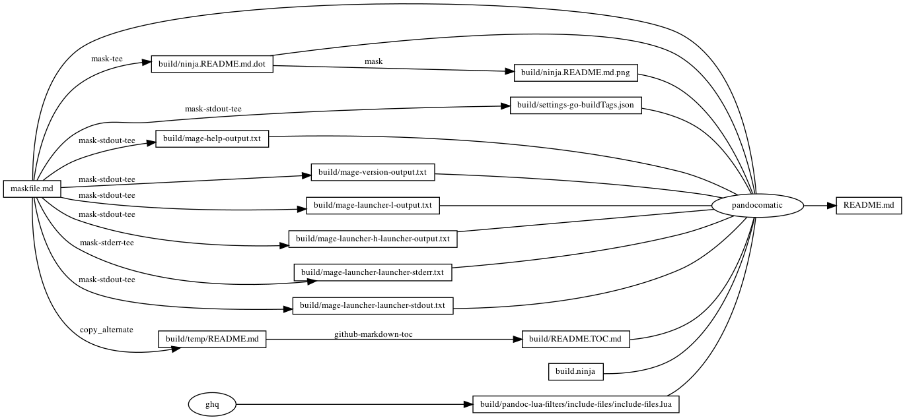

# mage

<!-- markdownlint-disable MD007 MD030 -->

-   [mage](#mage)
-   [Mask SubCommands](#mask-subcommands)
    -   [Begin: Prepare Steps](#begin-prepare-steps)
    -   [get-mage](#get-mage)
    -   [settings-go-buildTags](#settings-go-buildtags)
        -   [settings-go-buildTags.json](#settings-go-buildtagsjson)
    -   [End: Prepare Steps](#end-prepare-steps)
    -   [mage-help](#mage-help)
        -   [mage-help-output](#mage-help-output)
    -   [mage-version](#mage-version)
        -   [mage-version-output](#mage-version-output)
    -   [mage-launcher-l](#mage-launcher-l)
        -   [mage-launcher-l-output](#mage-launcher-l-output)
    -   [mage-launcher-h-launcher](#mage-launcher-h-launcher)
        -   [mage-launcher-h-launcher-output](#mage-launcher-h-launcher-output)
    -   [mage-launcher-launcher](#mage-launcher-launcher)
        -   [mage-launcher-launcher-output](#mage-launcher-launcher-output)
        -   [mage-launcher-launcher-Hello](#mage-launcher-launcher-hello)
        -   [mage-launcher-launcher-statik](#mage-launcher-launcher-statik)
        -   [launcher/magefile.go](#launchermagefilego)
        -   [launcher/main.go](#launchermaingo)
        -   [read/magefile.go](#readmagefilego)
        -   [read/main.go](#readmaingo)
        -   [read/mage\_output\_file.go](#readmage_output_filego)
    -   [begin: mask task in template](#begin-mask-task-in-template)
    -   [readme](#readme)
        -   [build.ninja](#buildninja)
        -   [ninja custom-rule](#ninja-custom-rule)
        -   [ninja custom-build](#ninja-custom-build)
    -   [readme-graph-dot](#readme-graph-dot)
        -   [readme-graph-dot-output](#readme-graph-dot-output)
    -   [readme-graph-dot-xdot](#readme-graph-dot-xdot)
    -   [readme-graph-png](#readme-graph-png)
    -   [end: mask task in template](#end-mask-task-in-template)

<!-- markdownlint-enable MD007 MD030 -->

# Mask SubCommands

[Mask Awesome](https://github.com/huzhenghui/mask-awesome)

## Begin: Prepare Steps

## get-mage

``` bash
go get github.com/magefile/mage/mg
```

## settings-go-buildTags

> Set go.buildTags equal 'mage' in settings.json of Visual Studio Code

``` bash
json5 "$(git root)/.vscode/settings.json" | jq 'with_entries(select(.key == "go.buildTags"))'
```

### settings-go-buildTags.json

``` json
{
  "go.buildTags": "mage"
}
```

## End: Prepare Steps

## mage-help

``` bash
mage --help
```

### mage-help-output

<!-- markdownlint-disable MD010 MD013 -->

``` plain
mage [options] [target]

Mage is a make-like command runner.  See https://magefile.org for full docs.

Commands:
  -clean    clean out old generated binaries from CACHE_DIR
  -compile <string>
            output a static binary to the given path
  -h        show this help
  -init     create a starting template if no mage files exist
  -l        list mage targets in this directory
  -version  show version info for the mage binary

Options:
  -d <string> 
            directory to read magefiles from (default ".")
  -debug    turn on debug messages
  -f        force recreation of compiled magefile
  -goarch   sets the GOARCH for the binary created by -compile (default: current arch)
  -gocmd <string>
		    use the given go binary to compile the output (default: "go")
  -goos     sets the GOOS for the binary created by -compile (default: current OS)
  -ldflags  sets the ldflags for the binary created by -compile (default: "")
  -h        show description of a target
  -keep     keep intermediate mage files around after running
  -t <string>
            timeout in duration parsable format (e.g. 5m30s)
  -v        show verbose output when running mage targets
  -w <string>
            working directory where magefiles will run (default -d value)
```

<!-- markdownlint-enable MD010 MD013 -->

## mage-version

``` bash
mage --version
```

### mage-version-output

``` plain
Mage Build Tool 1.11.0
Build Date: 2020-12-29
Commit: 07afc7d
built with: go1.15.6
```

## mage-launcher-l

``` bash
go get "github.com/magefile/mage"
mage -d "${MASKFILE_DIR}/launcher" -l
```

### mage-launcher-l-output

``` plain
Targets:
  launcher    
```

## mage-launcher-h-launcher

``` bash
go get "github.com/magefile/mage"
mage -d "${MASKFILE_DIR}/launcher" -h launcher
```

### mage-launcher-h-launcher-output

<!-- markdownlint-disable MD010 -->

``` plain
Usage:

	mage launcher

```

<!-- markdownlint-enable MD010 -->

## mage-launcher-launcher

``` bash
go get "github.com/magefile/mage"
mage -d "${MASKFILE_DIR}/launcher" -v -keep launcher
```

### mage-launcher-launcher-output

``` plain
Running target: Launcher
exec: go get github.com/rakyll/statik/fs
38
exec: statik -src ../FS -dest ../ -f -m -include Hello.txt
exec: mage -d ../read -v -keep read
Running target: Read
```

### mage-launcher-launcher-Hello

``` plain
Hello, World!2021-01-04T17:22:34+08:00
```

### mage-launcher-launcher-statik

> <https://golang.org/doc/effective_go.html#formatting>
>
> > Indentation
> >
> > > We use tabs for indentation and `gofmt` emits them by default. Use
> > > spaces only if you must.

<!-- markdownlint-disable MD010 MD013 -->

``` go
// Code generated by statik. DO NOT EDIT.

package statik

import (
	"github.com/rakyll/statik/fs"
)


func init() {
	data := "PK\x03\x04\x14\x00\x08\x00\x08\x00\x00\x00!(\x00\x00\x00\x00\x00\x00\x00\x00\x00\x00\x00\x00	\x00	\x00Hello.txtUT\x05\x00\x01\x80Cm8\xf2H\xcd\xc9\xc9\xd7Q\x08\xcf/\xcaIQ4202\xd450\xd450	14\xb722\xb226\xd16\xb0\xb020\x00\x04\x00\x00\xff\xffPK\x07\x08\x8a_\xe2O,\x00\x00\x00&\x00\x00\x00PK\x01\x02\x14\x03\x14\x00\x08\x00\x08\x00\x00\x00!(\x8a_\xe2O,\x00\x00\x00&\x00\x00\x00	\x00	\x00\x00\x00\x00\x00\x00\x00\x00\x00\xa4\x81\x00\x00\x00\x00Hello.txtUT\x05\x00\x01\x80Cm8PK\x05\x06\x00\x00\x00\x00\x01\x00\x01\x00@\x00\x00\x00l\x00\x00\x00\x00\x00"
		fs.Register(data)
	}
	
```

<!-- markdownlint-enable MD010 MD013 -->

### launcher/magefile.go

> <https://golang.org/doc/effective_go.html#formatting>
>
> > Indentation
> >
> > > We use tabs for indentation and `gofmt` emits them by default. Use
> > > spaces only if you must.

<!-- markdownlint-disable MD010 -->

``` go
//+build mage

package main

import (
	"io"
	"log"
	"os"
	"time"

	"github.com/magefile/mage/sh"
)

func Launcher() error {
	var err error
	err = sh.Run("go", "get", "github.com/rakyll/statik/fs")
	if err != nil {
		log.Fatal(err)
		return err
	}
	filename := "../FS/Hello.txt"
	_, err = os.Stat(filename)
	var f *os.File
	if os.IsNotExist(err) {
		f, err = os.Create(filename)
		if err != nil {
			log.Fatal(err)
			return err
		}
	} else {
		f, err = os.OpenFile(filename, os.O_WRONLY, 0444)
		if err != nil {
			log.Fatal(err)
			return err
		}
	}
	var n int
	n, err = io.WriteString(f, "Hello, World!"+time.Now().Format(time.RFC3339))

	if err != nil {
		log.Fatal(err)
	} else {
		log.Println(n)
	}
	f.Sync()
	f.Close()
	err = sh.Run(
		"statik",
		"-src", "../FS",
		"-dest", "../",
		"-f",
		"-m",
		"-include", "Hello.txt",
	)
	if err != nil {
		log.Fatal(err)
		return err
	}
	err = sh.Run("mage", "-d", "../read", "-v", "-keep", "read")
	return nil
}
```

<!-- markdownlint-enable MD010 -->

### launcher/main.go

> Fake main `func` to avoid warning in Visual Studio Code

``` go
package main

func main() {

}
```

### read/magefile.go

> <https://golang.org/doc/effective_go.html#formatting>
>
> > Indentation
> >
> > > We use tabs for indentation and `gofmt` emits them by default. Use
> > > spaces only if you must.

<!-- markdownlint-disable MD010 -->

``` go
//+build mage

package main

import (
	"fmt"
	"io/ioutil"
	"log"

	_ "../statik"
	"github.com/rakyll/statik/fs"
)

func Read() error {
	statikFS, err := fs.New()
	if err != nil {
		log.Fatal(err)
	}
	r, err := statikFS.Open("/Hello.txt")
	if err != nil {
		log.Fatal(err)
	}
	defer r.Close()
	contents, err := ioutil.ReadAll(r)
	if err != nil {
		log.Fatal(err)
	}
	fmt.Println(string(contents))
	return nil
}
```

<!-- markdownlint-enable MD010 -->

### read/main.go

> Fake main `func` to avoid warning in Visual Studio Code

``` go
package main

func main() {

}
```

### read/mage\_output\_file.go

> <https://golang.org/doc/effective_go.html#formatting>
>
> > Indentation
> >
> > > We use tabs for indentation and `gofmt` emits them by default. Use
> > > spaces only if you must.

<!-- markdownlint-disable MD010 MD013 -->

``` go
// +build ignore

package main

import (
	"context"
	"flag"
	"fmt"
	"io/ioutil"
	"log"
	"os"
	"path/filepath"
	"sort"
	"strconv"
	"strings"
	"text/tabwriter"
	"time"
	
)

func main() {
	// Use local types and functions in order to avoid name conflicts with additional magefiles.
	type arguments struct {
		Verbose       bool          // print out log statements
		List          bool          // print out a list of targets
		Help          bool          // print out help for a specific target
		Timeout       time.Duration // set a timeout to running the targets
		Args          []string      // args contain the non-flag command-line arguments
	}

	parseBool := func(env string) bool {
		val := os.Getenv(env)
		if val == "" {
			return false
		}		
		b, err := strconv.ParseBool(val)
		if err != nil {
			log.Printf("warning: environment variable %s is not a valid bool value: %v", env, val)
			return false
		}
		return b
	}

	parseDuration := func(env string) time.Duration {
		val := os.Getenv(env)
		if val == "" {
			return 0
		}		
		d, err := time.ParseDuration(val)
		if err != nil {
			log.Printf("warning: environment variable %s is not a valid duration value: %v", env, val)
			return 0
		}
		return d
	}
	args := arguments{}
	fs := flag.FlagSet{}
	fs.SetOutput(os.Stdout)

	// default flag set with ExitOnError and auto generated PrintDefaults should be sufficient
	fs.BoolVar(&args.Verbose, "v", parseBool("MAGEFILE_VERBOSE"), "show verbose output when running targets")
	fs.BoolVar(&args.List, "l", parseBool("MAGEFILE_LIST"), "list targets for this binary")
	fs.BoolVar(&args.Help, "h", parseBool("MAGEFILE_HELP"), "print out help for a specific target")
	fs.DurationVar(&args.Timeout, "t", parseDuration("MAGEFILE_TIMEOUT"), "timeout in duration parsable format (e.g. 5m30s)")
	fs.Usage = func() {
		fmt.Fprintf(os.Stdout, `
%s [options] [target]

Commands:
  -l    list targets in this binary
  -h    show this help

Options:
  -h    show description of a target
  -t <string>
        timeout in duration parsable format (e.g. 5m30s)
  -v    show verbose output when running targets
 `[1:], filepath.Base(os.Args[0]))
	}
	if err := fs.Parse(os.Args[1:]); err != nil {
		// flag will have printed out an error already.
		return
	}
	args.Args = fs.Args()
	if args.Help && len(args.Args) == 0 {
		fs.Usage()
		return
	}
		
	// color is ANSI color type
	type color int

	// If you add/change/remove any items in this constant,
	// you will need to run "stringer -type=color" in this directory again.
	// NOTE: Please keep the list in an alphabetical order.
	const (
		black color = iota
		red
		green
		yellow
		blue
		magenta
		cyan
		white
		brightblack
		brightred
		brightgreen
		brightyellow
		brightblue
		brightmagenta
		brightcyan
		brightwhite
	)

	// AnsiColor are ANSI color codes for supported terminal colors.
	var ansiColor = map[color]string{
		black:         "\u001b[30m",
		red:           "\u001b[31m",
		green:         "\u001b[32m",
		yellow:        "\u001b[33m",
		blue:          "\u001b[34m",
		magenta:       "\u001b[35m",
		cyan:          "\u001b[36m",
		white:         "\u001b[37m",
		brightblack:   "\u001b[30;1m",
		brightred:     "\u001b[31;1m",
		brightgreen:   "\u001b[32;1m",
		brightyellow:  "\u001b[33;1m",
		brightblue:    "\u001b[34;1m",
		brightmagenta: "\u001b[35;1m",
		brightcyan:    "\u001b[36;1m",
		brightwhite:   "\u001b[37;1m",
	}
	
	const _color_name = "blackredgreenyellowbluemagentacyanwhitebrightblackbrightredbrightgreenbrightyellowbrightbluebrightmagentabrightcyanbrightwhite"

	var _color_index = [...]uint8{0, 5, 8, 13, 19, 23, 30, 34, 39, 50, 59, 70, 82, 92, 105, 115, 126}

	colorToLowerString := func (i color) string {
		if i < 0 || i >= color(len(_color_index)-1) {
			return "color(" + strconv.FormatInt(int64(i), 10) + ")"
		}
		return _color_name[_color_index[i]:_color_index[i+1]]
	}

	// ansiColorReset is an ANSI color code to reset the terminal color.
	const ansiColorReset = "\033[0m"

	// defaultTargetAnsiColor is a default ANSI color for colorizing targets.
	// It is set to Cyan as an arbitrary color, because it has a neutral meaning
	var defaultTargetAnsiColor = ansiColor[cyan]

	getAnsiColor := func(color string) (string, bool) {
		colorLower := strings.ToLower(color)
		for k, v := range ansiColor {
			colorConstLower := colorToLowerString(k)
			if colorConstLower == colorLower {
				return v, true
			}
		}
		return "", false
	}

	// Terminals which  don't support color:
	// 	TERM=vt100
	// 	TERM=cygwin
	// 	TERM=xterm-mono
    var noColorTerms = map[string]bool{
		"vt100":      false,
		"cygwin":     false,
		"xterm-mono": false,
	}

	// terminalSupportsColor checks if the current console supports color output
	//
	// Supported:
	// 	linux, mac, or windows's ConEmu, Cmder, putty, git-bash.exe, pwsh.exe
	// Not supported:
	// 	windows cmd.exe, powerShell.exe
	terminalSupportsColor := func() bool {
		envTerm := os.Getenv("TERM")
		if _, ok := noColorTerms[envTerm]; ok {
			return false
		}
		return true
	}

	// enableColor reports whether the user has requested to enable a color output.
	enableColor := func() bool {
		b, _ := strconv.ParseBool(os.Getenv("MAGEFILE_ENABLE_COLOR"))
		return b
	}

	// targetColor returns the ANSI color which should be used to colorize targets.
	targetColor := func() string {
		s, exists := os.LookupEnv("MAGEFILE_TARGET_COLOR")
		if exists == true {
			if c, ok := getAnsiColor(s); ok == true {
				return c
			}
		}
		return defaultTargetAnsiColor
	}

	// store the color terminal variables, so that the detection isn't repeated for each target
	var enableColorValue = enableColor() && terminalSupportsColor()
	var targetColorValue = targetColor()

	printName := func(str string) string {
		if enableColorValue {
			return fmt.Sprintf("%s%s%s", targetColorValue, str, ansiColorReset)
		} else {
			return str
		}
	}

	list := func() error {
		
		targets := map[string]string{
			"read": "",
		}

		keys := make([]string, 0, len(targets))
		for name := range targets {
			keys = append(keys, name)
		}
		sort.Strings(keys)

		fmt.Println("Targets:")
		w := tabwriter.NewWriter(os.Stdout, 0, 4, 4, ' ', 0)
		for _, name := range keys {
			fmt.Fprintf(w, "  %v\t%v\n", printName(name), targets[name])
		}
		err := w.Flush()
		return err
	}

	var ctx context.Context
	var ctxCancel func()

	getContext := func() (context.Context, func()) {
		if ctx != nil {
			return ctx, ctxCancel
		}

		if args.Timeout != 0 {
			ctx, ctxCancel = context.WithTimeout(context.Background(), args.Timeout)
		} else {
			ctx = context.Background()
			ctxCancel = func() {}
		}
		return ctx, ctxCancel
	}

	runTarget := func(fn func(context.Context) error) interface{} {
		var err interface{}
		ctx, cancel := getContext()
		d := make(chan interface{})
		go func() {
			defer func() {
				err := recover()
				d <- err
			}()
			err := fn(ctx)
			d <- err
		}()
		select {
		case <-ctx.Done():
			cancel()
			e := ctx.Err()
			fmt.Printf("ctx err: %v\n", e)
			return e
		case err = <-d:
			cancel()
			return err
		}
	}
	// This is necessary in case there aren't any targets, to avoid an unused
	// variable error.
	_ = runTarget

	handleError := func(logger *log.Logger, err interface{}) {
		if err != nil {
			logger.Printf("Error: %+v\n", err)
			type code interface {
				ExitStatus() int
			}
			if c, ok := err.(code); ok {
				os.Exit(c.ExitStatus())
			}
			os.Exit(1)
		}
	}
	_ = handleError

	// Set MAGEFILE_VERBOSE so mg.Verbose() reflects the flag value.
	if args.Verbose {
		os.Setenv("MAGEFILE_VERBOSE", "1")
	} else {
		os.Setenv("MAGEFILE_VERBOSE", "0")
	}

	log.SetFlags(0)
	if !args.Verbose {
		log.SetOutput(ioutil.Discard)
	}
	logger := log.New(os.Stderr, "", 0)
	if args.List {
		if err := list(); err != nil {
			log.Println(err)
			os.Exit(1)
		}
		return
	}

	if args.Help {
		if len(args.Args) < 1 {
			logger.Println("no target specified")
			os.Exit(2)
		}
		switch strings.ToLower(args.Args[0]) {
			case "read":
				
				fmt.Print("Usage:\n\n\tmage read\n\n")
				var aliases []string
				if len(aliases) > 0 {
					fmt.Printf("Aliases: %s\n\n", strings.Join(aliases, ", "))
				}
				return
			
			default:
				logger.Printf("Unknown target: %q\n", args.Args[0])
				os.Exit(2)
		}
	}
	if len(args.Args) < 1 {
		if err := list(); err != nil {
			logger.Println("Error:", err)
			os.Exit(1)
		}
		return
	}
	for x := 0; x < len(args.Args); {
		target := args.Args[x]
		x++

		// resolve aliases
		switch strings.ToLower(target) {
		
		}

		switch strings.ToLower(target) {
		
			case "read":
				expected := x + 0
				if expected > len(args.Args) {
					// note that expected and args at this point include the arg for the target itself
					// so we subtract 1 here to show the number of args without the target.
					logger.Printf("not enough arguments for target \"Read\", expected %v, got %v\n", expected-1, len(args.Args)-1)
					os.Exit(2)
				}
				if args.Verbose {
					logger.Println("Running target:", "Read")
				}
				
				wrapFn := func(ctx context.Context) error {
					return Read()
				}
				ret := runTarget(wrapFn)
				handleError(logger, ret)
		
		default:
			logger.Printf("Unknown target specified: %q\n", target)
			os.Exit(2)
		}
	}
}


```

<!-- markdownlint-enable MD010 MD013 -->

## begin: mask task in template

## readme

``` bash
ninja --verbose README.md
```

### build.ninja

``` ninja
builddir=./build
mask_subcommand = --help

#######################################
# begin: rule in template

rule mask
  command = mask $mask_subcommand

rule mask-tee
  command = mask --maskfile $in $mask_subcommand 2>&1 | tee $out 1> /dev/null

rule mask-stdout-tee
  command = mask --maskfile $in $mask_subcommand 2>/dev/null | tee $out 1> /dev/null

rule mask-screenshot
  command = $
    regular_logfile="./build/temp/$$(basename $out).mask-screenshot.logfile" && $
    rm -f -v "$${regular_logfile}" && $
    until [[ -s "$${regular_logfile}" ]]; do $
      screen_logfile="$$(mktemp -d)/logfile"; $
      echo "$${screen_logfile}"; $
      mkfifo "$${screen_logfile}"; $
      screen -L -Logfile "$${screen_logfile}" $
        -dmS mask-screenshot-"$$(basename $out)" $
        sh -c "stdbuf -o0 mask --maskfile $in $mask_subcommand; $
          date +'%F %T %Z %z - %+ https://github.com/huzhenghui' | lolcat;"; $
      dd bs=1 if="$${screen_logfile}" of="$${regular_logfile}"; $
    done && $
    ansifilter --html --encoding=utf8 --input="$${regular_logfile}" | $
      tee ./build/temp/"$$(basename $out)".mask-screenshot.html | $
      wkhtmltoimage --format png - "$out"

rule pandocomatic
  command = pandocomatic --input $in --output $out

rule ghq
  command = ghq get --update "$repository" && $
    find -d "$link_dirname" -exec rmdir {} \; && $
    ln -Fs "$$(ghq list --full-path $repository)" "$link_dirname"
  generator = 1

rule github-markdown-toc
  command = gh-md-toc --hide-header --hide-footer --no-escape $in > $out

rule copy_alternate
  command = if [[ -f "$alternate" ]]; $
    then $
      cp "$alternate" "$out"; $
    else $
      cp "$in" "$out"; $
    fi;

# end: rule in template
#######################################

#######################################
# start snippet custom-rule

rule mask-stderr-tee
  command = bash -c 'mask $mask_subcommand 1>/dev/null 2> >(tee $out)'

# end snippet custom-rule
#######################################

#######################################
# begin: build in template

build ./build/ninja.README.md.dot : mask-tee ./maskfile.md
  mask_subcommand = readme-graph-dot

build ./build/ninja.README.md.png : mask | ./build/ninja.README.md.dot
  mask_subcommand = readme-graph-png

build ./build/pandoc-lua-filters/include-files/include-files.lua : ghq
  repository = https://github.com/pandoc/lua-filters
  link_dirname = ./build/pandoc-lua-filters

build ./build/temp/README.md : copy_alternate ./maskfile.md
  alternate = ./README.md

build ./build/README.TOC.md : github-markdown-toc ./build/temp/README.md

# end: build in template
#######################################

#######################################
# start snippet custom-build

build ./build/settings-go-buildTags.json : mask-stdout-tee ./maskfile.md
  mask_subcommand = settings-go-buildTags

build ./build/mage-help-output.txt : mask-stdout-tee ./maskfile.md
  mask_subcommand = mage-help

build ./build/mage-version-output.txt : mask-stdout-tee ./maskfile.md
  mask_subcommand = mage-version

build ./build/mage-launcher-l-output.txt : mask-stdout-tee ./maskfile.md
  mask_subcommand = mage-launcher-l

build ./build/mage-launcher-h-launcher-output.txt : mask-stdout-tee ./maskfile.md
  mask_subcommand = mage-launcher-h-launcher

build ./build/mage-launcher-launcher-output.txt : mask-stderr-tee ./maskfile.md
  mask_subcommand = mage-launcher-launcher

# end snippet custom-build
#######################################

#######################################
# begin: build README.md
# $ followed by a newline
# escape the newline (continue the current line across a line break).
# the first 4 line in this build is template
build README.md : pandocomatic maskfile.md | $
  build.ninja $
  ./build/ninja.README.md.dot $
  ./build/ninja.README.md.png $
  ./build/pandoc-lua-filters/include-files/include-files.lua $
  ./build/README.TOC.md $
  ./build/settings-go-buildTags.json $
  ./build/mage-help-output.txt $
  ./build/mage-version-output.txt $
  ./build/mage-launcher-l-output.txt $
  ./build/mage-launcher-h-launcher-output.txt $
  ./build/mage-launcher-launcher-output.txt

default README.md
# end: build README.md
#######################################
```

### ninja custom-rule

``` ninja
rule mask-stderr-tee
  command = bash -c 'mask $mask_subcommand 1>/dev/null 2> >(tee $out)'

```

### ninja custom-build

``` ninja
build ./build/settings-go-buildTags.json : mask-stdout-tee ./maskfile.md
  mask_subcommand = settings-go-buildTags

build ./build/mage-help-output.txt : mask-stdout-tee ./maskfile.md
  mask_subcommand = mage-help

build ./build/mage-version-output.txt : mask-stdout-tee ./maskfile.md
  mask_subcommand = mage-version

build ./build/mage-launcher-l-output.txt : mask-stdout-tee ./maskfile.md
  mask_subcommand = mage-launcher-l

build ./build/mage-launcher-h-launcher-output.txt : mask-stdout-tee ./maskfile.md
  mask_subcommand = mage-launcher-h-launcher

build ./build/mage-launcher-launcher-output.txt : mask-stderr-tee ./maskfile.md
  mask_subcommand = mage-launcher-launcher

```

## readme-graph-dot

``` bash
ninja -t graph README.md
```

### readme-graph-dot-output


## readme-graph-dot-xdot

``` bash
detach -- xdot "${MASKFILE_DIR}/build/ninja.README.md.dot"
```

## readme-graph-png

``` bash
dot -Tpng -o./build/ninja.README.md.png ./build/ninja.README.md.dot
```



## end: mask task in template
