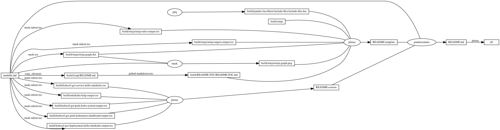

---
pandocomatic_:
    pandoc:
        from: markdown-smart
        to: gfm
        filter:
        - pandoc-include-code
        lua-filter:
        - ./build/pandoc-lua-filters/include-files/include-files.lua
        output: README.md
...

# minikube

<!-- markdownlint-disable MD007 MD030 -->
```{.include}
./build/README.TOC/README.TOC.md
```
<!-- markdownlint-enable MD007 MD030 -->

# Mask SubCommands

[Mask Awesome](https://github.com/huzhenghui/mask-awesome)

## docker-open

```bash
open -a Docker
```

## minikube-start

```bash
minikube start
```

## kubectl-get-pods

```bash
kubectl get pods --all-namespaces
```

## kubectl-get-pods-kube-system

```bash
kubectl get pods --namespace=kube-system
```

### kubectl-get-pods-kube-system-output

```{.plain include=./build/kubectl-get-pods-kube-system-output.txt}
```

## kubectl-get-pods-kubernetes-dashboard

``` bash
kubectl get pods --namespace=kubernetes-dashboard
```

### kubectl-get-pods-kubernetes-dashboard-output

```{.plain include=./build/kubectl-get-pods-kubernetes-dashboard-output.txt}
```

## minikube-dashboard

```bash
minikube dashboard
```

## kubectl-create-deployment-hello-minikube

```bash
kubectl create deployment hello-minikube --image=k8s.gcr.io/echoserver:1.4
```

## kubectl-get-deployment-hello-minikube

```bash
kubectl get deployment hello-minikube
```

### kubectl-get-deployment-hello-minikube-output

```{.plain include=./build/kubectl-get-deployment-hello-minikube-output.txt}
```

## kubectl-expose-deployment-hello-minikube

```bash
kubectl expose deployment hello-minikube --type=NodePort --port=8080
```

## kubectl-get-service-hello-minikube

```bash
kubectl get service hello-minikube
```

### kubectl-get-service-hello-minikube-output

```{.plain include=./build/kubectl-get-service-hello-minikube.txt}
```

## minikube-service-hello-minikube

```bash
minikube service hello-minikube
```

## kubectl-port-forward-service-hello-minikube

```bash
kubectl port-forward service/hello-minikube 7080:8080
```

<http://localhost:7080/>

## kubectl-delete-services-hello-minikube

```bash
kubectl delete services hello-minikube
```

## kubectl-delete-deployment-hello-minikube

```bash
kubectl delete deployment hello-minikube
```

## minikube-help

```bash
minikube --help
```

### minikube-help-output

<!-- markdownlint-disable MD013 -->
```{.plain include=./build/minikube-help-output.txt}
```
<!-- markdownlint-enable MD013 -->

## begin: mask task in template : build content

## ninja-rules

```bash
ninja -t rules
```

### ninja custom-rule

```{.ninja include=build.ninja snippet=custom-rule}
```

### ninja-rules-output

```{.plain include=./build/ninja/ninja-rules-output.txt}
```

## ninja-targets

```bash
ninja -t targets all
```

### ninja build-all

```{.ninja include=build.ninja snippet=build-all}
```

### ninja custom-build

```{.ninja include=build.ninja snippet=custom-build}

```

### ninja report-build

```{.ninja include=build.ninja snippet=report-build}

```

### ninja-targets-output

```{.plain include=./build/ninja/ninja-targets-output.txt}
```

## readme-md

```bash
ninja --verbose README.md
```

### ninja readme-build

```{.ninja include=build.ninja snippet=custom-readme-build}
```

```{.ninja include=build.ninja snippet=readme-build}
```

## end: mask task in template : build content

## begin: mask task in template : ninja command

## ninja-browse

```bash
ninja -t browse
```

## ninja-graph-png

```bash
dot -Tpng -o./build/ninja/ninja.graph.png ./build/ninja/ninja.graph.dot
```



## ninja-graph-dot-xdot

```bash
detach -- xdot "${MASKFILE_DIR}/build/ninja/ninja.graph.dot"
```

## ninja-graph-dot

```bash
ninja -t graph
```

### ninja-graph-dot-output

```{.dot include=./build/ninja/ninja.graph.dot}
```

## ninja-all

```bash
ninja --verbose
```

### build.ninja

```{.ninja include=./build.ninja}
```

## end: mask task in template : ninja command
