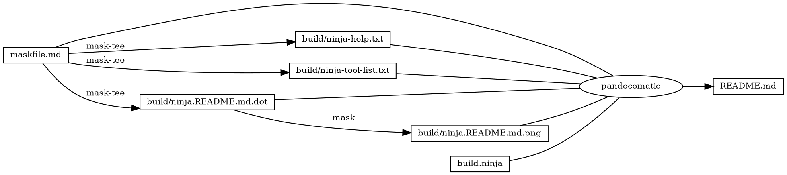
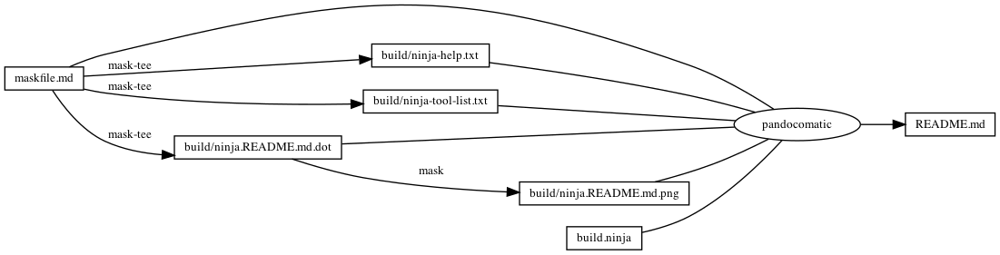

------------------------------------------------------------------------

    pandocomatic_:
        pandoc:
            from: markdown
            to: markdown-fenced_code_attributes
            filter:
            - pandoc-include-code
            output: README.md

...

# build.ninja

``` ninja
builddir=./build
mask_subcommand = --help

rule mask
  command = mask $mask_subcommand

rule mask-tee
  command = mask $mask_subcommand 2>&1 | tee $out 1> /dev/null

rule pandocomatic
  command = pandocomatic --input $in --output $out

build ./build/ninja-help.txt: mask-tee | ./maskfile.md
  mask_subcommand = ninja-help

build ./build/ninja-tool-list.txt: mask-tee  | ./maskfile.md
  mask_subcommand = ninja-tool-list

build ./build/ninja.README.md.dot: mask-tee | ./maskfile.md
  mask_subcommand = readme-grapth-dot

build ./build/ninja.README.md.png : mask | ./build/ninja.README.md.dot
  mask_subcommand = readme-grapth-png

build README.md: pandocomatic maskfile.md | build.ninja ./build/ninja-help.txt ./build/ninja-tool-list.txt ./build/ninja.README.md.dot ./build/ninja.README.md.png

default README.md
```

# Tasks

## ninja-help

``` bash
ninja --help
[[ $? -eq 1 ]]
```

### output

``` plain
usage: ninja [options] [targets...]

if targets are unspecified, builds the 'default' target (see manual).

options:
  --version      print ninja version ("1.10.2")
  -v, --verbose  show all command lines while building

  -C DIR   change to DIR before doing anything else
  -f FILE  specify input build file [default=build.ninja]

  -j N     run N jobs in parallel (0 means infinity) [default=14 on this system]
  -k N     keep going until N jobs fail (0 means infinity) [default=1]
  -l N     do not start new jobs if the load average is greater than N
  -n       dry run (don't run commands but act like they succeeded)

  -d MODE  enable debugging (use '-d list' to list modes)
  -t TOOL  run a subtool (use '-t list' to list subtools)
    terminates toplevel options; further flags are passed to the tool
  -w FLAG  adjust warnings (use '-w list' to list warnings)
```

## ninja-tool-list

``` bash
ninja -t list
```

### output

``` plain
ninja subtools:
    browse  browse dependency graph in a web browser
     clean  clean built files
  commands  list all commands required to rebuild given targets
      deps  show dependencies stored in the deps log
     graph  output graphviz dot file for targets
     query  show inputs/outputs for a path
   targets  list targets by their rule or depth in the DAG
    compdb  dump JSON compilation database to stdout
 recompact  recompacts ninja-internal data structures
    restat  restats all outputs in the build log
     rules  list all rules
 cleandead  clean built files that are no longer produced by the manifest
```

## readme

``` bash
ninja --verbose README.md
```

## readme-grapth-dot

``` bash
ninja -t graph README.md
```

### output



## readme-grapth-png

``` bash
dot -Tpng -o./build/ninja.README.md.png ./build/ninja.README.md.dot
```


