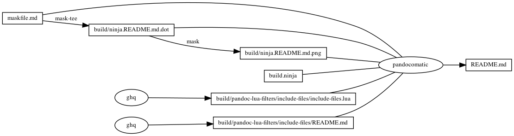

------------------------------------------------------------------------

    pandocomatic_:
        pandoc:
            from: markdown
            to: markdown-fenced_code_attributes
            filter:
            - pandoc-include-code

# start snippet include-files-use

            lua-filter:
            - ./build/pandoc-lua-filters/include-files/include-files.lua

# end snippet include-files-use

            output: README.md

...

# include-files

# include-files use

``` yaml
            lua-filter:
            - ./build/pandoc-lua-filters/include-files/include-files.lua

```

# include-files usage

```` markdown
```{.include shift-heading-level-by=1}
./build/pandoc-lua-filters/include-files/README.md
```

````

# ninja custom-rule

``` ninja
rule ghq
  command = ghq get --update "$repository" && find -d "$link_dirname" -exec rmdir {} \; && ln -Fs "$$(ghq list --full-path $repository)" "$link_dirname"
  generator = 1

```

# ninja custom-build

``` ninja
build ./build/pandoc-lua-filters/include-files/include-files.lua : ghq
  repository = https://github.com/pandoc/lua-filters
  link_dirname = ./build/pandoc-lua-filters

build ./build/pandoc-lua-filters/include-files/README.md : ghq
  repository = https://github.com/pandoc/lua-filters
  link_dirname = ./build/pandoc-lua-filters

```

# include-files README

> start snippet include-files-usage

## include-files {#include-files}

Filter to include other files in the document.

### Usage

Use a special code block with class `include` to include files of the
same format as the input. Each code line is treated as the filename of a
file, parsed, and the result is added to the document.

Metadata from included files is discarded.

#### Shifting Headings

The default is to include the subdocuments unchanged, but it can be
convenient to modify the level of headers; a top-level header in an
included file should be a second or third-level header in the final
document.

##### Manual shifting

Use the `shift-heading-level-by` attribute to control header shifting.

##### Automatic shifting

1.  Add metadata `-M include-auto` to enable automatic shifting.
2.  Do not specify `shift-heading-level-by`
3.  It will be inferred to the last heading level encountered

*Example* :

```` md
# Title f

This is `file-f.md`.

## Subtitle f

```{.include} >> equivalent to {.include shift-heading-level-by=2}
file-a.md
```

```{.include shift-heading-level-by=1} >> force shift to be 1
file-a.md
```
````

#### Comments

Comment lines can be added in the include block by beginning a line with
two `//` characters.

#### Different formats

Files are assumed to be written in Markdown, but sometimes one will want
to include files written in a different format. An alternative format
can be specified via the `format` attribute. Only plain-text formats are
accepted.

#### Recursive transclusion

Included files can in turn include other files. Note that all filenames
must be relative to the directory from which pandoc is run. I.e., if a
file `a/b.md` is included in the main document, and another file
`a/b/c.md` should be included, the full relative path must be used.
Writing `b/c.md` in `a/b.md` would *not* work.

### Example

Let's assume we are writing a longer document, like a thesis. Each
chapter and appendix section resides in its own file, with some
additional information in the main file `main.md`:

    ---
    author: me
    title: Thesis
    ---

    # Frontmatter

    Thanks everyone!

    <!-- actual chapters start here -->

    ``` {.include}
    chapters/introduction.md
    chapters/methods.md
    chapters/results.md
    chapters/discussion.md
    ```

    # Appendix

    More info goes here.

    ``` {.include shift-heading-level-by=1}
    // headings in included documents are shifted down a level,
    // a level 1 heading becomes level 2.
    appendix/questionaire.md
    ```

An HTML can be produced with this command:

    pandoc --lua-filter=include-files.lua main.md --output result.html

> end snippet include-files-usage

# https://github.com/huzhenghui/mask-awesome

## begin: mask task in template

## readme

``` bash
ninja --verbose README.md
```

### build.ninja

``` ninja
builddir=./build
mask_subcommand = --help

#######################################
# begin: rule in template

rule mask
  command = mask $mask_subcommand

rule mask-tee
  command = mask $mask_subcommand 2>&1 | tee $out 1> /dev/null

rule pandocomatic
  command = pandocomatic --input $in --output $out

# end: rule in template
#######################################

#######################################
# start snippet custom-rule

rule ghq
  command = ghq get --update "$repository" && find -d "$link_dirname" -exec rmdir {} \; && ln -Fs "$$(ghq list --full-path $repository)" "$link_dirname"
  generator = 1

# end snippet custom-rule
#######################################

#######################################
# begin: build in template

build ./build/ninja.README.md.dot: mask-tee | ./maskfile.md
  mask_subcommand = readme-graph-dot

build ./build/ninja.README.md.png : mask | ./build/ninja.README.md.dot
  mask_subcommand = readme-graph-png

# end: build in template
#######################################

#######################################
# start snippet custom-build

build ./build/pandoc-lua-filters/include-files/include-files.lua : ghq
  repository = https://github.com/pandoc/lua-filters
  link_dirname = ./build/pandoc-lua-filters

build ./build/pandoc-lua-filters/include-files/README.md : ghq
  repository = https://github.com/pandoc/lua-filters
  link_dirname = ./build/pandoc-lua-filters

# end snippet custom-build
#######################################

#######################################
# begin: build README.md
# $ followed by a newline
# escape the newline (continue the current line across a line break).
# the first 4 line in this build is template
build README.md: pandocomatic maskfile.md | $
  build.ninja $
  ./build/ninja.README.md.dot $
  ./build/ninja.README.md.png $
  ./build/pandoc-lua-filters/include-files/include-files.lua $
  ./build/pandoc-lua-filters/include-files/README.md

default README.md
# end: build README.md
#######################################
```

## readme-graph-dot

``` bash
ninja -t graph README.md
```

### readme-graph-dot-output


## readme-graph-dot-xdot

``` bash
detach -- xdot "${MASKFILE_DIR}/build/ninja.README.md.dot"
```

## readme-graph-png

``` bash
dot -Tpng -o./build/ninja.README.md.png ./build/ninja.README.md.dot
```



## end: mask task in template
