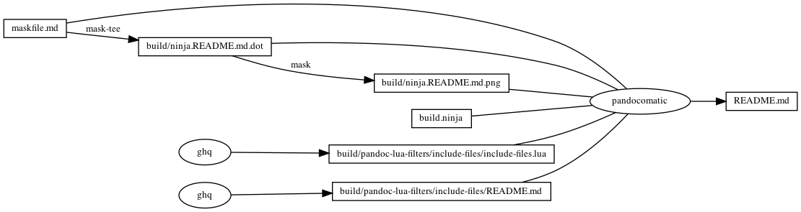

---

    pandocomatic_:
        pandoc:
            from: markdown
            to: markdown-fenced_code_attributes
            filter:
            - pandoc-include-code

# start snippet include-files-use

            lua-filter:
            - ./build/pandoc-lua-filters/include-files/include-files.lua

# end snippet include-files-use

            output: README.md

...

# include-files

# include-files use

```{.yaml include=maskfile.md snippet=include-files-use}

```

# include-files usage

```{.markdown include=maskfile.md snippet=include-files-usage}

```

# ninja custom-rule

```{.ninja include=build.ninja snippet=custom-rule}

```

# ninja custom-build

```{.ninja include=build.ninja snippet=custom-build}

```

# include-files README

> start snippet include-files-usage

```{.include shift-heading-level-by=1}
./build/pandoc-lua-filters/include-files/README.md
```

> end snippet include-files-usage

# https://github.com/huzhenghui/mask-awesome

## begin: mask task in template

## readme

```bash
ninja --verbose README.md
```

### build.ninja

```{.ninja include=./build.ninja}

```

## readme-graph-dot

```bash
ninja -t graph README.md
```

### readme-graph-dot-output

```{.dot include=./build/ninja.README.md.dot}

```

## readme-graph-dot-xdot

```bash
detach -- xdot "${MASKFILE_DIR}/build/ninja.README.md.dot"
```

## readme-graph-png

```bash
dot -Tpng -o./build/ninja.README.md.png ./build/ninja.README.md.dot
```



## end: mask task in template
