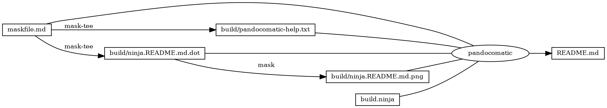
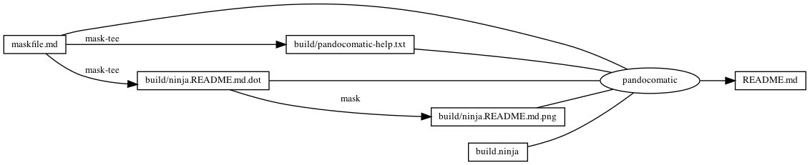

------------------------------------------------------------------------

# start snippet pandocomatic-front-matter-metadata

    pandocomatic_:
        pandoc:
            from: markdown
            to: markdown-fenced_code_attributes
            filter:
            - pandoc-include-code
            output: README.md

# end snippet pandocomatic-front-matter-metadata

...

# pandocomatic front matter metadata

``` yaml
pandocomatic_:
    pandoc:
        from: markdown
        to: markdown-fenced_code_attributes
        filter:
        - pandoc-include-code
        output: README.md

```

# Tasks

## pandocomatic-help

``` bash
pandocomatic --help
```

### pandocomatic-help-output

``` plain
  
  Pandocomatic. Automate the use of pandoc to convert files or directories.

USAGE

  pandocomatic options [INPUT]

DESCRIPTION

  Automate the use of pandoc. Either converts a single file or a directory
  tree. Configure the conversion process through configuration files.  Each
  input file that is converted by pandocomatic is processed as follows:

    input_file -> 
      preprocessor(0) -> ... -> preprocessor(N) ->
        pandoc -> 
          postprocessor(0) -> ... -> postprocessor(M) -> 
            output_file

  The preprocessors and postprocessors used in the conversion process are
  configured in pandocomatic templates. Besides processors, you can also
  specify pandoc options to use to convert the input file. These templates are
  specified in a configuration file. Templates can be used over and over, thus
  automating the use of pandoc.

OPTIONS


  Required:

  -i PATH, --input PATH
                  Convert PATH. If this option is not given, INPUT is
                  converted. INPUT and --input cannot be used together.
                  You can use this option multiple times, denoting to 
                  concatenate each input file in the order they
                  are specified on the command-line. Pandocomatic treats 
                  the concatenated files as a single input file.

  -o PATH, --output PATH
                  Create converted files and directories in PATH.


  Optional:

  -d PATH, --data-dir PATH
                  Configure pandocomatic to use PATH as its data directory.
                  Default is PANDOC's data dir. (See `pandoc --version` to
                  find PANDOC's data dir.)

  -c PATH, --config PATH
                  Configure pandocomatic to use PATH as its configuration file
                  to use during the conversion process. Default is
                  DATA_DIR/pandocomatic.yaml.
                  
                  Configuration files are YAML files and can contain the
                  following properties:

                  - data-dir: PATH (see --data-dir option)

                  - settings:
                    - skip: [GLOB PATTERNS] files to not convert. By default
                      hidden files (starting with a ".") and
                      "pandocomatic.yaml" are skipped.
                    - recursive: BOOLEAN convert this directory recursively.
                      Default is TRUE
                    - follow_links: BOOLEAN follow symbolic links. Default is
                      TRUE

                  - templates:
                    - cleanup: [SCRIPTS] paths to scripts to run after a
                      conversion is finished, i.e. after the last
                      postprocessor is run.
                    - glob: [GLOB PATTERNS] files to convert using this
                      template.
                    - setup: [SCRIPTS] paths to scripts to run before a
                      conversion is started, i.e. before any preprocessor is
                      run.
                    - metadata: [YAML properties] metadata properties
                    - preprocessors: [SCRIPTS] paths to scripts to run before
                      converting with pandoc.
                    - postprocessors: [SCRIPTS] paths to scripts to run after
                      converting with pandoc.
                    - pandoc: PANDOC OPTIONS to use when converting with
                      pandoc.

                  Each file and directory that is converted can contain a
                  configuration YAML metadata block or YAML configuration file
                  respectively. In a file, the property 'use-template' tells
                  pandocomatic which template to use.

  -m, --modified-only
        
                  Only convert files that have been modified. Only source files
                  that have been updated later than the corresponding
                  destination files will be converted, copied, or linked.
                  Default is FALSE.

  -q, --quiet     Run pandocomatic quietly. Default is FALSE.

  -b, --debug     Run pandocomatic in debug mode: show the pandoc invocations
                  before each conversion. Default is FALSE. Only works
                  when not quiet.

  -y, --dry-run   Configure pandocomatic to run the conversion process, but do
                  not actually run it. Default is FALSE.
  

  Experimental:

  -r PATH, --root-path PATH  
                  Set the root path to use with paths that are specified as
                  relative to that root path. It is used mostly with the 
                  --css pandoc option. It defaults to the directory of the
                  specified output.


  Common:

  -v, --version   Show the version. If this option is used, all other options
                  are ignored.

  -h, --help      Show this help. If this options is used, all other options
                  but --version are ignored.

EXAMPLE:

  Convert `hello.md` to `hello.html` according to the configuration in
  `pandocomatic.yaml`:

    pandocomatic --config pandocomatic.yaml -o hello.html -i hello.md

  Generate a static site using data directory `assets`:

    pandocomatic --data-dir assets/ -o website/ -i source/

SEE ALSO

  - Pandocomatic's documentation
    https://heerdebeer.org/Software/markdown/pandocomatic/

  - Pandoc's user guide
    https://pandoc.org/MANUAL.html

  - YAML website
    https://yaml.org/

AUTHOR

  Huub de Beer <Huub@heerdebeer.org>

LICENSE

  Copyright 2014—2020 Huub de Beer <huub@heerdebeer.org>

  Pandocomatic is free software: you can redistribute it and/or modify
  it under the terms of the GNU General Public License as published by the
  Free Software Foundation, either version 3 of the License, or (at your
  option) any later version.

  Pandocomatic is distributed in the hope that it will be useful, but
  WITHOUT ANY WARRANTY; without even the implied warranty of MERCHANTABILITY
  or FITNESS FOR A PARTICULAR PURPOSE.  See the GNU General Public License
  for more details.

  You should have received a copy of the GNU General Public License along
  with pandocomatic.  If not, see <http://www.gnu.org/licenses/>.
```

## readme

``` bash
ninja --verbose README.md
```

### build.ninja

``` ninja
builddir=./build
mask_subcommand = --help

rule mask
  command = mask $mask_subcommand

rule mask-tee
  command = mask $mask_subcommand 2>&1 | tee $out 1> /dev/null

rule pandocomatic
  command = pandocomatic --input $in --output $out

build ./build/pandocomatic-help.txt: mask-tee | ./maskfile.md
  mask_subcommand = pandocomatic-help

build ./build/ninja.README.md.dot: mask-tee | ./maskfile.md
  mask_subcommand = readme-grapth-dot

build ./build/ninja.README.md.png : mask | ./build/ninja.README.md.dot
  mask_subcommand = readme-grapth-png

build README.md: pandocomatic maskfile.md | build.ninja ./build/pandocomatic-help.txt ./build/ninja.README.md.dot ./build/ninja.README.md.png

default README.md
```

## readme-grapth-dot

``` bash
ninja -t graph README.md
```

### readme-grapth-dot-output



## readme-grapth-png

``` bash
dot -Tpng -o./build/ninja.README.md.png ./build/ninja.README.md.dot
```


