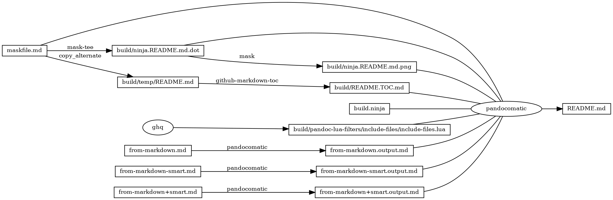
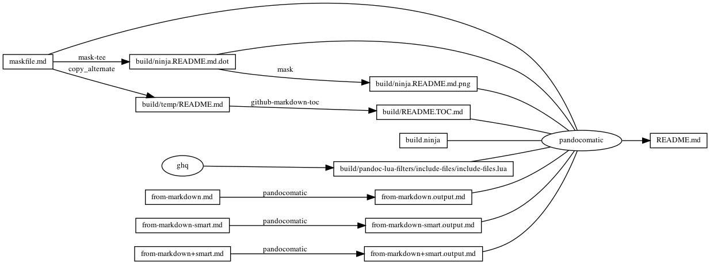

------------------------------------------------------------------------

    pandocomatic_:
        pandoc:
            from: markdown-smart
            to: gfm
            filter:
            - pandoc-include-code
            lua-filter:
            - ./build/pandoc-lua-filters/include-files/include-files.lua
            output: README.md

...

# smart

-   [smart](#smart)
-   [Extension: smart](#extension-smart)
-   [from-markdown-source](#from-markdown-source)
-   [from-markdown-output](#from-markdown-output)
-   [from-markdown-smart-source](#from-markdown-smart-source)
-   [from-markdown-smart-output](#from-markdown-smart-output)
-   [from-markdown+smart-source](#from-markdownsmart-source)
-   [from-markdown+smart-output](#from-markdownsmart-output)
-   [<a href="https://github.com/huzhenghui/mask-awesome">https://github.com/huzhenghui/mask-awesome</a>](#httpsgithubcomhuzhenghuimask-awesome)
    -   [begin: mask task in template](#begin-mask-task-in-template)
    -   [readme](#readme)
        -   [build.ninja](#buildninja)
        -   [ninja custom-rule](#ninja-custom-rule)
        -   [ninja custom-build](#ninja-custom-build)
    -   [readme-graph-dot](#readme-graph-dot)
        -   [readme-graph-dot-output](#readme-graph-dot-output)
    -   [readme-graph-dot-xdot](#readme-graph-dot-xdot)
    -   [readme-graph-png](#readme-graph-png)
    -   [end: mask task in template](#end-mask-task-in-template)

# Extension: smart

<https://pandoc.org/MANUAL.html#extension-smart>

# from-markdown-source

``` markdown
---

    pandocomatic_:
        pandoc:
            from: markdown
            to: gfm

...

# Interpret straight quotes as curly quotes

'Interpret straight quotes as curly quotes'

"Interpret straight quotes as curly quotes"

# --- as em-dashes

---

# -- as en-dashes

--

# ... as ellipses

...
```

# from-markdown-output

``` markdown
------------------------------------------------------------------------

    pandocomatic_:
        pandoc:
            from: markdown
            to: gfm

…

# Interpret straight quotes as curly quotes

‘Interpret straight quotes as curly quotes’

“Interpret straight quotes as curly quotes”

# — as em-dashes

------------------------------------------------------------------------

# – as en-dashes

–

# … as ellipses

…
```

# from-markdown-smart-source

``` markdown
---

    pandocomatic_:
        pandoc:
            from: markdown-smart
            to: gfm

...

# Interpret straight quotes as curly quotes

'Interpret straight quotes as curly quotes'

"Interpret straight quotes as curly quotes"

# --- as em-dashes

---

# -- as en-dashes

--

# ... as ellipses

...
```

# from-markdown-smart-output

``` markdown
------------------------------------------------------------------------

    pandocomatic_:
        pandoc:
            from: markdown-smart
            to: gfm

...

# Interpret straight quotes as curly quotes

'Interpret straight quotes as curly quotes'

"Interpret straight quotes as curly quotes"

# --- as em-dashes

------------------------------------------------------------------------

# -- as en-dashes

--

# ... as ellipses

...
```

# from-markdown+smart-source

``` markdown
---

    pandocomatic_:
        pandoc:
            from: markdown+smart
            to: gfm

...

# Interpret straight quotes as curly quotes

'Interpret straight quotes as curly quotes'

"Interpret straight quotes as curly quotes"

# --- as em-dashes

---

# -- as en-dashes

--

# ... as ellipses

...
```

# from-markdown+smart-output

``` markdown
------------------------------------------------------------------------

    pandocomatic_:
        pandoc:
            from: markdown+smart
            to: gfm

…

# Interpret straight quotes as curly quotes

‘Interpret straight quotes as curly quotes’

“Interpret straight quotes as curly quotes”

# — as em-dashes

------------------------------------------------------------------------

# – as en-dashes

–

# … as ellipses

…
```

# https://github.com/huzhenghui/mask-awesome

## begin: mask task in template

## readme

``` bash
ninja --verbose README.md
```

### build.ninja

``` ninja
builddir=./build
mask_subcommand = --help

#######################################
# begin: rule in template

rule mask
  command = mask $mask_subcommand

rule mask-tee
  command = mask $mask_subcommand 2>&1 | tee $out 1> /dev/null

rule pandocomatic
  command = pandocomatic --input $in --output $out

rule ghq
  command = ghq get --update "$repository" && find -d "$link_dirname" -exec rmdir {} \; && ln -Fs "$$(ghq list --full-path $repository)" "$link_dirname"
  generator = 1

rule github-markdown-toc
  command = gh-md-toc --hide-header --hide-footer --no-escape $in > $out

rule copy_alternate
  command = if [[ -f "$alternate" ]]; then cp "$alternate" "$out"; else cp "$in" "$out"; fi;

# end: rule in template
#######################################

#######################################
# start snippet custom-rule

# custom rule here

# end snippet custom-rule
#######################################

#######################################
# begin: build in template

build ./build/ninja.README.md.dot : mask-tee | ./maskfile.md
  mask_subcommand = readme-graph-dot

build ./build/ninja.README.md.png : mask | ./build/ninja.README.md.dot
  mask_subcommand = readme-graph-png

build ./build/pandoc-lua-filters/include-files/include-files.lua : ghq
  repository = https://github.com/pandoc/lua-filters
  link_dirname = ./build/pandoc-lua-filters

build ./build/temp/README.md : copy_alternate ./maskfile.md
  alternate = ./README.md

build ./build/README.TOC.md : github-markdown-toc ./build/temp/README.md

# end: build in template
#######################################

#######################################
# start snippet custom-build

build ./from-markdown.output.md : pandocomatic ./from-markdown.md

build ./from-markdown-smart.output.md : pandocomatic ./from-markdown-smart.md

build ./from-markdown+smart.output.md : pandocomatic ./from-markdown+smart.md

# end snippet custom-build
#######################################

#######################################
# begin: build README.md
# $ followed by a newline
# escape the newline (continue the current line across a line break).
# the first 4 line in this build is template
build README.md : pandocomatic maskfile.md | $
  build.ninja $
  ./build/ninja.README.md.dot $
  ./build/ninja.README.md.png $
  ./build/pandoc-lua-filters/include-files/include-files.lua $
  ./build/README.TOC.md $
  ./from-markdown.output.md $
  ./from-markdown-smart.output.md $
  ./from-markdown+smart.output.md

default README.md
# end: build README.md
#######################################
```

### ninja custom-rule

``` ninja
# custom rule here

```

### ninja custom-build

``` ninja
build ./from-markdown.output.md : pandocomatic ./from-markdown.md

build ./from-markdown-smart.output.md : pandocomatic ./from-markdown-smart.md

build ./from-markdown+smart.output.md : pandocomatic ./from-markdown+smart.md

```

## readme-graph-dot

``` bash
ninja -t graph README.md
```

### readme-graph-dot-output



## readme-graph-dot-xdot

``` bash
detach -- xdot "${MASKFILE_DIR}/build/ninja.README.md.dot"
```

## readme-graph-png

``` bash
dot -Tpng -o./build/ninja.README.md.png ./build/ninja.README.md.dot
```



## end: mask task in template
