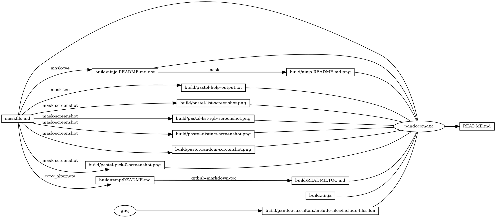

# pastel

<!-- markdownlint-disable MD007 MD030 -->

-   [pastel](#pastel)
-   [Mask SubCommands](#mask-subcommands)
    -   [pastel-help](#pastel-help)
        -   [pastel-help-output](#pastel-help-output)
    -   [pastel-list](#pastel-list)
        -   [pastel-list-screenshot](#pastel-list-screenshot)
    -   [pastel-list-rgb](#pastel-list-rgb)
        -   [pastel-list-rgb-screenshot](#pastel-list-rgb-screenshot)
    -   [pastel-random](#pastel-random)
        -   [pastel-random-screenshot](#pastel-random-screenshot)
    -   [pastel-distinct](#pastel-distinct)
        -   [pastel-distinct-screenshot](#pastel-distinct-screenshot)
    -   [pastel-pick-0](#pastel-pick-0)
        -   [pastel-pick-0-screenshot](#pastel-pick-0-screenshot)
    -   [begin: mask task in template](#begin-mask-task-in-template)
    -   [readme](#readme)
        -   [build.ninja](#buildninja)
        -   [ninja custom-rule](#ninja-custom-rule)
            -   [File for saving screen output
                log](#file-for-saving-screen-output-log)
            -   [Remove screen output log file if generated
                before](#remove-screen-output-log-file-if-generated-before)
            -   [Generate screen output log file until
                success](#generate-screen-output-log-file-until-success)
                -   [Check if screen output log have generated and
                    received
                    data](#check-if-screen-output-log-have-generated-and-received-data)
                -   [Set a file name which will be a FIFO for retrieve
                    screen output
                    log](#set-a-file-name-which-will-be-a-fifo-for-retrieve-screen-output-log)
                -   [Output the file name for
                    debug](#output-the-file-name-for-debug)
                -   [Make FIFO file on the file
                    name](#make-fifo-file-on-the-file-name)
                -   [Execute mask subcommand in screen from retrieve
                    log](#execute-mask-subcommand-in-screen-from-retrieve-log)
                    -   [Use log in screen and specific log file
                        name](#use-log-in-screen-and-specific-log-file-name)
                    -   [Start screen in detached mode and set the name
                        of the new session to
                        sessionname](#start-screen-in-detached-mode-and-set-the-name-of-the-new-session-to-sessionname)
                    -   [The commands which execute in
                        screen](#the-commands-which-execute-in-screen)
                    -   [Execute mask subcommand by
                        stdbuf](#execute-mask-subcommand-by-stdbuf)
                    -   [Output watermark with date colored by
                        lolcat](#output-watermark-with-date-colored-by-lolcat)
                -   [Retrieve screen output log to save to screen output
                    log
                    file](#retrieve-screen-output-log-to-save-to-screen-output-log-file)
            -   [Convert screen output log file to image by a series
                converter](#convert-screen-output-log-file-to-image-by-a-series-converter)
                -   [Convert screen output log file which is embedded by
                    ANSI codes to
                    HTML](#convert-screen-output-log-file-which-is-embedded-by-ansi-codes-to-html)
                -   [Save HTML to temp file for
                    debug](#save-html-to-temp-file-for-debug)
                -   [Convert HTML format to
                    image](#convert-html-format-to-image)
        -   [ninja custom-build](#ninja-custom-build)
    -   [readme-graph-dot](#readme-graph-dot)
        -   [readme-graph-dot-output](#readme-graph-dot-output)
    -   [readme-graph-dot-xdot](#readme-graph-dot-xdot)
    -   [readme-graph-png](#readme-graph-png)
    -   [end: mask task in template](#end-mask-task-in-template)

<!-- markdownlint-enable MD007 MD030 -->

# Mask SubCommands

[Mask Awesome](https://github.com/huzhenghui/mask-awesome)

## pastel-help

``` bash
pastel --help
```

### pastel-help-output

<!-- markdownlint-disable MD013 -->

``` plain
pastel 0.8.0
A command-line tool to generate, analyze, convert and manipulate colors

USAGE:
    pastel [OPTIONS] <SUBCOMMAND>

OPTIONS:
    -m, --color-mode <mode>              
            Specify the terminal color mode: 24bit, 8bit, off, *auto*

    -f, --force-color                    
            Alias for --mode=24bit

        --color-picker <color-picker>
            Use a specific tool to pick the colors [possible values: osascript, gpick, xcolor,
            grabc, colorpicker, chameleon, kcolorchooser]
    -h, --help                           
            Prints help information

    -V, --version                        
            Prints version information


SUBCOMMANDS:
    color         Display information about the given color
    list          Show a list of available color names
    random        Generate a list of random colors
    distinct      Generate a set of visually distinct colors
    sort-by       Sort colors by the given property
    pick          Interactively pick a color from the screen (pipette)
    format        Convert a color to the given format
    paint         Print colored text using ANSI escape sequences
    gradient      Generate an interpolating sequence of colors
    mix           Mix two colors in the given colorspace
    colorblind    Simulate a color under a certain colorblindness profile
    set           Set a color property to a specific value
    saturate      Increase color saturation by a specified amount
    desaturate    Decrease color saturation by a specified amount
    lighten       Lighten color by a specified amount
    darken        Darken color by a specified amount
    rotate        Rotate the hue channel by the specified angle
    complement    Get the complementary color (hue rotated by 180°)
    gray          Create a gray tone from a given lightness
    to-gray       Completely desaturate a color (preserving luminance)
    textcolor     Get a readable text color for the given background color
    help          Prints this message or the help of the given subcommand(s)
```

<!-- markdownlint-enable MD013 -->

## pastel-list

``` bash
pastel list
```

### pastel-list-screenshot


## pastel-list-rgb

``` bash
pastel list | pastel --force-color format rgb
```

### pastel-list-rgb-screenshot


## pastel-random

``` bash
pastel random
```

### pastel-random-screenshot


## pastel-distinct

``` bash
pastel distinct
```

### pastel-distinct-screenshot


## pastel-pick-0

``` bash
pastel pick 0
```

### pastel-pick-0-screenshot


## begin: mask task in template

## readme

``` bash
ninja -j 1 --verbose README.md
```

### build.ninja

``` ninja
builddir=./build
mask_subcommand = --help

#######################################
# begin: rule in template

rule mask
  command = mask $mask_subcommand

rule mask-tee
  command = mask $mask_subcommand 2>&1 | tee $out 1> /dev/null

rule pandocomatic
  command = pandocomatic --input $in --output $out

rule ghq
  command = ghq get --update "$repository" && $
    find -d "$link_dirname" -exec rmdir {} \; && $
    ln -Fs "$$(ghq list --full-path $repository)" "$link_dirname"
  generator = 1

rule github-markdown-toc
  command = gh-md-toc --hide-header --hide-footer --no-escape $in > $out

rule copy_alternate
  command = if [[ -f "$alternate" ]]; $
    then $
      cp "$alternate" "$out"; $
    else $
      cp "$in" "$out"; $
    fi;

# end: rule in template
#######################################

#######################################
# start snippet custom-rule

rule mask-screenshot
  command = $
    regular_logfile="./build/temp/$$(basename $out).mask-screenshot.logfile" && $
    rm -f -v "$${regular_logfile}" && $
    until [[ -s "$${regular_logfile}" ]]; do $
      screen_logfile="$$(mktemp -d)/logfile"; $
      echo "$${screen_logfile}"; $
      mkfifo "$${screen_logfile}"; $
      screen -L -Logfile "$${screen_logfile}" $
        -dmS mask-screenshot-"$$(basename $out)" $
        sh -c "stdbuf -o0 mask --maskfile $in $mask_subcommand; $
          date +'%F %T %Z %z - %+ https://github.com/huzhenghui' | lolcat;"; $
      dd bs=1 if="$${screen_logfile}" of="$${regular_logfile}"; $
    done && $
    ansifilter --html --encoding=utf8 --input="$${regular_logfile}" | $
      tee ./build/temp/"$$(basename $out)".mask-screenshot.html | $
      wkhtmltoimage --format png - "$out"

# end snippet custom-rule
#######################################

#######################################
# begin: build in template

build ./build/ninja.README.md.dot : mask-tee | ./maskfile.md
  mask_subcommand = readme-graph-dot

build ./build/ninja.README.md.png : mask | ./build/ninja.README.md.dot
  mask_subcommand = readme-graph-png

build ./build/pandoc-lua-filters/include-files/include-files.lua : ghq
  repository = https://github.com/pandoc/lua-filters
  link_dirname = ./build/pandoc-lua-filters

build ./build/temp/README.md : copy_alternate ./maskfile.md
  alternate = ./README.md

build ./build/README.TOC.md : github-markdown-toc ./build/temp/README.md

# end: build in template
#######################################

#######################################
# start snippet custom-build

build ./build/pastel-help-output.txt : mask-tee | ./maskfile.md
  mask_subcommand = pastel-help

build ./build/pastel-list-screenshot.png : mask-screenshot ./maskfile.md
  mask_subcommand = pastel-list

build ./build/pastel-list-rgb-screenshot.png : mask-screenshot ./maskfile.md
  mask_subcommand = pastel-list-rgb

build ./build/pastel-random-screenshot.png : mask-screenshot ./maskfile.md
  mask_subcommand = pastel-random

build ./build/pastel-distinct-screenshot.png : mask-screenshot ./maskfile.md
  mask_subcommand = pastel-distinct

build ./build/pastel-pick-0-screenshot.png : mask-screenshot ./maskfile.md
  mask_subcommand = pastel-pick-0


# end snippet custom-build
#######################################

#######################################
# begin: build README.md
# $ followed by a newline
# escape the newline (continue the current line across a line break).
# the first 4 line in this build is template
build README.md : pandocomatic maskfile.md | $
  build.ninja $
  ./build/ninja.README.md.dot $
  ./build/ninja.README.md.png $
  ./build/pandoc-lua-filters/include-files/include-files.lua $
  ./build/README.TOC.md $
  ./build/pastel-help-output.txt $
  ./build/pastel-list-screenshot.png $
  ./build/pastel-list-rgb-screenshot.png $
  ./build/pastel-distinct-screenshot.png $
  ./build/pastel-random-screenshot.png $
  ./build/pastel-pick-0-screenshot.png

default README.md
# end: build README.md
#######################################
```

### ninja custom-rule

``` ninja
rule mask-screenshot
  command = $
    regular_logfile="./build/temp/$$(basename $out).mask-screenshot.logfile" && $
    rm -f -v "$${regular_logfile}" && $
    until [[ -s "$${regular_logfile}" ]]; do $
      screen_logfile="$$(mktemp -d)/logfile"; $
      echo "$${screen_logfile}"; $
      mkfifo "$${screen_logfile}"; $
      screen -L -Logfile "$${screen_logfile}" $
        -dmS mask-screenshot-"$$(basename $out)" $
        sh -c "stdbuf -o0 mask --maskfile $in $mask_subcommand; $
          date +'%F %T %Z %z - %+ https://github.com/huzhenghui' | lolcat;"; $
      dd bs=1 if="$${screen_logfile}" of="$${regular_logfile}"; $
    done && $
    ansifilter --html --encoding=utf8 --input="$${regular_logfile}" | $
      tee ./build/temp/"$$(basename $out)".mask-screenshot.html | $
      wkhtmltoimage --format png - "$out"

```

#### File for saving `screen` output log

``` bash
    regular_logfile="./build/temp/$$(basename $out).mask-screenshot.logfile" && $
```

#### Remove `screen` output log file if generated before

``` bash
    rm -f -v "$${regular_logfile}" && $
```

#### Generate `screen` output log file until success

``` bash
    until [[ -s "$${regular_logfile}" ]]; do $
      screen_logfile="$$(mktemp -d)/logfile"; $
      echo "$${screen_logfile}"; $
      mkfifo "$${screen_logfile}"; $
      screen -L -Logfile "$${screen_logfile}" $
        -dmS mask-screenshot-"$$(basename $out)" $
        sh -c "stdbuf -o0 mask --maskfile $in $mask_subcommand; $
          date +'%F %T %Z %z - %+ https://github.com/huzhenghui' | lolcat;"; $
      dd bs=1 if="$${screen_logfile}" of="$${regular_logfile}"; $
    done && $
```

##### Check if `screen` output log have generated and received data

> [12 Conditional Expressions12 Conditional
> Expressions](http://zsh.sourceforge.net/Doc/Release/Conditional-Expressions.html#Conditional-Expressions)

-   `-s file`
    -   true if `file` exists and has size greater than zero.

``` bash
    until [[ -s "$${regular_logfile}" ]]; do $
```

``` bash
    done && $
```

##### Set a file name which will be a `FIFO` for retrieve `screen` output log

``` bash
      screen_logfile="$$(mktemp -d)/logfile"; $
```

##### Output the file name for debug

``` bash
      echo "$${screen_logfile}"; $
```

##### Make `FIFO` file on the file name

``` bash
      mkfifo "$${screen_logfile}"; $
```

##### Execute `mask` subcommand in `screen` from retrieve log

> -   [GNU Screen](https://www.gnu.org/software/screen/)
> -   [Screen User's
>     Manual](https://www.gnu.org/software/screen/manual/)

``` bash
      screen -L -Logfile "$${screen_logfile}" $
        -dmS mask-screenshot-"$$(basename $out)" $
        sh -c "stdbuf -o0 mask --maskfile $in $mask_subcommand; $
          date +'%F %T %Z %z - %+ https://github.com/huzhenghui' | lolcat;"; $
```

###### Use log in `screen` and specific log file name

> [3 Invoking
> `Screen`](https://www.gnu.org/software/screen/manual/html_node/Invoking-Screen.html)

-   `-L`
    -   Tell `screen` to turn on automatic output logging for the
        windows.
-   `-Logfile "file"`
    -   By default logfile name is `screenlog.0`. You can set new
        logfile name with the `-Logfile` option.

``` bash
      screen -L -Logfile "$${screen_logfile}" $
```

###### Start screen in detached mode and set the name of the new session to sessionname

> [3 Invoking
> `Screen`](https://www.gnu.org/software/screen/manual/html_node/Invoking-Screen.html)

-   `-d -m`
    -   Start `screen` in detached mode. This creates a new session but
        doesn’t attach to it. This is useful for system startup scripts.
-   `-S sessionname`
    -   Set the name of the new session to sessionname

``` bash
        -dmS mask-screenshot-"$$(basename $out)" $
```

###### The commands which execute in `screen`

``` bash
        sh -c "stdbuf -o0 mask --maskfile $in $mask_subcommand; $
          date +'%F %T %Z %z - %+ https://github.com/huzhenghui' | lolcat;"; $
```

###### Execute `mask` subcommand by `stdbuf`

> [`stdbuf`: Run a command with modified I/O stream
> buffering](https://www.gnu.org/software/coreutils/manual/html_node/stdbuf-invocation.html)

-   `-o mode`
    -   Adjust the standard output stream buffering.
-   `0`
    -   Disable buffering of the selected stream. In this mode, data is
        output immediately and only the amount of data requested is read
        from input. Note the difference in function for input and
        output. Disabling buffering for input will not influence the
        responsiveness or blocking behavior of the stream input
        functions. For example `fread` will still block until `EOF` or
        error, even if the underlying `read` returns less data than
        requested.

``` bash
        sh -c "stdbuf -o0 mask --maskfile $in $mask_subcommand; $
```

###### Output watermark with `date` colored by `lolcat`

> [lolcat - Rainbows and unicorns in your
> console!](https://github.com/busyloop/lolcat)

``` bash
          date +'%F %T %Z %z - %+ https://github.com/huzhenghui' | lolcat;"; $
```

##### Retrieve `screen` output log to save to `screen` output log file

> [dd -- convert and copy a
> file](https://www.freebsd.org/cgi/man.cgi?dd(1)#DESCRIPTION)

-   `bs=n`
    -   Set both input and output block size to `n` bytes, superseding
        the `ibs` and `obs` operands. If no conversion values other than
        `noerror`, `notrunc` or `sync` are specified, then each input
        block is copied to the output as a single block without any
        aggregation of short blocks.
-   `if=file`
    -   Read input from `file` instead of the standard input.
-   `of=file`
    -   Write output to `file` instead of the standard output. Any
        regular output file is truncated unless the `notrunc` conversion
        value is specified. If an initial portion of the output file is
        seeked past (see the `oseek` operand), the output file is
        truncated at that point.

``` bash
      dd bs=1 if="$${screen_logfile}" of="$${regular_logfile}"; $
```

#### Convert `screen` output log file to image by a series converter

``` bash
    ansifilter --html --encoding=utf8 --input="$${regular_logfile}" | $
      tee ./build/temp/"$$(basename $out)".mask-screenshot.html | $
      wkhtmltoimage --format png - "$out"
```

##### Convert `screen` output log file which is embedded by `ANSI` codes to HTML

> [`Ansifilter`
> documentation](http://www.andre-simon.de/doku/ansifilter/en/ansifilter.php)

-   `-i`, `--input=<file>`
    -   Name of input file
-   `-H`, `--html`
    -   Output HTML
-   `-e`, `--encoding=<name>`
    -   Set HTML/RTF encoding (must match input file encoding); omit
        encoding information if enc=NONE

``` bash
    ansifilter --html --encoding=utf8 --input="$${regular_logfile}" | $
```

##### Save HTML to temp file for debug

> [tee -- duplicate standard
> input](https://www.freebsd.org/cgi/man.cgi?query=tee&sektion=1)

``` bash
      tee ./build/temp/"$$(basename $out)".mask-screenshot.html | $
```

##### Convert HTML format to image

> [`wkhtmltoimage` - html to image
> converter](http://manpages.ubuntu.com/manpages/cosmic/man1/wkhtmltoimage.1.html)

-   `-f`, `--format <format>`
    -   Output file format

``` bash
      wkhtmltoimage --format png - "$out"
```

### ninja custom-build

``` ninja
build ./build/pastel-help-output.txt : mask-tee | ./maskfile.md
  mask_subcommand = pastel-help

build ./build/pastel-list-screenshot.png : mask-screenshot ./maskfile.md
  mask_subcommand = pastel-list

build ./build/pastel-list-rgb-screenshot.png : mask-screenshot ./maskfile.md
  mask_subcommand = pastel-list-rgb

build ./build/pastel-random-screenshot.png : mask-screenshot ./maskfile.md
  mask_subcommand = pastel-random

build ./build/pastel-distinct-screenshot.png : mask-screenshot ./maskfile.md
  mask_subcommand = pastel-distinct

build ./build/pastel-pick-0-screenshot.png : mask-screenshot ./maskfile.md
  mask_subcommand = pastel-pick-0


```

## readme-graph-dot

``` bash
ninja -t graph README.md
```

### readme-graph-dot-output



## readme-graph-dot-xdot

``` bash
detach -- xdot "${MASKFILE_DIR}/build/ninja.README.md.dot"
```

## readme-graph-png

``` bash
dot -Tpng -o./build/ninja.README.md.png ./build/ninja.README.md.dot
```


## end: mask task in template
