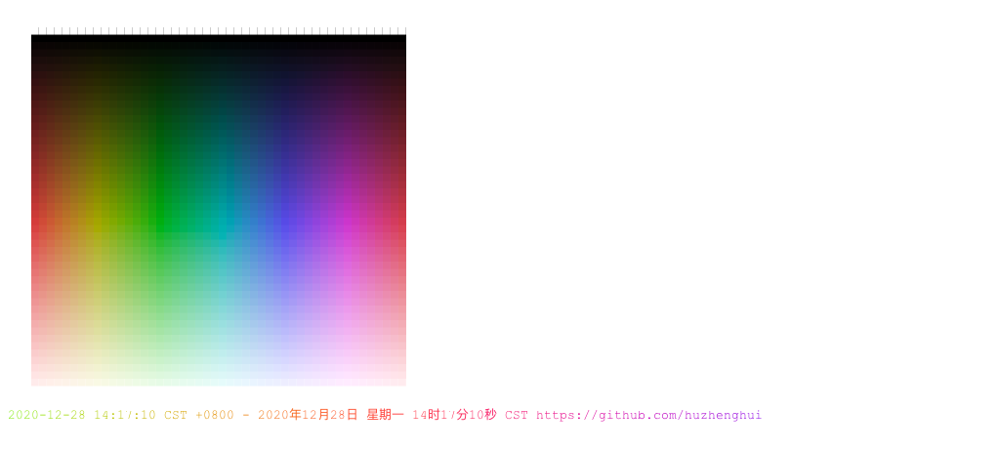
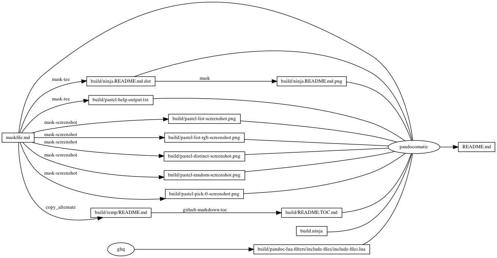

---
pandocomatic_:
    pandoc:
        from: markdown-smart
        to: gfm
        filter:
        - pandoc-include-code
        lua-filter:
        - ./build/pandoc-lua-filters/include-files/include-files.lua
        output: README.md
...

# pastel

<!-- markdownlint-disable MD007 MD030 -->
```{.include}
./build/README.TOC.md
```
<!-- markdownlint-enable MD007 MD030 -->

# Mask SubCommands

[Mask Awesome](https://github.com/huzhenghui/mask-awesome)

## pastel-help

```bash
pastel --help
```

### pastel-help-output

<!-- markdownlint-disable MD013 -->
```{.plain include=./build/pastel-help-output.txt}
```
<!-- markdownlint-enable MD013 -->

## pastel-list

```bash
pastel list
```

### pastel-list-screenshot


## pastel-list-rgb

```bash
pastel list | pastel --force-color format rgb
```

### pastel-list-rgb-screenshot


## pastel-random

```bash
pastel random
```

### pastel-random-screenshot


## pastel-distinct

```bash
pastel distinct
```

### pastel-distinct-screenshot


## pastel-pick-0

```bash
pastel pick 0
```

### pastel-pick-0-screenshot



## begin: mask task in template

## readme

```bash
ninja -j 1 --verbose README.md
```

### build.ninja

```{.ninja include=./build.ninja}

```

### ninja custom-rule

```{.ninja include=build.ninja snippet=custom-rule}

```

#### File for saving `screen` output log

```{.bash include=build.ninja startLine=41 endLine=41}
```

#### Remove `screen` output log file if generated before

```{.bash include=build.ninja startLine=42 endLine=42}
```

#### Generate `screen` output log file until success

```{.bash include=build.ninja startLine=43 endLine=52}
```

##### Check if `screen` output log have generated and received data

> [12 Conditional Expressions12 Conditional Expressions](http://zsh.sourceforge.net/Doc/Release/Conditional-Expressions.html#Conditional-Expressions)

- `-s file`
  - true if `file` exists and has size greater than zero.

```{.bash include=build.ninja startLine=43 endLine=43}
```

```{.bash include=build.ninja startLine=52 endLine=52}
```

##### Set a file name which will be a `FIFO` for retrieve `screen` output log

```{.bash include=build.ninja startLine=44 endLine=44}
```

##### Output the file name for debug

```{.bash include=build.ninja startLine=45 endLine=45}
```

##### Make `FIFO` file on the file name

```{.bash include=build.ninja startLine=46 endLine=46}
```

##### Execute `mask` subcommand in `screen` from retrieve log

> - [GNU Screen](https://www.gnu.org/software/screen/)
> - [Screen User's Manual](https://www.gnu.org/software/screen/manual/)

```{.bash include=build.ninja startLine=47 endLine=50}
```

###### Use log in `screen` and specific log file name

> [3 Invoking `Screen`](https://www.gnu.org/software/screen/manual/html_node/Invoking-Screen.html)

- `-L`
  - Tell `screen` to turn on automatic output logging for the windows.
- `-Logfile "file"`
  - By default logfile name is `screenlog.0`.
    You can set new logfile name with the `-Logfile` option.

```{.bash include=build.ninja startLine=47 endLine=47}
```

###### Start screen in detached mode and set the name of the new session to sessionname

> [3 Invoking `Screen`](https://www.gnu.org/software/screen/manual/html_node/Invoking-Screen.html)

- `-d -m`
  - Start `screen` in detached mode.
    This creates a new session but doesn’t attach to it.
    This is useful for system startup scripts.
- `-S sessionname`
  - Set the name of the new session to sessionname

```{.bash include=build.ninja startLine=48 endLine=48}
```

###### The commands which execute in `screen`

```{.bash include=build.ninja startLine=49 endLine=50}
```

###### Execute `mask` subcommand by `stdbuf`

> [`stdbuf`: Run a command with modified I/O stream buffering](https://www.gnu.org/software/coreutils/manual/html_node/stdbuf-invocation.html)

- `-o mode`
  - Adjust the standard output stream buffering.
- `0`
  - Disable buffering of the selected stream.
    In this mode, data is output immediately
    and only the amount of data requested is read from input.
    Note the difference in function for input and output.
    Disabling buffering for input will not influence the responsiveness
    or blocking behavior of the stream input functions.
    For example `fread` will still block until `EOF` or error,
    even if the underlying `read` returns less data than requested.

```{.bash include=build.ninja startLine=49 endLine=49}
```

###### Output watermark with `date` colored by `lolcat`

> [lolcat - Rainbows and unicorns in your console!](https://github.com/busyloop/lolcat)

```{.bash include=build.ninja startLine=50 endLine=50}
```

##### Retrieve `screen` output log to save to `screen` output log file

> [dd -- convert and copy a file](https://www.freebsd.org/cgi/man.cgi?dd(1)#DESCRIPTION)

- `bs=n`
  - Set both input and output block size to `n` bytes,
    superseding the `ibs` and `obs` operands.
    If no conversion values other than `noerror`, `notrunc` or `sync` are specified,
    then each input block is copied to the output as a single block
    without any aggregation of short blocks.
- `if=file`
  - Read input from `file` instead of the standard input.
- `of=file`
  - Write output to `file` instead of the standard output.
    Any regular output file is truncated
    unless the `notrunc` conversion value is specified.
    If an initial portion of the output file is seeked past (see the `oseek` operand),
    the output file is truncated at that point.

```{.bash include=build.ninja startLine=51 endLine=51}
```

#### Convert `screen` output log file to image by a series converter

```{.bash include=build.ninja startLine=53 endLine=55}
```

##### Convert `screen` output log file which is embedded by `ANSI` codes to HTML

> [`Ansifilter` documentation](http://www.andre-simon.de/doku/ansifilter/en/ansifilter.php)

- `-i`, `--input=<file>`
  - Name of input file
- `-H`, `--html`
  - Output HTML
- `-e`, `--encoding=<name>`
  - Set HTML/RTF encoding (must match input file encoding);
    omit encoding information if enc=NONE

```{.bash include=build.ninja startLine=53 endLine=53}
```

##### Save HTML to temp file for debug

> [tee -- duplicate standard input](https://www.freebsd.org/cgi/man.cgi?query=tee&sektion=1)

```{.bash include=build.ninja startLine=54 endLine=54}
```

##### Convert HTML format to image

> [`wkhtmltoimage` - html to image converter](http://manpages.ubuntu.com/manpages/cosmic/man1/wkhtmltoimage.1.html)

- `-f`, `--format <format>`
  - Output file format

```{.bash include=build.ninja startLine=55 endLine=55}
```

### ninja custom-build

```{.ninja include=build.ninja snippet=custom-build}

```

## readme-graph-dot

```bash
ninja -t graph README.md
```

### readme-graph-dot-output

```{.dot include=./build/ninja.README.md.dot}

```

## readme-graph-dot-xdot

```bash
detach -- xdot "${MASKFILE_DIR}/build/ninja.README.md.dot"
```

## readme-graph-png

```bash
dot -Tpng -o./build/ninja.README.md.png ./build/ninja.README.md.dot
```



## end: mask task in template
