# farmer

<!-- markdownlint-disable MD007 MD030 -->

-   [farmer](#farmer)
-   [farmer.comment.pi](#farmercommentpi)
-   [import](#import)
-   [main](#main)
-   [final](#final)
-   [action](#action)
-   [opposite](#opposite)
-   [unsafe](#unsafe)
-   [Mask SubCommands](#mask-subcommands)
    -   [picat-farmer.pi](#picat-farmerpi)
        -   [picat-farmer.pi-output](#picat-farmerpi-output)
    -   [curl-farmer.pi](#curl-farmerpi)
        -   [farmer.pi-output](#farmerpi-output)
    -   [begin: mask task in template : build
        content](#begin-mask-task-in-template--build-content)
    -   [ninja-rules](#ninja-rules)
        -   [ninja custom-rule](#ninja-custom-rule)
        -   [ninja-rules-output](#ninja-rules-output)
    -   [ninja-targets](#ninja-targets)
        -   [ninja build-all](#ninja-build-all)
        -   [ninja custom-build](#ninja-custom-build)
        -   [ninja report-build](#ninja-report-build)
        -   [ninja-targets-output](#ninja-targets-output)
    -   [readme-md](#readme-md)
        -   [ninja readme-build](#ninja-readme-build)
    -   [end: mask task in template : build
        content](#end-mask-task-in-template--build-content)
    -   [begin: mask task in template : ninja
        command](#begin-mask-task-in-template--ninja-command)
    -   [ninja-browse](#ninja-browse)
    -   [ninja-graph-png](#ninja-graph-png)
    -   [ninja-graph-dot-xdot](#ninja-graph-dot-xdot)
    -   [ninja-graph-dot](#ninja-graph-dot)
        -   [ninja-graph-dot-output](#ninja-graph-dot-output)
    -   [ninja-all](#ninja-all)
        -   [build.ninja](#buildninja)
    -   [end: mask task in template : ninja
        command](#end-mask-task-in-template--ninja-command)

<!-- markdownlint-enable MD007 MD030 -->

# farmer.comment.pi

[farmer.comment.pi](./farmer.comment.pi)

# import

-   `import planner.`
    -   [Chapter 8 The planner
        Module](http://retina.inf.ufsc.br/picat_guide/#x1-1130008)

``` picat
import planner.
```

# main

-   `main =>`
    -   [How to Run Programs
        Directly](http://retina.inf.ufsc.br/picat_guide/#x1-430002.1.5)
        -   Programs that define the `main/0` predicate or the `main/1`
            predicate can be run directly as a OS command.
-   `[s,s,s,s]`
    -   [Lists](http://retina.inf.ufsc.br/picat_guide/#x1-510003.4.1)
        -   A list takes the form $[t_1,\cdots,t_n]$, where each $t_i$
            ($1 \leq i \leq n$) is a term. Let $L$ be a list.
-   `plan(S0,Plan)`
    -   [plan( *S* , *Plan*
        )](http://retina.inf.ufsc.br/picat_guide/#dx1-114003)
        -   This predicate is the same as the `plan/4` predicate, except
            that the limit is assumed to be `268435455`, and that the
            plan’s cost is not returned.
    -   [plan( *S* , *Limit* , *Plan* , *Cost*
        )](http://retina.inf.ufsc.br/picat_guide/#dx1-114001)
        -   This predicate, if it succeeds, binds *Plan* to a plan that
            can transform state *S* to a final state that satisfies the
            condition given by `final/1` or `final/3`. *Cost* is the
            cost of *Plan*, which cannot exceed *Limit*, which is a
            given non-negative integer.
-   `println(Plan)`
    -   [println( *Term*
        )](http://retina.inf.ufsc.br/picat_guide/#dx1-130006)
        -   This predicate is the same as `println(stdout,Term)`.
    -   [println( *FD* , *Term*
        )](http://retina.inf.ufsc.br/picat_guide/#dx1-130005)
        -   This predicate prints *Term* and a newline.

``` picat
main =>
    S0 = [s,s,s,s],
    plan(S0,Plan),
    println(Plan).
```

# final

-   `final([n,n,n,n]) => true.`
    -   [final( *S*
        )](http://retina.inf.ufsc.br/picat_guide/#dx1-113003)
        -   This predicate succeeds if *S* is a final state.

``` picat
final([n,n,n,n]) => true.
```

# action

-   `action([F,F,G,C],S1,Action,ActionCost) ?=>`
    -   [Defining
        Predicates](http://retina.inf.ufsc.br/picat_guide/#x1-100001.2)
        -   A predicate is defined with pattern-matching rules. Picat
            has two types of pattern-matching rules:
            -   the non-backtrackable rule *Head*,*Cond* =&gt; *Body*,
            -   and the backtrackable rule *Head*,*Cond* ?=&gt; *Body*.
-   `action([F,F,G,C],S1,Action,ActionCost)`
    -   [action( *S* , *NextS* , *Action* , *ActionCost*
        )](http://retina.inf.ufsc.br/picat_guide/#dx1-113005)
        -   This predicate encodes the state transition diagram of the
            planning problem. The state *S* can be transformed into
            *NextS* by performing *Action*. The cost of *Action* is
            *ActionCost*. If the plan’s length is the only interest,
            then *ActionCost* should be 1.

``` picat
action([F,F,G,C],S1,Action,ActionCost) ?=>
    Action = farmer_wolf,
    ActionCost = 1,        
    opposite(F,F1),
    S1 = [F1,F1,G,C],
    not unsafe(S1).
```

``` picat
action([F,W,F,C],S1,Action,ActionCost) ?=>
    Action = farmer_goat,
    ActionCost = 1,        
    opposite(F,F1),
    S1 = [F1,W,F1,C],
    not unsafe(S1).
```

``` picat
action([F,W,G,F],S1,Action,ActionCost) ?=>
    Action = farmer_cabbage,
    ActionCost = 1,        
    opposite(F,F1),
    S1 = [F1,W,G,F1],
    not unsafe(S1).
```

``` picat
action([F,W,G,C],S1,Action,ActionCost) =>
    Action = farmer_alone,
    ActionCost = 1,        
    opposite(F,F1),
    S1 = [F1,W,G,C],
    not unsafe(S1).
```

# opposite

<!-- markdownlint-disable MD013 -->

-   [`opposite`](#opposite)
    -   `index (+,-) (-,+)`
        -   [Horn
            Clauses](http://retina.inf.ufsc.br/picat_guide/#x1-130001.2)
            -   A predicate definition that consists of Horn clauses can
                be preceded by an `index declaration` in the form
                -   ${\rm index (}M_{11},\cdots,M_{1n}{\rm )\cdots(}M_{m1},\cdots,M_{mn}{\rm )}$
                -   where each $M_{ij}$ is either `+` (meaning indexed)
                    or `-` (meaning not indexed).

<!-- markdownlint-enable MD013 -->

``` picat
index (+,-) (-,+)
opposite(n,s).
opposite(s,n).
```

# unsafe

``` picat
unsafe([F,W,G,_C]),W == G,F !== W => true.
unsafe([F,_W,G,C]),G == C,F !== G => true.
```

# Mask SubCommands

[Mask Awesome](https://github.com/huzhenghui/mask-awesome)

## picat-farmer.pi

``` bash
picat ./build/farmer.pi
```

### picat-farmer.pi-output

``` plain
[farmer_goat,farmer_alone,farmer_wolf,farmer_goat,farmer_cabbage,farmer_alone,farmer_goat]
```

## curl-farmer.pi

``` bash
curl http://picat-lang.org/exs/farmer.pi
```

### farmer.pi-output

``` picat
% farmer.pi in Picat
% Farmer's problem

import planner.

main =>
    S0 = [s,s,s,s],
    plan(S0,Plan),
    println(Plan).

final([n,n,n,n]) => true.

action([F,F,G,C],S1,Action,ActionCost) ?=>
    Action = farmer_wolf,
    ActionCost = 1,        
    opposite(F,F1),
    S1 = [F1,F1,G,C],
    not unsafe(S1).
action([F,W,F,C],S1,Action,ActionCost) ?=>
    Action = farmer_goat,
    ActionCost = 1,        
    opposite(F,F1),
    S1 = [F1,W,F1,C],
    not unsafe(S1).
action([F,W,G,F],S1,Action,ActionCost) ?=>
    Action = farmer_cabbage,
    ActionCost = 1,        
    opposite(F,F1),
    S1 = [F1,W,G,F1],
    not unsafe(S1).
action([F,W,G,C],S1,Action,ActionCost) =>
    Action = farmer_alone,
    ActionCost = 1,        
    opposite(F,F1),
    S1 = [F1,W,G,C],
    not unsafe(S1).

index (+,-) (-,+)
opposite(n,s).
opposite(s,n).

unsafe([F,W,G,_C]),W == G,F !== W => true.
unsafe([F,_W,G,C]),G == C,F !== G => true.

```

## begin: mask task in template : build content

## ninja-rules

``` bash
ninja -t rules
```

### ninja custom-rule

``` ninja
```

### ninja-rules-output

``` plain
cmdshelf-repository
copy_alternate
dot
ghq
github-markdown-toc
jupyter-nbconvert-markdown
mask
mask-man-markdown
mask-screenshot
mask-stderr-tee
mask-stdout-csv-markdown
mask-stdout-json
mask-stdout-tee
mask-tee
pandocomatic
phony
```

## ninja-targets

``` bash
ninja -t targets all
```

### ninja build-all

``` ninja
build all: phony README.md

default all

```

### ninja custom-build

``` ninja
# custom build here

```

### ninja report-build

``` ninja
# report build here

```

### ninja-targets-output

``` plain
all: phony
build/pandoc-lua-filters/include-files/include-files.lua: ghq
build/ninja/ninja-rules-output.txt: mask-stdout-tee
build/ninja/ninja-targets-output.txt: mask-stdout-tee
build/ninja/ninja.graph.dot: mask-tee
build/ninja/ninja.graph.png: mask
build/temp/README.md: copy_alternate
build/README.TOC/README.TOC.md: github-markdown-toc
README-template: phony
build/farmer.pi: mask-stdout-tee
build/picat-farmer.pi-output.txt: mask-stdout-tee
README-custom: phony
README.md: pandocomatic
```

## readme-md

``` bash
ninja --verbose README.md
```

### ninja readme-build

``` ninja
build ./build/farmer.pi : mask-stdout-tee ./maskfile.md
  mask_subcommand = curl-farmer.pi

build ./build/picat-farmer.pi-output.txt : mask-stdout-tee ./maskfile.md | ./build/farmer.pi
  mask_subcommand = picat-farmer.pi

build README-custom : phony $
  ./build/farmer.pi $
  ./build/picat-farmer.pi-output.txt

```

``` ninja
build README.md : pandocomatic maskfile.md | README-template README-custom

```

## end: mask task in template : build content

## begin: mask task in template : ninja command

## ninja-browse

``` bash
ninja -t browse
```

## ninja-graph-png

``` bash
dot -Tpng -o./build/ninja/ninja.graph.png ./build/ninja/ninja.graph.dot
```


## ninja-graph-dot-xdot

``` bash
detach -- xdot "${MASKFILE_DIR}/build/ninja/ninja.graph.dot"
```

## ninja-graph-dot

``` bash
ninja -t graph
```

### ninja-graph-dot-output

``` dot
digraph ninja {
rankdir="LR"
node [fontsize=10, shape=box, height=0.25]
edge [fontsize=10]
"0x7fc64b408af0" [label="all"]
"0x7fc64b408c60" -> "0x7fc64b408af0" [label=" phony"]
"0x7fc64b408c60" [label="README.md"]
"0x7fc64b40a410" [label="pandocomatic", shape=ellipse]
"0x7fc64b40a410" -> "0x7fc64b408c60"
"0x7fc64b409210" -> "0x7fc64b40a410" [arrowhead=none]
"0x7fc64b409a20" -> "0x7fc64b40a410" [arrowhead=none]
"0x7fc64b40a320" -> "0x7fc64b40a410" [arrowhead=none]
"0x7fc64b409210" [label="maskfile.md"]
"0x7fc64b409a20" [label="README-template"]
"0x7fc64b409c70" [label="phony", shape=ellipse]
"0x7fc64b409c70" -> "0x7fc64b409a20"
"0x7fc64b408f40" -> "0x7fc64b409c70" [arrowhead=none]
"0x7fc64b409f90" -> "0x7fc64b409c70" [arrowhead=none]
"0x7fc64b409150" -> "0x7fc64b409c70" [arrowhead=none]
"0x7fc64b4093d0" -> "0x7fc64b409c70" [arrowhead=none]
"0x7fc64b409620" -> "0x7fc64b409c70" [arrowhead=none]
"0x7fc64b409830" -> "0x7fc64b409c70" [arrowhead=none]
"0x7fc64b409b20" -> "0x7fc64b409c70" [arrowhead=none]
"0x7fc64b408f40" [label="build/pandoc-lua-filters/include-files/include-files.lua"]
"0x7fc64b408ed0" [label="ghq", shape=ellipse]
"0x7fc64b408ed0" -> "0x7fc64b408f40"
"0x7fc64b409f90" [label="build.ninja"]
"0x7fc64b409150" [label="build/ninja/ninja-rules-output.txt"]
"0x7fc64b409210" -> "0x7fc64b409150" [label=" mask-stdout-tee"]
"0x7fc64b4093d0" [label="build/ninja/ninja-targets-output.txt"]
"0x7fc64b409210" -> "0x7fc64b4093d0" [label=" mask-stdout-tee"]
"0x7fc64b409620" [label="build/ninja/ninja.graph.dot"]
"0x7fc64b409210" -> "0x7fc64b409620" [label=" mask-tee"]
"0x7fc64b409830" [label="build/ninja/ninja.graph.png"]
"0x7fc64b4097c0" [label="mask", shape=ellipse]
"0x7fc64b4097c0" -> "0x7fc64b409830"
"0x7fc64b409210" -> "0x7fc64b4097c0" [arrowhead=none]
"0x7fc64b409620" -> "0x7fc64b4097c0" [arrowhead=none]
"0x7fc64b409b20" [label="build/README.TOC/README.TOC.md"]
"0x7fc64b409980" -> "0x7fc64b409b20" [label=" github-markdown-toc"]
"0x7fc64b409980" [label="build/temp/README.md"]
"0x7fc64b409210" -> "0x7fc64b409980" [label=" copy_alternate"]
"0x7fc64b40a320" [label="README-custom"]
"0x7fc64b40a2b0" [label="phony", shape=ellipse]
"0x7fc64b40a2b0" -> "0x7fc64b40a320"
"0x7fc64b409c10" -> "0x7fc64b40a2b0" [arrowhead=none]
"0x7fc64b40a1d0" -> "0x7fc64b40a2b0" [arrowhead=none]
"0x7fc64b409c10" [label="build/farmer.pi"]
"0x7fc64b409210" -> "0x7fc64b409c10" [label=" mask-stdout-tee"]
"0x7fc64b40a1d0" [label="build/picat-farmer.pi-output.txt"]
"0x7fc64b40a130" [label="mask-stdout-tee", shape=ellipse]
"0x7fc64b40a130" -> "0x7fc64b40a1d0"
"0x7fc64b409210" -> "0x7fc64b40a130" [arrowhead=none]
"0x7fc64b409c10" -> "0x7fc64b40a130" [arrowhead=none]
}
```



## ninja-all

``` bash
ninja --verbose
```

### build.ninja

``` ninja
builddir=./build
mask_subcommand = --help
mask_stdout_csv_markdowndelimiter = ","
jupyter_nbconvert_markdown_output_files_dir=./build/jupyter-nbconvert-markdown-output-files
wget_url = https://github.com/huzhenghui

#######################################
# begin: rule in template

rule mask
  command = mask --maskfile $in $mask_subcommand

rule mask-tee
  command = mask --maskfile $in $mask_subcommand 2>&1 | tee $out 1> /dev/null

rule mask-stdout-tee
  command = mask --maskfile $in $mask_subcommand 2>/dev/null | tee $out 1> /dev/null

rule mask-stderr-tee
  command = bash -c 'mask $mask_subcommand 1>/dev/null 2> >(tee $out)' || echo $$?

# <!-- markdownlint-disable MD013 -->
rule mask-man-markdown
  command = set -e && set -o pipefail && $
    mask --maskfile $in $mask_subcommand | $
    ul | $
    ansifilter --bbcode | $
    inv --search-root="$$(ghq list --full-path https://github.com/huzhenghui/pyinvoke-awesome)/bbcode" bbcode-parser-format | $
    pandoc --from=html --to=markdown | $
    tee $out 1> /dev/null
# <!-- markdownlint-enable MD013 -->

rule mask-stdout-csv-markdown
  command = mask --maskfile $in $mask_subcommand 2>/dev/null | $
    csvtomd --delimiter "$$(echo $mask_stdout_csv_markdowndelimiter)" | $
    tee $out 1> /dev/null

rule mask-stdout-json
  command = mask --maskfile $in $mask_subcommand 2>/dev/null | $
    jq | $
    tee $out 1> /dev/null

rule mask-screenshot
  command = $
    regular_logfile="./build/temp/$$(basename $out).mask-screenshot.logfile" && $
    rm -f -v "$${regular_logfile}" && $
    until [[ -s "$${regular_logfile}" ]]; do $
      screen_logfile="$$(mktemp -d)/logfile"; $
      echo "$${screen_logfile}"; $
      mkfifo "$${screen_logfile}"; $
      screen -L -Logfile "$${screen_logfile}" $
        -dmS mask-screenshot-"$$(basename $out)" $
        sh -c "stdbuf -o0 mask --maskfile $in $mask_subcommand; $
          date +'%F %T %Z %z - %+ https://github.com/huzhenghui' | lolcat;"; $
      dd bs=1 if="$${screen_logfile}" of="$${regular_logfile}"; $
    done && $
    ansifilter --html --encoding=utf8 --input="$${regular_logfile}" | $
      tee ./build/temp/"$$(basename $out)".mask-screenshot.html | $
      wkhtmltoimage --format png - "$out"

rule pandocomatic
  command = pandocomatic --input $in --output $out

rule github-markdown-toc
  command = gh-md-toc --hide-header --hide-footer --no-escape $in > $out

rule copy_alternate
  command = if [[ -f "$alternate" ]]; $
    then $
      cp "$alternate" "$out"; $
    else $
      cp "$in" "$out"; $
    fi;

rule dot
  command = dot -Tpng -o$out $in

rule ghq
  command = ghq get --update "$repository" && $
    find -d "$link_dirname" -exec rmdir {} \; && $
    ln -Fs "$$(ghq list --full-path $repository)" "$link_dirname"
  generator = 1

rule cmdshelf-repository
  command = $$( $
    cmdshelf remote list | ack "^$cmdshelf_name" 1>&2 || $
    cmdshelf remote add "$cmdshelf_name" "$cmdshelf_url" 1>&2 $
    ) && $
    repository_path="$$(realpath $${HOME}/.cmdshelf/remote/$cmdshelf_name)" && $
    echo "$${repository_path}" && $
    stub_path="$$(realpath ./build/$cmdshelf_name)" && $
    echo "$${stub_path}" && $
    find -d "$${stub_path}" -exec rmdir {} \; && $
    ln -Fs "$${repository_path}" "$${stub_path}"
  generator = 1

# <!-- markdownlint-disable MD013 -->
rule jupyter-nbconvert-markdown
  command = jupyter nbconvert $
    --to=markdown $
    --NbConvertApp.output_files_dir="$jupyter_nbconvert_markdown_output_files_dir" $
    --output="$out" $
    "$in"
# <!-- markdownlint-enble MD013 -->

# end: rule in template
#######################################

#######################################
# start snippet custom-rule

# end snippet custom-rule
#######################################

#######################################
# start snippet build-all

build all: phony README.md

default all

# end snippet build-all
#######################################

#######################################
# start snippet custom-build

# custom build here

# end snippet custom-build
#######################################

#######################################
# start snippet report-build

# report build here

# end snippet report-build
#######################################

#######################################
# begin: readme-build in template

# ninja will create ./build/pandoc-lua-filters/include-files/ automatically
build ./build/pandoc-lua-filters/include-files/include-files.lua : ghq
  repository = https://github.com/pandoc/lua-filters
  link_dirname = ./build/pandoc-lua-filters

build ./build/ninja/ninja-rules-output.txt : mask-stdout-tee ./maskfile.md
  mask_subcommand = ninja-rules

build ./build/ninja/ninja-targets-output.txt : mask-stdout-tee ./maskfile.md
  mask_subcommand = ninja-targets

build ./build/ninja/ninja.graph.dot : mask-tee ./maskfile.md
  mask_subcommand = ninja-graph-dot

build ./build/ninja/ninja.graph.png : mask ./maskfile.md | ./build/ninja/ninja.graph.dot
  mask_subcommand = ninja-graph-png

build ./build/temp/README.md : copy_alternate ./maskfile.md
  alternate = ./README.md

build ./build/README.TOC/README.TOC.md : github-markdown-toc ./build/temp/README.md

build README-template : phony $
  ./build/pandoc-lua-filters/include-files/include-files.lua $
  ./build.ninja $
  ./build/ninja/ninja-rules-output.txt $
  ./build/ninja/ninja-targets-output.txt $
  ./build/ninja/ninja.graph.dot $
  ./build/ninja/ninja.graph.png $
  ./build/README.TOC/README.TOC.md $

# end: readme-build in template
#######################################

#######################################
# start snippet custom-readme-build

build ./build/farmer.pi : mask-stdout-tee ./maskfile.md
  mask_subcommand = curl-farmer.pi

build ./build/picat-farmer.pi-output.txt : mask-stdout-tee ./maskfile.md | ./build/farmer.pi
  mask_subcommand = picat-farmer.pi

build README-custom : phony $
  ./build/farmer.pi $
  ./build/picat-farmer.pi-output.txt

# end snippet custom-readme-build
#######################################

#######################################
# $ followed by a newline
# escape the newline (continue the current line across a line break).
# start snippet readme-build

build README.md : pandocomatic maskfile.md | README-template README-custom

# end snippet readme-build
#######################################
```

## end: mask task in template : ninja command
