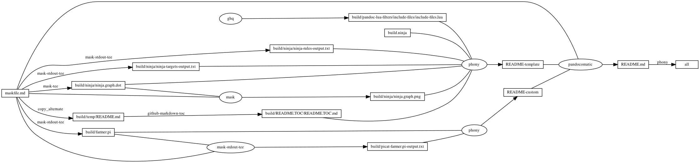

---
pandocomatic_:
    pandoc:
        from: markdown-smart+tex_math_dollars
        to: gfm+tex_math_dollars
        filter:
        - pandoc-include-code
        lua-filter:
        - ./build/pandoc-lua-filters/include-files/include-files.lua
        output: README.md
...

# farmer

<!-- markdownlint-disable MD007 MD030 -->
```{.include}
./build/README.TOC/README.TOC.md
```
<!-- markdownlint-enable MD007 MD030 -->

# farmer.comment.pi

[farmer.comment.pi](./farmer.comment.pi)

-   `import planner.`
    -   [Chapter 8 The planner Module](http://retina.inf.ufsc.br/picat_guide/#x1-1130008)

```{.picat include=./farmer.comment.pi snippet=import}
```

-   `main =>`
    -   [How to Run Programs Directly](http://retina.inf.ufsc.br/picat_guide/#x1-430002.1.5)
        -   Programs that define the `main/0` predicate or the `main/1` predicate
            can be run directly as a OS command.
-   `[s,s,s,s]`
    -   [Lists](http://retina.inf.ufsc.br/picat_guide/#x1-510003.4.1)
        -   A list takes the form $[t_1,\cdots,t_n]$,
            where each $t_i$ ($1 \leq i \leq n$) is a term.
            Let $L$ be a list.
-   `plan(S0,Plan)`
    -   [plan( _S_ , _Plan_ )](http://retina.inf.ufsc.br/picat_guide/#dx1-114003)
        -   This predicate is the same as the `plan/4` predicate,
            except that the limit is assumed to be `268435455`,
            and that the plan’s cost is not returned.
    -   [plan( _S_ , _Limit_ , _Plan_ , _Cost_ )](http://retina.inf.ufsc.br/picat_guide/#dx1-114001)
        -   This predicate, if it succeeds,
            binds _Plan_ to a plan that can transform state _S_ to a final state
            that satisfies the condition given by `final/1` or `final/3`.
            _Cost_ is the cost of _Plan_, which cannot exceed _Limit_,
            which is a given non-negative integer.
-   `println(Plan)`
    -   [println( _Term_ )](http://retina.inf.ufsc.br/picat_guide/#dx1-130006)
        -   This predicate is the same as `println(stdout,Term)`.
    -   [println( _FD_ , _Term_ )](http://retina.inf.ufsc.br/picat_guide/#dx1-130005)
        -   This predicate prints _Term_ and a newline.

```{.picat include=./farmer.comment.pi snippet=main}
```

-   `final([n,n,n,n]) => true.`
    -   [final( _S_ )](http://retina.inf.ufsc.br/picat_guide/#dx1-113003)
        -   This predicate succeeds if _S_ is a final state.

```{.picat include=./farmer.comment.pi snippet=final}
```

-   `action([F,F,G,C],S1,Action,ActionCost) ?=>`
    -   [Defining Predicates](http://retina.inf.ufsc.br/picat_guide/#x1-100001.2)
        -   A predicate is defined with pattern-matching rules.
            Picat has two types of pattern-matching rules:
            -   the non-backtrackable rule _Head_,_Cond_ => _Body_,
            -   and the backtrackable rule _Head_,_Cond_ ?=> _Body_.
-   `action([F,F,G,C],S1,Action,ActionCost)`
    -   [action( _S_ , _NextS_ , _Action_ , _ActionCost_ )](http://retina.inf.ufsc.br/picat_guide/#dx1-113005)
        -   This predicate encodes the state transition diagram of the planning problem.
            The state _S_ can be transformed into _NextS_ by performing _Action_.
            The cost of _Action_ is _ActionCost_.
            If the plan’s length is the only interest,
            then _ActionCost_ should be 1.

```{.picat include=./farmer.comment.pi snippet=action-farmer_wolf}
```

```{.picat include=./farmer.comment.pi snippet=action-farmer_goat}
```

```{.picat include=./farmer.comment.pi snippet=action-farmer_cabbage}
```

```{.picat include=./farmer.comment.pi snippet=action-farmer_alone}
```

<!-- markdownlint-disable MD013 -->
-   [`opposite`](#opposite)
    -   `index (+,-) (-,+)`
        -   [Horn Clauses](http://retina.inf.ufsc.br/picat_guide/#x1-130001.2)
            -   A predicate definition that consists of Horn clauses can
                be preceded by an `index declaration` in the form
                -   ${\rm index (}M_{11},\cdots,M_{1n}{\rm )\cdots(}M_{m1},\cdots,M_{mn}{\rm )}$
                -   where each $M_{ij}$ is either `+` (meaning indexed) or `-` (meaning not indexed).

<!-- markdownlint-enable MD013 -->

```{.picat include=./farmer.comment.pi snippet=opposite}
```

```{.picat include=./farmer.comment.pi snippet=unsafe}
```

# Mask SubCommands

[Mask Awesome](https://github.com/huzhenghui/mask-awesome)

## picat-farmer.pi

```bash
picat ./build/farmer.pi
```

### picat-farmer.pi-output

```{.plain include=./build/picat-farmer.pi-output.txt}
```

## curl-farmer.pi

```bash
curl http://picat-lang.org/exs/farmer.pi
```

### farmer.pi-output

```{.picat include=./build/farmer.pi}

```

## begin: mask task in template : build content

## ninja-rules

```bash
ninja -t rules
```

### ninja custom-rule

```{.ninja include=build.ninja snippet=custom-rule}
```

### ninja-rules-output

```{.plain include=./build/ninja/ninja-rules-output.txt}
```

## ninja-targets

```bash
ninja -t targets all
```

### ninja build-all

```{.ninja include=build.ninja snippet=build-all}
```

### ninja custom-build

```{.ninja include=build.ninja snippet=custom-build}

```

### ninja report-build

```{.ninja include=build.ninja snippet=report-build}

```

### ninja-targets-output

```{.plain include=./build/ninja/ninja-targets-output.txt}
```

## readme-md

```bash
ninja --verbose README.md
```

### ninja readme-build

```{.ninja include=build.ninja snippet=custom-readme-build}
```

```{.ninja include=build.ninja snippet=readme-build}
```

## end: mask task in template : build content

## begin: mask task in template : ninja command

## ninja-browse

```bash
ninja -t browse
```

## ninja-graph-png

```bash
dot -Tpng -o./build/ninja/ninja.graph.png ./build/ninja/ninja.graph.dot
```



## ninja-graph-dot-xdot

```bash
detach -- xdot "${MASKFILE_DIR}/build/ninja/ninja.graph.dot"
```

## ninja-graph-dot

```bash
ninja -t graph
```

### ninja-graph-dot-output

```{.dot include=./build/ninja/ninja.graph.dot}
```

## ninja-all

```bash
ninja --verbose
```

### build.ninja

```{.ninja include=./build.ninja}
```

## end: mask task in template : ninja command
