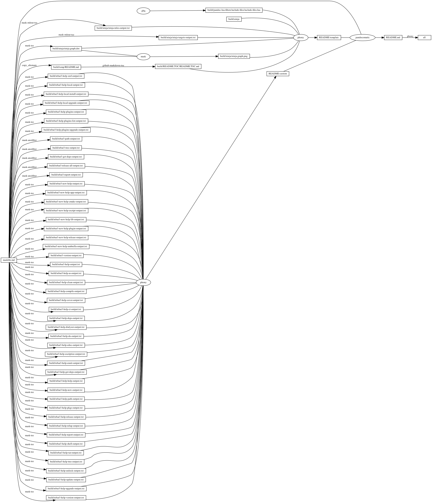

# rebar3

<!-- markdownlint-disable MD007 MD030 -->

-   [rebar3](#rebar3)
-   [Mask SubCommands](#mask-subcommands)
    -   [rebar-create-mochiwebapp](#rebar-create-mochiwebapp)
    -   [rebar3-path](#rebar3-path)
        -   [rebar3-path-output](#rebar3-path-output)
    -   [rebar3-tree](#rebar3-tree)
        -   [rebar3-tree-output](#rebar3-tree-output)
    -   [rebar3-shell](#rebar3-shell)
        -   [Open Site](#open-site)
        -   [Shell Command](#shell-command)
    -   [rebar3-get-deps](#rebar3-get-deps)
        -   [rebar3-get-deps-output](#rebar3-get-deps-output)
    -   [rebar3-release-all](#rebar3-release-all)
        -   [rebar3-release-all-output](#rebar3-release-all-output)
    -   [trash-mochiweb](#trash-mochiweb)
    -   [rebar3-report](#rebar3-report)
        -   [rebar3-report-output](#rebar3-report-output)
    -   [rebar3-new-help](#rebar3-new-help)
        -   [rebar3-new-help-output](#rebar3-new-help-output)
    -   [rebar3-new-help-app](#rebar3-new-help-app)
        -   [rebar3-new-help-app-output](#rebar3-new-help-app-output)
    -   [rebar3-new-help-cmake](#rebar3-new-help-cmake)
        -   [rebar3-new-help-cmake-output](#rebar3-new-help-cmake-output)
    -   [rebar3-new-help-escript](#rebar3-new-help-escript)
        -   [rebar3-new-help-escript-output](#rebar3-new-help-escript-output)
    -   [rebar3-new-help-lib](#rebar3-new-help-lib)
        -   [rebar3-new-help-lib-output](#rebar3-new-help-lib-output)
    -   [rebar3-new-help-plugin](#rebar3-new-help-plugin)
        -   [rebar3-new-help-plugin-output](#rebar3-new-help-plugin-output)
    -   [rebar3-new-help-release](#rebar3-new-help-release)
        -   [rebar3-new-help-release-output](#rebar3-new-help-release-output)
    -   [rebar3-new-help-umbrella](#rebar3-new-help-umbrella)
        -   [rebar3-new-help-umbrella-output](#rebar3-new-help-umbrella-output)
    -   [rebar3-version](#rebar3-version)
        -   [rebar3-version-output](#rebar3-version-output)
    -   [rebar3-help](#rebar3-help)
        -   [rebar3-help-output](#rebar3-help-output)
    -   [rebar3-help-as](#rebar3-help-as)
        -   [rebar3-help-as-output](#rebar3-help-as-output)
    -   [rebar3-help-clean](#rebar3-help-clean)
        -   [rebar3-help-clean-output](#rebar3-help-clean-output)
    -   [rebar3-help-compile](#rebar3-help-compile)
        -   [rebar3-help-compile-output](#rebar3-help-compile-output)
    -   [rebar3-help-cover](#rebar3-help-cover)
        -   [rebar3-help-cover-output](#rebar3-help-cover-output)
    -   [rebar3-help-ct](#rebar3-help-ct)
        -   [rebar3-help-ct-output](#rebar3-help-ct-output)
    -   [rebar3-help-deps](#rebar3-help-deps)
        -   [rebar3-help-deps-output](#rebar3-help-deps-output)
    -   [rebar3-help-dialyzer](#rebar3-help-dialyzer)
        -   [rebar3-help-dialyzer-output](#rebar3-help-dialyzer-output)
    -   [rebar3-help-do](#rebar3-help-do)
        -   [rebar3-help-do-output](#rebar3-help-do-output)
    -   [rebar3-help-edoc](#rebar3-help-edoc)
        -   [rebar3-help-edoc-output](#rebar3-help-edoc-output)
    -   [rebar3-help-escriptize](#rebar3-help-escriptize)
        -   [rebar3-help-escriptize-output](#rebar3-help-escriptize-output)
    -   [rebar3-help-eunit](#rebar3-help-eunit)
        -   [rebar3-help-eunit-output](#rebar3-help-eunit-output)
    -   [rebar3-help-get-deps](#rebar3-help-get-deps)
        -   [rebar3-help-get-deps-output](#rebar3-help-get-deps-output)
    -   [rebar3-help-help](#rebar3-help-help)
        -   [rebar3-help-help-output](#rebar3-help-help-output)
    -   [rebar3-help-new](#rebar3-help-new)
        -   [rebar3-help-new-output](#rebar3-help-new-output)
    -   [rebar3-help-path](#rebar3-help-path)
        -   [rebar3-help-path-output](#rebar3-help-path-output)
    -   [rebar3-help-pkgs](#rebar3-help-pkgs)
        -   [rebar3-help-pkgs-output](#rebar3-help-pkgs-output)
    -   [rebar3-help-release](#rebar3-help-release)
        -   [rebar3-help-release-output](#rebar3-help-release-output)
    -   [rebar3-help-relup](#rebar3-help-relup)
        -   [rebar3-help-relup-output](#rebar3-help-relup-output)
    -   [rebar3-help-report](#rebar3-help-report)
        -   [rebar3-help-report-output](#rebar3-help-report-output)
    -   [rebar3-help-shell](#rebar3-help-shell)
        -   [rebar3-help-shell-output](#rebar3-help-shell-output)
    -   [rebar3-help-tar](#rebar3-help-tar)
        -   [rebar3-help-tar-output](#rebar3-help-tar-output)
    -   [rebar3-help-tree](#rebar3-help-tree)
        -   [rebar3-help-tree-output](#rebar3-help-tree-output)
    -   [rebar3-help-unlock](#rebar3-help-unlock)
        -   [rebar3-help-unlock-output](#rebar3-help-unlock-output)
    -   [rebar3-help-update](#rebar3-help-update)
        -   [rebar3-help-update-output](#rebar3-help-update-output)
    -   [rebar3-help-upgrade](#rebar3-help-upgrade)
        -   [rebar3-help-upgrade-output](#rebar3-help-upgrade-output)
    -   [rebar3-help-version](#rebar3-help-version)
        -   [rebar3-help-version-output](#rebar3-help-version-output)
    -   [rebar3-help-xref](#rebar3-help-xref)
        -   [rebar3-help-xref-output](#rebar3-help-xref-output)
    -   [rebar3-help-local](#rebar3-help-local)
        -   [rebar3-help-local-output](#rebar3-help-local-output)
    -   [rebar3-help-local-install](#rebar3-help-local-install)
        -   [rebar3-help-local-install-output](#rebar3-help-local-install-output)
    -   [rebar3-help-local-upgrade](#rebar3-help-local-upgrade)
        -   [rebar3-help-local-upgrade-output](#rebar3-help-local-upgrade-output)
    -   [rebar3-help-plugins](#rebar3-help-plugins)
        -   [rebar3-help-plugins-output](#rebar3-help-plugins-output)
    -   [rebar3-help-plugins-list](#rebar3-help-plugins-list)
        -   [rebar3-help-plugins-list-output](#rebar3-help-plugins-list-output)
    -   [rebar3-help-plugins-upgrade](#rebar3-help-plugins-upgrade)
        -   [rebar3-help-plugins-upgrade-output](#rebar3-help-plugins-upgrade-output)
    -   [begin: mask task in template : build
        content](#begin-mask-task-in-template--build-content)
    -   [ninja-rules](#ninja-rules)
        -   [ninja custom-rule](#ninja-custom-rule)
        -   [ninja-rules-output](#ninja-rules-output)
    -   [ninja-targets](#ninja-targets)
        -   [ninja build-all](#ninja-build-all)
        -   [ninja custom-build](#ninja-custom-build)
        -   [ninja report-build](#ninja-report-build)
        -   [ninja-targets-output](#ninja-targets-output)
    -   [readme-md](#readme-md)
        -   [ninja readme-build](#ninja-readme-build)
    -   [end: mask task in template : build
        content](#end-mask-task-in-template--build-content)
    -   [begin: mask task in template : ninja
        command](#begin-mask-task-in-template--ninja-command)
    -   [ninja-browse](#ninja-browse)
    -   [ninja-graph-png](#ninja-graph-png)
    -   [ninja-graph-dot-xdot](#ninja-graph-dot-xdot)
    -   [ninja-graph-dot](#ninja-graph-dot)
        -   [ninja-graph-dot-output](#ninja-graph-dot-output)
    -   [ninja-all](#ninja-all)
        -   [build.ninja](#buildninja)
    -   [end: mask task in template : ninja
        command](#end-mask-task-in-template--ninja-command)

<!-- markdownlint-enable MD007 MD030 -->

# Mask SubCommands

[Mask Awesome](https://github.com/huzhenghui/mask-awesome)

## rebar-create-mochiwebapp

``` bash
dest="$(realpath ./mochiweb)"
ghq get --update --shallow https://github.com/mochi/mochiweb
cd "$(ghq list --full-path https://github.com/mochi/mochiweb)"
/usr/local/opt/rebar/bin/rebar \
    --recursive \
    create \
    template=mochiwebapp \
    dest="${dest}" \
    appid="appmochiweb"
```

## rebar3-path

``` bash
cd "$(realpath ./mochiweb)"
rebar3 path --base | xargs urelpath
rebar3 path --bin | xargs urelpath
rebar3 path --ebin | xargs urelpath
rebar3 path --lib | xargs urelpath
rebar3 path --priv | xargs urelpath
rebar3 path --src | xargs urelpath
rebar3 path --rel | xargs urelpath
```

### rebar3-path-output

``` plain
_build/default
../../mochiweb/ebin
_build/default/lib
_build/default/lib/appmochiweb/../../../../priv
../../../../../../mochiweb/src
```

## rebar3-tree

``` bash
cd "$(realpath ./mochiweb)"
rebar3 tree --verbose
```

### rebar3-tree-output

``` plain
===> Verifying dependencies...
===> Fetching mochiweb (from {git,"git://github.com/mochi/mochiweb.git",{branch,"master"}})
└─ appmochiweb─0.1 (project app)
   └─ mochiweb─2.21.0 (git://github.com/mochi/mochiweb.git)
```

## rebar3-shell

``` bash
cd "$(realpath ./mochiweb)"
rebar3 shell --apps appmochiweb
```

### Open Site

<http://localhost:8080/>

### Shell Command

-   `help().`

-   `q().`

## rebar3-get-deps

``` bash
cd "$(realpath ./mochiweb)"
rebar3 get-deps
```

### rebar3-get-deps-output

``` plain
===> Verifying dependencies...

```

## rebar3-release-all

``` bash
cd "$(realpath ./mochiweb)"
rebar3 release --all
```

### rebar3-release-all-output

``` plain
===> Verifying dependencies...
===> Fetching mochiweb (from {git,"git://github.com/mochi/mochiweb.git",{branch,"master"}})
===> Analyzing applications...
===> Compiling mochiweb
===> Analyzing applications...
===> Compiling appmochiweb

```

## trash-mochiweb

``` bash
trash "$(realpath ./mochiweb)"
```

## rebar3-report

``` bash
rebar3 report
```

### rebar3-report-output

<!-- markdownlint-disable MD013 -->

``` plain
Rebar3 report
 version 3.16.1
 generated at 2021-06-19T04:08:00+00:00
=================
Please submit this along with your issue at https://github.com/erlang/rebar3/issues (and feel free to edit out private information, if any)
-----------------
Task: 
Entered as:
  
-----------------
Operating System: x86_64-apple-darwin20.4.0
ERTS: Erlang/OTP 24 [erts-12.0.2] [source] [64-bit] [smp:12:12] [ds:12:12:10] [async-threads:1] [jit] [dtrace]
Root Directory: /usr/local/Cellar/erlang/24.0.2/lib/erlang
Library directory: /usr/local/Cellar/erlang/24.0.2/lib/erlang/lib
-----------------
Loaded Applications:
bbmustache: 1.10.0
certifi: 2.6.1
cf: 0.3.1
common_test: 1.20.4
compiler: 8.0.1
crypto: 5.0.2
cth_readable: 1.5.1
dialyzer: 4.4
edoc: 1.0
erlware_commons: 1.5.0
eunit: 2.6.1
eunit_formatters: 0.5.0
getopt: 1.0.1
inets: 7.4
kernel: 8.0.1
providers: 1.8.1
public_key: 1.11
relx: 4.4.0
sasl: 4.1
snmp: 5.9.1
ssl_verify_fun: 1.1.6
stdlib: 3.15.1
syntax_tools: 2.6
tools: 3.5

-----------------
Escript path: /usr/local/bin/rebar3
Providers:
  app_discovery as clean compile compile cover ct deps dialyzer do edoc escriptize eunit get-deps help install install_deps list lock new path pkgs release relup report repos shell state tar tree unlock update upgrade upgrade upgrade version xref 
```

<!-- markdownlint-enable MD013 -->

## rebar3-new-help

``` bash
rebar3 new help
```

### rebar3-new-help-output

``` plain
Call `rebar3 new help <template>` for a detailed description

app (built-in): Complete OTP Application structure.
cmake (built-in): Standalone Makefile for building C/C++ in c_src
escript (built-in): Complete escriptized application structure
lib (built-in): Complete OTP Library application (no processes) structure
plugin (built-in): Rebar3 plugin project structure
release (built-in): OTP Release structure for executable programs
umbrella (built-in): OTP structure for executable programs (alias of 'release' template)
```

## rebar3-new-help-app

``` bash
rebar3 new help app
```

### rebar3-new-help-app-output

<!-- markdownlint-disable MD010 -->

``` plain
app:
	built-in template
	Description: Complete OTP Application structure.
	Variables:
		name="mylib" (Name of the OTP application)
		desc="An OTP application" (Short description of the app)
		date="2021-06-19"
		datetime="2021-06-19T04:08:02+00:00"
		author_name=[32993,20105,36745]
		author_email="hu@daonao.com"
		copyright_year="2021"
		apps_dir="apps" (Directory where applications will be created if needed)

```

<!-- markdownlint-enable MD010 -->

## rebar3-new-help-cmake

``` bash
rebar3 new help cmake
```

### rebar3-new-help-cmake-output

<!-- markdownlint-disable MD010 -->

``` plain
cmake:
	built-in template
	Description: Standalone Makefile for building C/C++ in c_src
	Variables:
		date="2021-06-19"
		datetime="2021-06-19T04:08:07+00:00"
		author_name=[32993,20105,36745]
		author_email="hu@daonao.com"
		copyright_year="2021"
		apps_dir="apps" (Directory where applications will be created if needed)

```

<!-- markdownlint-enable MD010 -->

## rebar3-new-help-escript

``` bash
rebar3 new help escript
```

### rebar3-new-help-escript-output

<!-- markdownlint-disable MD010 -->

``` plain
escript:
	built-in template
	Description: Complete escriptized application structure
	Variables:
		name="mylib" (Name of the OTP application to be escriptized)
		desc="An escript" (Short description of the project)
		date="2021-06-19"
		datetime="2021-06-19T04:08:13+00:00"
		author_name=[32993,20105,36745]
		author_email="hu@daonao.com"
		copyright_year="2021"
		apps_dir="apps" (Directory where applications will be created if needed)

```

<!-- markdownlint-enable MD010 -->

## rebar3-new-help-lib

``` bash
rebar3 new help lib
```

### rebar3-new-help-lib-output

<!-- markdownlint-disable MD010 -->

``` plain
lib:
	built-in template
	Description: Complete OTP Library application (no processes) structure
	Variables:
		name="mylib" (Name of the OTP library application)
		desc="An OTP library" (Short description of the app)
		date="2021-06-19"
		datetime="2021-06-19T04:08:09+00:00"
		author_name=[32993,20105,36745]
		author_email="hu@daonao.com"
		copyright_year="2021"
		apps_dir="apps" (Directory where applications will be created if needed)

```

<!-- markdownlint-enable MD010 -->

## rebar3-new-help-plugin

``` bash
rebar3 new help plugin
```

### rebar3-new-help-plugin-output

<!-- markdownlint-disable MD010 -->

``` plain
plugin:
	built-in template
	Description: Rebar3 plugin project structure
	Variables:
		name="myplugin" (Name of the plugin)
		desc="A rebar plugin" (Short description of the plugin's purpose)
		date="2021-06-19"
		datetime="2021-06-19T04:08:16+00:00"
		author_name=[32993,20105,36745]
		author_email="hu@daonao.com"
		copyright_year="2021"
		apps_dir="apps" (Directory where applications will be created if needed)

```

<!-- markdownlint-enable MD010 -->

## rebar3-new-help-release

``` bash
rebar3 new help release
```

### rebar3-new-help-release-output

<!-- markdownlint-disable MD010 -->

``` plain
release:
	built-in template
	Description: OTP Release structure for executable programs
	Variables:
		name="myapp" (Name of the OTP release. An app with this name will also be created.)
		desc="An OTP application" (Short description of the release's main app's purpose)
		date="2021-06-19"
		datetime="2021-06-19T04:08:15+00:00"
		author_name=[32993,20105,36745]
		author_email="hu@daonao.com"
		copyright_year="2021"
		apps_dir="apps" (Directory where applications will be created if needed)

```

<!-- markdownlint-enable MD010 -->

## rebar3-new-help-umbrella

``` bash
rebar3 new help umbrella
```

### rebar3-new-help-umbrella-output

<!-- markdownlint-disable MD010 -->

``` plain
umbrella:
	built-in template
	Description: OTP structure for executable programs (alias of 'release' template)
	Variables:
		name="myapp" (Name of the OTP release. An app with this name will also be created.)
		desc="An OTP application" (Short description of the release's main app's purpose)
		date="2021-06-19"
		datetime="2021-06-19T04:08:21+00:00"
		author_name=[32993,20105,36745]
		author_email="hu@daonao.com"
		copyright_year="2021"
		apps_dir="apps" (Directory where applications will be created if needed)

```

<!-- markdownlint-enable MD010 -->

## rebar3-version

``` bash
rebar3 --version
```

### rebar3-version-output

``` plain
rebar 3.16.1 on Erlang/OTP 24 Erts 12.0.2
```

## rebar3-help

``` bash
rebar3 --help
```

### rebar3-help-output

<!-- markdownlint-disable MD013 -->

``` plain
Rebar3 is a tool for working with Erlang projects.

Usage: rebar3 [-h] [-v] [<task>]

  -h, --help     Print this help.
  -v, --version  Show version information.
  <task>         Task to run.

  Set the environment variable DEBUG=1 for detailed output.

Several tasks are available:

as                Higher order provider for running multiple tasks in a sequence as a certain profiles.
clean             Remove compiled beam files from apps.
compile           Compile apps .app.src and .erl files.
cover             Perform coverage analysis.
ct                Run Common Tests.
deps              List dependencies
dialyzer          Run the Dialyzer analyzer on the project.
do                Higher order provider for running multiple tasks in a sequence.
edoc              Generate documentation using edoc.
escriptize        Generate escript archive.
eunit             Run EUnit Tests.
get-deps          Fetch dependencies.
help              Display a list of tasks or help for a given task or subtask.
new               Create new project from templates.
path              Print paths to build dirs in current profile.
pkgs              List information for a package.
release           Build release of project.
relup             Create relup of releases.
report            Provide a crash report to be sent to the rebar3 issues page.
shell             Run shell with project apps and deps in path.
tar               Tar archive of release built of project.
tree              Print dependency tree.
unlock            Unlock dependencies.
update            Update package index.
upgrade           Upgrade dependencies.
version           Print version for rebar and current Erlang.
xref              Run cross reference analysis.

local <task>:
  install        Extract libs from rebar3 escript along with a run script.
  upgrade        Download latest rebar3 escript and extract.

plugins <task>:
  list           List local and global plugins for this project
  upgrade        Upgrade plugins

Run 'rebar3 help <TASK>' for details.
```

<!-- markdownlint-enable MD013 -->

## rebar3-help-as

``` bash
rebar3 help as
```

### rebar3-help-as-output

``` plain
Higher order provider for running multiple tasks in a sequence as a certain profiles.
Usage: rebar3 as [<profile>]

  <profile>  Profiles to run as.

```

## rebar3-help-clean

``` bash
rebar3 help clean
```

### rebar3-help-clean-output

``` plain
Remove compiled beam files from apps.
Usage: rebar3 clean [-a] [--apps <apps>] [-p <profile>]

  -a, --all      Clean all apps include deps
  --apps         Clean a specific list of apps or dependencies
  -p, --profile  Clean under profile. Equivalent to `rebar3 as <profile> 
                 clean`

```

## rebar3-help-compile

``` bash
rebar3 help compile
```

### rebar3-help-compile-output

``` plain
Compile apps .app.src and .erl files.
Usage: rebar3 compile [-d]

  -d, --deps_only  Only compile dependencies, no project apps will be 
                   built.

```

## rebar3-help-cover

``` bash
rebar3 help cover
```

### rebar3-help-cover-output

``` plain
Perform coverage analysis.
Usage: rebar3 cover [-r <reset>] [-v <verbose>] [-m <min_coverage>]

  -r, --reset         Reset all coverdata.
  -v, --verbose       Print coverage analysis.
  -m, --min_coverage  Mandate a coverage percentage required to succeed 
                      (0..100)

```

## rebar3-help-ct

``` bash
rebar3 help ct
```

### rebar3-help-ct-output

``` plain
Run Common Tests.
Usage: rebar3 ct [--dir <dir>] [--suite <suite>] [--group <group>]
                 [--case <testcase>] [--label <label>]
                 [--config <config>] [--spec <spec>]
                 [--join_specs <join_specs>]
                 [--allow_user_terms <allow_user_terms>]
                 [--logdir <logdir>] [--logopts <logopts>]
                 [--verbosity <verbosity>] [-c [<cover>]]
                 [--cover_export_name <cover_export_name>]
                 [--repeat <repeat>] [--duration <duration>]
                 [--until <until>] [--force_stop <force_stop>]
                 [--basic_html <basic_html>] [--stylesheet <stylesheet>]
                 [--decrypt_key <decrypt_key>]
                 [--decrypt_file <decrypt_file>]
                 [--abort_if_missing_suites [<abort_if_missing_suites>]]
                 [--multiply_timetraps <multiply_timetraps>]
                 [--scale_timetraps <scale_timetraps>]
                 [--create_priv_dir <create_priv_dir>]
                 [--include <include>] [--readable <readable>]
                 [-v <verbose>] [--name <name>] [--sname <sname>]
                 [--setcookie <setcookie>] [--sys_config <sys_config>]
                 [--compile_only <compile_only>] [--retry <retry>]
                 [--fail_fast [<fail_fast>]]

  --dir                      List of additional directories containing 
                             test suites
  --suite                    List of test suites to run
  --group                    List of test groups to run
  --case                     List of test cases to run
  --label                    Test label
  --config                   List of config files
  --spec                     List of test specifications
  --join_specs               Merge all test specifications and perform a 
                             single test run
  --allow_user_terms         Allow user defined config values in config 
                             files
  --logdir                   Log folder
  --logopts                  Options for common test logging
  --verbosity                Verbosity
  -c, --cover                Generate cover data [default: false]
  --cover_export_name        Base name of the coverdata file to write
  --repeat                   How often to repeat tests
  --duration                 Max runtime (format: HHMMSS)
  --until                    Run until (format: HHMMSS)
  --force_stop               Force stop on test timeout (true | false | 
                             skip_rest)
  --basic_html               Show basic HTML
  --stylesheet               CSS stylesheet to apply to html output
  --decrypt_key              Path to key for decrypting config
  --decrypt_file             Path to file containing key for decrypting 
                             config
  --abort_if_missing_suites  Abort if suites are missing [default: true]
  --multiply_timetraps
  --scale_timetraps          Scale timetraps
  --create_priv_dir          Create priv dir (auto_per_run | auto_per_tc | 
                             manual_per_tc)
  --include                  Directories containing additional include 
                             files
  --readable                 Shows test case names and only displays logs 
                             to shell on failures (true | compact | false)
  -v, --verbose              Verbose output
  --name                     Gives a long name to the node
  --sname                    Gives a short name to the node
  --setcookie                Sets the cookie if the node is distributed
  --sys_config               List of application config files
  --compile_only             Compile modules in the project with the test 
                             configuration but do not run the tests
  --retry                    Experimental feature. If any specification 
                             for previously failing test is found, runs 
                             them.
  --fail_fast                Experimental feature. If any test fails, the 
                             run is aborted. Since common test does not 
                             support this natively, we abort the rebar3 
                             run on a failure. This May break CT's disk 
                             logging and other rebar3 features. [default: 
                             false]

```

## rebar3-help-deps

``` bash
rebar3 help deps
```

### rebar3-help-deps-output

<!-- markdownlint-disable MD013 -->

``` plain
List dependencies. Those not matching the config file are followed by an asterisk (*).
Usage: rebar3 deps
```

<!-- markdownlint-enable MD013 -->

## rebar3-help-dialyzer

``` bash
rebar3 help dialyzer
```

### rebar3-help-dialyzer-output

<!-- markdownlint-disable MD013 -->

``` plain
Run the Dialyzer analyzer on the project.

This command will build, and keep up-to-date, a suitable PLT and will use it to carry out success typing analysis on the current project.

The following (optional) configurations can be added to a `proplist` of options `dialyzer` in rebar.config:
`warnings` - a list of dialyzer warnings
`get_warnings` - display warnings when altering a PLT file (boolean)
`plt_apps` - the strategy for determining the applications which included in the PLT file, `top_level_deps` to include just the direct dependencies or `all_deps` to include all nested dependencies or `all_apps` to include all project apps and nested dependencies*
`plt_extra_apps` - a list of extra applications to include in the PLT file
`plt_extra_mods` - a list of extra modules to includes in the PLT file
`plt_location` - the location of the PLT file, `local` to store in the profile's base directory (default) or a custom directory.
`plt_prefix` - the prefix to the PLT file, defaults to "rebar3"**
`base_plt_apps` - a list of applications to include in the base PLT file***
`base_plt_mods` - a list of modules to include in the base PLT file***
`base_plt_location` - the location of base PLT file, `global` to store in $HOME/.cache/rebar3 (default) or  a custom directory***
`base_plt_prefix` - the prefix to the base PLT file, defaults to "rebar3"** ***
`exclude_apps` - a list of applications to exclude from PLT files and success typing analysis, `plt_extra_mods` and `base_plt_mods` can add modules from excluded applications
`exclude_mods` - a list of modules to exclude from PLT files and success typing analysis
`output_format` - configure whether the dialyzer_warnings file will have the `raw` or `formatted` output

For example, to warn on unmatched returns: 
{dialyzer, [{warnings, [unmatched_returns]}]}.

*The direct dependent applications are listed in `applications` and `included_applications` of their .app files.
**PLT files are named "<prefix>_<otp_release>_plt".
***The base PLT is a PLT containing the core applications often required for a project's PLT. One base PLT is created per OTP version and stored in `base_plt_location`. A base PLT is used to build project PLTs.

Usage: rebar3 dialyzer [-u <update_plt>] [-s <succ_typings>]
                       [--base-plt-location <base_plt_location>]
                       [--plt-location <plt_location>]
                       [--plt-prefix <plt_prefix>] [-a <app>]
                       [--base-plt-prefix <base_plt_prefix>]
                       [--statistics <statistics>]

  -u, --update-plt     Enable updating the PLT. Default: true
  -s, --succ-typings   Enable success typing analysis. Default: true
  --base-plt-location  The location of base PLT file, defaults to 
                       $HOME/.cache/rebar3
  --plt-location       The location of the PLT file, defaults to the 
                       profile's base directory
  --plt-prefix         The prefix to the PLT file, defaults to "rebar3"
  -a, --app            Perform success typing analysis of a single 
                       application
  --base-plt-prefix    The prefix to the base PLT file, defaults to 
                       "rebar3"
  --statistics         Print information about the progress of execution. 
                       Default: false

```

<!-- markdownlint-enable MD013 -->

## rebar3-help-do

``` bash
rebar3 help do
```

### rebar3-help-do-output

``` plain
Higher order provider for running multiple tasks in a sequence.
Usage: rebar3 do
```

## rebar3-help-edoc

``` bash
rebar3 help edoc
```

### rebar3-help-edoc-output

``` plain
Generate documentation using edoc.
Usage: rebar3 edoc
```

## rebar3-help-escriptize

``` bash
rebar3 help escriptize
```

### rebar3-help-escriptize-output

<!-- markdownlint-disable MD013 -->

``` plain
Generate an escript executable containing the project's and its dependencies' BEAM files.
Usage: rebar3 escriptize [-a <main_app>]

  -a, --main-app  Specify the name of the application to build an escript 
                  for.

```

<!-- markdownlint-enable MD013 -->

## rebar3-help-eunit

``` bash
rebar3 help eunit
```

### rebar3-help-eunit-output

``` plain
Run EUnit Tests.
Usage: rebar3 eunit [--app <app>] [--application <application>]
                    [-c <cover>]
                    [--cover_export_name <cover_export_name>]
                    [-p <profile>] [-d <dir>] [-f <file>] [-m <module>]
                    [-s <suite>] [-g <generator>] [-v <verbose>]
                    [--name <name>] [--sname <sname>]
                    [--sys_config <sys_config>] [--setcookie <setcookie>]

  --app                Comma separated list of application test suites to 
                       run. Equivalent to `[{application, App}]`.
  --application        Comma separated list of application test suites to 
                       run. Equivalent to `[{application, App}]`.
  -c, --cover          Generate cover data. Defaults to false.
  --cover_export_name  Base name of the coverdata file to write
  -p, --profile        Show the slowest tests. Defaults to false.
  -d, --dir            Comma separated list of dirs to load tests from. 
                       Equivalent to `[{dir, Dir}]`.
  -f, --file           Comma separated list of files to load tests from. 
                       Equivalent to `[{file, File}]`.
  -m, --module         Comma separated list of modules to load tests from. 
                       Equivalent to `[{module, Module}]`.
  -s, --suite          Comma separated list of modules to load tests from. 
                       Equivalent to `[{module, Module}]`.
  -g, --generator      Comma separated list of generators (the format is 
                       `module:function`) to load tests from. Equivalent 
                       to `[{generator, Module, Function}]`.
  -v, --verbose        Verbose output. Defaults to false.
  --name               Gives a long name to the node
  --sname              Gives a short name to the node
  --sys_config         List of application config files
  --setcookie          Sets the cookie if the node is distributed

```

## rebar3-help-get-deps

``` bash
rebar3 help get-deps
```

### rebar3-help-get-deps-output

``` plain
Fetch project dependencies.
Usage: rebar3 'get-deps'
```

## rebar3-help-help

``` bash
rebar3 help help
```

### rebar3-help-help-output

``` plain
Display a list of tasks or help for a given task or subtask.
Usage: rebar3 help [<help_task>]

  <help_task>  Task to print help for.

```

## rebar3-help-new

``` bash
rebar3 help new
```

### rebar3-help-new-output

``` plain
Create rebar3 project based on template and vars.

Valid command line options:
  <template> [var=foo,...]

See available templates with: `rebar3 new help`

Usage: rebar3 new [-f]

  -f, --force  overwrite existing files

```

## rebar3-help-path

``` bash
rebar3 help path
```

### rebar3-help-path-output

``` plain
Print paths to build dirs in current profile.
Usage: rebar3 path [--app <app>] [--base <base>] [--bin <bin>]
                   [--ebin <ebin>] [--lib <lib>] [--priv <priv>]
                   [-s <separator>] [--src <src>] [--rel <rel>]

  --app            Comma separated list of applications to return paths 
                   for.
  --base           Return the `base' path of the current profile.
  --bin            Return the `bin' path of the current profile.
  --ebin           Return all `ebin' paths of the current profile's 
                   applications.
  --lib            Return the `lib' path of the current profile.
  --priv           Return the `priv' path of the current profile's 
                   applications.
  -s, --separator  In case of multiple return paths, the separator 
                   character to use to join them.
  --src            Return the `src' path of the current profile's 
                   applications.
  --rel            Return the `rel' path of the current profile.

```

## rebar3-help-pkgs

``` bash
rebar3 help pkgs
```

### rebar3-help-pkgs-output

``` plain
List information for a package.

Usage: rebar3 pkgs [<package>]

  <package>  Package to fetch information for.

```

## rebar3-help-release

``` bash
rebar3 help release
```

### rebar3-help-release-output

``` plain
Build release of project.
Usage: rebar3 release [--all <all>] [-n <relname>] [-v <relvsn>]
                      [-u <upfrom>] [-o <output_dir>] [-h] [-l <lib_dir>]
                      [-d <dev_mode>] [-i <include_erts>] [-a <override>]
                      [-c [<config>]] [--overlay_vars <overlay_vars>]
                      [--vm_args <vm_args>] [--sys_config <sys_config>]
                      [--system_libs <system_libs>] [--version]
                      [-r <root_dir>]

  --all               If true runs the command against all configured  
                      releases
  -n, --relname       Specify the name for the release that will be 
                      generated
  -v, --relvsn        Specify the version for the release
  -u, --upfrom        Only valid with relup target, specify the release to 
                      upgrade from
  -o, --output-dir    The output directory for the release. This is `./` 
                      by default.
  -h, --help          Print usage
  -l, --lib-dir       Additional dir that should be searched for OTP Apps
  -d, --dev-mode      Symlink the applications and configuration into the 
                      release instead of copying
  -i, --include-erts  If true include a copy of erts used to build with, 
                      if a path include erts at that path. If false, do 
                      not include erts
  -a, --override      Provide an app name and a directory to override in 
                      the form <appname>:<app directory>
  -c, --config        The path to a config file [default: ]
  --overlay_vars      Path to a file of overlay variables
  --vm_args           Path to a file to use for vm.args
  --sys_config        Path to a file to use for sys.config
  --system_libs       Boolean or path to dir of Erlang system libs
  --version           Print relx version
  -r, --root          The project root directory

```

## rebar3-help-relup

``` bash
rebar3 help relup
```

### rebar3-help-relup-output

``` plain
Create relup of releases.
Usage: rebar3 relup [--all <all>] [-n <relname>] [-v <relvsn>]
                    [-u <upfrom>] [-o <output_dir>] [-h] [-l <lib_dir>]
                    [-d <dev_mode>] [-i <include_erts>] [-a <override>]
                    [-c [<config>]] [--overlay_vars <overlay_vars>]
                    [--vm_args <vm_args>] [--sys_config <sys_config>]
                    [--system_libs <system_libs>] [--version]
                    [-r <root_dir>]

  --all               If true runs the command against all configured  
                      releases
  -n, --relname       Specify the name for the release that will be 
                      generated
  -v, --relvsn        Specify the version for the release
  -u, --upfrom        Only valid with relup target, specify the release to 
                      upgrade from
  -o, --output-dir    The output directory for the release. This is `./` 
                      by default.
  -h, --help          Print usage
  -l, --lib-dir       Additional dir that should be searched for OTP Apps
  -d, --dev-mode      Symlink the applications and configuration into the 
                      release instead of copying
  -i, --include-erts  If true include a copy of erts used to build with, 
                      if a path include erts at that path. If false, do 
                      not include erts
  -a, --override      Provide an app name and a directory to override in 
                      the form <appname>:<app directory>
  -c, --config        The path to a config file [default: ]
  --overlay_vars      Path to a file of overlay variables
  --vm_args           Path to a file to use for vm.args
  --sys_config        Path to a file to use for sys.config
  --system_libs       Boolean or path to dir of Erlang system libs
  --version           Print relx version
  -r, --root          The project root directory

```

## rebar3-help-report

``` bash
rebar3 help report
```

### rebar3-help-report-output

``` plain
Provide a crash report to be sent to the rebar3 issues page.
Usage: rebar3 report [<task>]

  <task>  Task to print details for.

```

## rebar3-help-shell

``` bash
rebar3 help shell
```

### rebar3-help-shell-output

``` plain
Start a shell with project and deps preloaded similar to
'erl -pa ebin -pa deps/*/ebin'.

Usage: rebar3 shell [--config <config>] [--name <name>] [--sname <sname>]
                    [--setcookie <setcookie>] [--script <script_file>]
                    [--apps <apps>] [-r <relname>] [-v <relvsn>]
                    [--start-clean <start_clean>] [--env-file <env_file>]
                    [--user_drv_args <user_drv_args>]

  --config         Path to the config file to use. Defaults to {shell, 
                   [{config, File}]} and then the relx sys.config file if 
                   not specified.
  --name           Gives a long name to the node.
  --sname          Gives a short name to the node.
  --setcookie      Sets the cookie if the node is distributed.
  --script         Path to an escript file to run before starting the 
                   project apps. Defaults to rebar.config {shell, 
                   [{script_file, File}]} if not specified.
  --apps           A list of apps to boot before starting the shell. (E.g. 
                   --apps app1,app2,app3) Defaults to rebar.config {shell, 
                   [{apps, Apps}]} or relx apps if not specified.
  -r, --relname    Name of the release to use as a template for the shell 
                   session
  -v, --relvsn     Version of the release to use for the shell session
  --start-clean    Cancel any applications in the 'apps' list or release.
  --env-file       Path to file of os environment variables to setup 
                   before expanding vars in config files.
  --user_drv_args  Arguments passed to user_drv start function for 
                   creating custom shells.

```

## rebar3-help-tar

``` bash
rebar3 help tar
```

### rebar3-help-tar-output

``` plain
Tar archive of release built of project.
Usage: rebar3 tar [--all <all>] [-n <relname>] [-v <relvsn>] [-u <upfrom>]
                  [-o <output_dir>] [-h] [-l <lib_dir>] [-d <dev_mode>]
                  [-i <include_erts>] [-a <override>] [-c [<config>]]
                  [--overlay_vars <overlay_vars>] [--vm_args <vm_args>]
                  [--sys_config <sys_config>]
                  [--system_libs <system_libs>] [--version]
                  [-r <root_dir>]

  --all               If true runs the command against all configured  
                      releases
  -n, --relname       Specify the name for the release that will be 
                      generated
  -v, --relvsn        Specify the version for the release
  -u, --upfrom        Only valid with relup target, specify the release to 
                      upgrade from
  -o, --output-dir    The output directory for the release. This is `./` 
                      by default.
  -h, --help          Print usage
  -l, --lib-dir       Additional dir that should be searched for OTP Apps
  -d, --dev-mode      Symlink the applications and configuration into the 
                      release instead of copying
  -i, --include-erts  If true include a copy of erts used to build with, 
                      if a path include erts at that path. If false, do 
                      not include erts
  -a, --override      Provide an app name and a directory to override in 
                      the form <appname>:<app directory>
  -c, --config        The path to a config file [default: ]
  --overlay_vars      Path to a file of overlay variables
  --vm_args           Path to a file to use for vm.args
  --sys_config        Path to a file to use for sys.config
  --system_libs       Boolean or path to dir of Erlang system libs
  --version           Print relx version
  -r, --root          The project root directory

```

## rebar3-help-tree

``` bash
rebar3 help tree
```

### rebar3-help-tree-output

``` plain
Usage: rebar3 tree [-v]

  -v, --verbose  Print repo and branch/tag/ref for git and hg deps

```

## rebar3-help-unlock

``` bash
rebar3 help unlock
```

### rebar3-help-unlock-output

<!-- markdownlint-disable MD013 -->

``` plain
Unlock project dependencies. Mentioning no application will unlock all dependencies. To unlock specific dependencies, their name can be listed in the command.
Usage: rebar3 unlock [<package>]

  <package>  List of packages to unlock. If not specified, all 
             dependencies are unlocked.

```

<!-- markdownlint-enable MD013 -->

## rebar3-help-update

``` bash
rebar3 help update
```

### rebar3-help-update-output

``` plain
Update package index.
Usage: rebar3 update
```

## rebar3-help-upgrade

``` bash
rebar3 help upgrade
```

### rebar3-help-upgrade-output

<!-- markdownlint-disable MD013 -->

``` plain
Upgrade project dependencies. Mentioning no application will upgrade all dependencies. To upgrade specific dependencies, their names can be listed in the command.
Usage: rebar3 upgrade [<package>]

  <package>  List of packages to upgrade. If not specified, all 
             dependencies are upgraded.

```

<!-- markdownlint-enable MD013 -->

## rebar3-help-version

``` bash
rebar3 help version
```

### rebar3-help-version-output

``` plain
Print version for rebar and current Erlang.
Usage: rebar3 version
```

## rebar3-help-xref

``` bash
rebar3 help xref
```

### rebar3-help-xref-output

``` plain
Run cross reference analysis.

Valid rebar.config options:
  {xref_warnings,false}
  {xref_extra_paths,[]}
  {xref_checks,[undefined_function_calls,undefined_functions,locals_not_used,
                exports_not_used,deprecated_function_calls,
                deprecated_functions]}
  {xref_queries,[{"(xc - uc) || (xu - x - b - (\"mod\":\".*foo\"/\"4\"))",
                  []}]}

Usage: rebar3 xref
```

## rebar3-help-local

``` bash
rebar3 help local
```

### rebar3-help-local-output

``` plain
local <task>:
  install        Extract libs from rebar3 escript along with a run script.
  upgrade        Download latest rebar3 escript and extract.
```

## rebar3-help-local-install

``` bash
rebar3 help local install
```

### rebar3-help-local-install-output

``` plain
Usage: rebar3 local install
```

## rebar3-help-local-upgrade

``` bash
rebar3 help local upgrade
```

### rebar3-help-local-upgrade-output

``` plain
Usage: rebar3 local upgrade
```

## rebar3-help-plugins

``` bash
rebar3 help plugins
```

### rebar3-help-plugins-output

``` plain
plugins <task>:
  list           List local and global plugins for this project
  upgrade        Upgrade plugins
```

## rebar3-help-plugins-list

``` bash
rebar3 help plugins list
```

### rebar3-help-plugins-list-output

``` plain
List local and global plugins for this project
Usage: rebar3 plugins list
```

## rebar3-help-plugins-upgrade

``` bash
rebar3 help plugins upgrade
```

### rebar3-help-plugins-upgrade-output

``` plain
List or upgrade plugins
Usage: rebar3 plugins upgrade [<plugin>]

  <plugin>  Plugin to upgrade

```

## begin: mask task in template : build content

## ninja-rules

``` bash
ninja -t rules
```

### ninja custom-rule

``` ninja
# custom rule here

```

### ninja-rules-output

``` plain
cmdshelf-repository
copy_alternate
dot
ghq
github-markdown-toc
jupyter-nbconvert-markdown
mask
mask-ansifilter
mask-man-markdown
mask-screenshot
mask-stderr-tee
mask-stdout-csv-markdown
mask-stdout-json
mask-stdout-tee
mask-tee
pandocomatic
phony
```

## ninja-targets

``` bash
ninja -t targets all
```

### ninja build-all

``` ninja
build all: phony README.md

default all

```

### ninja custom-build

``` ninja
# custom build here

```

### ninja report-build

``` ninja
# report build here

```

### ninja-targets-output

``` plain
all: phony
build/pandoc-lua-filters/include-files/include-files.lua: ghq
build/ninja/ninja-rules-output.txt: mask-stdout-tee
build/ninja/ninja-targets-output.txt: mask-stdout-tee
build/ninja/ninja.graph.dot: mask-tee
build/ninja/ninja.graph.png: mask
build/temp/README.md: copy_alternate
build/README.TOC/README.TOC.md: github-markdown-toc
README-template: phony
build/rebar3-path-output.txt: mask-ansifilter
build/rebar3-tree-output.txt: mask-ansifilter
build/rebar3-get-deps-output.txt: mask-ansifilter
build/rebar3-release-all-output.txt: mask-ansifilter
build/rebar3-report-output.txt: mask-ansifilter
build/rebar3-new-help-output.txt: mask-tee
build/rebar3-new-help-app-output.txt: mask-tee
build/rebar3-new-help-cmake-output.txt: mask-tee
build/rebar3-new-help-escript-output.txt: mask-tee
build/rebar3-new-help-lib-output.txt: mask-tee
build/rebar3-new-help-plugin-output.txt: mask-tee
build/rebar3-new-help-release-output.txt: mask-tee
build/rebar3-new-help-umbrella-output.txt: mask-tee
build/rebar3-version-output.txt: mask-tee
build/rebar3-help-output.txt: mask-tee
build/rebar3-help-as-output.txt: mask-tee
build/rebar3-help-clean-output.txt: mask-tee
build/rebar3-help-compile-output.txt: mask-tee
build/rebar3-help-cover-output.txt: mask-tee
build/rebar3-help-ct-output.txt: mask-tee
build/rebar3-help-deps-output.txt: mask-tee
build/rebar3-help-dialyzer-output.txt: mask-tee
build/rebar3-help-do-output.txt: mask-tee
build/rebar3-help-edoc-output.txt: mask-tee
build/rebar3-help-escriptize-output.txt: mask-tee
build/rebar3-help-eunit-output.txt: mask-tee
build/rebar3-help-get-deps-output.txt: mask-tee
build/rebar3-help-help-output.txt: mask-tee
build/rebar3-help-new-output.txt: mask-tee
build/rebar3-help-path-output.txt: mask-tee
build/rebar3-help-pkgs-output.txt: mask-tee
build/rebar3-help-release-output.txt: mask-tee
build/rebar3-help-relup-output.txt: mask-tee
build/rebar3-help-report-output.txt: mask-tee
build/rebar3-help-shell-output.txt: mask-tee
build/rebar3-help-tar-output.txt: mask-tee
build/rebar3-help-tree-output.txt: mask-tee
build/rebar3-help-unlock-output.txt: mask-tee
build/rebar3-help-update-output.txt: mask-tee
build/rebar3-help-upgrade-output.txt: mask-tee
build/rebar3-help-version-output.txt: mask-tee
build/rebar3-help-xref-output.txt: mask-tee
build/rebar3-help-local-output.txt: mask-tee
build/rebar3-help-local-install-output.txt: mask-tee
build/rebar3-help-local-upgrade-output.txt: mask-tee
build/rebar3-help-plugins-output.txt: mask-tee
build/rebar3-help-plugins-list-output.txt: mask-tee
build/rebar3-help-plugins-upgrade-output.txt: mask-tee
README-custom: phony
README.md: pandocomatic
```

## readme-md

``` bash
ninja --verbose README.md
```

### ninja readme-build

``` ninja
build ./build/rebar3-path-output.txt : mask-ansifilter ./maskfile.md
  mask_subcommand = rebar3-path

build ./build/rebar3-tree-output.txt : mask-ansifilter ./maskfile.md
  mask_subcommand = rebar3-tree

build ./build/rebar3-get-deps-output.txt : mask-ansifilter ./maskfile.md
  mask_subcommand = rebar3-get-deps

build ./build/rebar3-release-all-output.txt : mask-ansifilter ./maskfile.md
  mask_subcommand = rebar3-release-all

build ./build/rebar3-report-output.txt : mask-ansifilter ./maskfile.md
  mask_subcommand = rebar3-report

build ./build/rebar3-new-help-output.txt : mask-tee ./maskfile.md
  mask_subcommand = rebar3-new-help

build ./build/rebar3-new-help-app-output.txt : mask-tee ./maskfile.md
  mask_subcommand = rebar3-new-help-app

build ./build/rebar3-new-help-cmake-output.txt : mask-tee ./maskfile.md
  mask_subcommand = rebar3-new-help-cmake

build ./build/rebar3-new-help-escript-output.txt : mask-tee ./maskfile.md
  mask_subcommand = rebar3-new-help-escript

build ./build/rebar3-new-help-lib-output.txt : mask-tee ./maskfile.md
  mask_subcommand = rebar3-new-help-lib

build ./build/rebar3-new-help-plugin-output.txt : mask-tee ./maskfile.md
  mask_subcommand = rebar3-new-help-plugin

build ./build/rebar3-new-help-release-output.txt : mask-tee ./maskfile.md
  mask_subcommand = rebar3-new-help-release

build ./build/rebar3-new-help-umbrella-output.txt : mask-tee ./maskfile.md
  mask_subcommand = rebar3-new-help-umbrella

build ./build/rebar3-version-output.txt : mask-tee ./maskfile.md
  mask_subcommand = rebar3-version

build ./build/rebar3-help-output.txt : mask-tee ./maskfile.md
  mask_subcommand = rebar3-help

build ./build/rebar3-help-as-output.txt : mask-tee ./maskfile.md
  mask_subcommand = rebar3-help-as

build ./build/rebar3-help-clean-output.txt : mask-tee ./maskfile.md
  mask_subcommand = rebar3-help-clean

build ./build/rebar3-help-compile-output.txt : mask-tee ./maskfile.md
  mask_subcommand = rebar3-help-compile

build ./build/rebar3-help-cover-output.txt : mask-tee ./maskfile.md
  mask_subcommand = rebar3-help-cover

build ./build/rebar3-help-ct-output.txt : mask-tee ./maskfile.md
  mask_subcommand = rebar3-help-ct

build ./build/rebar3-help-deps-output.txt : mask-tee ./maskfile.md
  mask_subcommand = rebar3-help-deps

build ./build/rebar3-help-dialyzer-output.txt : mask-tee ./maskfile.md
  mask_subcommand = rebar3-help-dialyzer

build ./build/rebar3-help-do-output.txt : mask-tee ./maskfile.md
  mask_subcommand = rebar3-help-do

build ./build/rebar3-help-edoc-output.txt : mask-tee ./maskfile.md
  mask_subcommand = rebar3-help-edoc

build ./build/rebar3-help-escriptize-output.txt : mask-tee ./maskfile.md
  mask_subcommand = rebar3-help-escriptize

build ./build/rebar3-help-eunit-output.txt : mask-tee ./maskfile.md
  mask_subcommand = rebar3-help-eunit

build ./build/rebar3-help-get-deps-output.txt : mask-tee ./maskfile.md
  mask_subcommand = rebar3-help-get-deps

build ./build/rebar3-help-help-output.txt : mask-tee ./maskfile.md
  mask_subcommand = rebar3-help-help

build ./build/rebar3-help-new-output.txt : mask-tee ./maskfile.md
  mask_subcommand = rebar3-help-new

build ./build/rebar3-help-path-output.txt : mask-tee ./maskfile.md
  mask_subcommand = rebar3-help-path

build ./build/rebar3-help-pkgs-output.txt : mask-tee ./maskfile.md
  mask_subcommand = rebar3-help-pkgs

build ./build/rebar3-help-release-output.txt : mask-tee ./maskfile.md
  mask_subcommand = rebar3-help-release

build ./build/rebar3-help-relup-output.txt : mask-tee ./maskfile.md
  mask_subcommand = rebar3-help-relup

build ./build/rebar3-help-report-output.txt : mask-tee ./maskfile.md
  mask_subcommand = rebar3-help-report

build ./build/rebar3-help-shell-output.txt : mask-tee ./maskfile.md
  mask_subcommand = rebar3-help-shell

build ./build/rebar3-help-tar-output.txt : mask-tee ./maskfile.md
  mask_subcommand = rebar3-help-tar

build ./build/rebar3-help-tree-output.txt : mask-tee ./maskfile.md
  mask_subcommand = rebar3-help-tree

build ./build/rebar3-help-unlock-output.txt : mask-tee ./maskfile.md
  mask_subcommand = rebar3-help-unlock

build ./build/rebar3-help-update-output.txt : mask-tee ./maskfile.md
  mask_subcommand = rebar3-help-update

build ./build/rebar3-help-upgrade-output.txt : mask-tee ./maskfile.md
  mask_subcommand = rebar3-help-upgrade

build ./build/rebar3-help-version-output.txt : mask-tee ./maskfile.md
  mask_subcommand = rebar3-help-version

build ./build/rebar3-help-xref-output.txt : mask-tee ./maskfile.md
  mask_subcommand = rebar3-help-xref

build ./build/rebar3-help-local-output.txt : mask-tee ./maskfile.md
  mask_subcommand = rebar3-help-local

build ./build/rebar3-help-local-install-output.txt : mask-tee ./maskfile.md
  mask_subcommand = rebar3-help-local-install

build ./build/rebar3-help-local-upgrade-output.txt : mask-tee ./maskfile.md
  mask_subcommand = rebar3-help-local-upgrade

build ./build/rebar3-help-plugins-output.txt : mask-tee ./maskfile.md
  mask_subcommand = rebar3-help-plugins

build ./build/rebar3-help-plugins-list-output.txt : mask-tee ./maskfile.md
  mask_subcommand = rebar3-help-plugins-list

build ./build/rebar3-help-plugins-upgrade-output.txt : mask-tee ./maskfile.md
  mask_subcommand = rebar3-help-plugins-upgrade

build README-custom : phony $
  ./build/rebar3-path-output.txt $
  ./build/rebar3-tree-output.txt $
  ./build/rebar3-get-deps-output.txt $
  ./build/rebar3-release-all-output.txt $
  ./build/rebar3-report-output.txt $
  ./build/rebar3-new-help-output.txt $
  ./build/rebar3-new-help-app-output.txt $
  ./build/rebar3-new-help-cmake-output.txt $
  ./build/rebar3-new-help-escript-output.txt $
  ./build/rebar3-new-help-lib-output.txt $
  ./build/rebar3-new-help-plugin-output.txt $
  ./build/rebar3-new-help-release-output.txt $
  ./build/rebar3-new-help-umbrella-output.txt $
  ./build/rebar3-version-output.txt $
  ./build/rebar3-help-output.txt $
  ./build/rebar3-help-as-output.txt $
  ./build/rebar3-help-clean-output.txt $
  ./build/rebar3-help-compile-output.txt $
  ./build/rebar3-help-cover-output.txt $
  ./build/rebar3-help-ct-output.txt $
  ./build/rebar3-help-deps-output.txt $
  ./build/rebar3-help-dialyzer-output.txt $
  ./build/rebar3-help-do-output.txt $
  ./build/rebar3-help-edoc-output.txt $
  ./build/rebar3-help-escriptize-output.txt $
  ./build/rebar3-help-eunit-output.txt $
  ./build/rebar3-help-get-deps-output.txt $
  ./build/rebar3-help-help-output.txt $
  ./build/rebar3-help-new-output.txt $
  ./build/rebar3-help-path-output.txt $
  ./build/rebar3-help-pkgs-output.txt $
  ./build/rebar3-help-release-output.txt $
  ./build/rebar3-help-relup-output.txt $
  ./build/rebar3-help-report-output.txt $
  ./build/rebar3-help-shell-output.txt $
  ./build/rebar3-help-tar-output.txt $
  ./build/rebar3-help-tree-output.txt $
  ./build/rebar3-help-unlock-output.txt $
  ./build/rebar3-help-update-output.txt $
  ./build/rebar3-help-upgrade-output.txt $
  ./build/rebar3-help-version-output.txt $
  ./build/rebar3-help-xref-output.txt $
  ./build/rebar3-help-local-output.txt $
  ./build/rebar3-help-local-install-output.txt $
  ./build/rebar3-help-local-upgrade-output.txt $
  ./build/rebar3-help-plugins-output.txt $
  ./build/rebar3-help-plugins-list-output.txt $
  ./build/rebar3-help-plugins-upgrade-output.txt

```

``` ninja
build README.md : pandocomatic maskfile.md | README-template README-custom

```

## end: mask task in template : build content

## begin: mask task in template : ninja command

## ninja-browse

``` bash
ninja -t browse
```

## ninja-graph-png

``` bash
dot -Tpng -o./build/ninja/ninja.graph.png ./build/ninja/ninja.graph.dot
```



## ninja-graph-dot-xdot

``` bash
detach -- xdot "${MASKFILE_DIR}/build/ninja/ninja.graph.dot"
```

## ninja-graph-dot

``` bash
ninja -t graph
```

### ninja-graph-dot-output

``` dot
digraph ninja {
rankdir="LR"
node [fontsize=10, shape=box, height=0.25]
edge [fontsize=10]
"0x7fd8f8e06f60" [label="all"]
"0x7fd8f8e070e0" -> "0x7fd8f8e06f60" [label=" phony"]
"0x7fd8f8e070e0" [label="README.md"]
"0x7fd8f8f040c0" [label="pandocomatic", shape=ellipse]
"0x7fd8f8f040c0" -> "0x7fd8f8e070e0"
"0x7fd8f8e07650" -> "0x7fd8f8f040c0" [arrowhead=none]
"0x7fd8f8e083c0" -> "0x7fd8f8f040c0" [arrowhead=none]
"0x7fd8f8f045a0" -> "0x7fd8f8f040c0" [arrowhead=none]
"0x7fd8f8e07650" [label="maskfile.md"]
"0x7fd8f8e083c0" [label="README-template"]
"0x7fd8f8e08110" [label="phony", shape=ellipse]
"0x7fd8f8e08110" -> "0x7fd8f8e083c0"
"0x7fd8f8e073c0" -> "0x7fd8f8e08110" [arrowhead=none]
"0x7fd8f8e08420" -> "0x7fd8f8e08110" [arrowhead=none]
"0x7fd8f8e07590" -> "0x7fd8f8e08110" [arrowhead=none]
"0x7fd8f8e07810" -> "0x7fd8f8e08110" [arrowhead=none]
"0x7fd8f8e07a70" -> "0x7fd8f8e08110" [arrowhead=none]
"0x7fd8f8e07cb0" -> "0x7fd8f8e08110" [arrowhead=none]
"0x7fd8f8e07fb0" -> "0x7fd8f8e08110" [arrowhead=none]
"0x7fd8f8e073c0" [label="build/pandoc-lua-filters/include-files/include-files.lua"]
"0x7fd8f8e07350" [label="ghq", shape=ellipse]
"0x7fd8f8e07350" -> "0x7fd8f8e073c0"
"0x7fd8f8e08420" [label="build.ninja"]
"0x7fd8f8e07590" [label="build/ninja/ninja-rules-output.txt"]
"0x7fd8f8e07650" -> "0x7fd8f8e07590" [label=" mask-stdout-tee"]
"0x7fd8f8e07810" [label="build/ninja/ninja-targets-output.txt"]
"0x7fd8f8e07650" -> "0x7fd8f8e07810" [label=" mask-stdout-tee"]
"0x7fd8f8e07a70" [label="build/ninja/ninja.graph.dot"]
"0x7fd8f8e07650" -> "0x7fd8f8e07a70" [label=" mask-tee"]
"0x7fd8f8e07cb0" [label="build/ninja/ninja.graph.png"]
"0x7fd8f8e07c40" [label="mask", shape=ellipse]
"0x7fd8f8e07c40" -> "0x7fd8f8e07cb0"
"0x7fd8f8e07650" -> "0x7fd8f8e07c40" [arrowhead=none]
"0x7fd8f8e07a70" -> "0x7fd8f8e07c40" [arrowhead=none]
"0x7fd8f8e07fb0" [label="build/README.TOC/README.TOC.md"]
"0x7fd8f8e07e40" -> "0x7fd8f8e07fb0" [label=" github-markdown-toc"]
"0x7fd8f8e07e40" [label="build/temp/README.md"]
"0x7fd8f8e07650" -> "0x7fd8f8e07e40" [label=" copy_alternate"]
"0x7fd8f8f045a0" [label="README-custom"]
"0x7fd8f8f04520" [label="phony", shape=ellipse]
"0x7fd8f8f04520" -> "0x7fd8f8f045a0"
"0x7fd8f8e08200" -> "0x7fd8f8f04520" [arrowhead=none]
"0x7fd8f8e085e0" -> "0x7fd8f8f04520" [arrowhead=none]
"0x7fd8f8e087c0" -> "0x7fd8f8f04520" [arrowhead=none]
"0x7fd8f8e089b0" -> "0x7fd8f8f04520" [arrowhead=none]
"0x7fd8f8e08bb0" -> "0x7fd8f8f04520" [arrowhead=none]
"0x7fd8f8e08d90" -> "0x7fd8f8f04520" [arrowhead=none]
"0x7fd8f8e08f80" -> "0x7fd8f8f04520" [arrowhead=none]
"0x7fd8f8e09240" -> "0x7fd8f8f04520" [arrowhead=none]
"0x7fd8f8e093f0" -> "0x7fd8f8f04520" [arrowhead=none]
"0x7fd8f8e095e0" -> "0x7fd8f8f04520" [arrowhead=none]
"0x7fd8f8e097a0" -> "0x7fd8f8f04520" [arrowhead=none]
"0x7fd8f8e099e0" -> "0x7fd8f8f04520" [arrowhead=none]
"0x7fd8f8e09d90" -> "0x7fd8f8f04520" [arrowhead=none]
"0x7fd8f8e09f20" -> "0x7fd8f8f04520" [arrowhead=none]
"0x7fd8f8e0a080" -> "0x7fd8f8f04520" [arrowhead=none]
"0x7fd8f8e0a280" -> "0x7fd8f8f04520" [arrowhead=none]
"0x7fd8f8e0a440" -> "0x7fd8f8f04520" [arrowhead=none]
"0x7fd8f8e0a630" -> "0x7fd8f8f04520" [arrowhead=none]
"0x7fd8f8e0a820" -> "0x7fd8f8f04520" [arrowhead=none]
"0x7fd8f8e0a9e0" -> "0x7fd8f8f04520" [arrowhead=none]
"0x7fd8f8e0abc0" -> "0x7fd8f8f04520" [arrowhead=none]
"0x7fd8f8e0adb0" -> "0x7fd8f8f04520" [arrowhead=none]
"0x7fd8f8e0af70" -> "0x7fd8f8f04520" [arrowhead=none]
"0x7fd8f8e09140" -> "0x7fd8f8f04520" [arrowhead=none]
"0x7fd8f8e0b410" -> "0x7fd8f8f04520" [arrowhead=none]
"0x7fd8f8e0b600" -> "0x7fd8f8f04520" [arrowhead=none]
"0x7fd8f8e0b7f0" -> "0x7fd8f8f04520" [arrowhead=none]
"0x7fd8f8e0b9e0" -> "0x7fd8f8f04520" [arrowhead=none]
"0x7fd8f8e0bca0" -> "0x7fd8f8f04520" [arrowhead=none]
"0x7fd8f8e0be90" -> "0x7fd8f8f04520" [arrowhead=none]
"0x7fd8f8e0c080" -> "0x7fd8f8f04520" [arrowhead=none]
"0x7fd8f8e0c240" -> "0x7fd8f8f04520" [arrowhead=none]
"0x7fd8f8e0c430" -> "0x7fd8f8f04520" [arrowhead=none]
"0x7fd8f8e0c620" -> "0x7fd8f8f04520" [arrowhead=none]
"0x7fd8f8e0c7e0" -> "0x7fd8f8f04520" [arrowhead=none]
"0x7fd8f8e0c9d0" -> "0x7fd8f8f04520" [arrowhead=none]
"0x7fd8f8e09ba0" -> "0x7fd8f8f04520" [arrowhead=none]
"0x7fd8f8e0cf30" -> "0x7fd8f8f04520" [arrowhead=none]
"0x7fd8f8e0d0f0" -> "0x7fd8f8f04520" [arrowhead=none]
"0x7fd8f8e0d2e0" -> "0x7fd8f8f04520" [arrowhead=none]
"0x7fd8f8e0d4d0" -> "0x7fd8f8f04520" [arrowhead=none]
"0x7fd8f8e0d690" -> "0x7fd8f8f04520" [arrowhead=none]
"0x7fd8f8e0d880" -> "0x7fd8f8f04520" [arrowhead=none]
"0x7fd8f8e0dac0" -> "0x7fd8f8f04520" [arrowhead=none]
"0x7fd8f8e0dce0" -> "0x7fd8f8f04520" [arrowhead=none]
"0x7fd8f8e0dea0" -> "0x7fd8f8f04520" [arrowhead=none]
"0x7fd8f8e0e0b0" -> "0x7fd8f8f04520" [arrowhead=none]
"0x7fd8f8e0e300" -> "0x7fd8f8f04520" [arrowhead=none]
"0x7fd8f8e08200" [label="build/rebar3-path-output.txt"]
"0x7fd8f8e07650" -> "0x7fd8f8e08200" [label=" mask-ansifilter"]
"0x7fd8f8e085e0" [label="build/rebar3-tree-output.txt"]
"0x7fd8f8e07650" -> "0x7fd8f8e085e0" [label=" mask-ansifilter"]
"0x7fd8f8e087c0" [label="build/rebar3-get-deps-output.txt"]
"0x7fd8f8e07650" -> "0x7fd8f8e087c0" [label=" mask-ansifilter"]
"0x7fd8f8e089b0" [label="build/rebar3-release-all-output.txt"]
"0x7fd8f8e07650" -> "0x7fd8f8e089b0" [label=" mask-ansifilter"]
"0x7fd8f8e08bb0" [label="build/rebar3-report-output.txt"]
"0x7fd8f8e07650" -> "0x7fd8f8e08bb0" [label=" mask-ansifilter"]
"0x7fd8f8e08d90" [label="build/rebar3-new-help-output.txt"]
"0x7fd8f8e07650" -> "0x7fd8f8e08d90" [label=" mask-tee"]
"0x7fd8f8e08f80" [label="build/rebar3-new-help-app-output.txt"]
"0x7fd8f8e07650" -> "0x7fd8f8e08f80" [label=" mask-tee"]
"0x7fd8f8e09240" [label="build/rebar3-new-help-cmake-output.txt"]
"0x7fd8f8e07650" -> "0x7fd8f8e09240" [label=" mask-tee"]
"0x7fd8f8e093f0" [label="build/rebar3-new-help-escript-output.txt"]
"0x7fd8f8e07650" -> "0x7fd8f8e093f0" [label=" mask-tee"]
"0x7fd8f8e095e0" [label="build/rebar3-new-help-lib-output.txt"]
"0x7fd8f8e07650" -> "0x7fd8f8e095e0" [label=" mask-tee"]
"0x7fd8f8e097a0" [label="build/rebar3-new-help-plugin-output.txt"]
"0x7fd8f8e07650" -> "0x7fd8f8e097a0" [label=" mask-tee"]
"0x7fd8f8e099e0" [label="build/rebar3-new-help-release-output.txt"]
"0x7fd8f8e07650" -> "0x7fd8f8e099e0" [label=" mask-tee"]
"0x7fd8f8e09d90" [label="build/rebar3-new-help-umbrella-output.txt"]
"0x7fd8f8e07650" -> "0x7fd8f8e09d90" [label=" mask-tee"]
"0x7fd8f8e09f20" [label="build/rebar3-version-output.txt"]
"0x7fd8f8e07650" -> "0x7fd8f8e09f20" [label=" mask-tee"]
"0x7fd8f8e0a080" [label="build/rebar3-help-output.txt"]
"0x7fd8f8e07650" -> "0x7fd8f8e0a080" [label=" mask-tee"]
"0x7fd8f8e0a280" [label="build/rebar3-help-as-output.txt"]
"0x7fd8f8e07650" -> "0x7fd8f8e0a280" [label=" mask-tee"]
"0x7fd8f8e0a440" [label="build/rebar3-help-clean-output.txt"]
"0x7fd8f8e07650" -> "0x7fd8f8e0a440" [label=" mask-tee"]
"0x7fd8f8e0a630" [label="build/rebar3-help-compile-output.txt"]
"0x7fd8f8e07650" -> "0x7fd8f8e0a630" [label=" mask-tee"]
"0x7fd8f8e0a820" [label="build/rebar3-help-cover-output.txt"]
"0x7fd8f8e07650" -> "0x7fd8f8e0a820" [label=" mask-tee"]
"0x7fd8f8e0a9e0" [label="build/rebar3-help-ct-output.txt"]
"0x7fd8f8e07650" -> "0x7fd8f8e0a9e0" [label=" mask-tee"]
"0x7fd8f8e0abc0" [label="build/rebar3-help-deps-output.txt"]
"0x7fd8f8e07650" -> "0x7fd8f8e0abc0" [label=" mask-tee"]
"0x7fd8f8e0adb0" [label="build/rebar3-help-dialyzer-output.txt"]
"0x7fd8f8e07650" -> "0x7fd8f8e0adb0" [label=" mask-tee"]
"0x7fd8f8e0af70" [label="build/rebar3-help-do-output.txt"]
"0x7fd8f8e07650" -> "0x7fd8f8e0af70" [label=" mask-tee"]
"0x7fd8f8e09140" [label="build/rebar3-help-edoc-output.txt"]
"0x7fd8f8e07650" -> "0x7fd8f8e09140" [label=" mask-tee"]
"0x7fd8f8e0b410" [label="build/rebar3-help-escriptize-output.txt"]
"0x7fd8f8e07650" -> "0x7fd8f8e0b410" [label=" mask-tee"]
"0x7fd8f8e0b600" [label="build/rebar3-help-eunit-output.txt"]
"0x7fd8f8e07650" -> "0x7fd8f8e0b600" [label=" mask-tee"]
"0x7fd8f8e0b7f0" [label="build/rebar3-help-get-deps-output.txt"]
"0x7fd8f8e07650" -> "0x7fd8f8e0b7f0" [label=" mask-tee"]
"0x7fd8f8e0b9e0" [label="build/rebar3-help-help-output.txt"]
"0x7fd8f8e07650" -> "0x7fd8f8e0b9e0" [label=" mask-tee"]
"0x7fd8f8e0bca0" [label="build/rebar3-help-new-output.txt"]
"0x7fd8f8e07650" -> "0x7fd8f8e0bca0" [label=" mask-tee"]
"0x7fd8f8e0be90" [label="build/rebar3-help-path-output.txt"]
"0x7fd8f8e07650" -> "0x7fd8f8e0be90" [label=" mask-tee"]
"0x7fd8f8e0c080" [label="build/rebar3-help-pkgs-output.txt"]
"0x7fd8f8e07650" -> "0x7fd8f8e0c080" [label=" mask-tee"]
"0x7fd8f8e0c240" [label="build/rebar3-help-release-output.txt"]
"0x7fd8f8e07650" -> "0x7fd8f8e0c240" [label=" mask-tee"]
"0x7fd8f8e0c430" [label="build/rebar3-help-relup-output.txt"]
"0x7fd8f8e07650" -> "0x7fd8f8e0c430" [label=" mask-tee"]
"0x7fd8f8e0c620" [label="build/rebar3-help-report-output.txt"]
"0x7fd8f8e07650" -> "0x7fd8f8e0c620" [label=" mask-tee"]
"0x7fd8f8e0c7e0" [label="build/rebar3-help-shell-output.txt"]
"0x7fd8f8e07650" -> "0x7fd8f8e0c7e0" [label=" mask-tee"]
"0x7fd8f8e0c9d0" [label="build/rebar3-help-tar-output.txt"]
"0x7fd8f8e07650" -> "0x7fd8f8e0c9d0" [label=" mask-tee"]
"0x7fd8f8e09ba0" [label="build/rebar3-help-tree-output.txt"]
"0x7fd8f8e07650" -> "0x7fd8f8e09ba0" [label=" mask-tee"]
"0x7fd8f8e0cf30" [label="build/rebar3-help-unlock-output.txt"]
"0x7fd8f8e07650" -> "0x7fd8f8e0cf30" [label=" mask-tee"]
"0x7fd8f8e0d0f0" [label="build/rebar3-help-update-output.txt"]
"0x7fd8f8e07650" -> "0x7fd8f8e0d0f0" [label=" mask-tee"]
"0x7fd8f8e0d2e0" [label="build/rebar3-help-upgrade-output.txt"]
"0x7fd8f8e07650" -> "0x7fd8f8e0d2e0" [label=" mask-tee"]
"0x7fd8f8e0d4d0" [label="build/rebar3-help-version-output.txt"]
"0x7fd8f8e07650" -> "0x7fd8f8e0d4d0" [label=" mask-tee"]
"0x7fd8f8e0d690" [label="build/rebar3-help-xref-output.txt"]
"0x7fd8f8e07650" -> "0x7fd8f8e0d690" [label=" mask-tee"]
"0x7fd8f8e0d880" [label="build/rebar3-help-local-output.txt"]
"0x7fd8f8e07650" -> "0x7fd8f8e0d880" [label=" mask-tee"]
"0x7fd8f8e0dac0" [label="build/rebar3-help-local-install-output.txt"]
"0x7fd8f8e07650" -> "0x7fd8f8e0dac0" [label=" mask-tee"]
"0x7fd8f8e0dce0" [label="build/rebar3-help-local-upgrade-output.txt"]
"0x7fd8f8e07650" -> "0x7fd8f8e0dce0" [label=" mask-tee"]
"0x7fd8f8e0dea0" [label="build/rebar3-help-plugins-output.txt"]
"0x7fd8f8e07650" -> "0x7fd8f8e0dea0" [label=" mask-tee"]
"0x7fd8f8e0e0b0" [label="build/rebar3-help-plugins-list-output.txt"]
"0x7fd8f8e07650" -> "0x7fd8f8e0e0b0" [label=" mask-tee"]
"0x7fd8f8e0e300" [label="build/rebar3-help-plugins-upgrade-output.txt"]
"0x7fd8f8e07650" -> "0x7fd8f8e0e300" [label=" mask-tee"]
}
```



## ninja-all

``` bash
ninja --verbose
```

### build.ninja

``` ninja
builddir=./build
mask_subcommand = --help
mask_stdout_csv_markdowndelimiter = ","
jupyter_nbconvert_markdown_output_files_dir=./build/jupyter-nbconvert-markdown-output-files

#######################################
# begin: rule in template

rule mask
  command = mask --maskfile $in $mask_subcommand

rule mask-tee
  command = mask --maskfile $in $mask_subcommand 2>&1 | tee $out 1> /dev/null

rule mask-ansifilter
  command = mask --maskfile $in $mask_subcommand 2>&1 | $
    ansifilter | tee $out 1> /dev/null

rule mask-stdout-tee
  command = mask --maskfile $in $mask_subcommand 2>/dev/null | tee $out 1> /dev/null

rule mask-stderr-tee
  command = bash -c 'mask $mask_subcommand 1>/dev/null 2> >(tee $out)' || echo $$?

# <!-- markdownlint-disable MD013 -->
rule mask-man-markdown
  command = set -e && set -o pipefail && $
    mask --maskfile $in $mask_subcommand | $
    ul | $
    ansifilter --bbcode | $
    inv --search-root="$$(ghq list --full-path https://github.com/huzhenghui/pyinvoke-awesome)/bbcode" bbcode-parser-format | $
    pandoc --from=html --to=markdown | $
    tee $out 1> /dev/null
# <!-- markdownlint-enable MD013 -->

rule mask-stdout-csv-markdown
  command = mask --maskfile $in $mask_subcommand 2>/dev/null | $
    csvtomd --delimiter "$$(echo $mask_stdout_csv_markdowndelimiter)" | $
    tee $out 1> /dev/null

rule mask-stdout-json
  command = mask --maskfile $in $mask_subcommand 2>/dev/null | $
    jq | $
    tee $out 1> /dev/null

rule mask-screenshot
  command = $
    regular_logfile="./build/temp/$$(basename $out).mask-screenshot.logfile" && $
    rm -f -v "$${regular_logfile}" && $
    until [[ -s "$${regular_logfile}" ]]; do $
      screen_logfile="$$(mktemp -d)/logfile"; $
      echo "$${screen_logfile}"; $
      mkfifo "$${screen_logfile}"; $
      screen -L -Logfile "$${screen_logfile}" $
        -dmS mask-screenshot-"$$(basename $out)" $
        sh -c "stdbuf -o0 mask --maskfile $in $mask_subcommand; $
          date +'%F %T %Z %z - %+ https://github.com/huzhenghui' | lolcat;"; $
      dd bs=1 if="$${screen_logfile}" of="$${regular_logfile}"; $
    done && $
    ansifilter --html --encoding=utf8 --input="$${regular_logfile}" | $
      tee ./build/temp/"$$(basename $out)".mask-screenshot.html | $
      wkhtmltoimage --format png - "$out"

rule pandocomatic
  command = pandocomatic --input $in --output $out

rule github-markdown-toc
  command = gh-md-toc --hide-header --hide-footer --no-escape $in > $out

rule copy_alternate
  command = if [[ -f "$alternate" ]]; $
    then $
      cp "$alternate" "$out"; $
    else $
      cp "$in" "$out"; $
    fi;

rule dot
  command = dot -Tpng -o$out $in

rule ghq
  command = ghq get --update "$repository" && $
    find -d "$link_dirname" -exec rmdir {} \; && $
    ln -Fs "$$(ghq list --full-path $repository)" "$link_dirname"
  generator = 1

rule cmdshelf-repository
  command = $$( $
    cmdshelf remote list | ack "^$cmdshelf_name" 1>&2 || $
    cmdshelf remote add "$cmdshelf_name" "$cmdshelf_url" 1>&2 $
    ) && $
    repository_path="$$(realpath $${HOME}/.cmdshelf/remote/$cmdshelf_name)" && $
    echo "$${repository_path}" && $
    stub_path="$$(realpath ./build/$cmdshelf_name)" && $
    echo "$${stub_path}" && $
    find -d "$${stub_path}" -exec rmdir {} \; && $
    ln -Fs "$${repository_path}" "$${stub_path}"
  generator = 1

# <!-- markdownlint-disable MD013 -->
rule jupyter-nbconvert-markdown
  command = jupyter nbconvert $
    --to=markdown $
    --NbConvertApp.output_files_dir="$jupyter_nbconvert_markdown_output_files_dir" $
    --output="$out" $
    "$in"
# <!-- markdownlint-enble MD013 -->

# end: rule in template
#######################################

#######################################
# start snippet custom-rule

# custom rule here

# end snippet custom-rule
#######################################

#######################################
# start snippet build-all

build all: phony README.md

default all

# end snippet build-all
#######################################

#######################################
# start snippet custom-build

# custom build here

# end snippet custom-build
#######################################

#######################################
# start snippet report-build

# report build here

# end snippet report-build
#######################################

#######################################
# begin: readme-build in template

# ninja will create ./build/pandoc-lua-filters/include-files/ automatically
build ./build/pandoc-lua-filters/include-files/include-files.lua : ghq
  repository = https://github.com/pandoc/lua-filters
  link_dirname = ./build/pandoc-lua-filters

build ./build/ninja/ninja-rules-output.txt : mask-stdout-tee ./maskfile.md
  mask_subcommand = ninja-rules

build ./build/ninja/ninja-targets-output.txt : mask-stdout-tee ./maskfile.md
  mask_subcommand = ninja-targets

build ./build/ninja/ninja.graph.dot : mask-tee ./maskfile.md
  mask_subcommand = ninja-graph-dot

build ./build/ninja/ninja.graph.png : mask ./maskfile.md | ./build/ninja/ninja.graph.dot
  mask_subcommand = ninja-graph-png

build ./build/temp/README.md : copy_alternate ./maskfile.md
  alternate = ./README.md

build ./build/README.TOC/README.TOC.md : github-markdown-toc ./build/temp/README.md

build README-template : phony $
  ./build/pandoc-lua-filters/include-files/include-files.lua $
  ./build.ninja $
  ./build/ninja/ninja-rules-output.txt $
  ./build/ninja/ninja-targets-output.txt $
  ./build/ninja/ninja.graph.dot $
  ./build/ninja/ninja.graph.png $
  ./build/README.TOC/README.TOC.md $

# end: readme-build in template
#######################################

#######################################
# start snippet custom-readme-build

build ./build/rebar3-path-output.txt : mask-ansifilter ./maskfile.md
  mask_subcommand = rebar3-path

build ./build/rebar3-tree-output.txt : mask-ansifilter ./maskfile.md
  mask_subcommand = rebar3-tree

build ./build/rebar3-get-deps-output.txt : mask-ansifilter ./maskfile.md
  mask_subcommand = rebar3-get-deps

build ./build/rebar3-release-all-output.txt : mask-ansifilter ./maskfile.md
  mask_subcommand = rebar3-release-all

build ./build/rebar3-report-output.txt : mask-ansifilter ./maskfile.md
  mask_subcommand = rebar3-report

build ./build/rebar3-new-help-output.txt : mask-tee ./maskfile.md
  mask_subcommand = rebar3-new-help

build ./build/rebar3-new-help-app-output.txt : mask-tee ./maskfile.md
  mask_subcommand = rebar3-new-help-app

build ./build/rebar3-new-help-cmake-output.txt : mask-tee ./maskfile.md
  mask_subcommand = rebar3-new-help-cmake

build ./build/rebar3-new-help-escript-output.txt : mask-tee ./maskfile.md
  mask_subcommand = rebar3-new-help-escript

build ./build/rebar3-new-help-lib-output.txt : mask-tee ./maskfile.md
  mask_subcommand = rebar3-new-help-lib

build ./build/rebar3-new-help-plugin-output.txt : mask-tee ./maskfile.md
  mask_subcommand = rebar3-new-help-plugin

build ./build/rebar3-new-help-release-output.txt : mask-tee ./maskfile.md
  mask_subcommand = rebar3-new-help-release

build ./build/rebar3-new-help-umbrella-output.txt : mask-tee ./maskfile.md
  mask_subcommand = rebar3-new-help-umbrella

build ./build/rebar3-version-output.txt : mask-tee ./maskfile.md
  mask_subcommand = rebar3-version

build ./build/rebar3-help-output.txt : mask-tee ./maskfile.md
  mask_subcommand = rebar3-help

build ./build/rebar3-help-as-output.txt : mask-tee ./maskfile.md
  mask_subcommand = rebar3-help-as

build ./build/rebar3-help-clean-output.txt : mask-tee ./maskfile.md
  mask_subcommand = rebar3-help-clean

build ./build/rebar3-help-compile-output.txt : mask-tee ./maskfile.md
  mask_subcommand = rebar3-help-compile

build ./build/rebar3-help-cover-output.txt : mask-tee ./maskfile.md
  mask_subcommand = rebar3-help-cover

build ./build/rebar3-help-ct-output.txt : mask-tee ./maskfile.md
  mask_subcommand = rebar3-help-ct

build ./build/rebar3-help-deps-output.txt : mask-tee ./maskfile.md
  mask_subcommand = rebar3-help-deps

build ./build/rebar3-help-dialyzer-output.txt : mask-tee ./maskfile.md
  mask_subcommand = rebar3-help-dialyzer

build ./build/rebar3-help-do-output.txt : mask-tee ./maskfile.md
  mask_subcommand = rebar3-help-do

build ./build/rebar3-help-edoc-output.txt : mask-tee ./maskfile.md
  mask_subcommand = rebar3-help-edoc

build ./build/rebar3-help-escriptize-output.txt : mask-tee ./maskfile.md
  mask_subcommand = rebar3-help-escriptize

build ./build/rebar3-help-eunit-output.txt : mask-tee ./maskfile.md
  mask_subcommand = rebar3-help-eunit

build ./build/rebar3-help-get-deps-output.txt : mask-tee ./maskfile.md
  mask_subcommand = rebar3-help-get-deps

build ./build/rebar3-help-help-output.txt : mask-tee ./maskfile.md
  mask_subcommand = rebar3-help-help

build ./build/rebar3-help-new-output.txt : mask-tee ./maskfile.md
  mask_subcommand = rebar3-help-new

build ./build/rebar3-help-path-output.txt : mask-tee ./maskfile.md
  mask_subcommand = rebar3-help-path

build ./build/rebar3-help-pkgs-output.txt : mask-tee ./maskfile.md
  mask_subcommand = rebar3-help-pkgs

build ./build/rebar3-help-release-output.txt : mask-tee ./maskfile.md
  mask_subcommand = rebar3-help-release

build ./build/rebar3-help-relup-output.txt : mask-tee ./maskfile.md
  mask_subcommand = rebar3-help-relup

build ./build/rebar3-help-report-output.txt : mask-tee ./maskfile.md
  mask_subcommand = rebar3-help-report

build ./build/rebar3-help-shell-output.txt : mask-tee ./maskfile.md
  mask_subcommand = rebar3-help-shell

build ./build/rebar3-help-tar-output.txt : mask-tee ./maskfile.md
  mask_subcommand = rebar3-help-tar

build ./build/rebar3-help-tree-output.txt : mask-tee ./maskfile.md
  mask_subcommand = rebar3-help-tree

build ./build/rebar3-help-unlock-output.txt : mask-tee ./maskfile.md
  mask_subcommand = rebar3-help-unlock

build ./build/rebar3-help-update-output.txt : mask-tee ./maskfile.md
  mask_subcommand = rebar3-help-update

build ./build/rebar3-help-upgrade-output.txt : mask-tee ./maskfile.md
  mask_subcommand = rebar3-help-upgrade

build ./build/rebar3-help-version-output.txt : mask-tee ./maskfile.md
  mask_subcommand = rebar3-help-version

build ./build/rebar3-help-xref-output.txt : mask-tee ./maskfile.md
  mask_subcommand = rebar3-help-xref

build ./build/rebar3-help-local-output.txt : mask-tee ./maskfile.md
  mask_subcommand = rebar3-help-local

build ./build/rebar3-help-local-install-output.txt : mask-tee ./maskfile.md
  mask_subcommand = rebar3-help-local-install

build ./build/rebar3-help-local-upgrade-output.txt : mask-tee ./maskfile.md
  mask_subcommand = rebar3-help-local-upgrade

build ./build/rebar3-help-plugins-output.txt : mask-tee ./maskfile.md
  mask_subcommand = rebar3-help-plugins

build ./build/rebar3-help-plugins-list-output.txt : mask-tee ./maskfile.md
  mask_subcommand = rebar3-help-plugins-list

build ./build/rebar3-help-plugins-upgrade-output.txt : mask-tee ./maskfile.md
  mask_subcommand = rebar3-help-plugins-upgrade

build README-custom : phony $
  ./build/rebar3-path-output.txt $
  ./build/rebar3-tree-output.txt $
  ./build/rebar3-get-deps-output.txt $
  ./build/rebar3-release-all-output.txt $
  ./build/rebar3-report-output.txt $
  ./build/rebar3-new-help-output.txt $
  ./build/rebar3-new-help-app-output.txt $
  ./build/rebar3-new-help-cmake-output.txt $
  ./build/rebar3-new-help-escript-output.txt $
  ./build/rebar3-new-help-lib-output.txt $
  ./build/rebar3-new-help-plugin-output.txt $
  ./build/rebar3-new-help-release-output.txt $
  ./build/rebar3-new-help-umbrella-output.txt $
  ./build/rebar3-version-output.txt $
  ./build/rebar3-help-output.txt $
  ./build/rebar3-help-as-output.txt $
  ./build/rebar3-help-clean-output.txt $
  ./build/rebar3-help-compile-output.txt $
  ./build/rebar3-help-cover-output.txt $
  ./build/rebar3-help-ct-output.txt $
  ./build/rebar3-help-deps-output.txt $
  ./build/rebar3-help-dialyzer-output.txt $
  ./build/rebar3-help-do-output.txt $
  ./build/rebar3-help-edoc-output.txt $
  ./build/rebar3-help-escriptize-output.txt $
  ./build/rebar3-help-eunit-output.txt $
  ./build/rebar3-help-get-deps-output.txt $
  ./build/rebar3-help-help-output.txt $
  ./build/rebar3-help-new-output.txt $
  ./build/rebar3-help-path-output.txt $
  ./build/rebar3-help-pkgs-output.txt $
  ./build/rebar3-help-release-output.txt $
  ./build/rebar3-help-relup-output.txt $
  ./build/rebar3-help-report-output.txt $
  ./build/rebar3-help-shell-output.txt $
  ./build/rebar3-help-tar-output.txt $
  ./build/rebar3-help-tree-output.txt $
  ./build/rebar3-help-unlock-output.txt $
  ./build/rebar3-help-update-output.txt $
  ./build/rebar3-help-upgrade-output.txt $
  ./build/rebar3-help-version-output.txt $
  ./build/rebar3-help-xref-output.txt $
  ./build/rebar3-help-local-output.txt $
  ./build/rebar3-help-local-install-output.txt $
  ./build/rebar3-help-local-upgrade-output.txt $
  ./build/rebar3-help-plugins-output.txt $
  ./build/rebar3-help-plugins-list-output.txt $
  ./build/rebar3-help-plugins-upgrade-output.txt

# end snippet custom-readme-build
#######################################

#######################################
# $ followed by a newline
# escape the newline (continue the current line across a line break).
# start snippet readme-build

build README.md : pandocomatic maskfile.md | README-template README-custom

# end snippet readme-build
#######################################
```

## end: mask task in template : ninja command
