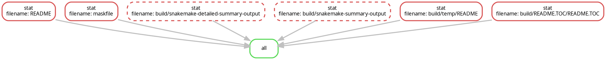
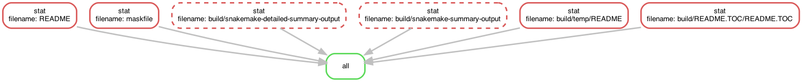
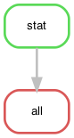
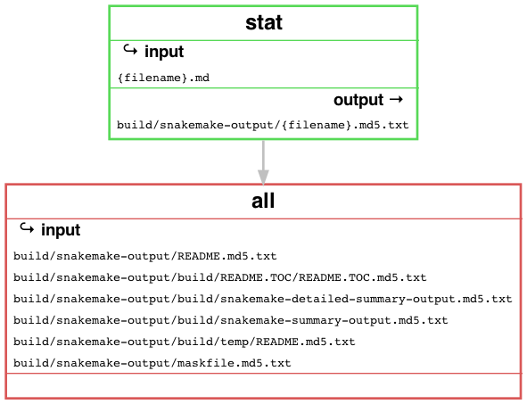
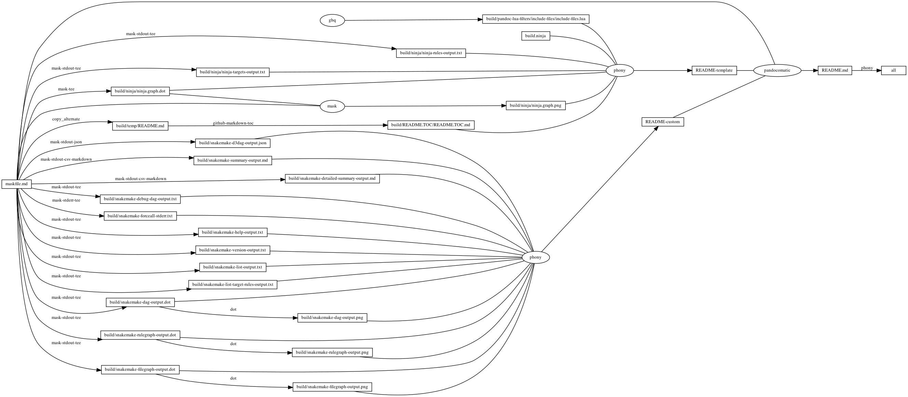

# snakemake

<!-- markdownlint-disable MD007 MD030 -->

-   [snakemake](#snakemake)
-   [Snakefile](#snakefile)
-   [Mask SubCommands](#mask-subcommands)
    -   [snakemake-version](#snakemake-version)
        -   [snakemake-version-output](#snakemake-version-output)
    -   [install-packages](#install-packages)
    -   [snakemake-gui](#snakemake-gui)
    -   [snakemake-lint](#snakemake-lint)
    -   [snakemake-list](#snakemake-list)
        -   [snakemake-list-output](#snakemake-list-output)
    -   [snakemake-list-target-rules](#snakemake-list-target-rules)
        -   [snakemake-list-target-rules-output](#snakemake-list-target-rules-output)
    -   [snakemake-dag](#snakemake-dag)
        -   [snakemake-dag-output](#snakemake-dag-output)
    -   [snakemake-dag-xdot](#snakemake-dag-xdot)
    -   [snakemake-rulegraph](#snakemake-rulegraph)
        -   [snakemake-rulegraph-output](#snakemake-rulegraph-output)
    -   [snakemake-rulegraph-xdot](#snakemake-rulegraph-xdot)
    -   [snakemake-filegraph](#snakemake-filegraph)
        -   [snakemake-filegraph-output](#snakemake-filegraph-output)
    -   [snakemake-filegraph-xdot](#snakemake-filegraph-xdot)
    -   [snakemake-d3dag](#snakemake-d3dag)
        -   [snakemake-d3dag-output](#snakemake-d3dag-output)
    -   [snakemake-summary](#snakemake-summary)
        -   [snakemake-summary-output](#snakemake-summary-output)
    -   [snakemake-detailed-summary](#snakemake-detailed-summary)
        -   [snakemake-detailed-summary-output](#snakemake-detailed-summary-output)
    -   [snakemake-debug-dag](#snakemake-debug-dag)
        -   [snakemake-debug-dag-output](#snakemake-debug-dag-output)
    -   [snakemake-print-compilation](#snakemake-print-compilation)
    -   [snakemake-forceall](#snakemake-forceall)
        -   [snakemake-forceall-stderr](#snakemake-forceall-stderr)
        -   [snakemake-forceall-stats](#snakemake-forceall-stats)
    -   [snakemake-delete-all-output](#snakemake-delete-all-output)
    -   [snakemake-help](#snakemake-help)
        -   [snakemake-help-output](#snakemake-help-output)
    -   [begin: mask task in template : build
        content](#begin-mask-task-in-template--build-content)
    -   [ninja-rules](#ninja-rules)
        -   [ninja custom-rule](#ninja-custom-rule)
        -   [ninja-rules-output](#ninja-rules-output)
    -   [ninja-targets](#ninja-targets)
        -   [ninja build-all](#ninja-build-all)
        -   [ninja custom-build](#ninja-custom-build)
        -   [ninja report-build](#ninja-report-build)
        -   [ninja-targets-output](#ninja-targets-output)
    -   [readme-md](#readme-md)
        -   [ninja readme-build](#ninja-readme-build)
    -   [end: mask task in template : build
        content](#end-mask-task-in-template--build-content)
    -   [begin: mask task in template : ninja
        command](#begin-mask-task-in-template--ninja-command)
    -   [ninja-browse](#ninja-browse)
    -   [ninja-graph-png](#ninja-graph-png)
    -   [ninja-graph-dot-xdot](#ninja-graph-dot-xdot)
    -   [ninja-graph-dot](#ninja-graph-dot)
        -   [ninja-graph-dot-output](#ninja-graph-dot-output)
    -   [ninja-all](#ninja-all)
        -   [build.ninja](#buildninja)
    -   [end: mask task in template : ninja
        command](#end-mask-task-in-template--ninja-command)

<!-- markdownlint-enable MD007 MD030 -->

# Snakefile

``` Snakefile
input_pattern = '{filename}.md'
output_pattern = 'build/snakemake-output/{filename}.md5.txt'
IDS, = glob_wildcards(input_pattern, followlinks=False)

rule all:
    input:
        expand(output_pattern, filename=IDS)

rule stat:
    input: input_pattern
    output: output_pattern
    shell:
        'md5 {input} > {output}'
```

# Mask SubCommands

[Mask Awesome](https://github.com/huzhenghui/mask-awesome)

## snakemake-version

``` bash
snakemake --version
```

### snakemake-version-output

``` plain
5.32.0
```

## install-packages

``` bash
/usr/local/opt/snakemake/libexec/bin/pip install flask networkx ninja2 pygments pygraphviz
```

## snakemake-gui

``` bash
snakemake --gui
```

## snakemake-lint

``` bash
snakemake --lint
```

## snakemake-list

``` bash
snakemake --list
```

### snakemake-list-output

``` plain
all
stat
```

## snakemake-list-target-rules

``` bash
snakemake --list-target-rules
```

### snakemake-list-target-rules-output

``` plain
all
```

## snakemake-dag

``` bash
snakemake --dag
```

### snakemake-dag-output

<!-- markdownlint-disable MD010 MD013 -->



<!-- markdownlint-enable MD010 MD013 -->



## snakemake-dag-xdot

``` bash
detach -- xdot "${MASKFILE_DIR}/build/snakemake-dag-output.dot"
```

## snakemake-rulegraph

``` bash
snakemake --rulegraph
```

### snakemake-rulegraph-output

``` dot
digraph snakemake_dag {
    graph[bgcolor=white, margin=0];
    node[shape=box, style=rounded, fontname=sans,                 fontsize=10, penwidth=2];
    edge[penwidth=2, color=grey];
	0[label = "all", color = "0.00 0.6 0.85", style="rounded"];
	1[label = "stat", color = "0.33 0.6 0.85", style="rounded"];
	1 -> 0
}            
```

<!-- markdownlint-disable MD010 -->



<!-- markdownlint-enable MD010 -->



## snakemake-rulegraph-xdot

``` bash
detach -- xdot "${MASKFILE_DIR}/build/snakemake-rulegraph-output.dot"
```

## snakemake-filegraph

``` bash
snakemake --filegraph
```

### snakemake-filegraph-output

``` dot
digraph snakemake_dag {
    graph[bgcolor=white, margin=0];
    node[shape=box, style=rounded, fontname=sans,                 fontsize=10, penwidth=2];
    edge[penwidth=2, color=grey];
0 [ shape=none, margin=0, label=<<table border="2" color="#D95757" cellspacing="3" cellborder="0">
<tr><td>
<b><font point-size="18">all</font></b>
</td></tr>
<hr/>
<tr><td align="left"> <b><font point-size="14">&#8618; input</font></b> </td></tr>
<tr>
<td align="left"><font face="monospace">build/snakemake-output/README.md5.txt</font></td>
</tr>
<tr>
<td align="left"><font face="monospace">build/snakemake-output/build/README.TOC/README.TOC.md5.txt</font></td>
</tr>
<tr>
<td align="left"><font face="monospace">build/snakemake-output/build/snakemake-detailed-summary-output.md5.txt</font></td>
</tr>
<tr>
<td align="left"><font face="monospace">build/snakemake-output/build/snakemake-summary-output.md5.txt</font></td>
</tr>
<tr>
<td align="left"><font face="monospace">build/snakemake-output/build/temp/README.md5.txt</font></td>
</tr>
<tr>
<td align="left"><font face="monospace">build/snakemake-output/maskfile.md5.txt</font></td>
</tr>
<hr/>
<tr><td align="right">  </td> </tr>
</table>>]
1 [ shape=none, margin=0, label=<<table border="2" color="#57D957" cellspacing="3" cellborder="0">
<tr><td>
<b><font point-size="18">stat</font></b>
</td></tr>
<hr/>
<tr><td align="left"> <b><font point-size="14">&#8618; input</font></b> </td></tr>
<tr>
<td align="left"><font face="monospace">{filename}.md</font></td>
</tr>
<hr/>
<tr><td align="right"> <b><font point-size="14">output &rarr;</font></b> </td> </tr>
<tr>
<td align="left"><font face="monospace">build/snakemake-output/{filename}.md5.txt</font></td></tr>
</table>>]
	1 -> 0
}            
```

<!-- markdownlint-disable MD010 MD013 -->



<!-- markdownlint-enable MD010 MD013 -->



## snakemake-filegraph-xdot

``` bash
detach -- xdot "${MASKFILE_DIR}/build/snakemake-filegraph-output.dot"
```

## snakemake-d3dag

``` bash
snakemake --d3dag
```

### snakemake-d3dag-output

<!-- markdownlint-disable MD013 -->

``` json
{
  "nodes": [
    {
      "id": 0,
      "value": {
        "jobid": 0,
        "label": "all",
        "rule": "all"
      }
    },
    {
      "id": 1,
      "value": {
        "jobid": 1,
        "label": "stat",
        "rule": "stat"
      }
    },
    {
      "id": 2,
      "value": {
        "jobid": 2,
        "label": "stat",
        "rule": "stat"
      }
    },
    {
      "id": 3,
      "value": {
        "jobid": 3,
        "label": "stat",
        "rule": "stat"
      }
    },
    {
      "id": 4,
      "value": {
        "jobid": 4,
        "label": "stat",
        "rule": "stat"
      }
    },
    {
      "id": 5,
      "value": {
        "jobid": 5,
        "label": "stat",
        "rule": "stat"
      }
    },
    {
      "id": 6,
      "value": {
        "jobid": 6,
        "label": "stat",
        "rule": "stat"
      }
    }
  ],
  "links": [
    {
      "u": 1,
      "v": 0
    },
    {
      "u": 2,
      "v": 0
    },
    {
      "u": 5,
      "v": 0
    },
    {
      "u": 6,
      "v": 0
    }
  ]
}
```

<!-- markdownlint-enable MD013 -->

## snakemake-summary

``` bash
snakemake --summary
```

### snakemake-summary-output

<!-- markdownlint-disable MD013 -->

| output\_file                                                           | date                     | rule | version | log-file(s) | status              | plan           |
|------------------------------------------------------------------------|--------------------------|------|---------|-------------|---------------------|----------------|
| build/snakemake-output/README.md5.txt                                  | Sun Jan 24 17:35:09 2021 | stat | \-      |             | updated input files | update pending |
| build/snakemake-output/maskfile.md5.txt                                | Sun Jan 24 17:35:09 2021 | stat | \-      |             | updated input files | update pending |
| build/snakemake-output/build/snakemake-detailed-summary-output.md5.txt | Sun Jan 24 17:35:09 2021 | stat | \-      |             | ok                  | no update      |
| build/snakemake-output/build/snakemake-summary-output.md5.txt          | Sun Jan 24 17:35:09 2021 | stat | \-      |             | updated input files | update pending |
| build/snakemake-output/build/temp/README.md5.txt                       | Sun Jan 24 17:35:09 2021 | stat | \-      |             | updated input files | update pending |
| build/snakemake-output/build/README.TOC/README.TOC.md5.txt             | Sun Jan 24 17:35:09 2021 | stat | \-      |             | updated input files | update pending |

<!-- markdownlint-enable MD013 -->

## snakemake-detailed-summary

``` bash
snakemake --detailed-summary --cores all
```

### snakemake-detailed-summary-output

<!-- markdownlint-disable MD013 -->

| output\_file                                                           | date                     | rule | version | log-file(s) | input-file(s)                              | shellcmd                                                                                                                   | status              | plan           |
|------------------------------------------------------------------------|--------------------------|------|---------|-------------|--------------------------------------------|----------------------------------------------------------------------------------------------------------------------------|---------------------|----------------|
| build/snakemake-output/README.md5.txt                                  | Sun Jan 24 17:35:09 2021 | stat | \-      |             | README.md                                  | md5 README.md &gt; build/snakemake-output/README.md5.txt                                                                   | updated input files | update pending |
| build/snakemake-output/maskfile.md5.txt                                | Sun Jan 24 17:35:09 2021 | stat | \-      |             | maskfile.md                                | md5 maskfile.md &gt; build/snakemake-output/maskfile.md5.txt                                                               | updated input files | update pending |
| build/snakemake-output/build/snakemake-detailed-summary-output.md5.txt | Sun Jan 24 17:35:09 2021 | stat | \-      |             | build/snakemake-detailed-summary-output.md | md5 build/snakemake-detailed-summary-output.md &gt; build/snakemake-output/build/snakemake-detailed-summary-output.md5.txt | updated input files | update pending |
| build/snakemake-output/build/snakemake-summary-output.md5.txt          | Sun Jan 24 17:35:09 2021 | stat | \-      |             | build/snakemake-summary-output.md          | md5 build/snakemake-summary-output.md &gt; build/snakemake-output/build/snakemake-summary-output.md5.txt                   | updated input files | update pending |
| build/snakemake-output/build/temp/README.md5.txt                       | Sun Jan 24 17:35:09 2021 | stat | \-      |             | build/temp/README.md                       | md5 build/temp/README.md &gt; build/snakemake-output/build/temp/README.md5.txt                                             | updated input files | update pending |
| build/snakemake-output/build/README.TOC/README.TOC.md5.txt             | Sun Jan 24 17:35:09 2021 | stat | \-      |             | build/README.TOC/README.TOC.md             | md5 build/README.TOC/README.TOC.md &gt; build/snakemake-output/build/README.TOC/README.TOC.md5.txt                         | updated input files | update pending |

<!-- markdownlint-enable MD013 -->

## snakemake-debug-dag

``` bash
snakemake --debug-dag --cores all --forceall --dry-run
```

### snakemake-debug-dag-output

<!-- markdownlint-disable MD010 MD013 -->

``` plain
Building DAG of jobs...
candidate job all
    wildcards: 
candidate job stat
    wildcards: filename=README
selected job stat
    wildcards: filename=README
file build/snakemake-output/README.md5.txt:
    Producer found, hence exceptions are ignored.

candidate job stat
    wildcards: filename=maskfile
selected job stat
    wildcards: filename=maskfile
file build/snakemake-output/maskfile.md5.txt:
    Producer found, hence exceptions are ignored.

candidate job stat
    wildcards: filename=build/snakemake-detailed-summary-output
selected job stat
    wildcards: filename=build/snakemake-detailed-summary-output
file build/snakemake-output/build/snakemake-detailed-summary-output.md5.txt:
    Producer found, hence exceptions are ignored.

candidate job stat
    wildcards: filename=build/snakemake-summary-output
selected job stat
    wildcards: filename=build/snakemake-summary-output
file build/snakemake-output/build/snakemake-summary-output.md5.txt:
    Producer found, hence exceptions are ignored.

candidate job stat
    wildcards: filename=build/temp/README
selected job stat
    wildcards: filename=build/temp/README
file build/snakemake-output/build/temp/README.md5.txt:
    Producer found, hence exceptions are ignored.

candidate job stat
    wildcards: filename=build/README.TOC/README.TOC
selected job stat
    wildcards: filename=build/README.TOC/README.TOC
file build/snakemake-output/build/README.TOC/README.TOC.md5.txt:
    Producer found, hence exceptions are ignored.

selected job all
    wildcards: 
file None:
    Producer found, hence exceptions are ignored.

Job counts:
	count	jobs
	1	all
	6	stat
	7

[Sun Jan 24 17:48:56 2021]
rule stat:
    input: maskfile.md
    output: build/snakemake-output/maskfile.md5.txt
    jobid: 2
    wildcards: filename=maskfile


[Sun Jan 24 17:48:57 2021]
rule stat:
    input: build/README.TOC/README.TOC.md
    output: build/snakemake-output/build/README.TOC/README.TOC.md5.txt
    jobid: 6
    wildcards: filename=build/README.TOC/README.TOC


[Sun Jan 24 17:48:57 2021]
rule stat:
    input: build/temp/README.md
    output: build/snakemake-output/build/temp/README.md5.txt
    jobid: 5
    wildcards: filename=build/temp/README


[Sun Jan 24 17:48:57 2021]
rule stat:
    input: build/snakemake-summary-output.md
    output: build/snakemake-output/build/snakemake-summary-output.md5.txt
    jobid: 4
    wildcards: filename=build/snakemake-summary-output


[Sun Jan 24 17:48:57 2021]
rule stat:
    input: README.md
    output: build/snakemake-output/README.md5.txt
    jobid: 1
    wildcards: filename=README


[Sun Jan 24 17:48:57 2021]
rule stat:
    input: build/snakemake-detailed-summary-output.md
    output: build/snakemake-output/build/snakemake-detailed-summary-output.md5.txt
    jobid: 3
    wildcards: filename=build/snakemake-detailed-summary-output


[Sun Jan 24 17:48:57 2021]
localrule all:
    input: build/snakemake-output/README.md5.txt, build/snakemake-output/maskfile.md5.txt, build/snakemake-output/build/snakemake-detailed-summary-output.md5.txt, build/snakemake-output/build/snakemake-summary-output.md5.txt, build/snakemake-output/build/temp/README.md5.txt, build/snakemake-output/build/README.TOC/README.TOC.md5.txt
    jobid: 0

Job counts:
	count	jobs
	1	all
	6	stat
	7
This was a dry-run (flag -n). The order of jobs does not reflect the order of execution.
```

<!-- markdownlint-enable MD010 MD013 -->

## snakemake-print-compilation

``` bash
snakemake --print-compilation | highlight --syntax python --out-format ansi
```

## snakemake-forceall

-   `--cores all`
    -   [EXECUTION](https://snakemake.readthedocs.io/en/stable/executing/cli.html#EXECUTION)

        > Use at most N CPU cores/jobs in parallel. If N is omitted or
        > ‘all’, the limit is set to the number of available CPU cores.
-   `--forceall`
    -   [EXECUTION](https://snakemake.readthedocs.io/en/stable/executing/cli.html#EXECUTION)

        > Force the execution of the selected (or the first) rule and
        > all rules it is dependent on regardless of already created
        > output.
-   `--mode 1`
    -   [BEHAVIOR](https://snakemake.readthedocs.io/en/stable/executing/cli.html#BEHAVIOR)

        > Possible choices: 0, 1, 2
        >
        > Set execution mode of Snakemake (internal use only).
        >
        > Default: 0

    -   [class
        snakemake.common.Mode](https://snakemake.readthedocs.io/en/stable/api_reference/internal/snakemake.html#snakemake.common.Mode)

        > Enum for execution mode of Snakemake. This handles the
        > behavior of e.g. the logger.

    -   [default =
        0](https://snakemake.readthedocs.io/en/stable/api_reference/internal/snakemake.html#snakemake.common.Mode.default)

    -   [subprocess =
        1](https://snakemake.readthedocs.io/en/stable/api_reference/internal/snakemake.html#snakemake.common.Mode.subprocess)

    -   [cluster =
        2](https://snakemake.readthedocs.io/en/stable/api_reference/internal/snakemake.html#snakemake.common.Mode.cluster)
-   `--nocolor`
    -   [OUTPUT](https://snakemake.readthedocs.io/en/stable/executing/cli.html#OUTPUT)

        > Do not use a colored output.
-   `--printshellcmds`
    -   [OUTPUT](https://snakemake.readthedocs.io/en/stable/executing/cli.html#OUTPUT)

        > Print out the shell commands that will be executed.
-   `--reason`
    -   [OUTPUT](https://snakemake.readthedocs.io/en/stable/executing/cli.html#OUTPUT)

        > Print the reason for each executed rule.
-   `--stats`
    -   [OUTPUT](https://snakemake.readthedocs.io/en/stable/executing/cli.html#OUTPUT)

        > Write stats about Snakefile execution in JSON format to the
        > given file.

``` bash
snakemake \
    --cores all \
    --forceall \
    --mode 1 \
    --nocolor \
    --printshellcmds \
    --reason \
    --stats ./build/stats.json
```

### snakemake-forceall-stderr

<!-- markdownlint-disable MD010 MD013 -->

``` plain
Building DAG of jobs...
Using shell: /usr/local/bin/bash
Provided cores: 12
Rules claiming more threads will be scaled down.
Job counts:
	count	jobs
	1	all
	6	stat
	7
Select jobs to execute...

[Sun Jan 24 17:49:02 2021]
rule stat:
    input: maskfile.md
    output: build/snakemake-output/maskfile.md5.txt
    jobid: 2
    reason: Forced execution
    wildcards: filename=maskfile

md5 maskfile.md > build/snakemake-output/maskfile.md5.txt

[Sun Jan 24 17:49:02 2021]
rule stat:
    input: build/README.TOC/README.TOC.md
    output: build/snakemake-output/build/README.TOC/README.TOC.md5.txt
    jobid: 6
    reason: Forced execution
    wildcards: filename=build/README.TOC/README.TOC

md5 build/README.TOC/README.TOC.md > build/snakemake-output/build/README.TOC/README.TOC.md5.txt

[Sun Jan 24 17:49:02 2021]
rule stat:
    input: build/temp/README.md
    output: build/snakemake-output/build/temp/README.md5.txt
    jobid: 5
    reason: Forced execution
    wildcards: filename=build/temp/README

md5 build/temp/README.md > build/snakemake-output/build/temp/README.md5.txt

[Sun Jan 24 17:49:02 2021]
rule stat:
    input: build/snakemake-summary-output.md
    output: build/snakemake-output/build/snakemake-summary-output.md5.txt
    jobid: 4
    reason: Forced execution
    wildcards: filename=build/snakemake-summary-output

md5 build/snakemake-summary-output.md > build/snakemake-output/build/snakemake-summary-output.md5.txt

[Sun Jan 24 17:49:02 2021]
rule stat:
    input: README.md
    output: build/snakemake-output/README.md5.txt
    jobid: 1
    reason: Forced execution
    wildcards: filename=README

md5 README.md > build/snakemake-output/README.md5.txt
[Sun Jan 24 17:49:02 2021]
Finished job 2.
1 of 7 steps (14%) done

[Sun Jan 24 17:49:02 2021]
rule stat:
    input: build/snakemake-detailed-summary-output.md
    output: build/snakemake-output/build/snakemake-detailed-summary-output.md5.txt
    jobid: 3
    reason: Forced execution
    wildcards: filename=build/snakemake-detailed-summary-output

md5 build/snakemake-detailed-summary-output.md > build/snakemake-output/build/snakemake-detailed-summary-output.md5.txt
[Sun Jan 24 17:49:02 2021]
Finished job 6.
2 of 7 steps (29%) done
[Sun Jan 24 17:49:02 2021]
Finished job 5.
3 of 7 steps (43%) done
[Sun Jan 24 17:49:02 2021]
Finished job 4.
4 of 7 steps (57%) done
[Sun Jan 24 17:49:02 2021]
Finished job 1.
5 of 7 steps (71%) done
[Sun Jan 24 17:49:02 2021]
Finished job 3.
6 of 7 steps (86%) done
Select jobs to execute...

[Sun Jan 24 17:49:02 2021]
localrule all:
    input: build/snakemake-output/README.md5.txt, build/snakemake-output/maskfile.md5.txt, build/snakemake-output/build/snakemake-detailed-summary-output.md5.txt, build/snakemake-output/build/snakemake-summary-output.md5.txt, build/snakemake-output/build/temp/README.md5.txt, build/snakemake-output/build/README.TOC/README.TOC.md5.txt
    jobid: 0
    reason: Forced execution

[Sun Jan 24 17:49:02 2021]
Finished job 0.
7 of 7 steps (100%) done
```

<!-- markdownlint-enable MD010 MD013 -->

### snakemake-forceall-stats

<!-- markdownlint-disable MD013 -->

``` json
{
    "total_runtime": 0.07307696342468262,
    "rules": {
        "stat": {
            "mean-runtime": 0.022251486778259277,
            "min-runtime": 0.015948057174682617,
            "max-runtime": 0.026703834533691406
        },
        "all": {
            "mean-runtime": 0.0005629062652587891,
            "min-runtime": 0.0005629062652587891,
            "max-runtime": 0.0005629062652587891
        }
    },
    "files": {
        "build/snakemake-output/maskfile.md5.txt": {
            "start-time": "Sun Jan 24 17:49:02 2021",
            "stop-time": "Sun Jan 24 17:49:02 2021",
            "duration": 0.02456498146057129,
            "priority": 0,
            "resources": {
                "_cores": 1,
                "_nodes": 1
            }
        },
        "build/snakemake-output/build/README.TOC/README.TOC.md5.txt": {
            "start-time": "Sun Jan 24 17:49:02 2021",
            "stop-time": "Sun Jan 24 17:49:02 2021",
            "duration": 0.02598404884338379,
            "priority": 0,
            "resources": {
                "_cores": 1,
                "_nodes": 1
            }
        },
        "build/snakemake-output/build/temp/README.md5.txt": {
            "start-time": "Sun Jan 24 17:49:02 2021",
            "stop-time": "Sun Jan 24 17:49:02 2021",
            "duration": 0.026703834533691406,
            "priority": 0,
            "resources": {
                "_cores": 1,
                "_nodes": 1
            }
        },
        "build/snakemake-output/build/snakemake-summary-output.md5.txt": {
            "start-time": "Sun Jan 24 17:49:02 2021",
            "stop-time": "Sun Jan 24 17:49:02 2021",
            "duration": 0.02260112762451172,
            "priority": 0,
            "resources": {
                "_cores": 1,
                "_nodes": 1
            }
        },
        "build/snakemake-output/README.md5.txt": {
            "start-time": "Sun Jan 24 17:49:02 2021",
            "stop-time": "Sun Jan 24 17:49:02 2021",
            "duration": 0.017706871032714844,
            "priority": 0,
            "resources": {
                "_cores": 1,
                "_nodes": 1
            }
        },
        "build/snakemake-output/build/snakemake-detailed-summary-output.md5.txt": {
            "start-time": "Sun Jan 24 17:49:02 2021",
            "stop-time": "Sun Jan 24 17:49:02 2021",
            "duration": 0.015948057174682617,
            "priority": 0,
            "resources": {
                "_cores": 1,
                "_nodes": 1
            }
        }
    }
}
```

<!-- markdownlint-enable MD013 -->

## snakemake-delete-all-output

``` bash
snakemake --cores all --delete-all-output
```

## snakemake-help

``` bash
snakemake --help
```

### snakemake-help-output

<!-- markdownlint-disable MD013 -->

``` plain
usage: snakemake [-h] [--dry-run] [--profile PROFILE] [--cache [RULE ...]]
                 [--snakefile FILE] [--cores [N]] [--local-cores N]
                 [--resources [NAME=INT ...]]
                 [--set-threads RULE=THREADS [RULE=THREADS ...]]
                 [--set-scatter NAME=SCATTERITEMS [NAME=SCATTERITEMS ...]]
                 [--default-resources [NAME=INT ...]]
                 [--preemption-default PREEMPTION_DEFAULT]
                 [--preemptible-rules PREEMPTIBLE_RULES [PREEMPTIBLE_RULES ...]]
                 [--config [KEY=VALUE ...]] [--configfile FILE [FILE ...]]
                 [--envvars VARNAME [VARNAME ...]] [--directory DIR] [--touch]
                 [--keep-going] [--force] [--forceall]
                 [--forcerun [TARGET ...]] [--prioritize TARGET [TARGET ...]]
                 [--batch RULE=BATCH/BATCHES] [--until TARGET [TARGET ...]]
                 [--omit-from TARGET [TARGET ...]] [--rerun-incomplete]
                 [--shadow-prefix DIR] [--scheduler [{ilp,greedy}]]
                 [--wms-monitor [WMS_MONITOR]]
                 [--wms-monitor-arg [NAME=VALUE ...]]
                 [--scheduler-ilp-solver {GLPK_CMD,COIN_CMD}]
                 [--no-subworkflows] [--groups GROUPS [GROUPS ...]]
                 [--group-components GROUP_COMPONENTS [GROUP_COMPONENTS ...]]
                 [--report [FILE]] [--report-stylesheet CSSFILE]
                 [--edit-notebook TARGET] [--notebook-listen IP:PORT]
                 [--lint [{text,json}]] [--generate-unit-tests [TESTPATH]]
                 [--export-cwl FILE] [--list] [--list-target-rules] [--dag]
                 [--rulegraph] [--filegraph] [--d3dag] [--summary]
                 [--detailed-summary] [--archive FILE]
                 [--cleanup-metadata FILE [FILE ...]] [--cleanup-shadow]
                 [--skip-script-cleanup] [--unlock] [--list-version-changes]
                 [--list-code-changes] [--list-input-changes]
                 [--list-params-changes] [--list-untracked]
                 [--delete-all-output] [--delete-temp-output]
                 [--bash-completion] [--keep-incomplete] [--drop-metadata]
                 [--version] [--reason] [--gui [PORT]] [--printshellcmds]
                 [--debug-dag] [--stats FILE] [--nocolor] [--quiet]
                 [--print-compilation] [--verbose] [--force-use-threads]
                 [--allow-ambiguity] [--nolock] [--ignore-incomplete]
                 [--max-inventory-time SECONDS] [--latency-wait SECONDS]
                 [--wait-for-files [FILE ...]] [--notemp] [--keep-remote]
                 [--keep-target-files]
                 [--allowed-rules ALLOWED_RULES [ALLOWED_RULES ...]]
                 [--max-jobs-per-second MAX_JOBS_PER_SECOND]
                 [--max-status-checks-per-second MAX_STATUS_CHECKS_PER_SECOND]
                 [-T RESTART_TIMES] [--attempt ATTEMPT]
                 [--wrapper-prefix WRAPPER_PREFIX]
                 [--default-remote-provider {S3,GS,FTP,SFTP,S3Mocked,gfal,gridftp,iRODS,AzBlob}]
                 [--default-remote-prefix DEFAULT_REMOTE_PREFIX]
                 [--no-shared-fs] [--greediness GREEDINESS] [--no-hooks]
                 [--overwrite-shellcmd OVERWRITE_SHELLCMD] [--debug]
                 [--runtime-profile FILE] [--mode {0,1,2}]
                 [--show-failed-logs] [--log-handler-script FILE]
                 [--log-service {none,slack,wms}]
                 [--cluster CMD | --cluster-sync CMD | --drmaa [ARGS]]
                 [--cluster-config FILE] [--immediate-submit]
                 [--jobscript SCRIPT] [--jobname NAME]
                 [--cluster-status CLUSTER_STATUS] [--drmaa-log-dir DIR]
                 [--kubernetes [NAMESPACE]] [--container-image IMAGE]
                 [--tibanna] [--tibanna-sfn TIBANNA_SFN]
                 [--precommand PRECOMMAND]
                 [--tibanna-config TIBANNA_CONFIG [TIBANNA_CONFIG ...]]
                 [--google-lifesciences]
                 [--google-lifesciences-regions GOOGLE_LIFESCIENCES_REGIONS [GOOGLE_LIFESCIENCES_REGIONS ...]]
                 [--google-lifesciences-location GOOGLE_LIFESCIENCES_LOCATION]
                 [--google-lifesciences-keep-cache] [--tes URL] [--use-conda]
                 [--conda-not-block-search-path-envvars] [--list-conda-envs]
                 [--conda-prefix DIR] [--conda-cleanup-envs]
                 [--conda-cleanup-pkgs [{tarballs,cache}]]
                 [--conda-create-envs-only] [--conda-frontend {conda,mamba}]
                 [--use-singularity] [--singularity-prefix DIR]
                 [--singularity-args ARGS] [--use-envmodules]
                 [target ...]

Snakemake is a Python based language and execution environment for GNU Make-
like workflows.

optional arguments:
  -h, --help            show this help message and exit

EXECUTION:
  target                Targets to build. May be rules or files. (default:
                        None)
  --dry-run, --dryrun, -n
                        Do not execute anything, and display what would be
                        done. If you have a very large workflow, use --dry-run
                        --quiet to just print a summary of the DAG of jobs.
                        (default: False)
  --profile PROFILE     Name of profile to use for configuring Snakemake.
                        Snakemake will search for a corresponding folder in
                        /Library/Application Support/snakemake and
                        /Users/huzhenghui/Library/Application
                        Support/snakemake. Alternatively, this can be an
                        absolute or relative path. The profile folder has to
                        contain a file 'config.yaml'. This file can be used to
                        set default values for command line options in YAML
                        format. For example, '--cluster qsub' becomes
                        'cluster: qsub' in the YAML file. Profiles can be
                        obtained from https://github.com/snakemake-profiles.
                        (default: None)
  --cache [RULE ...]    Store output files of given rules in a central cache
                        given by the environment variable
                        $SNAKEMAKE_OUTPUT_CACHE. Likewise, retrieve output
                        files of the given rules from this cache if they have
                        been created before (by anybody writing to the same
                        cache), instead of actually executing the rules.
                        Output files are identified by hashing all steps,
                        parameters and software stack (conda envs or
                        containers) needed to create them. (default: None)
  --snakefile FILE, -s FILE
                        The workflow definition in form of a
                        snakefile.Usually, you should not need to specify
                        this. By default, Snakemake will search for
                        'Snakefile', 'snakefile', 'workflow/Snakefile',
                        'workflow/snakefile' beneath the current working
                        directory, in this order. Only if you definitely want
                        a different layout, you need to use this parameter.
                        (default: None)
  --cores [N], --jobs [N], -j [N]
                        Use at most N CPU cores/jobs in parallel. If N is
                        omitted or 'all', the limit is set to the number of
                        available CPU cores. (default: None)
  --local-cores N       In cluster mode, use at most N cores of the host
                        machine in parallel (default: number of CPU cores of
                        the host). The cores are used to execute local rules.
                        This option is ignored when not in cluster mode.
                        (default: 12)
  --resources [NAME=INT ...], --res [NAME=INT ...]
                        Define additional resources that shall constrain the
                        scheduling analogously to threads (see above). A
                        resource is defined as a name and an integer value.
                        E.g. --resources mem_mb=1000. Rules can use resources
                        by defining the resource keyword, e.g. resources:
                        mem_mb=600. If now two rules require 600 of the
                        resource 'mem_mb' they won't be run in parallel by the
                        scheduler. (default: None)
  --set-threads RULE=THREADS [RULE=THREADS ...]
                        Overwrite thread usage of rules. This allows to fine-
                        tune workflow parallelization. In particular, this is
                        helpful to target certain cluster nodes by e.g.
                        shifting a rule to use more, or less threads than
                        defined in the workflow. Thereby, THREADS has to be a
                        positive integer, and RULE has to be the name of the
                        rule. (default: None)
  --set-scatter NAME=SCATTERITEMS [NAME=SCATTERITEMS ...]
                        Overwrite number of scatter items of scattergather
                        processes. This allows to fine-tune workflow
                        parallelization. Thereby, SCATTERITEMS has to be a
                        positive integer, and NAME has to be the name of the
                        scattergather process defined via a scattergather
                        directive in the workflow. (default: None)
  --default-resources [NAME=INT ...], --default-res [NAME=INT ...]
                        Define default values of resources for rules that do
                        not define their own values. In addition to plain
                        integers, python expressions over inputsize are
                        allowed (e.g. '2*input.size_mb').When specifying this
                        without any arguments (--default-resources), it
                        defines 'mem_mb=max(2*input.size_mb, 1000)'
                        'disk_mb=max(2*input.size_mb, 1000)', i.e., default
                        disk and mem usage is twice the input file size but at
                        least 1GB. (default: None)
  --preemption-default PREEMPTION_DEFAULT
                        A preemptible instance can be requested when using the
                        Google Life Sciences API. If you set a --preemption-
                        default,all rules will be subject to the default.
                        Specifically, this integer is the number of restart
                        attempts that will be made given that the instance is
                        killed unexpectedly. Note that preemptible instances
                        have a maximum running time of 24 hours. If you want
                        to set preemptible instances for only a subset of
                        rules, use --preemptible-rules instead. (default:
                        None)
  --preemptible-rules PREEMPTIBLE_RULES [PREEMPTIBLE_RULES ...]
                        A preemptible instance can be requested when using the
                        Google Life Sciences API. If you want to use these
                        instances for a subset of your rules, you can use
                        --preemptible-rules and then specify a list of rule
                        and integer pairs, where each integer indicates the
                        number of restarts to use for the rule's instance in
                        the case that the instance is terminated unexpectedly.
                        --preemptible-rules can be used in combination with
                        --preemption-default, and will take priority. Note
                        that preemptible instances have a maximum running time
                        of 24. If you want to apply a consistent number of
                        retries across all your rules, use --premption-default
                        instead. Example: snakemake --preemption-default 10
                        --preemptible-rules map_reads=3 call_variants=0
                        (default: None)
  --config [KEY=VALUE ...], -C [KEY=VALUE ...]
                        Set or overwrite values in the workflow config object.
                        The workflow config object is accessible as variable
                        config inside the workflow. Default values can be set
                        by providing a JSON file (see Documentation).
                        (default: None)
  --configfile FILE [FILE ...], --configfiles FILE [FILE ...]
                        Specify or overwrite the config file of the workflow
                        (see the docs). Values specified in JSON or YAML
                        format are available in the global config dictionary
                        inside the workflow. Multiple files overwrite each
                        other in the given order. (default: None)
  --envvars VARNAME [VARNAME ...]
                        Environment variables to pass to cloud jobs. (default:
                        None)
  --directory DIR, -d DIR
                        Specify working directory (relative paths in the
                        snakefile will use this as their origin). (default:
                        None)
  --touch, -t           Touch output files (mark them up to date without
                        really changing them) instead of running their
                        commands. This is used to pretend that the rules were
                        executed, in order to fool future invocations of
                        snakemake. Fails if a file does not yet exist. Note
                        that this will only touch files that would otherwise
                        be recreated by Snakemake (e.g. because their input
                        files are newer). For enforcing a touch, combine this
                        with --force, --forceall, or --forcerun. Note however
                        that you loose the provenance information when the
                        files have been created in realitiy. Hence, this
                        should be used only as a last resort. (default: False)
  --keep-going, -k      Go on with independent jobs if a job fails. (default:
                        False)
  --force, -f           Force the execution of the selected target or the
                        first rule regardless of already created output.
                        (default: False)
  --forceall, -F        Force the execution of the selected (or the first)
                        rule and all rules it is dependent on regardless of
                        already created output. (default: False)
  --forcerun [TARGET ...], -R [TARGET ...]
                        Force the re-execution or creation of the given rules
                        or files. Use this option if you changed a rule and
                        want to have all its output in your workflow updated.
                        (default: None)
  --prioritize TARGET [TARGET ...], -P TARGET [TARGET ...]
                        Tell the scheduler to assign creation of given targets
                        (and all their dependencies) highest priority.
                        (EXPERIMENTAL) (default: None)
  --batch RULE=BATCH/BATCHES
                        Only create the given BATCH of the input files of the
                        given RULE. This can be used to iteratively run parts
                        of very large workflows. Only the execution plan of
                        the relevant part of the workflow has to be
                        calculated, thereby speeding up DAG computation. It is
                        recommended to provide the most suitable rule for
                        batching when documenting a workflow. It should be
                        some aggregating rule that would be executed only
                        once, and has a large number of input files. For
                        example, it can be a rule that aggregates over
                        samples. (default: None)
  --until TARGET [TARGET ...], -U TARGET [TARGET ...]
                        Runs the pipeline until it reaches the specified rules
                        or files. Only runs jobs that are dependencies of the
                        specified rule or files, does not run sibling DAGs.
                        (default: None)
  --omit-from TARGET [TARGET ...], -O TARGET [TARGET ...]
                        Prevent the execution or creation of the given rules
                        or files as well as any rules or files that are
                        downstream of these targets in the DAG. Also runs jobs
                        in sibling DAGs that are independent of the rules or
                        files specified here. (default: None)
  --rerun-incomplete, --ri
                        Re-run all jobs the output of which is recognized as
                        incomplete. (default: False)
  --shadow-prefix DIR   Specify a directory in which the 'shadow' directory is
                        created. If not supplied, the value is set to the
                        '.snakemake' directory relative to the working
                        directory. (default: None)
  --scheduler [{ilp,greedy}]
                        Specifies if jobs are selected by a greedy algorithm
                        or by solving an ilp. The ilp scheduler aims to reduce
                        runtime and hdd usage by best possible use of
                        resources. (default: ilp)
  --wms-monitor [WMS_MONITOR]
                        IP and port of workflow management system to monitor
                        the execution of snakemake (e.g.
                        http://127.0.0.1:5000) Note that if your service
                        requires an authorization token, you must export
                        WMS_MONITOR_TOKEN in the environment. (default: None)
  --wms-monitor-arg [NAME=VALUE ...]
                        If the workflow management service accepts extra
                        arguments, provide. them in key value pairs with
                        --wms-monitor-arg. For example, to run an existing
                        workflow using a wms monitor, you can provide the pair
                        id=12345 and the arguments will be provided to the
                        endpoint to first interact with the workflow (default:
                        None)
  --scheduler-ilp-solver {GLPK_CMD,COIN_CMD}
                        Specifies solver to be utilized when selecting ilp-
                        scheduler. (default: COIN_CMD)
  --no-subworkflows, --nosw
                        Do not evaluate or execute subworkflows. (default:
                        False)

GROUPING:
  --groups GROUPS [GROUPS ...]
                        Assign rules to groups (this overwrites any group
                        definitions from the workflow). (default: None)
  --group-components GROUP_COMPONENTS [GROUP_COMPONENTS ...]
                        Set the number of connected components a group is
                        allowed to span. By default, this is 1, but this flag
                        allows to extend this. This can be used to run e.g. 3
                        jobs of the same rule in the same group, although they
                        are not connected. It can be helpful for putting
                        together many small jobs or benefitting of shared
                        memory setups. (default: None)

REPORTS:
  --report [FILE]       Create an HTML report with results and statistics.
                        This can be either a .html file or a .zip file. In the
                        former case, all results are embedded into the .html
                        (this only works for small data). In the latter case,
                        results are stored along with a file report.html in
                        the zip archive. If no filename is given, an embedded
                        report.html is the default. (default: None)
  --report-stylesheet CSSFILE
                        Custom stylesheet to use for report. In particular,
                        this can be used for branding the report with e.g. a
                        custom logo, see docs. (default: None)

NOTEBOOKS:
  --edit-notebook TARGET
                        Interactively edit the notebook associated with the
                        rule used to generate the given target file. This will
                        start a local jupyter notebook server. Any changes to
                        the notebook should be saved, and the server has to be
                        stopped by closing the notebook and hitting the 'Quit'
                        button on the jupyter dashboard. Afterwards, the
                        updated notebook will be automatically stored in the
                        path defined in the rule. If the notebook is not yet
                        present, this will create an empty draft. (default:
                        None)
  --notebook-listen IP:PORT
                        The IP address and PORT the notebook server used for
                        editing the notebook (--edit-notebook) will listen on.
                        (default: localhost:8888)

UTILITIES:
  --lint [{text,json}]  Perform linting on the given workflow. This will print
                        snakemake specific suggestions to improve code quality
                        (work in progress, more lints to be added in the
                        future). If no argument is provided, plain text output
                        is used. (default: None)
  --generate-unit-tests [TESTPATH]
                        Automatically generate unit tests for each workflow
                        rule. This assumes that all input files of each job
                        are already present. Rules without a job with present
                        input files will be skipped (a warning will be
                        issued). For each rule, one test case will be created
                        in the specified test folder (.tests/unit by default).
                        After successfull execution, tests can be run with
                        'pytest TESTPATH'. (default: None)
  --export-cwl FILE     Compile workflow to CWL and store it in given FILE.
                        (default: None)
  --list, -l            Show available rules in given Snakefile. (default:
                        False)
  --list-target-rules, --lt
                        Show available target rules in given Snakefile.
                        (default: False)
  --dag                 Do not execute anything and print the directed acyclic
                        graph of jobs in the dot language. Recommended use on
                        Unix systems: snakemake --dag | dot | displayNote
                        print statements in your Snakefile may interfere with
                        visualization. (default: False)
  --rulegraph           Do not execute anything and print the dependency graph
                        of rules in the dot language. This will be less
                        crowded than above DAG of jobs, but also show less
                        information. Note that each rule is displayed once,
                        hence the displayed graph will be cyclic if a rule
                        appears in several steps of the workflow. Use this if
                        above option leads to a DAG that is too large.
                        Recommended use on Unix systems: snakemake --rulegraph
                        | dot | displayNote print statements in your Snakefile
                        may interfere with visualization. (default: False)
  --filegraph           Do not execute anything and print the dependency graph
                        of rules with their input and output files in the dot
                        language. This is an intermediate solution between
                        above DAG of jobs and the rule graph. Note that each
                        rule is displayed once, hence the displayed graph will
                        be cyclic if a rule appears in several steps of the
                        workflow. Use this if above option leads to a DAG that
                        is too large. Recommended use on Unix systems:
                        snakemake --filegraph | dot | displayNote print
                        statements in your Snakefile may interfere with
                        visualization. (default: False)
  --d3dag               Print the DAG in D3.js compatible JSON format.
                        (default: False)
  --summary, -S         Print a summary of all files created by the workflow.
                        The has the following columns: filename, modification
                        time, rule version, status, plan. Thereby rule version
                        contains the versionthe file was created with (see the
                        version keyword of rules), and status denotes whether
                        the file is missing, its input files are newer or if
                        version or implementation of the rule changed since
                        file creation. Finally the last column denotes whether
                        the file will be updated or created during the next
                        workflow execution. (default: False)
  --detailed-summary, -D
                        Print a summary of all files created by the workflow.
                        The has the following columns: filename, modification
                        time, rule version, input file(s), shell command,
                        status, plan. Thereby rule version contains the
                        version the file was created with (see the version
                        keyword of rules), and status denotes whether the file
                        is missing, its input files are newer or if version or
                        implementation of the rule changed since file
                        creation. The input file and shell command columns are
                        self explanatory. Finally the last column denotes
                        whether the file will be updated or created during the
                        next workflow execution. (default: False)
  --archive FILE        Archive the workflow into the given tar archive FILE.
                        The archive will be created such that the workflow can
                        be re-executed on a vanilla system. The function needs
                        conda and git to be installed. It will archive every
                        file that is under git version control. Note that it
                        is best practice to have the Snakefile, config files,
                        and scripts under version control. Hence, they will be
                        included in the archive. Further, it will add input
                        files that are not generated by by the workflow itself
                        and conda environments. Note that symlinks are
                        dereferenced. Supported formats are .tar, .tar.gz,
                        .tar.bz2 and .tar.xz. (default: None)
  --cleanup-metadata FILE [FILE ...], --cm FILE [FILE ...]
                        Cleanup the metadata of given files. That means that
                        snakemake removes any tracked version info, and any
                        marks that files are incomplete. (default: None)
  --cleanup-shadow      Cleanup old shadow directories which have not been
                        deleted due to failures or power loss. (default:
                        False)
  --skip-script-cleanup
                        Don't delete wrapper scripts used for execution
                        (default: False)
  --unlock              Remove a lock on the working directory. (default:
                        False)
  --list-version-changes, --lv
                        List all output files that have been created with a
                        different version (as determined by the version
                        keyword). (default: False)
  --list-code-changes, --lc
                        List all output files for which the rule body (run or
                        shell) have changed in the Snakefile. (default: False)
  --list-input-changes, --li
                        List all output files for which the defined input
                        files have changed in the Snakefile (e.g. new input
                        files were added in the rule definition or files were
                        renamed). For listing input file modification in the
                        filesystem, use --summary. (default: False)
  --list-params-changes, --lp
                        List all output files for which the defined params
                        have changed in the Snakefile. (default: False)
  --list-untracked, --lu
                        List all files in the working directory that are not
                        used in the workflow. This can be used e.g. for
                        identifying leftover files. Hidden files and
                        directories are ignored. (default: False)
  --delete-all-output   Remove all files generated by the workflow. Use
                        together with --dry-run to list files without actually
                        deleting anything. Note that this will not recurse
                        into subworkflows. Write-protected files are not
                        removed. Nevertheless, use with care! (default: False)
  --delete-temp-output  Remove all temporary files generated by the workflow.
                        Use together with --dry-run to list files without
                        actually deleting anything. Note that this will not
                        recurse into subworkflows. (default: False)
  --bash-completion     Output code to register bash completion for snakemake.
                        Put the following in your .bashrc (including the
                        accents): `snakemake --bash-completion` or issue it in
                        an open terminal session. (default: False)
  --keep-incomplete     Do not remove incomplete output files by failed jobs.
                        (default: False)
  --drop-metadata       Drop metadata file tracking information after job
                        finishes. Provenance-information based reports (e.g.
                        --report and the --list_x_changes functions) will be
                        empty or incomplete. (default: False)
  --version, -v         show program's version number and exit

OUTPUT:
  --reason, -r          Print the reason for each executed rule. (default:
                        False)
  --gui [PORT]          Serve an HTML based user interface to the given
                        network and port e.g. 168.129.10.15:8000. By default
                        Snakemake is only available in the local network
                        (default port: 8000). To make Snakemake listen to all
                        ip addresses add the special host address 0.0.0.0 to
                        the url (0.0.0.0:8000). This is important if Snakemake
                        is used in a virtualised environment like Docker. If
                        possible, a browser window is opened. (default: None)
  --printshellcmds, -p  Print out the shell commands that will be executed.
                        (default: False)
  --debug-dag           Print candidate and selected jobs (including their
                        wildcards) while inferring DAG. This can help to debug
                        unexpected DAG topology or errors. (default: False)
  --stats FILE          Write stats about Snakefile execution in JSON format
                        to the given file. (default: None)
  --nocolor             Do not use a colored output. (default: False)
  --quiet, -q           Do not output any progress or rule information.
                        (default: False)
  --print-compilation   Print the python representation of the workflow.
                        (default: False)
  --verbose             Print debugging output. (default: False)

BEHAVIOR:
  --force-use-threads   Force threads rather than processes. Helpful if shared
                        memory (/dev/shm) is full or unavailable. (default:
                        False)
  --allow-ambiguity, -a
                        Don't check for ambiguous rules and simply use the
                        first if several can produce the same file. This
                        allows the user to prioritize rules by their order in
                        the snakefile. (default: False)
  --nolock              Do not lock the working directory (default: False)
  --ignore-incomplete, --ii
                        Do not check for incomplete output files. (default:
                        False)
  --max-inventory-time SECONDS
                        Spend at most SECONDS seconds to create a file
                        inventory for the working directory. The inventory
                        vastly speeds up file modification and existence
                        checks when computing which jobs need to be executed.
                        However, creating the inventory itself can be slow,
                        e.g. on network file systems. Hence, we do not spend
                        more than a given amount of time and fall back to
                        individual checks for the rest. (default: 20)
  --latency-wait SECONDS, --output-wait SECONDS, -w SECONDS
                        Wait given seconds if an output file of a job is not
                        present after the job finished. This helps if your
                        filesystem suffers from latency (default 5). (default:
                        5)
  --wait-for-files [FILE ...]
                        Wait --latency-wait seconds for these files to be
                        present before executing the workflow. This option is
                        used internally to handle filesystem latency in
                        cluster environments. (default: None)
  --notemp, --nt        Ignore temp() declarations. This is useful when
                        running only a part of the workflow, since temp()
                        would lead to deletion of probably needed files by
                        other parts of the workflow. (default: False)
  --keep-remote         Keep local copies of remote input files. (default:
                        False)
  --keep-target-files   Do not adjust the paths of given target files relative
                        to the working directory. (default: False)
  --allowed-rules ALLOWED_RULES [ALLOWED_RULES ...]
                        Only consider given rules. If omitted, all rules in
                        Snakefile are used. Note that this is intended
                        primarily for internal use and may lead to unexpected
                        results otherwise. (default: None)
  --max-jobs-per-second MAX_JOBS_PER_SECOND
                        Maximal number of cluster/drmaa jobs per second,
                        default is 10, fractions allowed. (default: 10)
  --max-status-checks-per-second MAX_STATUS_CHECKS_PER_SECOND
                        Maximal number of job status checks per second,
                        default is 10, fractions allowed. (default: 10)
  -T RESTART_TIMES, --restart-times RESTART_TIMES
                        Number of times to restart failing jobs (defaults to
                        0). (default: 0)
  --attempt ATTEMPT     Internal use only: define the initial value of the
                        attempt parameter (default: 1). (default: 1)
  --wrapper-prefix WRAPPER_PREFIX
                        Prefix for URL created from wrapper directive
                        (default: https://github.com/snakemake/snakemake-
                        wrappers/raw/). Set this to a different URL to use
                        your fork or a local clone of the repository, e.g.,
                        use a git URL like
                        'git+file://path/to/your/local/clone@'. (default:
                        https://github.com/snakemake/snakemake-wrappers/raw/)
  --default-remote-provider {S3,GS,FTP,SFTP,S3Mocked,gfal,gridftp,iRODS,AzBlob}
                        Specify default remote provider to be used for all
                        input and output files that don't yet specify one.
                        (default: None)
  --default-remote-prefix DEFAULT_REMOTE_PREFIX
                        Specify prefix for default remote provider. E.g. a
                        bucket name. (default: )
  --no-shared-fs        Do not assume that jobs share a common file system.
                        When this flag is activated, Snakemake will assume
                        that the filesystem on a cluster node is not shared
                        with other nodes. For example, this will lead to
                        downloading remote files on each cluster node
                        separately. Further, it won't take special measures to
                        deal with filesystem latency issues. This option will
                        in most cases only make sense in combination with
                        --default-remote-provider. Further, when using
                        --cluster you will have to also provide --cluster-
                        status. Only activate this if you know what you are
                        doing. (default: False)
  --greediness GREEDINESS
                        Set the greediness of scheduling. This value between 0
                        and 1 determines how careful jobs are selected for
                        execution. The default value (1.0) provides the best
                        speed and still acceptable scheduling quality.
                        (default: None)
  --no-hooks            Do not invoke onstart, onsuccess or onerror hooks
                        after execution. (default: False)
  --overwrite-shellcmd OVERWRITE_SHELLCMD
                        Provide a shell command that shall be executed instead
                        of those given in the workflow. This is for debugging
                        purposes only. (default: None)
  --debug               Allow to debug rules with e.g. PDB. This flag allows
                        to set breakpoints in run blocks. (default: False)
  --runtime-profile FILE
                        Profile Snakemake and write the output to FILE. This
                        requires yappi to be installed. (default: None)
  --mode {0,1,2}        Set execution mode of Snakemake (internal use only).
                        (default: 0)
  --show-failed-logs    Automatically display logs of failed jobs. (default:
                        False)
  --log-handler-script FILE
                        Provide a custom script containing a function 'def
                        log_handler(msg):'. Snakemake will call this function
                        for every logging output (given as a dictionary
                        msg)allowing to e.g. send notifications in the form of
                        e.g. slack messages or emails. (default: None)
  --log-service {none,slack,wms}
                        Set a specific messaging service for logging
                        output.Snakemake will notify the service on errors and
                        completed execution.Currently slack and workflow
                        management system (wms) are supported. (default: None)

CLUSTER:
  --cluster CMD, -c CMD
                        Execute snakemake rules with the given submit command,
                        e.g. qsub. Snakemake compiles jobs into scripts that
                        are submitted to the cluster with the given command,
                        once all input files for a particular job are present.
                        The submit command can be decorated to make it aware
                        of certain job properties (name, rulename, input,
                        output, params, wildcards, log, threads and
                        dependencies (see the argument below)), e.g.: $
                        snakemake --cluster 'qsub -pe threaded {threads}'.
                        (default: None)
  --cluster-sync CMD    cluster submission command will block, returning the
                        remote exitstatus upon remote termination (for
                        example, this should be usedif the cluster command is
                        'qsub -sync y' (SGE) (default: None)
  --drmaa [ARGS]        Execute snakemake on a cluster accessed via DRMAA,
                        Snakemake compiles jobs into scripts that are
                        submitted to the cluster with the given command, once
                        all input files for a particular job are present. ARGS
                        can be used to specify options of the underlying
                        cluster system, thereby using the job properties name,
                        rulename, input, output, params, wildcards, log,
                        threads and dependencies, e.g.: --drmaa ' -pe threaded
                        {threads}'. Note that ARGS must be given in quotes and
                        with a leading whitespace. (default: None)
  --cluster-config FILE, -u FILE
                        A JSON or YAML file that defines the wildcards used in
                        'cluster'for specific rules, instead of having them
                        specified in the Snakefile. For example, for rule
                        'job' you may define: { 'job' : { 'time' : '24:00:00'
                        } } to specify the time for rule 'job'. You can
                        specify more than one file. The configuration files
                        are merged with later values overriding earlier ones.
                        This option is deprecated in favor of using --profile,
                        see docs. (default: [])
  --immediate-submit, --is
                        Immediately submit all jobs to the cluster instead of
                        waiting for present input files. This will fail,
                        unless you make the cluster aware of job dependencies,
                        e.g. via: $ snakemake --cluster 'sbatch --dependency
                        {dependencies}. Assuming that your submit script (here
                        sbatch) outputs the generated job id to the first
                        stdout line, {dependencies} will be filled with space
                        separated job ids this job depends on. (default:
                        False)
  --jobscript SCRIPT, --js SCRIPT
                        Provide a custom job script for submission to the
                        cluster. The default script resides as 'jobscript.sh'
                        in the installation directory. (default: None)
  --jobname NAME, --jn NAME
                        Provide a custom name for the jobscript that is
                        submitted to the cluster (see --cluster). NAME is
                        "snakejob.{name}.{jobid}.sh" per default. The wildcard
                        {jobid} has to be present in the name. (default:
                        snakejob.{name}.{jobid}.sh)
  --cluster-status CLUSTER_STATUS
                        Status command for cluster execution. This is only
                        considered in combination with the --cluster flag. If
                        provided, Snakemake will use the status command to
                        determine if a job has finished successfully or
                        failed. For this it is necessary that the submit
                        command provided to --cluster returns the cluster job
                        id. Then, the status command will be invoked with the
                        job id. Snakemake expects it to return 'success' if
                        the job was successfull, 'failed' if the job failed
                        and 'running' if the job still runs. (default: None)
  --drmaa-log-dir DIR   Specify a directory in which stdout and stderr files
                        of DRMAA jobs will be written. The value may be given
                        as a relative path, in which case Snakemake will use
                        the current invocation directory as the origin. If
                        given, this will override any given '-o' and/or '-e'
                        native specification. If not given, all DRMAA stdout
                        and stderr files are written to the current working
                        directory. (default: None)

KUBERNETES:
  --kubernetes [NAMESPACE]
                        Execute workflow in a kubernetes cluster (in the
                        cloud). NAMESPACE is the namespace you want to use for
                        your job (if nothing specified: 'default'). Usually,
                        this requires --default-remote-provider and --default-
                        remote-prefix to be set to a S3 or GS bucket where
                        your . data shall be stored. It is further advisable
                        to activate conda integration via --use-conda.
                        (default: None)
  --container-image IMAGE
                        Docker image to use, e.g., when submitting jobs to
                        kubernetes Defaults to
                        'https://hub.docker.com/r/snakemake/snakemake', tagged
                        with the same version as the currently running
                        Snakemake instance. Note that overwriting this value
                        is up to your responsibility. Any used image has to
                        contain a working snakemake installation that is
                        compatible with (or ideally the same as) the currently
                        running version. (default: None)

TIBANNA:
  --tibanna             Execute workflow on AWS cloud using Tibanna. This
                        requires --default-remote-prefix to be set to S3
                        bucket name and prefix (e.g.
                        'bucketname/subdirectory') where input is already
                        stored and output will be sent to. Using --tibanna
                        implies --default-resources is set as default.
                        Optionally, use --precommand to specify any
                        preparation command to run before snakemake command on
                        the cloud (inside snakemake container on Tibanna VM).
                        Also, --use-conda, --use-singularity, --config,
                        --configfile are supported and will be carried over.
                        (default: False)
  --tibanna-sfn TIBANNA_SFN
                        Name of Tibanna Unicorn step function (e.g.
                        tibanna_unicorn_monty).This works as serverless
                        scheduler/resource allocator and must be deployed
                        first using tibanna cli. (e.g. tibanna deploy_unicorn
                        --usergroup=monty --buckets=bucketname) (default:
                        None)
  --precommand PRECOMMAND
                        Any command to execute before snakemake command on AWS
                        cloud such as wget, git clone, unzip, etc. This is
                        used with --tibanna.Do not include input/output
                        download/upload commands - file transfer between S3
                        bucket and the run environment (container) is
                        automatically handled by Tibanna. (default: None)
  --tibanna-config TIBANNA_CONFIG [TIBANNA_CONFIG ...]
                        Additional tibanna config e.g. --tibanna-config
                        spot_instance=true subnet=<subnet_id> security
                        group=<security_group_id> (default: None)

GOOGLE_LIFE_SCIENCE:
  --google-lifesciences
                        Execute workflow on Google Cloud cloud using the
                        Google Life. Science API. This requires default
                        application credentials (json) to be created and
                        export to the environment to use Google Cloud Storage,
                        Compute Engine, and Life Sciences. The credential file
                        should be exported as GOOGLE_APPLICATION_CREDENTIALS
                        for snakemake to discover. Also, --use-conda, --use-
                        singularity, --config, --configfile are supported and
                        will be carried over. (default: False)
  --google-lifesciences-regions GOOGLE_LIFESCIENCES_REGIONS [GOOGLE_LIFESCIENCES_REGIONS ...]
                        Specify one or more valid instance regions (defaults
                        to US) (default: ['us-east1', 'us-west1', 'us-
                        central1'])
  --google-lifesciences-location GOOGLE_LIFESCIENCES_LOCATION
                        The Life Sciences API service used to schedule the
                        jobs. E.g., us-centra1 (Iowa) and europe-west2
                        (London) Watch the terminal output to see all options
                        found to be available. If not specified, defaults to
                        the first found with a matching prefix from regions
                        specified with --google-lifesciences-regions.
                        (default: None)
  --google-lifesciences-keep-cache
                        Cache workflows in your Google Cloud Storage Bucket
                        specified by --default-remote-prefix/{source}/{cache}.
                        Each workflow working directory is compressed to a
                        .tar.gz, named by the hash of the contents, and kept
                        in Google Cloud Storage. By default, the caches are
                        deleted at the shutdown step of the workflow.
                        (default: False)

TES:
  --tes URL             Send workflow tasks to GA4GH TES server specified by
                        url. (default: None)

CONDA:
  --use-conda           If defined in the rule, run job in a conda
                        environment. If this flag is not set, the conda
                        directive is ignored. (default: False)
  --conda-not-block-search-path-envvars
                        Do not block environment variables that modify the
                        search path (R_LIBS, PYTHONPATH, PERL5LIB, PERLLIB)
                        when using conda environments. (default: False)
  --list-conda-envs     List all conda environments and their location on
                        disk. (default: False)
  --conda-prefix DIR    Specify a directory in which the 'conda' and 'conda-
                        archive' directories are created. These are used to
                        store conda environments and their archives,
                        respectively. If not supplied, the value is set to the
                        '.snakemake' directory relative to the invocation
                        directory. If supplied, the `--use-conda` flag must
                        also be set. The value may be given as a relative
                        path, which will be extrapolated to the invocation
                        directory, or as an absolute path. (default: None)
  --conda-cleanup-envs  Cleanup unused conda environments. (default: False)
  --conda-cleanup-pkgs [{tarballs,cache}]
                        Cleanup conda packages after creating environments. In
                        case of 'tarballs' mode, will clean up all downloaded
                        package tarballs. In case of 'cache' mode, will
                        additionally clean up unused package caches. If mode
                        is omitted, will default to only cleaning up the
                        tarballs. (default: None)
  --conda-create-envs-only
                        If specified, only creates the job-specific conda
                        environments then exits. The `--use-conda` flag must
                        also be set. (default: False)
  --conda-frontend {conda,mamba}
                        Choose the conda frontend for installing environments.
                        Caution: mamba is much faster, but still in beta test.
                        (default: conda)

SINGULARITY:
  --use-singularity     If defined in the rule, run job within a singularity
                        container. If this flag is not set, the singularity
                        directive is ignored. (default: False)
  --singularity-prefix DIR
                        Specify a directory in which singularity images will
                        be stored.If not supplied, the value is set to the
                        '.snakemake' directory relative to the invocation
                        directory. If supplied, the `--use-singularity` flag
                        must also be set. The value may be given as a relative
                        path, which will be extrapolated to the invocation
                        directory, or as an absolute path. (default: None)
  --singularity-args ARGS
                        Pass additional args to singularity. (default: )

ENVIRONMENT MODULES:
  --use-envmodules      If defined in the rule, run job within the given
                        environment modules, loaded in the given order. This
                        can be combined with --use-conda and --use-
                        singularity, which will then be only used as a
                        fallback for rules which don't define environment
                        modules. (default: False)
```

<!-- markdownlint-enable MD013 -->

## begin: mask task in template : build content

## ninja-rules

``` bash
ninja -t rules
```

### ninja custom-rule

``` ninja
rule dot
  command = dot -Tpng -o$out $in

```

### ninja-rules-output

``` plain
cmdshelf-repository
copy_alternate
dot
ghq
github-markdown-toc
mask
mask-man-markdown
mask-screenshot
mask-stderr-tee
mask-stdout-csv-markdown
mask-stdout-json
mask-stdout-tee
mask-tee
pandocomatic
phony
```

## ninja-targets

``` bash
ninja -t targets all
```

### ninja build-all

``` ninja
build all: phony README.md

default all

```

### ninja custom-build

``` ninja
# custom build here

```

### ninja report-build

``` ninja
# report build here

```

### ninja-targets-output

``` plain
all: phony
build/pandoc-lua-filters/include-files/include-files.lua: ghq
build/ninja/ninja-rules-output.txt: mask-stdout-tee
build/ninja/ninja-targets-output.txt: mask-stdout-tee
build/ninja/ninja.graph.dot: mask-tee
build/ninja/ninja.graph.png: mask
build/temp/README.md: copy_alternate
build/README.TOC/README.TOC.md: github-markdown-toc
README-template: phony
build/snakemake-version-output.txt: mask-stdout-tee
build/snakemake-list-output.txt: mask-stdout-tee
build/snakemake-list-target-rules-output.txt: mask-stdout-tee
build/snakemake-dag-output.dot: mask-stdout-tee
build/snakemake-dag-output.png: dot
build/snakemake-rulegraph-output.dot: mask-stdout-tee
build/snakemake-rulegraph-output.png: dot
build/snakemake-filegraph-output.dot: mask-stdout-tee
build/snakemake-filegraph-output.png: dot
build/snakemake-d3dag-output.json: mask-stdout-json
build/snakemake-summary-output.md: mask-stdout-csv-markdown
build/snakemake-detailed-summary-output.md: mask-stdout-csv-markdown
build/snakemake-debug-dag-output.txt: mask-stdout-tee
build/snakemake-forceall-stderr.txt: mask-stderr-tee
build/snakemake-help-output.txt: mask-stdout-tee
README-custom: phony
README.md: pandocomatic
```

## readme-md

``` bash
ninja --verbose README.md
```

### ninja readme-build

``` ninja
build ./build/snakemake-version-output.txt : mask-stdout-tee ./maskfile.md
  mask_subcommand = snakemake-version

build ./build/snakemake-list-output.txt : mask-stdout-tee ./maskfile.md
  mask_subcommand = snakemake-list

build ./build/snakemake-list-target-rules-output.txt : mask-stdout-tee ./maskfile.md
  mask_subcommand = snakemake-list-target-rules

build ./build/snakemake-dag-output.dot : mask-stdout-tee ./maskfile.md
  mask_subcommand = snakemake-dag

build ./build/snakemake-dag-output.png : dot ./build/snakemake-dag-output.dot

build ./build/snakemake-rulegraph-output.dot : mask-stdout-tee ./maskfile.md
  mask_subcommand = snakemake-rulegraph

build ./build/snakemake-rulegraph-output.png : dot ./build/snakemake-rulegraph-output.dot

build ./build/snakemake-filegraph-output.dot : mask-stdout-tee ./maskfile.md
  mask_subcommand = snakemake-filegraph

build ./build/snakemake-filegraph-output.png : dot ./build/snakemake-filegraph-output.dot

build ./build/snakemake-d3dag-output.json : mask-stdout-json ./maskfile.md
  mask_subcommand = snakemake-d3dag

build ./build/snakemake-summary-output.md : mask-stdout-csv-markdown ./maskfile.md
  mask_subcommand = snakemake-summary
  mask_stdout_csv_markdowndelimiter = "\t"

build ./build/snakemake-detailed-summary-output.md : mask-stdout-csv-markdown ./maskfile.md
  mask_subcommand = snakemake-detailed-summary
  mask_stdout_csv_markdowndelimiter = "\t"

build ./build/snakemake-debug-dag-output.txt : mask-stdout-tee ./maskfile.md
  mask_subcommand = snakemake-debug-dag

build ./build/snakemake-forceall-stderr.txt : mask-stderr-tee ./maskfile.md
  mask_subcommand = snakemake-forceall

build ./build/snakemake-help-output.txt : mask-stdout-tee ./maskfile.md
  mask_subcommand = snakemake-help

build README-custom : phony $
  ./build/snakemake-version-output.txt $
  ./build/snakemake-list-output.txt $
  ./build/snakemake-list-target-rules-output.txt $
  ./build/snakemake-dag-output.dot $
  ./build/snakemake-dag-output.png $
  ./build/snakemake-rulegraph-output.dot $
  ./build/snakemake-rulegraph-output.png $
  ./build/snakemake-filegraph-output.dot $
  ./build/snakemake-filegraph-output.png $
  ./build/snakemake-d3dag-output.json $
  ./build/snakemake-summary-output.md $
  ./build/snakemake-detailed-summary-output.md $
  ./build/snakemake-debug-dag-output.txt $
  ./build/snakemake-forceall-stderr.txt $
  ./build/snakemake-help-output.txt

```

``` ninja
build README.md : pandocomatic maskfile.md | README-template README-custom

```

## end: mask task in template : build content

## begin: mask task in template : ninja command

## ninja-browse

``` bash
ninja -t browse
```

## ninja-graph-png

``` bash
dot -Tpng -o./build/ninja/ninja.graph.png ./build/ninja/ninja.graph.dot
```



## ninja-graph-dot-xdot

``` bash
detach -- xdot "${MASKFILE_DIR}/build/ninja/ninja.graph.dot"
```

## ninja-graph-dot

``` bash
ninja -t graph
```

### ninja-graph-dot-output

``` dot
digraph ninja {
rankdir="LR"
node [fontsize=10, shape=box, height=0.25]
edge [fontsize=10]
"0x7fe550c083d0" [label="all"]
"0x7fe550c08460" -> "0x7fe550c083d0" [label=" phony"]
"0x7fe550c08460" [label="README.md"]
"0x7fe550c0b4c0" [label="pandocomatic", shape=ellipse]
"0x7fe550c0b4c0" -> "0x7fe550c08460"
"0x7fe550c08a10" -> "0x7fe550c0b4c0" [arrowhead=none]
"0x7fe550c09760" -> "0x7fe550c0b4c0" [arrowhead=none]
"0x7fe550c0b6e0" -> "0x7fe550c0b4c0" [arrowhead=none]
"0x7fe550c08a10" [label="maskfile.md"]
"0x7fe550c09760" [label="README-template"]
"0x7fe550c094b0" [label="phony", shape=ellipse]
"0x7fe550c094b0" -> "0x7fe550c09760"
"0x7fe550c08750" -> "0x7fe550c094b0" [arrowhead=none]
"0x7fe550c097c0" -> "0x7fe550c094b0" [arrowhead=none]
"0x7fe550c08950" -> "0x7fe550c094b0" [arrowhead=none]
"0x7fe550c08bd0" -> "0x7fe550c094b0" [arrowhead=none]
"0x7fe550c08e20" -> "0x7fe550c094b0" [arrowhead=none]
"0x7fe550c09060" -> "0x7fe550c094b0" [arrowhead=none]
"0x7fe550c09320" -> "0x7fe550c094b0" [arrowhead=none]
"0x7fe550c08750" [label="build/pandoc-lua-filters/include-files/include-files.lua"]
"0x7fe550c086e0" [label="ghq", shape=ellipse]
"0x7fe550c086e0" -> "0x7fe550c08750"
"0x7fe550c097c0" [label="build.ninja"]
"0x7fe550c08950" [label="build/ninja/ninja-rules-output.txt"]
"0x7fe550c08a10" -> "0x7fe550c08950" [label=" mask-stdout-tee"]
"0x7fe550c08bd0" [label="build/ninja/ninja-targets-output.txt"]
"0x7fe550c08a10" -> "0x7fe550c08bd0" [label=" mask-stdout-tee"]
"0x7fe550c08e20" [label="build/ninja/ninja.graph.dot"]
"0x7fe550c08a10" -> "0x7fe550c08e20" [label=" mask-tee"]
"0x7fe550c09060" [label="build/ninja/ninja.graph.png"]
"0x7fe550c08ff0" [label="mask", shape=ellipse]
"0x7fe550c08ff0" -> "0x7fe550c09060"
"0x7fe550c08a10" -> "0x7fe550c08ff0" [arrowhead=none]
"0x7fe550c08e20" -> "0x7fe550c08ff0" [arrowhead=none]
"0x7fe550c09320" [label="build/README.TOC/README.TOC.md"]
"0x7fe550c091b0" -> "0x7fe550c09320" [label=" github-markdown-toc"]
"0x7fe550c091b0" [label="build/temp/README.md"]
"0x7fe550c08a10" -> "0x7fe550c091b0" [label=" copy_alternate"]
"0x7fe550c0b6e0" [label="README-custom"]
"0x7fe550c0b670" [label="phony", shape=ellipse]
"0x7fe550c0b670" -> "0x7fe550c0b6e0"
"0x7fe550c095a0" -> "0x7fe550c0b670" [arrowhead=none]
"0x7fe550c099a0" -> "0x7fe550c0b670" [arrowhead=none]
"0x7fe550c09bd0" -> "0x7fe550c0b670" [arrowhead=none]
"0x7fe550c09dc0" -> "0x7fe550c0b670" [arrowhead=none]
"0x7fe550c09f40" -> "0x7fe550c0b670" [arrowhead=none]
"0x7fe550c0a0d0" -> "0x7fe550c0b670" [arrowhead=none]
"0x7fe550c0a260" -> "0x7fe550c0b670" [arrowhead=none]
"0x7fe550c0a520" -> "0x7fe550c0b670" [arrowhead=none]
"0x7fe550c0a620" -> "0x7fe550c0b670" [arrowhead=none]
"0x7fe550c0a7e0" -> "0x7fe550c0b670" [arrowhead=none]
"0x7fe550c0aa50" -> "0x7fe550c0b670" [arrowhead=none]
"0x7fe550c0ad50" -> "0x7fe550c0b670" [arrowhead=none]
"0x7fe550c0af90" -> "0x7fe550c0b670" [arrowhead=none]
"0x7fe550c0b140" -> "0x7fe550c0b670" [arrowhead=none]
"0x7fe550c0b330" -> "0x7fe550c0b670" [arrowhead=none]
"0x7fe550c095a0" [label="build/snakemake-version-output.txt"]
"0x7fe550c08a10" -> "0x7fe550c095a0" [label=" mask-stdout-tee"]
"0x7fe550c099a0" [label="build/snakemake-list-output.txt"]
"0x7fe550c08a10" -> "0x7fe550c099a0" [label=" mask-stdout-tee"]
"0x7fe550c09bd0" [label="build/snakemake-list-target-rules-output.txt"]
"0x7fe550c08a10" -> "0x7fe550c09bd0" [label=" mask-stdout-tee"]
"0x7fe550c09dc0" [label="build/snakemake-dag-output.dot"]
"0x7fe550c08a10" -> "0x7fe550c09dc0" [label=" mask-stdout-tee"]
"0x7fe550c09f40" [label="build/snakemake-dag-output.png"]
"0x7fe550c09dc0" -> "0x7fe550c09f40" [label=" dot"]
"0x7fe550c0a0d0" [label="build/snakemake-rulegraph-output.dot"]
"0x7fe550c08a10" -> "0x7fe550c0a0d0" [label=" mask-stdout-tee"]
"0x7fe550c0a260" [label="build/snakemake-rulegraph-output.png"]
"0x7fe550c0a0d0" -> "0x7fe550c0a260" [label=" dot"]
"0x7fe550c0a520" [label="build/snakemake-filegraph-output.dot"]
"0x7fe550c08a10" -> "0x7fe550c0a520" [label=" mask-stdout-tee"]
"0x7fe550c0a620" [label="build/snakemake-filegraph-output.png"]
"0x7fe550c0a520" -> "0x7fe550c0a620" [label=" dot"]
"0x7fe550c0a7e0" [label="build/snakemake-d3dag-output.json"]
"0x7fe550c08a10" -> "0x7fe550c0a7e0" [label=" mask-stdout-json"]
"0x7fe550c0aa50" [label="build/snakemake-summary-output.md"]
"0x7fe550c08a10" -> "0x7fe550c0aa50" [label=" mask-stdout-csv-markdown"]
"0x7fe550c0ad50" [label="build/snakemake-detailed-summary-output.md"]
"0x7fe550c08a10" -> "0x7fe550c0ad50" [label=" mask-stdout-csv-markdown"]
"0x7fe550c0af90" [label="build/snakemake-debug-dag-output.txt"]
"0x7fe550c08a10" -> "0x7fe550c0af90" [label=" mask-stdout-tee"]
"0x7fe550c0b140" [label="build/snakemake-forceall-stderr.txt"]
"0x7fe550c08a10" -> "0x7fe550c0b140" [label=" mask-stderr-tee"]
"0x7fe550c0b330" [label="build/snakemake-help-output.txt"]
"0x7fe550c08a10" -> "0x7fe550c0b330" [label=" mask-stdout-tee"]
}
```



## ninja-all

``` bash
ninja --verbose -j 1
```

### build.ninja

``` ninja
builddir=./build
mask_subcommand = --help
mask_stdout_csv_markdowndelimiter = ","

#######################################
# begin: rule in template

rule mask
  command = mask --maskfile $in $mask_subcommand

rule mask-tee
  command = mask --maskfile $in $mask_subcommand 2>&1 | tee $out 1> /dev/null

rule mask-stdout-tee
  command = mask --maskfile $in $mask_subcommand 2>/dev/null | tee $out 1> /dev/null

rule mask-stderr-tee
  command = bash -c 'mask $mask_subcommand 1>/dev/null 2> >(tee $out)'

# <!-- markdownlint-disable MD013 -->
rule mask-man-markdown
  command = set -e && set -o pipefail && $
    mask --maskfile $in $mask_subcommand | $
    ul | $
    ansifilter --bbcode | $
    inv --search-root="$$(ghq list --full-path https://github.com/huzhenghui/pyinvoke-awesome)/bbcode" bbcode-parser-format | $
    pandoc --from=html --to=markdown | $
    tee $out 1> /dev/null
# <!-- markdownlint-enable MD013 -->

rule mask-stdout-csv-markdown
  command = mask --maskfile $in $mask_subcommand 2>/dev/null | $
    csvtomd --delimiter "$$(echo $mask_stdout_csv_markdowndelimiter)" | $
    tee $out 1> /dev/null

rule mask-stdout-json
  command = mask --maskfile $in $mask_subcommand 2>/dev/null | $
    jq | $
    tee $out 1> /dev/null
  
rule mask-screenshot
  command = $
    regular_logfile="./build/temp/$$(basename $out).mask-screenshot.logfile" && $
    rm -f -v "$${regular_logfile}" && $
    until [[ -s "$${regular_logfile}" ]]; do $
      screen_logfile="$$(mktemp -d)/logfile"; $
      echo "$${screen_logfile}"; $
      mkfifo "$${screen_logfile}"; $
      screen -L -Logfile "$${screen_logfile}" $
        -dmS mask-screenshot-"$$(basename $out)" $
        sh -c "stdbuf -o0 mask --maskfile $in $mask_subcommand; $
          date +'%F %T %Z %z - %+ https://github.com/huzhenghui' | lolcat;"; $
      dd bs=1 if="$${screen_logfile}" of="$${regular_logfile}"; $
    done && $
    ansifilter --html --encoding=utf8 --input="$${regular_logfile}" | $
      tee ./build/temp/"$$(basename $out)".mask-screenshot.html | $
      wkhtmltoimage --format png - "$out"

rule pandocomatic
  command = pandocomatic --input $in --output $out

rule ghq
  command = ghq get --update "$repository" && $
    find -d "$link_dirname" -exec rmdir {} \; && $
    ln -Fs "$$(ghq list --full-path $repository)" "$link_dirname"
  generator = 1

rule github-markdown-toc
  command = gh-md-toc --hide-header --hide-footer --no-escape $in > $out

rule copy_alternate
  command = if [[ -f "$alternate" ]]; $
    then $
      cp "$alternate" "$out"; $
    else $
      cp "$in" "$out"; $
    fi;

rule cmdshelf-repository
  command = $$( $
    cmdshelf remote list | ack "^$cmdshelf_name" 1>&2 || $
    cmdshelf remote add "$cmdshelf_name" "$cmdshelf_url" 1>&2 $
    ) && $
    repository_path="$$(realpath $${HOME}/.cmdshelf/remote/$cmdshelf_name)" && $
    echo "$${repository_path}" && $
    stub_path="$$(realpath ./build/$cmdshelf_name)" && $
    echo "$${stub_path}" && $
    find -d "$${stub_path}" -exec rmdir {} \; && $
    ln -Fs "$${repository_path}" "$${stub_path}"
  generator = 1

# end: rule in template
#######################################

#######################################
# start snippet custom-rule

rule dot
  command = dot -Tpng -o$out $in

# end snippet custom-rule
#######################################

#######################################
# start snippet build-all

build all: phony README.md

default all

# end snippet build-all
#######################################

#######################################
# start snippet custom-build

# custom build here

# end snippet custom-build
#######################################

#######################################
# start snippet report-build

# report build here

# end snippet report-build
#######################################

#######################################
# begin: readme-build in template

# ninja will create ./build/pandoc-lua-filters/include-files/ automatically
build ./build/pandoc-lua-filters/include-files/include-files.lua : ghq
  repository = https://github.com/pandoc/lua-filters
  link_dirname = ./build/pandoc-lua-filters

build ./build/ninja/ninja-rules-output.txt : mask-stdout-tee ./maskfile.md
  mask_subcommand = ninja-rules

build ./build/ninja/ninja-targets-output.txt : mask-stdout-tee ./maskfile.md
  mask_subcommand = ninja-targets

build ./build/ninja/ninja.graph.dot : mask-tee ./maskfile.md
  mask_subcommand = ninja-graph-dot

build ./build/ninja/ninja.graph.png : mask ./maskfile.md | ./build/ninja/ninja.graph.dot
  mask_subcommand = ninja-graph-png

build ./build/temp/README.md : copy_alternate ./maskfile.md
  alternate = ./README.md

build ./build/README.TOC/README.TOC.md : github-markdown-toc ./build/temp/README.md

build README-template : phony $
  ./build/pandoc-lua-filters/include-files/include-files.lua $
  ./build.ninja $
  ./build/ninja/ninja-rules-output.txt $
  ./build/ninja/ninja-targets-output.txt $
  ./build/ninja/ninja.graph.dot $
  ./build/ninja/ninja.graph.png $
  ./build/README.TOC/README.TOC.md $

# end: readme-build in template
#######################################

#######################################
# start snippet custom-readme-build

build ./build/snakemake-version-output.txt : mask-stdout-tee ./maskfile.md
  mask_subcommand = snakemake-version

build ./build/snakemake-list-output.txt : mask-stdout-tee ./maskfile.md
  mask_subcommand = snakemake-list

build ./build/snakemake-list-target-rules-output.txt : mask-stdout-tee ./maskfile.md
  mask_subcommand = snakemake-list-target-rules

build ./build/snakemake-dag-output.dot : mask-stdout-tee ./maskfile.md
  mask_subcommand = snakemake-dag

build ./build/snakemake-dag-output.png : dot ./build/snakemake-dag-output.dot

build ./build/snakemake-rulegraph-output.dot : mask-stdout-tee ./maskfile.md
  mask_subcommand = snakemake-rulegraph

build ./build/snakemake-rulegraph-output.png : dot ./build/snakemake-rulegraph-output.dot

build ./build/snakemake-filegraph-output.dot : mask-stdout-tee ./maskfile.md
  mask_subcommand = snakemake-filegraph

build ./build/snakemake-filegraph-output.png : dot ./build/snakemake-filegraph-output.dot

build ./build/snakemake-d3dag-output.json : mask-stdout-json ./maskfile.md
  mask_subcommand = snakemake-d3dag

build ./build/snakemake-summary-output.md : mask-stdout-csv-markdown ./maskfile.md
  mask_subcommand = snakemake-summary
  mask_stdout_csv_markdowndelimiter = "\t"

build ./build/snakemake-detailed-summary-output.md : mask-stdout-csv-markdown ./maskfile.md
  mask_subcommand = snakemake-detailed-summary
  mask_stdout_csv_markdowndelimiter = "\t"

build ./build/snakemake-debug-dag-output.txt : mask-stdout-tee ./maskfile.md
  mask_subcommand = snakemake-debug-dag

build ./build/snakemake-forceall-stderr.txt : mask-stderr-tee ./maskfile.md
  mask_subcommand = snakemake-forceall

build ./build/snakemake-help-output.txt : mask-stdout-tee ./maskfile.md
  mask_subcommand = snakemake-help

build README-custom : phony $
  ./build/snakemake-version-output.txt $
  ./build/snakemake-list-output.txt $
  ./build/snakemake-list-target-rules-output.txt $
  ./build/snakemake-dag-output.dot $
  ./build/snakemake-dag-output.png $
  ./build/snakemake-rulegraph-output.dot $
  ./build/snakemake-rulegraph-output.png $
  ./build/snakemake-filegraph-output.dot $
  ./build/snakemake-filegraph-output.png $
  ./build/snakemake-d3dag-output.json $
  ./build/snakemake-summary-output.md $
  ./build/snakemake-detailed-summary-output.md $
  ./build/snakemake-debug-dag-output.txt $
  ./build/snakemake-forceall-stderr.txt $
  ./build/snakemake-help-output.txt

# end snippet custom-readme-build
#######################################

#######################################
# $ followed by a newline
# escape the newline (continue the current line across a line break).
# start snippet readme-build

build README.md : pandocomatic maskfile.md | README-template README-custom

# end snippet readme-build
#######################################
```

## end: mask task in template : ninja command
