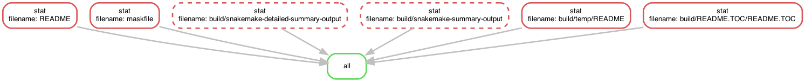
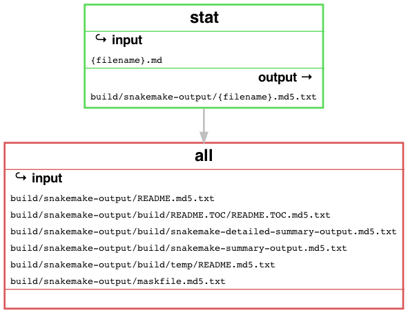

---
pandocomatic_:
    pandoc:
        from: markdown-smart
        to: gfm
        filter:
        - pandoc-include-code
        lua-filter:
        - ./build/pandoc-lua-filters/include-files/include-files.lua
        output: README.md
...

# snakemake

<!-- markdownlint-disable MD007 MD030 -->
```{.include}
./build/README.TOC/README.TOC.md
```
<!-- markdownlint-enable MD007 MD030 -->

# Snakefile

```{.Snakefile include=./Snakefile}
```

# Mask SubCommands

[Mask Awesome](https://github.com/huzhenghui/mask-awesome)

## snakemake-version

```bash
snakemake --version
```

### snakemake-version-output

```{.plain include=./build/snakemake-version-output.txt}
```

## install-packages

```bash
/usr/local/opt/snakemake/libexec/bin/pip install flask networkx ninja2 pygments pygraphviz
```

## snakemake-gui

```bash
snakemake --gui
```

## snakemake-lint

```bash
snakemake --lint
```

## snakemake-list

```bash
snakemake --list
```

### snakemake-list-output

```{.plain include=./build/snakemake-list-output.txt}
```

## snakemake-list-target-rules

```bash
snakemake --list-target-rules
```

### snakemake-list-target-rules-output

```{.plain include=./build/snakemake-list-target-rules-output.txt}
```

## snakemake-dag

```bash
snakemake --dag
```

### snakemake-dag-output

<!-- markdownlint-disable MD010 MD013 -->
```{.dot include=./build/snakemake-dag-output.dot}
```
<!-- markdownlint-enable MD010 MD013 -->



## snakemake-dag-xdot

```bash
detach -- xdot "${MASKFILE_DIR}/build/snakemake-dag-output.dot"
```

## snakemake-rulegraph

```bash
snakemake --rulegraph
```

### snakemake-rulegraph-output

<!-- markdownlint-disable MD010 -->
```{.dot include=./build/snakemake-rulegraph-output.dot}
```
<!-- markdownlint-enable MD010 -->


## snakemake-rulegraph-xdot

```bash
detach -- xdot "${MASKFILE_DIR}/build/snakemake-rulegraph-output.dot"
```

## snakemake-filegraph

```bash
snakemake --filegraph
```

### snakemake-filegraph-output

<!-- markdownlint-disable MD010 MD013 -->
```{.dot include=./build/snakemake-filegraph-output.dot}
```
<!-- markdownlint-enable MD010 MD013 -->



## snakemake-filegraph-xdot

```bash
detach -- xdot "${MASKFILE_DIR}/build/snakemake-filegraph-output.dot"
```

## snakemake-d3dag

```bash
snakemake --d3dag
```

### snakemake-d3dag-output

<!-- markdownlint-disable MD013 -->
```{.json include=./build/snakemake-d3dag-output.json}
```
<!-- markdownlint-enable MD013 -->

## snakemake-summary

```bash
snakemake --summary
```

### snakemake-summary-output

<!-- markdownlint-disable MD013 -->
```{.include}
./build/snakemake-summary-output.md
```
<!-- markdownlint-enable MD013 -->

## snakemake-detailed-summary

```bash
snakemake --detailed-summary --cores all
```

### snakemake-detailed-summary-output

<!-- markdownlint-disable MD013 -->
```{.include}
./build/snakemake-detailed-summary-output.md
```
<!-- markdownlint-enable MD013 -->

## snakemake-debug-dag

```bash
snakemake --debug-dag --cores all --forceall --dry-run
```

### snakemake-debug-dag-output

<!-- markdownlint-disable MD010 MD013 -->
```{.plain include=./build/snakemake-debug-dag-output.txt}
```
<!-- markdownlint-enable MD010 MD013 -->

## snakemake-print-compilation

```bash
snakemake --print-compilation | highlight --syntax python --out-format ansi
```

## snakemake-forceall

*   `--cores all`
    *   [EXECUTION](https://snakemake.readthedocs.io/en/stable/executing/cli.html#EXECUTION)

        > Use at most N CPU cores/jobs in parallel.
        > If N is omitted or ‘all’,
        > the limit is set to the number of available CPU cores.
*   `--forceall`
    *   [EXECUTION](https://snakemake.readthedocs.io/en/stable/executing/cli.html#EXECUTION)

        > Force the execution of the selected (or the first) rule and all rules
        > it is dependent on regardless of already created output.
*   `--mode 1`
    *   [BEHAVIOR](https://snakemake.readthedocs.io/en/stable/executing/cli.html#BEHAVIOR)

        > Possible choices: 0, 1, 2
        >
        > Set execution mode of Snakemake (internal use only).
        >
        > Default: 0
    *   [class snakemake.common.Mode](https://snakemake.readthedocs.io/en/stable/api_reference/internal/snakemake.html#snakemake.common.Mode)

        > Enum for execution mode of Snakemake.
        > This handles the behavior of e.g. the logger.
    *   [default = 0](https://snakemake.readthedocs.io/en/stable/api_reference/internal/snakemake.html#snakemake.common.Mode.default)
    *   [subprocess = 1](https://snakemake.readthedocs.io/en/stable/api_reference/internal/snakemake.html#snakemake.common.Mode.subprocess)
    *   [cluster = 2](https://snakemake.readthedocs.io/en/stable/api_reference/internal/snakemake.html#snakemake.common.Mode.cluster)
*   `--nocolor`
    *   [OUTPUT](https://snakemake.readthedocs.io/en/stable/executing/cli.html#OUTPUT)

        > Do not use a colored output.
*   `--printshellcmds`
    *   [OUTPUT](https://snakemake.readthedocs.io/en/stable/executing/cli.html#OUTPUT)

        > Print out the shell commands that will be executed.
*   `--reason`
    *   [OUTPUT](https://snakemake.readthedocs.io/en/stable/executing/cli.html#OUTPUT)

        > Print the reason for each executed rule.
*   `--stats`
    *   [OUTPUT](https://snakemake.readthedocs.io/en/stable/executing/cli.html#OUTPUT)

        > Write stats about Snakefile execution in JSON format to the given file.

```bash
snakemake \
    --cores all \
    --forceall \
    --mode 1 \
    --nocolor \
    --printshellcmds \
    --reason \
    --stats ./build/stats.json
```

### snakemake-forceall-stderr

<!-- markdownlint-disable MD010 MD013 -->
```{.plain include=./build/snakemake-forceall-stderr.txt}
```
<!-- markdownlint-enable MD010 MD013 -->

### snakemake-forceall-stats

<!-- markdownlint-disable MD013 -->
```{.json include=./build/stats.json}
```
<!-- markdownlint-enable MD013 -->

## snakemake-delete-all-output

```bash
snakemake --cores all --delete-all-output
```

## snakemake-help

```bash
snakemake --help
```

### snakemake-help-output

<!-- markdownlint-disable MD013 -->
```{.plain include=./build/snakemake-help-output.txt}
```
<!-- markdownlint-enable MD013 -->

## begin: mask task in template : build content

## ninja-rules

```bash
ninja -t rules
```

### ninja custom-rule

```{.ninja include=build.ninja snippet=custom-rule}
```

### ninja-rules-output

```{.plain include=./build/ninja/ninja-rules-output.txt}
```

## ninja-targets

```bash
ninja -t targets all
```

### ninja build-all

```{.ninja include=build.ninja snippet=build-all}
```

### ninja custom-build

```{.ninja include=build.ninja snippet=custom-build}

```

### ninja report-build

```{.ninja include=build.ninja snippet=report-build}

```

### ninja-targets-output

```{.plain include=./build/ninja/ninja-targets-output.txt}
```

## readme-md

```bash
ninja --verbose README.md
```

### ninja readme-build

```{.ninja include=build.ninja snippet=custom-readme-build}
```

```{.ninja include=build.ninja snippet=readme-build}
```

## end: mask task in template : build content

## begin: mask task in template : ninja command

## ninja-browse

```bash
ninja -t browse
```

## ninja-graph-png

```bash
dot -Tpng -o./build/ninja/ninja.graph.png ./build/ninja/ninja.graph.dot
```


## ninja-graph-dot-xdot

```bash
detach -- xdot "${MASKFILE_DIR}/build/ninja/ninja.graph.dot"
```

## ninja-graph-dot

```bash
ninja -t graph
```

### ninja-graph-dot-output

```{.dot include=./build/ninja/ninja.graph.dot}
```

## ninja-all

```bash
ninja --verbose -j 1
```

### build.ninja

```{.ninja include=./build.ninja}
```

## end: mask task in template : ninja command
