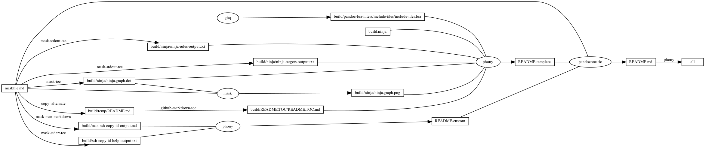

# ssh-copy-id

<!-- markdownlint-disable MD007 MD030 -->

-   [ssh-copy-id](#ssh-copy-id)
-   [Mask SubCommands](#mask-subcommands)
    -   [environment-remote](#environment-remote)
    -   [ssh-copy-id-dry-run](#ssh-copy-id-dry-run)
    -   [ssh-copy-id-force](#ssh-copy-id-force)
    -   [ssh](#ssh)
    -   [ssh-copy-id-help](#ssh-copy-id-help)
        -   [ssh-copy-id-help-output](#ssh-copy-id-help-output)
    -   [man-ssh-copy-id](#man-ssh-copy-id)
        -   [man-ssh-copy-id-output](#man-ssh-copy-id-output)
    -   [begin: mask task in template : build
        content](#begin-mask-task-in-template--build-content)
    -   [ninja-rules](#ninja-rules)
        -   [ninja custom-rule](#ninja-custom-rule)
        -   [ninja-rules-output](#ninja-rules-output)
    -   [ninja-targets](#ninja-targets)
        -   [ninja build-all](#ninja-build-all)
        -   [ninja custom-build](#ninja-custom-build)
        -   [ninja report-build](#ninja-report-build)
        -   [ninja-targets-output](#ninja-targets-output)
    -   [readme-md](#readme-md)
        -   [ninja readme-build](#ninja-readme-build)
    -   [end: mask task in template : build
        content](#end-mask-task-in-template--build-content)
    -   [begin: mask task in template : ninja
        command](#begin-mask-task-in-template--ninja-command)
    -   [ninja-browse](#ninja-browse)
    -   [ninja-graph-png](#ninja-graph-png)
    -   [ninja-graph-dot-xdot](#ninja-graph-dot-xdot)
    -   [ninja-graph-dot](#ninja-graph-dot)
        -   [ninja-graph-dot-output](#ninja-graph-dot-output)
    -   [ninja-all](#ninja-all)
        -   [build.ninja](#buildninja)
    -   [end: mask task in template : ninja
        command](#end-mask-task-in-template--ninja-command)

<!-- markdownlint-enable MD007 MD030 -->

# Mask SubCommands

[Mask Awesome](https://github.com/huzhenghui/mask-awesome)

## environment-remote

``` bash
echo "${remote_user}"
echo "${remote_hostname}"
```

## ssh-copy-id-dry-run

``` bash
/usr/bin/ssh-copy-id -n -i ~/.ssh/id_rsa.pub "${remote_user}@${remote_hostname}"
```

## ssh-copy-id-force

``` bash
/usr/bin/ssh-copy-id -f -i ~/.ssh/id_rsa.pub "${remote_user}@${remote_hostname}"
```

## ssh

``` bash
ssh "${remote_user}@${remote_hostname}" \
    "cat /proc/version;" \
    "uname -a;" \
    "df -h;" \
    "w;" \
    "whoami;" \
    "ifconfig;" \
    "route -n;" \
    "last"
```

## ssh-copy-id-help

``` bash
/usr/bin/ssh-copy-id -h
```

### ssh-copy-id-help-output

<!-- markdownlint-disable MD010 MD013 -->

``` plain
Usage: /usr/bin/ssh-copy-id [-h|-?|-f|-n] [-i [identity_file]] [-p port] [[-o <ssh -o options>] ...] [user@]hostname
	-f: force mode -- copy keys without trying to check if they are already installed
	-n: dry run    -- no keys are actually copied
	-h|-?: print this help
```

<!-- markdownlint-enable MD010 MD013 -->

## man-ssh-copy-id

``` bash
man ssh-copy-id
```

### man-ssh-copy-id-output

<!-- markdownlint-disable MD012 MD013 -->
<!-- vale off -->

  
SSH-COPY-ID(1)            BSD General Commands Manual           SSH-COPY-ID(1)  
  
**NAME**  
     **ssh-copy-id** – use locally available keys to authorise logins on a remote  
     machine  
  
**SYNOPSIS**  
     **ssh-copy-id** \[**-f**\] \[**-n**\] \[**-i** \[*identity\_file*\]\] \[**-p** *port*\] \[**-o** *ssh\_option*\]  
                 \[*user*@\]*hostname*  
     **ssh-copy-id** **-h** \| **-**?  
  
**DESCRIPTION**  
     **ssh-copy-id** is a script that uses ssh(1) to log into a remote machine  
     (presumably using a login password, so password authentication should be  
     enabled, unless you've done some clever use of multiple identities).  It  
     assembles a list of one or more fingerprints (as described below) and  
     tries to log in with each key, to see if any of them are already  
     installed (of course, if you are not using ssh-agent(1) this may result  
     in you being repeatedly prompted for pass-phrases).  It then assembles a  
     list of those that failed to log in, and using ssh, enables logins with  
     those keys on the remote server.  By default it adds the keys by append-  
     ing them to the remote user's *\~/.ssh/authorized\_keys* (creating the file,  
     and directory, if necessary).  It is also capable of detecting if the  
     remote system is a NetScreen, and using its \`set ssh pka-dsa key …'  
     command instead.  
  
     The options are as follows:  
  
     **-i** *identity\_file*  
             Use only the key(s) contained in *identity\_file* (rather than look-  
             ing for identities via ssh-add(1) or in the **default***\_***ID***\_***file**).  If  
             the filename does not end in *.pub* this is added.  If the filename  
             is omitted, the **default***\_***ID***\_***file** is used.  
  
             Note that this can be used to ensure that the keys copied have  
             the comment one prefers and/or extra options applied, by ensuring  
             that the key file has these set as preferred before the copy is  
             attempted.  
  
     **-f**      Forced mode: doesn't check if the keys are present on the remote  
             server.  This means that it does not need the private key.  Of  
             course, this can result in more than one copy of the key being  
             installed on the remote system.  
  
     **-n**      do a dry-run.  Instead of installing keys on the remote system  
             simply prints the key(s) that would have been installed.  
  
     **-h**, **-**?  Print Usage summary  
  
     **-p** *port*, **-o** *ssh\_option*  
             These two options are simply passed through untouched, along with  
             their argument, to allow one to set the port or other ssh(1)  
             options, respectively.  
  
             Rather than specifying these as command line options, it is often  
             better to use (per-host) settings in ssh(1)'s configuration file:  
             ssh\_config(5).  
  
     Default behaviour without **-i**, is to check if \`ssh-add -L' provides any  
     output, and if so those keys are used.  Note that this results in the  
     comment on the key being the filename that was given to ssh-add(1) when  
     the key was loaded into your ssh-agent(1) rather than the comment con-  
     tained in that file, which is a bit of a shame.  Otherwise, if ssh-add(1)  
     provides no keys contents of the **default***\_***ID***\_***file** will be used.  
  
     The **default***\_***ID***\_***file** is the most recent file that matches: *\~/.ssh/id\*.pub*,  
     (excluding those that match *\~/.ssh/\*-cert.pub*) so if you create a key  
     that is not the one you want **ssh-copy-id** to use, just use touch(1) on  
     your preferred key's *.pub* file to reinstate it as the most recent.  
  
**EXAMPLES**  
     If you have already installed keys from one system on a lot of remote  
     hosts, and you then create a new key, on a new client machine, say, it  
     can be difficult to keep track of which systems on which you've installed  
     the new key.  One way of dealing with this is to load both the new key  
     and old key(s) into your ssh-agent(1).  Load the new key first, without  
     the **-c** option, then load one or more old keys into the agent, possibly by  
     ssh-ing to the client machine that has that old key, using the **-A** option  
     to allow agent forwarding:  
  
           user@newclient$ ssh-add  
           user@newclient$ ssh -A old.client  
           user@oldl$ ssh-add -c  
           … prompt for pass-phrase …  
           user@old$ logoff  
           user@newclient$ ssh someserver  
  
     now, if the new key is installed on the server, you'll be allowed in  
     unprompted, whereas if you only have the old key(s) enabled, you'll be  
     asked for confirmation, which is your cue to log back out and run  
  
           user@newclient$ ssh-copy-id -i someserver  
  
     The reason you might want to specify the -i option in this case is to  
     ensure that the comment on the installed key is the one from the *.pub*  
     file, rather than just the filename that was loaded into you agent.  It  
     also ensures that only the id you intended is installed, rather than all  
     the keys that you have in your ssh-agent(1).  Of course, you can specify  
     another id, or use the contents of the ssh-agent(1) as you prefer.  
  
     Having mentioned ssh-add(1)'s **-c** option, you might consider using this  
     whenever using agent forwarding to avoid your key being hijacked, but it  
     is much better to instead use ssh(1)'s *ProxyCommand* and **-W** option, to  
     bounce through remote servers while always doing direct end-to-end  
     authentication. This way the middle hop(s) don't get access to your  
     ssh-agent(1).  A web search for \`ssh proxycommand nc' should prove  
     enlightening (N.B. the modern approach is to use the **-W** option, rather  
     than nc(1)).  
  
**SEE** **ALSO**  
     ssh(1), ssh-agent(1), sshd(8)  
  
BSD                            January 24, 2021                            BSD  

<!-- vale on -->
<!-- markdownlint-enable MD012 MD013 -->

## begin: mask task in template : build content

## ninja-rules

``` bash
ninja -t rules
```

### ninja custom-rule

``` ninja
# custom rule here

```

### ninja-rules-output

``` plain
cmdshelf-repository
copy_alternate
ghq
github-markdown-toc
mask
mask-man-markdown
mask-screenshot
mask-stderr-tee
mask-stdout-csv-markdown
mask-stdout-json
mask-stdout-tee
mask-tee
pandocomatic
phony
```

## ninja-targets

``` bash
ninja -t targets all
```

### ninja build-all

``` ninja
build all: phony README.md

default all

```

### ninja custom-build

``` ninja
# custom build here

```

### ninja report-build

``` ninja
# report build here

```

### ninja-targets-output

``` plain
all: phony
build/pandoc-lua-filters/include-files/include-files.lua: ghq
build/ninja/ninja-rules-output.txt: mask-stdout-tee
build/ninja/ninja-targets-output.txt: mask-stdout-tee
build/ninja/ninja.graph.dot: mask-tee
build/ninja/ninja.graph.png: mask
build/temp/README.md: copy_alternate
build/README.TOC/README.TOC.md: github-markdown-toc
README-template: phony
build/ssh-copy-id-help-output.txt: mask-stderr-tee
build/man-ssh-copy-id-output.md: mask-man-markdown
README-custom: phony
README.md: pandocomatic
```

## readme-md

``` bash
ninja --verbose README.md
```

### ninja readme-build

``` ninja
build ./build/ssh-copy-id-help-output.txt : mask-stderr-tee ./maskfile.md
  mask_subcommand = ssh-copy-id-help

build ./build/man-ssh-copy-id-output.md : mask-man-markdown ./maskfile.md
  mask_subcommand = man-ssh-copy-id

build README-custom : phony $
  ./build/ssh-copy-id-help-output.txt $
  ./build/man-ssh-copy-id-output.md

```

``` ninja
build README.md : pandocomatic maskfile.md | README-template README-custom

```

## end: mask task in template : build content

## begin: mask task in template : ninja command

## ninja-browse

``` bash
ninja -t browse
```

## ninja-graph-png

``` bash
dot -Tpng -o./build/ninja/ninja.graph.png ./build/ninja/ninja.graph.dot
```



## ninja-graph-dot-xdot

``` bash
detach -- xdot "${MASKFILE_DIR}/build/ninja/ninja.graph.dot"
```

## ninja-graph-dot

``` bash
ninja -t graph
```

### ninja-graph-dot-output

``` dot
digraph ninja {
rankdir="LR"
node [fontsize=10, shape=box, height=0.25]
edge [fontsize=10]
"0x7fdfa4407fb0" [label="all"]
"0x7fdfa4408040" -> "0x7fdfa4407fb0" [label=" phony"]
"0x7fdfa4408040" [label="README.md"]
"0x7fdfa4409890" [label="pandocomatic", shape=ellipse]
"0x7fdfa4409890" -> "0x7fdfa4408040"
"0x7fdfa4408830" -> "0x7fdfa4409890" [arrowhead=none]
"0x7fdfa44091f0" -> "0x7fdfa4409890" [arrowhead=none]
"0x7fdfa44099d0" -> "0x7fdfa4409890" [arrowhead=none]
"0x7fdfa4408830" [label="maskfile.md"]
"0x7fdfa44091f0" [label="README-template"]
"0x7fdfa4409290" [label="phony", shape=ellipse]
"0x7fdfa4409290" -> "0x7fdfa44091f0"
"0x7fdfa4408570" -> "0x7fdfa4409290" [arrowhead=none]
"0x7fdfa44095d0" -> "0x7fdfa4409290" [arrowhead=none]
"0x7fdfa4408770" -> "0x7fdfa4409290" [arrowhead=none]
"0x7fdfa44089e0" -> "0x7fdfa4409290" [arrowhead=none]
"0x7fdfa4408c40" -> "0x7fdfa4409290" [arrowhead=none]
"0x7fdfa4408e80" -> "0x7fdfa4409290" [arrowhead=none]
"0x7fdfa4409140" -> "0x7fdfa4409290" [arrowhead=none]
"0x7fdfa4408570" [label="build/pandoc-lua-filters/include-files/include-files.lua"]
"0x7fdfa4408500" [label="ghq", shape=ellipse]
"0x7fdfa4408500" -> "0x7fdfa4408570"
"0x7fdfa44095d0" [label="build.ninja"]
"0x7fdfa4408770" [label="build/ninja/ninja-rules-output.txt"]
"0x7fdfa4408830" -> "0x7fdfa4408770" [label=" mask-stdout-tee"]
"0x7fdfa44089e0" [label="build/ninja/ninja-targets-output.txt"]
"0x7fdfa4408830" -> "0x7fdfa44089e0" [label=" mask-stdout-tee"]
"0x7fdfa4408c40" [label="build/ninja/ninja.graph.dot"]
"0x7fdfa4408830" -> "0x7fdfa4408c40" [label=" mask-tee"]
"0x7fdfa4408e80" [label="build/ninja/ninja.graph.png"]
"0x7fdfa4408e10" [label="mask", shape=ellipse]
"0x7fdfa4408e10" -> "0x7fdfa4408e80"
"0x7fdfa4408830" -> "0x7fdfa4408e10" [arrowhead=none]
"0x7fdfa4408c40" -> "0x7fdfa4408e10" [arrowhead=none]
"0x7fdfa4409140" [label="build/README.TOC/README.TOC.md"]
"0x7fdfa4408fa0" -> "0x7fdfa4409140" [label=" github-markdown-toc"]
"0x7fdfa4408fa0" [label="build/temp/README.md"]
"0x7fdfa4408830" -> "0x7fdfa4408fa0" [label=" copy_alternate"]
"0x7fdfa44099d0" [label="README-custom"]
"0x7fdfa4409960" [label="phony", shape=ellipse]
"0x7fdfa4409960" -> "0x7fdfa44099d0"
"0x7fdfa44093c0" -> "0x7fdfa4409960" [arrowhead=none]
"0x7fdfa44097c0" -> "0x7fdfa4409960" [arrowhead=none]
"0x7fdfa44093c0" [label="build/ssh-copy-id-help-output.txt"]
"0x7fdfa4408830" -> "0x7fdfa44093c0" [label=" mask-stderr-tee"]
"0x7fdfa44097c0" [label="build/man-ssh-copy-id-output.md"]
"0x7fdfa4408830" -> "0x7fdfa44097c0" [label=" mask-man-markdown"]
}
```



## ninja-all

``` bash
ninja --verbose
```

### build.ninja

``` ninja
builddir=./build
mask_subcommand = --help
mask_stdout_csv_markdowndelimiter = ","

#######################################
# begin: rule in template

rule mask
  command = mask --maskfile $in $mask_subcommand

rule mask-tee
  command = mask --maskfile $in $mask_subcommand 2>&1 | tee $out 1> /dev/null

rule mask-stdout-tee
  command = mask --maskfile $in $mask_subcommand 2>/dev/null | tee $out 1> /dev/null

rule mask-stderr-tee
  command = bash -c 'mask $mask_subcommand 1>/dev/null 2> >(tee $out)' || echo $$?

# <!-- markdownlint-disable MD013 -->
rule mask-man-markdown
  command = set -e && set -o pipefail && $
    mask --maskfile $in $mask_subcommand | $
    ul | $
    ansifilter --bbcode | $
    inv --search-root="$$(ghq list --full-path https://github.com/huzhenghui/pyinvoke-awesome)/bbcode" bbcode-parser-format | $
    pandoc --from=html --to=markdown | $
    tee $out 1> /dev/null
# <!-- markdownlint-enable MD013 -->

rule mask-stdout-csv-markdown
  command = mask --maskfile $in $mask_subcommand 2>/dev/null | $
    csvtomd --delimiter "$$(echo $mask_stdout_csv_markdowndelimiter)" | $
    tee $out 1> /dev/null

rule mask-stdout-json
  command = mask --maskfile $in $mask_subcommand 2>/dev/null | $
    jq | $
    tee $out 1> /dev/null

rule mask-screenshot
  command = $
    regular_logfile="./build/temp/$$(basename $out).mask-screenshot.logfile" && $
    rm -f -v "$${regular_logfile}" && $
    until [[ -s "$${regular_logfile}" ]]; do $
      screen_logfile="$$(mktemp -d)/logfile"; $
      echo "$${screen_logfile}"; $
      mkfifo "$${screen_logfile}"; $
      screen -L -Logfile "$${screen_logfile}" $
        -dmS mask-screenshot-"$$(basename $out)" $
        sh -c "stdbuf -o0 mask --maskfile $in $mask_subcommand; $
          date +'%F %T %Z %z - %+ https://github.com/huzhenghui' | lolcat;"; $
      dd bs=1 if="$${screen_logfile}" of="$${regular_logfile}"; $
    done && $
    ansifilter --html --encoding=utf8 --input="$${regular_logfile}" | $
      tee ./build/temp/"$$(basename $out)".mask-screenshot.html | $
      wkhtmltoimage --format png - "$out"

rule pandocomatic
  command = pandocomatic --input $in --output $out

rule github-markdown-toc
  command = gh-md-toc --hide-header --hide-footer --no-escape $in > $out

rule copy_alternate
  command = if [[ -f "$alternate" ]]; $
    then $
      cp "$alternate" "$out"; $
    else $
      cp "$in" "$out"; $
    fi;

rule ghq
  command = ghq get --update "$repository" && $
    find -d "$link_dirname" -exec rmdir {} \; && $
    ln -Fs "$$(ghq list --full-path $repository)" "$link_dirname"
  generator = 1

rule cmdshelf-repository
  command = $$( $
    cmdshelf remote list | ack "^$cmdshelf_name" 1>&2 || $
    cmdshelf remote add "$cmdshelf_name" "$cmdshelf_url" 1>&2 $
    ) && $
    repository_path="$$(realpath $${HOME}/.cmdshelf/remote/$cmdshelf_name)" && $
    echo "$${repository_path}" && $
    stub_path="$$(realpath ./build/$cmdshelf_name)" && $
    echo "$${stub_path}" && $
    find -d "$${stub_path}" -exec rmdir {} \; && $
    ln -Fs "$${repository_path}" "$${stub_path}"
  generator = 1

# end: rule in template
#######################################

#######################################
# start snippet custom-rule

# custom rule here

# end snippet custom-rule
#######################################

#######################################
# start snippet build-all

build all: phony README.md

default all

# end snippet build-all
#######################################

#######################################
# start snippet custom-build

# custom build here

# end snippet custom-build
#######################################

#######################################
# start snippet report-build

# report build here

# end snippet report-build
#######################################

#######################################
# begin: readme-build in template

# ninja will create ./build/pandoc-lua-filters/include-files/ automatically
build ./build/pandoc-lua-filters/include-files/include-files.lua : ghq
  repository = https://github.com/pandoc/lua-filters
  link_dirname = ./build/pandoc-lua-filters

build ./build/ninja/ninja-rules-output.txt : mask-stdout-tee ./maskfile.md
  mask_subcommand = ninja-rules

build ./build/ninja/ninja-targets-output.txt : mask-stdout-tee ./maskfile.md
  mask_subcommand = ninja-targets

build ./build/ninja/ninja.graph.dot : mask-tee ./maskfile.md
  mask_subcommand = ninja-graph-dot

build ./build/ninja/ninja.graph.png : mask ./maskfile.md | ./build/ninja/ninja.graph.dot
  mask_subcommand = ninja-graph-png

build ./build/temp/README.md : copy_alternate ./maskfile.md
  alternate = ./README.md

build ./build/README.TOC/README.TOC.md : github-markdown-toc ./build/temp/README.md

build README-template : phony $
  ./build/pandoc-lua-filters/include-files/include-files.lua $
  ./build.ninja $
  ./build/ninja/ninja-rules-output.txt $
  ./build/ninja/ninja-targets-output.txt $
  ./build/ninja/ninja.graph.dot $
  ./build/ninja/ninja.graph.png $
  ./build/README.TOC/README.TOC.md $

# end: readme-build in template
#######################################

#######################################
# start snippet custom-readme-build

build ./build/ssh-copy-id-help-output.txt : mask-stderr-tee ./maskfile.md
  mask_subcommand = ssh-copy-id-help

build ./build/man-ssh-copy-id-output.md : mask-man-markdown ./maskfile.md
  mask_subcommand = man-ssh-copy-id

build README-custom : phony $
  ./build/ssh-copy-id-help-output.txt $
  ./build/man-ssh-copy-id-output.md

# end snippet custom-readme-build
#######################################

#######################################
# $ followed by a newline
# escape the newline (continue the current line across a line break).
# start snippet readme-build

build README.md : pandocomatic maskfile.md | README-template README-custom

# end snippet readme-build
#######################################
```

## end: mask task in template : ninja command
