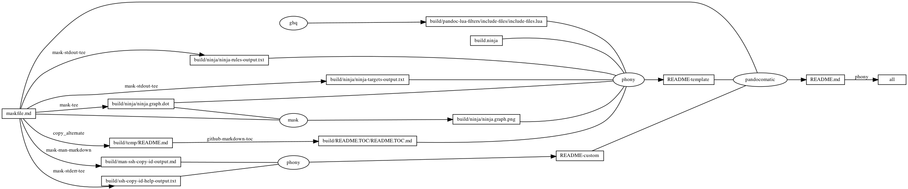

---
pandocomatic_:
    pandoc:
        from: markdown-smart
        to: gfm
        filter:
        - pandoc-include-code
        lua-filter:
        - ./build/pandoc-lua-filters/include-files/include-files.lua
        output: README.md
...

# ssh-copy-id

<!-- markdownlint-disable MD007 MD030 -->
```{.include}
./build/README.TOC/README.TOC.md
```
<!-- markdownlint-enable MD007 MD030 -->

# Mask SubCommands

[Mask Awesome](https://github.com/huzhenghui/mask-awesome)

## environment-remote

```bash
echo "${remote_user}"
echo "${remote_hostname}"
```

## ssh-copy-id-dry-run

```bash
/usr/bin/ssh-copy-id -n -i ~/.ssh/id_rsa.pub "${remote_user}@${remote_hostname}"
```

## ssh-copy-id-force

```bash
/usr/bin/ssh-copy-id -f -i ~/.ssh/id_rsa.pub "${remote_user}@${remote_hostname}"
```

## ssh

```bash
ssh "${remote_user}@${remote_hostname}" \
    "cat /proc/version;" \
    "uname -a;" \
    "df -h;" \
    "w;" \
    "whoami;" \
    "ifconfig;" \
    "route -n;" \
    "last"
```

## ssh-copy-id-help

```bash
/usr/bin/ssh-copy-id -h
```

### ssh-copy-id-help-output

<!-- markdownlint-disable MD010 MD013 -->
```{.plain include=./build/ssh-copy-id-help-output.txt}
```
<!-- markdownlint-enable MD010 MD013 -->

## man-ssh-copy-id

```bash
man ssh-copy-id
```

### man-ssh-copy-id-output

<!-- markdownlint-disable MD012 MD013 -->
<!-- vale off -->
```{.include}
./build/man-ssh-copy-id-output.md
```
<!-- vale on -->
<!-- markdownlint-enable MD012 MD013 -->

## begin: mask task in template : build content

## ninja-rules

```bash
ninja -t rules
```

### ninja custom-rule

```{.ninja include=build.ninja snippet=custom-rule}
```

### ninja-rules-output

```{.plain include=./build/ninja/ninja-rules-output.txt}
```

## ninja-targets

```bash
ninja -t targets all
```

### ninja build-all

```{.ninja include=build.ninja snippet=build-all}
```

### ninja custom-build

```{.ninja include=build.ninja snippet=custom-build}

```

### ninja report-build

```{.ninja include=build.ninja snippet=report-build}

```

### ninja-targets-output

```{.plain include=./build/ninja/ninja-targets-output.txt}
```

## readme-md

```bash
ninja --verbose README.md
```

### ninja readme-build

```{.ninja include=build.ninja snippet=custom-readme-build}
```

```{.ninja include=build.ninja snippet=readme-build}
```

## end: mask task in template : build content

## begin: mask task in template : ninja command

## ninja-browse

```bash
ninja -t browse
```

## ninja-graph-png

```bash
dot -Tpng -o./build/ninja/ninja.graph.png ./build/ninja/ninja.graph.dot
```



## ninja-graph-dot-xdot

```bash
detach -- xdot "${MASKFILE_DIR}/build/ninja/ninja.graph.dot"
```

## ninja-graph-dot

```bash
ninja -t graph
```

### ninja-graph-dot-output

```{.dot include=./build/ninja/ninja.graph.dot}
```

## ninja-all

```bash
ninja --verbose
```

### build.ninja

```{.ninja include=./build.ninja}
```

## end: mask task in template : ninja command
