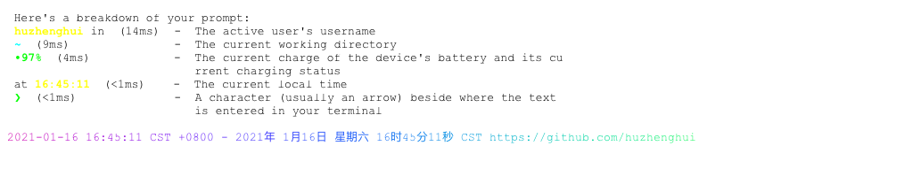
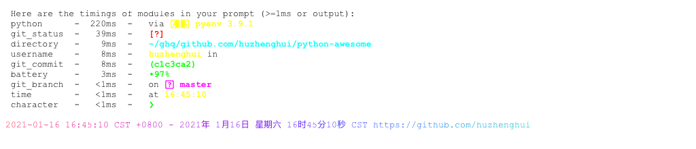

# starship

<!-- markdownlint-disable MD007 MD030 -->

-   [starship](#starship)
-   [Mask SubCommands](#mask-subcommands)
    -   [starship-init-powershell-profile](#starship-init-powershell-profile)
        -   [starship-init-powershell-profile-output](#starship-init-powershell-profile-output)
    -   [starship-init-powershell-profile-content](#starship-init-powershell-profile-content)
        -   [starship-init-powershell-profile-content-output](#starship-init-powershell-profile-content-output)
    -   [starship-config-name](#starship-config-name)
        -   [starship-config-name-output](#starship-config-name-output)
    -   [starship-config-cat](#starship-config-cat)
        -   [starship-config-content](#starship-config-content)
    -   [starship-prompt](#starship-prompt)
    -   [starship-explain](#starship-explain)
    -   [starship-timings](#starship-timings)
    -   [starship-init-bash](#starship-init-bash)
        -   [starship-init-bash-output](#starship-init-bash-output)
    -   [starship-init-zsh](#starship-init-zsh)
        -   [starship-init-zsh-output](#starship-init-zsh-output)
    -   [starship-init-fish](#starship-init-fish)
        -   [starship-init-fish-output](#starship-init-fish-output)
    -   [starship-init-powershell](#starship-init-powershell)
        -   [starship-init-powershell-output](#starship-init-powershell-output)
    -   [starship-init-ion](#starship-init-ion)
        -   [starship-init-ion-output](#starship-init-ion-output)
    -   [starship-module-list](#starship-module-list)
        -   [starship-module-list-output](#starship-module-list-output)
    -   [starship-module-username](#starship-module-username)
    -   [starship-module-directory](#starship-module-directory)
    -   [starship-module-git\_branch](#starship-module-git_branch)
    -   [starship-module-git\_commit](#starship-module-git_commit)
    -   [starship-module-git\_status](#starship-module-git_status)
    -   [starship-module-python](#starship-module-python)
    -   [starship-module-cmd\_duration](#starship-module-cmd_duration)
    -   [starship-module-jobs](#starship-module-jobs)
    -   [starship-module-battery](#starship-module-battery)
    -   [starship-module-time](#starship-module-time)
    -   [starship-module-status](#starship-module-status)
    -   [starship-module-character](#starship-module-character)
    -   [starship-session](#starship-session)
        -   [starship-session-output](#starship-session-output)
    -   [starship-help](#starship-help)
        -   [starship-help-output](#starship-help-output)
    -   [starship-completions-help](#starship-completions-help)
        -   [starship-completions-help-output](#starship-completions-help-output)
    -   [starship-config-help](#starship-config-help)
        -   [starship-config-help-output](#starship-config-help-output)
    -   [starship-explain-help](#starship-explain-help)
        -   [starship-explain-help-output](#starship-explain-help-output)
    -   [starship-init-help](#starship-init-help)
        -   [starship-init-help-output](#starship-init-help-output)
    -   [starship-module-help](#starship-module-help)
        -   [starship-module-help-outout](#starship-module-help-outout)
    -   [starship-prompt-help](#starship-prompt-help)
        -   [starship-prompt-help-outout](#starship-prompt-help-outout)
    -   [starship-session-help](#starship-session-help)
        -   [starship-session-help-outout](#starship-session-help-outout)
    -   [starship-timings-help](#starship-timings-help)
        -   [starship-timings-help-outout](#starship-timings-help-outout)
    -   [starship-completions-zsh](#starship-completions-zsh)
        -   [starship-completions-zsh-output](#starship-completions-zsh-output)
    -   [starship-completions-bash](#starship-completions-bash)
        -   [starship-completions-bash-output](#starship-completions-bash-output)
    -   [starship-completions-fish](#starship-completions-fish)
        -   [starship-completions-fish-output](#starship-completions-fish-output)
    -   [starship-completions-powershell](#starship-completions-powershell)
        -   [starship-completions-powershell-output](#starship-completions-powershell-output)
    -   [starship-completions-elvish](#starship-completions-elvish)
        -   [starship-completions-elvish-output](#starship-completions-elvish-output)
    -   [starship-init-bash-full](#starship-init-bash-full)
        -   [starship-init-bash-full-output](#starship-init-bash-full-output)
    -   [starship-init-zsh-full](#starship-init-zsh-full)
        -   [starship-init-zsh-full-output](#starship-init-zsh-full-output)
    -   [starship-init-fish-full](#starship-init-fish-full)
        -   [starship-init-fish-full-output](#starship-init-fish-full-output)
    -   [starship-init-powershell-full](#starship-init-powershell-full)
        -   [starship-init-powershell-full-output](#starship-init-powershell-full-output)
    -   [starship-init-ion-full](#starship-init-ion-full)
        -   [starship-init-ion-full-output](#starship-init-ion-full-output)
    -   [begin: mask task in template : build
        content](#begin-mask-task-in-template--build-content)
    -   [ninja-rules](#ninja-rules)
        -   [ninja custom-rule](#ninja-custom-rule)
        -   [ninja-rules-output](#ninja-rules-output)
    -   [ninja-targets](#ninja-targets)
        -   [ninja build-all](#ninja-build-all)
        -   [ninja custom-build](#ninja-custom-build)
        -   [ninja report-build](#ninja-report-build)
        -   [ninja-targets-output](#ninja-targets-output)
    -   [readme-md](#readme-md)
        -   [ninja readme-build](#ninja-readme-build)
    -   [end: mask task in template : build
        content](#end-mask-task-in-template--build-content)
    -   [begin: mask task in template : ninja
        command](#begin-mask-task-in-template--ninja-command)
    -   [ninja-browse](#ninja-browse)
    -   [ninja-graph-png](#ninja-graph-png)
    -   [ninja-graph-dot-xdot](#ninja-graph-dot-xdot)
    -   [ninja-graph-dot](#ninja-graph-dot)
        -   [ninja-graph-dot-output](#ninja-graph-dot-output)
    -   [ninja-all](#ninja-all)
        -   [build.ninja](#buildninja)
    -   [end: mask task in template : ninja
        command](#end-mask-task-in-template--ninja-command)

<!-- markdownlint-enable MD007 MD030 -->

# Mask SubCommands

[Mask Awesome](https://github.com/huzhenghui/mask-awesome)

## starship-init-powershell-profile

``` bash
cd
find ./.config/powershell -name '*_profile.ps1'
```

### starship-init-powershell-profile-output

``` plain
./.config/powershell/Microsoft.PowerShell_profile.ps1
./.config/powershell/Microsoft.VSCode_profile.ps1
```

## starship-init-powershell-profile-content

``` bash
cd
${MASK} starship-init-powershell-profile | \
    while read filename
    do
        cat "${filename}"
        echo
    done;
```

### starship-init-powershell-profile-content-output

``` pwsh
Invoke-Expression (&starship init powershell)
Invoke-Expression (&starship init powershell)
```

## starship-config-name

``` bash
EDITOR="echo" starship config |
    xargs /usr/local/opt/coreutils/bin/realpath  --relative-to="${HOME}"
```

### starship-config-name-output

``` plain
.config/starship.toml
```

## starship-config-cat

``` bash
EDITOR="cat" starship config
```

### starship-config-content

``` toml
add_newline = false

format = "$all"

[[battery.display]]
threshold = 10
style = "bold red"

[[battery.display]]
threshold = 30
style = "bold yellow"

[[battery.display]]
threshold = 100
style = "bold green"

[cmd_duration]
min_time = 100
show_milliseconds = true
show_notifications = true
min_time_to_notify = 1000

[directory]
truncation_length = 99
truncate_to_repo = false

[git_commit]
only_detached = false

[line_break]
disabled = true

[python]
pyenv_version_name = true

[status]
disabled = false

[time]
disabled = false

[username]
show_always = true
```

## starship-prompt

``` bash
cd $(ghq list --full-path https://github.com/huzhenghui/python-awesome)
starship prompt
echo
```


## starship-explain

``` bash
cd $(ghq list --full-path https://github.com/huzhenghui/python-awesome)
starship explain
echo
```



## starship-timings

``` bash
cd $(ghq list --full-path https://github.com/huzhenghui/python-awesome)
starship timings
echo
```



## starship-init-bash

``` bash
starship init bash
```

### starship-init-bash-output

<!-- markdownlint-disable MD013 -->

``` bash
if [ "${BASH_VERSINFO[0]}" -gt 4 ] || ([ "${BASH_VERSINFO[0]}" -eq 4 ] && [ "${BASH_VERSINFO[1]}" -ge 1 ])
then
source <("/usr/local/bin/starship" init bash --print-full-init)
else
source /dev/stdin <<<"$("/usr/local/bin/starship" init bash --print-full-init)"
fi
```

<!-- markdownlint-enable MD013 -->

## starship-init-zsh

``` zsh
starship init zsh
```

### starship-init-zsh-output

``` zsh
source <("/usr/local/bin/starship" init zsh --print-full-init)
```

## starship-init-fish

``` fish
starship init fish
```

### starship-init-fish-output

``` fish
source ("/usr/local/bin/starship" init fish --print-full-init | psub)
```

## starship-init-powershell

``` pwsh
starship init powershell
```

### starship-init-powershell-output

<!-- markdownlint-disable MD013 -->

``` pwsh
Invoke-Expression (@(&"/usr/local/bin/starship" init powershell --print-full-init) -join "`n")
```

<!-- markdownlint-enable MD013 -->

## starship-init-ion

``` ion
starship init ion
```

### starship-init-ion-output

``` ion
eval $(/usr/local/bin/starship init ion --print-full-init)
```

## starship-module-list

``` bash
starship module --list
```

### starship-module-list-output

``` plain
Supported modules list
----------------------
aws
battery
character
cmake
cmd_duration
conda
dart
directory
docker_context
dotnet
elixir
elm
erlang
env_var
gcloud
git_branch
git_commit
git_state
git_status
golang
helm
hg_branch
hostname
java
jobs
julia
kubernetes
line_break
lua
memory_usage
nim
nix_shell
nodejs
ocaml
openstack
package
perl
purescript
python
ruby
crystal
rust
php
swift
terraform
shlvl
singularity
status
time
username
zig
```

## starship-module-username

``` bash
starship module username
echo
```


## starship-module-directory

``` bash
starship module directory --path $(ghq list --full-path https://github.com/huzhenghui/mask-awesome)
echo
```


## starship-module-git\_branch

``` bash
starship module git_branch --path $(ghq list --full-path https://github.com/huzhenghui/mask-awesome)
echo
```


## starship-module-git\_commit

``` bash
starship module git_commit --path $(ghq list --full-path https://github.com/huzhenghui/mask-awesome)
echo
```


## starship-module-git\_status

``` bash
starship module git_status --path $(ghq list --full-path https://github.com/huzhenghui/mask-awesome)
echo
```


## starship-module-python

``` bash
cd $(ghq list --full-path https://github.com/huzhenghui/python-awesome)
starship module python
echo
```


## starship-module-cmd_duration

``` bash
starship module cmd_duration --cmd-duration 1
echo
starship module cmd_duration --cmd-duration 12
echo
starship module cmd_duration --cmd-duration 123
echo
starship module cmd_duration --cmd-duration 1234
echo
```

<!-- vale off -->


<!-- vale on -->

## starship-module-jobs

``` bash
starship module jobs --jobs 1
echo
starship module jobs --jobs 2
echo
starship module jobs --jobs 3
echo
starship module jobs --jobs 4
echo
starship module jobs --jobs 5
echo
```


## starship-module-battery

``` bash
starship module battery
echo
```


## starship-module-time

``` bash
starship module time
echo
```


## starship-module-status

``` bash
starship module status
echo
for s in {0..5}
do
    starship module status --status $s
    echo
done
```


## starship-module-character

``` bash
starship module character
echo
```


## starship-session

``` bash
starship session
```

### starship-session-output

``` plain
2ZiOrazXcvliFjUK
```

## starship-help

``` bash
starship --help
```

### starship-help-output

<!-- markdownlint-disable MD013 -->

``` plain
starship 0.47.0
Matan Kushner <hello@matchai.me>
The cross-shell prompt for astronauts. ☄🌌️

USAGE:
    starship <SUBCOMMAND>

FLAGS:
    -h, --help       Prints help information
    -V, --version    Prints version information

SUBCOMMANDS:
    bug-report     Create a pre-populated GitHub issue with information about your configuration
    completions    Generate starship shell completions for your shell to stdout
    config         Edit the starship configuration
    explain        Explains the currently showing modules
    help           Prints this message or the help of the given subcommand(s)
    init           Prints the shell function used to execute starship
    module         Prints a specific prompt module
    prompt         Prints the full starship prompt
    session        Generate random session key
    timings        Prints timings of all active modules

https://github.com/starship/starship
```

<!-- markdownlint-enable MD013 -->

## starship-completions-help

``` bash
starship completions --help
```

### starship-completions-help-output

<!-- markdownlint-disable MD013 -->

``` plain
starship-completions 
Generate starship shell completions for your shell to stdout

USAGE:
    starship completions <SHELL>

FLAGS:
    -h, --help       Prints help information
    -V, --version    Prints version information

ARGS:
    <SHELL>    the shell to generate completions for [env: STARSHIP_SHELL=]  [possible values: zsh, bash, fish,
               powershell, elvish]
```

<!-- markdownlint-enable MD013 -->

## starship-config-help

``` bash
starship config --help
```

### starship-config-help-output

``` plain
starship-config 
Edit the starship configuration

USAGE:
    starship config [ARGS]

FLAGS:
    -h, --help       Prints help information
    -V, --version    Prints version information

ARGS:
    <name>     Configuration key to edit
    <value>    Value to place into that key
```

## starship-explain-help

``` bash
starship explain --help
```

### starship-explain-help-output

``` plain
starship-explain 
Explains the currently showing modules

USAGE:
    starship explain

FLAGS:
    -h, --help       Prints help information
    -V, --version    Prints version information
```

## starship-init-help

``` bash
starship init --help
```

### starship-init-help-output

<!-- markdownlint-disable MD013 -->

``` plain
starship-init 
Prints the shell function used to execute starship

USAGE:
    starship init [FLAGS] <SHELL>

FLAGS:
    -h, --help               Prints help information
        --print-full-init    Print the main initialization script (as opposed to the init stub)
    -V, --version            Prints version information

ARGS:
    <SHELL>    The name of the currently running shell
               Currently supported options: bash, zsh, fish, powershell, ion
```

<!-- markdownlint-enable MD013 -->

## starship-module-help

``` bash
starship module --help
```

### starship-module-help-outout

<!-- markdownlint-disable MD013 -->

``` plain
starship-module 
Prints a specific prompt module

USAGE:
    starship module [FLAGS] [OPTIONS] <name>

FLAGS:
    -h, --help       Prints help information
    -l, --list       List out all supported modules
    -V, --version    Prints version information

OPTIONS:
    -d, --cmd-duration <CMD_DURATION>    The execution duration of the last command, in milliseconds
    -j, --jobs <JOBS>                    The number of currently running jobs
    -k, --keymap <KEYMAP>                The keymap of fish/zsh
    -p, --path <PATH>                    The path that the prompt should render for
    -s, --status <STATUS_CODE>           The status code of the previously run command

ARGS:
    <name>    The name of the module to be printed
```

<!-- markdownlint-enable MD013 -->

## starship-prompt-help

``` bash
starship prompt --help
```

### starship-prompt-help-outout

<!-- markdownlint-disable MD013 -->

``` plain
starship-prompt 
Prints the full starship prompt

USAGE:
    starship prompt [OPTIONS]

FLAGS:
    -h, --help       Prints help information
    -V, --version    Prints version information

OPTIONS:
    -d, --cmd-duration <CMD_DURATION>    The execution duration of the last command, in milliseconds
    -j, --jobs <JOBS>                    The number of currently running jobs
    -k, --keymap <KEYMAP>                The keymap of fish/zsh
    -p, --path <PATH>                    The path that the prompt should render for
    -s, --status <STATUS_CODE>           The status code of the previously run command
```

<!-- markdownlint-enable MD013 -->

## starship-session-help

``` bash
starship session --help
```

### starship-session-help-outout

``` plain
starship-session 
Generate random session key

USAGE:
    starship session

FLAGS:
    -h, --help       Prints help information
    -V, --version    Prints version information
```

## starship-timings-help

``` bash
starship timings --help
```

### starship-timings-help-outout

``` plain
starship-timings 
Prints timings of all active modules

USAGE:
    starship timings

FLAGS:
    -h, --help       Prints help information
    -V, --version    Prints version information
```

## starship-completions-zsh

``` zsh
starship completions zsh
```

### starship-completions-zsh-output

<!-- markdownlint-disable MD013 -->

``` zsh
#compdef starship

autoload -U is-at-least

_starship() {
    typeset -A opt_args
    typeset -a _arguments_options
    local ret=1

    if is-at-least 5.2; then
        _arguments_options=(-s -S -C)
    else
        _arguments_options=(-s -C)
    fi

    local context curcontext="$curcontext" state line
    _arguments "${_arguments_options[@]}" \
'-h[Prints help information]' \
'--help[Prints help information]' \
'-V[Prints version information]' \
'--version[Prints version information]' \
":: :_starship_commands" \
"*::: :->starship" \
&& ret=0
    case $state in
    (starship)
        words=($line[1] "${words[@]}")
        (( CURRENT += 1 ))
        curcontext="${curcontext%:*:*}:starship-command-$line[1]:"
        case $line[1] in
            (init)
_arguments "${_arguments_options[@]}" \
'--print-full-init[Print the main initialization script (as opposed to the init stub)]' \
'-h[Prints help information]' \
'--help[Prints help information]' \
'-V[Prints version information]' \
'--version[Prints version information]' \
':shell -- The name of the currently running shell
Currently supported options: bash, zsh, fish, powershell, ion:_files' \
&& ret=0
;;
(prompt)
_arguments "${_arguments_options[@]}" \
'-s+[The status code of the previously run command]' \
'--status=[The status code of the previously run command]' \
'-p+[The path that the prompt should render for]' \
'--path=[The path that the prompt should render for]' \
'-d+[The execution duration of the last command, in milliseconds]' \
'--cmd-duration=[The execution duration of the last command, in milliseconds]' \
'-k+[The keymap of fish/zsh]' \
'--keymap=[The keymap of fish/zsh]' \
'-j+[The number of currently running jobs]' \
'--jobs=[The number of currently running jobs]' \
'-h[Prints help information]' \
'--help[Prints help information]' \
'-V[Prints version information]' \
'--version[Prints version information]' \
&& ret=0
;;
(module)
_arguments "${_arguments_options[@]}" \
'-s+[The status code of the previously run command]' \
'--status=[The status code of the previously run command]' \
'-p+[The path that the prompt should render for]' \
'--path=[The path that the prompt should render for]' \
'-d+[The execution duration of the last command, in milliseconds]' \
'--cmd-duration=[The execution duration of the last command, in milliseconds]' \
'-k+[The keymap of fish/zsh]' \
'--keymap=[The keymap of fish/zsh]' \
'-j+[The number of currently running jobs]' \
'--jobs=[The number of currently running jobs]' \
'-l[List out all supported modules]' \
'--list[List out all supported modules]' \
'-h[Prints help information]' \
'--help[Prints help information]' \
'-V[Prints version information]' \
'--version[Prints version information]' \
':name -- The name of the module to be printed:_files' \
&& ret=0
;;
(configure)
_arguments "${_arguments_options[@]}" \
'-h[Prints help information]' \
'--help[Prints help information]' \
'-V[Prints version information]' \
'--version[Prints version information]' \
'::name -- Configuration key to edit:_files' \
'::value -- Value to place into that key:_files' \
&& ret=0
;;
(config)
_arguments "${_arguments_options[@]}" \
'-h[Prints help information]' \
'--help[Prints help information]' \
'-V[Prints version information]' \
'--version[Prints version information]' \
'::name -- Configuration key to edit:_files' \
'::value -- Value to place into that key:_files' \
&& ret=0
;;
(bug-report)
_arguments "${_arguments_options[@]}" \
'-h[Prints help information]' \
'--help[Prints help information]' \
'-V[Prints version information]' \
'--version[Prints version information]' \
&& ret=0
;;
(time)
_arguments "${_arguments_options[@]}" \
'-h[Prints help information]' \
'--help[Prints help information]' \
'-V[Prints version information]' \
'--version[Prints version information]' \
&& ret=0
;;
(explain)
_arguments "${_arguments_options[@]}" \
'-h[Prints help information]' \
'--help[Prints help information]' \
'-V[Prints version information]' \
'--version[Prints version information]' \
&& ret=0
;;
(timings)
_arguments "${_arguments_options[@]}" \
'-h[Prints help information]' \
'--help[Prints help information]' \
'-V[Prints version information]' \
'--version[Prints version information]' \
&& ret=0
;;
(completions)
_arguments "${_arguments_options[@]}" \
'-h[Prints help information]' \
'--help[Prints help information]' \
'-V[Prints version information]' \
'--version[Prints version information]' \
':shell -- the shell to generate completions for:(zsh bash fish powershell elvish)' \
&& ret=0
;;
(session)
_arguments "${_arguments_options[@]}" \
'-h[Prints help information]' \
'--help[Prints help information]' \
'-V[Prints version information]' \
'--version[Prints version information]' \
&& ret=0
;;
(help)
_arguments "${_arguments_options[@]}" \
'-h[Prints help information]' \
'--help[Prints help information]' \
'-V[Prints version information]' \
'--version[Prints version information]' \
&& ret=0
;;
        esac
    ;;
esac
}

(( $+functions[_starship_commands] )) ||
_starship_commands() {
    local commands; commands=(
        "init:Prints the shell function used to execute starship" \
"prompt:Prints the full starship prompt" \
"module:Prints a specific prompt module" \
"config:Edit the starship configuration" \
"bug-report:Create a pre-populated GitHub issue with information about your configuration" \
"time:Prints time in milliseconds" \
"explain:Explains the currently showing modules" \
"timings:Prints timings of all active modules" \
"completions:Generate starship shell completions for your shell to stdout" \
"session:Generate random session key" \
"help:Prints this message or the help of the given subcommand(s)" \
    )
    _describe -t commands 'starship commands' commands "$@"
}
(( $+functions[_starship__bug-report_commands] )) ||
_starship__bug-report_commands() {
    local commands; commands=(
        
    )
    _describe -t commands 'starship bug-report commands' commands "$@"
}
(( $+functions[_starship__completions_commands] )) ||
_starship__completions_commands() {
    local commands; commands=(
        
    )
    _describe -t commands 'starship completions commands' commands "$@"
}
(( $+functions[_starship__config_commands] )) ||
_starship__config_commands() {
    local commands; commands=(
        
    )
    _describe -t commands 'starship config commands' commands "$@"
}
(( $+functions[_configure_commands] )) ||
_configure_commands() {
    local commands; commands=(
        
    )
    _describe -t commands 'configure commands' commands "$@"
}
(( $+functions[_starship__configure_commands] )) ||
_starship__configure_commands() {
    local commands; commands=(
        
    )
    _describe -t commands 'starship configure commands' commands "$@"
}
(( $+functions[_starship__explain_commands] )) ||
_starship__explain_commands() {
    local commands; commands=(
        
    )
    _describe -t commands 'starship explain commands' commands "$@"
}
(( $+functions[_starship__help_commands] )) ||
_starship__help_commands() {
    local commands; commands=(
        
    )
    _describe -t commands 'starship help commands' commands "$@"
}
(( $+functions[_starship__init_commands] )) ||
_starship__init_commands() {
    local commands; commands=(
        
    )
    _describe -t commands 'starship init commands' commands "$@"
}
(( $+functions[_starship__module_commands] )) ||
_starship__module_commands() {
    local commands; commands=(
        
    )
    _describe -t commands 'starship module commands' commands "$@"
}
(( $+functions[_starship__prompt_commands] )) ||
_starship__prompt_commands() {
    local commands; commands=(
        
    )
    _describe -t commands 'starship prompt commands' commands "$@"
}
(( $+functions[_starship__session_commands] )) ||
_starship__session_commands() {
    local commands; commands=(
        
    )
    _describe -t commands 'starship session commands' commands "$@"
}
(( $+functions[_starship__time_commands] )) ||
_starship__time_commands() {
    local commands; commands=(
        
    )
    _describe -t commands 'starship time commands' commands "$@"
}
(( $+functions[_starship__timings_commands] )) ||
_starship__timings_commands() {
    local commands; commands=(
        
    )
    _describe -t commands 'starship timings commands' commands "$@"
}

_starship "$@"
```

<!-- markdownlint-enable MD013 -->

## starship-completions-bash

``` bash
starship completions bash
```

### starship-completions-bash-output

<!-- markdownlint-disable MD013 -->

``` bash
_starship() {
    local i cur prev opts cmds
    COMPREPLY=()
    cur="${COMP_WORDS[COMP_CWORD]}"
    prev="${COMP_WORDS[COMP_CWORD-1]}"
    cmd=""
    opts=""

    for i in ${COMP_WORDS[@]}
    do
        case "${i}" in
            starship)
                cmd="starship"
                ;;
            
            bug-report)
                cmd+="__bug__report"
                ;;
            completions)
                cmd+="__completions"
                ;;
            config)
                cmd+="__config"
                ;;
            configure)
                cmd+="__configure"
                ;;
            explain)
                cmd+="__explain"
                ;;
            help)
                cmd+="__help"
                ;;
            init)
                cmd+="__init"
                ;;
            module)
                cmd+="__module"
                ;;
            prompt)
                cmd+="__prompt"
                ;;
            session)
                cmd+="__session"
                ;;
            time)
                cmd+="__time"
                ;;
            timings)
                cmd+="__timings"
                ;;
            *)
                ;;
        esac
    done

    case "${cmd}" in
        starship)
            opts=" -h -V  --help --version   init prompt module config bug-report time explain timings completions session help  configure"
            if [[ ${cur} == -* || ${COMP_CWORD} -eq 1 ]] ; then
                COMPREPLY=( $(compgen -W "${opts}" -- "${cur}") )
                return 0
            fi
            case "${prev}" in
                
                *)
                    COMPREPLY=()
                    ;;
            esac
            COMPREPLY=( $(compgen -W "${opts}" -- "${cur}") )
            return 0
            ;;
        
        starship__bug__report)
            opts=" -h -V  --help --version  "
            if [[ ${cur} == -* || ${COMP_CWORD} -eq 2 ]] ; then
                COMPREPLY=( $(compgen -W "${opts}" -- "${cur}") )
                return 0
            fi
            case "${prev}" in
                
                *)
                    COMPREPLY=()
                    ;;
            esac
            COMPREPLY=( $(compgen -W "${opts}" -- "${cur}") )
            return 0
            ;;
        starship__completions)
            opts=" -h -V  --help --version  <SHELL> "
            if [[ ${cur} == -* || ${COMP_CWORD} -eq 2 ]] ; then
                COMPREPLY=( $(compgen -W "${opts}" -- "${cur}") )
                return 0
            fi
            case "${prev}" in
                
                *)
                    COMPREPLY=()
                    ;;
            esac
            COMPREPLY=( $(compgen -W "${opts}" -- "${cur}") )
            return 0
            ;;
        starship__config)
            opts=" -h -V  --help --version  <name> <value> "
            if [[ ${cur} == -* || ${COMP_CWORD} -eq 2 ]] ; then
                COMPREPLY=( $(compgen -W "${opts}" -- "${cur}") )
                return 0
            fi
            case "${prev}" in
                
                *)
                    COMPREPLY=()
                    ;;
            esac
            COMPREPLY=( $(compgen -W "${opts}" -- "${cur}") )
            return 0
            ;;
        starship__configure)
            opts=" -h -V  --help --version  <name> <value> "
            if [[ ${cur} == -* || ${COMP_CWORD} -eq 2 ]] ; then
                COMPREPLY=( $(compgen -W "${opts}" -- "${cur}") )
                return 0
            fi
            case "${prev}" in
                
                *)
                    COMPREPLY=()
                    ;;
            esac
            COMPREPLY=( $(compgen -W "${opts}" -- "${cur}") )
            return 0
            ;;
        starship__explain)
            opts=" -h -V  --help --version  "
            if [[ ${cur} == -* || ${COMP_CWORD} -eq 2 ]] ; then
                COMPREPLY=( $(compgen -W "${opts}" -- "${cur}") )
                return 0
            fi
            case "${prev}" in
                
                *)
                    COMPREPLY=()
                    ;;
            esac
            COMPREPLY=( $(compgen -W "${opts}" -- "${cur}") )
            return 0
            ;;
        starship__help)
            opts=" -h -V  --help --version  "
            if [[ ${cur} == -* || ${COMP_CWORD} -eq 2 ]] ; then
                COMPREPLY=( $(compgen -W "${opts}" -- "${cur}") )
                return 0
            fi
            case "${prev}" in
                
                *)
                    COMPREPLY=()
                    ;;
            esac
            COMPREPLY=( $(compgen -W "${opts}" -- "${cur}") )
            return 0
            ;;
        starship__init)
            opts=" -h -V  --print-full-init --help --version  <SHELL> "
            if [[ ${cur} == -* || ${COMP_CWORD} -eq 2 ]] ; then
                COMPREPLY=( $(compgen -W "${opts}" -- "${cur}") )
                return 0
            fi
            case "${prev}" in
                
                *)
                    COMPREPLY=()
                    ;;
            esac
            COMPREPLY=( $(compgen -W "${opts}" -- "${cur}") )
            return 0
            ;;
        starship__module)
            opts=" -l -h -V -s -p -d -k -j  --list --help --version --status --path --cmd-duration --keymap --jobs  <name> "
            if [[ ${cur} == -* || ${COMP_CWORD} -eq 2 ]] ; then
                COMPREPLY=( $(compgen -W "${opts}" -- "${cur}") )
                return 0
            fi
            case "${prev}" in
                
                --status)
                    COMPREPLY=($(compgen -f "${cur}"))
                    return 0
                    ;;
                    -s)
                    COMPREPLY=($(compgen -f "${cur}"))
                    return 0
                    ;;
                --path)
                    COMPREPLY=($(compgen -f "${cur}"))
                    return 0
                    ;;
                    -p)
                    COMPREPLY=($(compgen -f "${cur}"))
                    return 0
                    ;;
                --cmd-duration)
                    COMPREPLY=($(compgen -f "${cur}"))
                    return 0
                    ;;
                    -d)
                    COMPREPLY=($(compgen -f "${cur}"))
                    return 0
                    ;;
                --keymap)
                    COMPREPLY=($(compgen -f "${cur}"))
                    return 0
                    ;;
                    -k)
                    COMPREPLY=($(compgen -f "${cur}"))
                    return 0
                    ;;
                --jobs)
                    COMPREPLY=($(compgen -f "${cur}"))
                    return 0
                    ;;
                    -j)
                    COMPREPLY=($(compgen -f "${cur}"))
                    return 0
                    ;;
                *)
                    COMPREPLY=()
                    ;;
            esac
            COMPREPLY=( $(compgen -W "${opts}" -- "${cur}") )
            return 0
            ;;
        starship__prompt)
            opts=" -h -V -s -p -d -k -j  --help --version --status --path --cmd-duration --keymap --jobs  "
            if [[ ${cur} == -* || ${COMP_CWORD} -eq 2 ]] ; then
                COMPREPLY=( $(compgen -W "${opts}" -- "${cur}") )
                return 0
            fi
            case "${prev}" in
                
                --status)
                    COMPREPLY=($(compgen -f "${cur}"))
                    return 0
                    ;;
                    -s)
                    COMPREPLY=($(compgen -f "${cur}"))
                    return 0
                    ;;
                --path)
                    COMPREPLY=($(compgen -f "${cur}"))
                    return 0
                    ;;
                    -p)
                    COMPREPLY=($(compgen -f "${cur}"))
                    return 0
                    ;;
                --cmd-duration)
                    COMPREPLY=($(compgen -f "${cur}"))
                    return 0
                    ;;
                    -d)
                    COMPREPLY=($(compgen -f "${cur}"))
                    return 0
                    ;;
                --keymap)
                    COMPREPLY=($(compgen -f "${cur}"))
                    return 0
                    ;;
                    -k)
                    COMPREPLY=($(compgen -f "${cur}"))
                    return 0
                    ;;
                --jobs)
                    COMPREPLY=($(compgen -f "${cur}"))
                    return 0
                    ;;
                    -j)
                    COMPREPLY=($(compgen -f "${cur}"))
                    return 0
                    ;;
                *)
                    COMPREPLY=()
                    ;;
            esac
            COMPREPLY=( $(compgen -W "${opts}" -- "${cur}") )
            return 0
            ;;
        starship__session)
            opts=" -h -V  --help --version  "
            if [[ ${cur} == -* || ${COMP_CWORD} -eq 2 ]] ; then
                COMPREPLY=( $(compgen -W "${opts}" -- "${cur}") )
                return 0
            fi
            case "${prev}" in
                
                *)
                    COMPREPLY=()
                    ;;
            esac
            COMPREPLY=( $(compgen -W "${opts}" -- "${cur}") )
            return 0
            ;;
        starship__time)
            opts=" -h -V  --help --version  "
            if [[ ${cur} == -* || ${COMP_CWORD} -eq 2 ]] ; then
                COMPREPLY=( $(compgen -W "${opts}" -- "${cur}") )
                return 0
            fi
            case "${prev}" in
                
                *)
                    COMPREPLY=()
                    ;;
            esac
            COMPREPLY=( $(compgen -W "${opts}" -- "${cur}") )
            return 0
            ;;
        starship__timings)
            opts=" -h -V  --help --version  "
            if [[ ${cur} == -* || ${COMP_CWORD} -eq 2 ]] ; then
                COMPREPLY=( $(compgen -W "${opts}" -- "${cur}") )
                return 0
            fi
            case "${prev}" in
                
                *)
                    COMPREPLY=()
                    ;;
            esac
            COMPREPLY=( $(compgen -W "${opts}" -- "${cur}") )
            return 0
            ;;
    esac
}

complete -F _starship -o bashdefault -o default starship
```

<!-- markdownlint-enable MD013 -->

## starship-completions-fish

``` fish
starship completions fish
```

### starship-completions-fish-output

<!-- markdownlint-disable MD013 -->

``` fish
complete -c starship -n "__fish_use_subcommand" -s h -l help -d 'Prints help information'
complete -c starship -n "__fish_use_subcommand" -s V -l version -d 'Prints version information'
complete -c starship -n "__fish_use_subcommand" -f -a "init" -d 'Prints the shell function used to execute starship'
complete -c starship -n "__fish_use_subcommand" -f -a "prompt" -d 'Prints the full starship prompt'
complete -c starship -n "__fish_use_subcommand" -f -a "module" -d 'Prints a specific prompt module'
complete -c starship -n "__fish_use_subcommand" -f -a "config" -d 'Edit the starship configuration'
complete -c starship -n "__fish_use_subcommand" -f -a "bug-report" -d 'Create a pre-populated GitHub issue with information about your configuration'
complete -c starship -n "__fish_use_subcommand" -f -a "time" -d 'Prints time in milliseconds'
complete -c starship -n "__fish_use_subcommand" -f -a "explain" -d 'Explains the currently showing modules'
complete -c starship -n "__fish_use_subcommand" -f -a "timings" -d 'Prints timings of all active modules'
complete -c starship -n "__fish_use_subcommand" -f -a "completions" -d 'Generate starship shell completions for your shell to stdout'
complete -c starship -n "__fish_use_subcommand" -f -a "session" -d 'Generate random session key'
complete -c starship -n "__fish_use_subcommand" -f -a "help" -d 'Prints this message or the help of the given subcommand(s)'
complete -c starship -n "__fish_seen_subcommand_from init" -l print-full-init -d 'Print the main initialization script (as opposed to the init stub)'
complete -c starship -n "__fish_seen_subcommand_from init" -s h -l help -d 'Prints help information'
complete -c starship -n "__fish_seen_subcommand_from init" -s V -l version -d 'Prints version information'
complete -c starship -n "__fish_seen_subcommand_from prompt" -s s -l status -d 'The status code of the previously run command'
complete -c starship -n "__fish_seen_subcommand_from prompt" -s p -l path -d 'The path that the prompt should render for'
complete -c starship -n "__fish_seen_subcommand_from prompt" -s d -l cmd-duration -d 'The execution duration of the last command, in milliseconds'
complete -c starship -n "__fish_seen_subcommand_from prompt" -s k -l keymap -d 'The keymap of fish/zsh'
complete -c starship -n "__fish_seen_subcommand_from prompt" -s j -l jobs -d 'The number of currently running jobs'
complete -c starship -n "__fish_seen_subcommand_from prompt" -s h -l help -d 'Prints help information'
complete -c starship -n "__fish_seen_subcommand_from prompt" -s V -l version -d 'Prints version information'
complete -c starship -n "__fish_seen_subcommand_from module" -s s -l status -d 'The status code of the previously run command'
complete -c starship -n "__fish_seen_subcommand_from module" -s p -l path -d 'The path that the prompt should render for'
complete -c starship -n "__fish_seen_subcommand_from module" -s d -l cmd-duration -d 'The execution duration of the last command, in milliseconds'
complete -c starship -n "__fish_seen_subcommand_from module" -s k -l keymap -d 'The keymap of fish/zsh'
complete -c starship -n "__fish_seen_subcommand_from module" -s j -l jobs -d 'The number of currently running jobs'
complete -c starship -n "__fish_seen_subcommand_from module" -s l -l list -d 'List out all supported modules'
complete -c starship -n "__fish_seen_subcommand_from module" -s h -l help -d 'Prints help information'
complete -c starship -n "__fish_seen_subcommand_from module" -s V -l version -d 'Prints version information'
complete -c starship -n "__fish_seen_subcommand_from config" -s h -l help -d 'Prints help information'
complete -c starship -n "__fish_seen_subcommand_from config" -s V -l version -d 'Prints version information'
complete -c starship -n "__fish_seen_subcommand_from bug-report" -s h -l help -d 'Prints help information'
complete -c starship -n "__fish_seen_subcommand_from bug-report" -s V -l version -d 'Prints version information'
complete -c starship -n "__fish_seen_subcommand_from time" -s h -l help -d 'Prints help information'
complete -c starship -n "__fish_seen_subcommand_from time" -s V -l version -d 'Prints version information'
complete -c starship -n "__fish_seen_subcommand_from explain" -s h -l help -d 'Prints help information'
complete -c starship -n "__fish_seen_subcommand_from explain" -s V -l version -d 'Prints version information'
complete -c starship -n "__fish_seen_subcommand_from timings" -s h -l help -d 'Prints help information'
complete -c starship -n "__fish_seen_subcommand_from timings" -s V -l version -d 'Prints version information'
complete -c starship -n "__fish_seen_subcommand_from completions" -s h -l help -d 'Prints help information'
complete -c starship -n "__fish_seen_subcommand_from completions" -s V -l version -d 'Prints version information'
complete -c starship -n "__fish_seen_subcommand_from session" -s h -l help -d 'Prints help information'
complete -c starship -n "__fish_seen_subcommand_from session" -s V -l version -d 'Prints version information'
complete -c starship -n "__fish_seen_subcommand_from help" -s h -l help -d 'Prints help information'
complete -c starship -n "__fish_seen_subcommand_from help" -s V -l version -d 'Prints version information'
```

<!-- markdownlint-enable MD013 -->

## starship-completions-powershell

``` pwsh
starship completions powershell
```

### starship-completions-powershell-output

``` pwsh
using namespace System.Management.Automation
using namespace System.Management.Automation.Language

Register-ArgumentCompleter -Native -CommandName 'starship' -ScriptBlock {
    param($wordToComplete, $commandAst, $cursorPosition)

    $commandElements = $commandAst.CommandElements
    $command = @(
        'starship'
        for ($i = 1; $i -lt $commandElements.Count; $i++) {
            $element = $commandElements[$i]
            if ($element -isnot [StringConstantExpressionAst] -or
                $element.StringConstantType -ne [StringConstantType]::BareWord -or
                $element.Value.StartsWith('-')) {
                break
        }
        $element.Value
    }) -join ';'

    $completions = @(switch ($command) {
        'starship' {
            [CompletionResult]::new('-h', 'h', [CompletionResultType]::ParameterName, 'Prints help information')
            [CompletionResult]::new('--help', 'help', [CompletionResultType]::ParameterName, 'Prints help information')
            [CompletionResult]::new('-V', 'V', [CompletionResultType]::ParameterName, 'Prints version information')
            [CompletionResult]::new('--version', 'version', [CompletionResultType]::ParameterName, 'Prints version information')
            [CompletionResult]::new('init', 'init', [CompletionResultType]::ParameterValue, 'Prints the shell function used to execute starship')
            [CompletionResult]::new('prompt', 'prompt', [CompletionResultType]::ParameterValue, 'Prints the full starship prompt')
            [CompletionResult]::new('module', 'module', [CompletionResultType]::ParameterValue, 'Prints a specific prompt module')
            [CompletionResult]::new('config', 'config', [CompletionResultType]::ParameterValue, 'Edit the starship configuration')
            [CompletionResult]::new('bug-report', 'bug-report', [CompletionResultType]::ParameterValue, 'Create a pre-populated GitHub issue with information about your configuration')
            [CompletionResult]::new('time', 'time', [CompletionResultType]::ParameterValue, 'Prints time in milliseconds')
            [CompletionResult]::new('explain', 'explain', [CompletionResultType]::ParameterValue, 'Explains the currently showing modules')
            [CompletionResult]::new('timings', 'timings', [CompletionResultType]::ParameterValue, 'Prints timings of all active modules')
            [CompletionResult]::new('completions', 'completions', [CompletionResultType]::ParameterValue, 'Generate starship shell completions for your shell to stdout')
            [CompletionResult]::new('session', 'session', [CompletionResultType]::ParameterValue, 'Generate random session key')
            [CompletionResult]::new('help', 'help', [CompletionResultType]::ParameterValue, 'Prints this message or the help of the given subcommand(s)')
            break
        }
        'starship;init' {
            [CompletionResult]::new('--print-full-init', 'print-full-init', [CompletionResultType]::ParameterName, 'Print the main initialization script (as opposed to the init stub)')
            [CompletionResult]::new('-h', 'h', [CompletionResultType]::ParameterName, 'Prints help information')
            [CompletionResult]::new('--help', 'help', [CompletionResultType]::ParameterName, 'Prints help information')
            [CompletionResult]::new('-V', 'V', [CompletionResultType]::ParameterName, 'Prints version information')
            [CompletionResult]::new('--version', 'version', [CompletionResultType]::ParameterName, 'Prints version information')
            break
        }
        'starship;prompt' {
            [CompletionResult]::new('-s', 's', [CompletionResultType]::ParameterName, 'The status code of the previously run command')
            [CompletionResult]::new('--status', 'status', [CompletionResultType]::ParameterName, 'The status code of the previously run command')
            [CompletionResult]::new('-p', 'p', [CompletionResultType]::ParameterName, 'The path that the prompt should render for')
            [CompletionResult]::new('--path', 'path', [CompletionResultType]::ParameterName, 'The path that the prompt should render for')
            [CompletionResult]::new('-d', 'd', [CompletionResultType]::ParameterName, 'The execution duration of the last command, in milliseconds')
            [CompletionResult]::new('--cmd-duration', 'cmd-duration', [CompletionResultType]::ParameterName, 'The execution duration of the last command, in milliseconds')
            [CompletionResult]::new('-k', 'k', [CompletionResultType]::ParameterName, 'The keymap of fish/zsh')
            [CompletionResult]::new('--keymap', 'keymap', [CompletionResultType]::ParameterName, 'The keymap of fish/zsh')
            [CompletionResult]::new('-j', 'j', [CompletionResultType]::ParameterName, 'The number of currently running jobs')
            [CompletionResult]::new('--jobs', 'jobs', [CompletionResultType]::ParameterName, 'The number of currently running jobs')
            [CompletionResult]::new('-h', 'h', [CompletionResultType]::ParameterName, 'Prints help information')
            [CompletionResult]::new('--help', 'help', [CompletionResultType]::ParameterName, 'Prints help information')
            [CompletionResult]::new('-V', 'V', [CompletionResultType]::ParameterName, 'Prints version information')
            [CompletionResult]::new('--version', 'version', [CompletionResultType]::ParameterName, 'Prints version information')
            break
        }
        'starship;module' {
            [CompletionResult]::new('-s', 's', [CompletionResultType]::ParameterName, 'The status code of the previously run command')
            [CompletionResult]::new('--status', 'status', [CompletionResultType]::ParameterName, 'The status code of the previously run command')
            [CompletionResult]::new('-p', 'p', [CompletionResultType]::ParameterName, 'The path that the prompt should render for')
            [CompletionResult]::new('--path', 'path', [CompletionResultType]::ParameterName, 'The path that the prompt should render for')
            [CompletionResult]::new('-d', 'd', [CompletionResultType]::ParameterName, 'The execution duration of the last command, in milliseconds')
            [CompletionResult]::new('--cmd-duration', 'cmd-duration', [CompletionResultType]::ParameterName, 'The execution duration of the last command, in milliseconds')
            [CompletionResult]::new('-k', 'k', [CompletionResultType]::ParameterName, 'The keymap of fish/zsh')
            [CompletionResult]::new('--keymap', 'keymap', [CompletionResultType]::ParameterName, 'The keymap of fish/zsh')
            [CompletionResult]::new('-j', 'j', [CompletionResultType]::ParameterName, 'The number of currently running jobs')
            [CompletionResult]::new('--jobs', 'jobs', [CompletionResultType]::ParameterName, 'The number of currently running jobs')
            [CompletionResult]::new('-l', 'l', [CompletionResultType]::ParameterName, 'List out all supported modules')
            [CompletionResult]::new('--list', 'list', [CompletionResultType]::ParameterName, 'List out all supported modules')
            [CompletionResult]::new('-h', 'h', [CompletionResultType]::ParameterName, 'Prints help information')
            [CompletionResult]::new('--help', 'help', [CompletionResultType]::ParameterName, 'Prints help information')
            [CompletionResult]::new('-V', 'V', [CompletionResultType]::ParameterName, 'Prints version information')
            [CompletionResult]::new('--version', 'version', [CompletionResultType]::ParameterName, 'Prints version information')
            break
        }
        'starship;config' {
            [CompletionResult]::new('-h', 'h', [CompletionResultType]::ParameterName, 'Prints help information')
            [CompletionResult]::new('--help', 'help', [CompletionResultType]::ParameterName, 'Prints help information')
            [CompletionResult]::new('-V', 'V', [CompletionResultType]::ParameterName, 'Prints version information')
            [CompletionResult]::new('--version', 'version', [CompletionResultType]::ParameterName, 'Prints version information')
            break
        }
        'starship;bug-report' {
            [CompletionResult]::new('-h', 'h', [CompletionResultType]::ParameterName, 'Prints help information')
            [CompletionResult]::new('--help', 'help', [CompletionResultType]::ParameterName, 'Prints help information')
            [CompletionResult]::new('-V', 'V', [CompletionResultType]::ParameterName, 'Prints version information')
            [CompletionResult]::new('--version', 'version', [CompletionResultType]::ParameterName, 'Prints version information')
            break
        }
        'starship;time' {
            [CompletionResult]::new('-h', 'h', [CompletionResultType]::ParameterName, 'Prints help information')
            [CompletionResult]::new('--help', 'help', [CompletionResultType]::ParameterName, 'Prints help information')
            [CompletionResult]::new('-V', 'V', [CompletionResultType]::ParameterName, 'Prints version information')
            [CompletionResult]::new('--version', 'version', [CompletionResultType]::ParameterName, 'Prints version information')
            break
        }
        'starship;explain' {
            [CompletionResult]::new('-h', 'h', [CompletionResultType]::ParameterName, 'Prints help information')
            [CompletionResult]::new('--help', 'help', [CompletionResultType]::ParameterName, 'Prints help information')
            [CompletionResult]::new('-V', 'V', [CompletionResultType]::ParameterName, 'Prints version information')
            [CompletionResult]::new('--version', 'version', [CompletionResultType]::ParameterName, 'Prints version information')
            break
        }
        'starship;timings' {
            [CompletionResult]::new('-h', 'h', [CompletionResultType]::ParameterName, 'Prints help information')
            [CompletionResult]::new('--help', 'help', [CompletionResultType]::ParameterName, 'Prints help information')
            [CompletionResult]::new('-V', 'V', [CompletionResultType]::ParameterName, 'Prints version information')
            [CompletionResult]::new('--version', 'version', [CompletionResultType]::ParameterName, 'Prints version information')
            break
        }
        'starship;completions' {
            [CompletionResult]::new('-h', 'h', [CompletionResultType]::ParameterName, 'Prints help information')
            [CompletionResult]::new('--help', 'help', [CompletionResultType]::ParameterName, 'Prints help information')
            [CompletionResult]::new('-V', 'V', [CompletionResultType]::ParameterName, 'Prints version information')
            [CompletionResult]::new('--version', 'version', [CompletionResultType]::ParameterName, 'Prints version information')
            break
        }
        'starship;session' {
            [CompletionResult]::new('-h', 'h', [CompletionResultType]::ParameterName, 'Prints help information')
            [CompletionResult]::new('--help', 'help', [CompletionResultType]::ParameterName, 'Prints help information')
            [CompletionResult]::new('-V', 'V', [CompletionResultType]::ParameterName, 'Prints version information')
            [CompletionResult]::new('--version', 'version', [CompletionResultType]::ParameterName, 'Prints version information')
            break
        }
        'starship;help' {
            [CompletionResult]::new('-h', 'h', [CompletionResultType]::ParameterName, 'Prints help information')
            [CompletionResult]::new('--help', 'help', [CompletionResultType]::ParameterName, 'Prints help information')
            [CompletionResult]::new('-V', 'V', [CompletionResultType]::ParameterName, 'Prints version information')
            [CompletionResult]::new('--version', 'version', [CompletionResultType]::ParameterName, 'Prints version information')
            break
        }
    })

    $completions.Where{ $_.CompletionText -like "$wordToComplete*" } |
        Sort-Object -Property ListItemText
}
```

## starship-completions-elvish

``` elvish
starship completions elvish
```

### starship-completions-elvish-output

<!-- markdownlint-disable MD013 -->

``` elvish
edit:completion:arg-completer[starship] = [@words]{
    fn spaces [n]{
        repeat $n ' ' | joins ''
    }
    fn cand [text desc]{
        edit:complex-candidate $text &display-suffix=' '(spaces (- 14 (wcswidth $text)))$desc
    }
    command = 'starship'
    for word $words[1:-1] {
        if (has-prefix $word '-') {
            break
        }
        command = $command';'$word
    }
    completions = [
        &'starship'= {
            cand -h 'Prints help information'
            cand --help 'Prints help information'
            cand -V 'Prints version information'
            cand --version 'Prints version information'
            cand init 'Prints the shell function used to execute starship'
            cand prompt 'Prints the full starship prompt'
            cand module 'Prints a specific prompt module'
            cand config 'Edit the starship configuration'
            cand bug-report 'Create a pre-populated GitHub issue with information about your configuration'
            cand time 'Prints time in milliseconds'
            cand explain 'Explains the currently showing modules'
            cand timings 'Prints timings of all active modules'
            cand completions 'Generate starship shell completions for your shell to stdout'
            cand session 'Generate random session key'
            cand help 'Prints this message or the help of the given subcommand(s)'
        }
        &'starship;init'= {
            cand --print-full-init 'Print the main initialization script (as opposed to the init stub)'
            cand -h 'Prints help information'
            cand --help 'Prints help information'
            cand -V 'Prints version information'
            cand --version 'Prints version information'
        }
        &'starship;prompt'= {
            cand -s 'The status code of the previously run command'
            cand --status 'The status code of the previously run command'
            cand -p 'The path that the prompt should render for'
            cand --path 'The path that the prompt should render for'
            cand -d 'The execution duration of the last command, in milliseconds'
            cand --cmd-duration 'The execution duration of the last command, in milliseconds'
            cand -k 'The keymap of fish/zsh'
            cand --keymap 'The keymap of fish/zsh'
            cand -j 'The number of currently running jobs'
            cand --jobs 'The number of currently running jobs'
            cand -h 'Prints help information'
            cand --help 'Prints help information'
            cand -V 'Prints version information'
            cand --version 'Prints version information'
        }
        &'starship;module'= {
            cand -s 'The status code of the previously run command'
            cand --status 'The status code of the previously run command'
            cand -p 'The path that the prompt should render for'
            cand --path 'The path that the prompt should render for'
            cand -d 'The execution duration of the last command, in milliseconds'
            cand --cmd-duration 'The execution duration of the last command, in milliseconds'
            cand -k 'The keymap of fish/zsh'
            cand --keymap 'The keymap of fish/zsh'
            cand -j 'The number of currently running jobs'
            cand --jobs 'The number of currently running jobs'
            cand -l 'List out all supported modules'
            cand --list 'List out all supported modules'
            cand -h 'Prints help information'
            cand --help 'Prints help information'
            cand -V 'Prints version information'
            cand --version 'Prints version information'
        }
        &'starship;config'= {
            cand -h 'Prints help information'
            cand --help 'Prints help information'
            cand -V 'Prints version information'
            cand --version 'Prints version information'
        }
        &'starship;bug-report'= {
            cand -h 'Prints help information'
            cand --help 'Prints help information'
            cand -V 'Prints version information'
            cand --version 'Prints version information'
        }
        &'starship;time'= {
            cand -h 'Prints help information'
            cand --help 'Prints help information'
            cand -V 'Prints version information'
            cand --version 'Prints version information'
        }
        &'starship;explain'= {
            cand -h 'Prints help information'
            cand --help 'Prints help information'
            cand -V 'Prints version information'
            cand --version 'Prints version information'
        }
        &'starship;timings'= {
            cand -h 'Prints help information'
            cand --help 'Prints help information'
            cand -V 'Prints version information'
            cand --version 'Prints version information'
        }
        &'starship;completions'= {
            cand -h 'Prints help information'
            cand --help 'Prints help information'
            cand -V 'Prints version information'
            cand --version 'Prints version information'
        }
        &'starship;session'= {
            cand -h 'Prints help information'
            cand --help 'Prints help information'
            cand -V 'Prints version information'
            cand --version 'Prints version information'
        }
        &'starship;help'= {
            cand -h 'Prints help information'
            cand --help 'Prints help information'
            cand -V 'Prints version information'
            cand --version 'Prints version information'
        }
    ]
    $completions[$command]
}
```

<!-- markdownlint-enable MD013 -->

## starship-init-bash-full

``` bash
starship init bash  --print-full-init
```

### starship-init-bash-full-output

<!-- markdownlint-disable MD013 -->

``` bash
# We use PROMPT_COMMAND and the DEBUG trap to generate timing information. We try
# to avoid clobbering what we can, and try to give the user ways around our
# clobbers, if it's unavoidable. For example, PROMPT_COMMAND is appended to,
# and the DEBUG trap is layered with other traps, if it exists.

# A bash quirk is that the DEBUG trap is fired every time a command runs, even
# if it's later on in the pipeline. If uncorrected, this could cause bad timing
# data for commands like `slow | slow | fast`, since the timer starts at the start
# of the "fast" command.

# To solve this, we set a flag `PREEXEC_READY` when the prompt is drawn, and only
# start the timer if this flag is present. That way, timing is for the entire command,
# and not just a portion of it.

# Will be run before *every* command (even ones in pipes!)
starship_preexec() {
    # Save previous command's last argument, otherwise it will be set to "starship_preexec"
    local PREV_LAST_ARG=$1

    # Avoid restarting the timer for commands in the same pipeline
    if [ "$PREEXEC_READY" = "true" ]; then
        PREEXEC_READY=false
        STARSHIP_START_TIME=$("/usr/local/bin/starship" time)
    fi

    : "$PREV_LAST_ARG"
}

# Will be run before the prompt is drawn
starship_precmd() {
    # Save the status, because commands in this pipeline will change $?
    STATUS=$?

    # Run the bash precmd function, if it's set. If not set, evaluates to no-op
    "${starship_precmd_user_func-:}"

    eval "$_PRESERVED_PROMPT_COMMAND"

    # Prepare the timer data, if needed.
    if [[ $STARSHIP_START_TIME ]]; then
        STARSHIP_END_TIME=$("/usr/local/bin/starship" time)
        STARSHIP_DURATION=$((STARSHIP_END_TIME - STARSHIP_START_TIME))
        PS1="$("/usr/local/bin/starship" prompt --status=$STATUS --jobs="$(jobs -p | wc -l)" --cmd-duration=$STARSHIP_DURATION)"
        unset STARSHIP_START_TIME
    else
        PS1="$("/usr/local/bin/starship" prompt --status=$STATUS --jobs="$(jobs -p | wc -l)")"
    fi
    PREEXEC_READY=true  # Signal that we can safely restart the timer
}

# If the user appears to be using https://github.com/rcaloras/bash-preexec,
# then hook our functions into their framework.
if [[ $preexec_functions ]]; then
    preexec_functions+=('starship_preexec "$_"')
    precmd_functions+=(starship_precmd)
else
    # We want to avoid destroying an existing DEBUG hook. If we detect one, create
    # a new function that runs both the existing function AND our function, then
    # re-trap DEBUG to use this new function. This prevents a trap clobber.
    dbg_trap="$(trap -p DEBUG | cut -d' ' -f3 | tr -d \')"
    if [[ -z "$dbg_trap" ]]; then
        trap 'starship_preexec "$_"' DEBUG
    elif [[ "$dbg_trap" != 'starship_preexec "$_"' && "$dbg_trap" != 'starship_preexec_all "$_"' ]]; then
        starship_preexec_all() {
            local PREV_LAST_ARG=$1 ; $dbg_trap; starship_preexec; : "$PREV_LAST_ARG";
        }
        trap 'starship_preexec_all "$_"' DEBUG
    fi

    # Finally, prepare the precmd function and set up the start time. We will avoid to
    # add multiple instances of the starship function and keep other user functions if any.
    if [[ -z "$PROMPT_COMMAND" ]]; then
        PROMPT_COMMAND="starship_precmd"
    elif [[ "$PROMPT_COMMAND" != *"starship_precmd"* ]]; then
        # Appending to PROMPT_COMMAND breaks exit status ($?) checking.
        # Prepending to PROMPT_COMMAND breaks "command duration" module.
        # So, we are preserving the existing PROMPT_COMMAND
        # which will be executed later in the starship_precmd function
        _PRESERVED_PROMPT_COMMAND="$PROMPT_COMMAND"
        PROMPT_COMMAND="starship_precmd"
    fi
fi

# Set up the start time and STARSHIP_SHELL, which controls shell-specific sequences
STARSHIP_START_TIME=$("/usr/local/bin/starship" time)
export STARSHIP_SHELL="bash"

# Set up the session key that will be used to store logs
STARSHIP_SESSION_KEY="$RANDOM$RANDOM$RANDOM$RANDOM$RANDOM"; # Random generates a number b/w 0 - 32767
STARSHIP_SESSION_KEY="${STARSHIP_SESSION_KEY}0000000000000000" # Pad it to 16+ chars.
export STARSHIP_SESSION_KEY=${STARSHIP_SESSION_KEY:0:16}; # Trim to 16-digits if excess.
```

<!-- markdownlint-enable MD013 -->

## starship-init-zsh-full

``` zsh
starship init zsh --print-full-init
```

### starship-init-zsh-full-output

<!-- markdownlint-disable MD013 -->

``` zsh
# ZSH has a quirk where `preexec` is only run if a command is actually run (i.e
# pressing ENTER at an empty command line will not cause preexec to fire). This
# can cause timing issues, as a user who presses "ENTER" without running a command
# will see the time to the start of the last command, which may be very large.

# To fix this, we create STARSHIP_START_TIME upon preexec() firing, and destroy it
# after drawing the prompt. This ensures that the timing for one command is only
# ever drawn once (for the prompt immediately after it is run).

zmodload zsh/parameter  # Needed to access jobstates variable for NUM_JOBS

starship_render() {
    # Use length of jobstates array as number of jobs. Expansion fails inside
    # quotes so we set it here and then use the value later on.
    NUM_JOBS=$#jobstates
    PROMPT="$("/usr/local/bin/starship" prompt --keymap="${KEYMAP-}" --status=$STATUS --cmd-duration=${STARSHIP_DURATION-} --jobs="$NUM_JOBS")"
}

# Will be run before every prompt draw
starship_precmd() {
    # Save the status, because commands in this pipeline will change $?
    STATUS=$?

    # Compute cmd_duration, if we have a time to consume, otherwise clear the
    # previous duration
    if [[ -n "${STARSHIP_START_TIME+1}" ]]; then
        STARSHIP_END_TIME=$("/usr/local/bin/starship" time)
        STARSHIP_DURATION=$((STARSHIP_END_TIME - STARSHIP_START_TIME))
        unset STARSHIP_START_TIME
    else
        unset STARSHIP_DURATION
    fi

    # Render the updated prompt
    starship_render
}
starship_preexec() {
    STARSHIP_START_TIME=$("/usr/local/bin/starship" time)
}

# If precmd/preexec arrays are not already set, set them. If we don't do this,
# the code to detect whether starship_precmd is already in precmd_functions will
# fail because the array doesn't exist (and same for starship_preexec)
[[ -z "${precmd_functions+1}" ]] && precmd_functions=()
[[ -z "${preexec_functions+1}" ]] && preexec_functions=()

# If starship precmd/preexec functions are already hooked, don't double-hook them
# to avoid unnecessary performance degradation in nested shells
if [[ -z ${precmd_functions[(re)starship_precmd]} ]]; then
    precmd_functions+=(starship_precmd)
fi
if [[ -z ${preexec_function[(re)starship_preexec]} ]]; then
    preexec_functions+=(starship_preexec)
fi

# Set up a function to redraw the prompt if the user switches vi modes
starship_zle-keymap-select() {
    starship_render
    zle reset-prompt
}

## Check for existing keymap-select widget.
local existing_keymap_select_fn=$widgets[zle-keymap-select];
# zle-keymap-select is a special widget so it'll be "user:fnName" or nothing. Let's get fnName only.
existing_keymap_select_fn=${existing_keymap_select_fn//user:};
if [[ -z ${existing_keymap_select_fn} ]]; then
    zle -N zle-keymap-select starship_zle-keymap-select;
else
    # Define a wrapper fn to call the original widget fn and then Starship's.
    starship_zle-keymap-select-wrapped() {
        ${existing_keymap_select_fn} "$@";
        starship_zle-keymap-select "$@";
    }
    zle -N zle-keymap-select starship_zle-keymap-select-wrapped;
fi

STARSHIP_START_TIME=$("/usr/local/bin/starship" time)
export STARSHIP_SHELL="zsh"

# Set up the session key that will be used to store logs
STARSHIP_SESSION_KEY="$RANDOM$RANDOM$RANDOM$RANDOM$RANDOM"; # Random generates a number b/w 0 - 32767
STARSHIP_SESSION_KEY="${STARSHIP_SESSION_KEY}0000000000000000" # Pad it to 16+ chars.
export STARSHIP_SESSION_KEY=${STARSHIP_SESSION_KEY:0:16}; # Trim to 16-digits if excess.
```

<!-- markdownlint-enable MD013 -->

## starship-init-fish-full

``` fish
starship init fish --print-full-init
```

### starship-init-fish-full-output

<!-- markdownlint-disable MD013 -->

``` fish
function fish_prompt
    switch "$fish_key_bindings"
        case fish_hybrid_key_bindings fish_vi_key_bindings
            set keymap "$fish_bind_mode"
        case '*'
            set keymap insert
    end
    set -l exit_code $status
    # Account for changes in variable name between v2.7 and v3.0
    set -l starship_duration "$CMD_DURATION$cmd_duration"
    "/usr/local/bin/starship" prompt --status=$exit_code --keymap=$keymap --cmd-duration=$starship_duration --jobs=(count (jobs -p))
end

# disable virtualenv prompt, it breaks starship
set VIRTUAL_ENV_DISABLE_PROMPT 1

function fish_mode_prompt; end
export STARSHIP_SHELL="fish"

# Set up the session key that will be used to store logs
export STARSHIP_SESSION_KEY=("/usr/local/bin/starship" session)
```

<!-- markdownlint-enable MD013 -->

## starship-init-powershell-full

``` pwsh
starship init powershell --print-full-init
```

### starship-init-powershell-full-output

<!-- markdownlint-disable MD013 -->

``` pwsh
#!/usr/bin/env pwsh

function global:prompt {
    $origDollarQuestion = $global:?
    $origLastExitCode = $global:LASTEXITCODE

    $out = $null
    # @ makes sure the result is an array even if single or no values are returned
    $jobs = @(Get-Job | Where-Object { $_.State -eq 'Running' }).Count

    $env:PWD = $PWD
    $current_directory = (Convert-Path -LiteralPath $PWD)
    
    # Whe start from the premise that the command executed correctly, which covers also the fresh console.
    $lastExitCodeForPrompt = 0

    # Save old output encoding and set it to UTF-8
    $origOutputEncoding = [Console]::OutputEncoding
    [Console]::OutputEncoding = [System.Text.Encoding]::UTF8
    if ($lastCmd = Get-History -Count 1) {
        # In case we have a False on the Dollar hook, we know there's an error.
        if (-not $origDollarQuestion) {
            # We retrieve the InvocationInfo from the most recent error.
            $lastCmdletError = try { Get-Error |  Where-Object { $_ -ne $null } | Select-Object -expand InvocationInfo } catch { $null }
            # We check if the las command executed matches the line that caused the last error , in which case we know
            # it was an internal Powershell command, otherwise, there MUST be an error code.
            $lastExitCodeForPrompt = if ($null -ne $lastCmdletError -and $lastCmd.CommandLine -eq $lastCmdletError.Line) { 1 } else { $origLastExitCode }
        }

        $duration = [math]::Round(($lastCmd.EndExecutionTime - $lastCmd.StartExecutionTime).TotalMilliseconds)
        # & ensures the path is interpreted as something to execute
        $out = @(&"/usr/local/bin/starship" prompt "--path=$current_directory" --status=$lastExitCodeForPrompt --jobs=$jobs --cmd-duration=$duration)
    } else {
        $out = @(&"/usr/local/bin/starship" prompt "--path=$current_directory" --status=$lastExitCodeForPrompt --jobs=$jobs)
    }
    # Restore old output encoding
    [Console]::OutputEncoding = $origOutputEncoding

    # Convert stdout (array of lines) to expected return type string
    # `n is an escaped newline
    $out -join "`n"

    # Propagate the original $LASTEXITCODE from before the prompt function was invoked.
    $global:LASTEXITCODE = $origLastExitCode

    # Propagate the original $? automatic variable value from before the prompt function was invoked.
    #
    # $? is a read-only or constant variable so we can't directly override it.
    # In order to propagate up its original boolean value we will take an action
    # which will produce the desired value.
    #
    # This has to be the very last thing that happens in the prompt function
    # since every PowerShell command sets the $? variable.
    if ($global:? -ne $origDollarQuestion) {
        if ($origDollarQuestion) {
             # Simple command which will execute successfully and set $? = True without any other side affects.
            1+1
        } else {
            # Write-Error will set $? to False.
            # ErrorAction Ignore will prevent the error from being added to the $Error collection.
            Write-Error '' -ErrorAction 'Ignore'
        }
    }
}

$ENV:STARSHIP_SHELL = "powershell"

# Set up the session key that will be used to store logs
$ENV:STARSHIP_SESSION_KEY = -join ((48..57) + (65..90) + (97..122) | Get-Random -Count 16 | ForEach-Object { [char]$_ })
```

<!-- markdownlint-enable MD013 -->

## starship-init-ion-full

``` ion
starship init ion --print-full-init
```

### starship-init-ion-full-output

<!-- markdownlint-disable MD013 -->

``` ion
# The PROMPT function is called whenever a prompt needs to be drawn. Docs: https://doc.redox-os.org/ion-manual/html/misc/06-prompt_fn.html
fn PROMPT
    # Save the status immediately, since the status is also updated after variable assignment, etc.
    let STARSHIP_ION_STATUS = $?
    # Save the ION_CMD_DURATION before running any other commands, but after the status since the
    # duration is not updated during variable assignment
    # Account for variable name change sometime during December 2019 - January 2020
    let STARSHIP_ION_CMD_DURATION = $or($CMD_DURATION $ION_CMD_DURATION)
    let STARSHIP_ION_CMD_DURATION = $((STARSHIP_ION_CMD_DURATION * 1000))

    # The STARSHIP between the colons will be replaced with the actual path to the starship executable.
    # The jobs command outputs to stderr, therefore we need to pipe stderr to `wc -l`.
    "/usr/local/bin/starship" prompt --status $STARSHIP_ION_STATUS --jobs $(jobs ^| wc -l) --cmd-duration $STARSHIP_ION_CMD_DURATION
end

# Export the correct name of the shell
export STARSHIP_SHELL="ion"

# Set up the session key that will be used to store logs
export STARSHIP_SESSION_KEY=$("/usr/local/bin/starship" session)
```

<!-- markdownlint-enable MD013 -->

## begin: mask task in template : build content

## ninja-rules

``` bash
ninja -t rules
```

### ninja custom-rule

``` ninja
# custom rule here

```

### ninja-rules-output

``` plain
cmdshelf-repository
copy_alternate
ghq
github-markdown-toc
mask
mask-man-markdown
mask-screenshot
mask-stderr-tee
mask-stdout-csv-markdown
mask-stdout-tee
mask-tee
pandocomatic
phony
```

## ninja-targets

``` bash
ninja -t targets all
```

### ninja build-all

`{.ninja include=build.ninja snippet=build-all}∏`

### ninja custom-build

``` ninja
# custom build here

```

### ninja report-build

``` ninja
# report build here

```

### ninja-targets-output

``` plain
all: phony
build/pandoc-lua-filters/include-files/include-files.lua: ghq
build/ninja/ninja-rules-output.txt: mask-stdout-tee
build/ninja/ninja-targets-output.txt: mask-stdout-tee
build/ninja/ninja.graph.dot: mask-tee
build/ninja/ninja.graph.png: mask
build/temp/README.md: copy_alternate
build/README.TOC/README.TOC.md: github-markdown-toc
README-template: phony
build/starship-init-powershell-profile-output.txt: mask-stdout-tee
build/starship-init-powershell-profile-content-output.ps1: mask-stdout-tee
build/starship-config-name-output.txt: mask-stdout-tee
build/starship-config-content.toml: mask-stdout-tee
build/starship-prompt-output.png: mask-screenshot
build/starship-explain-output.png: mask-screenshot
build/starship-timings-output.png: mask-screenshot
build/starship-init-bash-output.sh: mask-stdout-tee
build/starship-init-zsh-output.sh: mask-stdout-tee
build/starship-init-fish-output.sh: mask-stdout-tee
build/starship-init-powershell-output.ps1: mask-stdout-tee
build/starship-init-ion-output.ion: mask-stdout-tee
build/starship-module-list-output.txt: mask-stdout-tee
build/starship-module-username-output.png: mask-screenshot
build/starship-module-directory-output.png: mask-screenshot
build/starship-module-git_branch-output.png: mask-screenshot
build/starship-module-git_commit-output.png: mask-screenshot
build/starship-module-git_status-output.png: mask-screenshot
build/starship-module-python-output.png: mask-screenshot
build/starship-module-cmd_durations-output.png: mask-screenshot
build/starship-module-jobs-output.png: mask-screenshot
build/starship-module-battery-output.png: mask-screenshot
build/starship-module-time-output.png: mask-screenshot
build/starship-module-status-output.png: mask-screenshot
build/starship-module-character-output.png: mask-screenshot
build/starship-session-output.txt: mask-stdout-tee
build/starship-help-output.txt: mask-stdout-tee
build/starship-completions-help-output.txt: mask-stdout-tee
build/starship-config-help-output.txt: mask-stdout-tee
build/starship-explain-help-output.txt: mask-stdout-tee
build/starship-init-help-output.txt: mask-stdout-tee
build/starship-module-help-outout.txt: mask-stdout-tee
build/starship-prompt-help-outout.txt: mask-stdout-tee
build/starship-session-help-outout.txt: mask-stdout-tee
build/starship-timings-help-outout.txt: mask-stdout-tee
build/starship-completions-zsh-output.sh: mask-stdout-tee
build/starship-completions-bash-output.sh: mask-stdout-tee
build/starship-completions-fish-output.sh: mask-stdout-tee
build/starship-completions-powershell-output.sh: mask-stdout-tee
build/starship-completions-elvish-output.sh: mask-stdout-tee
build/starship-init-bash-full-output.sh: mask-stdout-tee
build/starship-init-zsh-full-output.sh: mask-stdout-tee
build/starship-init-fish-full-output.sh: mask-stdout-tee
build/starship-init-powershell-full-output.ps1: mask-stdout-tee
build/starship-init-ion-full-output.ion: mask-stdout-tee
README-custom: phony
README.md: pandocomatic
```

## readme-md

``` bash
ninja --verbose README.md
```

### ninja readme-build

``` ninja
build ./build/starship-init-powershell-profile-output.txt : mask-stdout-tee ./maskfile.md
  mask_subcommand = starship-init-powershell-profile

build ./build/starship-init-powershell-profile-content-output.ps1 : $
  mask-stdout-tee ./maskfile.md
  mask_subcommand = starship-init-powershell-profile-content

build ./build/starship-config-name-output.txt : mask-stdout-tee ./maskfile.md
  mask_subcommand = starship-config-name

build ./build/starship-config-content.toml : mask-stdout-tee ./maskfile.md
  mask_subcommand = starship-config-cat

build ./build/starship-prompt-output.png : mask-screenshot ./maskfile.md
  mask_subcommand = starship-prompt

build ./build/starship-explain-output.png : mask-screenshot ./maskfile.md
  mask_subcommand = starship-explain

build ./build/starship-timings-output.png : mask-screenshot ./maskfile.md
  mask_subcommand = starship-timings

build ./build/starship-init-bash-output.sh : mask-stdout-tee ./maskfile.md
  mask_subcommand = starship-init-bash

build ./build/starship-init-zsh-output.sh : mask-stdout-tee ./maskfile.md
  mask_subcommand = starship-init-zsh

build ./build/starship-init-fish-output.sh : mask-stdout-tee ./maskfile.md
  mask_subcommand = starship-init-fish

build ./build/starship-init-powershell-output.ps1 : mask-stdout-tee ./maskfile.md
  mask_subcommand = starship-init-powershell

build ./build/starship-init-ion-output.ion : mask-stdout-tee ./maskfile.md
  mask_subcommand = starship-init-ion

build ./build/starship-module-list-output.txt : mask-stdout-tee ./maskfile.md
  mask_subcommand = starship-module-list

build ./build/starship-module-username-output.png : mask-screenshot ./maskfile.md
  mask_subcommand = starship-module-username

build ./build/starship-module-directory-output.png : mask-screenshot ./maskfile.md
  mask_subcommand = starship-module-directory

build ./build/starship-module-git_branch-output.png : mask-screenshot ./maskfile.md
  mask_subcommand = starship-module-git_branch

build ./build/starship-module-git_commit-output.png : mask-screenshot ./maskfile.md
  mask_subcommand = starship-module-git_commit

build ./build/starship-module-git_status-output.png : mask-screenshot ./maskfile.md
  mask_subcommand = starship-module-git_status

build ./build/starship-module-python-output.png : mask-screenshot ./maskfile.md
  mask_subcommand = starship-module-python

build ./build/starship-module-cmd_durations-output.png : mask-screenshot ./maskfile.md
  mask_subcommand = starship-module-cmd_duration

build ./build/starship-module-jobs-output.png : mask-screenshot ./maskfile.md
  mask_subcommand = starship-module-jobs

build ./build/starship-module-battery-output.png : mask-screenshot ./maskfile.md
  mask_subcommand = starship-module-battery

build ./build/starship-module-time-output.png : mask-screenshot ./maskfile.md
  mask_subcommand = starship-module-time

build ./build/starship-module-status-output.png : mask-screenshot ./maskfile.md
  mask_subcommand = starship-module-status

build ./build/starship-module-character-output.png : mask-screenshot ./maskfile.md
  mask_subcommand = starship-module-character

build ./build/starship-session-output.txt : mask-stdout-tee ./maskfile.md
  mask_subcommand = starship-session

build ./build/starship-help-output.txt : mask-stdout-tee ./maskfile.md
  mask_subcommand = starship-help

build ./build/starship-completions-help-output.txt : mask-stdout-tee ./maskfile.md
  mask_subcommand = starship-completions-help

build ./build/starship-config-help-output.txt : mask-stdout-tee ./maskfile.md
  mask_subcommand = starship-config-help

build ./build/starship-explain-help-output.txt : mask-stdout-tee ./maskfile.md
  mask_subcommand = starship-explain-help

build ./build/starship-init-help-output.txt : mask-stdout-tee ./maskfile.md
  mask_subcommand = starship-init-help

build ./build/starship-module-help-outout.txt : mask-stdout-tee ./maskfile.md
  mask_subcommand = starship-module-help

build ./build/starship-prompt-help-outout.txt : mask-stdout-tee ./maskfile.md
  mask_subcommand = starship-prompt-help

build ./build/starship-session-help-outout.txt : mask-stdout-tee ./maskfile.md
  mask_subcommand = starship-session-help

build ./build/starship-timings-help-outout.txt : mask-stdout-tee ./maskfile.md
  mask_subcommand = starship-timings-help

build ./build/starship-completions-zsh-output.sh : mask-stdout-tee ./maskfile.md
  mask_subcommand = starship-completions-zsh

build ./build/starship-completions-bash-output.sh : mask-stdout-tee ./maskfile.md
  mask_subcommand = starship-completions-bash

build ./build/starship-completions-fish-output.sh : mask-stdout-tee ./maskfile.md
  mask_subcommand = starship-completions-fish

build ./build/starship-completions-powershell-output.sh : mask-stdout-tee ./maskfile.md
  mask_subcommand = starship-completions-powershell

build ./build/starship-completions-elvish-output.sh : mask-stdout-tee ./maskfile.md
  mask_subcommand = starship-completions-elvish

build ./build/starship-init-bash-full-output.sh : mask-stdout-tee ./maskfile.md
  mask_subcommand = starship-init-bash-full

build ./build/starship-init-zsh-full-output.sh : mask-stdout-tee ./maskfile.md
  mask_subcommand = starship-init-zsh-full

build ./build/starship-init-fish-full-output.sh : mask-stdout-tee ./maskfile.md
  mask_subcommand = starship-init-fish-full

build ./build/starship-init-powershell-full-output.ps1 : mask-stdout-tee ./maskfile.md
  mask_subcommand = starship-init-powershell-full

build ./build/starship-init-ion-full-output.ion : mask-stdout-tee ./maskfile.md
  mask_subcommand = starship-init-ion-full

build README-custom : phony $
  ./build/starship-init-powershell-profile-output.txt $
  ./build/starship-init-powershell-profile-content-output.ps1 $
  ./build/starship-config-name-output.txt $
  ./build/starship-config-content.toml $
  ./build/starship-prompt-output.png $
  ./build/starship-explain-output.png $
  ./build/starship-timings-output.png $
  ./build/starship-init-bash-output.sh $
  ./build/starship-init-zsh-output.sh $
  ./build/starship-init-fish-output.sh $
  ./build/starship-init-powershell-output.ps1 $
  ./build/starship-init-ion-output.ion $
  ./build/starship-module-list-output.txt $
  ./build/starship-module-username-output.png $
  ./build/starship-module-directory-output.png $
  ./build/starship-module-git_branch-output.png $
  ./build/starship-module-git_commit-output.png $
  ./build/starship-module-git_status-output.png $
  ./build/starship-module-python-output.png $
  ./build/starship-module-cmd_durations-output.png $
  ./build/starship-module-jobs-output.png $
  ./build/starship-module-battery-output.png $
  ./build/starship-module-time-output.png $
  ./build/starship-module-status-output.png $
  ./build/starship-module-character-output.png $
  ./build/starship-session-output.txt $
  ./build/starship-help-output.txt $
  ./build/starship-completions-help-output.txt $
  ./build/starship-config-help-output.txt $
  ./build/starship-explain-help-output.txt $
  ./build/starship-init-help-output.txt $
  ./build/starship-module-help-outout.txt $
  ./build/starship-prompt-help-outout.txt $
  ./build/starship-session-help-outout.txt $
  ./build/starship-timings-help-outout.txt $
  ./build/starship-completions-zsh-output.sh $
  ./build/starship-completions-bash-output.sh $
  ./build/starship-completions-fish-output.sh $
  ./build/starship-completions-powershell-output.sh $
  ./build/starship-completions-elvish-output.sh $
  ./build/starship-init-bash-full-output.sh $
  ./build/starship-init-zsh-full-output.sh $
  ./build/starship-init-fish-full-output.sh $
  ./build/starship-init-powershell-full-output.ps1 $
  ./build/starship-init-ion-full-output.ion

```

``` ninja
build README.md : pandocomatic maskfile.md | README-template README-custom

```

## end: mask task in template : build content

## begin: mask task in template : ninja command

## ninja-browse

``` bash
ninja -t browse
```

## ninja-graph-png

``` bash
dot -Tpng -o./build/ninja/ninja.graph.png ./build/ninja/ninja.graph.dot
```


## ninja-graph-dot-xdot

``` bash
detach -- xdot "${MASKFILE_DIR}/build/ninja/ninja.graph.dot"
```

## ninja-graph-dot

``` bash
ninja -t graph
```

### ninja-graph-dot-output


## ninja-all

``` bash
ninja --verbose
```

### build.ninja

``` ninja
builddir=./build
mask_subcommand = --help
mask_stdout_csv_markdowndelimiter = ","

#######################################
# begin: rule in template

rule mask
  command = mask --maskfile $in $mask_subcommand

rule mask-tee
  command = mask --maskfile $in $mask_subcommand 2>&1 | tee $out 1> /dev/null

rule mask-stdout-tee
  command = mask --maskfile $in $mask_subcommand 2>/dev/null | tee $out 1> /dev/null

rule mask-stderr-tee
  command = bash -c 'mask $mask_subcommand 1>/dev/null 2> >(tee $out)'

# <!-- markdownlint-disable MD013 -->
rule mask-man-markdown
  command = set -e && set -o pipefail && $
    mask --maskfile $in $mask_subcommand | $
    ul | $
    ansifilter --bbcode | $
    inv --search-root="$$(ghq list --full-path https://github.com/huzhenghui/pyinvoke-awesome)/bbcode" bbcode-parser-format | $
    pandoc --from=html --to=markdown | $
    tee $out 1> /dev/null
# <!-- markdownlint-enable MD013 -->

rule mask-stdout-csv-markdown
  command = mask --maskfile $in $mask_subcommand 2>/dev/null | $
    csvtomd --delimiter "$$(echo $mask_stdout_csv_markdowndelimiter)" | $
    tee $out 1> /dev/null

rule mask-screenshot
  command = $
    regular_logfile="./build/temp/$$(basename $out).mask-screenshot.logfile" && $
    rm -f -v "$${regular_logfile}" && $
    until [[ -s "$${regular_logfile}" ]]; do $
      screen_logfile="$$(mktemp -d)/logfile"; $
      echo "$${screen_logfile}"; $
      mkfifo "$${screen_logfile}"; $
      screen -L -Logfile "$${screen_logfile}" $
        -dmS mask-screenshot-"$$(basename $out)" $
        sh -c "stdbuf -o0 mask --maskfile $in $mask_subcommand; $
          date +'%F %T %Z %z - %+ https://github.com/huzhenghui' | lolcat;"; $
      dd bs=1 if="$${screen_logfile}" of="$${regular_logfile}"; $
    done && $
    ansifilter --html --encoding=utf8 --input="$${regular_logfile}" | $
      tee ./build/temp/"$$(basename $out)".mask-screenshot.html | $
      wkhtmltoimage --format png - "$out"

rule pandocomatic
  command = pandocomatic --input $in --output $out

rule ghq
  command = ghq get --update "$repository" && $
    find -d "$link_dirname" -exec rmdir {} \; && $
    ln -Fs "$$(ghq list --full-path $repository)" "$link_dirname"
  generator = 1

rule github-markdown-toc
  command = gh-md-toc --hide-header --hide-footer --no-escape $in > $out

rule copy_alternate
  command = if [[ -f "$alternate" ]]; $
    then $
      cp "$alternate" "$out"; $
    else $
      cp "$in" "$out"; $
    fi;

rule cmdshelf-repository
  command = $$( $
    cmdshelf remote list | ack "^$cmdshelf_name" 1>&2 || $
    cmdshelf remote add "$cmdshelf_name" "$cmdshelf_url" 1>&2 $
    ) && $
    repository_path="$$(realpath $${HOME}/.cmdshelf/remote/$cmdshelf_name)" && $
    echo "$${repository_path}" && $
    stub_path="$$(realpath ./build/$cmdshelf_name)" && $
    echo "$${stub_path}" && $
    find -d "$${stub_path}" -exec rmdir {} \; && $
    ln -Fs "$${repository_path}" "$${stub_path}"
  generator = 1

# end: rule in template
#######################################

#######################################
# start snippet custom-rule

# custom rule here

# end snippet custom-rule
#######################################

#######################################
# start snippet build-all

build all: phony README.md

default all

# end snippet build-all
#######################################

#######################################
# start snippet custom-build

# custom build here

# end snippet custom-build
#######################################

#######################################
# start snippet report-build

# report build here

# end snippet report-build
#######################################

#######################################
# begin: readme-build in template

# ninja will create ./build/pandoc-lua-filters/include-files/ automatically
build ./build/pandoc-lua-filters/include-files/include-files.lua : ghq
  repository = https://github.com/pandoc/lua-filters
  link_dirname = ./build/pandoc-lua-filters

build ./build/ninja/ninja-rules-output.txt : mask-stdout-tee ./maskfile.md
  mask_subcommand = ninja-rules

build ./build/ninja/ninja-targets-output.txt : mask-stdout-tee ./maskfile.md
  mask_subcommand = ninja-targets

build ./build/ninja/ninja.graph.dot : mask-tee ./maskfile.md
  mask_subcommand = ninja-graph-dot

build ./build/ninja/ninja.graph.png : mask ./maskfile.md | ./build/ninja/ninja.graph.dot
  mask_subcommand = ninja-graph-png

build ./build/temp/README.md : copy_alternate ./maskfile.md
  alternate = ./README.md

build ./build/README.TOC/README.TOC.md : github-markdown-toc ./build/temp/README.md

build README-template : phony $
  ./build/pandoc-lua-filters/include-files/include-files.lua $
  ./build.ninja $
  ./build/ninja/ninja-rules-output.txt $
  ./build/ninja/ninja-targets-output.txt $
  ./build/ninja/ninja.graph.dot $
  ./build/ninja/ninja.graph.png $
  ./build/README.TOC/README.TOC.md $

# end: readme-build in template
#######################################

#######################################
# start snippet custom-readme-build

build ./build/starship-init-powershell-profile-output.txt : mask-stdout-tee ./maskfile.md
  mask_subcommand = starship-init-powershell-profile

build ./build/starship-init-powershell-profile-content-output.ps1 : $
  mask-stdout-tee ./maskfile.md
  mask_subcommand = starship-init-powershell-profile-content

build ./build/starship-config-name-output.txt : mask-stdout-tee ./maskfile.md
  mask_subcommand = starship-config-name

build ./build/starship-config-content.toml : mask-stdout-tee ./maskfile.md
  mask_subcommand = starship-config-cat

build ./build/starship-prompt-output.png : mask-screenshot ./maskfile.md
  mask_subcommand = starship-prompt

build ./build/starship-explain-output.png : mask-screenshot ./maskfile.md
  mask_subcommand = starship-explain

build ./build/starship-timings-output.png : mask-screenshot ./maskfile.md
  mask_subcommand = starship-timings

build ./build/starship-init-bash-output.sh : mask-stdout-tee ./maskfile.md
  mask_subcommand = starship-init-bash

build ./build/starship-init-zsh-output.sh : mask-stdout-tee ./maskfile.md
  mask_subcommand = starship-init-zsh

build ./build/starship-init-fish-output.sh : mask-stdout-tee ./maskfile.md
  mask_subcommand = starship-init-fish

build ./build/starship-init-powershell-output.ps1 : mask-stdout-tee ./maskfile.md
  mask_subcommand = starship-init-powershell

build ./build/starship-init-ion-output.ion : mask-stdout-tee ./maskfile.md
  mask_subcommand = starship-init-ion

build ./build/starship-module-list-output.txt : mask-stdout-tee ./maskfile.md
  mask_subcommand = starship-module-list

build ./build/starship-module-username-output.png : mask-screenshot ./maskfile.md
  mask_subcommand = starship-module-username

build ./build/starship-module-directory-output.png : mask-screenshot ./maskfile.md
  mask_subcommand = starship-module-directory

build ./build/starship-module-git_branch-output.png : mask-screenshot ./maskfile.md
  mask_subcommand = starship-module-git_branch

build ./build/starship-module-git_commit-output.png : mask-screenshot ./maskfile.md
  mask_subcommand = starship-module-git_commit

build ./build/starship-module-git_status-output.png : mask-screenshot ./maskfile.md
  mask_subcommand = starship-module-git_status

build ./build/starship-module-python-output.png : mask-screenshot ./maskfile.md
  mask_subcommand = starship-module-python

build ./build/starship-module-cmd_durations-output.png : mask-screenshot ./maskfile.md
  mask_subcommand = starship-module-cmd_duration

build ./build/starship-module-jobs-output.png : mask-screenshot ./maskfile.md
  mask_subcommand = starship-module-jobs

build ./build/starship-module-battery-output.png : mask-screenshot ./maskfile.md
  mask_subcommand = starship-module-battery

build ./build/starship-module-time-output.png : mask-screenshot ./maskfile.md
  mask_subcommand = starship-module-time

build ./build/starship-module-status-output.png : mask-screenshot ./maskfile.md
  mask_subcommand = starship-module-status

build ./build/starship-module-character-output.png : mask-screenshot ./maskfile.md
  mask_subcommand = starship-module-character

build ./build/starship-session-output.txt : mask-stdout-tee ./maskfile.md
  mask_subcommand = starship-session

build ./build/starship-help-output.txt : mask-stdout-tee ./maskfile.md
  mask_subcommand = starship-help

build ./build/starship-completions-help-output.txt : mask-stdout-tee ./maskfile.md
  mask_subcommand = starship-completions-help

build ./build/starship-config-help-output.txt : mask-stdout-tee ./maskfile.md
  mask_subcommand = starship-config-help

build ./build/starship-explain-help-output.txt : mask-stdout-tee ./maskfile.md
  mask_subcommand = starship-explain-help

build ./build/starship-init-help-output.txt : mask-stdout-tee ./maskfile.md
  mask_subcommand = starship-init-help

build ./build/starship-module-help-outout.txt : mask-stdout-tee ./maskfile.md
  mask_subcommand = starship-module-help

build ./build/starship-prompt-help-outout.txt : mask-stdout-tee ./maskfile.md
  mask_subcommand = starship-prompt-help

build ./build/starship-session-help-outout.txt : mask-stdout-tee ./maskfile.md
  mask_subcommand = starship-session-help

build ./build/starship-timings-help-outout.txt : mask-stdout-tee ./maskfile.md
  mask_subcommand = starship-timings-help

build ./build/starship-completions-zsh-output.sh : mask-stdout-tee ./maskfile.md
  mask_subcommand = starship-completions-zsh

build ./build/starship-completions-bash-output.sh : mask-stdout-tee ./maskfile.md
  mask_subcommand = starship-completions-bash

build ./build/starship-completions-fish-output.sh : mask-stdout-tee ./maskfile.md
  mask_subcommand = starship-completions-fish

build ./build/starship-completions-powershell-output.sh : mask-stdout-tee ./maskfile.md
  mask_subcommand = starship-completions-powershell

build ./build/starship-completions-elvish-output.sh : mask-stdout-tee ./maskfile.md
  mask_subcommand = starship-completions-elvish

build ./build/starship-init-bash-full-output.sh : mask-stdout-tee ./maskfile.md
  mask_subcommand = starship-init-bash-full

build ./build/starship-init-zsh-full-output.sh : mask-stdout-tee ./maskfile.md
  mask_subcommand = starship-init-zsh-full

build ./build/starship-init-fish-full-output.sh : mask-stdout-tee ./maskfile.md
  mask_subcommand = starship-init-fish-full

build ./build/starship-init-powershell-full-output.ps1 : mask-stdout-tee ./maskfile.md
  mask_subcommand = starship-init-powershell-full

build ./build/starship-init-ion-full-output.ion : mask-stdout-tee ./maskfile.md
  mask_subcommand = starship-init-ion-full

build README-custom : phony $
  ./build/starship-init-powershell-profile-output.txt $
  ./build/starship-init-powershell-profile-content-output.ps1 $
  ./build/starship-config-name-output.txt $
  ./build/starship-config-content.toml $
  ./build/starship-prompt-output.png $
  ./build/starship-explain-output.png $
  ./build/starship-timings-output.png $
  ./build/starship-init-bash-output.sh $
  ./build/starship-init-zsh-output.sh $
  ./build/starship-init-fish-output.sh $
  ./build/starship-init-powershell-output.ps1 $
  ./build/starship-init-ion-output.ion $
  ./build/starship-module-list-output.txt $
  ./build/starship-module-username-output.png $
  ./build/starship-module-directory-output.png $
  ./build/starship-module-git_branch-output.png $
  ./build/starship-module-git_commit-output.png $
  ./build/starship-module-git_status-output.png $
  ./build/starship-module-python-output.png $
  ./build/starship-module-cmd_durations-output.png $
  ./build/starship-module-jobs-output.png $
  ./build/starship-module-battery-output.png $
  ./build/starship-module-time-output.png $
  ./build/starship-module-status-output.png $
  ./build/starship-module-character-output.png $
  ./build/starship-session-output.txt $
  ./build/starship-help-output.txt $
  ./build/starship-completions-help-output.txt $
  ./build/starship-config-help-output.txt $
  ./build/starship-explain-help-output.txt $
  ./build/starship-init-help-output.txt $
  ./build/starship-module-help-outout.txt $
  ./build/starship-prompt-help-outout.txt $
  ./build/starship-session-help-outout.txt $
  ./build/starship-timings-help-outout.txt $
  ./build/starship-completions-zsh-output.sh $
  ./build/starship-completions-bash-output.sh $
  ./build/starship-completions-fish-output.sh $
  ./build/starship-completions-powershell-output.sh $
  ./build/starship-completions-elvish-output.sh $
  ./build/starship-init-bash-full-output.sh $
  ./build/starship-init-zsh-full-output.sh $
  ./build/starship-init-fish-full-output.sh $
  ./build/starship-init-powershell-full-output.ps1 $
  ./build/starship-init-ion-full-output.ion

# end snippet custom-readme-build
#######################################

#######################################
# $ followed by a newline
# escape the newline (continue the current line across a line break).
# start snippet readme-build

build README.md : pandocomatic maskfile.md | README-template README-custom

# end snippet readme-build
#######################################
```

## end: mask task in template : ninja command
