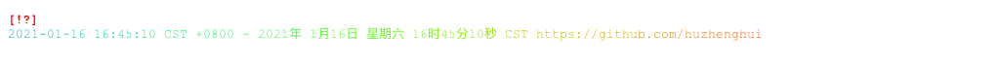
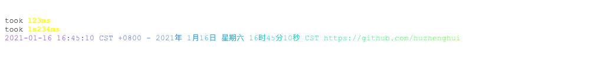
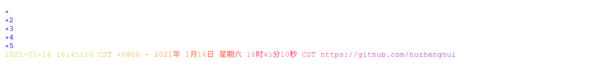
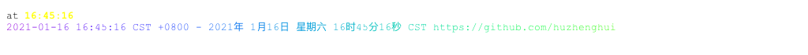
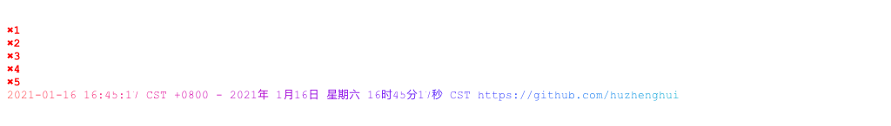
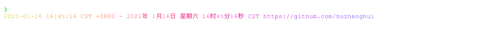
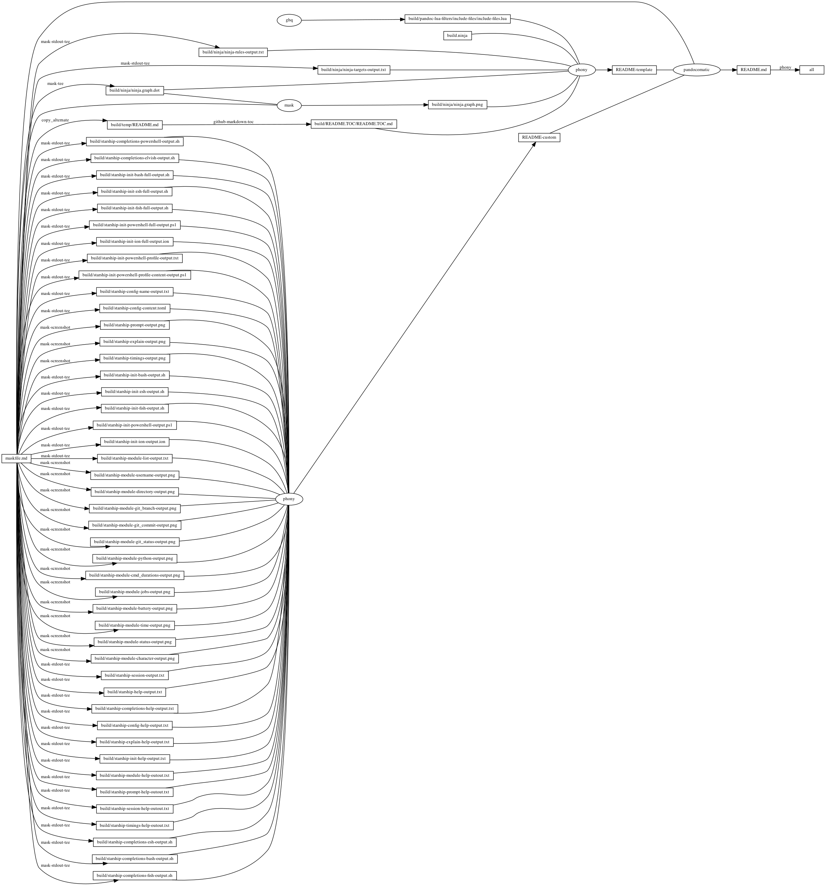

---
pandocomatic_:
    pandoc:
        from: markdown-smart
        to: gfm
        filter:
        - pandoc-include-code
        lua-filter:
        - ./build/pandoc-lua-filters/include-files/include-files.lua
        output: README.md
...

# starship

<!-- markdownlint-disable MD007 MD030 -->
```{.include}
./build/README.TOC/README.TOC.md
```
<!-- markdownlint-enable MD007 MD030 -->

# Mask SubCommands

[Mask Awesome](https://github.com/huzhenghui/mask-awesome)

## starship-init-powershell-profile

```bash
cd
find ./.config/powershell -name '*_profile.ps1'
```

### starship-init-powershell-profile-output

```{.plain include=./build/starship-init-powershell-profile-output.txt}
```

## starship-init-powershell-profile-content

```bash
cd
${MASK} starship-init-powershell-profile | \
    while read filename
    do
        cat "${filename}"
        echo
    done;
```

### starship-init-powershell-profile-content-output

```{.pwsh include=./build/starship-init-powershell-profile-content-output.ps1}
```

## starship-config-name

```bash
EDITOR="echo" starship config |
    xargs /usr/local/opt/coreutils/bin/realpath  --relative-to="${HOME}"
```

### starship-config-name-output

```{.plain include=./build/starship-config-name-output.txt}
```

## starship-config-cat

```bash
EDITOR="cat" starship config
```

### starship-config-content

```{.toml include=./build/starship-config-content.toml}
```

## starship-prompt

```bash
cd $(ghq list --full-path https://github.com/huzhenghui/python-awesome)
starship prompt
echo
```


## starship-explain

```bash
cd $(ghq list --full-path https://github.com/huzhenghui/python-awesome)
starship explain
echo
```


## starship-timings

```bash
cd $(ghq list --full-path https://github.com/huzhenghui/python-awesome)
starship timings
echo
```


## starship-init-bash

```bash
starship init bash
```

### starship-init-bash-output

<!-- markdownlint-disable MD013 -->
```{.bash include=./build/starship-init-bash-output.sh}
```
<!-- markdownlint-enable MD013 -->

## starship-init-zsh

```zsh
starship init zsh
```

### starship-init-zsh-output

```{.zsh include=./build/starship-init-zsh-output.sh}
```

## starship-init-fish

```fish
starship init fish
```

### starship-init-fish-output

```{.fish include=./build/starship-init-fish-output.sh}
```

## starship-init-powershell

```pwsh
starship init powershell
```

### starship-init-powershell-output

<!-- markdownlint-disable MD013 -->
```{.pwsh include=./build/starship-init-powershell-output.ps1}
```
<!-- markdownlint-enable MD013 -->

## starship-init-ion

```ion
starship init ion
```

### starship-init-ion-output

```{.ion include=./build/starship-init-ion-output.ion}
```

## starship-module-list

```bash
starship module --list
```

### starship-module-list-output

```{.plain include=./build/starship-module-list-output.txt}
```

## starship-module-username

```bash
starship module username
echo
```


## starship-module-directory

```bash
starship module directory --path $(ghq list --full-path https://github.com/huzhenghui/mask-awesome)
echo
```


## starship-module-git_branch

```bash
starship module git_branch --path $(ghq list --full-path https://github.com/huzhenghui/mask-awesome)
echo
```


## starship-module-git_commit

```bash
starship module git_commit --path $(ghq list --full-path https://github.com/huzhenghui/mask-awesome)
echo
```


## starship-module-git_status

```bash
starship module git_status --path $(ghq list --full-path https://github.com/huzhenghui/mask-awesome)
echo
```



## starship-module-python

```bash
cd $(ghq list --full-path https://github.com/huzhenghui/python-awesome)
starship module python
echo
```


## starship-module-cmd_duration

```bash
starship module cmd_duration --cmd-duration 1
echo
starship module cmd_duration --cmd-duration 12
echo
starship module cmd_duration --cmd-duration 123
echo
starship module cmd_duration --cmd-duration 1234
echo
```

<!-- vale off -->

<!-- vale on -->

## starship-module-jobs

```bash
starship module jobs --jobs 1
echo
starship module jobs --jobs 2
echo
starship module jobs --jobs 3
echo
starship module jobs --jobs 4
echo
starship module jobs --jobs 5
echo
```



## starship-module-battery

```bash
starship module battery
echo
```


## starship-module-time

```bash
starship module time
echo
```



## starship-module-status

```bash
starship module status
echo
for s in {0..5}
do
    starship module status --status $s
    echo
done
```



## starship-module-character

```bash
starship module character
echo
```



## starship-session

```bash
starship session
```

### starship-session-output

```{.plain include=./build/starship-session-output.txt}
```

## starship-help

```bash
starship --help
```

### starship-help-output

<!-- markdownlint-disable MD013 -->
```{.plain include=./build/starship-help-output.txt}
```
<!-- markdownlint-enable MD013 -->

## starship-completions-help

```bash
starship completions --help
```

### starship-completions-help-output

<!-- markdownlint-disable MD013 -->
```{.plain include=./build/starship-completions-help-output.txt}
```
<!-- markdownlint-enable MD013 -->

## starship-config-help

```bash
starship config --help
```

### starship-config-help-output

```{.plain include=./build/starship-config-help-output.txt}
```

## starship-explain-help

```bash
starship explain --help
```

### starship-explain-help-output

```{.plain include=./build/starship-explain-help-output.txt}
```

## starship-init-help

```bash
starship init --help
```

### starship-init-help-output

<!-- markdownlint-disable MD013 -->
```{.plain include=./build/starship-init-help-output.txt}
```
<!-- markdownlint-enable MD013 -->

## starship-module-help

```bash
starship module --help
```

### starship-module-help-outout

<!-- markdownlint-disable MD013 -->
```{.plain include=./build/starship-module-help-outout.txt}
```
<!-- markdownlint-enable MD013 -->

## starship-prompt-help

```bash
starship prompt --help
```

### starship-prompt-help-outout

<!-- markdownlint-disable MD013 -->
```{.plain include=./build/starship-prompt-help-outout.txt}
```
<!-- markdownlint-enable MD013 -->

## starship-session-help

```bash
starship session --help
```

### starship-session-help-outout

```{.plain include=./build/starship-session-help-outout.txt}
```## starship-session-help
```

## starship-timings-help

```bash
starship timings --help
```

### starship-timings-help-outout

```{.plain include=./build/starship-timings-help-outout.txt}
```

## starship-completions-zsh

```zsh
starship completions zsh
```

### starship-completions-zsh-output

<!-- markdownlint-disable MD013 -->
```{.zsh include=./build/starship-completions-zsh-output.sh}
```
<!-- markdownlint-enable MD013 -->

## starship-completions-bash

```bash
starship completions bash
```

### starship-completions-bash-output

<!-- markdownlint-disable MD013 -->
```{.bash include=./build/starship-completions-bash-output.sh}
```
<!-- markdownlint-enable MD013 -->

## starship-completions-fish

```fish
starship completions fish
```

### starship-completions-fish-output

<!-- markdownlint-disable MD013 -->
```{.fish include=./build/starship-completions-fish-output.sh}
```
<!-- markdownlint-enable MD013 -->

## starship-completions-powershell

```pwsh
starship completions powershell
```

### starship-completions-powershell-output

```{.pwsh include=./build/starship-completions-powershell-output.sh}
```

## starship-completions-elvish

```elvish
starship completions elvish
```

### starship-completions-elvish-output

<!-- markdownlint-disable MD013 -->
```{.elvish include=./build/starship-completions-elvish-output.sh}
```
<!-- markdownlint-enable MD013 -->

## starship-init-bash-full

```bash
starship init bash  --print-full-init
```

### starship-init-bash-full-output

<!-- markdownlint-disable MD013 -->
```{.bash include=./build/starship-init-bash-full-output.sh}
```
<!-- markdownlint-enable MD013 -->

## starship-init-zsh-full

```zsh
starship init zsh --print-full-init
```

### starship-init-zsh-full-output

<!-- markdownlint-disable MD013 -->
```{.zsh include=./build/starship-init-zsh-full-output.sh}
```
<!-- markdownlint-enable MD013 -->

## starship-init-fish-full

```fish
starship init fish --print-full-init
```

### starship-init-fish-full-output

<!-- markdownlint-disable MD013 -->
```{.fish include=./build/starship-init-fish-full-output.sh}
```
<!-- markdownlint-enable MD013 -->

## starship-init-powershell-full

```pwsh
starship init powershell --print-full-init
```

### starship-init-powershell-full-output

<!-- markdownlint-disable MD013 -->
```{.pwsh include=./build/starship-init-powershell-full-output.ps1}
```
<!-- markdownlint-enable MD013 -->

## starship-init-ion-full

```ion
starship init ion --print-full-init
```

### starship-init-ion-full-output

<!-- markdownlint-disable MD013 -->
```{.ion include=./build/starship-init-ion-full-output.ion}
```
<!-- markdownlint-enable MD013 -->

## begin: mask task in template : build content

## ninja-rules

```bash
ninja -t rules
```

### ninja custom-rule

```{.ninja include=build.ninja snippet=custom-rule}
```

### ninja-rules-output

```{.plain include=./build/ninja/ninja-rules-output.txt}
```

## ninja-targets

```bash
ninja -t targets all
```

### ninja build-all

```{.ninja include=build.ninja snippet=build-all}∏
```

### ninja custom-build

```{.ninja include=build.ninja snippet=custom-build}

```

### ninja report-build

```{.ninja include=build.ninja snippet=report-build}

```

### ninja-targets-output

```{.plain include=./build/ninja/ninja-targets-output.txt}
```

## readme-md

```bash
ninja --verbose README.md
```

### ninja readme-build

```{.ninja include=build.ninja snippet=custom-readme-build}
```

```{.ninja include=build.ninja snippet=readme-build}
```

## end: mask task in template : build content

## begin: mask task in template : ninja command

## ninja-browse

```bash
ninja -t browse
```

## ninja-graph-png

```bash
dot -Tpng -o./build/ninja/ninja.graph.png ./build/ninja/ninja.graph.dot
```



## ninja-graph-dot-xdot

```bash
detach -- xdot "${MASKFILE_DIR}/build/ninja/ninja.graph.dot"
```

## ninja-graph-dot

```bash
ninja -t graph
```

### ninja-graph-dot-output

```{.dot include=./build/ninja/ninja.graph.dot}
```

## ninja-all

```bash
ninja --verbose
```

### build.ninja

```{.ninja include=./build.ninja}
```

## end: mask task in template : ninja command
