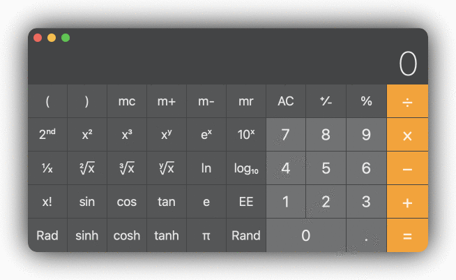
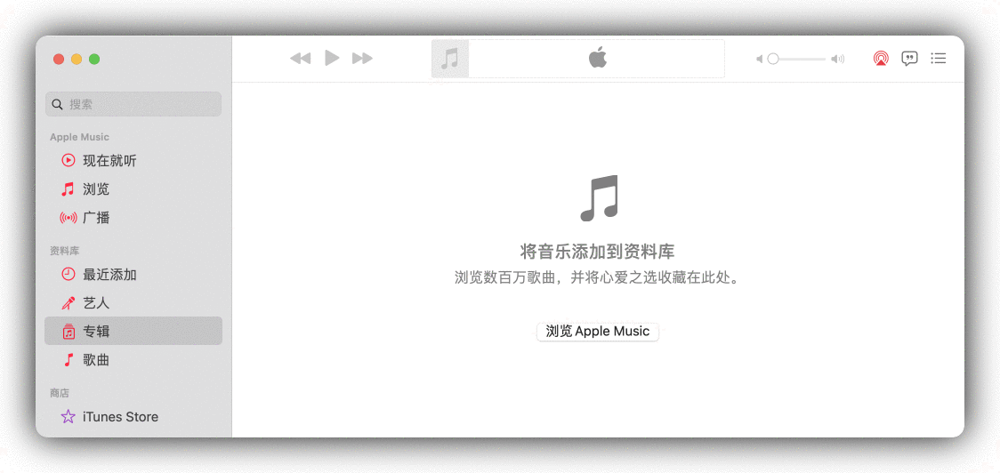
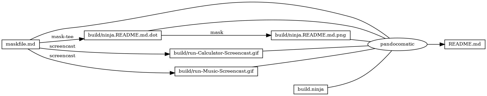
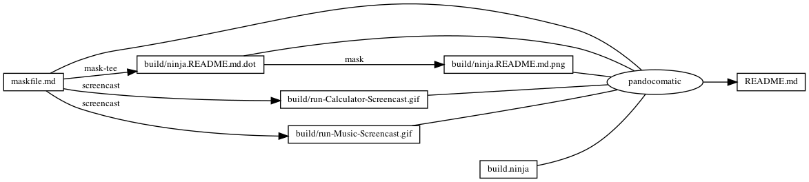

------------------------------------------------------------------------

    pandocomatic_:
        pandoc:
            from: markdown
            to: markdown-fenced_code_attributes
            filter:
            - pandoc-include-code
            output: README.md

...

# iTerm2

# https://github.com/huzhenghui/mask-awesome

## prepare

> Step 1: Prepare. osascript "\${THEATER}/prepare.applescript"

``` bash
if [[ "${THEATER}" == "" ]]; then
    echo "Environment Variable THEATER is required" | lolcat
    $MASK help prepare
    exit 1
fi
THEATER="$(realpath ${THEATER})"
if [[ ! -d "${THEATER}" ]]; then
    echo "${THEATER} is not directory" | lolcat
    $MASK help prepare
    exit 2
fi
PREPARE="${THEATER}/prepare.applescript"
if [[ ! -f "${PREPARE}" ]]; then
    echo "${PREPARE} is not file" | lolcat
    $MASK help prepare
    read -n 1
    exit 3
fi
echo "prepare begin: ${PREPARE}" | lolcat
osascript "${PREPARE}"
echo "prepare done: ${PREPARE}" | lolcat
```

## get-windowname

> Step 2.1: Get WindowName from Environment Variable WINDOWNAME

``` bash
echo "${WINDOWNAME}"
```

## get-windowid

> Step 2.2: Get WindowId By Environment Variable WINDOWNAME

``` bash
if [[ "${WINDOWNAME}" == "" ]]; then
    echo "Can not find Environment Variable WINDOWNAME in $(pwd)" | lolcat >&2
    read -n 1
    exit 1
fi
t-rec --ls-win |
    gawk -v FS='|' 'BEGIN {windowname_regexp = "^\\s*" ENVIRON["WINDOWNAME"] "\\s*$"}{if($1 ~ windowname_regexp){gsub(/\s/, "", $2); print $2}}'
```

## wait-window

> Step 2: Wait until get WindowId success

``` bash
if [[ "${THEATER}" == "" ]]; then
    echo "Environment Variable THEATER is required" | lolcat >&2
    $MASK help prepare
    exit 1
fi
THEATER="$(realpath ${THEATER})"
if [[ ! -d "${THEATER}" ]]; then
    echo "${THEATER} is not directory" | lolcat >&2
    $MASK help prepare
    exit 2
fi
direnv allow "${THEATER}"
WINDOWNAME="$(direnv exec ${THEATER} $MASK get-windowname)"
if [[ "${WINDOWNAME}" == "" ]]; then
    echo "Can not find Environment Variable WINDOWNAME in ${THEATER}" | lolcat >&2
    $MASK help prepare
    read -n 1
    exit 3
fi
echo "wait-window begin: ${WINDOWNAME}" | lolcat >&2
WINDOWID=""
while [[ "${WINDOWID}" == "" ]];
do
    WINDOWID=$"$(direnv exec ${THEATER} $MASK get-windowid)"
done
echo "wait-window done: ${WINDOWID}" | lolcat >&2
echo "${WINDOWID}"
```

## record-window

> Step 3: Record Window while osascript "\${THEATER}/story.applescript"

``` bash
PWD="$(pwd)"
if [[ "${WINDOWID}" == "" ]]; then
    echo "Environment Variable WINDOWID is required" | lolcat >&2
    $MASK help record-window
    exit 1
fi
STORY="${THEATER}/story.applescript"
if [[ ! -f "${STORY}" ]]; then
    echo "${STORY} is not file" | lolcat >&2
    $MASK help record-window
    read -n 1
    exit 2
fi
RECORDER="${MASKFILE_DIR}/recorder"
if [[ ! -f "${RECORDER}/justfile" ]]; then
    echo "Can not find justfile in ${RECORDER}" | lolcat >&2
    $MASK help record-window
    read -n 1
    exit 3
fi
echo "record-window prepare: WINDOWID=${WINDOWID}" | lolcat >&2
echo "record-window prepare: STORY=${STORY}" | lolcat >&2
tempfifo="$(mktemp).pipe"
echo "record-window tempfifo: ${tempfifo}" | lolcat >&2
mkfifo "${tempfifo}"
cd "${RECORDER}"
WINDOWID="${WINDOWID}" TEMPFIFO="${tempfifo}" t-rec just &
T_REC_PID="$!"
cd "${PWD}"
echo "record-window: T_REC_PID=${T_REC_PID}" | lolcat >&2
echo "record-window before story: STORY=${STORY}" | lolcat >&2
osascript "${STORY}"
echo "record-window after story: STORY=${STORY}" | lolcat >&2
cat "${tempfifo}" | lolcat >&2
echo "record-window before wait t-rec: T_REC_PID=${T_REC_PID}" | lolcat >&2
wait "${T_REC_PID}"
echo "record-window after wait t-rec: T_REC_PID=${T_REC_PID}" | lolcat >&2
echo "record-window done: ${WINDOWID}" | lolcat >&2
```

### record-window-justfile

``` justfile
wait:
    echo "just wait start: WINDOWID=${WINDOWID}" | lolcat >&2
    echo "just wait start: TEMPFIFO=${TEMPFIFO}" | lolcat >&2
    echo "${WINDOWID}" > "${TEMPFIFO}"
    echo "just wait done: TEMPFIFO=${TEMPFIFO}" | lolcat >&2
```

## finale

> Step 4: Finale. osascript "\${THEATER}/finale.applescript"

``` bash
if [[ "${THEATER}" == "" ]]; then
    echo "Environment Variable THEATER is required" | lolcat
    $MASK help finale
    exit 1
fi
THEATER="$(realpath ${THEATER})"
if [[ ! -d "${THEATER}" ]]; then
    echo "${THEATER} is not directory" | lolcat
    $MASK help finale
    exit 2
fi
FINALE="${THEATER}/finale.applescript"
if [[ ! -f "${FINALE}" ]]; then
    echo "${FINALE} is not file" | lolcat
    $MASK help finale
    read -n 1
    exit 3
fi
echo "finale begin: ${FINALE}" | lolcat
osascript "${FINALE}"
echo "finale done: ${FINALE}" | lolcat
```

## record

> Step 1~2~3\~4. Accouding to Environment Variable THEATER

``` bash
if [[ "${THEATER}" == "" ]]; then
    echo "Environment Variable THEATER is required" | lolcat
    $MASK help record
    read -n 1
    exit 1
fi
THEATER="$(realpath ${THEATER})"
if [[ ! -d "${THEATER}" ]]; then
    echo "${THEATER} is not directory" | lolcat
    $MASK help record
    read -n 1
    exit 2
fi
echo "record begin: ${THEATER}" | lolcat
$MASK prepare
WINDOWID="$($MASK wait-window)"
echo "record windowid: ${WINDOWID}" | lolcat
export WINDOWID="${WINDOWID}"
$MASK record-window
$MASK finale
echo "record end: ${THEATER}" | lolcat
$MASK iTerm2-quit
exit
```

## iTerm2

> Launch iTerm2 to record. Accouding to Environment Variable THEATER

``` bash
if [[ "${THEATER}" == "" ]]; then
    echo "Environment Variable THEATER is required" | lolcat
    $MASK help iTerm2
    exit 1
fi
THEATER="$(realpath ${THEATER})"
if [[ ! -d "${THEATER}" ]]; then
    echo "${THEATER} is not directory" | lolcat
    $MASK help iTerm2
    exit 2
fi
echo "iTerm2: ${THEATER}" | lolcat
export THEATER="${THEATER}"
osascript -sh ./iTerm2.applescript
```

### iTerm2-iTerm2.applescript

``` applescript
tell application "Finder"
	set parent_path to the container of the (path to me) as text
	set p to POSIX path of parent_path as text
end tell
tell application "iTerm"
	set c to "/bin/zsh -l -c 'cd " & p & "; mask record'"
	set newWindow to (create window with default profile command c)
end tell
set isRunning to true
repeat while isRunning
	delay 1
	tell application "System Events" to set isRunning to exists (processes where name is "iTerm2")
end repeat
```

## iTerm2-quit

> Exit iTerm2

``` bash
osascript -e 'tell application "iTerm" to quit'
```

## run

> Run. Accounding to option --theater

**OPTIONS**

-   theater
    -   flags: -t --theater
    -   type: string
    -   desc: Theater Directory

``` bash
if [[ "${theater}" == "" ]]; then
    echo "OPTIONS: --theater is required" | lolcat
    $MASK help run
    exit 1
fi
THEATER="$(realpath ${theater})"
if [[ ! -d "${THEATER}" ]]; then
    echo "${THEATER} is not directory" | lolcat
    $MASK help run
    exit 2
fi
echo "run: ${THEATER}" | lolcat
export THEATER="${THEATER}"
$MASK iTerm2
```

## run-Calculator

> run --theater "\$(realpath \$MASKFILE_DIR/Calculator)"

``` bash
CALCULATOR_THEATER="$(realpath $MASKFILE_DIR/Calculator)"
echo "run-Calculator: ${CALCULATOR_THEATER}" | lolcat
$MASK run --theater "${CALCULATOR_THEATER}"
```

### run-Calculator-env

``` bash
WINDOWNAME=计算器
```

### run-Calculator-envrc

``` bash
dotenv .env
```

### run-Calculator-prepare.applescript

``` applescript
tell application "Calculator" to activate
```

### run-Calculator-story.applescript

``` applescript
tell application "Calculator" to activate
repeat with i from 1 to 9 by 1
	tell application "System Events" to tell process "Calculator" to keystroke i
	do shell script "/bin/sleep 1"
end repeat
```

### run-Calculator-finale.applescript

``` applescript
tell application "Calculator" to quit
```

### run-Calculator-Screencast



## run-Music

> run --theater "\$(realpath \$MASKFILE_DIR/Music)"

``` bash
MUSIC_THEATER="$(realpath $MASKFILE_DIR/Music)"
echo "run-Music: ${MUSIC_THEATER}" | lolcat
$MASK run --theater "${MUSIC_THEATER}"
```

### run-Music-env

``` bash
WINDOWNAME=音乐
```

### run-Music-envrc

``` bash
dotenv .env
```

### run-Music-prepare.applescript

``` applescript
tell application "Music" to activate
```

### run-Music-story.applescript

``` applescript
tell application "Music" to activate
tell application "System Events" to tell process "Music" to keystroke "f" using {command down}
delay 1
tell application "System Events" to tell process "Music" to (key code 53)
delay 1
tell application "System Events" to tell process "Music" to (key code 126 using {option down})
delay 1
repeat with i from 1 to 5 by 1
	tell application "Music" to activate
	tell application "System Events" to tell process "Music" to (key code 125)
	delay 1
end repeat
```

### run-Music-finale.applescript

``` applescript
tell application "Music" to quit
```

### run-Music-Screencast



## trash-gif

> Trash GIF files in ./recorder/\*.gif

``` bash
trash --force ./recorder/*.gif
```

## begin: mask task in template

## readme

``` bash
ninja --verbose -j 1 README.md
```

### build.ninja

``` ninja
builddir=./build
mask_subcommand = --help

#######################################
# begin: rule in template

rule mask
  command = mask $mask_subcommand

rule mask-tee
  command = mask $mask_subcommand 2>&1 | tee $out 1> /dev/null

rule pandocomatic
  command = pandocomatic --input $in --output $out

# end: rule in template
#######################################

#######################################
# begin: custom rule

rule screencast
  command = mask trash-gif && mask $mask_subcommand && mv ./recorder/t-rec.gif $out

# end: custom rule
#######################################

#######################################
# begin: build in template

build ./build/ninja.README.md.dot: mask-tee | ./maskfile.md
  mask_subcommand = readme-graph-dot

build ./build/ninja.README.md.png : mask | ./build/ninja.README.md.dot
  mask_subcommand = readme-graph-png

# end: build in template
#######################################

#######################################
# begin: custom build

build ./build/run-Calculator-Screencast.gif : screencast | ./maskfile.md
  mask_subcommand = run-Calculator

build ./build/run-Music-Screencast.gif : screencast | ./maskfile.md
  mask_subcommand = run-Music

# end: custom build
#######################################

#######################################
# begin: build README.md
# $ followed by a newline
# escape the newline (continue the current line across a line break).
# the first 4 line in this build is template
build README.md: pandocomatic maskfile.md | $
  build.ninja $
  ./build/ninja.README.md.dot $
  ./build/ninja.README.md.png $
  ./build/run-Calculator-Screencast.gif $
  ./build/run-Music-Screencast.gif

default README.md
# end: build README.md
#######################################
```

## readme-graph-dot

``` bash
ninja -t graph README.md
```

### readme-graph-dot-output



## readme-graph-dot-xdot

``` bash
detach -- xdot "${MASKFILE_DIR}/build/ninja.README.md.dot"
```

## readme-graph-png

``` bash
dot -Tpng -o./build/ninja.README.md.png ./build/ninja.README.md.dot
```



## end: mask task in template
