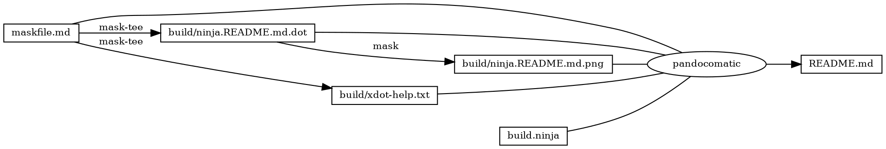
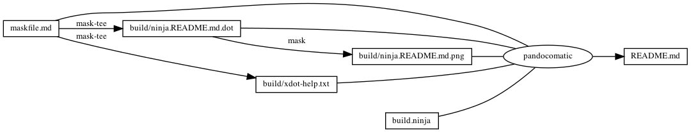

------------------------------------------------------------------------

    pandocomatic_:
        pandoc:
            from: markdown
            to: markdown-fenced_code_attributes
            filter:
            - pandoc-include-code
            output: README.md

...

# xdot

# https://github.com/huzhenghui/mask-awesome

## xdot-help

``` bash
xdot --help
```

### xdot-help-output

``` plain
usage: xdot [-h] [-f FILTER] [-n] [-g GEOMETRY] [--hide-toolbar] [file]

xdot.py is an interactive viewer for graphs written in Graphviz's dot language.

positional arguments:
  file                  input file to be viewed

optional arguments:
  -h, --help            show this help message and exit
  -f FILTER, --filter FILTER
                        graphviz filter: dot, neato, twopi, circo, or fdp
                        [default: dot]
  -n, --no-filter       assume input is already filtered into xdot format (use
                        e.g. dot -Txdot)
  -g GEOMETRY, --geometry GEOMETRY
                        default window size in form WxH
  --hide-toolbar        Hides the toolbar on start.

Shortcuts:
  Up, Down, Left, Right     scroll
  PageUp, +, =              zoom in
  PageDown, -               zoom out
  R                         reload dot file
  F                         find
  Q                         quit
  P                         print
  Escape                    halt animation
  Ctrl-drag                 zoom in/out
  Shift-drag                zooms an area
```

## xdot-open-detach

``` bash
xdot ./build/ninja.README.md.dot &
```

## begin: mask task in template

## readme

``` bash
ninja --verbose README.md
```

### build.ninja

``` ninja
builddir=./build
mask_subcommand = --help

#######################################
# begin: rule in template

rule mask
  command = mask $mask_subcommand

rule mask-tee
  command = mask $mask_subcommand 2>&1 | tee $out 1> /dev/null

rule pandocomatic
  command = pandocomatic --input $in --output $out

# end: rule in template
#######################################

#######################################a
# begin: custom rule

# end: custom rule
#######################################

#######################################
# begin: build in template

build ./build/ninja.README.md.dot: mask-tee | ./maskfile.md
  mask_subcommand = readme-grapth-dot

build ./build/ninja.README.md.png : mask | ./build/ninja.README.md.dot
  mask_subcommand = readme-grapth-png

# end: build in template
#######################################

#######################################a
# begin: custom build

build ./build/xdot-help.txt: mask-tee | ./maskfile.md
  mask_subcommand = xdot-help

# end: custom build
#######################################

#######################################
# begin: build README.md
# $ followed by a newline
# escape the newline (continue the current line across a line break).
# the first 4 line in this build is template
build README.md: pandocomatic maskfile.md | $
  build.ninja $
  ./build/ninja.README.md.dot $
  ./build/ninja.README.md.png $
  ./build/xdot-help.txt

default README.md
# end: build README.md
#######################################
```

## readme-grapth-dot

``` bash
ninja -t graph README.md
```

### readme-grapth-dot-output



## readme-grapth-png

``` bash
dot -Tpng -o./build/ninja.README.md.png ./build/ninja.README.md.dot
```



## end: mask task in template
