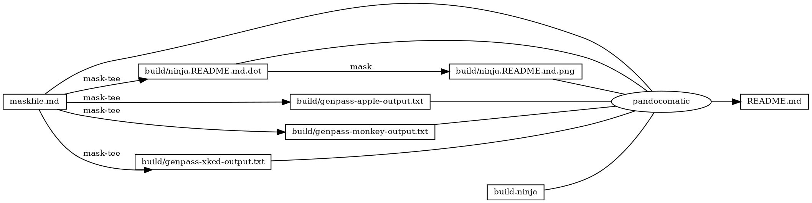

------------------------------------------------------------------------

    pandocomatic_:
        pandoc:
            from: markdown
            to: markdown-fenced_code_attributes
            filter:
            - pandoc-include-code
            output: README.md

...

# genpass

# https://github.com/huzhenghui/mask-awesome

## genpass-apple

``` bash
zsh --interactive -c 'genpass-apple'
```

### genpass-apple-output

``` plain
7iqtoc-hodhis-xendyr-kafsuv-Dofbud-xemrym
```

## genpass-monkey

``` bash
zsh --interactive -c 'genpass-monkey'
```

### genpass-monkey-output

``` plain
pc0hka950npt4qkk4hnnnmhbmc
```

## genpass-xkcd

``` bash
zsh --interactive -c 'genpass-xkcd '
```

### genpass-xkcd-output

``` plain
9-Duroc-suing-loch-Glauke-town-quoin-gradin-vend-occult
```

## begin: mask task in template

## readme

``` bash
ninja --verbose README.md
```

### build.ninja

``` ninja
builddir=./build
mask_subcommand = --help

#######################################
# begin: rule in template

rule mask
  command = mask $mask_subcommand

rule mask-tee
  command = mask $mask_subcommand 2>&1 | tee $out 1> /dev/null

rule pandocomatic
  command = pandocomatic --input $in --output $out

# end: rule in template
#######################################

#######################################
# begin: custom rule

# custom rule here

# end: custom rule
#######################################

#######################################
# begin: build in template

build ./build/ninja.README.md.dot: mask-tee | ./maskfile.md
  mask_subcommand = readme-graph-dot

build ./build/ninja.README.md.png : mask | ./build/ninja.README.md.dot
  mask_subcommand = readme-graph-png

# end: build in template
#######################################

#######################################
# begin: custom build

build ./build/genpass-apple-output.txt: mask-tee | ./maskfile.md
  mask_subcommand = genpass-apple

build ./build/genpass-monkey-output.txt: mask-tee | ./maskfile.md
  mask_subcommand = genpass-monkey

build ./build/genpass-xkcd-output.txt: mask-tee | ./maskfile.md
  mask_subcommand = genpass-xkcd

# end: custom build
#######################################

#######################################
# begin: build README.md
# $ followed by a newline
# escape the newline (continue the current line across a line break).
# the first 4 line in this build is template
build README.md: pandocomatic maskfile.md | $
  build.ninja $
  ./build/ninja.README.md.dot $
  ./build/ninja.README.md.png $
  ./build/genpass-apple-output.txt $
  ./build/genpass-monkey-output.txt $
  ./build/genpass-xkcd-output.txt

default README.md
# end: build README.md
#######################################
```

## readme-graph-dot

``` bash
ninja -t graph README.md
```

### readme-graph-dot-output



## readme-graph-dot-xdot

``` bash
detach -- xdot "${MASKFILE_DIR}/build/ninja.README.md.dot"
```

## readme-graph-png

``` bash
dot -Tpng -o./build/ninja.README.md.png ./build/ninja.README.md.dot
```


## end: mask task in template
